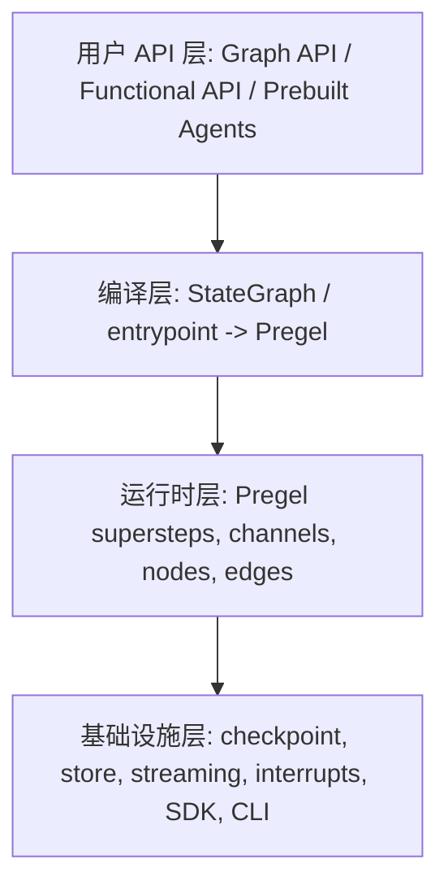
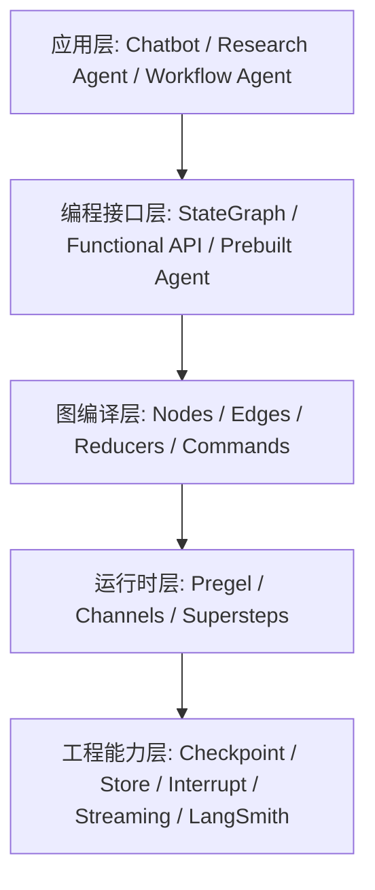
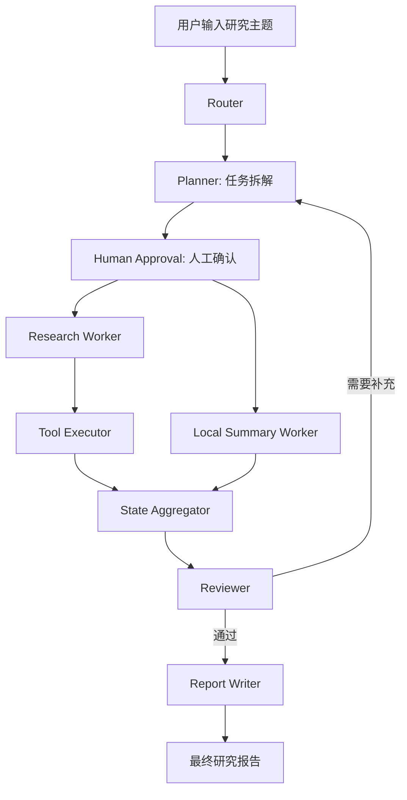

# Codex 会话归档：分析 LangGraph 架构

- 会话 ID：`019f4bed-8d36-7b61-a31d-9479e3b924c5`
- 标题：分析 LangGraph 架构
- 原工作目录：`D:\writer\my-prompt-skills\AI-Study`
- 归档日期：2026-07-10

## 目录

1. LangGraph 架构、模块与技术组件分析
2. 《LangGraph Agent 开发指南》书籍大纲设计

---

## 1. LangGraph 架构、模块与技术组件分析

### 用户请求

探索并了解析构建AI Agent的功能在 [langchain-ai/langgraph](https://github.com/langchain-ai/langgraph)仓库中的工作方式，深入分析langgraph架构设计，模块构成和功能，技术组件构成和功能，一一进行详细分析

### 助手回复

下面是基于 `langchain-ai/langgraph` 当前 `main` 仓库与官方文档做的架构拆解。时间点：2026-07-10，GitHub 显示最新发布为 `langgraph==1.2.9`。仓库定位很明确：LangGraph 不是“又一个高级 Agent 封装”，而是构建长时运行、有状态、可恢复 Agent 的底层编排运行时。官方 README 也把它定义为 “low-level orchestration framework for building stateful agents”，并强调 durable execution、human-in-the-loop、memory、debugging、deployment 等能力。来源见 [GitHub README](https://github.com/langchain-ai/langgraph) 与 [LangGraph overview](https://docs.langchain.com/oss/python/langgraph/overview)。

**1. 总体架构**

LangGraph 的核心架构可以理解为四层：

它把 Agent 任务建模为“有状态图”：`State` 是共享状态，`Node` 是执行逻辑，`Edge` 是路由规则。官方 Graph API 文档说，LangGraph 用 state、nodes、edges 组合复杂循环工作流，底层是受 Pregel 启发的 message passing / super-step 执行模型：并行节点处在同一个 super-step，顺序节点处在不同 super-step，直到没有活跃节点和在途消息为止。见 [Graph API overview](https://docs.langchain.com/oss/python/langgraph/graph-api)。

**2. 仓库模块构成**

当前仓库是 monorepo，`libs/` 下主要包包括：`langgraph` 核心库、`prebuilt` 预构建 Agent/工具节点、`checkpoint` 基础 checkpoint 协议、`checkpoint-sqlite`、`checkpoint-postgres`、`checkpoint-conformance`、`cli`、`sdk-py`、`sdk-js`。GitHub 文件树可见这些目录。见 [libs directory](https://github.com/langchain-ai/langgraph/tree/main/libs)。

`libs/langgraph/langgraph/` 是核心 Python 包，主要目录有：`graph`、`pregel`、`channels`、`managed`、`func`、`stream`、`store` 相关接口、`runtime.py`、`types.py`、`errors.py`。其中 `graph` 面向用户声明图，`pregel` 是运行时核心，`channels` 决定状态更新方式，`func` 实现 Functional API，`stream` 负责事件和流式输出。见 [core package tree](https://github.com/langchain-ai/langgraph/tree/main/libs/langgraph/langgraph)。

**3. Agent 构建工作方式**

典型 Graph API Agent 的工作流是：

1. 定义状态：通常是 `TypedDict`、`dataclass` 或 Pydantic 模型。
2. 定义节点：例如 `llm_call`、`tool_node`、`human_review`。
3. 定义边：普通边固定跳转，条件边根据状态决定下一步。
4. 编译：`StateGraph(...).add_node(...).add_edge(...).compile()`。
5. 执行：`invoke`、`stream`、`ainvoke`、`astream`。
6. 持久化：如果传入 checkpointer，则按 `thread_id` 保存状态，可恢复、回放、interrupt。

官方 quickstart 的计算器 Agent 就是这个模式：LLM 节点判断是否调用工具，工具节点执行工具，条件边决定回到 LLM 还是结束。见 [Quickstart](https://docs.langchain.com/oss/python/langgraph/quickstart)。

**4. StateGraph 与状态模型**

`StateGraph` 是主要图构建器。源码文档直接说明：节点通过读写共享 state 通信，每个节点签名近似为 `State -> Partial`，每个 state key 可通过 reducer 聚合多个节点的更新。见 [state.py](https://raw.githubusercontent.com/langchain-ai/langgraph/main/libs/langgraph/langgraph/graph/state.py)。

状态并不是每次都整体替换。节点通常只返回 partial update，例如 `{"messages": [...]}`。每个字段有自己的 reducer：默认 reducer 覆盖旧值；自定义 reducer 可追加、合并、累积。消息型 Agent 常用 `add_messages` 或内置 `MessagesState`，它把 `messages` 作为 `AnyMessage` 列表并自动追加更新。见 [reducers 与 MessagesState](https://docs.langchain.com/oss/python/langgraph/graph-api)。

**5. Edges、Send、Command**

边是 Agent 控制流核心：

- 普通边：`A -> B`，固定执行。
- 条件边：执行路由函数，按状态决定下一节点。
- `Send`：动态 fan-out，适合 map-reduce，让同一节点对多个不同输入并行运行。
- `Command`：把“更新状态”和“跳转节点”合并在一个返回值中，也用于 interrupt resume。

官方文档特别提醒，同一个节点不要混用普通边和动态路由，否则两个路径都可能执行。`Command` 支持 `update`、`goto`、`graph`、`resume`，在多 Agent handoff、子图跳转、人类恢复输入时很关键。见 [Edges / Send / Command](https://docs.langchain.com/oss/python/langgraph/graph-api)。

**6. Pregel 运行时**

`pregel` 是 LangGraph 的真正执行内核。源码中 `Pregel` 类说明它把应用组合为 actors 与 channels：actor 读取 channel、写入 channel；运行遵循 Bulk Synchronous Parallel 模型，每步分三阶段：

- Plan：决定本轮哪些 actor 要执行。
- Execution：并行执行这些 actor，本轮写入对其他 actor 不可见。
- Update：把本轮写入应用到 channels，进入下一轮。

这解释了为什么 LangGraph 能天然支持并行节点、循环、多 Agent 协作和确定性的状态推进。见 [Pregel main.py](https://raw.githubusercontent.com/langchain-ai/langgraph/main/libs/langgraph/langgraph/pregel/main.py) 与 [pregel tree](https://github.com/langchain-ai/langgraph/tree/main/libs/langgraph/langgraph/pregel)。

**7. Channels 与 Reducers**

channels 是 Pregel 层的数据通道，也是 StateGraph 字段更新的底层抽象。源码文档列出基础 channel：`LastValue` 存最后值，`Topic` 做 pub/sub 与多值累积；高级 channel 如 `BinaryOperatorAggregate` 用二元操作持续聚合。StateGraph 的 reducer 最终会映射到这类 channel 更新机制。见 [Pregel channels 源码说明](https://raw.githubusercontent.com/langchain-ai/langgraph/main/libs/langgraph/langgraph/pregel/main.py)。

**8. Persistence、Checkpoint 与 Memory**

LangGraph 的持久化分两类：checkpointer 和 store。checkpointer 保存单个 thread 的图状态快照，用于短期记忆、会话连续性、human-in-the-loop、time travel、fault tolerance；store 保存跨 thread 的应用级长期记忆，比如用户偏好、事实、共享知识。见 [Persistence](https://docs.langchain.com/oss/python/langgraph/persistence)。

`BaseCheckpointSaver` 的 checkpoint 数据结构包含 `channel_values`、`channel_versions`、`versions_seen`、`updated_channels` 等。`versions_seen` 用来判断节点见过哪些 channel 版本，从而决定下一步哪些节点应执行。生产通常用 Postgres saver；`InMemorySaver` 源码明确说只适合调试或测试。见 [checkpoint base](https://raw.githubusercontent.com/langchain-ai/langgraph/main/libs/checkpoint/langgraph/checkpoint/base/__init__.py) 与 [InMemorySaver](https://raw.githubusercontent.com/langchain-ai/langgraph/main/libs/checkpoint/langgraph/checkpoint/memory/__init__.py)。

**9. Interrupt 与 Human-in-the-loop**

`interrupt()` 可以在节点内部暂停执行，保存当前状态，等待外部输入。恢复时用 `Command(resume=...)`，这个值会成为节点里 `interrupt()` 调用的返回值。它依赖 checkpointer 和 `thread_id`，所以 `thread_id` 本质上是持久化游标。见 [Interrupts](https://docs.langchain.com/oss/python/langgraph/interrupts)。

**10. Prebuilt Agent**

`libs/prebuilt` 提供 `ToolNode`、工具验证、以及旧的 `create_react_agent`。当前源码中 `create_react_agent` 已标记 deprecated，迁移方向是 `langchain.agents.create_agent`，但它仍清楚展示了 LangGraph Agent 的经典结构：`agent` 节点调用模型，如果 AIMessage 有 `tool_calls`，路由到 `tools` 节点；工具结果作为 `ToolMessage` 写回 `messages`，再回到 `agent`，直到没有工具调用。`v2` 模式用 `Send` 把多个 tool call 分发给多个工具节点实例。见 [prebuilt tree](https://github.com/langchain-ai/langgraph/tree/main/libs/prebuilt/langgraph/prebuilt) 与 [chat_agent_executor.py](https://raw.githubusercontent.com/langchain-ai/langgraph/main/libs/prebuilt/langgraph/prebuilt/chat_agent_executor.py)。

**核心判断**

LangGraph 的架构优势不在“帮你写 prompt”，而在把 Agent 运行过程工程化：状态有 schema，更新有 reducer，执行有 super-step，分支有 edges/Command，副作用可通过 checkpoint 恢复，人工介入可 interrupt，观测可 streaming/LangSmith。它更像 Agent 的状态机内核和工作流运行时，而不是一个简单的聊天机器人框架。

---

## 2. 《LangGraph Agent 开发指南》书籍大纲设计

### 用户请求

如果要写一个关于langgraph guide的书籍，从简单到复杂，先从langgraph的整体概念和架构图来介绍langgraph框架，然后从实际编写langgraph程序来应用langgraph，并能实际运行的例子，大模型都是用ollama和deepseek，然后一一分析整体架构、模块设计、主要模块原理分析，最后给出一个完整复杂langgraph例子，结束本书。

按照上面的内容安排要求来写本书，先设计本书的大纲、主题和主题下的子标题以及子标题的核心内容简介，下面开始设计

### 助手回复

下面是这本书的设计稿。我的建议是采用“概念架构 → 最小可运行程序 → 模块原理 → 工程化能力 → 复杂完整案例”的阶梯式路线。它比“API 手册式目录”更适合读者真正学会 LangGraph，因为 LangGraph 的难点不在语法，而在状态、图、循环、持久化、人机协作和 Agent 架构思维。

**书名建议**

《LangGraph Agent 开发指南：从图架构到可运行智能体系统》

副标题：基于 Ollama 与 DeepSeek 构建可持久化、可恢复、可观测的 AI Agent

**读者定位**

面向已经会 Python、用过大模型 API 或 LangChain 基础组件，但还没有系统掌握 LangGraph 的开发者。目标不是“看懂示例”，而是能独立设计一个复杂 Agent 系统。

**全书主线**

全书围绕一个核心问题展开：如何把一个简单 LLM 调用，逐步演化成一个有状态、有工具、有记忆、可中断、可恢复、可部署的复杂 Agent 应用。

### 第一部分：认识 LangGraph

#### 第 1 章：为什么需要 LangGraph

核心内容：解释传统 LLM 应用、Chain、Agent Executor 的局限：状态难管理、循环控制弱、错误恢复困难、人类介入不自然。引出 LangGraph 的核心价值：用图结构组织 Agent，用状态驱动执行，用 checkpoint 支持长时任务。

#### 第 2 章：LangGraph 的整体概念模型

核心内容：介绍 State、Node、Edge、Graph、Reducer、Checkpoint、Thread、Command、Interrupt 等核心概念。重点说明 LangGraph 不是简单工作流工具，而是一个面向 Agent 的状态图运行时。

#### 第 3 章：LangGraph 架构总览图

核心内容：用架构图解释四层结构：

说明每层解决什么问题，以及读者后续章节会如何逐层深入。

### 第二部分：环境搭建与第一个程序

#### 第 4 章：开发环境准备

核心内容：安装 Python、LangGraph、LangChain 相关包；安装 Ollama；拉取本地模型，例如 `qwen`、`llama3`、`deepseek-r1` 等；配置 DeepSeek API。说明本书统一使用 Ollama 与 DeepSeek，不依赖 OpenAI。

#### 第 5 章：第一个 LangGraph 程序

核心内容：从最小 `StateGraph` 开始，实现一个只有一个节点的问答程序。读者将看到：定义状态、定义节点、添加边、编译图、运行图。

#### 第 6 章：从线性调用到图调用

核心内容：对比普通函数调用、LangChain Chain、LangGraph 图调用。展示为什么图结构更适合多步骤 Agent：状态可以被多个节点共享，流程可以分支，节点可以循环。

### 第三部分：核心编程模型

#### 第 7 章：State 状态设计

核心内容：讲解 TypedDict、Pydantic、MessagesState 的使用。重点分析“状态是 Agent 的工作记忆”，以及如何区分输入状态、运行中状态、输出状态。

#### 第 8 章：Node 节点设计

核心内容：节点本质是函数。讲解 LLM 节点、工具节点、判断节点、汇总节点。说明节点应该保持职责单一，避免把完整 Agent 逻辑塞进一个函数。

#### 第 9 章：Edge 与条件路由

核心内容：介绍普通边、条件边、`START`、`END`。实现一个能根据用户问题选择“直接回答”或“调用工具”的 Agent。

#### 第 10 章：Reducer 与状态合并

核心内容：解释为什么多个节点可能同时更新同一个状态字段。讲解覆盖式 reducer、追加式 reducer、消息 reducer，以及 reducer 对并行执行的意义。

#### 第 11 章：Command、Send 与动态控制流

核心内容：讲解 `Command` 如何同时完成状态更新和跳转；`Send` 如何实现 map-reduce、并行任务拆分。通过“批量总结多篇文章”的例子展示动态 fan-out。

### 第四部分：用 Ollama 与 DeepSeek 构建真实 Agent

#### 第 12 章：接入 Ollama 本地模型

核心内容：使用 Ollama 作为本地 LLM 后端，构建离线可运行 Agent。讲解模型选择、响应速度、上下文长度、推理模型与普通对话模型的差异。

#### 第 13 章：接入 DeepSeek

核心内容：使用 DeepSeek API 构建更强推理能力的 Agent。说明如何把模型调用封装为 LangGraph 节点，并设计可替换的模型接口。

#### 第 14 章：工具调用 Agent

核心内容：实现一个带工具的 ReAct 风格 Agent。工具包括计算器、文件读取、网页摘要或本地知识检索。分析 `LLM -> Tool -> LLM` 循环的运行过程。

#### 第 15 章：多模型协作

核心内容：设计 Ollama 负责本地快速分类，DeepSeek 负责复杂推理的组合架构。展示一个“轻模型路由 + 强模型回答”的 Agent。

### 第五部分：LangGraph 内部原理分析

#### 第 16 章：Pregel 运行时原理

核心内容：解释 LangGraph 底层受 Pregel 启发的 superstep 执行模型：Plan、Execution、Update。说明为什么它天然适合并行、循环、状态传播。

#### 第 17 章：Channel 机制

核心内容：分析 Channel 如何承载状态变化。介绍 LastValue、Topic、BinaryOperatorAggregate 等概念，解释它们与 reducer 的关系。

#### 第 18 章：Checkpoint 持久化机制

核心内容：讲解 checkpoint 保存什么：状态值、channel 版本、节点执行进度。展示如何用 MemorySaver、SQLite、Postgres 保存会话。

#### 第 19 章：Thread 与长期对话

核心内容：解释 `thread_id` 的意义。实现一个可恢复聊天 Agent：关闭程序后重新启动，仍能继续上一轮对话。

#### 第 20 章：Interrupt 与 Human-in-the-loop

核心内容：实现人工审批流程。Agent 在关键节点暂停，等待人类确认后继续执行。适合审批、代码修改、邮件发送、金融决策等场景。

#### 第 21 章：Streaming 与可观测性

核心内容：讲解 token 流、事件流、状态流。展示如何实时观察 Agent 正在执行哪个节点、调用了什么工具、状态如何变化。

### 第六部分：模块设计与工程化实践

#### 第 22 章：如何设计一个 LangGraph 项目结构

核心内容：给出推荐目录结构：`graphs/`、`nodes/`、`tools/`、`models/`、`state/`、`checkpoints/`、`config/`、`tests/`。说明模块边界。

#### 第 23 章：状态模块设计

核心内容：如何把状态 schema 独立出来，避免状态字段混乱。讲解输入状态、内部状态、输出状态、持久化状态的分层。

#### 第 24 章：节点模块设计

核心内容：如何编写可测试、可复用的节点。节点不直接依赖全局配置，而是通过依赖注入或运行时上下文获得模型、工具、存储。

#### 第 25 章：工具模块设计

核心内容：工具的输入输出 schema、错误处理、超时控制、权限边界。强调工具节点是 Agent 与外部世界交互的风险点。

#### 第 26 章：错误处理与重试

核心内容：处理模型失败、工具失败、JSON 解析失败、网络错误、用户中断。设计 fallback 模型：Ollama 不可用时切换 DeepSeek，或反过来。

#### 第 27 章：测试 LangGraph 应用

核心内容：单测节点、测试路由函数、模拟 LLM 输出、测试完整图运行。说明如何不用真实大模型也能测试 Agent 逻辑。

### 第七部分：进阶 Agent 架构

#### 第 28 章：Router Agent

核心内容：构建一个根据任务类型分派到不同子图的 Agent。比如写作、问答、代码分析、搜索总结分别走不同路径。

#### 第 29 章：Supervisor 多 Agent 架构

核心内容：一个 Supervisor 节点负责任务拆解和调度，多个 Worker 节点负责执行。分析多 Agent 协作中的状态共享、任务边界和结果汇总。

#### 第 30 章：Plan-and-Execute Agent

核心内容：实现“先规划、再执行、再反思”的复杂流程。规划器用 DeepSeek，执行器可用 Ollama 工具模型，最后由审查节点校验结果。

#### 第 31 章：RAG Agent 与知识库

核心内容：结合本地向量库，实现知识检索、上下文注入、答案生成、引用来源。重点分析 RAG 在 LangGraph 中如何拆成检索节点、过滤节点、回答节点。

#### 第 32 章：Reflection 与自我修正

核心内容：实现生成、批判、修订循环。展示如何控制最大循环次数，避免 Agent 无限反思。

### 第八部分：完整复杂案例

#### 第 33 章：案例需求：智能研究助理 Agent

核心内容：定义最终项目：输入一个研究主题，Agent 自动拆解问题、检索资料、调用工具、总结内容、人工确认方向、生成研究报告。

#### 第 34 章：系统架构设计

核心内容：完整架构包括 Router、Planner、Researcher、Tool Executor、Reviewer、Writer、Memory、Checkpoint、Human Approval。给出整体图：

#### 第 35 章：状态与模块实现

核心内容：设计完整状态结构：用户主题、计划、子任务、资料、工具结果、审查意见、最终报告。逐个实现模块。

#### 第 36 章：接入 Ollama 与 DeepSeek

核心内容：Ollama 用于本地摘要、分类、轻量判断；DeepSeek 用于复杂规划、推理审查、最终报告生成。说明模型分工策略。

#### 第 37 章：加入持久化、恢复与人工审批

核心内容：用 checkpoint 保存执行过程。Agent 在计划完成后暂停，等待用户批准；失败后可从中间节点恢复。

#### 第 38 章：完整运行与结果分析

核心内容：运行完整案例，展示输入、节点执行轨迹、状态变化、模型调用、工具调用、最终输出。逐段分析这个复杂 Agent 如何体现全书所有知识点。

#### 第 39 章：从示例到生产

核心内容：讨论部署、日志、成本控制、模型 fallback、安全边界、权限控制、任务队列、监控与调试。把书中的示例提升到工程实践层面。

### 结语：重新理解 Agent

核心内容：总结 LangGraph 的核心思想：Agent 不是一个 prompt，也不是一次模型调用，而是一个围绕状态、工具、控制流、记忆和恢复能力组织起来的运行系统。读者最终应掌握“用图设计智能体”的思维方式。

这个大纲的节奏是：先让读者建立完整心智模型，再写小程序获得手感，然后拆开 LangGraph 的内部机制，最后合成一个复杂工程案例。下一步最适合扩写的是第 1 章和第 2 章，因为它们会决定整本书的叙事口径。
