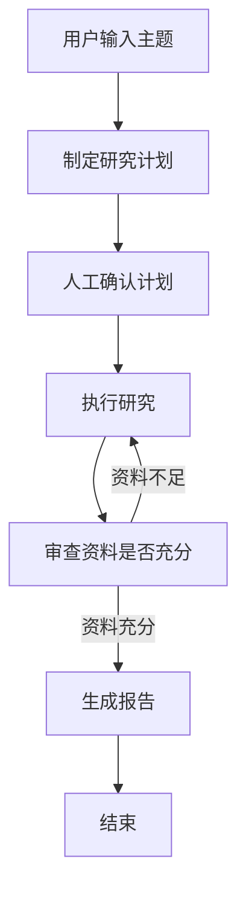
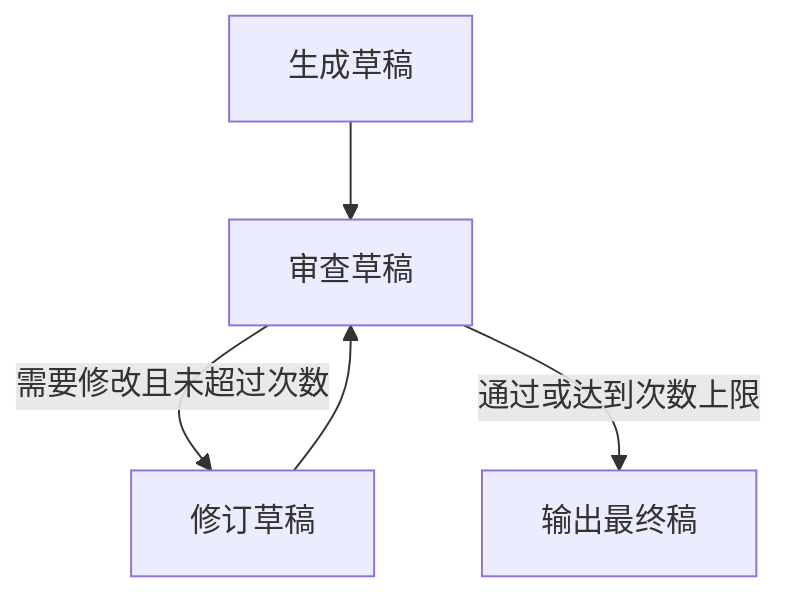
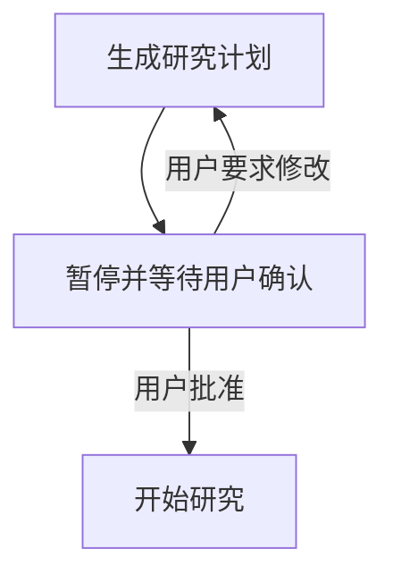

# 第1章-为什么需要LangGraph

## 1.1 从一个看似简单的助手开始

先想象一个很普通的需求：我们要写一个“研究助手”。用户输入一个主题，例如：

> 请帮我研究一下 LangGraph 的核心架构，并整理成一份报告。

第一版实现通常很直接。我们把用户问题拼进 prompt，调用一次大模型，然后把结果打印出来。

```python
def ask_model(topic: str) -> str:
    prompt = f"请围绕下面主题写一份研究报告：{topic}"
    return llm.invoke(prompt)


report = ask_model("LangGraph 的核心架构")
print(report)
```

这个程序能跑，也确实能生成一段看起来不错的文字。但只要需求稍微真实一点，问题马上出现。

用户可能希望它先列研究计划，再根据计划查资料，再总结资料，再判断资料是否足够，最后生成报告。用户还可能希望在“研究计划”出来之后先人工确认一下方向。如果中途网络失败，程序最好不要从头开始。如果模型生成的内容不符合要求，系统应该能回到前一步补充资料。更进一步，如果这个任务要运行几分钟甚至几十分钟，我们还希望随时看到它正在执行哪一步。

这时候，原来的“一次模型调用”就不够用了。

我们开始写第二版：

```python
def research(topic: str) -> str:
    plan = llm.invoke(f"为这个主题制定研究计划：{topic}")
    materials = search_web(plan)
    summary = llm.invoke(f"总结这些资料：{materials}")
    report = llm.invoke(f"根据总结写报告：{summary}")
    return report
```

第二版比第一版更像一个工作流，但它仍然很脆弱。它把所有步骤都塞进一个函数里，状态藏在局部变量中，失败之后很难恢复，用户也很难在中间插手。只要我们想加入分支、循环、工具调用、人工审批、持久化和调试，这个函数就会越来越长，最后变成一团难以维护的控制逻辑。

LangGraph 要解决的，就是这种问题。

它不是为了让一次模型调用变得更花哨，而是为了让一个复杂 Agent 的运行过程变得可组织、可追踪、可恢复、可扩展。

## 1.2 传统 LLM 应用的第一个瓶颈：状态难管理

大模型本身是无状态的。你每次调用模型，本质上都是把一段上下文发给它，然后得到一个输出。模型不会天然记住上一步发生了什么，也不会知道你的程序刚刚调用过哪个工具、拿到了什么结果、用户是否批准了某个计划。

在简单聊天程序里，我们通常用 `messages` 列表保存历史消息：

```python
messages = []

messages.append({"role": "user", "content": "你好"})
response = llm.invoke(messages)
messages.append({"role": "assistant", "content": response})
```

这对聊天够用，但对 Agent 不够。因为 Agent 的状态不只有聊天记录，还可能包括：

- 用户的原始任务
- 当前执行计划
- 已完成的子任务
- 待执行的子任务
- 工具调用结果
- 中间推理结果
- 审查意见
- 人工审批结果
- 最终输出

如果这些状态都散落在函数变量、全局变量、数据库字段和临时文件里，程序很快就会失控。你很难回答几个关键问题：

- 当前 Agent 到底执行到哪一步了？
- 某个节点为什么会得到这个输入？
- 上一次工具调用的结果在哪里？
- 如果程序崩溃，应该从哪里恢复？
- 如果两个步骤同时更新同一个状态字段，谁说了算？

LangGraph 的第一个核心价值，就是把状态提升为 Agent 设计的中心。

在 LangGraph 里，我们会显式定义一个 `State`。节点读取这个状态，也只返回自己要更新的那部分状态。整个 Agent 不再是一串临时变量，而是一张围绕状态流动的图。

```python
from typing import TypedDict


class ResearchState(TypedDict):
    topic: str
    plan: str
    materials: list[str]
    report: str
```

这个变化看起来很小，但它改变了 Agent 的设计方式：我们不再只问“下一行代码做什么”，而是问“这个节点读取什么状态、更新什么状态、之后应该去哪里”。

## 1.3 第二个瓶颈：流程不是直线，而是图

很多初学者会把 Agent 想成一条直线：

```text
用户输入 -> 模型回答 -> 结束
```

但真实 Agent 往往不是这样。一个工具调用 Agent 的流程更像这样：

```text
用户输入
  -> 模型判断是否需要工具
  -> 如果需要工具，调用工具
  -> 把工具结果交回模型
  -> 模型再次判断是否需要工具
  -> 如果不需要工具，输出答案
```

这里已经出现了循环。模型可能调用一次工具，也可能调用三次工具，也可能一次都不调用。流程不是固定长度的管道，而是由状态决定的动态路径。

再看研究助手：

```text
制定计划
  -> 人工确认
  -> 执行研究
  -> 审查结果
  -> 如果资料不足，回到执行研究
  -> 如果资料充分，生成报告
```

这也不是直线，而是一张有分支、有回路、有终点的图。

传统函数当然也能写出分支和循环：

```python
while True:
    result = run_step()
    if result.need_more_work:
        continue
    break
```

问题在于，当流程变复杂之后，控制逻辑会和业务逻辑混在一起。函数里既有模型调用，又有工具调用，又有状态更新，又有路由判断，又有错误处理。最后读代码的人很难看清系统结构。

LangGraph 用 `Node` 和 `Edge` 把这些东西拆开。

- `Node` 负责做一件事，例如调用模型、调用工具、生成计划、审查结果。
- `Edge` 负责决定下一步去哪，例如从计划节点到审批节点，或者从审查节点回到研究节点。
- `Conditional Edge` 负责根据状态做路由，例如“资料不足就继续研究，资料足够就写报告”。

于是，一个 Agent 不再是一大段嵌套代码，而是一张可以被阅读、测试和调试的状态图。



这就是 LangGraph 名字里的 Graph：它让 Agent 的控制流显式成为一张图。

## 1.4 第三个瓶颈：循环控制很容易失控

Agent 最有用的能力之一，是可以反复尝试。它可以先生成答案，再审查答案，再修正答案。它可以先调用工具，再根据工具结果决定是否继续调用。它可以先写计划，再发现计划不完整，然后补充计划。

但循环也是 Agent 最危险的地方。

如果没有清晰的控制机制，Agent 很容易进入无限循环：

```text
模型认为需要工具
-> 调用工具
-> 模型看完工具结果后仍然认为需要工具
-> 再次调用工具
-> 继续循环
```

或者：

```text
生成草稿
-> 批判草稿
-> 修订草稿
-> 再批判
-> 再修订
-> 永远觉得还可以更好
```

在普通代码里，我们可以加计数器、加 `break`、加各种判断。但这些判断一多，流程意图又会被埋进代码细节里。

LangGraph 的做法是：让循环成为图的一部分，让终止条件成为路由的一部分。

例如，一个反思型写作 Agent 可以被设计成：



这个图直接告诉读者：系统允许循环，但循环有边界。循环不是隐藏在某个 `while` 里的临时技巧，而是架构的一部分。

这对 Agent 工程非常重要。因为 Agent 的复杂性，往往不是来自单个模型调用，而是来自“模型调用之间如何相互连接”。

## 1.5 第四个瓶颈：失败之后难以恢复

真实应用一定会失败。模型 API 可能超时，工具可能报错，网络可能断开，机器可能重启，用户可能关闭页面。

如果一个 Agent 已经运行了 20 分钟，完成了 8 个步骤，却在第 9 个步骤失败，我们当然不希望它从头开始。

普通脚本通常缺少这种恢复能力：

```python
plan = make_plan(topic)
materials = collect_materials(plan)
draft = write_draft(materials)
review = review_draft(draft)
final = revise(draft, review)
```

如果 `review_draft` 失败，前面几个步骤的中间状态可能只存在内存里。程序一退出，这些状态就丢了。你可以手动把每一步保存到数据库，但这会带来一套新的复杂性：保存什么、什么时候保存、怎么恢复、恢复后从哪一步继续？

LangGraph 把这个问题纳入运行时。它提供 checkpoint 机制，可以把图执行过程中的状态保存下来。只要配置了 checkpointer，并为一次会话提供 `thread_id`，LangGraph 就能围绕这个 thread 保存执行快照。

这意味着：

- 程序中断后可以继续执行。
- 用户可以回到某个历史状态。
- 人工审批可以暂停在中间节点。
- 长任务不必依赖单次进程生命周期。

这也是 LangGraph 和普通工作流代码的一个关键差异：它不是只关心“怎么执行下一步”，也关心“执行过程如何被保存和恢复”。

## 1.6 第五个瓶颈：人类介入不自然

很多 Agent 场景不能完全自动化。

比如：

- Agent 准备发送一封邮件，发送前需要用户确认。
- Agent 准备修改代码，修改前需要用户批准方案。
- Agent 做金融、法律、医疗相关判断时，需要人类审查。
- Agent 制定研究计划后，需要用户确认方向是否正确。

如果用普通函数写，人工介入通常会变得很别扭。程序要么阻塞等待输入，要么把中间状态保存到外部系统，再写一堆恢复逻辑。

LangGraph 的 `interrupt` 机制就是为这种场景设计的。一个节点可以在关键位置暂停，把当前状态保存下来，等待外部输入。用户确认后，程序再从暂停点继续。

这让 Human-in-the-loop 不再是外挂能力，而是 Agent 图执行模型的一部分。

研究助手可以这样设计：



这种方式比“在函数中间写 input()”更适合真实产品。因为真实产品里的用户确认可能来自网页按钮、聊天窗口、后台审批系统，而不一定来自命令行。

## 1.7 第六个瓶颈：调试 Agent 比调试普通程序更难

普通程序出错时，我们通常看日志、断点、堆栈。Agent 出错时，问题更隐蔽。

它可能没有报错，只是走错了路径。它可能调用了错误的工具。它可能把旧状态当成新状态。它可能在某一次模型输出里生成了不符合预期的结构。它也可能看起来成功了，但中间某个节点已经丢失了重要信息。

因此，我们需要观察的不只是最终答案，还包括：

- 当前执行到哪个节点
- 每个节点收到什么状态
- 每个节点返回什么状态更新
- 条件路由为什么选择某条边
- 工具调用了什么参数
- checkpoint 里保存了什么
- token 或事件是否可以流式输出

LangGraph 的图结构和流式事件能力，让这些观察变得更自然。我们可以按节点理解执行过程，而不是只看到一个黑盒模型输出。

这也是为什么 LangGraph 很适合复杂 Agent：复杂 Agent 的核心挑战不是“能不能调用模型”，而是“能不能理解模型调用之间发生了什么”。

## 1.8 LangGraph 到底带来了什么

到这里，我们可以把 LangGraph 的价值收束成一句话：

> LangGraph 把 Agent 从“一段调用大模型的代码”，提升为“一个围绕状态图运行的可恢复系统”。

它至少解决了六类问题：

| 问题 | 普通写法的困难 | LangGraph 的对应能力 |
| --- | --- | --- |
| 状态管理 | 状态散落在变量、消息、数据库中 | 显式 `State` 和 reducer |
| 流程组织 | 分支、循环和业务逻辑混杂 | `Node`、`Edge`、条件路由 |
| 循环控制 | 容易无限循环或难以读懂 | 图上的回路和终止条件 |
| 失败恢复 | 程序崩溃后中间状态丢失 | checkpoint 和 `thread_id` |
| 人工介入 | 暂停、审批、恢复逻辑复杂 | `interrupt` 和 `Command(resume=...)` |
| 调试观测 | 只能看最终输出或散乱日志 | streaming、节点事件、状态快照 |

当然，LangGraph 不是所有 LLM 应用都必须使用的框架。如果你的需求只是“一问一答”，或者只是一个固定的三步文本处理流程，普通函数和简单 Chain 可能更轻。

但只要你的应用出现下面任何一个特征，就应该认真考虑 LangGraph：

- 需要多步骤执行
- 需要分支或循环
- 需要工具调用
- 需要保存和恢复状态
- 需要人工审批
- 需要长期会话
- 需要观察 Agent 的执行过程
- 需要把多个 Agent 或多个子流程组合起来

## 1.9 本章小结

本章没有急着讲 LangGraph 的 API，而是从一个研究助手的例子出发，看到普通 LLM 程序在真实场景中会遇到的结构性问题。

一次模型调用可以生成答案，但它不能自然表达复杂 Agent 的运行过程。复杂 Agent 需要状态，需要图，需要循环，需要恢复，需要人工介入，也需要可观测性。LangGraph 的出现，就是为了把这些能力放进一个统一的编程模型中。

下一章我们会正式建立 LangGraph 的整体概念模型。你会看到 `State`、`Node`、`Edge`、`Graph`、`Reducer`、`Checkpoint`、`Thread`、`Command`、`Send`、`Interrupt` 等概念如何组成一套完整的 Agent 运行系统。
