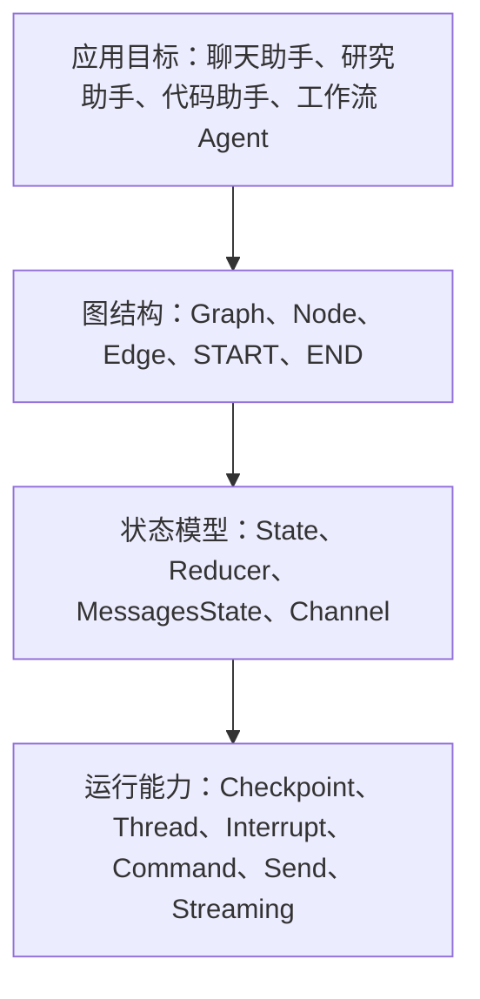
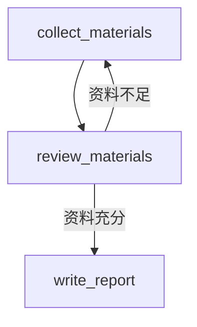
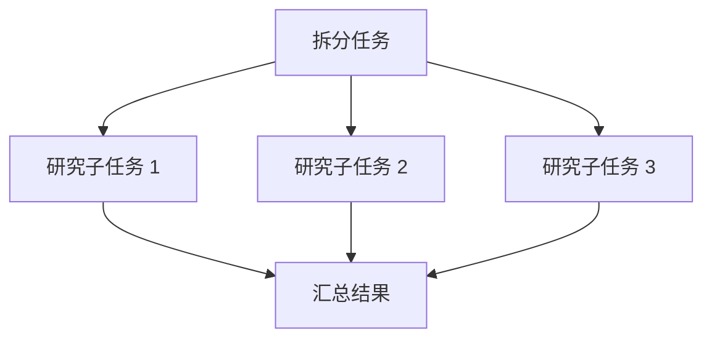
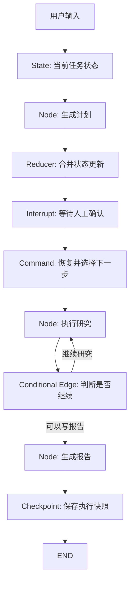

# 第2章-LangGraph的整体概念模型

## 2.1 先看一个最小的 LangGraph 程序

理解 LangGraph 最好的方式，不是先背概念，而是先看一个小程序。

下面这个例子只有一个节点：用户输入一句话，节点调用模型生成回答，然后图结束。它看起来比直接调用模型多了一点结构，但这些结构正是 LangGraph 后续扩展复杂 Agent 的基础。

```python
from typing import TypedDict

from langgraph.graph import END, START, StateGraph


class ChatState(TypedDict):
    question: str
    answer: str


def answer_question(state: ChatState) -> dict:
    response = llm.invoke(state["question"])
    return {"answer": response}


builder = StateGraph(ChatState)
builder.add_node("answer_question", answer_question)
builder.add_edge(START, "answer_question")
builder.add_edge("answer_question", END)

graph = builder.compile()

result = graph.invoke({"question": "LangGraph 是什么？"})
print(result["answer"])
```

如果只看功能，这段代码确实可以用一个函数替代：

```python
answer = llm.invoke("LangGraph 是什么？")
```

但 LangGraph 的重点不在这个最小例子本身，而在这个例子已经包含了完整的 LangGraph 构建 Agent 的基本模型：

- `ChatState` 定义图运行时携带什么状态。
- `answer_question` 是一个节点，负责读取状态并返回状态更新。
- `START` 和 `END` 标记图的入口和出口。
- `add_edge` 描述节点之间的执行关系。
- `compile()` 把声明式图结构编译成可运行对象。
- `invoke()` 启动一次图执行。

当我们把一个节点扩展成十个节点，把固定边扩展成条件边，把一次执行扩展成可恢复的长任务时，这套结构仍然成立。

## 2.2 用一张图建立整体印象

LangGraph 的整体架构设计可以先看成四层：



这四层不是严格的源码分层，而是读者理解 LangGraph 时最有用的架构分层。

应用目标回答“我要做什么”。例如，我们要做一个研究助手。

图结构回答“任务分成哪些步骤，步骤之间如何跳转”。例如，先生成计划，再等待确认，再执行研究，再写报告。

状态模型回答“这些步骤共享哪些数据，数据如何被更新”。例如，计划、资料、审查意见、最终报告都在状态里。

运行能力回答“这个任务如何持久运行、恢复、中断、并行、观测”。例如，任务执行到人工审批时暂停，用户批准后继续。

接下来，我们逐个拆开这些概念。

## 2.3 State：Agent 的工作记忆

`State` 是 LangGraph 最核心的概念之一。你可以把它理解为 Agent 的工作记忆。

在普通程序中，我们习惯用局部变量保存中间结果：

```python
plan = make_plan(topic)
materials = collect_materials(plan)
report = write_report(materials)
```

在 LangGraph 中，这些中间结果通常会进入 `State`：

```python
from typing import TypedDict


class ResearchState(TypedDict):
    topic: str
    plan: str
    materials: list[str]
    report: str
```

节点不会随意共享局部变量，而是通过 `State` 通信。一个节点读取状态中的某些字段，然后返回自己要更新的字段。

```python
def make_plan(state: ResearchState) -> dict:
    plan = llm.invoke(f"为这个主题制定研究计划：{state['topic']}")
    return {"plan": plan}
```

注意，节点返回的是 partial update，而不是完整状态。它只返回 `{"plan": plan}`，表示“我要更新 `plan` 字段”。LangGraph 会把这个更新合并回整体状态。

这种设计有三个好处：

- 节点职责清楚：每个节点知道自己读取什么、写入什么。
- 状态变化可追踪：你可以观察每一步状态如何变化。
- 持久化更自然：checkpoint 可以围绕状态快照工作。

对于聊天类 Agent，LangGraph 还提供常见的消息状态模式，例如 `MessagesState`。它把聊天消息作为核心状态字段，适合构建对话 Agent、工具调用 Agent 和 ReAct 风格 Agent。

## 2.4 Node：执行一步工作的函数

`Node` 是图里的执行单元。最简单地说，节点就是一个函数。

它通常接收当前状态，返回状态更新：

```python
def node_name(state: State) -> dict:
    ...
    return {"some_key": new_value}
```

在真实项目中，节点可以承担不同角色：

| 节点类型 | 作用 |
| --- | --- |
| LLM 节点 | 调用 Ollama、DeepSeek 或其他模型 |
| 工具节点 | 调用搜索、数据库、文件系统、计算器等工具 |
| 路由节点 | 判断下一步应该去哪里 |
| 审查节点 | 检查结果是否合格 |
| 汇总节点 | 合并多个子任务结果 |
| 人工节点 | 暂停并等待用户输入 |

例如，研究助手可以拆成这些节点：

```text
make_plan
approve_plan
collect_materials
review_materials
write_report
```

拆成节点之后，我们就能给每个节点一个清晰职责，而不是把所有逻辑塞进一个巨大函数。

一个好的节点应该尽量满足三个条件：

- 输入清楚：它依赖哪些状态字段。
- 输出清楚：它更新哪些状态字段。
- 职责单一：它只完成一个可以命名的动作。

如果一个节点的名字叫 `run_everything`，通常说明它做得太多了。

## 2.5 Edge：节点之间的路径

如果 `Node` 是步骤，那么 `Edge` 就是步骤之间的路径。

最简单的是普通边：

```python
builder.add_edge("make_plan", "collect_materials")
```

这表示 `make_plan` 执行完之后，下一步固定执行 `collect_materials`。

图的入口和出口由两个特殊标记表示：

```python
builder.add_edge(START, "make_plan")
builder.add_edge("write_report", END)
```

`START` 不是一个真实业务节点，而是图的起点。`END` 表示图执行结束。

普通边适合确定流程，但 Agent 经常需要根据状态选择路径。比如审查资料时，如果资料不足，就继续收集；如果资料充分，就写报告。

这时要用条件边：

```python
def route_after_review(state: ResearchState) -> str:
    if state["review_passed"]:
        return "write_report"
    return "collect_materials"


builder.add_conditional_edges(
    "review_materials",
    route_after_review,
)
```

对应的图是：



这里要注意一个重要原则：节点负责产生信息，边负责决定路径。不要把所有跳转逻辑都藏进节点内部，否则图会变得难以阅读。

## 2.6 Graph：把状态、节点和边组合起来

`Graph` 是 LangGraph 应用的整体结构。使用 Graph API 时，我们通常通过 `StateGraph` 构建图。

它的构建过程一般是：

```python
builder = StateGraph(ResearchState)

builder.add_node("make_plan", make_plan)
builder.add_node("collect_materials", collect_materials)
builder.add_node("review_materials", review_materials)
builder.add_node("write_report", write_report)

builder.add_edge(START, "make_plan")
builder.add_edge("make_plan", "collect_materials")
builder.add_edge("collect_materials", "review_materials")
builder.add_conditional_edges("review_materials", route_after_review)
builder.add_edge("write_report", END)

graph = builder.compile()
```

`StateGraph` 负责声明结构，`compile()` 负责生成可执行图。编译之后的 `graph` 才是真正运行的对象。

运行方式通常包括：

```python
graph.invoke(input_state)
graph.stream(input_state)
await graph.ainvoke(input_state)
```

你可以把这个过程理解为：先画图，再运行图。画图时定义结构，运行时让状态沿着图流动。

## 2.7 Reducer：状态更新如何合并

前面说过，节点返回的是 partial update。问题是：如果多个节点都更新同一个字段，LangGraph 应该怎么合并？

这就是 `Reducer` 要解决的问题。

默认情况下，某个字段的新值会覆盖旧值。例如：

```python
return {"report": "新的报告"}
```

这通常没问题，因为报告字段可能只需要保留最新版本。

但消息列表、资料列表、日志列表这类字段通常不是覆盖，而是追加：

```python
return {"materials": ["资料 A"]}
```

如果另一个节点也返回：

```python
return {"materials": ["资料 B"]}
```

我们希望最终结果是：

```python
{"materials": ["资料 A", "资料 B"]}
```

而不是后者覆盖前者。

Reducer 就是每个状态字段的合并规则。它告诉 LangGraph：当这个字段收到多个更新时，应该覆盖、追加、合并，还是做其他聚合。

在 Agent 里，Reducer 很重要，因为复杂图可能存在并行节点，也可能存在循环更新。没有明确的合并规则，状态就会变得不可预测。

可以这样理解：

| 状态字段 | 常见合并方式 |
| --- | --- |
| `answer` | 覆盖旧值 |
| `messages` | 追加消息 |
| `materials` | 追加资料 |
| `score` | 取最新值或聚合 |
| `errors` | 追加错误记录 |

Reducer 让状态更新从“随便改变量”变成“按规则合并数据”。

## 2.8 Checkpoint 与 Thread：让任务可以恢复

如果没有持久化，一个 LangGraph 图仍然只是一次内存中的执行。程序结束，状态就消失。

`Checkpoint` 解决的是保存执行过程的问题。它会记录图运行过程中的状态快照和执行进度，让任务可以恢复、回放或暂停。

`Thread` 则可以理解为一次可持续会话或任务的身份。使用 checkpoint 时，我们通常会传入 `thread_id`：

```python
config = {
    "configurable": {
        "thread_id": "research-task-001"
    }
}

graph.invoke(
    {"topic": "LangGraph 架构"},
    config=config,
)
```

同一个 `thread_id` 对应同一条任务线。下一次继续执行时，LangGraph 可以根据这个 thread 找到之前保存的状态。

这对长任务非常关键。比如研究助手执行到“等待用户确认计划”时暂停，用户第二天再回来批准，系统仍然能继续从原来的状态往下走。

简单说：

- `Checkpoint` 保存状态和进度。
- `Thread` 标识一条可恢复的执行线。

没有 checkpoint，interrupt 和长时会话都很难自然工作。

## 2.9 Command：同时更新状态和控制跳转

大多数节点只返回普通的状态更新：

```python
return {"plan": plan}
```

但有些时候，一个节点不仅要更新状态，还要决定下一步去哪里。这时可以使用 `Command`。

例如，人工审批节点可能根据用户输入决定路径：

```python
from langgraph.types import Command


def approve_plan(state: ResearchState) -> Command:
    decision = ask_user_to_approve(state["plan"])

    if decision == "approve":
        return Command(
            update={"approved": True},
            goto="collect_materials",
        )

    return Command(
        update={"approved": False},
        goto="make_plan",
    )
```

`Command` 把两件事放在一起：

- `update`：更新状态。
- `goto`：决定下一步节点。

它适合那些“决策本身就是业务动作”的场景。比如多 Agent handoff、人工恢复输入、子图跳转，都可能用到 `Command`。

但不要滥用它。普通流程优先用边表达，只有当节点确实需要把“状态更新”和“跳转决策”作为一个整体返回时，再使用 `Command`。

## 2.10 Send：动态拆分任务

有些任务在运行前不知道要拆成几个子任务。

例如，研究助手先生成一个研究计划：

```text
1. 阅读官方文档
2. 分析源码结构
3. 总结运行时机制
4. 整理工程实践
```

每个子任务都可以交给同一个 `research_worker` 节点处理。但子任务数量是模型动态生成的，不适合提前写死四条边。

这时可以使用 `Send`。它允许路由函数动态创建多条执行路径，把不同输入发送给同一个或不同节点。

概念上，它像这样：

```text
plan_tasks
  -> Send(research_worker, task_1)
  -> Send(research_worker, task_2)
  -> Send(research_worker, task_3)
```

这类模式常用于 map-reduce：



`Send` 让 LangGraph 不只是能表达固定图，也能表达运行时动态展开的图。

## 2.11 Interrupt：把人类放进执行过程

`Interrupt` 用来暂停图执行，等待外部输入。

最典型的场景是人工审批：

```python
from langgraph.types import interrupt


def approve_plan(state: ResearchState) -> dict:
    user_decision = interrupt({
        "message": "请确认这个研究计划是否可以执行",
        "plan": state["plan"],
    })

    return {"approved": user_decision["approved"]}
```

当图执行到 `interrupt()` 时，会暂停并保存状态。之后外部系统可以用 `Command(resume=...)` 恢复执行。

这比在代码中直接 `input()` 更适合真实应用，因为真实应用里的“人类输入”可能来自：

- Web 页面按钮
- 聊天窗口回复
- 审批系统
- 后台管理界面
- 另一个服务的回调

Interrupt 的意义是：人类不是 Agent 外面的临时干预者，而是图执行过程中的正式参与者。

## 2.12 Store、Memory 与长期上下文

Checkpoint 保存的是某个 thread 内的执行状态。它更像“这一次任务执行到哪里了”。

但有些信息需要跨 thread 保存，例如：

- 用户偏好
- 常用写作风格
- 项目背景知识
- 长期事实记忆
- 团队共享资料

这类信息更适合放在 `Store` 或长期记忆系统中。

可以这样区分：

| 概念 | 主要用途 | 例子 |
| --- | --- | --- |
| Checkpoint | 保存单个任务的执行状态 | 当前计划、当前节点、临时资料 |
| Thread | 标识一次可恢复任务 | `research-task-001` |
| Store | 保存跨任务的长期信息 | 用户偏好、项目知识、历史事实 |

在实际项目中，短期状态和长期记忆经常配合使用。Agent 运行时从 `State` 里读取当前任务信息，也可以从 `Store` 里读取长期背景。

## 2.13 Streaming：观察图如何运行

复杂 Agent 不能只看最终答案。我们还需要知道它正在做什么。

LangGraph 支持流式输出。你可以观察：

- token 流：模型正在生成什么文本。
- 事件流：当前进入了哪个节点、离开了哪个节点。
- 状态流：每一步状态发生了什么变化。

对于研究助手，流式事件可能像这样：

```text
进入节点：make_plan
更新状态：plan
进入节点：approve_plan
等待用户确认
进入节点：collect_materials
更新状态：materials
进入节点：review_materials
路由结果：write_report
进入节点：write_report
输出最终报告
```

这种可观测性对开发和生产都很重要。开发时，它帮助我们调试路由和状态。生产时，它可以让用户看到长任务进展，也可以让系统记录审计日志。

## 2.14 把所有概念串起来

现在我们可以用一张更完整的图，把本章概念串起来：



这张图表达了 LangGraph 的核心思想：

> Agent 的运行不是一次模型调用，而是状态在图中的持续推进。

状态记录“现在知道什么”。节点执行“下一步做什么”。边决定“之后去哪里”。Reducer 决定“更新如何合并”。Checkpoint 决定“过程如何保存”。Interrupt 决定“人类如何介入”。Command 和 Send 让控制流可以更动态。Streaming 让整个过程可以被观察。

## 2.15 本章小结

本章从一个最小 LangGraph 程序出发，逐步解释了 LangGraph 的整体概念模型。

你不需要一次记住所有 API，但应该建立一个基本概念模型：

- `State` 是 Agent 的工作记忆。
- `Node` 是执行一步工作的函数。
- `Edge` 是节点之间的路径。
- `Graph` 是状态、节点和边组成的可执行结构。
- `Reducer` 决定状态更新如何合并。
- `Checkpoint` 保存执行过程。
- `Thread` 标识一条可恢复的任务线。
- `Command` 可以同时更新状态并跳转。
- `Send` 支持动态拆分和并行任务。
- `Interrupt` 让人类进入执行过程。
- `Store` 保存跨任务的长期记忆。
- `Streaming` 让图运行过程可以被观察。

有了这些概念，下一章就可以进入 LangGraph 的架构总览：我们会把应用层、编程接口层、图编译层、运行时层和工程能力层放到一张图里，理解 LangGraph 为什么能支撑复杂 Agent 系统。
