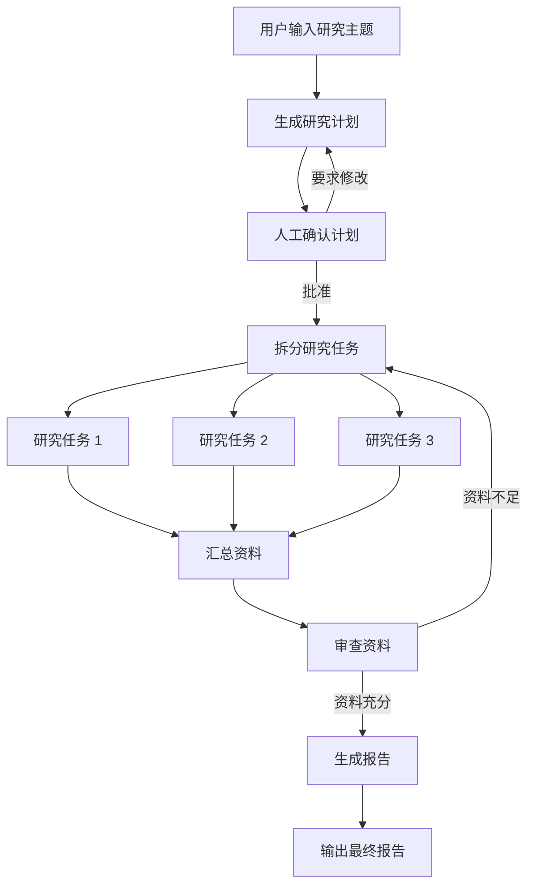
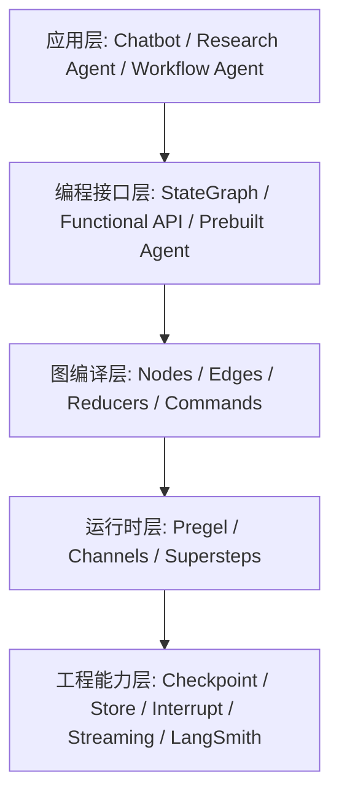
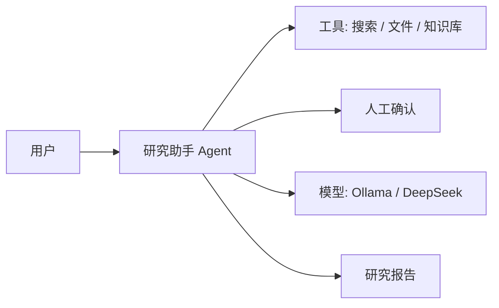
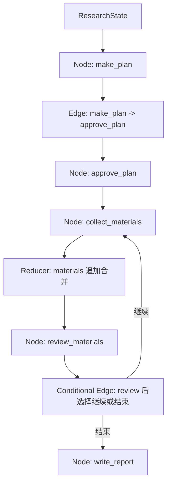
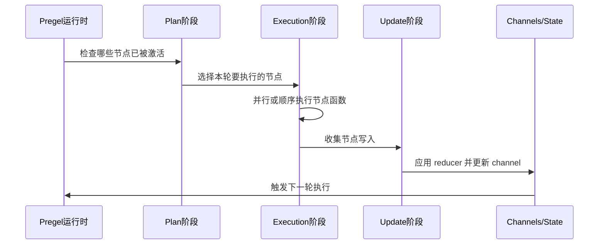
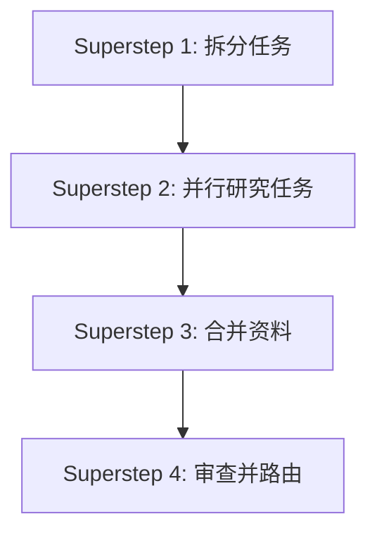
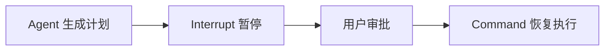
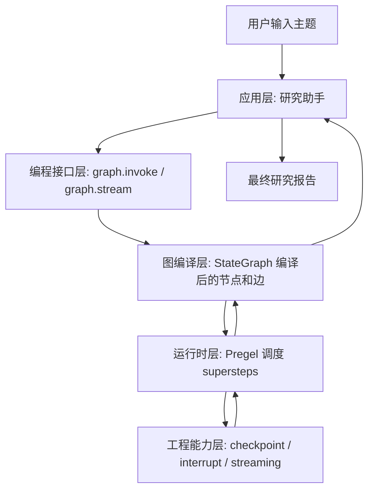

# 第3章-LangGraph架构总览图

## 3.1 从一个完整研究助手看架构

前两章我们已经知道，LangGraph 不是为了把一次模型调用包装得更复杂，而是为了组织一个真正会运行、会暂停、会恢复、会使用工具的 Agent 系统。

这一章我们先不急着看源码目录，也不急着记住每个模块名。我们先看一个更接近真实项目的例子：智能研究助手。

用户输入一个主题：

> 请研究 LangGraph 的架构设计，并生成一份结构化报告。

一个成熟一点的研究助手不会只调用一次模型。它大概会这样工作：

1. 读取用户主题。
2. 生成研究计划。
3. 暂停，等待用户确认计划。
4. 根据计划拆分多个研究任务。
5. 调用搜索、文件读取、网页摘要或本地知识库工具。
6. 汇总资料。
7. 审查资料是否足够。
8. 如果资料不足，继续研究。
9. 如果资料足够，生成报告。
10. 保存执行过程，方便失败后恢复。
11. 流式输出当前执行进度，方便用户观察。

如果把它画成一张业务流程图，大概是这样：



这张图已经很像 LangGraph 要表达的东西：有状态，有节点，有分支，有循环，有人工介入，有并行任务，有最终输出。

但从架构角度看，这还只是“应用层视角”。也就是说，它描述的是业务上发生了什么，还没有解释 LangGraph 内部如何支撑这一切。

为了真正理解 LangGraph，我们需要把这张业务图继续向下拆，看到它背后的五层结构。

## 3.2 LangGraph 的五层架构

在本书中，我们会用下面这张图作为 LangGraph 的总览图：



这张图不是为了背诵，而是为了建立方向感。以后读任何 LangGraph 代码，都可以问自己：我现在看到的是哪一层？

- 如果你看到的是聊天助手、研究助手、代码助手，这是应用层。
- 如果你看到的是 `StateGraph`、`graph.invoke()`、`graph.stream()`，这是编程接口层。
- 如果你看到的是节点、边、reducer、`Command`，这是图编译层。
- 如果你看到的是 Pregel、channel、superstep，这是运行时层。
- 如果你看到的是 checkpoint、store、interrupt、streaming、LangSmith，这是工程能力层。

这五层可以理解为从“我要做什么”一路下沉到“系统如何可靠执行”。

| 层级 | 回答的问题 | 典型内容 |
| --- | --- | --- |
| 应用层 | 我要构建什么 Agent？ | Chatbot、Research Agent、Workflow Agent |
| 编程接口层 | 我用什么方式描述这个 Agent？ | `StateGraph`、Functional API、Prebuilt Agent |
| 图编译层 | 这个 Agent 如何变成图？ | Node、Edge、Reducer、Command、Send |
| 运行时层 | 这张图如何被执行？ | Pregel、Channel、Superstep |
| 工程能力层 | 长任务如何可靠运行？ | Checkpoint、Store、Interrupt、Streaming、LangSmith |

接下来，我们沿着这五层逐个看。

## 3.3 应用层：你真正想构建的 Agent

应用层是读者最容易理解的一层，因为它离业务最近。

我们使用 LangGraph，不是为了“使用 LangGraph”本身，而是为了构建某种 Agent 应用。常见应用包括：

- 聊天助手：能记住上下文，能调用工具，能持续对话。
- 研究助手：能拆解问题，检索资料，审查结果，生成报告。
- 代码助手：能阅读代码，定位问题，提出修改，运行测试。
- 工作流 Agent：能执行审批、通知、生成文档、同步数据等流程。
- 多 Agent 系统：由多个角色协作完成复杂任务。

例如，研究助手的应用层关心的是这些问题：

- 用户输入什么？
- 最终输出什么？
- 中间是否需要人工确认？
- 要调用哪些工具？
- 失败之后是否要重试？
- 用户是否需要看到进度？

这些问题都还不是 LangGraph API 问题，而是产品和系统设计问题。LangGraph 的价值，是给这些应用目标提供一个稳定的表达方式。

我们可以把研究助手应用层画成这样：



这张图告诉我们“系统里有哪些角色”，但没有告诉我们“它们如何协作”。协作方式要交给下一层：编程接口层。

## 3.4 编程接口层：用什么方式描述 Agent

LangGraph 给开发者提供了几种主要的编程入口。对本书来说，最重要的是 Graph API，也就是 `StateGraph`。

一个典型的 `StateGraph` 程序长这样：

```python
from typing import TypedDict

from langgraph.graph import END, START, StateGraph


class ResearchState(TypedDict):
    topic: str
    plan: str
    report: str


def make_plan(state: ResearchState) -> dict:
    plan = llm.invoke(f"为这个主题制定研究计划：{state['topic']}")
    return {"plan": plan}


def write_report(state: ResearchState) -> dict:
    report = llm.invoke(f"根据计划写报告：{state['plan']}")
    return {"report": report}


builder = StateGraph(ResearchState)
builder.add_node("make_plan", make_plan)
builder.add_node("write_report", write_report)
builder.add_edge(START, "make_plan")
builder.add_edge("make_plan", "write_report")
builder.add_edge("write_report", END)

graph = builder.compile()
result = graph.invoke({"topic": "LangGraph 架构"})
```

这段代码属于编程接口层。它让开发者用 Python 代码声明：

- 状态结构是什么。
- 有哪些节点。
- 节点之间如何连接。
- 图从哪里开始，到哪里结束。
- 图如何被编译和运行。

除了 `StateGraph`，LangGraph 也有 Functional API 和预构建 Agent 能力。它们的目标不同：

| 接口 | 适合场景 | 特点 |
| --- | --- | --- |
| `StateGraph` | 大多数结构化 Agent | 显式定义状态、节点和边，最适合本书主线 |
| Functional API | 更偏函数式的任务编排 | 写法更轻，但图结构感相对弱 |
| Prebuilt Agent | 快速构建常见工具调用 Agent | 上手快，适合原型或标准模式 |

本书会优先使用 `StateGraph`，因为它最能帮助读者理解 LangGraph 的核心思想：用状态图设计 Agent。

编程接口层解决的是“怎么描述图”。但描述出来的图还不是运行时真正执行的内部结构。它需要被编译，这就进入了图编译层。

## 3.5 图编译层：从声明到可执行图

当我们写下：

```python
builder.add_node("make_plan", make_plan)
builder.add_edge("make_plan", "write_report")
graph = builder.compile()
```

我们其实是在做两件事。

第一，声明图结构。也就是告诉 LangGraph：有哪些节点，哪些节点之间有边，状态应该如何更新。

第二，把这些声明转换成可执行对象。`compile()` 会把我们写的图构建信息整理成运行时可以调度的结构。

这一层的核心元素包括：

- `Node`：执行具体工作。
- `Edge`：描述节点之间的固定路径。
- `Conditional Edge`：根据状态选择路径。
- `Reducer`：定义状态字段如何合并。
- `Command`：让节点返回状态更新和跳转目标。
- `Send`：动态分发多个任务。

以研究助手为例，图编译层可以这样理解：



图编译层关心的不是模型有多聪明，而是系统结构是否清楚：

- 每个节点是否职责单一？
- 每条边是否表达了清晰的控制流？
- 状态字段是否有正确的 reducer？
- 循环是否有终止条件？
- 动态分发是否需要 `Send`？
- 某些节点是否需要用 `Command` 决定跳转？

很多 LangGraph 项目的质量差异，就体现在这一层。写得好的图，读者能一眼看懂 Agent 的运行结构。写得差的图，只是把一团混乱逻辑换了个框架继续写。

图编译层把开发者声明的结构变成运行时可以执行的图。接下来，真正负责执行的是运行时层。

## 3.6 运行时层：Pregel、Channel 与 Superstep

运行时层是 LangGraph 最底层、也最容易让初学者觉得抽象的一层。

但我们可以先用一个简单类比理解它：LangGraph 的运行时像一个“按轮次推进的调度系统”。

它不会简单地从第一行代码执行到最后一行，而是根据图结构和状态变化，一轮一轮决定哪些节点应该执行。

LangGraph 底层受到 Pregel 模型启发。Pregel 最初用于大规模图计算，它的核心思想是 Bulk Synchronous Parallel，也就是按同步轮次推进。放到 LangGraph 里，可以理解为三个阶段：

1. Plan：决定本轮哪些节点应该执行。
2. Execution：执行这些节点。
3. Update：把节点产生的状态更新写回通道。

画出来是这样：



这里的 `Channel` 可以理解为状态更新的底层通道。上一章我们讲过 reducer，它决定状态字段如何合并。在运行时层，状态字段的更新会通过 channel 机制传播。

为什么这很重要？

因为复杂 Agent 经常有并行、循环和动态分发。如果只是普通函数调用，我们很难用统一方式处理这些情况。Pregel 风格运行时让 LangGraph 可以用一致的模型处理：

- 一个节点执行后触发下一个节点。
- 多个节点在同一轮中执行。
- 多个节点更新同一个状态字段。
- 条件路由决定下一轮激活哪些节点。
- 循环节点反复执行，直到进入终止路径。

例如，研究助手把一个计划拆成三个研究任务时，这三个任务可以在同一阶段展开。它们的结果再通过 reducer 合并回 `materials` 字段，之后进入审查节点。



普通读者不需要一开始就掌握 Pregel 的所有细节，但要记住一个关键点：

> LangGraph 的运行时不是简单顺序执行器，而是一个围绕图、状态和通道推进的调度系统。

这就是它能支撑复杂 Agent 的原因之一。

## 3.7 工程能力层：让 Agent 变成可靠系统

如果只有图结构和运行时，LangGraph 已经能表达复杂流程。但真实系统还需要更多工程能力。

一个生产级 Agent 至少会遇到这些问题：

- 程序中断后能不能恢复？
- 用户能不能在中间审批？
- 多轮会话能不能接着上次继续？
- 长期记忆放在哪里？
- 执行过程能不能流式展示？
- 出错时能不能定位到具体节点？
- 运行日志能不能被追踪和分析？

LangGraph 的工程能力层就是为这些问题服务的。

### Checkpoint：保存执行过程

Checkpoint 负责保存某个 thread 的图状态和执行进度。

有了 checkpoint，研究助手执行到一半失败后，可以从保存的状态继续，而不是从头开始。

```text
生成计划 -> 人工确认 -> 收集资料 -> 程序失败
                                      ↓
                              从收集资料后继续
```

### Store：保存长期记忆

Checkpoint 更像单次任务的执行快照，而 Store 更像跨任务共享的长期记忆。

例如，用户偏好“报告要用条理清晰的技术书风格”，这个信息不属于某一次研究任务，而应该可以被之后的任务复用。

### Interrupt：暂停并等待人类

Interrupt 让图可以在某个节点暂停，等待人类输入后再继续。

它非常适合人工审批、敏感操作确认、计划确认、代码修改确认等场景。



### Streaming：观察执行过程

Streaming 让我们不必等到最终结果才知道发生了什么。它可以让前端或日志系统实时看到：

- 当前进入哪个节点。
- 当前输出哪些 token。
- 状态发生了哪些变化。
- 工具调用是否完成。

对于长任务 Agent，streaming 是用户体验的一部分，也是调试能力的一部分。

### LangSmith：调试与可观测性

LangSmith 可以帮助观察 LangGraph 应用的执行轨迹、模型调用、工具调用和中间结果。它不是 LangGraph 图本身的必要组成，但在调试复杂 Agent 时非常有价值。

把这些能力放在一起，工程能力层让 Agent 从“能跑的 demo”走向“可以长时间运行的系统”。

## 3.8 五层如何在一次执行中协作

现在我们把五层重新放回研究助手的一次执行里。

用户输入主题时，应用层接收到一个业务任务。编程接口层把这个任务交给已经编译好的 `graph.invoke()` 或 `graph.stream()`。图编译层提供节点、边和状态合并规则。运行时层按照 Pregel 式轮次调度节点执行。工程能力层负责保存 checkpoint、处理中断、输出事件流。

可以画成这样：



这里最容易误解的是最下面两层。工程能力层不是只在最后保存一下结果，它会贯穿执行过程。运行时每推进一步，都可能产生状态更新、事件流、checkpoint 写入或 interrupt 暂停。

所以更准确地说，LangGraph 的执行不是单向瀑布，而是一个持续反馈的过程：

```text
状态触发节点 -> 节点产生更新 -> 更新写回状态 -> 状态触发下一轮节点
```

如果中途遇到人工审批：

```text
状态触发审批节点 -> interrupt 暂停 -> checkpoint 保存 -> 用户输入 -> Command 恢复 -> 继续执行
```

如果中途遇到并行任务：

```text
计划节点产生多个任务 -> Send 分发 -> 多个节点执行 -> reducer 合并结果 -> 进入审查节点
```

这些过程都可以被统一放进“状态在图中流动”的模型里。

## 3.9 从架构图反推项目结构

理解架构图之后，我们就能反推出一个 LangGraph 项目的合理目录结构。

后面工程化章节会详细展开，这里先给一个预览：

```text
langgraph_app/
  graphs/
    research_graph.py
  state/
    research_state.py
  nodes/
    planner.py
    researcher.py
    reviewer.py
    writer.py
  tools/
    search.py
    files.py
    knowledge_base.py
  models/
    ollama.py
    deepseek.py
  memory/
    checkpoint.py
    store.py
  config/
    settings.py
  tests/
    test_routes.py
    test_nodes.py
    test_graph.py
```

这个目录结构其实对应的就是本章的五层：

| 目录 | 对应架构层 | 责任 |
| --- | --- | --- |
| `graphs/` | 编程接口层 / 图编译层 | 组装 `StateGraph` |
| `state/` | 图编译层 | 定义状态 schema 和 reducer |
| `nodes/` | 图编译层 | 实现节点逻辑 |
| `tools/` | 应用层 | 封装外部工具 |
| `models/` | 应用层 | 封装 Ollama、DeepSeek 等模型 |
| `memory/` | 工程能力层 | 配置 checkpoint 和 store |
| `tests/` | 工程质量 | 测试节点、路由和完整图 |

这也解释了为什么我们前面一直强调“不要把整个 Agent 写成一个巨大函数”。LangGraph 的架构本身就在鼓励你把系统拆成清晰的模块。

## 3.10 常见误解：LangGraph 不是简单工作流引擎

看到图、节点、边之后，很多人会下意识把 LangGraph 理解成工作流引擎。

这个理解有一部分是对的：LangGraph 确实能表达工作流。但如果只把它看成工作流工具，就会低估它。

传统工作流通常强调确定流程，例如：

```text
提交表单 -> 审批 -> 发送通知 -> 归档
```

LangGraph 面向的是更动态的 Agent 流程：

```text
模型判断下一步 -> 调用工具 -> 根据结果再判断 -> 必要时循环 -> 可能暂停等待人类 -> 最后生成输出
```

这里的关键差异是：LangGraph 的控制流经常由状态和模型输出共同决定。它不仅要执行固定步骤，还要支持：

- 模型决定是否调用工具。
- 模型决定任务如何拆分。
- 审查节点决定是否回到前一步。
- 人类输入决定是否继续。
- checkpoint 决定是否从历史状态恢复。

所以，更准确的说法是：

> LangGraph 是面向 Agent 的状态图运行时，而不只是普通工作流编排器。

这个判断会影响我们后面写代码的方式。我们不会只把 LangGraph 当成“把函数连起来”的工具，而会把它当成一个围绕状态、控制流、持久化和可观测性组织 Agent 的运行系统。

## 3.11 读源码时如何使用这张架构图

后面如果你去阅读 `langchain-ai/langgraph` 仓库，可以用本章这张架构图做导航。

当你看到 `graph` 相关代码时，可以把它放在编程接口层和图编译层之间。它负责让开发者声明 `StateGraph`、节点和边。

当你看到 `pregel` 相关代码时，可以把它放在运行时层。它负责调度节点执行、处理 channel 更新、推进 superstep。

当你看到 `channels` 相关代码时，可以把它理解为状态传播和 reducer 合并的底层机制。

当你看到 `checkpoint` 相关代码时，可以把它放在工程能力层。它负责保存和恢复 thread 的执行状态。

当你看到 `prebuilt` 相关代码时，可以把它理解为应用层和编程接口层之间的便捷封装。比如工具调用 Agent 的常见结构已经被预先组织好。

可以用下面这个映射快速定位：

| 源码概念 | 所属层级 | 作用 |
| --- | --- | --- |
| `StateGraph` | 编程接口层 | 声明状态图 |
| `Node` / `Edge` | 图编译层 | 描述执行步骤和路径 |
| `Reducer` | 图编译层 / 运行时层 | 合并状态更新 |
| `Pregel` | 运行时层 | 调度图执行 |
| `Channel` | 运行时层 | 承载状态更新 |
| `CheckpointSaver` | 工程能力层 | 保存和恢复执行状态 |
| `interrupt` | 工程能力层 | 暂停并等待外部输入 |
| `ToolNode` | 应用层 / 编程接口层 | 封装工具调用节点 |

这样读源码会轻松很多。你不会被大量文件名淹没，而是知道每个模块大概站在哪个位置。

## 3.12 本章小结

本章用研究助手作为例子，建立了 LangGraph 的架构总览图。

我们把 LangGraph 分成五层：

- 应用层：你要构建的 Agent 类型和业务目标。
- 编程接口层：用 `StateGraph`、Functional API 或 Prebuilt Agent 描述应用。
- 图编译层：把状态、节点、边、reducer、Command、Send 组织成可执行图。
- 运行时层：用 Pregel、channel、superstep 推进图执行。
- 工程能力层：用 checkpoint、store、interrupt、streaming、LangSmith 支撑可靠运行。

这张总览图会贯穿全书。后面写第一个 LangGraph 程序时，我们会主要停留在编程接口层和图编译层；分析内部原理时，会下沉到运行时层；做复杂案例时，又会回到应用层和工程能力层，把所有能力组合起来。

到这里，第一部分的任务已经完成：我们知道了为什么需要 LangGraph，理解了它的核心概念，也建立了整体架构图。下一部分将进入实际编码，从环境准备和第一个可运行程序开始，把这些概念真正跑起来。
