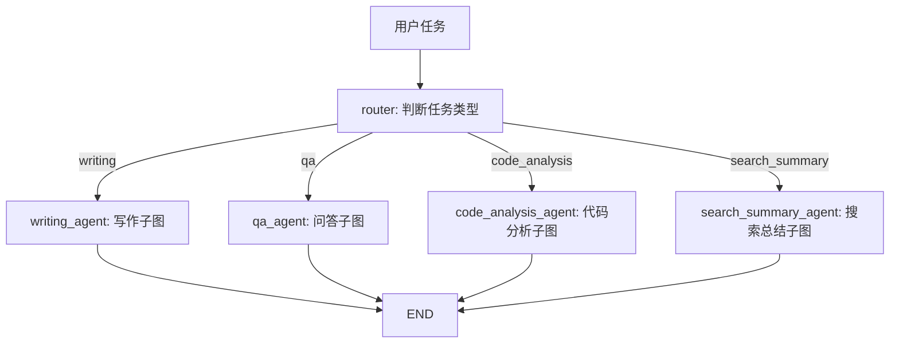

# 第28章-Router Agent

## 28.1 从“一个 Agent 什么都做”开始

前面六个部分，我们已经把 LangGraph 的核心能力拆开学过一遍：

- 用 `State` 保存任务过程。
- 用 `Node` 拆分工作步骤。
- 用 `Edge` 表达流程控制。
- 用 `Command` 和 `Send` 处理动态控制流。
- 用模块化、错误处理和测试把 demo 整理成真实项目。

这些能力足够写出一个能跑的 Agent。

但进入第七部分以后，问题会变成另一种：

> 当一个 Agent 面对完全不同类型的任务时，它应该如何选择不同的处理路径？

比如用户连续输入四个请求：

```text
写一段介绍 LangGraph Router Agent 的短文。
LangGraph 的 State 是什么？
分析这段 Python 代码为什么状态字段会丢失。
搜索并总结 LangGraph checkpoint 的资料。
```

这四个请求看起来都是“让 Agent 回答问题”，但它们本质上不是同一种任务。

第一个是写作任务。它需要先组织结构，再生成草稿。

第二个是问答任务。它可以直接解释概念。

第三个是代码分析任务。它需要检查代码、定位问题、给出修改建议。

第四个是搜索总结任务。它需要先构造检索词，再收集资料，最后汇总。

如果把它们都塞进一个巨大节点里，代码很快会变成这样：

```python
def agent(state):
    if is_writing_task(state["task"]):
        ...
    elif is_qa_task(state["task"]):
        ...
    elif is_code_task(state["task"]):
        ...
    elif is_search_task(state["task"]):
        ...
```

一开始这段代码很直接。

但路径继续增加以后，它会变成一个“总控大函数”：里面既要分类，又要调用模型，又要调用工具，还要处理错误、重试、日志和结果格式。

Router Agent 要解决的就是这个问题：

> 先判断任务类型，再把任务交给最合适的子图。

它不是让一个 Agent 什么都做，而是让一个入口 Agent 负责分流，让不同子图各自处理自己擅长的任务。

## 28.2 Router Agent 的核心思想

Router Agent 的结构可以简化成一句话：

```text
用户任务 -> Router 节点 -> 条件边 -> 不同子图 -> 最终结果
```

用图表示：



这张图里最重要的不是四个子图，而是入口处的 `router`。

`router` 不负责完成整个任务。

它只负责回答一个问题：

> 这个任务应该交给谁？

这就是 Router Agent 和普通条件边的区别。

第 9 章的条件边通常是在一个小流程里选择下一步，比如“直接回答、调用工具、拒答”。

第 28 章的 Router Agent 选择的是一整条处理路径，甚至是一整个子图。

也就是说：

```text
条件边选择下一个节点。
Router Agent 选择下一个能力系统。
```

这个差别很重要。

当任务类型只有两三种时，普通条件边就够了。

当每种任务背后都有多步流程时，就应该考虑 Router Agent。

## 28.3 本章目标

本章采用“分类分流法”。

我们不会先讲抽象定义，而是先构建一个小型 Router Agent。

它能把任务分成四类：

| 路由 | 适合任务 | 后续路径 |
| --- | --- | --- |
| `writing` | 写文章、写草稿、整理提纲 | 写作子图 |
| `qa` | 普通概念问答 | 问答子图 |
| `code_analysis` | 分析代码、排查 bug、重构建议 | 代码分析子图 |
| `search_summary` | 搜索资料、总结来源、整理信息 | 搜索总结子图 |

配套代码放在：

```text
codes/chapter28/chapter28_router_agent.py
```

运行：

```bash
python codes/chapter28/chapter28_router_agent.py
```

你会看到四个任务分别进入四条路径。

本章最重要的目标不是写一个聪明的分类器，而是建立一种架构判断：

> 当任务类型不同，并且每种任务背后都有独立流程时，不要让一个 Agent 硬扛所有逻辑，而应该用 Router 把任务分发到不同子图。

## 28.4 先设计 State：路由依据必须可观察

Router Agent 的 State 需要保存三类信息。

第一类是用户输入：

```python
task: str
```

第二类是路由结果：

```python
route: Route
route_reason: str
```

第三类是各条路径可能产生的中间结果：

```python
answer: str
outline: list[str]
draft: str
code_notes: list[str]
search_query: str
search_summary: str
execution_path: list[str]
```

完整定义如下：

```python
from typing import Literal, TypedDict


Route = Literal["writing", "qa", "code_analysis", "search_summary"]


class RouterState(TypedDict, total=False):
    task: str
    route: Route
    route_reason: str
    answer: str
    outline: list[str]
    draft: str
    code_notes: list[str]
    search_query: str
    search_summary: str
    execution_path: list[str]
```

这里有两个字段特别重要。

第一个是 `route`。

它告诉图下一步应该走哪条路径。

第二个是 `route_reason`。

它告诉开发者为什么选择这条路径。

很多 Router Agent 难调试，不是因为路由很复杂，而是因为系统只保存了最终结果，没有保存“为什么这样路由”。

如果一个写作任务被错误地送进了问答子图，排查时最需要看的不是最终回答，而是：

```text
route 是什么？
route_reason 是什么？
router 节点读到了什么输入？
```

所以 Router Agent 的第一条原则是：

> 路由结果和路由理由都要进入 State。

## 28.5 Router 节点：只分类，不处理任务

本章先用一个确定性分类函数模拟路由。

真实项目里可以把它替换成 Ollama、DeepSeek，或者“规则 + 模型”的混合分类器。

```python
def classify_task(task: str) -> tuple[Route, str]:
    normalized = task.lower()

    if any(keyword in normalized for keyword in ["写", "文章", "草稿", "文案", "outline"]):
        return "writing", "任务要求生成或组织文本"

    if any(keyword in normalized for keyword in ["代码", "函数", "bug", "重构", "python"]):
        return "code_analysis", "任务要求分析代码或工程问题"

    if any(keyword in normalized for keyword in ["搜索", "资料", "新闻", "来源", "总结"]):
        return "search_summary", "任务需要检索资料并汇总"

    return "qa", "任务可以直接问答"
```

然后把它包装成 LangGraph 节点：

```python
def route_task(state: RouterState) -> dict:
    route, reason = classify_task(state["task"])
    return {
        "route": route,
        "route_reason": reason,
        "execution_path": append_path(state, "router"),
    }
```

注意这个节点的边界。

它不写文章。

它不回答问题。

它不分析代码。

它不搜索资料。

它只做分类，并把分类结果写进 State。

这看起来克制，但这是 Router Agent 最重要的设计纪律。

如果 `router` 节点一边分类，一边顺手处理一部分任务，后面就会出现两个问题。

第一，职责混乱。你很难判断一个逻辑应该放在 router 里，还是放在子图里。

第二，路径不清楚。图上看起来任务进入了 `writing_agent`，但实际上 `router` 已经偷偷做了一半写作。

所以 Router 节点应该记住一句话：

> Router 只决定去哪，不负责到了以后怎么做。

## 28.6 条件边：把分类结果变成路径

Router 节点写入 `route` 后，条件边负责选择子图。

先定义路由函数：

```python
def decide_route(state: RouterState) -> str:
    return state["route"]
```

这个函数非常短。

短是好事。

因为复杂的判断已经在 `route_task` 里完成了。条件边只需要读取结果。

组装时使用 `add_conditional_edges`：

```python
builder.add_conditional_edges(
    "router",
    decide_route,
    {
        "writing": "writing_agent",
        "qa": "qa_agent",
        "code_analysis": "code_analysis_agent",
        "search_summary": "search_summary_agent",
    },
)
```

这段代码把四个字符串映射到四个子图节点。

它的含义是：

```text
route == writing        -> writing_agent
route == qa             -> qa_agent
route == code_analysis  -> code_analysis_agent
route == search_summary -> search_summary_agent
```

这一步把“架构决策”变成了“图结构”。

不是在文档里说“写作走写作流程”，而是在程序里明确连接：

```text
router -> writing_agent
```

当设计原则进入图结构，它才真正约束程序行为。

## 28.7 子图：每条路径都有自己的小流程

Router Agent 的强大之处，不是它能选下一个节点，而是它能选一整条路径。

比如写作任务不是一个节点就结束，而是可以拆成：

```text
make_outline -> write_draft
```

代码如下：

```python
def build_writing_subgraph():
    def make_outline(state: RouterState) -> dict:
        return {
            "outline": [
                "先说明问题",
                "再拆解关键概念",
                "最后给出行动建议",
            ],
            "execution_path": append_path(state, "writing.make_outline"),
        }

    def write_draft(state: RouterState) -> dict:
        outline_text = "；".join(state["outline"])
        return {
            "draft": f"围绕「{state['task']}」写作：{outline_text}。",
            "answer": "写作任务已完成草稿。",
            "execution_path": append_path(state, "writing.write_draft"),
        }

    builder = StateGraph(RouterState)
    builder.add_node("make_outline", make_outline)
    builder.add_node("write_draft", write_draft)
    builder.add_edge(START, "make_outline")
    builder.add_edge("make_outline", "write_draft")
    builder.add_edge("write_draft", END)
    return builder.compile()
```

问答子图可以很简单：

```python
def build_qa_subgraph():
    def answer_question(state: RouterState) -> dict:
        return {
            "answer": f"这是一个直接问答任务：{state['task']}",
            "execution_path": append_path(state, "qa.answer_question"),
        }

    builder = StateGraph(RouterState)
    builder.add_node("answer_question", answer_question)
    builder.add_edge(START, "answer_question")
    builder.add_edge("answer_question", END)
    return builder.compile()
```

代码分析子图可以有自己的检查步骤：

```python
def build_code_analysis_subgraph():
    def inspect_code_task(state: RouterState) -> dict:
        notes = [
            "确认问题发生在哪个模块",
            "先复现，再定位，再修改",
            "把可测试逻辑从模型调用中拆出来",
        ]
        return {
            "code_notes": notes,
            "execution_path": append_path(state, "code.inspect_code_task"),
        }

    def summarize_code_review(state: RouterState) -> dict:
        return {
            "answer": "代码分析路径已给出排查建议。",
            "execution_path": append_path(state, "code.summarize_code_review"),
        }

    builder = StateGraph(RouterState)
    builder.add_node("inspect_code_task", inspect_code_task)
    builder.add_node("summarize_code_review", summarize_code_review)
    builder.add_edge(START, "inspect_code_task")
    builder.add_edge("inspect_code_task", "summarize_code_review")
    builder.add_edge("summarize_code_review", END)
    return builder.compile()
```

搜索总结子图也可以单独处理：

```python
def build_search_summary_subgraph():
    def make_search_query(state: RouterState) -> dict:
        return {
            "search_query": state["task"].replace("搜索", "").replace("总结", "").strip(),
            "execution_path": append_path(state, "search.make_search_query"),
        }

    def summarize_materials(state: RouterState) -> dict:
        return {
            "search_summary": f"围绕「{state['search_query']}」整理三条关键资料。",
            "answer": "搜索总结路径已完成资料汇总。",
            "execution_path": append_path(state, "search.summarize_materials"),
        }

    builder = StateGraph(RouterState)
    builder.add_node("make_search_query", make_search_query)
    builder.add_node("summarize_materials", summarize_materials)
    builder.add_edge(START, "make_search_query")
    builder.add_edge("make_search_query", "summarize_materials")
    builder.add_edge("summarize_materials", END)
    return builder.compile()
```

这就是 Router Agent 的第二条原则：

> Router 后面接的最好不是一堆大节点，而是职责清楚的子图。

因为每种任务都有自己的内部流程。

写作任务关心提纲和草稿。

代码任务关心复现、定位和修改建议。

搜索任务关心查询、资料和引用来源。

如果把这些流程都压成一个节点，Router 的价值就被削弱了。

## 28.8 组装完整 Router Agent

现在可以把入口图组装起来：

```python
def build_router_agent():
    builder = StateGraph(RouterState)

    builder.add_node("router", route_task)
    builder.add_node("writing_agent", build_writing_subgraph())
    builder.add_node("qa_agent", build_qa_subgraph())
    builder.add_node("code_analysis_agent", build_code_analysis_subgraph())
    builder.add_node("search_summary_agent", build_search_summary_subgraph())

    builder.add_edge(START, "router")
    builder.add_conditional_edges(
        "router",
        decide_route,
        {
            "writing": "writing_agent",
            "qa": "qa_agent",
            "code_analysis": "code_analysis_agent",
            "search_summary": "search_summary_agent",
        },
    )
    builder.add_edge("writing_agent", END)
    builder.add_edge("qa_agent", END)
    builder.add_edge("code_analysis_agent", END)
    builder.add_edge("search_summary_agent", END)

    return builder.compile()
```

这段代码有两层图。

第一层是主图：

```text
START -> router -> 某个子图 -> END
```

第二层是子图内部流程：

```text
writing_agent:
  make_outline -> write_draft

code_analysis_agent:
  inspect_code_task -> summarize_code_review

search_summary_agent:
  make_search_query -> summarize_materials
```

主图不关心写作子图里有几个节点。

写作子图也不关心自己为什么被选中。

这就是子图边界的价值。

每一层只关心自己的问题。

## 28.9 运行结果应该怎么看

示例程序会运行四个任务：

```python
tasks = [
    "写一段介绍 LangGraph Router Agent 的短文",
    "LangGraph 的 State 是什么？",
    "分析这段 Python 代码为什么状态字段会丢失",
    "搜索并总结 LangGraph checkpoint 的资料",
]
```

输出会类似：

```text
============================================================
任务：写一段介绍 LangGraph Router Agent 的短文
路由：writing
原因：任务要求生成或组织文本
路径：router -> writing.make_outline -> writing.write_draft
回答：写作任务已完成草稿。
```

第二个任务会走问答路径：

```text
路径：router -> qa.answer_question
```

第三个任务会走代码分析路径：

```text
路径：router -> code.inspect_code_task -> code.summarize_code_review
```

第四个任务会走搜索总结路径：

```text
路径：router -> search.make_search_query -> search.summarize_materials
```

观察 Router Agent 时，不要只看最终回答。

更重要的是看三件事：

```text
route 是否符合任务类型？
route_reason 是否能解释选择？
execution_path 是否真的进入了对应子图？
```

这三个字段比最终自然语言回答更适合调试。

因为 Router Agent 的核心风险不是“答案不好看”，而是“任务被送错了地方”。

## 28.10 Router 节点可以用模型吗

可以。

而且真实项目里经常会用模型做路由。

例如让 Ollama 做轻量分类：

```python
prompt = f"""
你是一个 Router Agent。
请把用户任务分成四类之一：
- writing
- qa
- code_analysis
- search_summary

只返回 JSON：
{{"route": "...", "route_reason": "..."}}

用户任务：{task}
"""
```

但模型路由有一个问题：

```text
模型输出不一定稳定。
```

它可能返回：

```json
{"route": "code"}
```

也可能返回：

```json
{"type": "code_analysis"}
```

甚至可能返回一段解释文字，而不是 JSON。

所以模型路由必须配合三个保护措施。

第一，输出格式要严格。

最好让模型只返回结构化结果，比如 JSON。

第二，解析失败要有兜底。

如果模型输出无法解析，不要让图崩溃。可以回退到规则分类，或者进入人工确认路径。

第三，路由值要归一化。

例如只允许这四个值：

```text
writing
qa
code_analysis
search_summary
```

其他值统一映射到 `qa`、`human_review`，或者 `fallback_agent`。

Router Agent 的入口很关键。

路由一旦错了，后面每个节点可能都在认真地解决错误问题。

所以真实项目里更推荐：

```text
规则优先处理明确任务。
模型处理模糊任务。
解析失败进入兜底路径。
路由结果写入日志和 State。
```

## 28.11 Router Agent 的适用场景

Router Agent 适合任务类型明显不同的系统。

比如：

| 场景 | 为什么适合 Router |
| --- | --- |
| 智能助手 | 问答、写作、代码、搜索、日程处理需要不同路径 |
| 企业知识库 | 普通问答、权限查询、文档检索、工单创建要分开 |
| 代码助手 | 解释代码、写测试、查 bug、重构建议是不同流程 |
| 研究助理 | 选题、检索、总结、写报告、审查需要不同子图 |
| 客服系统 | FAQ、订单查询、退款处理、人工转接需要不同策略 |

它不适合所有场景。

如果系统只有一条主流程，比如：

```text
接收问题 -> 检索资料 -> 生成回答
```

那直接写 RAG Agent 就够了，不需要先加 Router。

如果只是两个简单分支，比如：

```text
需要工具 -> 调工具
不需要工具 -> 直接回答
```

普通条件边就够了。

Router Agent 更适合这种情况：

```text
每个分支背后都是一个独立流程。
每个流程有自己的 State 字段、节点、工具和错误处理。
未来还可能继续增加新的任务类型。
```

简单说：

> 分支只是下一步不同，用条件边；分支背后是一套能力不同，用 Router Agent。

## 28.12 常见错误与排查

Router Agent 最常见的问题不是图无法运行，而是路由边界越来越混乱。

| 现象 | 可能原因 | 排查方式 |
| --- | --- | --- |
| 所有任务都进入同一路径 | 分类规则过宽或模型路由失败 | 查看 `route` 和 `route_reason` |
| 写作任务进入问答子图 | 关键词、prompt 或解析规则不完整 | 增加路由测试用例 |
| 子图读不到字段 | 主图和子图 State 约定不一致 | 检查共享 State schema |
| router 节点越来越长 | 把子图业务逻辑写进了 router | 把任务处理逻辑移回子图 |
| 子图之间互相依赖 | 子图边界不清晰 | 明确每个子图输入和输出 |
| 路由结果不可解释 | 没有保存路由理由 | 增加 `route_reason` |
| 新增路径后旧路径出错 | 缺少路由函数测试和图路径测试 | 为每个 route 写最小测试 |

排查时可以沿着这条线：

```text
task
-> router 写入 route / route_reason
-> decide_route 返回路由值
-> add_conditional_edges 映射到目标子图
-> 子图内部节点是否按预期执行
-> 子图是否写入统一输出字段
```

如果这条线清楚，Router Agent 就不会变成黑箱。

## 28.13 Router Agent 的测试重点

第 27 章讲过，LangGraph 应用不要只测最终回答。

Router Agent 尤其如此。

它至少需要三类测试。

第一，测试分类函数。

```python
def test_classify_writing_task():
    route, reason = classify_task("写一段 Router Agent 介绍")

    assert route == "writing"
    assert reason
```

第二，测试路由函数。

```python
def test_decide_route_returns_state_route():
    assert decide_route({"route": "code_analysis"}) == "code_analysis"
```

第三，测试完整图路径。

```python
def test_router_agent_code_path():
    graph = build_router_agent()

    result = graph.invoke({"task": "分析这段 Python 代码的 bug"})

    assert result["route"] == "code_analysis"
    assert "code.inspect_code_task" in result["execution_path"]
```

这些测试都不需要真实 LLM。

真实模型路由可以留到少量集成测试里。

Router Agent 的测试目标不是判断模型懂不懂任务，而是保护这条架构约束：

```text
任务类型必须进入正确子图。
```

## 28.14 本章小结

本章进入了第七部分的第一种进阶 Agent 架构：Router Agent。

它解决的问题是：

> 一个 Agent 面对不同任务类型时，如何选择不同路径？

普通 Agent 容易把所有逻辑塞进一个大函数或大节点里。

Router Agent 的做法是把系统拆成两层：

```text
入口层：判断任务类型。
能力层：由不同子图处理不同任务。
```

本章最重要的结论是：

> Router Agent 的核心不是“分类”，而是“把分类结果变成清晰的架构分流”。

设计 Router Agent 时，记住四条原则：

- Router 只决定去哪，不处理具体任务。
- 路由结果和路由理由都要写进 State。
- 每个重要任务类型最好对应一个独立子图。
- 测试重点放在任务是否进入正确路径，而不是最终回答是否漂亮。

到这里，我们已经学会了把不同任务分发给不同能力系统。

但 Router Agent 仍然有一个限制：它只是在入口处做一次选择。

如果一个复杂任务需要拆成多个子任务，并由多个 Worker 协作完成，就需要一个更强的调度者。

下一章会进入 `Supervisor` 多 Agent 架构。

它要解决的问题是：

> 当任务不是选一条路就能完成，而是需要多个 Agent 分工协作时，谁来拆解、调度和汇总？
