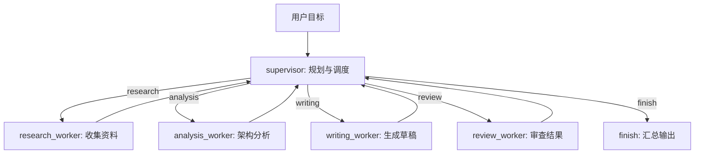

# 第29章-Supervisor 多 Agent 架构

## 29.1 Router 之后，为什么还需要 Supervisor

第 28 章讲了 Router Agent。

Router 的核心能力是：

```text
先判断任务类型，再把任务交给对应子图。
```

它解决的是“选哪条路”的问题。

但真实复杂任务经常不是选一条路就结束。

比如用户输入：

```text
请帮我写一份关于 LangGraph 多 Agent 架构的研究说明，
要求包含背景资料、架构分析、示例解释和审查意见。
```

这不是一个简单的写作任务。

它至少包含四类工作：

```text
资料收集
架构分析
正文写作
结果审查
```

如果用 Router Agent，它可能会把任务送到 `writing_agent`。

但写作子图内部仍然要面对一个问题：

> 谁来决定先做资料收集，谁来做分析，谁来写正文，谁来审查结果？

如果让每个 Worker 自己判断，系统很容易变乱。

Research Worker 可能觉得自己也应该写总结。

Writing Worker 可能觉得自己需要重新收集资料。

Review Worker 可能在资料还没收集完时就开始审查。

最后看起来有很多 Agent，实际上没有协作边界。

Supervisor 多 Agent 架构要解决的就是这个问题：

> 多个 Agent 如何分工，而不是互相抢状态、抢任务？

## 29.2 Supervisor 的核心职责

Supervisor 不是更强的 Worker。

它不是负责亲自完成所有任务的“大模型大脑”。

它的职责更像项目负责人：

```text
拆解任务
决定下一个 Worker
分配明确指令
检查任务是否完成
汇总 Worker 输出
```

用图表示：



这张图和 Router Agent 不一样。

Router 通常只在入口处路由一次：

```text
router -> 某个子图 -> END
```

Supervisor 会反复回到调度节点：

```text
supervisor -> worker -> supervisor -> worker -> supervisor -> finish
```

所以 Supervisor 架构的重点不是“分类”，而是“组织协作”。

它要持续回答三个问题：

```text
还有哪些任务没完成？
下一步应该交给哪个 Worker？
Worker 的结果应该如何进入共享状态？
```

## 29.3 本章目标

本章采用“组织协作法”。

我们会构建一个小型 Supervisor 多 Agent：

```text
输入主题
-> Supervisor 生成任务计划
-> Research Worker 收集资料
-> Analysis Worker 做架构分析
-> Writing Worker 写草稿
-> Review Worker 做审查
-> Finish 节点汇总结果
```

配套代码放在：

```text
codes/chapter29/chapter29_supervisor_agent.py
```

运行：

```bash
python codes/chapter29/chapter29_supervisor_agent.py
```

你会看到执行日志类似：

```text
Supervisor 分配任务 research 给 research_worker
research_worker 完成任务 research
Supervisor 分配任务 analysis 给 analysis_worker
analysis_worker 完成任务 analysis
...
```

本章最重要的目标不是做一个复杂智能体团队，而是让读者看懂：

> Supervisor 负责调度，Worker 负责执行；共享 State 要让任务边界清楚，而不是让多个 Agent 随意争夺同一块状态。

## 29.4 先看错误写法：所有 Worker 都读同一个目标

多 Agent 最容易写坏的方式是这样：

```text
用户目标
-> research_worker
-> analysis_worker
-> writing_worker
-> review_worker
```

每个 Worker 都直接读取原始目标，然后自己决定做什么。

这看起来简单，但会有几个问题。

第一，任务边界不清。

Research Worker 可能不只收集资料，还顺手写结论。

Writing Worker 可能觉得资料不够，于是又开始搜索。

Review Worker 可能不仅审查，还重写全文。

第二，状态写入冲突。

多个 Worker 都想写 `answer`、`summary`、`notes`。

如果没有清楚约定，后写的结果可能覆盖前面的结果。

第三，执行顺序不可解释。

当最终结果不好时，很难判断问题出在哪里：

```text
是 Supervisor 没分配清楚？
是 Worker 越界处理？
是某个 Worker 的输出没有被汇总？
```

所以 Supervisor 架构的第一条原则是：

> Worker 不直接抢任务，Worker 只处理 Supervisor 分配给自己的 active_task。

## 29.5 State 设计：把协作边界写清楚

Supervisor 多 Agent 的 State 不应该只有一个 `messages`。

它至少要保存这些字段：

```python
class SupervisorState(TypedDict, total=False):
    topic: str
    plan: list[Task]
    active_task: Task
    next_step: NextStep
    completed_tasks: list[str]
    worker_outputs: list[WorkerOutput]
    final_report: str
    execution_log: list[str]
```

每个字段都有明确职责：

| 字段 | 作用 |
| --- | --- |
| `topic` | 用户给出的总目标 |
| `plan` | Supervisor 拆出来的任务列表 |
| `active_task` | 当前分配给某个 Worker 的任务 |
| `next_step` | 下一步应该进入哪个 Worker |
| `completed_tasks` | 已完成任务的 id |
| `worker_outputs` | Worker 写回的结构化结果 |
| `final_report` | 汇总后的最终输出 |
| `execution_log` | 调度过程日志 |

这里最关键的是 `active_task`。

它让 Worker 不需要猜自己该做什么。

Worker 只需要读取：

```python
state["active_task"]
```

然后完成其中的 `instruction`。

这样任务边界就从“Worker 自己理解”变成了“Supervisor 明确分配”。

## 29.6 任务结构：每个任务都必须有归属

本章用一个简单的 `Task` 结构：

```python
from typing import Literal, TypedDict


WorkerName = Literal[
    "research_worker",
    "analysis_worker",
    "writing_worker",
    "review_worker",
]


class Task(TypedDict):
    task_id: str
    worker: WorkerName
    instruction: str
```

一个任务不仅要有说明，还要有明确归属：

```python
{
    "task_id": "research",
    "worker": "research_worker",
    "instruction": "收集关于主题的关键背景资料",
}
```

这能避免一个常见混乱：

```text
任务写得很清楚，但没人知道该由哪个 Agent 做。
```

Supervisor 多 Agent 里，每个任务至少应该回答三个问题：

```text
任务编号是什么？
交给哪个 Worker？
Worker 应该完成什么？
```

如果任务不能回答这三个问题，就还不适合交给 Worker。

## 29.7 Supervisor 节点：规划与调度

先定义一个计划生成函数：

```python
def build_plan(topic: str) -> list[Task]:
    return [
        {
            "task_id": "research",
            "worker": "research_worker",
            "instruction": f"收集关于「{topic}」的关键背景资料",
        },
        {
            "task_id": "analysis",
            "worker": "analysis_worker",
            "instruction": f"分析「{topic}」为什么需要多 Agent 协作",
        },
        {
            "task_id": "writing",
            "worker": "writing_worker",
            "instruction": f"把「{topic}」整理成读者能快速理解的说明",
        },
        {
            "task_id": "review",
            "worker": "review_worker",
            "instruction": "检查结果是否完整、是否有重复、是否有明显遗漏",
        },
    ]
```

真实项目中，`build_plan` 可以由 DeepSeek 生成，也可以由规则生成。

本章先用固定计划，让读者看清协作结构。

Supervisor 节点如下：

```python
def supervisor(state: SupervisorState) -> dict:
    plan = state.get("plan") or build_plan(state["topic"])
    completed = set(state.get("completed_tasks", []))

    for task in plan:
        if task["task_id"] not in completed:
            return {
                "plan": plan,
                "active_task": task,
                "next_step": task["worker"],
                "execution_log": append_log(
                    state,
                    f"Supervisor 分配任务 {task['task_id']} 给 {task['worker']}",
                ),
            }

    return {
        "plan": plan,
        "next_step": "finish",
        "execution_log": append_log(state, "Supervisor 确认所有任务完成"),
    }
```

这个节点做两件事。

第一，如果还没有计划，就创建计划。

第二，从计划里找第一个未完成任务，把它写入 `active_task`，并设置 `next_step`。

注意，它没有直接调用 Worker。

它只是写状态。

真正的跳转由条件边完成。

这保持了 LangGraph 的基本边界：

```text
节点更新状态。
边决定流向。
```

## 29.8 Worker 节点：只处理 active_task

每个 Worker 都应该只读自己的 `active_task`。

例如 Research Worker：

```python
def research_worker(state: SupervisorState) -> dict:
    task = state["active_task"]
    result = f"资料摘要：{task['instruction']}。重点关注任务背景、参与角色和协作边界。"
    return complete_task(state, result)
```

Analysis Worker：

```python
def analysis_worker(state: SupervisorState) -> dict:
    task = state["active_task"]
    result = f"分析结论：{task['instruction']}。单个 Agent 容易同时承担规划、执行和审查，边界会变模糊。"
    return complete_task(state, result)
```

Writing Worker：

```python
def writing_worker(state: SupervisorState) -> dict:
    task = state["active_task"]
    result = f"写作草稿：{task['instruction']}。先讲困境，再讲 Supervisor，再讲 Worker 边界。"
    return complete_task(state, result)
```

Review Worker：

```python
def review_worker(state: SupervisorState) -> dict:
    task = state["active_task"]
    result = f"审查意见：{task['instruction']}。当前结果覆盖了资料、分析、写作和审查。"
    return complete_task(state, result)
```

它们的结构非常像。

这不是重复，而是边界一致。

每个 Worker 都遵守同一条协议：

```text
读取 active_task
完成自己的任务
写入 worker_outputs
把 task_id 加入 completed_tasks
回到 supervisor
```

协议越稳定，多 Agent 越容易扩展。

## 29.9 统一完成任务：不要让 Worker 随意写 State

为了避免每个 Worker 用不同格式写状态，本章定义一个统一函数：

```python
def complete_task(state: SupervisorState, result: str) -> dict:
    task = state["active_task"]
    output: WorkerOutput = {
        "task_id": task["task_id"],
        "worker": task["worker"],
        "result": result,
    }

    return {
        "completed_tasks": [*state.get("completed_tasks", []), task["task_id"]],
        "worker_outputs": [*state.get("worker_outputs", []), output],
        "execution_log": append_log(
            state,
            f"{task['worker']} 完成任务 {task['task_id']}",
        ),
    }
```

这样做有两个好处。

第一，所有 Worker 输出格式一致。

`finish` 节点可以稳定读取 `worker_outputs`。

第二，任务完成状态集中管理。

不会出现有的 Worker 写 `done_tasks`，有的 Worker 写 `finished`，有的 Worker 忘了标记完成。

Supervisor 多 Agent 的第二条原则是：

> Worker 可以有不同能力，但写回 State 的协议要一致。

## 29.10 条件边：Supervisor 决定下一步

Supervisor 写入 `next_step` 后，条件边负责跳转。

```python
def decide_next_step(state: SupervisorState) -> str:
    return state["next_step"]
```

组装图：

```python
builder.add_conditional_edges(
    "supervisor",
    decide_next_step,
    {
        "research_worker": "research_worker",
        "analysis_worker": "analysis_worker",
        "writing_worker": "writing_worker",
        "review_worker": "review_worker",
        "finish": "finish",
    },
)
```

每个 Worker 完成后，都回到 Supervisor：

```python
builder.add_edge("research_worker", "supervisor")
builder.add_edge("analysis_worker", "supervisor")
builder.add_edge("writing_worker", "supervisor")
builder.add_edge("review_worker", "supervisor")
```

这个回路是 Supervisor 架构的核心。

它表示：

```text
Worker 不决定下一个 Worker。
Worker 做完以后，把控制权还给 Supervisor。
```

如果让 Worker 之间互相跳转，就会出现新的耦合。

Research Worker 需要知道 Analysis Worker 的存在。

Analysis Worker 需要知道 Writing Worker 的存在。

以后新增 Review Worker 时，还要改多个 Worker。

更好的方式是：

```text
所有 Worker 都只回 supervisor。
由 supervisor 决定下一步。
```

## 29.11 完整图组装

完整构建函数如下：

```python
def build_supervisor_agent():
    builder = StateGraph(SupervisorState)

    builder.add_node("supervisor", supervisor)
    builder.add_node("research_worker", research_worker)
    builder.add_node("analysis_worker", analysis_worker)
    builder.add_node("writing_worker", writing_worker)
    builder.add_node("review_worker", review_worker)
    builder.add_node("finish", finish)

    builder.add_edge(START, "supervisor")
    builder.add_conditional_edges(
        "supervisor",
        decide_next_step,
        {
            "research_worker": "research_worker",
            "analysis_worker": "analysis_worker",
            "writing_worker": "writing_worker",
            "review_worker": "review_worker",
            "finish": "finish",
        },
    )
    builder.add_edge("research_worker", "supervisor")
    builder.add_edge("analysis_worker", "supervisor")
    builder.add_edge("writing_worker", "supervisor")
    builder.add_edge("review_worker", "supervisor")
    builder.add_edge("finish", END)

    return builder.compile()
```

这张图看起来比 Router Agent 多了回路。

但它的逻辑并不复杂：

```text
START
-> supervisor
-> worker
-> supervisor
-> worker
-> supervisor
-> finish
-> END
```

复杂任务不是被一个节点吃掉，而是被 Supervisor 切成多个小任务，并按顺序交给合适的 Worker。

## 29.12 Finish 节点：汇总，而不是重新执行

当所有任务都完成后，Supervisor 把 `next_step` 设置为 `finish`。

Finish 节点负责汇总 Worker 输出：

```python
def finish(state: SupervisorState) -> dict:
    lines = [f"# {state['topic']}"]

    for output in state.get("worker_outputs", []):
        lines.append(f"- {output['worker']} / {output['task_id']}：{output['result']}")

    return {
        "final_report": "\n".join(lines),
        "execution_log": append_log(state, "finish 汇总所有 Worker 输出"),
    }
```

这里要注意一个边界：

> Finish 节点汇总结果，不重新做 Worker 的任务。

如果 Finish 节点发现结果不够好，真实项目里可以把状态交回 Supervisor，让 Supervisor 决定补充任务。

但它不应该直接越过 Supervisor 去调用某个 Worker。

否则调度权又会分散。

## 29.13 运行结果应该观察什么

运行：

```bash
python codes/chapter29/chapter29_supervisor_agent.py
```

你会看到类似输出：

```text
执行日志：
- Supervisor 分配任务 research 给 research_worker
- research_worker 完成任务 research
- Supervisor 分配任务 analysis 给 analysis_worker
- analysis_worker 完成任务 analysis
- Supervisor 分配任务 writing 给 writing_worker
- writing_worker 完成任务 writing
- Supervisor 分配任务 review 给 review_worker
- review_worker 完成任务 review
- Supervisor 确认所有任务完成
- finish 汇总所有 Worker 输出
```

这段日志比最终报告更重要。

它证明了三件事：

```text
任务由 Supervisor 分配。
Worker 完成后回到 Supervisor。
没有 Worker 私自决定下一个 Worker。
```

最终报告会把所有 Worker 输出汇总：

```text
# Supervisor 多 Agent 架构
- research_worker / research：资料摘要...
- analysis_worker / analysis：分析结论...
- writing_worker / writing：写作草稿...
- review_worker / review：审查意见...
```

观察 Supervisor Agent 时，重点不是“某个 Worker 文笔好不好”，而是：

```text
任务是否被明确分配？
Worker 是否只处理自己的 active_task？
完成状态是否被正确记录？
结果是否按统一格式汇总？
```

## 29.14 Supervisor 和 Router 的区别

Router 和 Supervisor 都会选择下一步，但它们解决的问题不同。

| 架构 | 核心问题 | 典型流程 |
| --- | --- | --- |
| Router Agent | 这个任务属于哪种类型？ | 分类一次，进入某条路径 |
| Supervisor Agent | 复杂任务下一步该由谁做？ | 多次调度，多个 Worker 协作 |

Router 像入口分诊台。

它看一眼任务，决定去哪个科室。

Supervisor 像项目负责人。

它不仅决定谁做，还要记住谁已经做完、下一步轮到谁、最后如何汇总。

所以第 28 章的核心状态是：

```text
route
route_reason
```

第 29 章的核心状态是：

```text
plan
active_task
next_step
completed_tasks
worker_outputs
```

如果只需要一次选择，用 Router。

如果需要持续调度多个 Worker，用 Supervisor。

## 29.15 多 Agent 协作中的状态边界

Supervisor 架构最容易失败的地方是共享状态。

因为多个 Worker 都能读写同一个 State。

如果没有规则，它们就会互相踩脚。

可以用三层边界来管理。

第一层：Supervisor 专属字段。

```text
plan
active_task
next_step
completed_tasks
```

这些字段只应该由 Supervisor 或统一完成函数更新。

Worker 不应该随便改计划。

第二层：Worker 输出字段。

```text
worker_outputs
```

Worker 把结果追加到这里，而不是抢着写 `final_report`。

第三层：最终输出字段。

```text
final_report
```

这个字段只由 `finish` 节点写。

这样每个字段都有所有者：

| 字段 | 主要写入者 |
| --- | --- |
| `plan` | Supervisor |
| `active_task` | Supervisor |
| `next_step` | Supervisor |
| `completed_tasks` | `complete_task` |
| `worker_outputs` | `complete_task` |
| `final_report` | Finish |

字段有所有者，状态才不会变成公共草稿纸。

## 29.16 常见错误与排查

Supervisor 多 Agent 的常见错误通常不是代码语法错误，而是协作协议错误。

| 现象 | 可能原因 | 排查方式 |
| --- | --- | --- |
| Worker 重复执行同一任务 | `completed_tasks` 没有正确更新 | 查看 Worker 是否调用统一完成函数 |
| Supervisor 提前 finish | plan 为空或 completed 判断错误 | 打印 `plan` 和 `completed_tasks` |
| Worker 做了不属于自己的事 | Worker 直接读取总目标并自行扩展任务 | 强制 Worker 只读 `active_task` |
| 最终报告缺内容 | Worker 没写入 `worker_outputs` | 检查输出协议 |
| 某个 Worker 永远不执行 | `next_step` 和条件边映射不一致 | 对比 `next_step` 值和 `add_conditional_edges` |
| 状态字段互相覆盖 | 多个节点写同一个字段 | 明确字段所有者或使用 reducer |
| 新增 Worker 后流程混乱 | Worker 之间互相跳转 | 统一让 Worker 回到 Supervisor |

排查主线可以固定为：

```text
topic
-> supervisor 生成 plan
-> supervisor 写入 active_task / next_step
-> 条件边进入对应 Worker
-> Worker 写入 completed_tasks / worker_outputs
-> 回到 supervisor
-> 所有任务完成后进入 finish
```

只要这条线清楚，多 Agent 协作就不会变成一团乱麻。

## 29.17 Supervisor Agent 的测试重点

Supervisor Agent 的测试要保护“协作协议”。

第一，测试计划生成。

```python
def test_build_plan_assigns_workers():
    plan = build_plan("Supervisor 架构")

    assert plan[0]["worker"] == "research_worker"
    assert plan[-1]["worker"] == "review_worker"
```

第二，测试 Supervisor 调度未完成任务。

```python
def test_supervisor_dispatches_first_unfinished_task():
    result = supervisor({"topic": "Supervisor 架构"})

    assert result["active_task"]["task_id"] == "research"
    assert result["next_step"] == "research_worker"
```

第三，测试 Worker 完成任务时写回统一格式。

```python
def test_worker_records_completed_task():
    state = {
        "active_task": {
            "task_id": "research",
            "worker": "research_worker",
            "instruction": "收集资料",
        }
    }

    result = research_worker(state)

    assert result["completed_tasks"] == ["research"]
    assert result["worker_outputs"][0]["task_id"] == "research"
```

第四，测试完整图最终能完成。

```python
def test_supervisor_graph_finishes():
    graph = build_supervisor_agent()

    result = graph.invoke({"topic": "Supervisor 架构"})

    assert result["final_report"]
    assert set(result["completed_tasks"]) == {"research", "analysis", "writing", "review"}
```

这些测试不需要真实 LLM。

因为本章最重要的不是模型质量，而是：

```text
Supervisor 是否正确分配任务？
Worker 是否遵守任务边界？
状态是否按协议写回？
```

## 29.18 本章小结

本章讲了第七部分的第二种进阶 Agent 架构：Supervisor 多 Agent 架构。

它解决的问题是：

> 多个 Agent 如何分工，而不是互相抢状态、抢任务？

Router Agent 负责选择路径。

Supervisor Agent 负责组织协作。

它把复杂任务拆成多个有归属的小任务，并通过 `active_task`、`next_step`、`completed_tasks`、`worker_outputs` 这些字段让协作过程可观察、可调试。

本章最重要的结论是：

> 多 Agent 架构的核心不是“有很多 Agent”，而是“每个 Agent 有清楚的任务边界和写回协议”。

设计 Supervisor 架构时，记住四条原则：

- Supervisor 负责规划、调度和汇总，不亲自抢 Worker 的执行职责。
- Worker 只处理 `active_task`，不私自决定下一个 Worker。
- Worker 输出使用统一格式写回 State。
- 共享 State 字段要有明确所有者。

到这里，Agent 已经不只是会选择路径，而是能组织多个 Worker 协作。

但 Supervisor 通常还是“边调度边推进”。

如果任务需要先生成一个完整计划，再逐步执行、检查和修正，就会进入下一种架构：

```text
Plan-and-Execute Agent
```

下一章要解决的问题是：

> 复杂任务为什么不能边想边做，而要先规划再执行？
