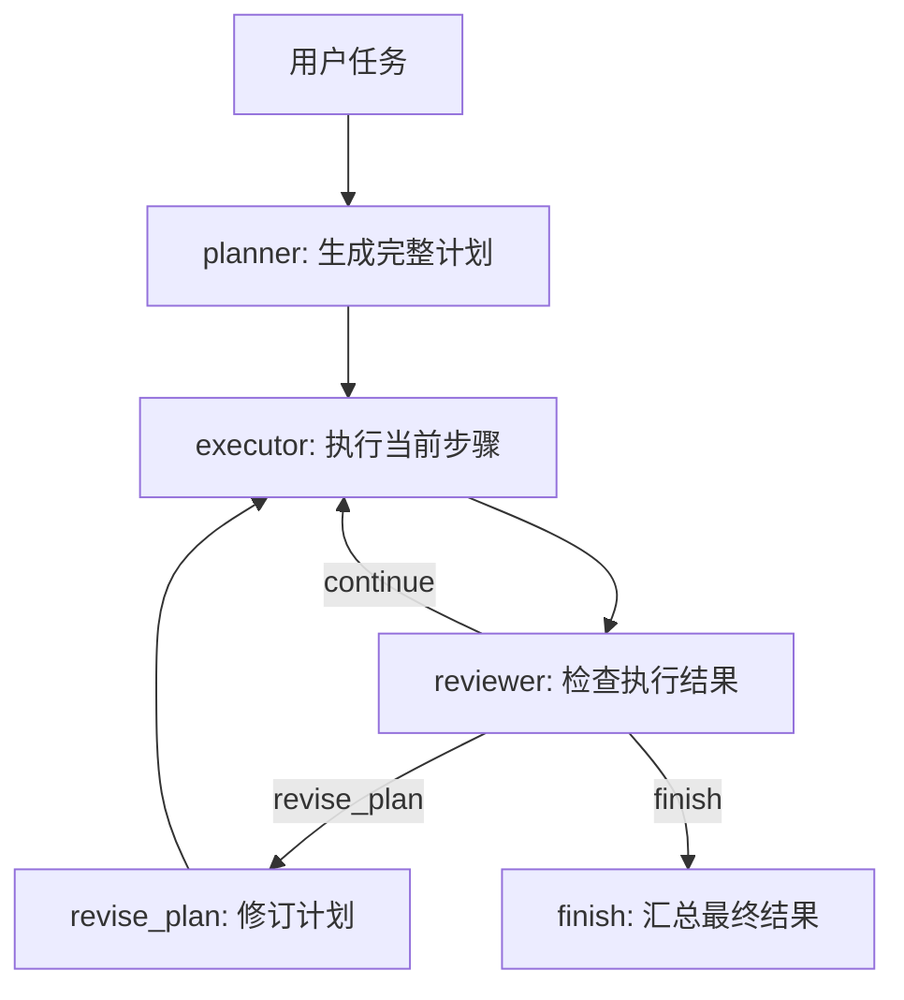

# 第30章-Plan-and-Execute Agent

## 30.1 Supervisor 之后，为什么还要先规划

第 29 章讲了 Supervisor 多 Agent 架构。

Supervisor 的核心能力是：

```text
把复杂任务拆成多个小任务，再调度不同 Worker 执行。
```

它解决的是“多个 Agent 如何协作”的问题。

但有一类任务，只靠边调度边推进仍然不够。

比如用户输入：

```text
请解释为什么复杂 Agent 需要先规划再执行，
并给出适用场景、代码结构、失败边界和测试建议。
```

如果 Agent 看到这个任务后马上开始写，很容易出现几个问题。

第一，先写了局部答案，后面才发现结构不完整。

第二，执行过程中不断临时改变方向，导致前后内容重复。

第三，模型一边想一边做，忘记了最初的目标约束。

第四，最后才发现缺少“失败边界”或“测试建议”，只能硬补一段。

这就是“边想边做”的问题。

对于简单任务，边想边做没关系。

但对于复杂任务，Agent 需要先形成一个全局计划，再按计划执行，最后检查计划和结果是否匹配。

Plan-and-Execute Agent 要解决的问题是：

> 复杂任务为什么不能边想边做，而要先规划再执行？

## 30.2 Plan-and-Execute 的核心思想

Plan-and-Execute Agent 把复杂任务拆成三个角色：

```text
Planner：先制定完整计划。
Executor：按计划逐步执行。
Reviewer：检查结果，决定继续、修订还是结束。
```

用图表示：



这张图和 Supervisor 很像，但重点不同。

Supervisor 更关心：

```text
下一步交给哪个 Worker？
```

Plan-and-Execute 更关心：

```text
在开始执行前，整个任务应该如何分解？
执行结果是否仍然符合原计划？
发现计划缺口时，是否应该修订计划？
```

所以它不是简单地“多一个 Planner 节点”。

它是一种明确的职责分离：

```text
计划和执行分开。
执行和审查分开。
审查和修订分开。
```

这种分离能让复杂 Agent 不再被当前一步牵着走。

## 30.3 本章目标

本章采用“计划执行分离法”。

我们会构建一个小型 Plan-and-Execute Agent：

```text
输入复杂任务
-> Planner 生成初始计划
-> Executor 执行当前步骤
-> Reviewer 检查进度
-> 如果还有步骤，继续执行
-> 如果发现计划缺口，修订计划
-> 如果全部通过，汇总结果
```

配套代码放在：

```text
codes/chapter30/chapter30_plan_execute_agent.py
```

运行：

```bash
python codes/chapter30/chapter30_plan_execute_agent.py
```

你会看到执行日志里出现一次计划修订：

```text
Planner 生成初始计划
Executor 执行步骤 1/3：clarify_goal
...
Reviewer 发现计划缺口，要求修订计划
Planner 根据审查意见补充计划步骤 review_risks
Executor 执行步骤 4/4：review_risks
```

本章最重要的目标不是让计划多复杂，而是让读者看懂：

> 复杂任务应该先形成可观察的计划，再让 Executor 按计划推进，并让 Reviewer 判断计划是否足够。

## 30.4 错误写法：一个节点边想边做

最常见的写法是把所有逻辑放进一个节点：

```python
def agent(state):
    response = model.invoke(f"请完成这个复杂任务：{state['task']}")
    return {"final_answer": response.content}
```

这个写法对简单问答可以接受。

但对复杂任务有明显缺陷。

第一，计划不可见。

你不知道模型打算先做什么、后做什么。

第二，执行不可控。

如果中间漏了一步，很难插入补救。

第三，审查太晚。

最终答案已经生成后才发现问题，只能要求模型“重写一遍”。

第四，测试困难。

你只能测试最终输出，无法测试计划是否合理、某一步是否执行、审查是否发现缺口。

Plan-and-Execute 的第一条原则是：

> 不要让一个节点同时承担规划、执行和审查。

这三个职责混在一起，Agent 就会变成一个黑箱。

## 30.5 State 设计：计划必须成为状态

Plan-and-Execute Agent 的 State 要保存计划、执行进度和审查结果。

本章定义如下：

```python
class PlanExecuteState(TypedDict, total=False):
    task: str
    plan: list[PlanStep]
    current_step_index: int
    step_results: list[StepResult]
    review_status: ReviewStatus
    review_notes: str
    revision_count: int
    final_answer: str
    execution_log: list[str]
```

每个字段都有明确作用：

| 字段 | 作用 |
| --- | --- |
| `task` | 用户的复杂任务 |
| `plan` | Planner 生成的完整步骤列表 |
| `current_step_index` | 当前执行到第几步 |
| `step_results` | 每一步的执行结果 |
| `review_status` | Reviewer 的决策：继续、修订、结束 |
| `review_notes` | 审查意见 |
| `revision_count` | 已修订次数，避免无限修订 |
| `final_answer` | 最终汇总结果 |
| `execution_log` | 可观察的执行轨迹 |

这里最关键的是 `plan` 和 `current_step_index`。

如果没有 `plan`，Executor 就只能根据当前上下文临时决定做什么。

如果没有 `current_step_index`，图就不知道下一步应该执行哪一个计划项。

所以 Plan-and-Execute 的第二条原则是：

> 计划不是 prompt 里的临时文字，而是 State 里的结构化数据。

## 30.6 PlanStep：每一步都要可执行

计划不能只是几句漂亮标题。

它必须能指导 Executor 行动。

本章用一个简单结构：

```python
class PlanStep(TypedDict):
    step_id: str
    title: str
    instruction: str
```

例如：

```python
{
    "step_id": "clarify_goal",
    "title": "澄清目标",
    "instruction": "明确任务要解决的核心问题",
}
```

一个好的计划步骤至少要回答三个问题：

```text
这一步叫什么？
这一步要完成什么？
执行结果后面如何被引用？
```

如果计划只写：

```text
分析一下
写一下
总结一下
```

Executor 仍然要自己猜。

这样的计划没有真正降低复杂度。

## 30.7 Planner 节点：先生成完整计划

Planner 节点负责把用户任务变成结构化计划。

本章为了教学稳定，先用固定计划。

真实项目里可以用 DeepSeek 来生成计划。

```python
def planner(state: PlanExecuteState) -> dict:
    task = state["task"]
    plan: list[PlanStep] = [
        {
            "step_id": "clarify_goal",
            "title": "澄清目标",
            "instruction": f"明确任务「{task}」要解决的核心问题",
        },
        {
            "step_id": "collect_points",
            "title": "整理要点",
            "instruction": "列出回答需要覆盖的关键概念和示例",
        },
        {
            "step_id": "draft_answer",
            "title": "生成草稿",
            "instruction": "把要点组织成一段结构清晰的说明",
        },
    ]

    return {
        "plan": plan,
        "current_step_index": 0,
        "step_results": [],
        "revision_count": 0,
        "execution_log": append_log(state, "Planner 生成初始计划"),
    }
```

注意 Planner 不执行计划。

它只写入：

```text
plan
current_step_index
revision_count
```

它回答的是：

> 为了完成任务，应该先做哪些步骤？

而不是：

> 这些步骤的答案是什么？

这是计划执行分离的边界。

## 30.8 Executor 节点：只执行当前步骤

Executor 不负责重新规划。

它只读取当前步骤：

```python
index = state.get("current_step_index", 0)
step = state["plan"][index]
```

然后执行它：

```python
def executor(state: PlanExecuteState) -> dict:
    index = state.get("current_step_index", 0)
    plan = state["plan"]
    step = plan[index]
    output = f"完成「{step['title']}」：{step['instruction']}。"

    result: StepResult = {
        "step_id": step["step_id"],
        "title": step["title"],
        "output": output,
    }

    return {
        "step_results": [*state.get("step_results", []), result],
        "current_step_index": index + 1,
        "execution_log": append_log(
            state,
            f"Executor 执行步骤 {index + 1}/{len(plan)}：{step['step_id']}",
        ),
    }
```

Executor 的输出写入 `step_results`。

执行完以后，它把 `current_step_index` 加一。

这说明：

```text
Executor 不决定整个任务是否完成。
Executor 只完成当前计划步骤。
```

是否继续执行，交给 Reviewer。

## 30.9 Reviewer 节点：检查结果，而不是直接重写

Reviewer 的职责是检查执行进度。

它返回三种决策：

```text
continue：继续执行下一步。
revise_plan：计划有缺口，需要修订。
finish：任务可以结束。
```

代码如下：

```python
def reviewer(state: PlanExecuteState) -> dict:
    index = state.get("current_step_index", 0)
    plan = state["plan"]
    completed_step_ids = {result["step_id"] for result in state.get("step_results", [])}

    if index < len(plan):
        return {
            "review_status": "continue",
            "review_notes": "当前步骤通过，继续执行下一个计划步骤。",
            "execution_log": append_log(state, "Reviewer 通过当前步骤，继续执行"),
        }

    if "review_risks" not in completed_step_ids and state.get("revision_count", 0) < 1:
        return {
            "review_status": "revise_plan",
            "review_notes": "计划缺少风险与边界检查，需要补充一个审查步骤。",
            "execution_log": append_log(state, "Reviewer 发现计划缺口，要求修订计划"),
        }

    return {
        "review_status": "finish",
        "review_notes": "所有计划步骤已经完成，结果可以汇总。",
        "execution_log": append_log(state, "Reviewer 确认任务完成"),
    }
```

这里故意设计了一个计划缺口。

初始计划只有：

```text
澄清目标
整理要点
生成草稿
```

Reviewer 会发现缺少：

```text
风险与边界检查
```

于是要求修订计划。

这一步很重要。

Plan-and-Execute 不等于“计划一旦生成就永远不能改”。

更准确地说：

> 先规划，再执行；执行后审查；发现计划不完整时，受控地修订计划。

## 30.10 Revise Plan：修订计划要受控

修订计划不能无限循环。

所以 State 里有一个 `revision_count`。

本章只允许修订一次：

```python
def revise_plan(state: PlanExecuteState) -> dict:
    plan = [
        *state["plan"],
        {
            "step_id": "review_risks",
            "title": "检查风险与边界",
            "instruction": "补充说明 Plan-and-Execute 的适用场景、代价和失败边界",
        },
    ]

    return {
        "plan": plan,
        "revision_count": state.get("revision_count", 0) + 1,
        "execution_log": append_log(state, "Planner 根据审查意见补充计划步骤 review_risks"),
    }
```

修订后的计划会多一步：

```text
review_risks
```

然后图会回到 Executor，继续执行新增步骤。

这里有一个设计原则：

> 修订计划可以改变后续步骤，但不应该随意抹掉已经完成的结果。

所以本章保留 `step_results`，只追加新的计划步骤。

真实项目里，如果必须重做某些步骤，也应该明确记录：

```text
哪些步骤作废？
为什么作废？
从哪一步重新执行？
```

不要静默覆盖。

## 30.11 条件边：根据审查结果选择下一步

Reviewer 写入 `review_status` 后，条件边决定走向。

```python
def decide_after_review(state: PlanExecuteState) -> str:
    return state["review_status"]
```

图结构如下：

```python
builder.add_conditional_edges(
    "reviewer",
    decide_after_review,
    {
        "continue": "executor",
        "revise_plan": "revise_plan",
        "finish": "finish",
    },
)
```

含义很直接：

| `review_status` | 下一步 |
| --- | --- |
| `continue` | 继续执行下一个计划步骤 |
| `revise_plan` | 修订计划 |
| `finish` | 汇总结果并结束 |

这就是 Plan-and-Execute 的控制核心。

不是 Executor 自己决定继续还是结束。

也不是 Planner 一次性决定所有事情。

而是 Reviewer 根据执行结果决定下一步。

## 30.12 完整图组装

完整图如下：

```python
def build_plan_execute_agent():
    builder = StateGraph(PlanExecuteState)

    builder.add_node("planner", planner)
    builder.add_node("executor", executor)
    builder.add_node("reviewer", reviewer)
    builder.add_node("revise_plan", revise_plan)
    builder.add_node("finish", finish)

    builder.add_edge(START, "planner")
    builder.add_edge("planner", "executor")
    builder.add_edge("executor", "reviewer")
    builder.add_conditional_edges(
        "reviewer",
        decide_after_review,
        {
            "continue": "executor",
            "revise_plan": "revise_plan",
            "finish": "finish",
        },
    )
    builder.add_edge("revise_plan", "executor")
    builder.add_edge("finish", END)

    return builder.compile()
```

可以把它读成：

```text
先计划。
执行一步。
审查一次。
如果还有步骤，继续执行。
如果计划缺口，修订计划。
如果全部完成，汇总结束。
```

这就是“计划执行分离法”的完整闭环。

## 30.13 Finish 节点：汇总计划和执行结果

Finish 节点负责把每一步结果汇总成最终答案。

```python
def finish(state: PlanExecuteState) -> dict:
    lines = [f"# {state['task']}"]
    lines.append("")

    for result in state.get("step_results", []):
        lines.append(f"- {result['title']}：{result['output']}")

    lines.append("")
    lines.append(f"审查结论：{state['review_notes']}")

    return {
        "final_answer": "\n".join(lines),
        "execution_log": append_log(state, "Finish 汇总计划、执行结果和审查结论"),
    }
```

这里同样要保持边界。

Finish 不重新规划。

Finish 不重新执行步骤。

Finish 只汇总：

```text
原始任务
每一步执行结果
最终审查结论
```

如果最终答案需要更强的表达能力，真实项目里可以让 DeepSeek 在 Finish 节点中做最终润色。

但它仍然应该基于 `step_results`，而不是重新从头回答。

## 30.14 运行结果应该观察什么

运行：

```bash
python codes/chapter30/chapter30_plan_execute_agent.py
```

你会看到类似日志：

```text
执行日志：
- Planner 生成初始计划
- Executor 执行步骤 1/3：clarify_goal
- Reviewer 通过当前步骤，继续执行
- Executor 执行步骤 2/3：collect_points
- Reviewer 通过当前步骤，继续执行
- Executor 执行步骤 3/3：draft_answer
- Reviewer 发现计划缺口，要求修订计划
- Planner 根据审查意见补充计划步骤 review_risks
- Executor 执行步骤 4/4：review_risks
- Reviewer 确认任务完成
- Finish 汇总计划、执行结果和审查结论
```

这段日志展示了 Plan-and-Execute 的关键能力：

```text
计划先出现。
执行按计划推进。
审查发现计划缺口。
计划被受控修订。
修订后继续执行。
最终汇总。
```

观察这个架构时，不要只看最终回答。

更重要的是看这些字段：

```text
plan 是否完整？
current_step_index 是否正确推进？
step_results 是否对应计划步骤？
review_status 是否合理？
revision_count 是否防止无限修订？
```

## 30.15 Plan-and-Execute 与 Supervisor 的区别

Supervisor 和 Plan-and-Execute 都会调度任务。

但它们的重心不同。

| 架构 | 核心问题 | 典型状态 |
| --- | --- | --- |
| Supervisor | 下一步由哪个 Worker 做？ | `active_task`、`next_step`、`worker_outputs` |
| Plan-and-Execute | 整个任务应该按什么计划完成？ | `plan`、`current_step_index`、`step_results`、`review_status` |

Supervisor 更像团队负责人。

它关注的是分工协作。

Plan-and-Execute 更像项目计划表。

它关注的是先后顺序、执行进度和计划修订。

两者可以组合。

例如：

```text
Planner 生成完整计划。
Supervisor 根据计划把每一步派给不同 Worker。
Reviewer 检查每一步结果。
```

但在学习时最好先分开理解。

第 29 章先解决“谁来做”。

第 30 章解决“按什么顺序做，以及做完如何检查”。

## 30.16 什么时候适合 Plan-and-Execute

Plan-and-Execute 适合这些任务：

| 场景 | 为什么适合 |
| --- | --- |
| 长文写作 | 需要先定结构，再逐段生成 |
| 研究报告 | 需要先规划资料、分析、写作、审查 |
| 代码迁移 | 需要先列步骤，再逐步修改和验证 |
| 多工具任务 | 需要决定工具调用顺序 |
| 问题诊断 | 需要先设计排查路线，再执行检查 |
| 教程生成 | 需要先搭章节结构，再逐节展开 |

它不适合所有任务。

如果用户只是问：

```text
LangGraph 的 State 是什么？
```

直接问答就够了。

如果只是判断任务类型：

```text
写作还是搜索？
```

Router 就够了。

如果只是多个 Worker 协作，但顺序很固定：

```text
research -> analysis -> writing -> review
```

Supervisor 就够了。

Plan-and-Execute 更适合这种情况：

```text
任务目标复杂。
执行步骤互相依赖。
中途可能发现计划缺口。
需要记录每一步结果。
需要审查计划是否覆盖完整。
```

## 30.17 常见错误与排查

Plan-and-Execute 的常见错误通常来自计划、执行、审查边界不清。

| 现象 | 可能原因 | 排查方式 |
| --- | --- | --- |
| Executor 不按计划执行 | Executor 自己重新解释任务 | 强制 Executor 只读当前 `plan[index]` |
| 计划看起来完整但无法执行 | `instruction` 太抽象 | 检查每个 PlanStep 是否有明确动作 |
| 图无限循环 | Reviewer 一直返回 `revise_plan` 或 `continue` | 增加 `revision_count` 和最大步数 |
| 最终答案缺步骤 | `step_results` 没有记录所有执行结果 | 对比 `plan` 和 `step_results` |
| 修订计划覆盖旧结果 | revise 节点重置了 `step_results` | 修订时追加步骤，必要时显式标记作废 |
| 审查太晚 | 只在最终答案后审查 | 每步执行后进入 Reviewer |
| Planner 生成空计划 | 模型输出解析失败 | 加结构化输出和兜底计划 |

排查主线可以固定为：

```text
task
-> planner 写入 plan
-> executor 执行 plan[current_step_index]
-> step_results 追加结果
-> reviewer 写入 review_status
-> continue / revise_plan / finish
```

只要这条线清楚，复杂任务就不会重新退回“一个模型边想边写”的黑箱状态。

## 30.18 测试重点

Plan-and-Execute 的测试重点是保护计划执行协议。

第一，测试 Planner 生成结构化计划。

```python
def test_planner_creates_plan():
    result = planner({"task": "解释复杂 Agent"})

    assert result["plan"]
    assert result["current_step_index"] == 0
```

第二，测试 Executor 只执行当前步骤。

```python
def test_executor_runs_current_step():
    state = {
        "plan": [
            {"step_id": "a", "title": "A", "instruction": "做 A"},
            {"step_id": "b", "title": "B", "instruction": "做 B"},
        ],
        "current_step_index": 1,
    }

    result = executor(state)

    assert result["step_results"][0]["step_id"] == "b"
    assert result["current_step_index"] == 2
```

第三，测试 Reviewer 能发现计划缺口。

```python
def test_reviewer_requests_revision_when_risk_step_missing():
    state = {
        "plan": [{"step_id": "draft_answer", "title": "生成草稿", "instruction": "写"}],
        "current_step_index": 1,
        "step_results": [{"step_id": "draft_answer", "title": "生成草稿", "output": "done"}],
        "revision_count": 0,
    }

    result = reviewer(state)

    assert result["review_status"] == "revise_plan"
```

第四，测试完整图能结束。

```python
def test_plan_execute_graph_finishes():
    graph = build_plan_execute_agent()

    result = graph.invoke({"task": "解释为什么要先规划再执行"})

    assert result["final_answer"]
    assert result["review_status"] == "finish"
```

这些测试也不需要真实 LLM。

因为本章真正要验证的是：

```text
计划是否产生。
执行是否按计划推进。
审查是否能控制循环。
修订是否受控。
最终是否能结束。
```

## 30.19 本章小结

本章讲了第七部分的第三种进阶 Agent 架构：Plan-and-Execute Agent。

它解决的问题是：

> 复杂任务为什么不能边想边做，而要先规划再执行？

如果一个 Agent 在同一个节点里同时规划、执行和审查，整个过程就会变成黑箱。

Plan-and-Execute 的做法是把任务拆成三个阶段：

```text
Planner 先生成结构化计划。
Executor 按当前计划步骤执行。
Reviewer 检查结果，决定继续、修订或结束。
```

本章最重要的结论是：

> 复杂 Agent 的稳定性，来自计划、执行、审查三个职责的分离。

设计 Plan-and-Execute 架构时，记住五条原则：

- 计划要写进 State，而不是只藏在 prompt 里。
- Executor 只执行当前步骤，不重新规划。
- Reviewer 只做审查决策，不直接重写结果。
- 修订计划要受控，必须有次数或停止条件。
- 最终输出应该基于每一步执行结果，而不是重新从头生成。

到这里，我们已经有了三种进阶架构：

```text
Router：选择任务路径。
Supervisor：组织多个 Worker 协作。
Plan-and-Execute：先规划，再执行，再审查。
```

下一章会进入 RAG Agent 与知识库。

它要解决的问题是：

> 当 Agent 不能只依靠模型记忆回答时，如何基于外部知识生成有来源的答案？
