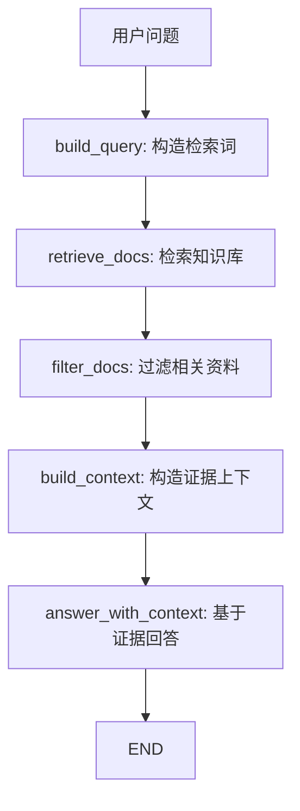

# 第31章-RAG Agent 与知识库

## 31.1 从“凭模型回答”开始

第 30 章讲了 Plan-and-Execute Agent。

它解决的是复杂任务如何先规划、再执行、再审查。

但还有一类问题，不是靠规划就能解决的。

比如用户问：

```text
LangGraph 的 Checkpoint 到底保存了什么？
RAG Agent 为什么要引用来源？
我们公司的内部报销政策是什么？
```

这些问题有一个共同点：

```text
答案不应该只来自模型记忆。
```

模型可以解释概念，可以组织语言，可以推理。

但它不一定知道你的内部文档，不一定知道最新资料，也不应该在没有证据时假装知道。

如果直接让模型回答：

```python
response = model.invoke("请解释我们公司的内部报销政策")
```

它可能会给出一段很流畅的答案。

问题是：

```text
这段答案来自哪里？
它是否符合真实资料？
用户能不能检查来源？
如果知识库没有资料，Agent 会不会编造？
```

RAG Agent 要解决的就是这个问题：

> Agent 如何从“凭模型回答”变成“基于资料回答”？

## 31.2 RAG 的核心思想

RAG 是 Retrieval-Augmented Generation。

可以直译为：

```text
检索增强生成
```

但在 Agent 架构里，更容易理解成一句话：

> 先找证据，再基于证据回答。

它的流程通常是：

```text
用户问题
-> 构造检索词
-> 检索知识库
-> 过滤相关资料
-> 注入上下文
-> 生成带来源的回答
```

用图表示：



这张图最重要的不是“生成回答”。

而是回答之前的四步：

```text
检索
过滤
上下文注入
来源保留
```

RAG Agent 的核心不是让模型更会背知识。

而是让模型回答时带着可检查的证据。

## 31.3 本章目标

本章采用“证据注入法”。

我们会构建一个小型 RAG Agent。

它使用一个本地内存知识库，不依赖真实向量数据库。

这样读者可以先看清 RAG 的结构，再把检索部分替换成 Chroma、FAISS、Milvus、Postgres pgvector 或其他向量库。

配套代码放在：

```text
codes/chapter31/chapter31_rag_agent.py
```

运行：

```bash
python codes/chapter31/chapter31_rag_agent.py
```

你会看到：

```text
build_query 生成检索词
retrieve_docs 找到候选资料
filter_docs 选中相关资料
build_context 构造证据上下文
answer_with_context 基于证据生成回答
```

本章最重要的目标不是实现一个强大的搜索系统，而是让读者理解：

> RAG Agent 的关键是把“资料如何进入回答”变成可观察、可测试的图流程。

## 31.4 错误写法：把资料问题直接交给模型

先看一个常见错误：

```python
def answer_question(state):
    response = model.invoke(state["question"])
    return {"answer": response.content}
```

这段代码能回答很多问题。

但当问题需要外部资料时，它有几个风险。

第一，来源不可见。

用户不知道答案是来自知识库、模型记忆，还是模型猜测。

第二，资料不可控。

如果公司政策已经更新，模型可能仍然按旧知识回答。

第三，无法拒答。

如果知识库里没有相关资料，模型仍然可能生成一个看似合理的答案。

第四，难以调试。

答案错了以后，你不知道是检索不到、资料不相关、上下文太长，还是生成阶段编造。

所以 RAG Agent 的第一条原则是：

> 涉及外部事实的问题，不能只让模型凭记忆回答。

回答必须经过证据链。

## 31.5 State 设计：把证据链放进状态

RAG Agent 的 State 应该保存从问题到答案的每一步。

本章定义如下：

```python
class RAGState(TypedDict, total=False):
    question: str
    query: str
    retrieved_docs: list[ScoredDocument]
    selected_docs: list[Document]
    context: str
    answer: str
    citations: list[str]
    confidence: str
    execution_log: list[str]
```

每个字段都有明确作用：

| 字段 | 作用 |
| --- | --- |
| `question` | 用户原始问题 |
| `query` | 用于检索的查询词 |
| `retrieved_docs` | 检索阶段找到的候选资料 |
| `selected_docs` | 过滤后真正进入上下文的资料 |
| `context` | 注入给模型的证据上下文 |
| `answer` | 最终回答 |
| `citations` | 引用来源 |
| `confidence` | 基于证据数量的简单置信度 |
| `execution_log` | 执行轨迹 |

这里最关键的是 `retrieved_docs` 和 `selected_docs` 的区别。

检索到的资料不一定都该进入回答。

RAG 里经常会出现：

```text
检索到了很多资料，但真正相关的只有一两条。
```

所以要把候选资料和最终选中资料分开。

这样调试时可以问：

```text
是知识库没检索到？
还是检索到了但过滤掉了？
还是选中了资料但生成时没用上？
```

## 31.6 知识库文档结构

本章使用一个很小的内存知识库：

```python
class Document(TypedDict):
    doc_id: str
    title: str
    source: str
    text: str
```

示例文档如下：

```python
KNOWLEDGE_BASE = [
    {
        "doc_id": "lg-state",
        "title": "LangGraph State",
        "source": "docs/core/state.md",
        "text": "State 是 LangGraph 图执行过程中的共享数据结构。节点读取 State，并返回局部更新。",
    },
    {
        "doc_id": "lg-checkpoint",
        "title": "Checkpoint",
        "source": "docs/runtime/checkpoint.md",
        "text": "Checkpoint 会保存图的中间状态，让长任务可以恢复、回放或在人工介入后继续执行。",
    },
]
```

真实项目里的文档通常还会有：

```text
chunk_id
page
section
created_at
updated_at
permission_scope
embedding
```

但教学阶段先保留四个字段就够了：

```text
id、标题、来源、正文。
```

尤其要保留 `source`。

因为没有来源，RAG 就只是“把一段文本塞进 prompt”。

有来源，回答才可检查。

## 31.7 build_query：把问题变成检索词

用户问题不一定适合直接拿去检索。

例如：

```text
请帮我详细解释一下 RAG Agent 如何基于资料回答。
```

检索时不一定需要“请帮我详细解释一下”。

所以先构造检索词：

```python
def build_query(state: RAGState) -> dict:
    query = state["question"].replace("请", "").replace("解释", "").strip()
    return {
        "query": query,
        "execution_log": append_log(state, f"build_query 生成检索词：{query}"),
    }
```

这个节点只做一件事：

```text
把用户问题转换成检索查询。
```

真实项目里，`build_query` 可以更复杂。

比如：

```text
改写用户问题
提取关键词
生成多个检索子问题
补充同义词
根据对话历史改写省略指代
```

但它仍然不应该生成最终答案。

它只负责让检索更准。

## 31.8 retrieve_docs：检索不是回答

本章用关键词重叠模拟检索。

真实项目里，这一步可以替换成向量检索。

```python
def retrieve_docs(state: RAGState) -> dict:
    query_terms = normalize(state["query"])
    scored: list[ScoredDocument] = []

    for doc in KNOWLEDGE_BASE:
        doc_terms = normalize(f"{doc['title']} {doc['text']}")
        score = len(query_terms & doc_terms)
        if score > 0:
            scored.append({"doc": doc, "score": score})

    scored.sort(key=lambda item: item["score"], reverse=True)

    return {
        "retrieved_docs": scored,
        "execution_log": append_log(state, f"retrieve_docs 找到 {len(scored)} 条候选资料"),
    }
```

这个节点的输出是候选资料。

注意，它仍然不是答案。

检索节点不应该说：

```text
我找到了资料，所以答案是……
```

它只应该说：

```text
我找到了这些可能相关的资料。
```

RAG Agent 的第二条原则是：

> 检索负责召回资料，不负责生成答案。

如果检索节点开始生成答案，后面的过滤、上下文注入和引用就会失去边界。

## 31.9 filter_docs：不是所有资料都应该进入上下文

检索召回的资料可能有噪声。

所以需要过滤。

```python
def filter_docs(state: RAGState) -> dict:
    retrieved = state.get("retrieved_docs", [])
    max_score = retrieved[0]["score"] if retrieved else 0
    selected = [item["doc"] for item in retrieved if item["score"] == max_score]
    selected = selected[:3]

    confidence = "high" if len(selected) >= 2 else "low"
    if not selected:
        confidence = "none"

    return {
        "selected_docs": selected,
        "confidence": confidence,
        "execution_log": append_log(state, f"filter_docs 选中 {len(selected)} 条资料"),
    }
```

本章只用简单规则：

```text
只保留最高分资料。
最多保留 3 条。
```

真实项目里可以加入：

```text
相似度阈值
去重
重排序 rerank
权限过滤
时间过滤
来源可信度过滤
```

过滤节点解决的是一个关键问题：

> 哪些资料有资格进入模型上下文？

不要把所有检索结果都塞给模型。

上下文越多，不一定越好。

无关资料会稀释重点，甚至引导模型生成错误答案。

## 31.10 build_context：把证据变成可引用上下文

选中资料后，要构造上下文。

```python
def build_context(state: RAGState) -> dict:
    docs = state.get("selected_docs", [])
    context_lines = []

    for index, doc in enumerate(docs, start=1):
        context_lines.append(f"[{index}] {doc['title']} ({doc['source']}): {doc['text']}")

    return {
        "context": "\n".join(context_lines),
        "citations": [doc["source"] for doc in docs],
        "execution_log": append_log(state, "build_context 构造带编号的证据上下文"),
    }
```

这里有两个细节。

第一，给资料编号。

```text
[1] ...
[2] ...
```

这样最终回答可以引用证据。

第二，保留 `citations`。

```python
"citations": [doc["source"] for doc in docs]
```

这样 UI、日志、测试都能直接检查来源。

RAG Agent 的第三条原则是：

> 上下文不只是给模型看的文本，也应该是可追踪的证据结构。

## 31.11 answer_with_context：基于证据回答

最后才进入回答节点。

```python
def answer_with_context(state: RAGState) -> dict:
    if not state.get("selected_docs"):
        return {
            "answer": "当前知识库没有找到足够资料，不能基于证据回答这个问题。",
            "citations": [],
            "execution_log": append_log(state, "answer_with_context 因证据不足而拒绝编造"),
        }

    answer = (
        f"问题：{state['question']}\n\n"
        "基于知识库资料，可以这样回答：\n"
        f"{state['context']}\n\n"
        "结论：RAG Agent 的关键不是让模型凭记忆回答，而是先检索资料、筛选证据、"
        "把证据注入上下文，再生成带来源的回答。"
    )

    return {
        "answer": answer,
        "execution_log": append_log(state, "answer_with_context 基于证据生成回答"),
    }
```

真实项目里，这个节点会调用模型。

但 prompt 应该明确要求：

```text
只基于给定资料回答。
如果资料不足，说明无法回答。
回答中标注引用来源。
不要编造知识库外的信息。
```

本章示例没有调用模型，是为了让证据链更清楚。

重点不是生成更漂亮的答案，而是：

```text
没有证据时拒绝编造。
有证据时基于证据回答。
回答保留来源。
```

## 31.12 完整图组装

完整图如下：

```python
def build_rag_agent():
    builder = StateGraph(RAGState)

    builder.add_node("build_query", build_query)
    builder.add_node("retrieve_docs", retrieve_docs)
    builder.add_node("filter_docs", filter_docs)
    builder.add_node("build_context", build_context)
    builder.add_node("answer_with_context", answer_with_context)

    builder.add_edge(START, "build_query")
    builder.add_edge("build_query", "retrieve_docs")
    builder.add_edge("retrieve_docs", "filter_docs")
    builder.add_edge("filter_docs", "build_context")
    builder.add_edge("build_context", "answer_with_context")
    builder.add_edge("answer_with_context", END)

    return builder.compile()
```

这个流程是线性的。

但它不是普通 chain。

因为每一步都把中间状态显式写出来：

```text
query
retrieved_docs
selected_docs
context
citations
answer
```

这就是 LangGraph 写 RAG 的好处。

你不是只得到一个最终答案，而是能观察：

```text
资料如何被找到。
资料如何被筛选。
资料如何进入上下文。
答案引用了哪些来源。
```

## 31.13 运行结果应该观察什么

运行：

```bash
python codes/chapter31/chapter31_rag_agent.py
```

你会看到类似输出：

```text
执行日志：
- build_query 生成检索词：RAG Agent 如何基于资料回答
- retrieve_docs 找到 1 条候选资料
- filter_docs 选中 1 条资料
- build_context 构造带编号的证据上下文
- answer_with_context 基于证据生成回答
```

然后会看到引用来源：

```text
引用来源：
- docs/patterns/rag.md
```

最终回答中也会包含上下文片段：

```text
[1] RAG Agent (docs/patterns/rag.md): RAG Agent 先检索外部资料...
```

观察 RAG Agent 时，不要只看回答是否顺口。

更重要的是看：

```text
query 是否适合检索？
retrieved_docs 是否召回相关资料？
selected_docs 是否过滤掉噪声？
context 是否保留来源？
answer 是否基于 context？
citations 是否可追踪？
```

## 31.14 RAG Agent 与普通问答的区别

普通问答和 RAG 问答最大的区别不是“有没有知识库”。

而是答案的责任来源不同。

| 类型 | 答案来源 | 风险 |
| --- | --- | --- |
| 普通问答 | 模型参数记忆和推理 | 可能过时、编造、无法追踪 |
| RAG 问答 | 检索到的外部资料 + 模型组织语言 | 依赖检索质量和资料质量 |

普通问答适合：

```text
通用概念解释
语言改写
开放式建议
不要求来源的轻量问题
```

RAG 适合：

```text
企业内部知识
项目文档问答
政策制度解释
研究资料总结
需要引用来源的答案
```

一句话判断：

> 如果答案必须可追溯，就应该考虑 RAG。

## 31.15 RAG 的常见架构扩展

本章示例是最小 RAG。

真实项目里可以继续扩展。

第一，查询改写。

```text
把用户口语问题改成适合检索的查询。
```

第二，多路检索。

```text
同时检索标题、正文、关键词、向量库、数据库。
```

第三，重排序。

```text
用 reranker 或强模型判断哪些资料最相关。
```

第四，权限过滤。

```text
用户只能看到自己有权限访问的文档。
```

第五，答案审查。

```text
检查回答中的每个关键结论是否有来源支持。
```

第六，来源展示。

```text
在 UI 中展示文档标题、段落、页码和链接。
```

这些扩展都可以继续用 LangGraph 表达成节点：

```text
rewrite_query
hybrid_retrieve
rerank_docs
permission_filter
grounded_answer
verify_citations
```

不要急着把所有逻辑塞进一个 RAG 函数。

RAG 的每一步都值得单独观察。

## 31.16 常见错误与排查

RAG Agent 的错误通常不是“模型不会回答”，而是证据链某一段断了。

| 现象 | 可能原因 | 排查方式 |
| --- | --- | --- |
| 答案没有引用来源 | `build_context` 没保留 source | 检查 `citations` |
| 明明有资料却没回答 | 查询词改写太差或过滤阈值太高 | 查看 `query` 和 `retrieved_docs` |
| 回答引用了无关资料 | 检索召回噪声太多 | 增加 rerank 或过滤规则 |
| 模型编造知识库外信息 | prompt 没限制只基于 context | 强化 grounded answer 约束 |
| 检索结果太多 | 没有限制 top_k | 限制 `selected_docs` 数量 |
| 用户看到无权限资料 | 缺少权限过滤 | 在 filter 阶段加入 permission scope |
| 答案过长但没重点 | context 太长或未压缩 | 加 summarize_context 节点 |
| 无资料时仍然回答 | 缺少无证据拒答逻辑 | 检查 `selected_docs` 为空时的分支 |

排查主线可以固定为：

```text
question
-> query
-> retrieved_docs
-> selected_docs
-> context
-> citations
-> answer
```

只要这条线清楚，RAG 就不是黑箱。

## 31.17 测试重点

RAG Agent 的测试应该重点保护证据链。

第一，测试查询构造。

```python
def test_build_query_removes_polite_words():
    result = build_query({"question": "请解释 RAG Agent"})

    assert result["query"] == "RAG Agent"
```

第二，测试检索能召回相关资料。

```python
def test_retrieve_docs_finds_rag_doc():
    result = retrieve_docs({"query": "RAG Agent 资料"})

    assert result["retrieved_docs"]
```

第三，测试上下文保留来源。

```python
def test_build_context_keeps_citations():
    doc = {
        "doc_id": "x",
        "title": "RAG",
        "source": "docs/rag.md",
        "text": "RAG uses retrieval.",
    }

    result = build_context({"selected_docs": [doc]})

    assert "docs/rag.md" in result["context"]
    assert result["citations"] == ["docs/rag.md"]
```

第四，测试无证据时拒绝编造。

```python
def test_answer_refuses_without_docs():
    result = answer_with_context({"question": "未知问题", "selected_docs": []})

    assert "没有找到足够资料" in result["answer"]
    assert result["citations"] == []
```

第五，测试完整图有来源。

```python
def test_rag_graph_returns_citations():
    graph = build_rag_agent()

    result = graph.invoke({"question": "解释 RAG Agent"})

    assert result["answer"]
    assert result["citations"]
```

这些测试也不需要真实 LLM。

因为 RAG 的很多关键质量来自工程链路：

```text
能不能找到资料。
能不能过滤资料。
能不能保留来源。
没有资料时能不能拒答。
```

## 31.18 本章小结

本章讲了第七部分的第四种进阶 Agent 架构：RAG Agent 与知识库。

它解决的问题是：

> Agent 如何从“凭模型回答”变成“基于资料回答”？

RAG Agent 的核心不是把知识库接到模型旁边，而是建立一条可观察的证据链：

```text
问题
-> 检索词
-> 候选资料
-> 选中资料
-> 证据上下文
-> 带来源回答
```

本章最重要的结论是：

> RAG 的价值不只是提高答案准确率，而是让答案有来源、有边界、可检查。

设计 RAG Agent 时，记住五条原则：

- 涉及外部事实的问题，不要让模型只凭记忆回答。
- 检索负责召回资料，不负责生成答案。
- 过滤决定哪些资料有资格进入上下文。
- 上下文要保留来源，回答要能引用来源。
- 没有足够证据时，Agent 应该拒绝编造。

到这里，Agent 已经能基于外部知识回答。

但即使有资料，第一次生成的答案也可能不够好。

下一章会进入 Reflection 与自我修正。

它要解决的问题是：

> Agent 如何发现自己的答案不好，并受控地修正？
