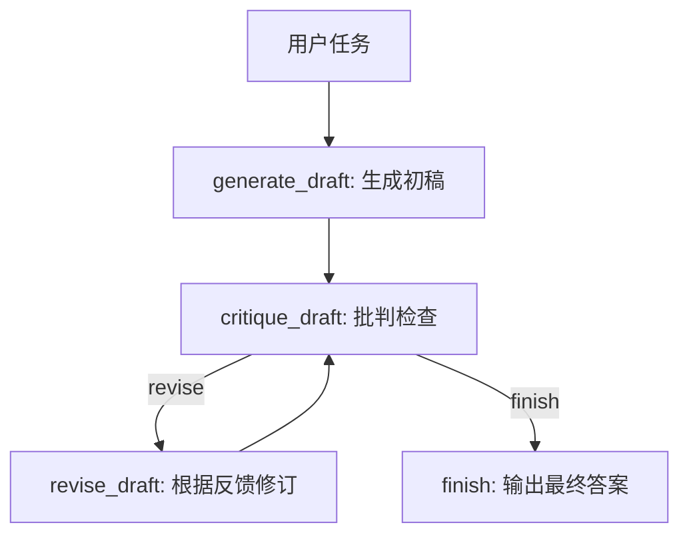

# 第32章-Reflection 与自我修正

## 32.1 有资料，也不代表第一次回答就好

第 31 章讲了 RAG Agent。

RAG 让 Agent 不再只凭模型记忆回答，而是先检索资料，再基于证据生成答案。

但有资料并不等于答案一定好。

一个 RAG Agent 可能找到了正确资料，却仍然写出这样的问题答案：

```text
内容太泛。
没有回答用户真正的问题。
引用了资料，但结论没有用资料支撑。
结构混乱。
漏掉关键限制。
```

普通 Agent 通常是：

```text
生成一次 -> 返回给用户
```

Reflection Agent 多了一步：

```text
生成一次 -> 批判检查 -> 根据反馈修订 -> 再检查 -> 达到条件后返回
```

本章要解决的问题是：

> Agent 如何发现自己答案不好，并受控地修正？

注意这里有两个关键词。

第一个是“发现”。

Agent 不能只会生成，还要能判断生成结果哪里不够好。

第二个是“受控”。

Agent 不能无限自我怀疑、无限重写。

Reflection 的价值不是让 Agent 想得更久，而是让反馈循环有边界。

## 32.2 Reflection 的核心思想

Reflection 与自我修正可以理解成一个反馈闭环：

```text
生成答案
-> 批判答案
-> 如果不合格，修订答案
-> 再批判
-> 通过或达到停止条件后结束
```

用图表示：



这张图里最重要的是回路：

```text
critique_draft -> revise_draft -> critique_draft
```

但回路必须有停止条件。

否则 Reflection 会变成：

```text
觉得不够好 -> 改一下 -> 又觉得不够好 -> 再改一下 -> 一直循环
```

所以 Reflection Agent 的核心不是“会反思”，而是：

> 用明确标准检查答案，用明确反馈修订答案，用明确停止条件结束循环。

## 32.3 本章目标

本章采用“反馈闭环法”。

我们会构建一个小型 Reflection Agent：

```text
输入任务
-> generate_draft 生成一个初稿
-> critique_draft 检查初稿是否合格
-> 如果不合格，revise_draft 根据反馈修订
-> 再回到 critique_draft
-> 通过或达到最大修订次数后 finish
```

配套代码放在：

```text
codes/chapter32/chapter32_reflection_agent.py
```

运行：

```bash
python codes/chapter32/chapter32_reflection_agent.py
```

你会看到类似日志：

```text
generate_draft 生成初稿
critique_draft 发现 3 个问题
revise_draft 根据反馈修订答案
critique_draft 通过
finish 输出最终答案
```

本章最重要的目标不是让 Agent 写得多华丽，而是让读者看懂：

> 自我修正必须有批判标准、修订依据和停止条件。

## 32.4 错误写法：让模型自己“再想想”

很多人第一次做 Reflection，会写成这样：

```python
answer = model.invoke("请回答问题")
better_answer = model.invoke(f"请检查并改进这个答案：{answer}")
```

这看起来像自我修正。

但它的问题很明显。

第一，批判标准不清楚。

“检查并改进”到底检查什么？

事实错误、结构问题、引用缺失、语言啰嗦，还是安全风险？

第二，反馈不可观察。

你只得到一个改进后的答案，却不知道它改了什么。

第三，循环不可控。

如果继续要求“再改进一下”，什么时候停？

第四，测试困难。

你无法测试批判节点是否真的发现了问题，也无法测试修订节点是否按反馈修改。

所以 Reflection 的第一条原则是：

> 不要把“批判”和“修订”混成一句 prompt。

批判要产生结构化反馈。

修订要基于反馈行动。

## 32.5 State 设计：反馈循环必须可观察

Reflection Agent 的 State 需要保存草稿、批判、修订次数和最终状态。

本章定义如下：

```python
class ReflectionState(TypedDict, total=False):
    task: str
    draft: str
    critique: Critique
    revision_count: int
    max_revisions: int
    quality_status: QualityStatus
    final_answer: str
    execution_log: list[str]
```

每个字段都有明确作用：

| 字段 | 作用 |
| --- | --- |
| `task` | 用户任务 |
| `draft` | 当前版本答案 |
| `critique` | 批判结果 |
| `revision_count` | 已修订次数 |
| `max_revisions` | 最大修订次数 |
| `quality_status` | 下一步：修订或结束 |
| `final_answer` | 最终答案 |
| `execution_log` | 反馈循环轨迹 |

这里最关键的是三个字段：

```text
critique
revision_count
max_revisions
```

`critique` 让问题可观察。

`revision_count` 让循环可计数。

`max_revisions` 让循环可停止。

Reflection 的第二条原则是：

> 没有最大修订次数的自我修正，是不完整的 Agent 设计。

## 32.6 Critique：批判结果要结构化

批判结果不应该只是一段自然语言。

本章用一个简单结构：

```python
class Critique(TypedDict):
    passed: bool
    issues: list[str]
    suggestions: list[str]
```

它回答三个问题：

```text
是否通过？
有哪些问题？
应该怎么修？
```

例如：

```python
{
    "passed": False,
    "issues": [
        "没有说明如何避免无限反思",
        "没有说明反馈循环需要哪些状态字段",
    ],
    "suggestions": [
        "补充 max_revisions 或最大修订次数",
        "补充 draft、critique、revision_count、quality_status 等字段",
    ],
}
```

这样的反馈才能被 `revise_draft` 稳定使用。

如果批判只是：

```text
这个答案还可以更好。
```

修订节点仍然不知道该改哪里。

## 32.7 generate_draft：先生成一个可批判的初稿

生成节点只负责生成初稿。

```python
def generate_draft(state: ReflectionState) -> dict:
    draft = (
        "Reflection Agent 会先生成答案，再检查答案是否足够好。"
        "如果不够好，就根据反馈修改。"
    )

    return {
        "draft": draft,
        "revision_count": 0,
        "max_revisions": state.get("max_revisions", 2),
        "execution_log": append_log(state, "generate_draft 生成初稿"),
    }
```

这个初稿故意不完整。

它没有说明：

```text
如何避免无限反思。
需要哪些 State 字段。
为什么自我修正必须受控。
```

这样做是为了让读者看到 Reflection 的价值。

如果第一次回答已经完美，反馈闭环就看不出作用。

真实项目里，`generate_draft` 可以调用 Ollama 或 DeepSeek。

但边界不变：

> 生成节点只生成当前版本，不负责批判自己。

## 32.8 critique_draft：发现答案哪里不好

批判节点读取当前 `draft`，按照规则检查。

```python
def critique_draft(state: ReflectionState) -> dict:
    draft = state["draft"]
    issues: list[str] = []
    suggestions: list[str] = []

    if "最大修订次数" not in draft and "max_revisions" not in draft:
        issues.append("没有说明如何避免无限反思")
        suggestions.append("补充 max_revisions 或最大修订次数")

    if "State" not in draft:
        issues.append("没有说明反馈循环需要哪些状态字段")
        suggestions.append("补充 draft、critique、revision_count、quality_status 等字段")

    if "受控" not in draft:
        issues.append("没有强调自我修正必须受控")
        suggestions.append("说明 Reflection 不是无限自我怀疑，而是有停止条件的反馈闭环")
```

这段检查很简单，但表达了一个关键思想：

```text
批判必须有标准。
```

本章的标准是：

```text
是否说明停止条件。
是否说明关键 State 字段。
是否强调受控反馈闭环。
```

真实项目里，批判标准可以换成：

```text
是否回答用户问题。
是否有引用来源。
是否遗漏约束。
是否格式正确。
是否有安全风险。
是否符合业务规则。
```

批判节点最后写入 `quality_status`：

```python
passed = not issues
status: QualityStatus = "finish" if passed else "revise"

if not passed and state.get("revision_count", 0) >= state.get("max_revisions", 2):
    status = "finish"
    suggestions.append("已达到最大修订次数，停止继续修订")
```

这就是受控循环的关键。

即使没通过，只要达到最大修订次数，也要结束。

## 32.9 revise_draft：只按反馈修订

修订节点读取 `critique`，按建议修改 `draft`。

```python
def revise_draft(state: ReflectionState) -> dict:
    critique = state["critique"]
    suggestions = "；".join(critique["suggestions"])
    revised = (
        f"{state['draft']}\n\n"
        "修订补充：Reflection 与自我修正应该是受控反馈闭环。"
        "State 至少要保存 draft、critique、revision_count、max_revisions、quality_status。"
        "每一轮批判只提出明确问题，修订节点只按反馈修改，"
        "并用最大修订次数 max_revisions 防止 Agent 无限反思。\n"
        f"本轮依据的反馈：{suggestions}"
    )

    return {
        "draft": revised,
        "revision_count": state.get("revision_count", 0) + 1,
        "execution_log": append_log(state, "revise_draft 根据反馈修订答案"),
    }
```

注意，修订节点不重新发明一个新任务。

它只做一件事：

```text
根据 critique 修改 draft。
```

如果修订节点完全无视反馈，重新写一篇，它就不是反馈闭环，而是重新生成。

Reflection 的第三条原则是：

> 修订必须能追溯到批判意见。

## 32.10 条件边：批判决定修订还是结束

批判节点写入 `quality_status` 后，条件边决定下一步。

```python
def decide_after_critique(state: ReflectionState) -> str:
    return state["quality_status"]
```

图结构如下：

```python
builder.add_conditional_edges(
    "critique_draft",
    decide_after_critique,
    {
        "revise": "revise_draft",
        "finish": "finish",
    },
)
```

如果需要修订：

```text
critique_draft -> revise_draft -> critique_draft
```

如果通过或达到停止条件：

```text
critique_draft -> finish
```

这个条件边是 Reflection 的控制阀。

它让自我修正不再是一句“再想想”，而是一个可控流程。

## 32.11 完整图组装

完整图如下：

```python
def build_reflection_agent():
    builder = StateGraph(ReflectionState)

    builder.add_node("generate_draft", generate_draft)
    builder.add_node("critique_draft", critique_draft)
    builder.add_node("revise_draft", revise_draft)
    builder.add_node("finish", finish)

    builder.add_edge(START, "generate_draft")
    builder.add_edge("generate_draft", "critique_draft")
    builder.add_conditional_edges(
        "critique_draft",
        decide_after_critique,
        {
            "revise": "revise_draft",
            "finish": "finish",
        },
    )
    builder.add_edge("revise_draft", "critique_draft")
    builder.add_edge("finish", END)

    return builder.compile()
```

可以把它读成：

```text
先生成。
再批判。
如果有问题，修订。
修订后再批判。
通过或达到最大次数后结束。
```

这就是反馈闭环法。

## 32.12 finish：输出当前最好版本

Finish 节点负责输出最终答案。

```python
def finish(state: ReflectionState) -> dict:
    critique = state.get("critique", {"passed": False, "issues": [], "suggestions": []})
    suffix = "审查通过。" if critique["passed"] else "达到停止条件，保留当前最好版本。"

    return {
        "final_answer": f"{state['draft']}\n\n最终状态：{suffix}",
        "execution_log": append_log(state, "finish 输出最终答案"),
    }
```

这里的措辞很重要。

如果通过，就说明审查通过。

如果没有通过但达到最大修订次数，就说明：

```text
达到停止条件，保留当前最好版本。
```

不要假装答案已经完美。

受控 Agent 要诚实记录结束原因。

## 32.13 运行结果应该观察什么

运行：

```bash
python codes/chapter32/chapter32_reflection_agent.py
```

你会看到类似日志：

```text
执行日志：
- generate_draft 生成初稿
- critique_draft 发现 3 个问题
- revise_draft 根据反馈修订答案
- critique_draft 通过
- finish 输出最终答案
```

最终答案会包含补充内容：

```text
Reflection 与自我修正应该是受控反馈闭环。
State 至少要保存 draft、critique、revision_count、max_revisions、quality_status。
并用最大修订次数 max_revisions 防止 Agent 无限反思。
```

观察 Reflection Agent 时，不要只看最终答案。

更重要的是看：

```text
critique 是否指出具体问题？
suggestions 是否能指导修订？
revision_count 是否正确增加？
max_revisions 是否能阻止无限循环？
quality_status 是否控制了下一步？
```

## 32.14 Reflection 与 Plan-and-Execute 的区别

Reflection 和 Plan-and-Execute 都有检查环节。

但它们关注的问题不同。

| 架构 | 核心问题 | 检查对象 |
| --- | --- | --- |
| Plan-and-Execute | 是否按计划完成复杂任务？ | 计划步骤和执行结果 |
| Reflection | 当前答案是否足够好？ | 草稿质量和修订反馈 |

Plan-and-Execute 更关注任务过程：

```text
计划是否完整？
步骤是否执行？
是否需要补充计划？
```

Reflection 更关注输出质量：

```text
答案是否回答问题？
是否遗漏关键点？
是否需要重写或补充？
```

两者可以组合。

例如：

```text
Plan-and-Execute 负责完成多步骤任务。
每一步输出后，用 Reflection 检查质量。
最终报告生成后，再用 Reflection 做全文审查。
```

但学习时先分开理解。

第 30 章解决“怎么按计划做”。

第 32 章解决“做出来的东西是否够好，以及如何受控修改”。

## 32.15 什么时候适合 Reflection

Reflection 适合这些场景：

| 场景 | 为什么适合 |
| --- | --- |
| 长文生成 | 初稿容易结构松散，需要批判后修订 |
| 代码生成 | 需要检查边界条件、测试、错误处理 |
| RAG 回答 | 需要检查答案是否真的基于来源 |
| 工具调用总结 | 需要检查是否正确使用工具结果 |
| 计划生成 | 需要检查计划是否漏步骤 |
| 安全敏感任务 | 需要检查是否越权、泄露或违反策略 |

它不适合所有任务。

如果问题很简单：

```text
LangGraph 的 Node 是什么？
```

直接回答就可以。

如果每次回答都强制 Reflection，会增加延迟和成本。

Reflection 更适合：

```text
答案质量比速度更重要。
第一次生成容易漏关键约束。
需要明确审查标准。
需要保留修订轨迹。
```

## 32.16 常见错误与排查

Reflection 的常见错误通常来自反馈闭环失控。

| 现象 | 可能原因 | 排查方式 |
| --- | --- | --- |
| 无限修订 | 没有 `max_revisions` 或停止条件 | 检查 `revision_count` |
| 每轮都重写得完全不同 | revise 节点没有基于 critique 修改 | 检查 `suggestions` 是否进入修订 prompt |
| 批判太泛 | critique 只说“还可以更好” | 让 critique 输出结构化 issues |
| 修订没有改善 | suggestions 不可执行 | 把建议写成具体修改动作 |
| 明明通过还继续修订 | `quality_status` 或条件边映射错误 | 对比状态值和 `add_conditional_edges` |
| 达到上限却声称完美 | finish 没区分通过和停止 | 输出结束原因 |
| 成本过高 | 所有任务都启用 Reflection | 只对高风险、高价值输出使用 |

排查主线可以固定为：

```text
task
-> draft
-> critique.passed / issues / suggestions
-> quality_status
-> revise_draft 或 finish
-> revision_count / max_revisions
```

只要这条线清楚，Reflection 就不会变成无限自我修改。

## 32.17 测试重点

Reflection Agent 的测试要保护反馈闭环。

第一，测试批判能发现缺口。

```python
def test_critique_finds_missing_stop_condition():
    result = critique_draft({"draft": "Reflection 会检查并修改答案。", "revision_count": 0, "max_revisions": 2})

    assert result["quality_status"] == "revise"
    assert result["critique"]["issues"]
```

第二，测试修订次数会增加。

```python
def test_revise_increments_revision_count():
    state = {
        "draft": "初稿",
        "critique": {"passed": False, "issues": ["x"], "suggestions": ["补充停止条件"]},
        "revision_count": 0,
    }

    result = revise_draft(state)

    assert result["revision_count"] == 1
```

第三，测试达到最大次数后结束。

```python
def test_critique_stops_at_max_revisions():
    state = {
        "draft": "仍然不完整",
        "revision_count": 2,
        "max_revisions": 2,
    }

    result = critique_draft(state)

    assert result["quality_status"] == "finish"
```

第四，测试完整图能结束。

```python
def test_reflection_graph_finishes():
    graph = build_reflection_agent()

    result = graph.invoke({"task": "解释 Reflection", "max_revisions": 2})

    assert result["final_answer"]
    assert result["revision_count"] <= 2
```

这些测试不需要真实 LLM。

因为本章真正要验证的是：

```text
批判是否结构化。
修订是否基于反馈。
循环是否受控。
最终是否能结束。
```

## 32.18 第七部分小结：五种进阶 Agent 架构

到这里，第七部分结束。

我们已经学了五种进阶 Agent 架构：

| 章节 | 架构 | 解决的问题 |
| --- | --- | --- |
| 第 28 章 | Router Agent | 面对不同任务类型时，如何选择不同路径 |
| 第 29 章 | Supervisor 多 Agent | 多个 Agent 如何分工协作 |
| 第 30 章 | Plan-and-Execute | 复杂任务为什么要先规划再执行 |
| 第 31 章 | RAG Agent | Agent 如何基于资料回答 |
| 第 32 章 | Reflection | Agent 如何发现答案不好并受控修正 |

这五种架构不是互相替代，而是解决不同复杂度。

可以这样理解：

```text
Router 解决分流。
Supervisor 解决协作。
Plan-and-Execute 解决长程任务。
RAG 解决证据来源。
Reflection 解决质量反馈。
```

真实复杂 Agent 往往会组合这些模式。

例如一个研究助理 Agent：

```text
Router 判断用户是问答、写作还是研究。
Plan-and-Execute 生成研究计划。
Supervisor 分派检索、分析、写作 Worker。
RAG 为回答注入资料来源。
Reflection 审查最终报告质量。
```

第七部分最重要的结论是：

> 进阶 Agent 架构不是堆更多节点，而是为复杂任务建立清晰的控制方式。

下一部分会进入完整复杂案例。

我们会把前面学到的概念、工程化方法和进阶架构组合起来，构建一个更完整的智能研究助理 Agent。
