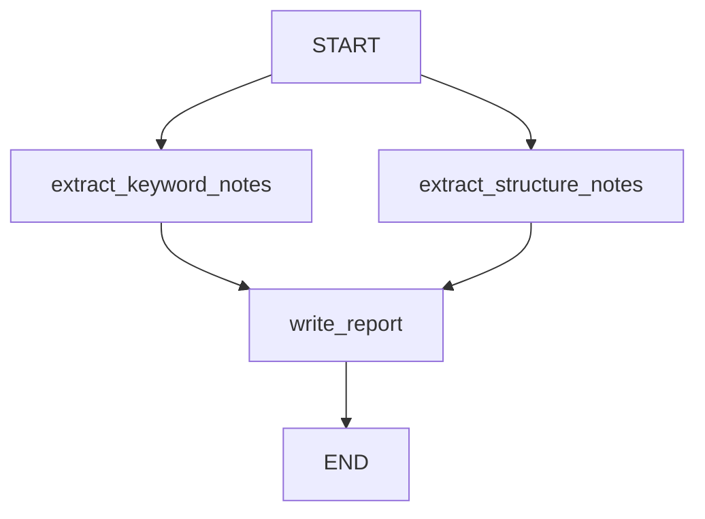

# 第10章-Reducer与状态合并

## 10.1 先看一个状态被覆盖的问题

前面三章，我们已经有了 LangGraph 的三块核心积木：

- `State`：保存 Agent 的工作记忆。
- `Node`：完成一步具体工作。
- `Edge`：决定下一步去哪。

现在还差一个很容易被忽略的问题：

> 如果多个节点都想更新同一个 State 字段，LangGraph 应该怎么合并？

先看一个小任务。

我们要围绕一个主题生成两类观察：

```text
主题：LangGraph Agent
```

一个节点负责提取关键词观察：

```text
关键词观察：LangGraph Agent 通常和状态、节点、边有关。
```

另一个节点负责提取结构观察：

```text
结构观察：LangGraph Agent 适合用图表示多步骤流程。
```

最后把两类观察合并成一份报告。

这个任务看起来很简单，但它会暴露一个重要问题：两个节点都想写入 `notes`。

如果用普通 `dict` 写，很容易变成这样：

```python
def overwrite_dict_version(topic: str) -> dict:
    state = {
        "topic": topic,
        "notes": [],
    }

    state["notes"] = [f"关键词观察：{topic} 通常和状态、节点、边有关。"]
    state["notes"] = [f"结构观察：{topic} 适合用图表示多步骤流程。"]

    state["report"] = "\n".join(state["notes"])
    return state
```

运行后，第一条观察会被第二条覆盖。

最后只剩：

```text
结构观察：LangGraph Agent 适合用图表示多步骤流程。
```

问题不在 `notes` 这个字段本身，而在我们没有告诉程序：

> 当多个更新都写入 `notes` 时，应该覆盖，还是追加？

Reducer 就是用来回答这个问题的。

## 10.2 Reducer 是 State 字段的合并规则

在 LangGraph 里，节点返回的是状态更新。

例如：

```python
return {"notes": ["关键词观察：..."]}
```

另一个节点也可能返回：

```python
return {"notes": ["结构观察：..."]}
```

如果两个节点都更新 `notes`，LangGraph 需要知道怎么把它们合并成最终状态。

默认情况下，普通字段通常按“后写覆盖前写”的思路理解。对于只有一个节点写入的字段，这没有问题。

比如：

```python
return {"answer": "最终回答"}
```

`answer` 一般就是最终结果，被最后一个节点写入即可。

但像 `notes`、`messages`、`tool_results` 这样的字段，常常需要累积多个节点的结果。这时就不能简单覆盖。

Reducer 的作用是：

> 为某个 State 字段声明“如何把旧值和新值合并”。

本章最常用的例子是列表追加。

旧值：

```python
["关键词观察：..."]
```

新值：

```python
["结构观察：..."]
```

合并后：

```python
[
    "关键词观察：...",
    "结构观察：...",
]
```

这就是 reducer 要表达的规则。

## 10.3 完整示例代码

本章示例放在：

```text
codes/chapter10/chapter10_reducer_state_merge.py
```

运行：

```bash
python codes/chapter10/chapter10_reducer_state_merge.py
```

这个示例不调用 Ollama。因为本章重点不是模型生成，而是状态合并。去掉模型调用后，读者可以更清楚地观察 reducer 的作用。

完整代码如下：

```python
from operator import add
from typing import Annotated, TypedDict

from langgraph.graph import END, START, StateGraph


class ReportState(TypedDict, total=False):
    topic: str
    notes: Annotated[list[str], add]
    report: str
```

这里最关键的是这一行：

```python
notes: Annotated[list[str], add]
```

它表示 `notes` 是一个字符串列表，并且这个字段的合并规则是 `operator.add`。

对列表来说，`add` 的效果就是拼接列表：

```python
["a"] + ["b"] == ["a", "b"]
```

接着定义两个并行节点：

```python
def extract_keyword_notes(state: ReportState) -> dict:
    return {
        "notes": [
            f"关键词观察：{state['topic']} 通常和状态、节点、边有关。"
        ]
    }


def extract_structure_notes(state: ReportState) -> dict:
    return {
        "notes": [
            f"结构观察：{state['topic']} 适合用图表示多步骤流程。"
        ]
    }
```

它们都写入 `notes`。

最后定义汇总节点：

```python
def write_report(state: ReportState) -> dict:
    report = "综合观察：\n" + "\n".join(f"- {note}" for note in state["notes"])
    return {"report": report}
```

然后组装图：

```python
builder = StateGraph(ReportState)

builder.add_node("extract_keyword_notes", extract_keyword_notes)
builder.add_node("extract_structure_notes", extract_structure_notes)
builder.add_node("write_report", write_report)

builder.add_edge(START, "extract_keyword_notes")
builder.add_edge(START, "extract_structure_notes")
builder.add_edge(["extract_keyword_notes", "extract_structure_notes"], "write_report")
builder.add_edge("write_report", END)

graph = builder.compile()
```

这里有一个新写法：

```python
builder.add_edge(["extract_keyword_notes", "extract_structure_notes"], "write_report")
```

它表示 `write_report` 要等这两个节点都执行完以后再运行。

完整流程是：



这就是一个很小的 fan-in 场景：多个节点产生结果，一个节点汇总结果。

## 10.4 没有 Reducer 会发生什么

如果 `notes` 只是普通字段：

```python
class ReportState(TypedDict, total=False):
    topic: str
    notes: list[str]
    report: str
```

那么两个并行节点都写入 `notes` 时，LangGraph 不知道应该怎么合并。

它不能擅自决定：

- 是保留第一个？
- 是保留第二个？
- 是把两个列表拼起来？
- 是报错提醒开发者？

对 Agent 来说，这不是一个小问题。

因为不同字段的合并语义完全不同。

| 字段 | 合并方式 |
| --- | --- |
| `answer` | 通常覆盖 |
| `notes` | 通常追加 |
| `messages` | 通常追加或按消息 ID 更新 |
| `score` | 可能取最大值、最小值或平均值 |
| `tool_results` | 可能按工具名合并 |

所以 LangGraph 不应该猜。开发者需要为会被多个节点更新的字段声明 reducer。

这也是 reducer 的核心价值：

> 它把“状态怎么合并”从隐含行为变成显式规则。

## 10.5 用 Annotated 给字段绑定合并规则

本章使用的是：

```python
from operator import add
from typing import Annotated
```

然后在 State 中写：

```python
notes: Annotated[list[str], add]
```

可以把它读成：

```text
notes 是 list[str]
当多个节点更新 notes 时，用 add 合并
```

`Annotated` 的作用是给类型附加额外信息。这里的额外信息就是 reducer 函数。

Reducer 函数的形状可以理解为：

```python
def reducer(old_value, new_value):
    return merged_value
```

`operator.add` 对列表的行为正好符合我们需要：

```python
old_value = ["关键词观察：..."]
new_value = ["结构观察：..."]
merged_value = old_value + new_value
```

如果节点返回的是：

```python
{"notes": ["关键词观察：..."]}
```

另一个节点返回：

```python
{"notes": ["结构观察：..."]}
```

最后 State 中的 `notes` 就会包含两条。

这也是为什么节点返回值必须保持一致：既然 reducer 期待合并列表，节点就应该返回列表，而不是字符串。

正确：

```python
return {"notes": ["一条观察"]}
```

不推荐：

```python
return {"notes": "一条观察"}
```

后者会让 reducer 的行为变得不符合预期。

## 10.6 Reducer 和并行节点

Reducer 在并行节点中尤其重要。

本章图里，`START` 同时连到两个节点：

```python
builder.add_edge(START, "extract_keyword_notes")
builder.add_edge(START, "extract_structure_notes")
```

这表示两个节点可以在同一轮执行。

它们都返回 `notes`：

```python
{"notes": ["关键词观察：..."]}
{"notes": ["结构观察：..."]}
```

如果没有 reducer，这两个更新会冲突。

有了 reducer，LangGraph 知道应该把它们合并成一个列表。

这也是 LangGraph 底层运行模型和普通函数很不一样的地方。

普通函数通常是一行一行执行：

```python
notes = []
notes = keyword_notes
notes = structure_notes
```

这时很容易发生覆盖。

LangGraph 更像是在图上收集多个节点产生的更新，然后按字段的 reducer 合并回 State。

所以，只要一个字段可能被多个节点更新，就应该主动想清楚它的 reducer。

## 10.7 常见 reducer 场景

Reducer 不只用于列表。

它是一种通用的状态合并思想。

常见场景包括：

| 场景 | 字段 | 合并方式 |
| --- | --- | --- |
| 收集观察 | `notes` | 列表追加 |
| 多轮对话 | `messages` | 追加消息，必要时按 ID 更新 |
| 工具结果 | `tool_results` | 追加或按工具名合并 |
| 批量处理 | `summaries` | 列表追加 |
| 计数 | `retry_count` | 加法累积 |
| 打分 | `best_score` | 取最大值 |

在本书后面的章节里，`messages` 会是非常重要的 reducer 场景。

聊天 Agent 中，每轮用户消息、AI 消息、工具消息都要进入对话历史。如果每次都覆盖 `messages`，Agent 就失去了记忆。

这也是为什么 LangGraph 提供了适合消息场景的状态形式，例如 `MessagesState`。它背后关注的仍然是同一个问题：

> 多次更新同一个字段时，应该怎么合并？

第 7 章只是简单提到 `MessagesState`，没有展开。现在读者已经理解 reducer，再看消息追加就会自然很多。

## 10.8 什么时候不需要 Reducer

不是所有字段都需要 reducer。

如果一个字段只会被一个节点写入，或者你明确希望后面的值覆盖前面的值，那么默认行为就够了。

例如：

```python
final_answer: str
```

通常只由最后一个节点写入。

```python
return {"final_answer": "..."}
```

这种字段不需要特殊 reducer。

再比如本章的 `report`：

```python
report: str
```

它由 `write_report` 节点生成，也不需要追加。

适合加 reducer 的信号是：

- 多个节点会写同一个字段。
- 同一个节点可能在循环中多次写同一个字段。
- 你希望保留历史，而不是只保留最后一次结果。
- 你需要把多个并行分支的结果汇总起来。

如果这些信号都不存在，就不用急着加 reducer。

Reducer 是合并规则，不是装饰语法。

## 10.9 Reducer 设计的常见坏味道

第一种坏味道是给所有字段都加 reducer。

这会让 State 的语义变模糊。比如 `final_answer` 通常应该是一个最终值，而不是不断追加的列表。

第二种坏味道是 reducer 和节点返回值不匹配。

字段声明是：

```python
notes: Annotated[list[str], add]
```

节点却返回：

```python
{"notes": "一条观察"}
```

这会让合并结果不符合预期。

第三种坏味道是用 reducer 掩盖字段职责不清。

如果很多节点都在写 `result`，你可能不应该急着给 `result` 加 reducer，而是先问：

```text
这些 result 真的是同一种东西吗？
```

也许它们应该拆成：

```text
search_results
tool_results
review_notes
final_answer
```

第四种坏味道是不考虑顺序。

列表追加会保留多个结果，但并不总是意味着结果顺序符合你的业务预期。对于需要严格排序的结果，可以在写入时带上序号，或者在汇总节点中排序。

## 10.10 常见错误与排查

Reducer 相关问题通常集中在“字段是否真的需要合并”和“节点返回值是否符合 reducer 预期”。

| 现象 | 可能原因 | 排查方式 |
| --- | --- | --- |
| 只保留最后一个结果 | 字段没有 reducer，或普通 dict 覆盖 | 检查 State 字段是否使用 `Annotated` |
| 并行更新时报错 | 多个节点同时写同一字段但没有合并规则 | 给该字段声明 reducer |
| 合并结果怪异 | 节点返回类型和 reducer 不匹配 | `list` reducer 就返回 list，不要返回字符串 |
| 汇总节点拿不到完整结果 | fan-in 边没有等待所有上游节点 | 使用 `add_edge([node_a, node_b], node_c)` |
| 字段越来越臃肿 | 把太多临时结果都追加进 State | 重新区分哪些结果需要保留 |
| 顺序不符合预期 | 并行分支结果顺序不应被业务依赖 | 在结果中加入序号，或汇总时排序 |

排查 reducer 可以按这条线走：

```text
哪些节点写同一个字段
-> 这个字段应该覆盖还是合并
-> State 是否声明了 reducer
-> 节点返回值类型是否符合 reducer
-> 汇总节点是否在所有上游节点之后执行
```

如果这条线能讲清楚，reducer 的问题通常就能定位。

## 10.11 本章小结

本章从一个简单问题开始：两个节点都想写入 `notes`，最后应该保留谁？

如果没有明确规则，状态可能覆盖、冲突，或者变得不可预测。Reducer 的作用就是为某个 State 字段声明合并规则。

本章最重要的结论是：

> Reducer 决定同一个字段的多次更新如何合并。

到这里，LangGraph 的核心编程模型已经更完整了：

- `State` 决定图中携带什么数据。
- `Node` 决定每一步做什么工作。
- `Edge` 决定下一步去哪。
- `Reducer` 决定多个状态更新如何合并。

下一章会继续推进到 `Command` 和 `Send`。

如果说本章解决的是“多个结果如何合并”，那么第 11 章要解决的是更动态的问题：

> 如果下一步要在运行时才决定，甚至要动态生成多个任务，图应该怎么展开？
