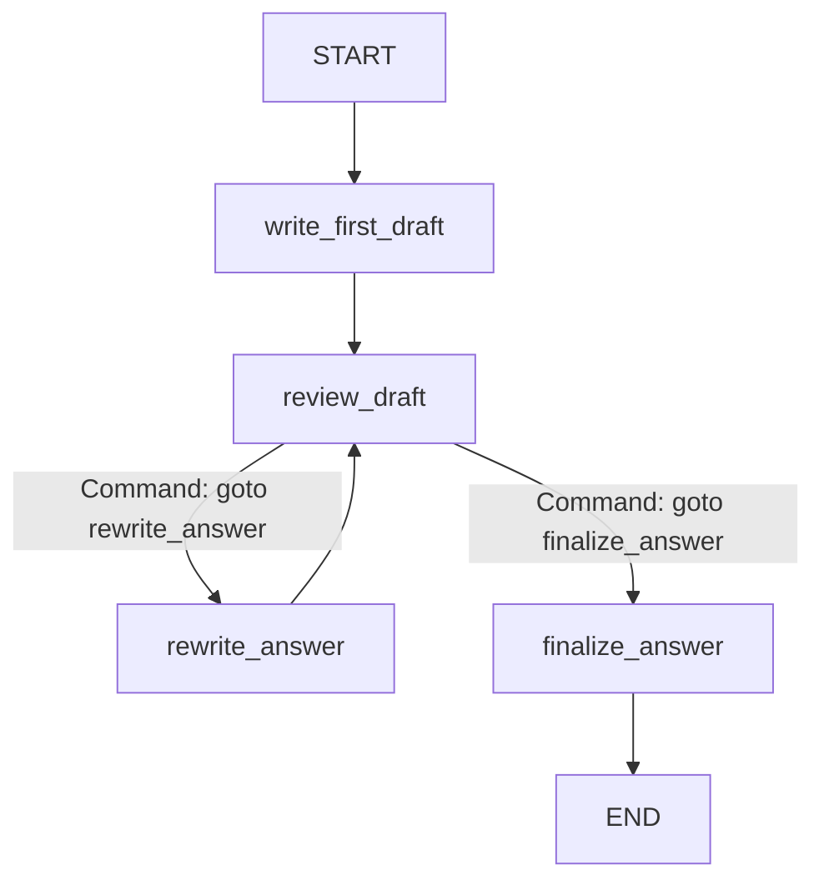
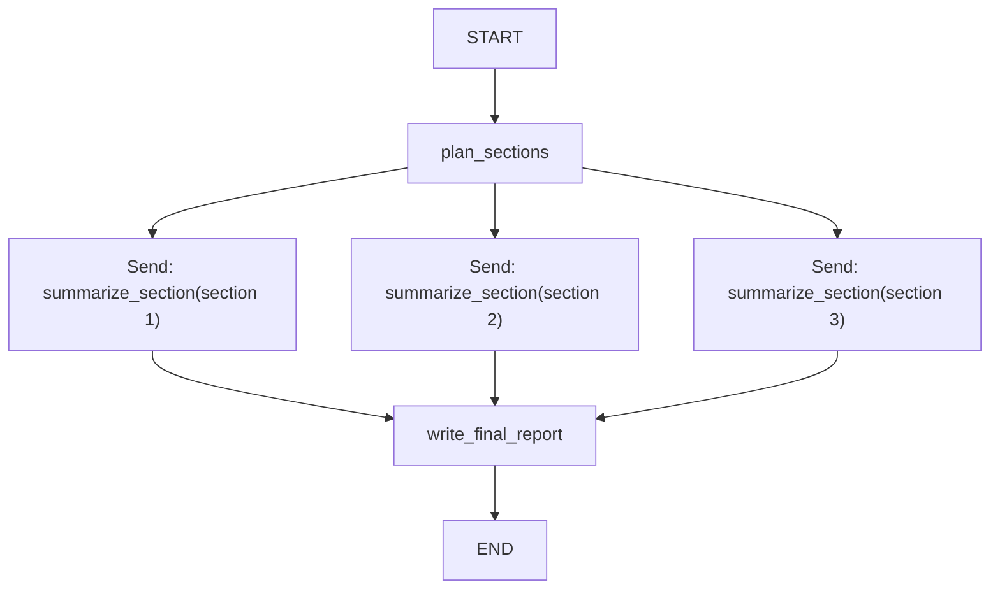

# 第11章-Command、Send与动态控制流

## 11.1 先看两种更动态的流程

前面几章已经讲完了 LangGraph 的核心积木：

- `State` 保存工作记忆。
- `Node` 完成一步工作。
- `Edge` 决定节点之间如何流动。
- `Reducer` 决定多个状态更新如何合并。

到这里，我们已经可以写出很多 Agent。

但真实 Agent 里还有两类更动态的情况。

第一类情况是：一个节点执行完以后，既要更新 State，又要决定下一步去哪。

例如审查节点读完草稿后，要做两件事：

```text
写入审查意见
-> 如果草稿合格，进入 finalize_answer
-> 如果草稿不合格，进入 rewrite_answer
```

第 9 章可以用条件边表达这种逻辑。但如果“状态更新”和“跳转决定”本来就属于同一个节点的结果，用 `Command` 会更集中。

第二类情况是：下一步要执行多少个任务，运行前并不知道。

例如用户给了一个主题，规划节点动态拆出三个小节：

```text
State 负责保存工作记忆
Node 负责完成一步工作
Edge 负责决定下一步流向
```

接下来应该为每个小节都派发一个总结任务。小节数量不是写死在图里的，而是运行时从 State 中读出来的。

这时就需要 `Send`。

本章主线很简单：

```text
Command：一个节点自己决定更新什么、跳到哪里。
Send：运行时动态派发多个节点任务。
```

## 11.2 Command 解决什么问题

第 9 章的条件边是这样工作的：

```text
节点先写入 State
-> 路由函数读取 State
-> 条件边选择下一节点
```

这个拆法很清楚，适合大多数路由场景。

但有些时候，节点在做判断时已经知道两件事：

1. 要更新哪些字段。
2. 下一步应该去哪。

例如审查草稿：

```text
如果草稿合格：
  写入 review_notes = "审查通过"
  跳到 finalize_answer

如果草稿不合格：
  写入 review_notes = "需要重写"
  跳到 rewrite_answer
```

如果用普通节点加条件边，需要一个节点写审查意见，再写一个路由函数决定去哪。

`Command` 可以把这两件事合在一个返回值里：

```python
return Command(
    update={"review_notes": "需要重写"},
    goto="rewrite_answer",
)
```

可以把它读成：

```text
请把 review_notes 写入 State，然后跳到 rewrite_answer。
```

所以 `Command` 的核心不是“更高级的 Edge”，而是：

> 当一个节点的业务结果天然包含状态更新和下一步跳转时，用一个返回值同时表达它们。

## 11.3 Command 示例代码

本章示例放在：

```text
codes/chapter11/chapter11_command_send.py
```

运行：

```bash
python codes/chapter11/chapter11_command_send.py
```

示例不调用 Ollama，方便专注观察控制流。

先看 `Command` 部分的 State：

```python
class RevisionState(TypedDict, total=False):
    question: str
    draft: str
    review_notes: str
    rewrite_count: int
    final_answer: str
```

这个图模拟一个“写草稿 -> 审查 -> 必要时重写 -> 定稿”的流程。

第一步先写一个很粗糙的草稿：

```python
def write_first_draft(state: RevisionState) -> dict:
    return {"draft": "Node 是 LangGraph 里的一个函数。"}
```

这个回答没有错，但太泛。它没有说明 Node 和 State 的关系，也没有说明 Node 返回的是状态更新。

审查节点会判断草稿是否合格：

```python
def review_draft(
    state: RevisionState,
) -> Command[Literal["rewrite_answer", "finalize_answer"]]:
    draft = state["draft"]
    rewrite_count = state.get("rewrite_count", 0)

    if "读取 State" in draft and "返回状态更新" in draft:
        return Command(
            update={"review_notes": "审查通过：回答已经说明了 Node 的输入和输出。"},
            goto="finalize_answer",
        )

    if rewrite_count >= 1:
        return Command(
            update={"review_notes": "已重写过一次，接受当前版本并结束。"},
            goto="finalize_answer",
        )

    return Command(
        update={
            "review_notes": "回答太泛，需要说明 Node 会读取 State 并返回状态更新。",
            "rewrite_count": rewrite_count + 1,
        },
        goto="rewrite_answer",
    )
```

这里有两个重点。

第一，返回类型写成：

```python
Command[Literal["rewrite_answer", "finalize_answer"]]
```

这表示这个节点可能跳到两个目标节点之一。它既是给类型检查器看的，也是给读者看的：审查节点的出口很清楚。

第二，`Command` 同时包含 `update` 和 `goto`。

```python
Command(
    update={"review_notes": "..."},
    goto="rewrite_answer",
)
```

`update` 负责更新 State，`goto` 负责选择下一节点。

如果需要重写，就进入：

```python
def rewrite_answer(state: RevisionState) -> dict:
    return {
        "draft": (
            "Node 是 LangGraph 中完成一步工作的函数。"
            "它读取当前 State，执行模型调用、工具调用或判断逻辑，"
            "然后返回本步骤产生的状态更新。"
        )
    }
```

最后定稿：

```python
def finalize_answer(state: RevisionState) -> dict:
    return {"final_answer": state["draft"]}
```

图结构如下：

```python
command_builder = StateGraph(RevisionState)

command_builder.add_node("write_first_draft", write_first_draft)
command_builder.add_node("review_draft", review_draft)
command_builder.add_node("rewrite_answer", rewrite_answer)
command_builder.add_node("finalize_answer", finalize_answer)

command_builder.add_edge(START, "write_first_draft")
command_builder.add_edge("write_first_draft", "review_draft")
command_builder.add_edge("rewrite_answer", "review_draft")
command_builder.add_edge("finalize_answer", END)

command_graph = command_builder.compile()
```

注意这里没有给 `review_draft` 添加普通边或条件边。它的下一步由 `Command(goto=...)` 决定。

流程图是：



## 11.4 Command 和条件边怎么选

`Command` 和条件边都能做路由，但它们的使用口径不一样。

可以先用这张表判断：

| 场景 | 更适合 |
| --- | --- |
| 节点只产生状态，路由逻辑可以单独表达 | 条件边 |
| 路由规则要被多个节点复用 | 条件边 |
| 节点的业务结果天然包含“更新 + 跳转” | `Command` |
| 人工恢复、子图跳转、handoff 等需要携带控制指令 | `Command` |

第 9 章的分类路由适合条件边：

```text
classify_question 写入 question_type
route_after_classify 决定下一步
```

因为分类和路由可以清楚分开。

本章的审查节点适合 `Command`：

```text
review_draft 产生审查意见
同时决定重写还是定稿
```

因为“审查意见”和“下一步”来自同一个判断。

一个实用原则是：

> 如果你能清楚地把“产生状态”和“选择路径”分开，用条件边；如果它们本来就是同一个节点的业务结果，用 Command。

## 11.5 Send 解决什么问题

现在看第二个动态问题。

第 10 章讲 reducer 时，我们已经写过并行节点：

```text
START -> extract_keyword_notes
START -> extract_structure_notes
```

但那两个节点是提前写死的。

如果任务数量是运行时才知道的呢？

例如规划节点根据主题生成小节：

```python
[
    "State 负责保存工作记忆",
    "Node 负责完成一步工作",
    "Edge 负责决定下一步流向",
]
```

如果有三个小节，就执行三个总结任务。

如果有十个小节，就执行十个总结任务。

这些任务不能在写代码时全部画成固定节点。

这时就需要 `Send`。

`Send` 的作用是：

> 在运行时动态创建一批节点调用，并为每次调用提供不同的输入状态。

它非常适合 map-reduce 类任务：

```text
plan_sections
-> Send 多个 summarize_section 任务
-> reducer 合并 section_summaries
-> write_final_report
```

## 11.6 Send 示例代码

`Send` 示例使用这个 State：

```python
class SummaryState(TypedDict, total=False):
    topic: str
    sections: list[str]
    section_summaries: Annotated[list[str], add]
    final_report: str
```

这里的 `section_summaries` 使用了第 10 章讲过的 reducer：

```python
section_summaries: Annotated[list[str], add]
```

因为多个 `summarize_section` 任务都会写入这个字段。

规划节点先生成小节：

```python
def plan_sections(state: SummaryState) -> dict:
    return {
        "sections": [
            "State 负责保存工作记忆",
            "Node 负责完成一步工作",
            "Edge 负责决定下一步流向",
        ]
    }
```

接着定义一个子任务状态：

```python
class SectionState(TypedDict):
    section: str
```

每个总结任务只需要一个 `section`，不需要完整的 `SummaryState`。

动态派发函数如下：

```python
def dispatch_sections(state: SummaryState) -> list[Send]:
    return [
        Send("summarize_section", {"section": section})
        for section in state["sections"]
    ]
```

这段代码的意思是：

```text
对每个 section，发送一次 summarize_section 调用。
每次调用只携带当前 section。
```

总结节点是：

```python
def summarize_section(state: SectionState) -> dict:
    return {"section_summaries": [f"小结：{state['section']}。"]}
```

虽然它接收的是 `SectionState`，但返回的是主图 State 的更新：

```python
{"section_summaries": [...]}
```

多个总结结果会通过 reducer 合并。

最后汇总：

```python
def write_final_report(state: SummaryState) -> dict:
    body = "\n".join(f"- {summary}" for summary in state["section_summaries"])
    return {"final_report": f"{state['topic']} 的核心编程模型：\n{body}"}
```

组装图：

```python
send_builder = StateGraph(SummaryState)

send_builder.add_node("plan_sections", plan_sections)
send_builder.add_node("summarize_section", summarize_section)
send_builder.add_node("write_final_report", write_final_report)

send_builder.add_edge(START, "plan_sections")
send_builder.add_conditional_edges(
    "plan_sections",
    dispatch_sections,
    ["summarize_section"],
)
send_builder.add_edge("summarize_section", "write_final_report")
send_builder.add_edge("write_final_report", END)

send_graph = send_builder.compile()
```

流程图是：



图上看起来像三个总结节点，但代码里只有一个 `summarize_section`。

`Send` 让它在运行时被调用多次。

## 11.7 Send 为什么经常和 Reducer 一起出现

`Send` 会动态派发多个任务。

多个任务通常会写入同一个字段。

例如：

```python
{"section_summaries": ["小结：State ..."]}
{"section_summaries": ["小结：Node ..."]}
{"section_summaries": ["小结：Edge ..."]}
```

如果没有 reducer，这些更新就无法自然合并。

所以 `Send` 经常和 reducer 搭配：

```python
section_summaries: Annotated[list[str], add]
```

可以这样理解：

```text
Send 负责把任务分出去。
Reducer 负责把结果收回来。
```

这就是 map-reduce 的基本形状：

```text
Map: 对每个 section 执行 summarize_section
Reduce: 把 section_summaries 合并后写 final_report
```

如果第 10 章没有理解 reducer，第 11 章的 `Send` 会很难掌握。因为动态派发只是前半段，后半段一定要回答“结果怎么收回来”。

## 11.8 Command、Send 和 Edge 的关系

到这里，容易把三个概念混在一起。

可以用一张表区分：

| 概念 | 解决的问题 | 典型用法 |
| --- | --- | --- |
| 普通 Edge | 固定下一步 | `A -> B` |
| 条件 Edge | 根据 State 选择下一步 | 分类后走不同路径 |
| `Command` | 节点同时更新 State 并指定跳转 | 审查后重写或定稿 |
| `Send` | 运行时动态派发多个任务 | 批量总结多个小节 |

它们不是互相替代关系，而是适合不同控制流形状。

如果流程固定，用普通边。

如果路径有限、路由逻辑清楚，用条件边。

如果节点结果天然携带跳转意图，用 `Command`。

如果下一步任务数量运行时才知道，用 `Send`。

## 11.9 常见错误与排查

`Command` 和 `Send` 的错误通常不是语法问题，而是控制流边界没有想清楚。

| 现象 | 可能原因 | 排查方式 |
| --- | --- | --- |
| `Command` 跳不到目标节点 | `goto` 名称和 `add_node` 名称不一致 | 对比节点名字符串 |
| 审查节点既返回 `Command` 又有普通出边 | 混用了两套控制流 | 让该节点只用 `Command` 控制下一步 |
| `Command` 更新没有生效 | `update` 字段名写错 | 检查 State 字段名 |
| `Send` 没有派发任务 | 派发函数返回空列表 | 检查 `sections` 是否存在且非空 |
| `Send` 结果只保留一个 | 汇总字段没有 reducer | 给列表字段加 `Annotated[..., add]` |
| 汇总节点过早执行或结果不全 | fan-out / fan-in 结构不清楚 | 检查 `summarize_section -> write_final_report` |

排查 `Command` 可以按这条线：

```text
节点读到了什么 State
-> 判断结果是什么
-> Command.update 写了什么
-> Command.goto 指向哪里
-> 目标节点是否存在
```

排查 `Send` 可以按这条线：

```text
上游节点是否生成任务列表
-> dispatch 函数返回了几个 Send
-> 每个 Send 的目标节点是否存在
-> 子任务返回了什么字段
-> 字段是否有 reducer 合并结果
-> 汇总节点是否读取了合并后的字段
```

这两条线掌握以后，动态控制流就不会显得神秘。

## 11.10 本章小结

本章完成了第三部分的最后一块核心编程模型。

`Command` 解决的是：

> 一个节点如何同时更新 State 并决定下一步跳转。

`Send` 解决的是：

> 图如何在运行时动态派发多个任务。

到这里，第三部分的主线已经完整：

```text
State：图中携带什么数据
Node：每一步做什么工作
Edge：节点之间如何流动
Reducer：多个更新如何合并
Command：节点如何主动发出跳转指令
Send：图如何动态展开多个任务
```

这几章不是 API 列表，而是一套 Agent 编程思维：

> 当 Agent 变复杂时，把数据放进 State，把工作拆成 Node，把路径交给 Edge，把合并交给 Reducer，把动态跳转交给 Command，把运行时展开交给 Send。

下一部分会把这些编程模型放进真实模型调用里：如何用 Ollama 和 DeepSeek 构建真正可用的 Agent。
