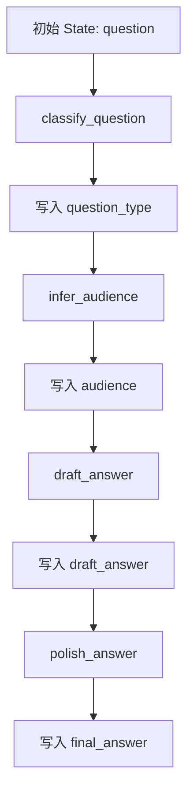
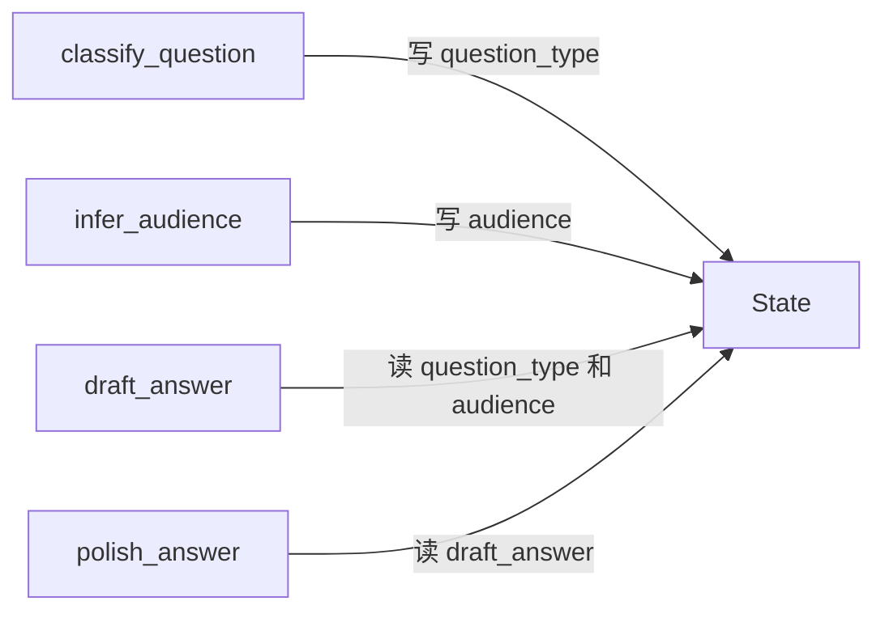

# 第7章-State状态设计

## 7.1 先看一个“能跑但不够好”的助手

第二部分结束时，我们已经看到 LangGraph 为什么比线性调用更适合多步骤 Agent。现在开始进入第三部分：核心编程模型。

第三部分不再只追求“把程序跑起来”，而是要回答一个更深的问题：

> 一个 Agent 变复杂以后，应该怎样设计它的状态、节点、边和控制流？

本章先讲 `State`。

但我们不急着定义 `TypedDict`，也不急着比较 `MessagesState`、Pydantic 和 reducer。先看一个很普通的小助手。

用户问：

```text
初学者应该如何理解 LangGraph 里的 State？
```

程序要做几件事：

1. 判断问题是不是 LangGraph 相关。
2. 判断读者更像初学者还是开发者。
3. 根据判断结果生成一版回答。
4. 把回答润色成更适合技术的表达。

这已经不是一次简单的模型调用了。它有多个中间结果：

- `question_type`：问题类型。
- `audience`：读者类型。
- `draft_answer`：草稿回答。
- `final_answer`：最终回答。

如果不用 LangGraph，我们很容易写成这样：

```python
def local_variable_version(question: str) -> str:
    question_type = classify_question_text(question)
    audience = infer_audience_text(question)

    prompt = (
        "请回答下面的问题。\n"
        f"问题类型：{question_type}\n"
        f"读者类型：{audience}\n"
        f"问题：{question}"
    )
    response = llm.invoke(prompt)

    final_answer = response.content.strip()
    return final_answer
```

这段代码能跑，也不难读。

问题是，它只返回了最终回答。中间的 `question_type` 和 `audience` 都是局部变量，函数结束后就消失了。

如果模型回答不好，我们很难判断问题出在哪里：

- 是问题类型判断错了？
- 是读者类型判断错了？
- 是 prompt 组织得不好？
- 是草稿回答本身不清楚？
- 还是润色步骤改坏了？

这就是 Agent 程序最常见的困境：最终输出在屏幕上，中间过程却散落在局部变量里。

`State` 要解决的就是这个问题。

## 7.2 State 不是语法，而是 Agent 的工作记忆

第一部分说过，LangGraph 的核心不是“调用模型”，而是“状态在图中持续推进”。

现在这句话可以说得更具体一点：

> State 是 Agent 的工作记忆。节点从 State 读取上下文，并把自己的工作结果写回 State。

普通函数写法里，中间数据常常藏在局部变量中：

```text
question -> question_type -> audience -> answer
```

这些变量只在某个函数内部可见。函数一长，变量一多，调试就开始靠猜。

LangGraph 的写法是把这些关键数据放进 `State`：

```text
State {
  question
  question_type
  audience
  draft_answer
  final_answer
}
```

这样，每个节点都围绕同一份工作记忆协作：



这张图里的重点不是模型，而是状态的逐步丰富。

刚开始，状态里只有用户问题：

```python
{"question": "初学者应该如何理解 LangGraph 里的 State？"}
```

执行完分类节点后，状态增加 `question_type`：

```python
{
    "question": "初学者应该如何理解 LangGraph 里的 State？",
    "question_type": "langgraph",
}
```

执行完读者判断节点后，状态继续增加 `audience`：

```python
{
    "question": "初学者应该如何理解 LangGraph 里的 State？",
    "question_type": "langgraph",
    "audience": "beginner",
}
```

最终，状态里会包含完整执行过程留下的关键结果。

这就是 `State` 的价值：它让 Agent 不只是“吐出一个答案”，而是留下可观察、可传递、可恢复的执行轨迹。

## 7.3 完整示例代码

本章示例放在：

```text
codes/chapter07/chapter07_state_design.py
```

运行：

```bash
python codes/chapter07/chapter07_state_design.py
```

你会看到同一个问题经过三种状态组织方式处理：

1. 局部变量版本。
2. 普通 `dict` 状态版本。
3. LangGraph `State` 版本。

完整代码如下：

```python
from typing import TypedDict

from langchain_ollama import ChatOllama
from langgraph.graph import END, START, StateGraph


llm = ChatOllama(
    model="qwen3:4b",
    temperature=0,
)


class ResearchState(TypedDict, total=False):
    question: str
    question_type: str
    audience: str
    draft_answer: str
    final_answer: str


def classify_question_text(question: str) -> str:
    keywords = ["langgraph", "stategraph", "节点", "边", "状态", "agent"]
    normalized = question.lower()

    if any(keyword in normalized for keyword in keywords):
        return "langgraph"

    return "general"


def infer_audience_text(question: str) -> str:
    beginner_keywords = ["是什么", "初学", "入门", "解释"]
    developer_keywords = ["代码", "实现", "报错", "设计"]

    if any(keyword in question for keyword in developer_keywords):
        return "developer"

    if any(keyword in question for keyword in beginner_keywords):
        return "beginner"

    return "general"


def classify_question(state: ResearchState) -> dict:
    return {"question_type": classify_question_text(state["question"])}


def infer_audience(state: ResearchState) -> dict:
    return {"audience": infer_audience_text(state["question"])}


def draft_answer(state: ResearchState) -> dict:
    prompt = (
        "请回答下面的问题。\n"
        f"问题类型：{state['question_type']}\n"
        f"读者类型：{state['audience']}\n"
        f"问题：{state['question']}"
    )
    response = llm.invoke(prompt)

    return {"draft_answer": response.content.strip()}


def polish_answer(state: ResearchState) -> dict:
    prompt = (
        "请把下面的回答改写得更适合作为技术书籍中的一段说明。"
        "保持简洁，不要增加新概念。\n\n"
        f"原回答：{state['draft_answer']}"
    )
    response = llm.invoke(prompt)

    return {"final_answer": response.content.strip()}


builder = StateGraph(ResearchState)

builder.add_node("classify_question", classify_question)
builder.add_node("infer_audience", infer_audience)
builder.add_node("draft_answer", draft_answer)
builder.add_node("polish_answer", polish_answer)

builder.add_edge(START, "classify_question")
builder.add_edge("classify_question", "infer_audience")
builder.add_edge("infer_audience", "draft_answer")
builder.add_edge("draft_answer", "polish_answer")
builder.add_edge("polish_answer", END)

graph = builder.compile()
```

这里的代码比第 5 章长了一点，但它仍然只表达一件事：状态如何随着节点执行一步步变完整。

## 7.4 从局部变量到普通 dict

在正式进入 LangGraph 之前，我们可以先把局部变量改成一个普通字典。

```python
def state_dict_version(question: str) -> dict:
    state = {"question": question}

    state["question_type"] = classify_question_text(state["question"])
    state["audience"] = infer_audience_text(state["question"])

    prompt = (
        "请回答下面的问题。\n"
        f"问题类型：{state['question_type']}\n"
        f"读者类型：{state['audience']}\n"
        f"问题：{state['question']}"
    )
    response = llm.invoke(prompt)

    state["draft_answer"] = response.content.strip()
    state["final_answer"] = state["draft_answer"]

    return state
```

这一步已经比局部变量好。

因为函数结束后，我们不只拿到最终回答，还能看到中间结果：

```python
{
    "question": "...",
    "question_type": "langgraph",
    "audience": "beginner",
    "draft_answer": "...",
    "final_answer": "...",
}
```

这说明我们真正需要的不是“多写几个变量”，而是一份能贯穿整个流程的状态对象。

不过，普通 `dict` 也有自己的问题。

第一，字段名没有约束。你可能在一个地方写 `question_type`，在另一个地方误写成 `question_kind`。程序只有运行到那里才会报错。

第二，状态结构不清楚。读者必须读完整个函数，才知道这个流程到底会产生哪些字段。

第三，所有步骤还是挤在一个函数里。虽然状态已经集中，但流程边界还不清楚。

LangGraph 的 `State` 会继续把这件事往前推一步：既声明状态结构，又让每个节点只负责更新其中一部分。

## 7.5 用 TypedDict 声明 State

本章示例用 `TypedDict` 定义状态：

```python
class ResearchState(TypedDict, total=False):
    question: str
    question_type: str
    audience: str
    draft_answer: str
    final_answer: str
```

这段代码回答了一个问题：

> 这张图运行过程中，可能会携带哪些字段？

每个字段都有自己的含义：

| 字段 | 含义 | 由谁写入 |
| --- | --- | --- |
| `question` | 用户原始问题 | 初始输入 |
| `question_type` | 问题类型 | `classify_question` |
| `audience` | 读者类型 | `infer_audience` |
| `draft_answer` | 模型生成的草稿回答 | `draft_answer` |
| `final_answer` | 润色后的最终回答 | `polish_answer` |

这里使用 `total=False`，是因为这些字段不是一开始都存在。

图刚启动时，只有 `question`：

```python
graph.invoke({"question": question})
```

`question_type`、`audience`、`draft_answer` 和 `final_answer` 都是在后续节点中逐步写入的。

这和 Agent 的真实运行方式一致：它不是一开始就知道所有答案，而是在执行过程中不断产生新的中间结果。

不过，`total=False` 也意味着你要更小心地设计节点顺序。比如 `draft_answer` 节点会读取 `question_type` 和 `audience`：

```python
f"问题类型：{state['question_type']}\n"
f"读者类型：{state['audience']}\n"
```

所以它必须排在 `classify_question` 和 `infer_audience` 后面。

这就引出一个重要原则：

> State 字段可以逐步产生，但节点读取某个字段之前，图结构必须保证这个字段已经被写入。

后面第 9 章讲 Edge 时，我们会更深入地处理这个问题。

## 7.6 节点返回的是状态更新，不是完整状态

第 5 章已经见过这一点，本章需要把它讲得更清楚。

看第一个节点：

```python
def classify_question(state: ResearchState) -> dict:
    return {"question_type": classify_question_text(state["question"])}
```

它没有返回完整状态：

```python
{
    "question": "...",
    "question_type": "langgraph",
    "audience": "...",
    "draft_answer": "...",
    "final_answer": "...",
}
```

它只返回自己负责更新的部分：

```python
{"question_type": "langgraph"}
```

LangGraph 会把这个 partial update 合并回当前状态。

这件事很关键。节点不需要知道整张图的所有细节，它只需要完成自己的职责：

- 分类节点只写 `question_type`。
- 读者判断节点只写 `audience`。
- 草稿节点只写 `draft_answer`。
- 润色节点只写 `final_answer`。

这就是为什么 State 能帮助我们拆分 Agent。

如果每个节点都要接收一堆参数、返回一堆值，函数之间会很快纠缠在一起。现在所有节点都共享同一种输入形式：

```python
def node(state: ResearchState) -> dict:
    ...
```

节点之间不直接互相调用，而是通过 State 交换信息。



这正是 LangGraph 的编程模型：节点不互相缠绕，状态负责承载上下文。

## 7.7 输入状态、内部状态和输出状态

刚开始写 LangGraph 时，很容易把所有字段都放进一个 `State`，本章也是这样做的。

这对小程序没有问题。但设计稍微复杂一点的 Agent 时，最好主动区分三类状态。

| 类型 | 作用 | 示例字段 |
| --- | --- | --- |
| 输入状态 | 用户或外部系统提供的初始数据 | `question`、`topic`、`files` |
| 内部状态 | Agent 执行过程中的中间结果 | `question_type`、`audience`、`draft_answer` |
| 输出状态 | 最终要交给用户或下游系统的结果 | `final_answer`、`report`、`summary` |

在本章例子里：

```text
输入状态: question
内部状态: question_type, audience, draft_answer
输出状态: final_answer
```

为什么要这样分？

因为不是所有状态都同等重要。

`question` 是启动图所必需的。没有它，任何节点都无法工作。

`question_type` 和 `audience` 是执行过程中的判断结果。它们对调试很重要，也可能影响后续路由，但不一定要展示给最终用户。

`final_answer` 是最终输出。调用方最关心它。

如果不区分这三类状态，复杂 Agent 的 State 会慢慢变成一个杂物箱：什么都往里放，谁也说不清哪些字段必须存在，哪些字段只是调试信息，哪些字段是最终产物。

所以设计 State 时，可以先问三个问题：

1. 图启动时必须提供什么？
2. 图运行中需要保存哪些中间判断？
3. 图结束时真正要交付什么？

这三个问题比“应该用几个字段”更重要。

## 7.8 State 字段应该保存什么

State 不是越大越好。

一个常见误区是：既然 State 是工作记忆，那是不是所有东西都应该塞进去？

不是。

State 应该保存会影响后续节点判断、生成、路由或恢复的关键信息。

适合放进 State 的内容包括：

| 内容 | 原因 |
| --- | --- |
| 用户输入 | 后续节点通常都要读取 |
| 分类结果 | 会影响路由或 prompt |
| 工具调用结果 | 后续模型需要基于它生成回答 |
| 审查意见 | 可能决定是否重写 |
| 重试次数 | 决定循环是否继续 |
| 最终产物 | 图结束后要返回 |

不适合直接放进 State 的内容包括：

| 内容 | 原因 |
| --- | --- |
| 大量原始文件内容 | 状态会膨胀，checkpoint 成本变高 |
| 临时格式化字符串 | 可以在节点内部重新生成 |
| 密钥和敏感配置 | 应通过配置或环境变量管理 |
| 不会被后续步骤使用的局部变量 | 留在节点内部即可 |

可以用一句话判断：

> 如果某个值会被后续节点读取、影响路由、需要调试观察，或者需要失败后恢复，就应该考虑放进 State。

否则，它可能只是节点内部的临时变量。

## 7.9 TypedDict、Pydantic 和 MessagesState 怎么选

本章先用 `TypedDict`，因为它最轻。

对入门阶段来说，`TypedDict` 有三个优点：

- 写法简单。
- 很接近普通字典。
- 足够表达 State 的字段结构。

但 LangGraph 不只支持 `TypedDict`。常见选择可以这样理解：

| State 形式 | 适合场景 | 特点 |
| --- | --- | --- |
| `TypedDict` | 大多数教程和轻量应用 | 简单、直接、容易读 |
| Pydantic Model | 需要更强校验的业务系统 | 可以做类型校验、默认值、字段说明 |
| `MessagesState` | 聊天和工具调用 Agent | 内置 `messages` 字段，适合对话历史 |

如果你刚开始写 LangGraph，优先用 `TypedDict`。

当状态字段开始需要严格校验，比如某个字段必须是枚举、数字范围必须合法、嵌套对象结构比较复杂，可以考虑 Pydantic。

当你的 Agent 核心就是多轮对话，尤其是围绕 `messages` 追加用户消息、AI 消息和工具消息，`MessagesState` 会更自然。

不过，本章暂时不展开 `MessagesState`。因为它会牵涉到“消息如何追加而不是覆盖”，也就是 reducer 的问题。这个主题会在第 10 章专门讲。

本章只需要记住：

> State 的形式可以不同，但目标一样：让图运行时携带一份清晰、稳定、可演化的工作记忆。

## 7.10 State 设计的常见坏味道

设计 State 时，有几种问题很常见。

第一种是字段太少。

所有中间判断都藏在节点内部，最终 State 只有一个 `answer`。这会让调试很困难。你只能看到结果，不知道结果是怎么来的。

第二种是字段太多。

每个临时变量都放进 State，最后状态里有几十个字段，很多字段只被一个节点使用一次。这会让 State 变得臃肿。

第三种是字段含义模糊。

比如同时出现：

```text
result
output
answer
final
content
```

这些名字看起来都像最终结果。后面维护的人很难判断应该读哪一个。

第四种是字段生命周期混乱。

有些字段是输入，有些字段是中间状态，有些字段是最终输出，但它们混在一起，没有命名规律，也没有注释说明。

第五种是节点偷偷依赖不存在的字段。

比如某个节点读取 `state["audience"]`，但图里某条路径没有经过写入 `audience` 的节点。这类问题通常要到运行时才暴露。

为了避免这些问题，可以给自己设一条简单规则：

> 每增加一个 State 字段，都要能说清楚：谁写它，谁读它，它影响什么。

如果这三个问题答不上来，这个字段可能还不该进入 State。

## 7.11 常见错误与排查

State 相关问题往往不是模型问题，而是字段设计和节点顺序问题。

| 现象 | 可能原因 | 排查方式 |
| --- | --- | --- |
| `KeyError: 'question'` | 初始输入缺少必需字段 | 检查 `graph.invoke(...)` 传入的字典 |
| `KeyError: 'audience'` | 节点读取了尚未写入的字段 | 检查边的顺序，确认先执行 `infer_audience` |
| 最终结果没有 `final_answer` | 最后一个节点没有返回该字段 | 检查 `polish_answer` 的返回值 |
| 中间判断看不到 | 没有把判断结果写入 State | 让节点返回 `{"question_type": ...}` |
| 字段值被覆盖 | 多个节点写同一个字段 | 检查字段职责，必要时等第 10 章用 reducer |
| State 越来越乱 | 临时变量过多进入 State | 区分输入、内部、输出状态 |

排查 State 可以按这条线走：

```text
初始输入有哪些字段
-> 第一个节点读取什么、写入什么
-> 第二个节点读取什么、写入什么
-> 哪个节点第一次使用出错字段
-> 这个字段是否一定会在此前被写入
```

这条排查线的本质是：沿着图的执行路径检查 State 的变化。

如果你发现自己必须打开很多节点，才能猜出某个字段从哪里来，就说明 State 设计还不够清楚。

## 7.12 本章小结

本章从一个“能跑但不够好”的助手开始，看到局部变量在多步骤 Agent 中会带来的问题：中间结果不可见，调试困难，后续扩展容易混乱。

然后我们把这些中间结果放进 State，让 Agent 拥有一份显式的工作记忆。

本章最重要的结论是：

> State 不是为了让代码看起来更像框架，而是为了让 Agent 的中间过程变得可见、可传递、可恢复。

现在，我们已经知道一张图运行时携带什么数据。下一章会继续推进到 `Node` 节点设计。

如果说 State 是 Agent 的工作记忆，那么 Node 就是使用这份记忆完成一步工作的执行单元。第 8 章会回答一个更具体的问题：一个复杂 Agent 的逻辑，应该如何拆成职责清楚、可测试、可替换的节点？
