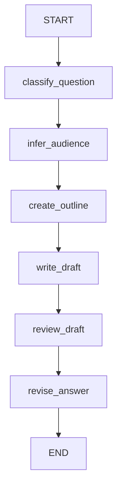

# 第8章-Node节点设计

## 8.1 先看一个越来越长的函数

上一章我们把中间结果放进 `State`，让 Agent 拥有了一份显式的工作记忆。

但有了 State 还不够。接下来的问题是：

> 谁来使用这份状态？每一步工作应该放在哪里？

这就是 `Node` 要解决的问题。

先看一个能跑的程序。用户问：

```text
初学者应该如何理解 LangGraph 里的 Node？
```

程序要完成这些步骤：

1. 判断问题类型。
2. 判断读者类型。
3. 生成回答提纲。
4. 根据提纲写草稿。
5. 审查草稿是否适合初学者。
6. 根据审查意见改写最终回答。

如果直接写成一个函数，可能是这样：

```python
def giant_function_version(question: str) -> str:
    question_type = classify_question_text(question)
    audience = infer_audience_text(question)

    outline_prompt = (
        "请为下面的问题列出一个三点回答提纲。\n"
        f"问题类型：{question_type}\n"
        f"读者类型：{audience}\n"
        f"问题：{question}"
    )
    outline = llm.invoke(outline_prompt).content.strip()

    draft_prompt = (
        "请根据提纲写一段适合技术书籍的回答。\n"
        f"问题：{question}\n"
        f"提纲：{outline}"
    )
    draft_answer = llm.invoke(draft_prompt).content.strip()

    review_prompt = (
        "请审查下面的回答是否适合初学者。"
        "只指出一两个最需要改进的问题。\n\n"
        f"回答：{draft_answer}"
    )
    review_notes = llm.invoke(review_prompt).content.strip()

    final_prompt = (
        "请根据审查意见改写回答，要求简洁、清楚、不要引入新概念。\n"
        f"原回答：{draft_answer}\n"
        f"审查意见：{review_notes}"
    )
    final_answer = llm.invoke(final_prompt).content.strip()

    return final_answer
```

这段代码并不“错”。它能跑，也能得到最终回答。

但它有几个问题。

第一，职责混在一起。分类、读者判断、提纲、写作、审查、改写都塞在一个函数里。

第二，中间步骤难以单独测试。比如你只想测试“读者判断”是否正确，却必须绕过整段函数。

第三，后续很难插入新步骤。如果想在写草稿前加入“检索资料”，或者在审查后根据结果决定是否重写，这个函数会继续变长。

第四，失败位置不清楚。如果最终回答不好，我们需要人工读完整个函数，才能判断是提纲问题、草稿问题，还是审查问题。

这就是 Node 要解决的困境：一个 Agent 看起来像一个任务，但它内部其实由多个职责不同的步骤组成。

## 8.2 Node 是使用 State 完成一步工作的函数

在 LangGraph 里，Node 通常就是一个 Python 函数。

但不是随便一个函数都适合做 Node。一个好的 Node 应该满足这句话：

> 读取当前 State，完成一步清晰的工作，返回这一步产生的状态更新。

它的形状通常是：

```python
def some_node(state: SomeState) -> dict:
    ...
    return {"some_field": some_value}
```

这句话里有三个重点。

第一，Node 从 `State` 读取上下文。它不应该靠一堆零散参数和其他节点传值。

第二，Node 只完成一步工作。它可以调用模型、调用工具、做判断、格式化结果，但最好不要把整条 Agent 流程都塞进去。

第三，Node 返回 partial update。它不需要返回完整 State，只返回自己负责写入的字段。

用图表示，本章示例可以拆成这样：



每个方块都是一个 Node。

这个图仍然是一条直线，还没有进入条件路由。第 9 章才会专门讲 Edge 和条件边。本章只关注一件事：如何把一个大函数拆成职责清楚的节点。

## 8.3 完整示例代码

本章示例放在：

```text
codes/chapter08/chapter08_node_design.py
```

运行：

```bash
python codes/chapter08/chapter08_node_design.py
```

你会看到同一个问题经过两种方式处理：

1. 大函数版本。
2. LangGraph 节点版本。

完整代码如下：

```python
from typing import TypedDict

from langchain_ollama import ChatOllama
from langgraph.graph import END, START, StateGraph


llm = ChatOllama(
    model="qwen3:4b",
    temperature=0,
)


class AnswerState(TypedDict, total=False):
    question: str
    question_type: str
    audience: str
    outline: str
    draft_answer: str
    review_notes: str
    final_answer: str
```

状态字段和第 7 章类似，但这次更强调每个字段由哪个节点产生。

```python
def classify_question(state: AnswerState) -> dict:
    return {"question_type": classify_question_text(state["question"])}


def infer_audience(state: AnswerState) -> dict:
    return {"audience": infer_audience_text(state["question"])}


def create_outline(state: AnswerState) -> dict:
    prompt = (
        "请为下面的问题列出一个三点回答提纲。\n"
        f"问题类型：{state['question_type']}\n"
        f"读者类型：{state['audience']}\n"
        f"问题：{state['question']}"
    )
    response = llm.invoke(prompt)

    return {"outline": response.content.strip()}
```

这三个节点分别负责分类、判断读者和生成提纲。它们都只返回自己负责的字段。

后面的节点继续沿用同一风格：

```python
def write_draft(state: AnswerState) -> dict:
    prompt = (
        "请根据提纲写一段适合技术书籍的回答。\n"
        f"问题：{state['question']}\n"
        f"提纲：{state['outline']}"
    )
    response = llm.invoke(prompt)

    return {"draft_answer": response.content.strip()}


def review_draft(state: AnswerState) -> dict:
    prompt = (
        "请审查下面的回答是否适合初学者。"
        "只指出一两个最需要改进的问题。\n\n"
        f"回答：{state['draft_answer']}"
    )
    response = llm.invoke(prompt)

    return {"review_notes": response.content.strip()}


def revise_answer(state: AnswerState) -> dict:
    prompt = (
        "请根据审查意见改写回答，要求简洁、清楚、不要引入新概念。\n"
        f"原回答：{state['draft_answer']}\n"
        f"审查意见：{state['review_notes']}"
    )
    response = llm.invoke(prompt)

    return {"final_answer": response.content.strip()}
```

最后把它们组装成图：

```python
builder = StateGraph(AnswerState)

builder.add_node("classify_question", classify_question)
builder.add_node("infer_audience", infer_audience)
builder.add_node("create_outline", create_outline)
builder.add_node("write_draft", write_draft)
builder.add_node("review_draft", review_draft)
builder.add_node("revise_answer", revise_answer)

builder.add_edge(START, "classify_question")
builder.add_edge("classify_question", "infer_audience")
builder.add_edge("infer_audience", "create_outline")
builder.add_edge("create_outline", "write_draft")
builder.add_edge("write_draft", "review_draft")
builder.add_edge("review_draft", "revise_answer")
builder.add_edge("revise_answer", END)

graph = builder.compile()
```

这段代码的重点不是节点数量变多了，而是每一步的边界变清楚了。

## 8.4 大函数和节点拆分的差别

大函数版本的流程是隐含的。

你必须从上到下阅读代码，才能知道它先分类、再生成提纲、再写草稿、再审查、再改写。

LangGraph 节点版本的流程是显式的：

```text
START
-> classify_question
-> infer_audience
-> create_outline
-> write_draft
-> review_draft
-> revise_answer
-> END
```

这带来几个直接好处。

第一，职责清楚。

看到 `create_outline`，就知道它只负责生成提纲。看到 `review_draft`，就知道它只负责审查草稿。

第二，中间结果可见。

运行结束后，State 中不只有最终回答，还有：

```python
result["outline"]
result["draft_answer"]
result["review_notes"]
```

这些字段能帮助我们判断回答质量来自哪里。

第三，扩展点清楚。

如果想在 `create_outline` 前加入“检索资料”节点，图结构会变成：

```text
infer_audience -> retrieve_context -> create_outline
```

如果想在 `review_draft` 后根据审查结果决定是否重写，下一章可以用条件边表达。

第四，测试更容易。

你可以单独调用：

```python
create_outline({
    "question": "初学者应该如何理解 LangGraph 里的 Node？",
    "question_type": "langgraph",
    "audience": "beginner",
})
```

这比测试整个大函数更轻。

## 8.5 Node 的粒度：不要太大，也不要太碎

Node 设计最容易犯的错误，是只看“能不能拆”，不看“该不该拆”。

一个节点太大，会变成第 8.1 节里的大函数。

一个节点太碎，也会有问题。比如把 `create_outline` 拆成：

```text
prepare_outline_prompt
call_outline_model
strip_outline_text
save_outline
```

这种拆法通常没有必要。它会让图上出现太多技术细节，读者反而看不出业务流程。

一个比较好的判断标准是：

> 一个 Node 应该对应 Agent 流程中的一个有意义动作，而不是一行代码。

适合成为 Node 的动作包括：

| 动作 | 原因 |
| --- | --- |
| 分类问题 | 结果会影响后续 prompt 或路由 |
| 调用工具 | 有外部副作用，值得单独观察 |
| 生成提纲 | 产物会被后续写作节点使用 |
| 审查结果 | 可能决定是否进入重写 |
| 写入记忆 | 影响后续会话或任务 |

不一定适合单独成为 Node 的动作包括：

| 动作 | 原因 |
| --- | --- |
| 拼接一段很短的 prompt | 只是节点内部实现细节 |
| 对字符串做 `strip()` | 太细，不构成 Agent 步骤 |
| 读取一个配置值 | 通常由配置层处理 |
| 简单的字段重命名 | 没有独立业务意义 |

当然，这不是绝对规则。如果某个“很小的动作”需要单独测试、单独观测、单独重试，或者未来会替换实现，它也可以成为 Node。

关键不是代码行数，而是职责边界。

## 8.6 Node 应该读什么、写什么

Node 的输入是 State，但这不意味着它应该随便读 State 里的所有字段。

一个好的 Node，应该只读取完成自己工作所需的字段。

例如：

```python
def write_draft(state: AnswerState) -> dict:
    prompt = (
        "请根据提纲写一段适合技术书籍的回答。\n"
        f"问题：{state['question']}\n"
        f"提纲：{state['outline']}"
    )
    response = llm.invoke(prompt)

    return {"draft_answer": response.content.strip()}
```

`write_draft` 读取 `question` 和 `outline`，写入 `draft_answer`。

它不需要关心 `review_notes`，也不需要知道 `final_answer`。这些是后续节点的事情。

可以把每个 Node 的读写关系列成表：

| Node | 读取字段 | 写入字段 |
| --- | --- | --- |
| `classify_question` | `question` | `question_type` |
| `infer_audience` | `question` | `audience` |
| `create_outline` | `question`、`question_type`、`audience` | `outline` |
| `write_draft` | `question`、`outline` | `draft_answer` |
| `review_draft` | `draft_answer` | `review_notes` |
| `revise_answer` | `draft_answer`、`review_notes` | `final_answer` |

这张表非常有用。

如果一个 Node 读取字段很多，说明它可能承担了太多职责。

如果多个 Node 都写同一个字段，说明你需要想清楚是覆盖、追加还是聚合。这个问题会在第 10 章讲 reducer 时展开。

如果一个字段没人读取，那它可能只是无用的中间产物。

## 8.7 Node 和普通辅助函数的区别

不是所有函数都要注册成 Node。

本章代码里有两个普通辅助函数：

```python
def classify_question_text(question: str) -> str:
    ...


def infer_audience_text(question: str) -> str:
    ...
```

它们没有直接接收 State，也没有返回状态更新。它们只是普通函数。

真正的 Node 是：

```python
def classify_question(state: AnswerState) -> dict:
    return {"question_type": classify_question_text(state["question"])}
```

这样拆有一个好处：核心规则可以脱离 LangGraph 单独测试。

比如分类规则可以这样测试：

```python
assert classify_question_text("LangGraph 的节点是什么？") == "langgraph"
assert classify_question_text("今天适合学习吗？") == "general"
```

而 Node 层只负责把这个规则接到 State 上：

```text
读取 state["question"]
-> 调用 classify_question_text
-> 返回 {"question_type": ...}
```

这是一种很实用的写法：

```text
普通函数负责可复用逻辑
Node 负责连接 State 和图运行时
```

如果把所有逻辑都写进 Node，Node 会越来越厚。

如果把所有 Node 都变成很薄的包装，也可能让代码变得分散。

比较稳妥的方式是：业务规则、格式化逻辑、解析逻辑可以先写成普通函数；当它们成为图中的一个步骤时，再用 Node 包起来。

## 8.8 Node 里的模型调用和工具调用

Node 经常会调用模型，也经常会调用工具。

本章的这些节点都调用了模型：

```python
create_outline
write_draft
review_draft
revise_answer
```

它们的共同模式是：

```text
从 State 读取输入
-> 组织 prompt
-> 调用模型
-> 把结果写回 State
```

这很自然。

但要注意一件事：模型调用是相对昂贵、慢且可能失败的步骤。所以当一个 Node 调用模型时，它最好有清晰的产物。

例如 `create_outline` 的产物是 `outline`，`review_draft` 的产物是 `review_notes`。这两个结果都值得保存，因为后续节点会用到，调试时也能看。

如果一个 Node 调用模型只是为了生成一个临时短句，然后马上在同一个节点内部消费掉，可能就不值得单独成为 Node。

工具调用也一样。

比如后面我们会写搜索工具、文件读取工具、向量检索工具。每个工具节点都应该明确回答：

- 它读取哪些 State 字段？
- 它调用哪个外部工具？
- 它把什么结果写回 State？
- 如果工具失败，错误信息放在哪里？

这会让 Agent 的外部交互变得可观察，而不是藏在某个大函数深处。

## 8.9 Node 命名要表达意图

节点名不只是给程序看的，也是给人看的。

下面这些名字不太好：

```text
step1
handle
process
call_model
node_a
```

它们的问题是：只描述了“这是一个步骤”，没有描述“这一步做什么”。

更好的名字应该表达意图：

```text
classify_question
infer_audience
create_outline
write_draft
review_draft
revise_answer
```

当你看到图结构时，几乎可以直接读出流程：

```text
分类问题 -> 判断读者 -> 生成提纲 -> 写草稿 -> 审查草稿 -> 修改回答
```

这也是 LangGraph 的一个隐藏收益：它会逼你给 Agent 的每一步起名字。

名字起不出来，往往说明职责还没想清楚。

## 8.10 常见错误与排查

Node 相关问题通常集中在三个地方：读取了不存在的字段，返回了错误格式，或者节点职责太混乱。

| 现象 | 可能原因 | 排查方式 |
| --- | --- | --- |
| `KeyError: 'outline'` | `write_draft` 执行前没有生成 `outline` | 检查 `create_outline -> write_draft` 的边 |
| 节点执行后 State 没有变化 | 节点没有返回字典，或字段名写错 | 确认返回值类似 `{"draft_answer": ...}` |
| 最终回答为空 | 上游节点返回了空内容 | 逐个打印或查看 `outline`、`draft_answer`、`review_notes` |
| 节点很难测试 | 节点内部做了太多事情 | 拆出普通辅助函数或拆成多个 Node |
| 图结构看起来很碎 | 把实现细节都拆成节点 | 合并没有独立业务意义的小步骤 |
| 节点名看不懂 | 使用了 `step1`、`process` 等泛化命名 | 改成动词加对象，例如 `review_draft` |

排查 Node 可以按这条线走：

```text
这个 Node 读哪些字段
-> 这些字段是否一定已经存在
-> 这个 Node 做哪一步工作
-> 它返回哪些字段
-> 后续哪个 Node 会读取这些字段
```

如果这五个问题说不清楚，问题通常不在 LangGraph，而在节点边界还没设计好。

## 8.11 本章小结

本章从一个大函数开始，看到多步骤 Agent 的逻辑为什么不适合长期塞在一个函数里。

然后我们把它拆成多个 Node：

```text
classify_question
infer_audience
create_outline
write_draft
review_draft
revise_answer
```

每个 Node 都读取 State，完成一步具体工作，然后返回 partial update。

本章最重要的结论是：

> Node 不是为了把代码拆碎，而是为了让 Agent 的每一步职责清楚、产物可见、边界可测试。

到这里，我们已经有了两块核心积木：

- `State`：保存 Agent 的工作记忆。
- `Node`：使用这份记忆完成一步工作。

但现在的图还是一条直线。真实 Agent 很少永远直线前进。它经常需要根据状态选择下一步：直接回答、调用工具、重新生成、请求人工确认，或者结束。

下一章会进入 `Edge` 与条件路由。它要回答的问题是：

> 当 Agent 的流程不再是一条直线时，谁来决定下一步？
