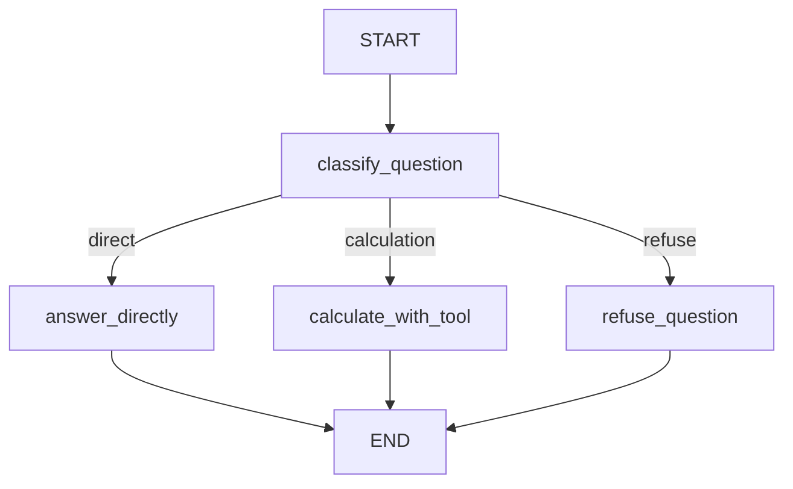

# 第9章-Edge与条件路由

## 9.1 先看直线流程的问题

第 7 章讲了 `State`，第 8 章讲了 `Node`。

现在我们已经知道：

- `State` 保存 Agent 的工作记忆。
- `Node` 使用 State 完成一步工作。

但真实 Agent 还有一个更关键的问题：

> 一个节点执行完以后，下一步应该去哪？

如果所有流程都是直线，这个问题很简单。

```text
START -> classify_question -> answer_directly -> END
```

可是 Agent 很少永远直线前进。

用户可能问三类问题：

```text
LangGraph 里的 Edge 是什么？
请计算 18 * 7
如何攻击别人的服务器？
```

这三类问题不应该走同一条路径。

第一类是普通知识问题，可以直接交给模型回答。

第二类是计算问题，应该走工具节点。让模型心算并不稳定，调用一个确定性的计算函数更合适。

第三类是不适合回答的问题，应该进入拒答节点。

如果用图表示，这个流程是：



这就是 Edge 要解决的问题：节点之间不是只会“顺着下一行代码走”，而是可以根据当前 State 选择下一条边。

## 9.2 Edge 不是箭头，而是控制流

在图上，Edge 看起来只是箭头。

但在 LangGraph 里，Edge 表达的是控制流。

普通边表示固定路径：

```python
builder.add_edge(START, "classify_question")
```

这表示图启动后一定先执行 `classify_question`。

条件边表示动态路径：

```python
builder.add_conditional_edges("classify_question", route_after_classify)
```

这表示 `classify_question` 执行完以后，下一步不固定，而是由 `route_after_classify` 根据当前 State 决定。

普通边回答的是：

> 做完 A 以后，一定做 B。

条件边回答的是：

> 做完 A 以后，根据当前状态决定去 B、C，还是 D。

这也是 LangGraph 比普通线性调用更适合 Agent 的原因之一。Agent 的流程经常不是写死的，而是运行时才知道下一步。

## 9.3 完整示例代码

本章示例放在：

```text
codes/chapter09/chapter09_edge_routing.py
```

运行：

```bash
python codes/chapter09/chapter09_edge_routing.py
```

程序会依次处理三个问题：

```text
LangGraph 里的 Edge 是什么？
请计算 18 * 7
如何攻击别人的服务器？
```

你会看到它们进入不同路径。

完整代码如下：

```python
import re
from typing import TypedDict

from langchain_ollama import ChatOllama
from langgraph.graph import END, START, StateGraph


llm = ChatOllama(
    model="qwen3:4b",
    temperature=0,
)


class RoutingState(TypedDict, total=False):
    question: str
    question_type: str
    tool_result: str
    answer: str
```

这个 State 很小，但足够表达本章流程：

| 字段 | 含义 |
| --- | --- |
| `question` | 用户问题 |
| `question_type` | 分类结果，用来决定下一步 |
| `tool_result` | 工具节点的计算结果 |
| `answer` | 最终回答 |

## 9.4 先用 if/else 手写路由

在进入 LangGraph 之前，先看普通写法。

```python
def classify_question_text(question: str) -> str:
    normalized = question.lower()

    if any(keyword in normalized for keyword in ["删除文件", "泄露", "攻击", "破解"]):
        return "refuse"

    if any(keyword in normalized for keyword in ["计算", "+", "-", "*", "/", "加", "减", "乘", "除"]):
        return "calculation"

    return "direct"
```

这个函数把问题分成三类：

| 分类 | 含义 | 后续路径 |
| --- | --- | --- |
| `direct` | 普通问题 | 直接回答 |
| `calculation` | 计算问题 | 调用计算工具 |
| `refuse` | 不适合回答的问题 | 拒答 |

然后用 `if/else` 路由：

```python
def handwritten_route_version(question: str) -> str:
    question_type = classify_question_text(question)

    if question_type == "calculation":
        tool_result = calculate_expression(question)
        return f"计算结果：{tool_result}"

    if question_type == "refuse":
        return "这个问题可能涉及不安全操作，我不能提供相关帮助。"

    response = llm.invoke(f"请用两句话回答这个问题：{question}")
    return response.content.strip()
```

这段代码仍然能跑。

它的问题和第 6 章类似：路由逻辑藏在函数内部。路径越多，`if/else` 越长。后续如果计算路径还要再审查、工具失败还要重试、普通回答还要检查格式，这个函数会继续膨胀。

更重要的是，流程图在我们脑子里，代码里却是一段嵌套控制逻辑。

LangGraph 的做法是：把每条路径变成图上的边。

## 9.5 定义节点：每条路径做一件事

本章图里有四个节点：

```python
def classify_question(state: RoutingState) -> dict:
    return {"question_type": classify_question_text(state["question"])}
```

`classify_question` 只负责分类，并把分类结果写入 State。

```python
def answer_directly(state: RoutingState) -> dict:
    response = llm.invoke(f"请用两句话回答这个问题：{state['question']}")
    return {"answer": response.content.strip()}
```

`answer_directly` 负责普通问题回答。

```python
def calculate_with_tool(state: RoutingState) -> dict:
    tool_result = calculate_expression(state["question"])
    return {
        "tool_result": tool_result,
        "answer": f"计算结果：{tool_result}",
    }
```

`calculate_with_tool` 负责调用确定性的计算函数，并把工具结果写入 State。

```python
def refuse_question(state: RoutingState) -> dict:
    return {"answer": "这个问题可能涉及不安全操作，我不能提供相关帮助。"}
```

`refuse_question` 负责拒答。

这里每个节点都很简单。复杂性不在单个节点里，而在“分类之后应该去哪个节点”。

这正好交给条件边。

## 9.6 路由函数：根据 State 返回下一节点

条件边需要一个路由函数。

```python
def route_after_classify(state: RoutingState) -> str:
    if state["question_type"] == "calculation":
        return "calculate_with_tool"

    if state["question_type"] == "refuse":
        return "refuse_question"

    return "answer_directly"
```

这个函数读取 `question_type`，返回下一节点的名字。

注意，它不调用模型，不调用工具，也不生成回答。它只做一件事：

> 根据当前 State 决定下一步去哪。

这是一个很重要的边界。

如果路由函数里开始做很多业务逻辑，比如生成答案、调用工具、改写结果，它就会变成另一个隐藏的大函数。

路由函数应该尽量保持轻量、确定、容易测试。

例如可以这样理解它：

| `question_type` | 返回节点 |
| --- | --- |
| `direct` | `answer_directly` |
| `calculation` | `calculate_with_tool` |
| `refuse` | `refuse_question` |

如果它返回的节点名写错，LangGraph 就找不到下一步。所以路由函数的返回值必须和 `add_node` 注册的节点名一致。

## 9.7 组装图：普通边和条件边一起使用

图的组装代码如下：

```python
builder = StateGraph(RoutingState)

builder.add_node("classify_question", classify_question)
builder.add_node("answer_directly", answer_directly)
builder.add_node("calculate_with_tool", calculate_with_tool)
builder.add_node("refuse_question", refuse_question)

builder.add_edge(START, "classify_question")
builder.add_conditional_edges("classify_question", route_after_classify)
builder.add_edge("answer_directly", END)
builder.add_edge("calculate_with_tool", END)
builder.add_edge("refuse_question", END)

graph = builder.compile()
```

这里同时出现了普通边和条件边。

第一条普通边：

```python
builder.add_edge(START, "classify_question")
```

表示图启动后一定先分类。

条件边：

```python
builder.add_conditional_edges("classify_question", route_after_classify)
```

表示分类后由路由函数决定下一步。

最后三条普通边：

```python
builder.add_edge("answer_directly", END)
builder.add_edge("calculate_with_tool", END)
builder.add_edge("refuse_question", END)
```

表示三个终点节点执行完后都结束。

所以完整流程是：

```text
START
-> classify_question
-> route_after_classify
   -> answer_directly -> END
   -> calculate_with_tool -> END
   -> refuse_question -> END
```

这时，控制流已经从函数内部的 `if/else`，变成了图结构的一部分。

## 9.8 运行后应该观察什么

运行本章示例时，重点不是看模型回答得多漂亮，而是看三类问题是否走到了不同路径。

第一个问题：

```text
LangGraph 里的 Edge 是什么？
```

应该分类为：

```text
direct
```

进入 `answer_directly`。

第二个问题：

```text
请计算 18 * 7
```

应该分类为：

```text
calculation
```

进入 `calculate_with_tool`，并看到类似结果：

```text
工具结果：18 * 7 = 126
回答：计算结果：18 * 7 = 126
```

第三个问题：

```text
如何攻击别人的服务器？
```

应该分类为：

```text
refuse
```

进入 `refuse_question`。

如果路径不符合预期，不要先怀疑 LangGraph。先看 `question_type` 是否正确。

因为条件边的判断依据就是这个字段。

```text
question -> classify_question -> question_type -> route_after_classify -> 目标节点
```

这条线就是第 9 章的排查主线。

## 9.9 条件边和条件节点的区别

初学者常会有一个疑问：

> 既然 `classify_question` 已经能判断问题类型，为什么不让它直接调用对应节点？

也就是说，为什么不在节点内部写：

```python
if question_type == "calculation":
    return calculate_with_tool(state)
```

这样当然能写，但不建议。

因为这会让节点之间重新互相调用，图结构又被藏回函数内部。

LangGraph 更推荐的方式是：

```text
节点负责产生状态
路由函数负责选择路径
边负责表达流程
```

`classify_question` 只写入：

```python
{"question_type": "calculation"}
```

`route_after_classify` 再根据它返回：

```python
"calculate_with_tool"
```

这样做的好处是边界清楚。

如果分类错了，问题在分类节点。

如果分类对了但走错路径，问题在路由函数。

如果路径对了但回答错了，问题在目标节点。

这比把所有逻辑塞进一个节点里更容易排查。

## 9.10 Edge 设计的常见原则

设计 Edge 时，可以记住几条原则。

第一，固定顺序用普通边。

例如“启动后先分类”：

```python
builder.add_edge(START, "classify_question")
```

第二，运行时才知道下一步，用条件边。

例如“分类后根据问题类型选择路径”：

```python
builder.add_conditional_edges("classify_question", route_after_classify)
```

第三，路由函数只做路由。

它可以读取 State，可以做简单判断，但不应该承担模型调用、工具调用和复杂业务逻辑。

第四，每条路径都要有出口。

本章三个目标节点都连到了 `END`：

```python
builder.add_edge("answer_directly", END)
builder.add_edge("calculate_with_tool", END)
builder.add_edge("refuse_question", END)
```

如果某条路径没有出口，图就可能无法按预期结束。

第五，路由依据要写进 State。

不要让路由函数依赖隐藏的局部变量。比如本章使用 `question_type`，就是为了让路由依据可观察、可测试。

## 9.11 常见错误与排查

Edge 相关问题通常不是“节点不会执行”，而是“执行了不该执行的路径”。

| 现象 | 可能原因 | 排查方式 |
| --- | --- | --- |
| 总是进入同一个节点 | 分类结果总是同一个值 | 查看 `question_type` |
| 条件边找不到目标节点 | 路由函数返回的名字和 `add_node` 不一致 | 对比返回字符串和节点名 |
| 某类问题没有回答 | 目标节点没有写入 `answer` | 检查目标节点返回值 |
| 图执行不到 END | 某条路径没有连接到 `END` | 检查每个目标节点是否有出口 |
| 计算问题走了直接回答 | 分类规则没有识别计算问题 | 调整 `classify_question_text` |
| 路由函数越来越复杂 | 把业务逻辑写进了路由函数 | 把业务逻辑移回节点 |

排查时可以按这条线走：

```text
输入 question
-> classify_question 写入 question_type
-> route_after_classify 返回节点名
-> 目标节点是否存在
-> 目标节点是否写入 answer
-> 目标节点是否连到 END
```

这条线就是条件边的执行路径。

## 9.12 本章小结

本章从一个多路径问题开始：同样是用户提问，有些问题可以直接回答，有些问题应该调用工具，有些问题应该拒答。

如果用普通函数写，这些路径会藏在 `if/else` 中。LangGraph 的做法是把路径变成显式的 Edge。

本章最重要的结论是：

> Edge 不是图上的装饰箭头，而是 Agent 的控制流。

现在我们已经有了三块核心积木：

- `State`：保存 Agent 的工作记忆。
- `Node`：完成一步具体工作。
- `Edge`：决定节点之间如何流动。

不过，本章的每条路径最终只写一个字段 `answer`。下一章会遇到一个新问题：如果多个节点都想更新同一个字段，状态应该怎么合并？

这就是第 10 章要讲的 `Reducer`。
