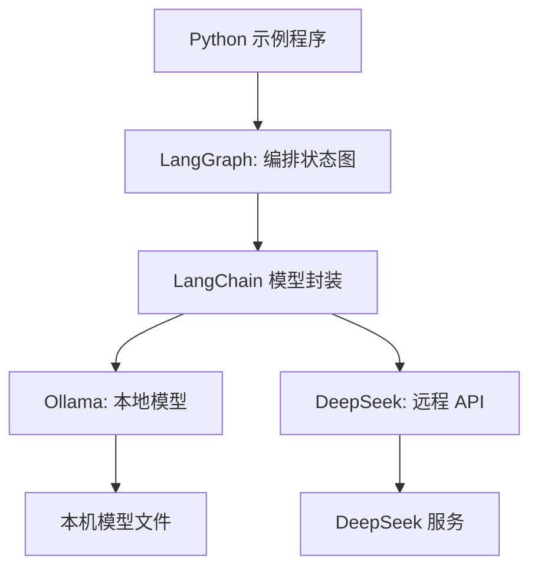

# 第4章-开发环境准备

## 4.1 先看本章要跑起来的东西

从这一章开始，我们不再只看架构图，而是让 LangGraph 真正在本机运行起来。

这一章的目标很简单：准备一个可以运行本书后续示例的 Python 环境，并分别验证两个模型入口：

- 本地模型：通过 Ollama 在本机调用模型。
- 远程模型：通过 DeepSeek API 调用更强的推理模型。

等环境准备完成后，我们希望能运行两个最小检查程序。

第一个程序检查 Ollama：

```python
from langchain_ollama import ChatOllama


llm = ChatOllama(model="qwen3:4b")
response = llm.invoke("用一句话解释 LangGraph 是什么。")

print(response.content)
```

第二个程序检查 DeepSeek：

```python
from langchain_deepseek import ChatDeepSeek


llm = ChatDeepSeek(model="deepseek-chat")
response = llm.invoke("用一句话解释 LangGraph 是什么。")

print(response.content)
```

如果这两个程序都能输出一句自然语言回答，说明后面第一个 LangGraph 程序需要的地基已经搭好了。

本章不会把安装命令堆成清单。我们真正要理解的是：为什么需要这些组件，它们分别站在 LangGraph 应用的什么位置。

## 4.2 为什么本书同时使用 Ollama 和 DeepSeek

在第一部分里，我们把 LangGraph 理解成一个围绕状态图运行的 Agent 框架。到了写代码时，图里的节点总要做事，最常见的事情就是调用大模型。

问题是：模型从哪里来？

如果所有示例都依赖远程 API，读者每次运行都需要网络、密钥和费用。如果所有示例都只依赖本地小模型，复杂推理章节又可能效果不稳定。因此本书采用两个模型入口：

| 模型入口 | 运行位置 | 适合场景 | 主要特点 |
| --- | --- | --- | --- |
| Ollama | 本机 | 学习、调试、轻量任务、本地离线运行 | 不需要 API Key，便于反复试验 |
| DeepSeek | 远程 API | 复杂推理、规划、审查、最终生成 | 推理能力更强，但需要网络和密钥 |

这不是为了增加复杂度，而是为了让示例更接近真实项目。

真实 Agent 往往不会只依赖一个模型。它可能让本地模型负责分类、摘要、草稿生成，让远程强模型负责复杂规划、审查和最终报告。后面章节会逐步展开这种多模型协作。本章只先把两个入口打通。

可以把本书的基础环境画成这样：



这里要注意：LangGraph 本身不等于大模型。LangGraph 负责组织状态、节点和边；Ollama 与 DeepSeek 负责在节点里生成文本或做推理。它们的关系是“编排框架”和“模型后端”的关系。

## 4.3 准备 Python 项目目录

本书后续示例会尽量保持小而完整。你可以先准备一个普通目录，例如：

```text
langgraph-guide/
  codes/
    chapter04/
      chapter04_check_ollama.py
      chapter04_check_deepseek.py
    chapter05/
      chapter05_first_graph.py
```

这里暂时不需要复杂工程结构。第一个阶段的目标不是搭一个大项目，而是让读者把 LangGraph 的最小闭环跑起来。

建议使用 Python 虚拟环境，把本书依赖和系统 Python 隔离开。

Windows PowerShell：

```powershell
python -m venv .venv
.\.venv\Scripts\Activate.ps1
python -m pip install -U pip
```

macOS 或 Linux：

```bash
python -m venv .venv
source .venv/bin/activate
python -m pip install -U pip
```

为什么要用虚拟环境？

因为 LangGraph、LangChain、模型适配包都会随时间更新。如果直接安装到系统 Python，后面很容易遇到“这个项目需要 A 版本，另一个项目需要 B 版本”的冲突。虚拟环境让本书示例拥有一套独立依赖，出问题时也更容易重建。

可以用下面命令确认当前 Python 来自虚拟环境：

```bash
python -c "import sys; print(sys.executable)"
```

输出路径中如果包含 `.venv`，说明虚拟环境已经生效。

## 4.4 安装 LangGraph 和模型适配包

接下来安装本书前几章需要的 Python 包。本书示例以 `langgraph==1.2.9` 为基准编写，建议先固定这个版本，避免因为后续版本 API 调整影响学习过程。

```bash
python -m pip install langgraph==1.2.9 langchain langchain-ollama langchain-deepseek python-dotenv
```

这些包分别负责不同事情：

| 依赖 | 负责什么 |
| --- | --- |
| `langgraph` | 提供 `StateGraph`、`START`、`END`、图编译和执行能力 |
| `langchain` | 提供 LangChain 基础抽象，方便接入模型和工具生态 |
| `langchain-ollama` | 把 Ollama 模型封装成 LangChain 可调用模型 |
| `langchain-deepseek` | 把 DeepSeek API 封装成 LangChain 可调用模型 |
| `python-dotenv` | 从 `.env` 文件读取 API Key 等配置 |

安装完成后，可以先做一个导入检查：

```bash
python -c "import langgraph; import langchain_ollama; import langchain_deepseek; print('ok')"
```

如果输出 `ok`，说明 Python 依赖已经安装成功。

这一小步很重要。很多初学者遇到的第一个问题不是 LangGraph 代码写错，而是当前终端没有进入虚拟环境，或者包安装到了另一个 Python 里。先做导入检查，可以把环境问题提前暴露出来。

## 4.5 安装并验证 Ollama

Ollama 的作用是让我们在本机运行开源模型。它提供一个本地服务，Python 程序通过这个服务调用模型。

安装 Ollama 后，先检查命令是否可用：

```bash
ollama --version
```

然后拉取一个本书前期示例可以使用的模型。这里用 `qwen3:4b` 作为默认示例：

```bash
ollama pull qwen3:4b
```

如果你更想使用 Google Gemma 系列，也可以改用 `gemma3`。后续代码里的 `model="qwen3:4b"` 要和你实际拉取的模型名一致。

拉取完成后，可以直接用命令行测试：

```bash
ollama run qwen3:4b
```

输入：

```text
用一句话解释 LangGraph 是什么。
```

如果模型能返回回答，说明 Ollama 本身已经能工作。

接下来再用 Python 测试 LangChain 对 Ollama 的封装。示例文件放在 `codes/chapter04/chapter04_check_ollama.py`：

```python
from langchain_ollama import ChatOllama


llm = ChatOllama(
    model="qwen3:4b",
    temperature=0,
)

response = llm.invoke("用一句话解释 LangGraph 是什么。")

print(response.content)
```

运行：

```bash
python codes/chapter04/chapter04_check_ollama.py
```

如果这里能输出回答，说明 Python 程序已经可以调用本地模型。

这个检查程序虽然很短，但它对应了后面 LangGraph 节点里的核心动作：节点读取状态，然后调用模型。第 5 章会把这段模型调用放进一个 LangGraph 节点中。

## 4.6 配置并验证 DeepSeek

Ollama 适合本地学习和快速调试，但复杂 Agent 经常需要更强的推理能力。比如后面写研究助手时，规划、审查、综合判断这类任务更适合交给远程强模型。

本书使用 DeepSeek 作为远程模型入口。

首先准备 API Key。不要把密钥直接写进代码，建议放进 `.env` 文件：

```text
DEEPSEEK_API_KEY=你的 DeepSeek API Key
```

然后新建 `codes/chapter04/chapter04_check_deepseek.py`：

```python
from dotenv import load_dotenv
from langchain_deepseek import ChatDeepSeek


load_dotenv()

llm = ChatDeepSeek(
    model="deepseek-chat",
    temperature=0,
)

response = llm.invoke("用一句话解释 LangGraph 是什么。")

print(response.content)
```

运行：

```bash
python codes/chapter04/chapter04_check_deepseek.py
```

如果输出正常，说明 DeepSeek API 已经接通。

这里的 `load_dotenv()` 会读取当前目录下的 `.env` 文件。`ChatDeepSeek` 会从环境变量中找到 `DEEPSEEK_API_KEY`。这样做有两个好处：

- 代码可以提交、复制和分享，不会泄露密钥。
- 本地、测试、生产可以使用不同 `.env` 或环境变量。

如果后面需要使用 DeepSeek 的推理模型，可以把模型名换成对应的推理模型。对本书前期示例来说，`deepseek-chat` 已经足够验证调用链路。

## 4.7 现在的环境对应 LangGraph 哪些层

到这里，我们已经安装了 Python 包，也打通了 Ollama 和 DeepSeek。把这些内容放回第 3 章的五层架构，可以看到它们各自的位置：

| 准备内容 | 对应层级 | 意义 |
| --- | --- | --- |
| Python 虚拟环境 | 工程基础 | 隔离依赖，保证示例可重复运行 |
| `langgraph` | 编程接口层 / 运行时层 | 声明和执行状态图 |
| `langchain-ollama` | 应用层模型封装 | 让节点可以调用本地模型 |
| `langchain-deepseek` | 应用层模型封装 | 让节点可以调用远程强模型 |
| Ollama 本地服务 | 模型后端 | 提供本地可运行模型 |
| DeepSeek API Key | 模型后端配置 | 提供远程模型访问权限 |

这张表能帮助我们避免一个常见混淆：安装模型适配包不等于安装模型本身。

`langchain-ollama` 只是 Python 封装。真正的模型在 Ollama 里，需要用 `ollama pull` 拉取。`langchain-deepseek` 也只是 Python 封装。真正的推理发生在 DeepSeek 服务端，需要有效的 API Key 和网络连接。

## 4.8 常见错误与排查

环境搭建时，错误往往集中在几个地方。

| 现象 | 可能原因 | 排查方式 |
| --- | --- | --- |
| `ModuleNotFoundError: No module named 'langgraph'` | 包没有安装到当前 Python 环境 | 重新激活 `.venv`，运行 `python -m pip show langgraph` |
| `ModuleNotFoundError: No module named 'langchain_ollama'` | 缺少 Ollama 适配包 | 运行 `python -m pip install langchain-ollama` |
| Python 导入检查失败，但 pip 显示已安装 | 当前终端使用的不是同一个 Python | 运行 `python -c "import sys; print(sys.executable)"` |
| `Connection refused` 或无法连接 Ollama | Ollama 服务没有启动 | 打开 Ollama 应用，或运行 `ollama serve` |
| `model not found` | 代码里的模型名和本地模型名不一致 | 运行 `ollama list`，把代码中的模型名改成列表里的名字 |
| DeepSeek 返回认证错误 | API Key 未配置或配置错误 | 检查 `.env` 中是否有 `DEEPSEEK_API_KEY` |
| DeepSeek 请求超时 | 网络或服务不可达 | 先用简单脚本测试，再检查代理、网络和服务状态 |

排查时建议按顺序来：

1. 先确认 Python 虚拟环境。
2. 再确认 Python 包是否能导入。
3. 再确认模型后端是否可用。
4. 最后再运行 LangGraph 程序。

这样可以把问题分层定位。不要一上来就怀疑 LangGraph 代码，因为最初阶段很多错误其实来自环境。

## 4.9 本章小结

本章完成了第二部分的第一件事：让运行环境准备好。

现在我们已经知道：

- LangGraph 负责组织状态图，不直接等同于大模型。
- Ollama 提供本地模型，适合学习、调试和离线运行。
- DeepSeek 提供远程强模型，适合复杂推理和高质量生成。
- `langchain-ollama` 和 `langchain-deepseek` 是模型封装层，让它们可以被节点调用。
- 虚拟环境、导入检查、模型检查可以帮助我们快速定位问题。

第一部分建立的是“看懂 LangGraph”的心智模型。本章开始，我们把这个模型落到可运行环境上。

下一章会写第一个真正的 LangGraph 程序。它只有一个节点，一条入口边，一条出口边，但它会完整包含 `State`、`Node`、`Edge`、`compile()` 和 `invoke()`。这就是 LangGraph 的最小闭环。
