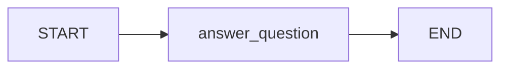
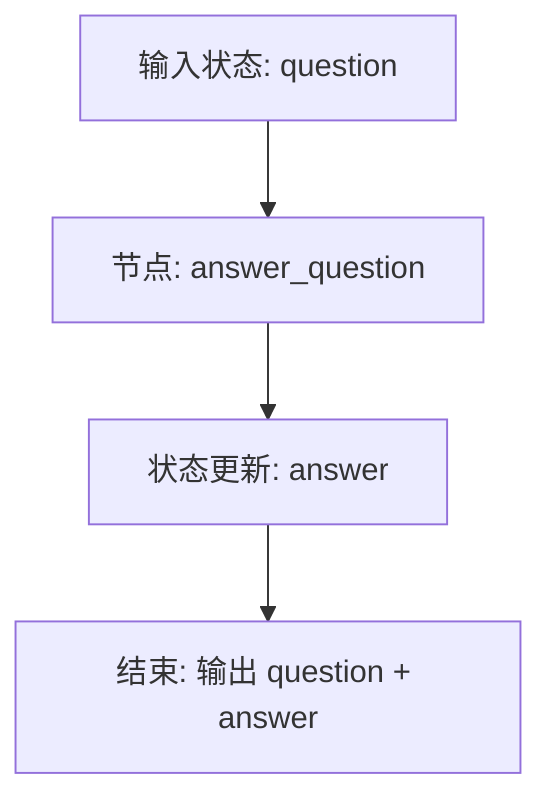
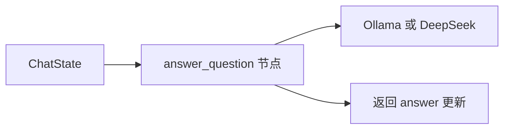

# 第5章-第一个LangGraph程序

## 5.1 先看运行效果

上一章我们已经确认 Python、LangGraph、Ollama 和 DeepSeek 都能工作。现在可以写第一个真正的 LangGraph 程序。

这个程序故意保持很小：用户输入一个问题，图里只有一个节点，这个节点调用模型生成回答，然后图结束。

运行命令：

```bash
python chapter05_first_graph.py
```

期望看到类似输出：

```text
问题：用一句话解释 LangGraph 是什么。

回答：LangGraph 是一个用状态图组织大模型应用和 Agent 流程的框架。
```

这个程序看起来很简单，甚至简单到让人怀疑：为什么不用一行 `llm.invoke()`？

这正是本章要回答的问题。第一个 LangGraph 程序不是为了展示复杂能力，而是为了让读者亲手跑通最小闭环：

```text
State -> Node -> Edge -> Graph -> invoke
```

后面所有复杂 Agent，都会从这个闭环扩展出来。

## 5.2 完整代码

新建 `chapter05_first_graph.py`：

```python
from typing import TypedDict

from langchain_ollama import ChatOllama
from langgraph.graph import END, START, StateGraph


class ChatState(TypedDict):
    question: str
    answer: str


llm = ChatOllama(
    model="qwen2.5:7b-instruct",
    temperature=0,
)


def answer_question(state: ChatState) -> dict:
    response = llm.invoke(state["question"])
    return {"answer": response.content}


builder = StateGraph(ChatState)

builder.add_node("answer_question", answer_question)
builder.add_edge(START, "answer_question")
builder.add_edge("answer_question", END)

graph = builder.compile()


if __name__ == "__main__":
    question = "用一句话解释 LangGraph 是什么。"
    result = graph.invoke({"question": question})

    print(f"问题：{result['question']}")
    print()
    print(f"回答：{result['answer']}")
```

先运行它：

```bash
python chapter05_first_graph.py
```

如果模型已经通过上一章验证，程序应该能输出模型回答。

这段代码就是一个完整 LangGraph 应用。它不依赖复杂目录结构，也没有隐藏文件。一个文件里包含状态定义、节点函数、图构建和运行入口。

## 5.3 这张图长什么样

虽然代码很短，但它已经是一张图。



如果把状态也画进去，它更像这样：



这就是 LangGraph 的基本运行方式：

1. 图从 `START` 进入。
2. 运行 `answer_question` 节点。
3. 节点读取 `question`，调用模型，返回 `answer`。
4. LangGraph 把 `answer` 合并回状态。
5. 图沿着边到达 `END`，执行结束。

第一部分讲过，LangGraph 的核心不是“一次模型调用”，而是“状态在图中持续推进”。这个最小程序就是这句话的最小版本。

## 5.4 为什么先只写一个节点

真实 Agent 当然不会只有一个节点。它可能有计划节点、工具节点、审查节点、写作节点、人工审批节点。

但第一个程序必须只有一个节点。

原因很简单：我们要先看清 LangGraph 最小闭环，而不是一开始就被复杂流程淹没。

一个节点已经足够展示五个核心概念：

| 代码元素 | LangGraph 概念 | 它解决的问题 |
| --- | --- | --- |
| `ChatState` | State | 图运行时携带哪些数据 |
| `answer_question` | Node | 一步具体工作如何执行 |
| `add_edge(...)` | Edge | 节点之间如何连接 |
| `compile()` | Graph 编译 | 把声明结构变成可运行对象 |
| `invoke(...)` | 图执行 | 用输入状态启动一次运行 |

先把这五个概念跑通，后面加第二个节点、条件边、循环和 checkpoint 时，读者就不会迷路。

## 5.5 拆解代码：State 是图的输入和记忆

程序从状态定义开始：

```python
class ChatState(TypedDict):
    question: str
    answer: str
```

这表示图运行过程中会携带两个字段：

- `question`：用户输入的问题。
- `answer`：模型生成的回答。

在普通函数写法里，我们可能会这样写：

```python
question = "用一句话解释 LangGraph 是什么。"
answer = llm.invoke(question)
```

这里的 `question` 和 `answer` 是局部变量。程序小的时候没问题，但一旦有多个步骤，它们会散落在函数中。

LangGraph 的写法是把这些数据放进 `State`。节点不再依赖随手创建的局部变量，而是统一从状态中读取数据、向状态返回更新。

这就是第一部分讲过的“Agent 的工作记忆”。

在本例中，初始状态只有 `question`：

```python
{"question": question}
```

节点执行后返回：

```python
{"answer": response.content}
```

最终状态会同时包含 `question` 和 `answer`。

```python
{
    "question": "用一句话解释 LangGraph 是什么。",
    "answer": "LangGraph 是一个用状态图组织大模型应用和 Agent 流程的框架。"
}
```

这说明节点返回的不是完整状态，而是状态更新。LangGraph 会负责把更新合并回原状态。

## 5.6 拆解代码：Node 是执行一步工作的函数

节点函数是：

```python
def answer_question(state: ChatState) -> dict:
    response = llm.invoke(state["question"])
    return {"answer": response.content}
```

它做了三件事：

1. 从状态里读取 `question`。
2. 调用模型生成回答。
3. 返回要更新的字段 `answer`。

注意节点返回的是字典：

```python
return {"answer": response.content}
```

不要直接返回字符串：

```python
return response.content
```

因为 LangGraph 需要知道你要更新状态中的哪个字段。节点返回字典，就是在告诉运行时：“请把 `answer` 字段更新成这个值。”

这也是 LangGraph 和普通函数调用很不一样的地方。普通函数只关心返回值；LangGraph 节点关心的是状态更新。

一个好的节点名字应该说明它做什么。本例叫 `answer_question`，它的职责很单一：回答问题。后面如果我们要加入“判断问题类型”“调用工具”“审查答案”等能力，就应该增加新节点，而不是把所有逻辑都塞进这个函数。

## 5.7 拆解代码：Edge 让流程显式可见

图结构由这几行声明：

```python
builder = StateGraph(ChatState)

builder.add_node("answer_question", answer_question)
builder.add_edge(START, "answer_question")
builder.add_edge("answer_question", END)
```

第一行创建一个状态图构建器：

```python
builder = StateGraph(ChatState)
```

它告诉 LangGraph：这张图使用 `ChatState` 作为状态结构。

然后注册节点：

```python
builder.add_node("answer_question", answer_question)
```

这里有两个 `answer_question`。第一个是节点在图里的名字，第二个是 Python 函数本身。为了简单，我们让它们同名。

接着添加两条边：

```python
builder.add_edge(START, "answer_question")
builder.add_edge("answer_question", END)
```

第一条边表示：图开始后，先执行 `answer_question`。

第二条边表示：`answer_question` 执行完后，图结束。

这两条边让流程结构变得显式。即使现在只有一个节点，我们也已经开始用“图”的方式组织程序，而不是用“下一行代码”的方式组织程序。

## 5.8 拆解代码：compile 和 invoke

图声明完成后，还不能直接运行。需要先编译：

```python
graph = builder.compile()
```

可以把 `builder` 理解为草图，把 `graph` 理解为可执行对象。

`builder` 负责收集结构信息：

- 有哪些节点。
- 有哪些边。
- 状态类型是什么。
- 入口和出口在哪里。

`compile()` 会把这些声明整理成 LangGraph 运行时可以执行的图。

运行图使用 `invoke()`：

```python
result = graph.invoke({"question": question})
```

传给 `invoke()` 的是初始状态。图执行结束后，返回最终状态。

本例的输入状态是：

```python
{"question": "用一句话解释 LangGraph 是什么。"}
```

输出状态会增加 `answer`：

```python
{
    "question": "用一句话解释 LangGraph 是什么。",
    "answer": "..."
}
```

到这里，我们就完成了一次完整图执行。

## 5.9 如果要换成 DeepSeek

本章默认使用 Ollama，是因为本地模型更适合学习和反复调试。但如果你想用 DeepSeek，只需要替换模型创建部分。

先确保上一章的 `.env` 中已经配置：

```text
DEEPSEEK_API_KEY=你的 DeepSeek API Key
```

然后把代码里的模型创建部分：

```python
from langchain_ollama import ChatOllama


llm = ChatOllama(
    model="qwen2.5:7b-instruct",
    temperature=0,
)
```

替换为：

```python
from dotenv import load_dotenv
from langchain_deepseek import ChatDeepSeek


load_dotenv()

llm = ChatDeepSeek(
    model="deepseek-chat",
    temperature=0,
)
```

其他 LangGraph 代码不需要变。

这说明一个重要设计点：模型调用被封装在节点内部，图结构不关心底层使用 Ollama 还是 DeepSeek。



后面做复杂 Agent 时，我们会利用这个特点，把不同节点连接到不同模型。例如，本地模型负责快速分类，DeepSeek 负责复杂推理。

## 5.10 普通调用和图调用的差别

这个程序当然可以用普通函数写：

```python
response = llm.invoke("用一句话解释 LangGraph 是什么。")
print(response.content)
```

那为什么还要写成 LangGraph？

因为我们不是为了这一个节点本身，而是为了后面可以自然扩展。

| 对比点 | 普通模型调用 | LangGraph 图调用 |
| --- | --- | --- |
| 数据保存在哪里 | 局部变量 | 显式 `State` |
| 执行步骤如何表示 | 代码顺序 | `Node` 和 `Edge` |
| 能否增加分支 | 可以，但容易混在函数里 | 使用条件边表达 |
| 能否增加循环 | 可以，但容易隐藏在 `while` 中 | 使用图上的回路表达 |
| 能否做 checkpoint | 需要自己设计保存逻辑 | 可以接入 LangGraph checkpointer |
| 扩展到多节点 | 函数会越来越长 | 增加节点和边 |

第一个 LangGraph 程序看起来比普通调用多写了几行，但它已经把扩展点准备好了。

下一步如果要增加一个“润色答案”节点，只需要添加节点和边：

```text
START -> answer_question -> polish_answer -> END
```

如果要增加一个“判断是否需要工具”的节点，可以使用条件边：

```text
answer_question -> 是否需要工具？
  -> 需要：调用工具
  -> 不需要：结束
```

如果要保存执行过程，可以在 `compile()` 时接入 checkpointer。

这些扩展都建立在本章这个最小闭环上。

## 5.11 常见错误与排查

第一个程序常见问题通常不复杂，但要学会从 LangGraph 的结构去判断。

| 现象 | 可能原因 | 排查方式 |
| --- | --- | --- |
| `ModuleNotFoundError` | 依赖没装到当前环境 | 重新激活 `.venv`，确认 `python -m pip show langgraph` |
| `Connection refused` | Ollama 服务没启动 | 运行 `ollama list` 或启动 Ollama 应用 |
| `model not found` | 模型名写错或没拉取 | 运行 `ollama list`，确认代码里的 `model` 名称 |
| `KeyError: 'question'` | 初始状态缺少 `question` | 检查 `graph.invoke({"question": question})` |
| 节点返回后报状态更新错误 | 节点返回了字符串而不是字典 | 确认返回值是 `{"answer": ...}` |
| 图编译或运行时提示没有入口 | 忘记添加 `START` 边 | 确认有 `builder.add_edge(START, "answer_question")` |
| 程序运行成功但输出很慢 | 本地模型较大或机器资源不足 | 换小模型，或改用 DeepSeek 测试 |
| DeepSeek 认证失败 | API Key 没读到 | 检查 `.env` 和 `load_dotenv()` |

排查时可以按这条线走：

```text
Python 包能不能导入
-> 模型能不能单独调用
-> 节点返回值是不是状态更新字典
-> 图有没有 START 和 END
-> invoke 输入是否符合 State
```

这条排查线正好对应 LangGraph 的结构。先确认外部依赖，再确认节点，再确认图，再确认输入状态。

## 5.12 本章小结

本章写完了第一个真正可运行的 LangGraph 程序。

它只有一个节点，但已经包含 LangGraph 最核心的闭环：

- `State` 定义图运行时携带的数据。
- `Node` 读取状态并返回状态更新。
- `Edge` 描述执行路径。
- `compile()` 把声明式图结构变成可运行对象。
- `invoke()` 用初始状态启动一次执行，并返回最终状态。

这也把第一部分的概念真正落到了代码里：`State` 不再只是一个名词，而是 `ChatState`；`Node` 不再只是图上的方块，而是 `answer_question` 函数；`Edge` 不再只是箭头，而是 `add_edge(START, "answer_question")`。

下一章会在这个程序基础上继续推进：我们会把普通线性调用和 LangGraph 图调用放在一起比较，看到为什么一旦 Agent 出现多步骤、分支和循环，图结构就比单个函数更适合承载复杂性。
