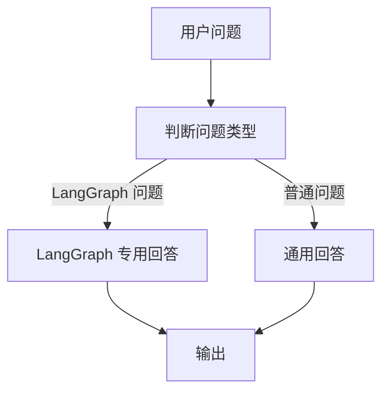
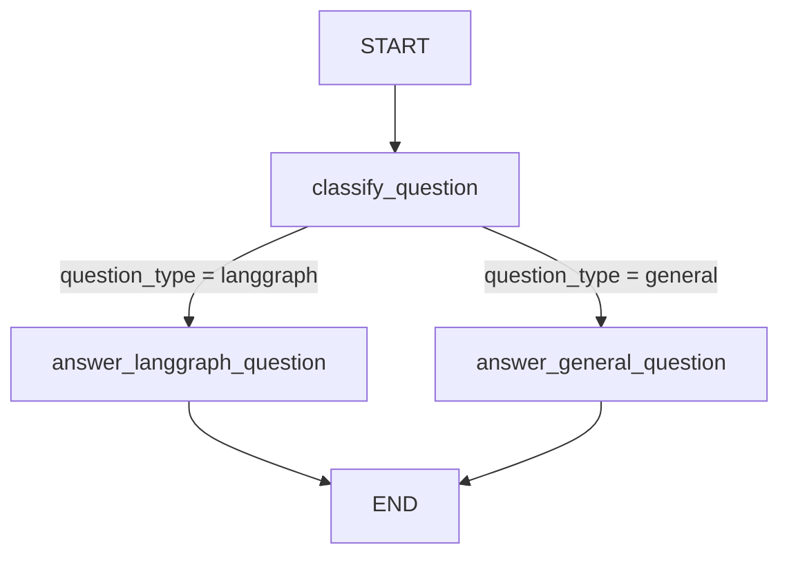
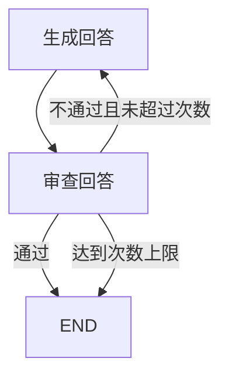

# 第6章-从线性调用到图调用

## 6.1 先看同一个任务的三种写法

第 5 章我们写了第一个 LangGraph 程序。它只有一个节点，所以读起来很像“把一次模型调用放进图里”。

这一章要回答一个更关键的问题：

> 如果只是调用模型，普通函数已经够了。为什么还要把程序写成图？

理解这个问题，最好的方式不是先讲抽象定义，而是看同一个任务如何一步步变复杂。

我们先设定一个很小的助手：用户输入一个问题，程序根据问题类型选择不同回答方式。

如果问题和 LangGraph 有关，就用“面向初学者解释 LangGraph”的提示词回答；如果是普通问题，就用通用回答方式。

这个任务看起来不复杂，但它已经包含了真实 Agent 的影子：

- 需要先判断问题类型。
- 需要根据判断选择不同路径。
- 不同路径会产生不同回答。
- 后续还可能继续增加工具调用、审查、重写、循环。

本章会用三种写法完成它：

1. 普通线性调用。
2. 手写分支流程。
3. LangGraph 图调用。

示例程序放在：

```text
codes/chapter06/chapter06_linear_vs_graph.py
```

运行：

```bash
python codes/chapter06/chapter06_linear_vs_graph.py
```

你会看到同一个问题分别经过三种方式处理。输出文本不一定完全相同，因为每次模型生成都可能略有变化，但程序结构的差异是固定的。

## 6.2 第一版：最直接的线性调用

最简单的写法，就是把用户问题直接交给模型：

```python
def plain_llm_call(question: str) -> str:
    response = llm.invoke(f"请用两句话回答这个问题：{question}")
    return response.content
```

这段代码很好理解：

```text
用户问题 -> 模型回答 -> 输出
```

如果需求只是“一问一答”，它完全够用。不要为了使用 LangGraph 而使用 LangGraph。简单问题用简单函数，是很好的工程判断。

但是现在我们希望程序区分问题类型：LangGraph 相关问题要用更有针对性的回答方式，普通问题走通用回答。

线性调用的问题开始出现了：它没有地方表达“先判断，再选择路径”。你当然可以把判断逻辑塞进 prompt 里，让模型自己决定怎么回答。但这样会带来几个问题：

- 路由规则藏在 prompt 中，不容易测试。
- 你很难知道模型到底把问题归成了哪一类。
- 后续如果不同类型要调用不同工具，prompt 就不够用了。
- 如果判断错了，程序没有清晰的结构让你定位问题。

所以我们进入第二版。

## 6.3 第二版：用 if/else 手写分支

第二版先用一个函数判断问题类型，再用 `if/else` 选择不同提示词。

```python
def classify_question_text(question: str) -> str:
    keywords = ["langgraph", "stategraph", "节点", "边", "状态图", "agent"]
    normalized = question.lower()

    if any(keyword in normalized for keyword in keywords):
        return "langgraph"

    return "general"
```

然后根据分类结果调用模型：

```python
def handwritten_branch_call(question: str) -> str:
    question_type = classify_question_text(question)

    if question_type == "langgraph":
        prompt = f"请面向 LangGraph 初学者，用两句话回答：{question}"
    else:
        prompt = f"请用两句话回答这个普通问题：{question}"

    response = llm.invoke(prompt)
    return response.content
```

这已经比第一版更接近真实程序。

现在流程变成：

```text
用户问题 -> 判断问题类型 -> 选择 prompt -> 模型回答 -> 输出
```

画成图是：



这张图已经出现了分支，但在代码里，它只是一个 `if/else`。现在还不难维护，因为只有两个路径。

问题是：真实 Agent 不会停在这里。

下一步你可能会继续加需求：

- 如果是 LangGraph 概念问题，先查本书前面章节。
- 如果是代码问题，先生成代码，再审查代码。
- 如果回答不够清楚，进入重写节点。
- 如果需要外部信息，调用搜索工具。
- 如果用户要求严格输出格式，增加格式校验。
- 如果校验失败，回到上一节点重新生成。

这时，`if/else` 会越来越多，函数会越来越长。

手写分支的真正问题不是“不能实现”，而是“结构会变得越来越难读”。流程图在你脑子里，代码里却是一团嵌套控制逻辑。

## 6.4 第三版：把分支写成 LangGraph

现在我们把同样的任务写成 LangGraph。

完整示例在 `codes/chapter06/chapter06_linear_vs_graph.py`，核心结构是：

```python
from typing import TypedDict

from langchain_ollama import ChatOllama
from langgraph.graph import END, START, StateGraph
```

先定义状态：

```python
class AssistantState(TypedDict):
    question: str
    question_type: str
    answer: str
```

这里的状态比第 5 章多了一个字段：`question_type`。

为什么需要它？

因为我们不只关心最终回答，还关心中间判断结果。这个字段让“问题被分成哪一类”成为可观察、可测试、可传递的状态，而不是藏在某个函数局部变量里。

接着定义三个节点：

```python
def classify_question(state: AssistantState) -> dict:
    question_type = classify_question_text(state["question"])
    return {"question_type": question_type}


def answer_langgraph_question(state: AssistantState) -> dict:
    response = llm.invoke(
        f"请面向 LangGraph 初学者，用两句话回答：{state['question']}"
    )
    return {"answer": response.content}


def answer_general_question(state: AssistantState) -> dict:
    response = llm.invoke(f"请用两句话回答这个普通问题：{state['question']}")
    return {"answer": response.content}
```

这三个节点职责很清楚：

- `classify_question` 只负责分类。
- `answer_langgraph_question` 只负责回答 LangGraph 相关问题。
- `answer_general_question` 只负责回答普通问题。

然后定义路由函数：

```python
def route_after_classify(state: AssistantState) -> str:
    if state["question_type"] == "langgraph":
        return "answer_langgraph_question"

    return "answer_general_question"
```

最后把节点和边组装成图：

```python
builder = StateGraph(AssistantState)

builder.add_node("classify_question", classify_question)
builder.add_node("answer_langgraph_question", answer_langgraph_question)
builder.add_node("answer_general_question", answer_general_question)

builder.add_edge(START, "classify_question")
builder.add_conditional_edges("classify_question", route_after_classify)
builder.add_edge("answer_langgraph_question", END)
builder.add_edge("answer_general_question", END)

graph = builder.compile()
```

这段代码对应的图是：



这时，分支不再只是函数里的 `if/else`。它变成了图结构的一部分。

## 6.5 图调用到底多了什么

现在对比第二版和第三版，会发现它们都能实现分支。

区别不在“能不能写出来”，而在“复杂之后还能不能看清楚”。

手写分支把所有东西混在一个函数里：

```text
分类逻辑 + prompt 选择 + 模型调用 + 输出处理
```

LangGraph 把它们拆成几个明确角色：

```text
State 保存中间结果
Node 执行一步工作
Conditional Edge 选择下一条路径
Graph 表达整体结构
```

这就是图调用比线性调用更适合 Agent 的原因。

Agent 不是只做一步，而是会在多个步骤之间反复移动。只要程序开始出现分支、循环、工具、审查、重试和人工介入，图结构就比一大段顺序代码更容易维护。

## 6.6 普通函数、Chain 和 LangGraph 的区别

很多读者可能已经用过 LangChain Chain。那 Chain 和 LangGraph 又有什么区别？

可以先用一张表理解：

| 写法 | 适合场景 | 优点 | 局限 |
| --- | --- | --- | --- |
| 普通函数调用 | 一次模型调用、少量固定逻辑 | 简单、直接、容易调试 | 状态和流程很快散落在局部变量中 |
| LangChain Chain | 固定步骤的输入输出转换 | 适合线性流水线，表达简洁 | 分支、循环、恢复和人工介入不自然 |
| LangGraph 图调用 | 多步骤、有状态、有分支或循环的 Agent | 状态、节点、边、路由显式可见 | 初始代码比普通函数多一些结构 |

可以这样判断：

如果你的程序只是：

```text
输入 -> 模型 -> 输出
```

普通函数就够了。

如果你的程序是：

```text
输入 -> prompt 模板 -> 模型 -> 解析器 -> 输出
```

线性 Chain 很合适。

如果你的程序开始变成：

```text
输入 -> 判断类型 -> 不同路径 -> 工具调用 -> 审查 -> 可能重试 -> 输出
```

这时就应该考虑 LangGraph。

关键不是“步骤数量”，而是“控制流形状”。如果流程是一条直线，普通函数或 Chain 都很好。如果流程开始长出分支和回路，图就更自然。

## 6.7 State 让中间结果变得可见

在手写分支里，`question_type` 是局部变量：

```python
question_type = classify_question_text(question)
```

函数执行结束后，这个变量就消失了。除非你手动打印日志，否则很难在后续步骤里继续观察它。

在 LangGraph 里，`question_type` 是状态字段：

```python
class AssistantState(TypedDict):
    question: str
    question_type: str
    answer: str
```

节点返回：

```python
return {"question_type": question_type}
```

最终结果里也能看到它：

```python
result = graph.invoke({"question": question})
print(result["question_type"])
```

这件事对复杂 Agent 很重要。

因为 Agent 的问题经常不是“最终有没有答案”，而是“中间为什么走到了这条路径”。如果分类错了，后面回答再好也可能偏离需求。把中间判断写进状态，就能让调试从黑盒变成可观察过程。

## 6.8 Edge 让流程变化变得可控

第 5 章只有普通边：

```python
builder.add_edge(START, "answer_question")
builder.add_edge("answer_question", END)
```

本章第一次出现条件边：

```python
builder.add_conditional_edges("classify_question", route_after_classify)
```

这表示：`classify_question` 节点执行之后，不是固定进入某个节点，而是交给 `route_after_classify` 根据当前状态决定下一步。

条件边回答的是一个 Agent 里非常常见的问题：

> 现在已经知道了一些中间结果，下一步应该去哪？

在本例中，判断依据是 `question_type`。

后面更复杂的 Agent 里，判断依据可能是：

- 工具是否返回有效结果。
- 审查节点是否通过。
- 当前重试次数是否超过上限。
- 用户是否批准计划。
- 模型是否产生了工具调用请求。
- 检索资料是否足够支撑回答。

这些判断都可以变成条件边。这样一来，流程变化就不再散落在多个函数内部，而是集中体现在图结构中。

## 6.9 循环为什么更需要图

本章示例只用了分支，还没有写循环。但它已经足够说明问题。

分支是图结构的第一步。循环是图结构更重要的能力。

想象我们给本章助手继续加一个“审查回答”的步骤：

```text
生成回答 -> 审查回答
  -> 如果通过，结束
  -> 如果不通过，重新生成
```

用图表示很自然：



如果用普通函数写，也能写：

```python
for _ in range(3):
    answer = generate_answer(question)
    if review_answer(answer):
        break
```

这段代码本身没问题。问题在于真实 Agent 的循环里通常不只有这几行。它还会有状态记录、错误处理、工具调用、日志、流式输出和恢复需求。循环越复杂，越需要把“回到哪里”和“什么时候结束”表达成图上的边。

所以，LangGraph 不是为了替代所有 `if` 和 `for`。它是为了在 Agent 控制流变复杂时，让分支和循环仍然能被看见、被测试、被恢复。

## 6.10 什么时候不需要 LangGraph

学一个框架时，也要知道什么时候不用它。

下面这些场景通常不需要 LangGraph：

- 只调用一次模型。
- 只有固定的一两步文本处理。
- 没有中间状态需要保留。
- 不需要分支、循环、工具调用或恢复。
- 出错后可以直接重新运行整个任务。

例如：

```python
summary = llm.invoke(f"总结这段文字：{text}")
```

这类代码用普通函数就很好。

LangGraph 的价值会在这些信号出现时变得明显：

- 你开始写多个 `if/else` 来控制 Agent 路径。
- 你需要知道每一步产生了什么中间结果。
- 你希望某些步骤可以循环或重试。
- 你希望长任务失败后不要从头开始。
- 你希望用户能在中间审批或修改方向。
- 你希望把不同节点交给不同模型或工具。

这也是本书的主线：不是为了把简单事情写复杂，而是为了让复杂 Agent 不至于失控。

## 6.11 常见错误与排查

第 6 章开始出现条件边，常见错误也会从“模型是否能调用”扩展到“路由是否正确”。

| 现象 | 可能原因 | 排查方式 |
| --- | --- | --- |
| 程序总是走同一条路径 | 分类函数返回值不符合预期 | 先打印或查看 `question_type` |
| 条件边找不到目标节点 | 路由函数返回的节点名拼写错误 | 确认返回值和 `add_node` 名称一致 |
| `KeyError: 'question_type'` | 路由函数读取了尚未写入的状态字段 | 确认条件边挂在分类节点之后 |
| 最终结果没有 `answer` | 某个回答节点没有返回 `{"answer": ...}` | 检查每个终点前节点的返回值 |
| 图没有结束 | 某条路径没有连到 `END` | 确认每个回答节点都有 `add_edge(..., END)` |
| 模型回答慢 | 本地模型推理速度有限 | 换小模型、减少运行次数，或临时用 DeepSeek |

排查条件边时，建议按这条线看：

```text
输入状态是否正确
-> 分类节点是否写入 question_type
-> 路由函数返回哪个节点名
-> 目标节点是否存在
-> 目标节点是否写入 answer
-> 是否连到 END
```

这条线就是图执行路径。沿着它排查，通常比盯着整段代码找问题更快。

## 6.12 本章小结

本章用同一个小任务对比了三种写法：普通线性调用、手写分支流程和 LangGraph 图调用。

我们看到，普通函数适合简单的一问一答；手写 `if/else` 可以处理少量分支；但当 Agent 开始出现中间状态、多个路径、未来可能的循环和重试时，LangGraph 的优势就出现了。

这一章最重要的结论是：

> LangGraph 不是让一次模型调用变高级，而是让多步骤 Agent 的控制流变清楚。

到这里，第二部分完成了从环境到第一个程序，再到图调用价值的过渡。下一部分会进入 LangGraph 的核心编程模型。我们会先深入第 7 章：如何设计 `State`，也就是如何为 Agent 设计一份清晰、稳定、可演化的工作记忆。
