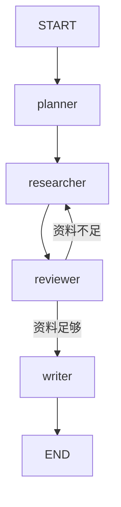
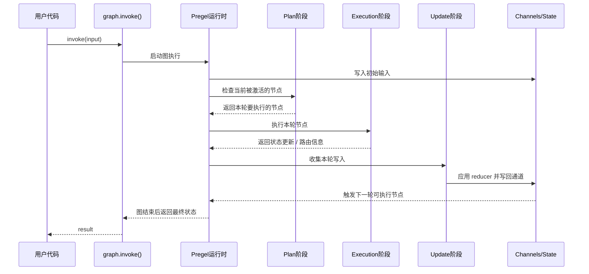
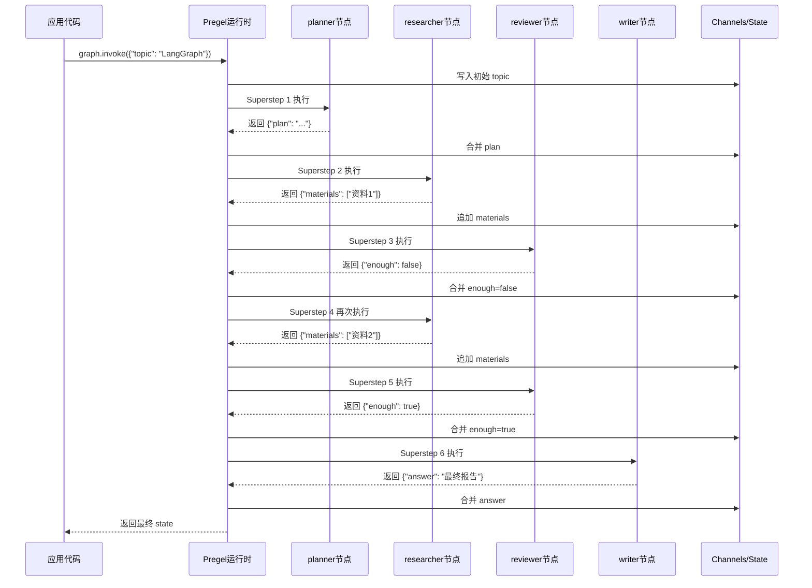
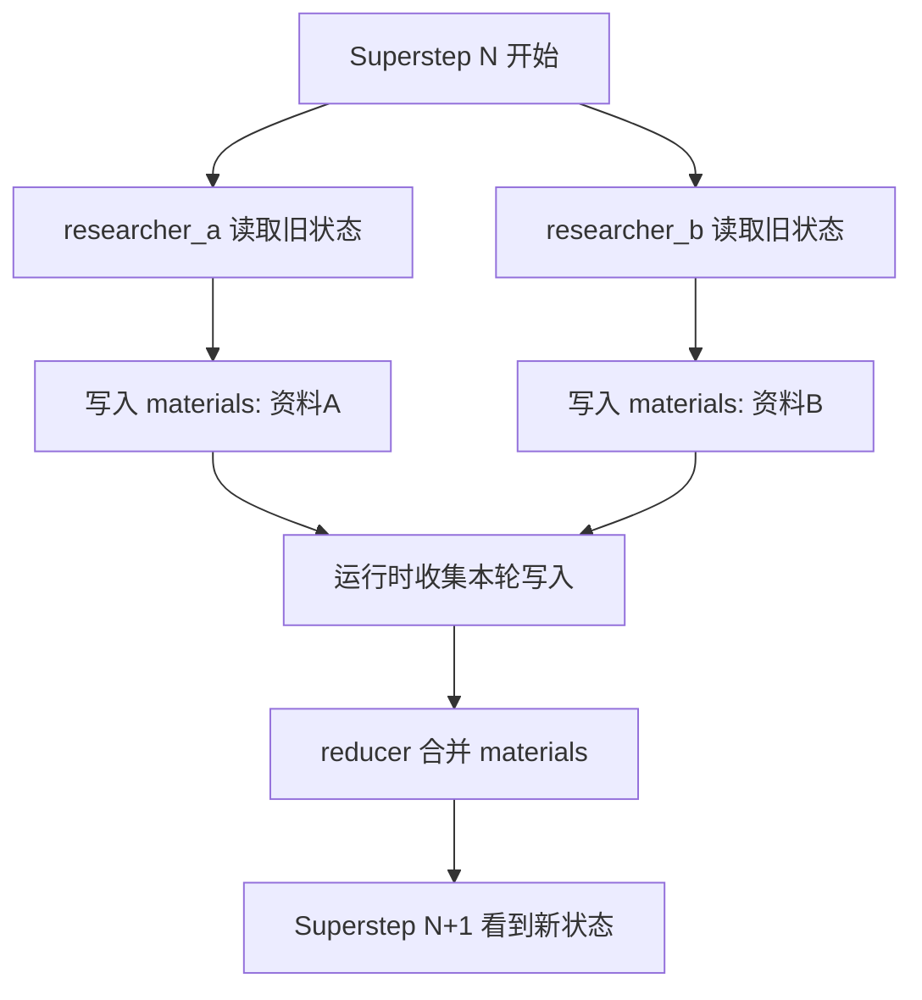
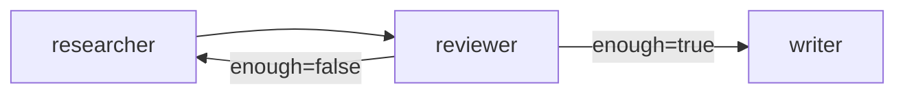
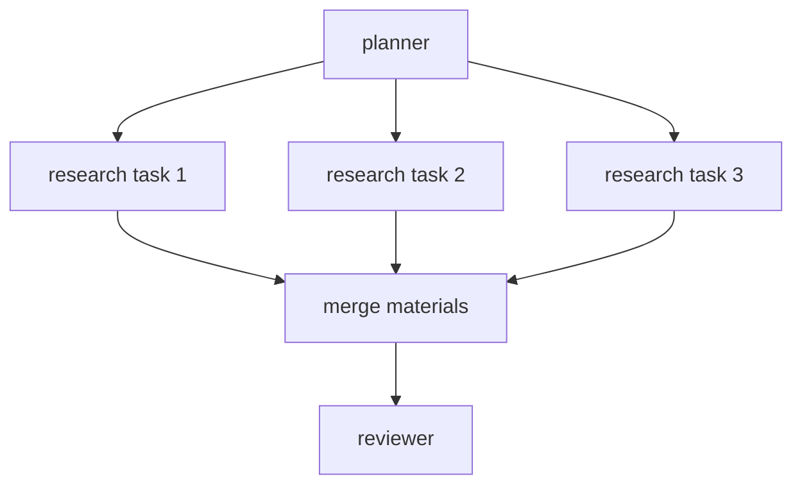

# 第16章-Pregel运行时原理

## 16.1 从 `graph.invoke()` 背后看执行过程

前面几章我们已经写过不少 LangGraph 程序。

从使用者视角看，运行一个图通常只是这样一行代码：

```python
result = graph.invoke({"question": "LangGraph 为什么适合 Agent？"})
```

这行代码看起来很像普通函数调用：

```text
输入 -> 执行 -> 输出
```

但 LangGraph 内部并不是简单地把节点函数按代码顺序调用一遍。

如果一个图里只有两个节点：

```text
START -> classify -> answer -> END
```

你当然可以把它想成顺序执行。

可是一旦图变复杂，就会出现这些情况：

- 一个节点执行后，根据状态选择不同路径。
- 多个节点可能在同一轮被激活。
- 多个节点都想更新同一个状态字段。
- 一个节点可能动态分发多个任务。
- 图里可能有循环，运行次数不是写代码时固定的。
- 中间可能要保存 checkpoint、输出 stream event，甚至暂停等待人类。

这时如果还把 LangGraph 理解成“按边调用下一个函数”，就会很快卡住。

第五部分要解决的就是这个问题：

> LangGraph 为什么能稳定执行一个带状态、分支、循环、并行和恢复能力的 Agent？

本章先看最底层的一块：Pregel 运行时。

## 16.2 本章目标

这一章不急着写新功能，而是剖开一次执行过程。

读完本章，读者应该能回答四个问题：

| 问题 | 本章要建立的理解 |
| --- | --- |
| `graph.invoke()` 内部在做什么？ | 它把图交给 Pregel 风格运行时按轮次推进 |
| 什么是 superstep？ | 一轮“选择节点、执行节点、收集更新、写回状态”的同步执行 |
| 为什么状态更新不是节点一返回就立刻乱写？ | 因为运行时要先收集本轮写入，再统一合并到 channel |
| Pregel 机制解决了什么工程问题？ | 用统一模型处理分支、循环、并行、动态分发和状态传播 |

本章最重要的不是记住 Pregel 这个名字，而是建立一个运行时心智模型：

```text
LangGraph 的执行不是一条函数调用链，
而是一轮一轮推进的状态图调度过程。
```

## 16.3 先看一个熟悉的小图

为了让原理可见，我们使用一个简化版研究助手。

它有四个节点：

```text
planner：生成研究计划
researcher：收集资料
reviewer：检查资料是否足够
writer：生成最终回答
```

图结构如下：



如果只从业务流程看，它很简单：

```text
先计划。
再研究。
再审查。
不够就继续研究。
够了就写答案。
```

但从运行时角度看，问题变成了：

```text
第一轮应该运行谁？
节点返回的状态更新放在哪里？
reviewer 怎么决定下一轮回到 researcher 还是进入 writer？
循环什么时候停止？
如果 researcher 和另一个节点同时更新资料，怎么合并？
```

这些问题不是业务逻辑问题，而是运行时问题。

Pregel 运行时就是 LangGraph 用来回答这些问题的底层模型之一。

## 16.4 Pregel 不是一个新 API，而是一种执行模型

很多读者第一次看到 Pregel，会误以为它是又一个需要手动调用的 API。

对本书来说，可以先这样理解：

> Pregel 是 LangGraph 内部用来推进图执行的运行时模型。

它的关键思想是按轮次推进。

每一轮可以叫一个 superstep。

在一个 superstep 里，运行时大致做三件事：

```text
Plan：决定本轮哪些节点应该执行。
Execution：执行这些节点，收集它们产生的写入。
Update：把写入合并到状态通道，并决定下一轮激活什么。
```

可以画成这样：



注意这张图里的重点：

```text
节点函数不是直接互相调用。
节点函数把更新交给运行时。
运行时统一决定状态怎么写回、下一轮谁被激活。
```

这就是 LangGraph 和普通 Python 函数链条的重要差别。

## 16.5 普通函数调用为什么不够

假设不用 LangGraph，我们可能会这样写研究助手：

```python
state = planner(state)
state = researcher(state)
state = reviewer(state)

if state["enough"]:
    state = writer(state)
else:
    state = researcher(state)
    state = reviewer(state)
```

这个版本可以跑，但问题很快出现。

第一，循环会散落在业务代码里。

```text
资料不够就继续研究
```

这个规则本来属于图结构，但现在被写进了 if/else 和 while。

第二，状态更新靠人工约定。

每个函数都直接接收和返回 `state`。如果两个函数都修改 `materials`，谁覆盖谁、谁追加谁，都要开发者自己小心处理。

第三，并行和动态分发不好表达。

如果 planner 生成了五个子任务，普通函数写法很容易变成：

```text
for task in tasks:
    researcher(task)
```

这能表达循环，但很难表达“这些任务是图中的多个执行分支，它们的结果需要被运行时合并”。

第四，工程能力不好插入。

checkpoint、interrupt、streaming 都需要知道“当前执行到了哪一轮、哪个节点、状态变化是什么”。如果所有流程都写在一团 Python 控制流里，运行时很难统一观察和接管。

所以 LangGraph 不只是把函数连起来。

它把函数放进一个运行模型里：

```text
节点只负责计算本节点的更新。
边和路由负责描述下一步可能去哪里。
运行时负责按轮次调度、合并状态、推进图执行。
```

## 16.6 Superstep：一轮同步推进

现在我们把 superstep 放大来看。

一个 superstep 可以理解成 LangGraph 执行的一轮节拍。

每一轮都包含三个动作：

| 阶段 | 做什么 | 可以理解成 |
| --- | --- | --- |
| Plan | 找出本轮要执行的节点 | 谁现在被激活了 |
| Execution | 运行这些节点函数 | 让节点产生状态更新 |
| Update | 合并写入并更新通道 | 把本轮结果正式写回状态 |

用研究助手的小图来看，执行过程可能是这样：

| Superstep | 本轮执行节点 | 节点产生的更新 | 更新后可能激活 |
| --- | --- | --- | --- |
| 0 | `START` | 初始输入写入 state | `planner` |
| 1 | `planner` | `{"plan": "..."}` | `researcher` |
| 2 | `researcher` | `{"materials": [...]}` | `reviewer` |
| 3 | `reviewer` | `{"enough": false}` | `researcher` |
| 4 | `researcher` | `{"materials": [...]}` | `reviewer` |
| 5 | `reviewer` | `{"enough": true}` | `writer` |
| 6 | `writer` | `{"answer": "..."}` | `END` |

这张表很重要。

它让我们看到：

```text
循环不是 Python while 在原地转。
循环是运行时在多个 superstep 之间反复激活节点。
```

当 `reviewer` 返回“资料不足”时，运行时不会在 `reviewer` 函数内部直接调用 `researcher`。

更准确地说：

```text
reviewer 产生状态更新和路由结果。
运行时把更新写回状态。
运行时根据边和路由结果，决定下一轮激活 researcher。
```

这就是图执行和函数嵌套调用的差别。

## 16.7 一次执行的时间线

我们再用时序图看同一个过程。



这张图里有两个细节值得注意。

第一，节点之间没有直接箭头。

`planner` 没有调用 `researcher`，`researcher` 也没有调用 `reviewer`。真正站在中间的是运行时。

第二，状态更新经过 `Channels/State`。

节点返回的是局部更新，不是完整地重写整个系统状态。

例如：

```python
def researcher(state):
    return {"materials": ["资料1"]}
```

它只是说：

```text
我这一步产生了一份新资料。
```

至于这份资料是覆盖旧资料，还是追加到旧资料后面，要由 state 字段对应的 reducer 和 channel 机制决定。

这就自然引出下一章的主题：Channel 机制。

## 16.8 状态更新为什么要分阶段

初学 LangGraph 时，很多人会问：

```text
节点既然返回了 dict，为什么不立刻改 state？
```

因为复杂图里，立刻修改会带来混乱。

假设同一轮有两个研究节点同时产生资料：

```text
researcher_a -> {"materials": ["资料A"]}
researcher_b -> {"materials": ["资料B"]}
```

如果它们直接修改同一个列表，就会出现几个问题：

- 谁先写？
- 谁后写？
- 后写会不会覆盖先写？
- 如果其中一个节点失败，状态算不算已经改变？
- streaming 和 checkpoint 应该记录哪个时间点的状态？

Pregel 风格运行时的处理方式更稳：

```text
先执行本轮节点。
再收集本轮所有写入。
然后统一应用 reducer。
最后得到下一轮可见的新状态。
```

可以画成这样：



这种“先收集、再合并、下一轮可见”的方式，让图执行更容易推理。

读者可以记住一个简化规则：

> 一个节点看到的是本轮开始前的状态；它产生的更新会在本轮结束时被合并，并影响后续 superstep。

这不是死记硬背的规则，而是为了让并行、循环和状态合并都变得可控。

## 16.9 Pregel 如何处理分支

分支在 LangGraph 里通常来自条件边。

例如第 15 章多模型协作里有一个路由节点：

```text
route_question
-> local_answer
-> tool_executor
-> privacy_filter
```

从代码上看，我们会写一个路由函数：

```python
def route_after_router(state):
    if state["route"] == "local_answer":
        return "local_answer"
    if state["route"] == "tool_then_reasoning":
        return "tool_executor"
    return "privacy_filter"
```

从运行时角度看，它的意义是：

```text
当前 superstep 执行 route_question。
route_question 写入 route。
运行时在更新状态后读取路由结果。
下一轮只激活被选中的节点。
```

执行表可以写成这样：

| Superstep | 本轮节点 | 关键状态更新 | 下一轮激活 |
| --- | --- | --- | --- |
| 1 | `route_question` | `route = "tool_then_reasoning"` | `tool_executor` |
| 2 | `tool_executor` | `tool_result = "128 * 32 = 4096"` | `privacy_filter` |
| 3 | `privacy_filter` | `sanitized_question = "..."` | `deep_reasoning` |
| 4 | `deep_reasoning` | `answer = "..."` | `END` |

这里的重点是：

```text
条件边不是 if/else 的装饰。
它会改变下一轮运行时激活的节点集合。
```

所以写条件边时，开发者不只是写“跳到哪里”，而是在参与运行时调度。

## 16.10 Pregel 如何处理循环

循环和分支很像，只是下一轮激活的节点可能是前面已经执行过的节点。

研究助手里的 `reviewer` 就是典型例子：

```text
reviewer
-> 资料不足：回到 researcher
-> 资料足够：进入 writer
```

从运行时角度看，循环不是特殊魔法。

它只是某一轮结束后，运行时又激活了图中之前出现过的节点。



对应 superstep 表：

| Superstep | 本轮节点 | 状态变化 | 下一轮 |
| --- | --- | --- | --- |
| 2 | `researcher` | 增加第一批资料 | `reviewer` |
| 3 | `reviewer` | `enough = false` | `researcher` |
| 4 | `researcher` | 增加第二批资料 | `reviewer` |
| 5 | `reviewer` | `enough = true` | `writer` |

这说明一个重要原则：

> LangGraph 里的循环应该由状态驱动，而不是由节点内部的无限 while 驱动。

如果你把循环写在节点内部，运行时就看不到循环过程。

这样会损失很多能力：

- 不能在每轮之间 checkpoint。
- 不能清楚 stream 出每次循环进展。
- 不容易在某一轮 interrupt。
- 不容易测试“资料不足时是否回到 researcher”。

所以在 LangGraph 里，更推荐把循环显式表达成图结构。

## 16.11 Pregel 如何处理并行和动态分发

Pregel 模型真正有用的地方，是它不只适合顺序流程，也适合多个节点在同一轮推进。

例如 planner 生成三个研究任务：

```text
任务 1：查 LangGraph Pregel
任务 2：查 Channel
任务 3：查 Checkpoint
```

运行时可以在某一轮让多个研究节点或多个任务分支被激活。

简化来看：



superstep 表可以这样写：

| Superstep | 本轮执行 | 本轮写入 | 合并结果 |
| --- | --- | --- | --- |
| 1 | `planner` | `tasks = [1, 2, 3]` | 激活三个研究任务 |
| 2 | `research_task_1`, `research_task_2`, `research_task_3` | 各自写入 `materials` | reducer 合并成资料列表 |
| 3 | `reviewer` | `enough = true/false` | 选择下一步 |

这就是为什么 reducer 很重要。

当多个节点在同一轮都写入 `materials` 时，运行时必须知道：

```text
这些更新是追加、覆盖、取最大值、去重，还是自定义合并？
```

Pregel 负责调度轮次。

Channel 负责承载状态更新。

Reducer 负责定义同一字段的更新如何合并。

这三者放在一起，才构成 LangGraph 稳定执行复杂图的基础。

## 16.12 和前面章节的关系

到这里，我们可以把第三、第四部分学过的概念重新放到运行时里。

| 前面学过的概念 | 在 Pregel 运行时里意味着什么 |
| --- | --- |
| State | 节点读取和写入的共享状态视图 |
| Node | 每个 superstep 中可被调度执行的计算单元 |
| Edge | 决定节点完成后可能激活哪些后继节点 |
| Conditional Edge | 根据状态选择下一轮激活的节点 |
| Reducer | 决定本轮多个写入如何合并 |
| Command | 让节点同时返回状态更新和跳转意图 |
| Send | 动态产生多个下一步任务，让运行时在后续轮次调度 |
| Checkpoint | 在执行过程中的关键点保存状态和进度 |
| Streaming | 把节点执行、状态更新、模型输出等过程事件暴露出来 |

这样看，Pregel 不是孤立概念。

它是把这些概念串起来的执行底座。

开发者写的是：

```python
builder.add_node(...)
builder.add_edge(...)
graph.invoke(...)
```

运行时看到的是：

```text
哪些节点被激活？
这些节点读取哪些 channel？
这些节点写入哪些 channel？
本轮写入如何合并？
下一轮应该激活哪些节点？
图是否已经结束？
```

这就是从“写 LangGraph 程序”到“理解 LangGraph 运行系统”的转变。

## 16.13 读源码时如何定位 Pregel

如果以后读 LangGraph 源码，看到 `pregel` 相关模块，可以把它放到运行时层。

它关心的不是某个业务 Agent 写得好不好，而是这些更底层的问题：

- 图如何开始执行？
- 输入如何进入状态通道？
- 哪些节点在本轮可运行？
- 节点执行结果如何收集？
- 写入如何提交到 channel？
- 下一轮任务如何产生？
- 什么时候认为图已经结束？
- 中途如何配合 checkpoint、interrupt、streaming？

源码里可能会有更多工程细节，例如重试、缓存、任务管理、异步执行、stream 模式等。

但初学者先不要被这些细节淹没。

读源码时可以一直抓住这个主问题：

```text
这一段代码是在 Plan、Execution、Update 哪个阶段发挥作用？
```

只要能定位到阶段，源码就不再是一大片陌生类名。

## 16.14 常见误解

### 误解一：Pregel 就是并行执行

Pregel 风格确实适合表达并行，但它不等于“所有节点都并行跑”。

更准确地说：

```text
Pregel 是按轮次调度图执行。
某一轮里可以有一个节点，也可以有多个节点。
```

是否并行，取决于图结构、运行方式和具体执行环境。

本书更关心的是它的轮次模型，而不是把它简化成“并行框架”。

### 误解二：节点返回的 dict 就是最终 state

节点返回的是状态更新，不是完整状态。

例如：

```python
return {"answer": "..." }
```

它的意思不是“整个 state 现在只有 answer”，而是：

```text
请把 answer 这个字段更新进去。
```

其他字段是否保留、某个字段如何合并，要看 state schema、channel 和 reducer。

### 误解三：边就是函数调用

边描述的是运行时调度关系，不是节点之间的直接函数调用。

`A -> B` 的意思更接近：

```text
A 完成并提交更新后，B 有机会在后续 superstep 被激活。
```

不是：

```text
A 函数内部调用 B 函数。
```

这个区别非常重要。

只有理解了这一点，才能理解 checkpoint、streaming 和 interrupt 为什么能够插入执行过程。

### 误解四：循环应该写在节点内部

如果循环是 Agent 流程的一部分，最好让它出现在图结构里。

节点内部可以有小循环，例如处理一个列表、清洗一段文本。

但如果循环代表“再次研究、再次调用工具、再次审查、再次请求人工输入”，就应该优先考虑用图结构表达。

这样运行时才能观察、保存和控制这个循环。

## 16.15 小结：Pregel 给 LangGraph 的核心能力

本章我们没有急着写更多 API，而是把 `graph.invoke()` 背后的执行过程拆开看了一遍。

可以把 Pregel 运行时理解成：

> 一个按 superstep 推进的状态图调度系统。

它每一轮大致做三件事：

```text
Plan：决定本轮谁能执行。
Execution：运行节点并收集写入。
Update：合并写入，更新 channel，触发下一轮。
```

它带来的核心能力是：

- 节点之间不直接互相调用，而是由运行时调度。
- 状态更新先收集再合并，避免复杂图里写入混乱。
- 分支通过下一轮激活不同节点来实现。
- 循环通过反复激活图中节点来实现。
- 并行和动态分发可以通过同一套 superstep 模型表达。
- checkpoint、interrupt、streaming 能够围绕执行轮次插入。

读者应该记住这一句话：

> LangGraph 能支撑复杂 Agent，不是因为它把函数画成了图，而是因为图背后有一个按状态、通道和轮次推进的运行时。

下一章我们会继续下沉，看本章反复出现的 `Channel` 到底是什么。

如果说 Pregel 解决的是“图如何一轮一轮往前跑”，那么 Channel 解决的就是：

```text
状态更新到底通过什么被承载、合并和传播？
```

