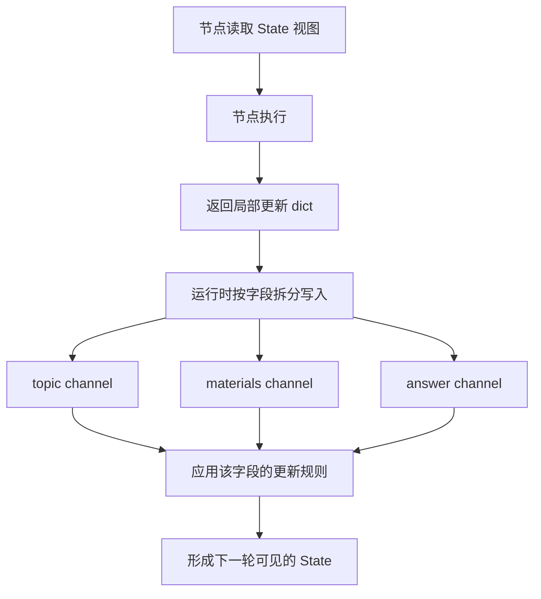
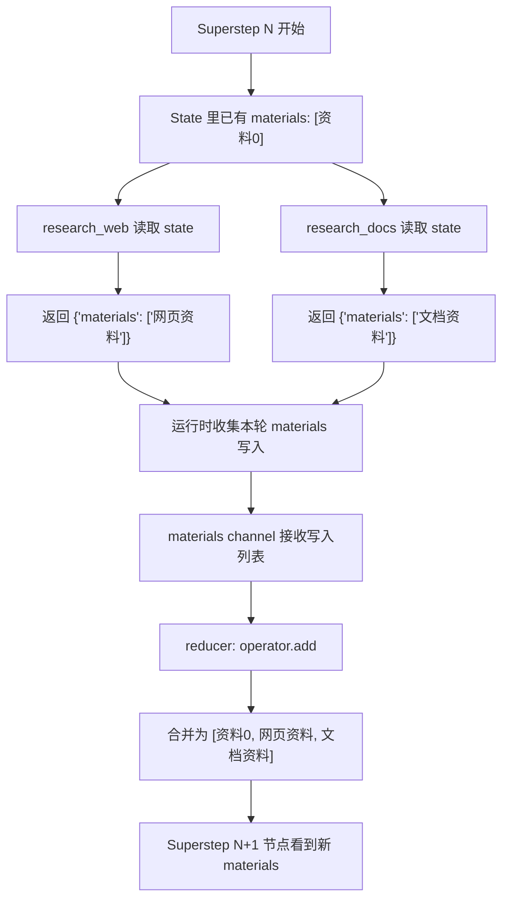
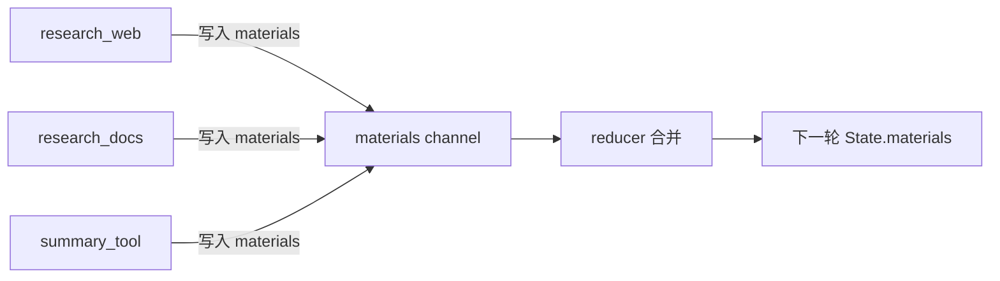
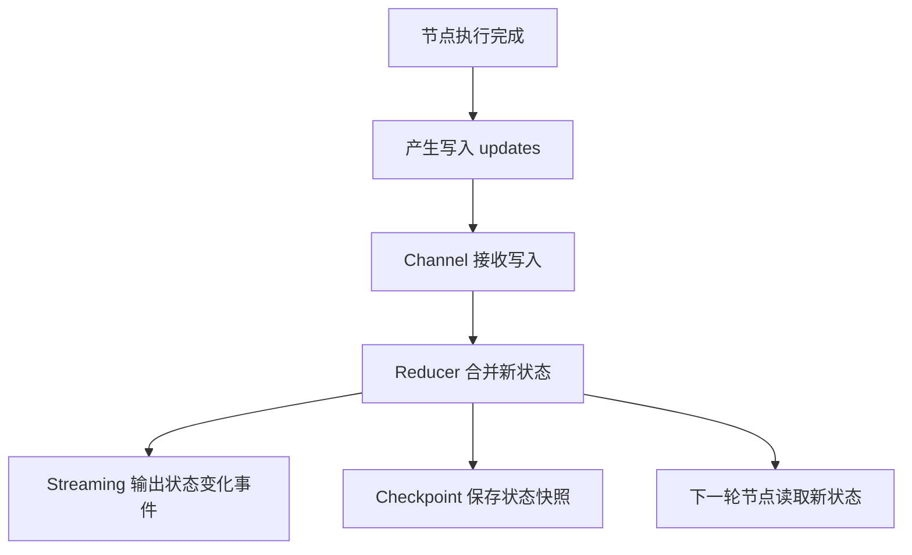
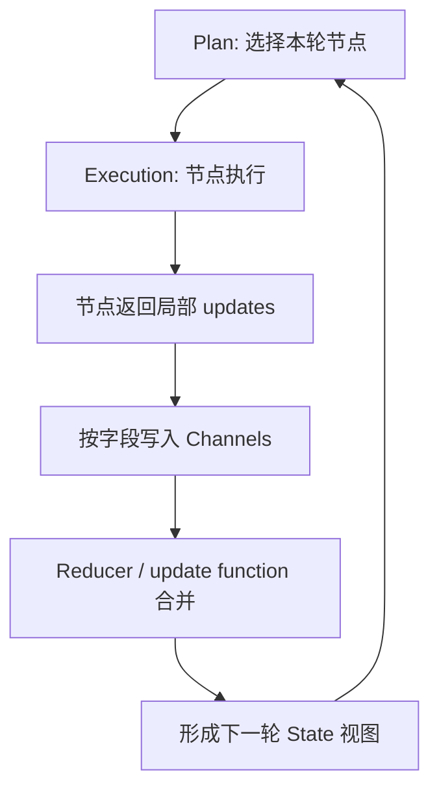

# 第17章-Channel机制

## 17.1 从“节点返回 dict”背后看状态更新

上一章我们讲了 Pregel 运行时。

它解决的是：

```text
LangGraph 如何一轮一轮调度节点执行？
```

这一章继续往下看一个更细的问题：

```text
节点产生的状态更新，到底通过什么被承载、合并和传播？
```

在使用 LangGraph 时，我们经常写这样的节点：

```python
def researcher(state):
    return {"materials": ["资料1"]}
```

从表面看，它只是返回了一个普通 Python `dict`。

初学者很容易把它理解成：

```text
节点直接修改了 state。
```

但这个理解不够准确。

更准确地说：

> 节点返回的是对某些状态字段的写入请求。运行时会把这些写入送到对应的 Channel，再由 Channel 和 reducer 决定如何更新状态。

也就是说，`state` 不是一个被所有节点随便改的全局变量。

在 LangGraph 运行时内部，它更像一组通道：

```text
topic channel
plan channel
materials channel
answer channel
```

每个字段背后都有自己的更新规则。

这就是 Channel 机制要解决的问题。

## 17.2 本章目标

本章不把 Channel 写成源码名词解释，而是用一个实际问题把它讲清楚。

读完本章，读者应该能回答这些问题：

| 问题 | 本章要建立的理解 |
| --- | --- |
| Channel 是什么？ | 节点之间传递状态更新的运行时通道 |
| Channel 和 State 有什么关系？ | State 是开发者看到的状态视图，Channel 是运行时承载字段更新的机制 |
| 为什么需要 reducer？ | 因为同一个字段可能收到多个更新，必须知道如何合并 |
| 默认更新规则适合什么？ | 适合单值字段，后写值覆盖旧值 |
| 列表、消息、资料为什么常需要 reducer？ | 因为它们通常要追加、聚合或去重，而不是覆盖 |

这一章最重要的心智模型是：

```text
State 是你看到的状态。
Channel 是运行时保存和传播状态更新的通道。
Reducer 是通道处理多个写入时使用的合并规则。
```

## 17.3 先看一个会出错的状态更新

假设我们继续使用研究助手。

它有一个状态字段：

```python
class ResearchState(TypedDict):
    topic: str
    materials: list[str]
    answer: str
```

现在 planner 拆出两个研究任务：

```text
research_web：搜索网页资料
research_docs：读取本地文档
```

两个节点都想写入 `materials`：

```python
def research_web(state):
    return {"materials": ["网页资料"]}


def research_docs(state):
    return {"materials": ["文档资料"]}
```

如果我们期望最终状态是：

```python
{"materials": ["网页资料", "文档资料"]}
```

那就必须回答一个问题：

```text
两个节点都写 materials，运行时应该怎么合并？
```

如果没有明确规则，结果可能变成：

```python
{"materials": ["文档资料"]}
```

或者：

```python
{"materials": ["网页资料"]}
```

也就是后写的覆盖先写的。

这对 `answer` 这样的单值字段可能没问题，但对 `materials` 这样的聚合字段就错了。

这就是 Channel 和 reducer 要解决的典型问题。

## 17.4 Channel 的位置：夹在节点和状态之间

从开发者视角看，节点读取 state、返回 dict。

```text
state -> node -> partial update
```

从运行时视角看，中间还有一层 Channel。



这张图说明了一个关键点：

```text
节点返回的 dict 不是直接替换整个 state。
运行时会把 dict 里的每个 key 送到对应的 channel。
```

例如：

```python
return {
    "materials": ["网页资料"],
    "answer": "初步结论",
}
```

运行时可以理解成两次写入：

```text
写入 materials channel：["网页资料"]
写入 answer channel："初步结论"
```

不同字段可以有不同的更新规则。

这就是为什么 LangGraph 能同时支持：

- 单值覆盖。
- 列表追加。
- 消息累积。
- 数值聚合。
- 自定义状态合并。

## 17.5 State 是视图，Channel 是机制

在第三部分讲 State 时，我们主要站在开发者视角。

例如：

```python
class ResearchState(TypedDict):
    topic: str
    plan: str
    materials: list[str]
    answer: str
```

这个类型告诉读者：

```text
这个 Agent 的状态里有哪些字段。
```

但在运行时层，状态字段会被转换成可以读写的通道。

可以这样理解：

| 层次 | 你看到的东西 | 它回答的问题 |
| --- | --- | --- |
| 开发者视角 | `ResearchState` | 这个 Agent 需要保存哪些信息？ |
| 节点视角 | `state["materials"]` | 当前节点能读到什么状态？ |
| 运行时视角 | `materials channel` | 这个字段的写入如何保存、合并、传播？ |
| 合并规则视角 | reducer / update function | 多个写入来了以后怎么变成新值？ |

所以，不要把 State 和 Channel 看成两个互相竞争的概念。

它们是同一件事的两个层面：

```text
State 让开发者描述 Agent 的共享信息。
Channel 让运行时管理这些信息的更新过程。
```

## 17.6 默认规则：适合单值字段

很多字段其实不需要特殊 reducer。

例如：

```python
class EssayState(TypedDict):
    topic: str
    content: str
    score: float
```

`topic`、`content`、`score` 都是单值字段。

如果节点返回：

```python
return {"content": "第一版文章"}
```

后面的节点又返回：

```python
return {"content": "修改后的文章"}
```

那么最终保留“修改后的文章”是合理的。

这类字段可以理解成默认的“最后一次写入为准”。

适合这种规则的字段包括：

| 字段 | 为什么适合覆盖 |
| --- | --- |
| `route` | 当前只需要一个路由结果 |
| `answer` | 最终回答通常只有一个当前版本 |
| `score` | 评分节点会给出当前评分 |
| `status` | 当前状态通常以后一次为准 |
| `sanitized_question` | 脱敏后的问题可以覆盖旧值 |

但并不是所有字段都适合覆盖。

一旦字段表示“收集到的一组东西”，默认覆盖就很危险。

## 17.7 聚合字段：为什么需要 reducer

继续看 `materials`。

研究助手通常不是只保留最后一份资料，而是要累积多份资料。

```text
网页资料 + 文档资料 + 工具结果 + 用户补充
```

这类字段如果用覆盖规则，就会丢信息。

我们需要告诉 LangGraph：

```text
materials 的更新不是覆盖，而是追加。
```

在 StateGraph 里，常见写法是给字段标注 reducer。

例如：

```python
import operator
from typing import Annotated, TypedDict


class ResearchState(TypedDict):
    topic: str
    materials: Annotated[list[str], operator.add]
    answer: str
```

这里的意思是：

```text
当 materials 收到新写入时，用 operator.add 把旧列表和新列表合并。
```

如果旧状态是：

```python
{"materials": ["网页资料"]}
```

新写入是：

```python
{"materials": ["文档资料"]}
```

合并后就是：

```python
{"materials": ["网页资料", "文档资料"]}
```

从运行时角度看，它不是节点自己去 append 全局列表。

而是：

```text
节点返回一个 materials 写入。
materials channel 收到写入。
reducer 决定新旧值如何合并。
下一轮节点看到合并后的 materials。
```

## 17.8 状态更新合并表

现在把几种常见字段放在一起看。

| 字段类型 | 示例字段 | 节点写入 | 推荐合并方式 | 适合原因 |
| --- | --- | --- | --- | --- |
| 单值输入 | `topic` | `"LangGraph"` | 保留当前值或覆盖 | 通常只有一个当前主题 |
| 当前路由 | `route` | `"tool_then_reasoning"` | 最后写入为准 | 一次路由只需要一个结果 |
| 最终回答 | `answer` | `"最终回答"` | 最后写入为准 | 最终输出通常只有一个版本 |
| 资料列表 | `materials` | `["资料A"]`、`["资料B"]` | 追加合并 | 多个研究节点都要贡献资料 |
| 消息列表 | `messages` | `[AIMessage(...)]` | 追加合并 | 对话历史不能被新消息覆盖 |
| 数值统计 | `token_count` | `120`、`80` | 求和 | 多个节点消耗需要累计 |
| 中间结果字典 | `partial_results` | `{"web": ...}`、`{"doc": ...}` | 字典合并 | 不同来源写入不同 key |
| 审查状态 | `enough` | `true` / `false` | 最后写入为准 | 当前审查结论覆盖旧结论 |

这张表比 API 名称更重要。

设计 State 时，应该逐个字段问：

```text
这个字段代表一个当前值，还是一组累计值？
如果多个节点都写它，是覆盖、追加、求和、合并，还是去重？
```

只要这个问题没想清楚，Agent 复杂以后就很容易出现状态丢失或重复。

## 17.9 状态更新从节点到下一轮的完整流程

我们用 `materials` 字段画一次完整流程。



这个流程里有三个边界要分清。

第一，节点读取的是本轮开始时的 state。

`research_web` 和 `research_docs` 都看到同一个旧状态：

```python
["资料0"]
```

第二，节点返回的是局部更新。

它们不需要自己关心另一个节点写了什么。

第三，合并发生在运行时的 update 阶段。

下一轮节点看到的是合并后的状态：

```python
["资料0", "网页资料", "文档资料"]
```

这就是 Channel 机制带来的稳定性。

节点不用互相知道对方的存在，也能把结果合并到同一个状态字段里。

## 17.10 Channel 让并行写入变得可控

如果没有 Channel，多个节点写同一个字段就很容易变成共享变量竞争。

例如：

```text
research_web 想 append materials。
research_docs 也想 append materials。
summary_tool 也想 append materials。
```

如果它们直接改同一个列表，就会出现很多隐性问题：

- 执行顺序影响结果。
- 某个节点失败后状态可能已经被部分修改。
- checkpoint 不知道应该保存修改前还是修改后。
- streaming 很难准确展示“哪个节点写了什么”。
- 测试时很难复现并行写入的结果。

Channel 的作用是把这些写入变成显式事件：

```text
research_web 写入 materials: ["网页资料"]
research_docs 写入 materials: ["文档资料"]
summary_tool 写入 materials: ["摘要资料"]
```

然后运行时统一合并。



这让状态更新具备可解释性。

当最终资料重复、丢失或顺序不对时，你可以沿着 channel 写入去排查：

```text
谁写了？
写了什么？
写入发生在哪个 superstep？
这个字段用了什么合并规则？
```

## 17.11 Channel 和 reducer 的关系

可以用一句话区分它们：

```text
Channel 负责接住写入。
Reducer 负责把写入合成新值。
```

更完整一点：

| 概念 | 作用 | 类比 |
| --- | --- | --- |
| State 字段 | 开发者看到的数据名 | `materials` |
| Channel | 运行时承载这个字段更新的通道 | 收件箱 |
| 写入 update | 节点提交的新值 | 一封新邮件 |
| Reducer | 处理一批新值的合并规则 | 收件箱整理规则 |
| 下一轮 State | 合并后的可读视图 | 整理后的文件夹 |

所以不要把 reducer 理解成“节点里的工具函数”。

它更像字段级别的状态语义。

当你写：

```python
materials: Annotated[list[str], operator.add]
```

你其实是在声明：

```text
materials 这个字段的语义是累积资料。
多个节点写入它时，应该追加而不是覆盖。
```

这是一条设计规则，不只是一个 Python 技巧。

## 17.12 常见 Channel 类型的直观理解

如果直接读底层 Pregel 文档，会看到几类 Channel。

对本书来说，先建立直观理解就够了。

| Channel 类型 | 直观理解 | 适合场景 |
| --- | --- | --- |
| `LastValue` | 保存最后一次写入 | 单值字段，如 `answer`、`route` |
| `Topic` | 收集多个发布值 | 多节点向同一处发布事件或结果 |
| `BinaryOperatorAggregate` | 用二元操作累计值 | 计数、求和、字符串拼接、列表聚合 |
| `EphemeralValue` | 临时传递一次性信号 | 节点激活、边触发、内部控制信号 |

在日常使用 `StateGraph` 时，读者不一定会直接手写这些底层 Channel。

很多时候你只是写：

```python
class State(TypedDict):
    answer: str
    messages: Annotated[list, operator.add]
```

然后 `compile()` 会把高层状态定义转换成运行时需要的节点和通道。

但知道这些底层概念有两个好处。

第一，你能理解为什么 reducer 很重要。

第二，你读源码或调试复杂图时，不会把 state 误解成一个普通 dict。

## 17.13 覆盖、追加、合并、去重：四种常见语义

设计状态字段时，可以先不用想 API，而是先判断语义。

### 覆盖语义

适合当前值字段。

```python
return {"route": "deep_reasoning"}
```

含义是：

```text
当前路由就是 deep_reasoning。
旧路由不重要。
```

常见字段：

```text
route
answer
status
score
sanitized_question
```

### 追加语义

适合历史、资料、消息。

```python
return {"materials": ["资料A"]}
```

含义是：

```text
把这份资料加入已有资料列表。
```

常见字段：

```text
messages
materials
tool_results
events
```

### 合并语义

适合不同节点写入不同 key 的字典。

```python
return {"partial_results": {"web": "网页结果"}}
```

另一个节点返回：

```python
return {"partial_results": {"docs": "文档结果"}}
```

合并后应该是：

```python
{
    "partial_results": {
        "web": "网页结果",
        "docs": "文档结果",
    }
}
```

### 去重语义

适合资料来源、引用链接、工具结果。

例如多个研究节点可能找到同一个 URL。

这时简单追加会导致重复，覆盖又会丢信息。

更好的语义是：

```text
追加，但按 url 或 id 去重。
```

这类 reducer 通常需要自定义。

## 17.14 自定义 reducer 什么时候值得写

不要一上来就给所有字段写复杂 reducer。

只有当字段真的有合并语义时，才需要自定义。

可以用下面这张表判断：

| 情况 | 是否需要 reducer | 原因 |
| --- | --- | --- |
| 字段只保存当前答案 | 通常不需要 | 覆盖就够了 |
| 字段保存对话消息 | 需要 | 新消息应该追加 |
| 字段保存多个工具结果 | 通常需要 | 多个工具都可能写入 |
| 字段保存研究资料 | 需要 | 资料要累积，可能还要去重 |
| 字段保存当前路由 | 通常不需要 | 每次只关心当前路由 |
| 字段保存 token 消耗 | 需要 | 多节点消耗要累计 |
| 字段保存错误列表 | 需要 | 多个节点错误都应保留 |

自定义 reducer 应该尽量满足三个要求：

- 纯函数：同样输入总是得到同样输出。
- 不修改输入对象：返回新值更容易推理。
- 合并语义稳定：分批合并和一次合并结果不要互相矛盾。

例如资料去重 reducer 可以这样设计：

```python
def merge_materials(old: list[dict], new: list[dict]) -> list[dict]:
    seen = {item["url"] for item in old}
    result = list(old)

    for item in new:
        if item["url"] not in seen:
            result.append(item)
            seen.add(item["url"])

    return result
```

这段代码的重点不是语法，而是语义：

```text
materials 是按 url 去重的资料集合。
```

当 reducer 表达的是清楚的业务语义，State 就会更可靠。

## 17.15 Channel 机制如何支撑 checkpoint 和 streaming

Channel 不只影响状态合并，也影响工程能力。

上一章说过，运行时每一轮会经历：

```text
Plan -> Execution -> Update
```

Channel 主要在 Update 阶段发挥作用。

这意味着 checkpoint 和 streaming 可以围绕状态更新做事：



如果状态是节点随手修改的共享变量，checkpoint 很难知道“什么时候状态稳定了”。

而 Channel 机制把状态更新集中到一个清晰边界：

```text
本轮节点执行完。
本轮写入收集完。
本轮 channel 更新完成。
此时状态进入一个稳定版本。
```

稳定版本，才适合保存、回放、调试和展示。

这也是 LangGraph 能做持久化和可观测性的基础之一。

## 17.16 常见错误与排查

### 错误一：列表字段被覆盖

现象：

```text
多个节点都返回 materials，但最终只剩最后一个节点的结果。
```

可能原因：

```text
materials 没有定义追加型 reducer。
```

排查方式：

```text
检查 State 里 materials 是否使用 Annotated 标注合并规则。
```

### 错误二：消息历史丢失

现象：

```text
多轮对话后，只剩最新一条消息。
```

可能原因：

```text
messages 被当成普通字段覆盖，而不是追加。
```

解决思路：

```text
使用适合消息列表的 reducer，让新消息进入历史。
```

### 错误三：资料重复越来越多

现象：

```text
循环研究几轮后，materials 里出现大量重复资料。
```

可能原因：

```text
只用了简单追加，没有去重语义。
```

解决思路：

```text
给资料设计稳定 id 或 url，然后用自定义 reducer 去重。
```

### 错误四：reducer 里做了不稳定操作

现象：

```text
回放、恢复或测试时，状态结果不一致。
```

可能原因：

```text
reducer 里使用了随机数、当前时间、外部请求，或者直接修改输入对象。
```

解决思路：

```text
让 reducer 成为纯粹的合并函数。
如果需要生成 id 或时间戳，应在节点写入前完成，而不是在 reducer 内部偷偷生成。
```

### 错误五：把业务逻辑塞进 reducer

现象：

```text
reducer 里开始判断问题类型、调用模型、读数据库。
```

可能原因：

```text
把 reducer 当成隐藏节点使用。
```

解决思路：

```text
reducer 只负责合并状态。
复杂业务逻辑应该放在节点里。
```

## 17.17 和第 16 章的关系

第 16 章讲的是 Pregel 如何推进执行轮次。

这一章讲的是每轮执行结束后，状态更新如何被承载和合并。

可以把两章合成一张图：



这张图就是 LangGraph 运行时的核心循环。

```text
Pregel 决定什么时候执行。
Channel 决定写入放到哪里。
Reducer 决定多个写入怎么合并。
State 决定节点下一轮能看到什么。
```

理解了这一层，很多看似神秘的问题都会变得简单：

- 为什么节点之间不直接互相调用？
- 为什么节点只返回局部 dict？
- 为什么列表字段需要 reducer？
- 为什么循环里的状态能一轮轮累积？
- 为什么 checkpoint 能保存稳定状态？

答案都和 Channel 机制有关。

## 17.18 设计 State 时的检查清单

以后设计 LangGraph State 时，可以按字段做一次检查。

| 检查问题 | 判断目的 |
| --- | --- |
| 这个字段是当前值，还是历史/集合？ | 决定覆盖还是追加 |
| 会不会有多个节点写这个字段？ | 判断是否需要 reducer |
| 多个写入的顺序是否重要？ | 判断是否要保序 |
| 是否可能重复？ | 判断是否要去重 |
| 是否需要跨 checkpoint 恢复？ | 判断字段值是否稳定、可序列化 |
| reducer 是否是纯函数？ | 避免恢复和回放不一致 |
| 这个字段是否太大？ | 考虑是否要拆分、摘要或使用更合适的存储方式 |

这张检查表非常实用。

很多 Agent 的 bug 表面上是“模型回答错了”，实际是状态设计错了。

例如：

```text
模型没有引用工具结果。
```

可能不是模型不聪明，而是 `tool_results` 被后一个节点覆盖了。

再例如：

```text
Agent 忘了前面说过的话。
```

可能不是记忆系统坏了，而是 `messages` 没有正确追加。

状态字段的合并语义，是 Agent 稳定性的地基。

## 17.19 小结：Channel 让状态更新变成可管理的过程

本章讲了 LangGraph 内部的 Channel 机制。

可以用一句话总结：

> Channel 是运行时承载状态字段更新的通道，它让节点返回的局部更新能够被收集、合并，并变成下一轮可见的 State。

它和几个核心概念的关系是：

```text
Node 产生更新。
Channel 接住更新。
Reducer 合并更新。
State 暴露合并后的视图。
Pregel 在下一轮继续调度节点。
```

读者应该记住的不是某个底层类名，而是这个设计判断：

> 每个 State 字段都应该有清楚的更新语义：覆盖、追加、合并、去重，或者其他自定义规则。

如果这个语义不清楚，复杂 Agent 很快会出现状态丢失、重复、覆盖和恢复不一致。

下一章我们会继续看 Checkpoint 持久化机制。

如果说 Pregel 解决的是“图如何推进”，Channel 解决的是“状态如何更新”，那么 Checkpoint 解决的就是：

```text
一次长时间运行的 Agent，如何在中途保存、恢复和回放？
```

