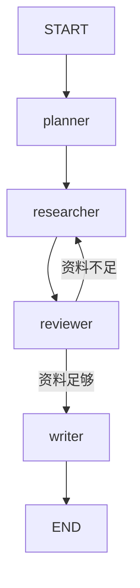
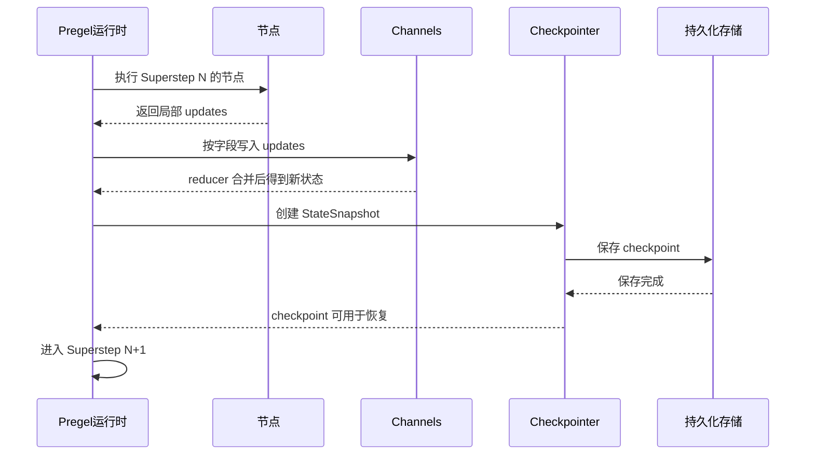
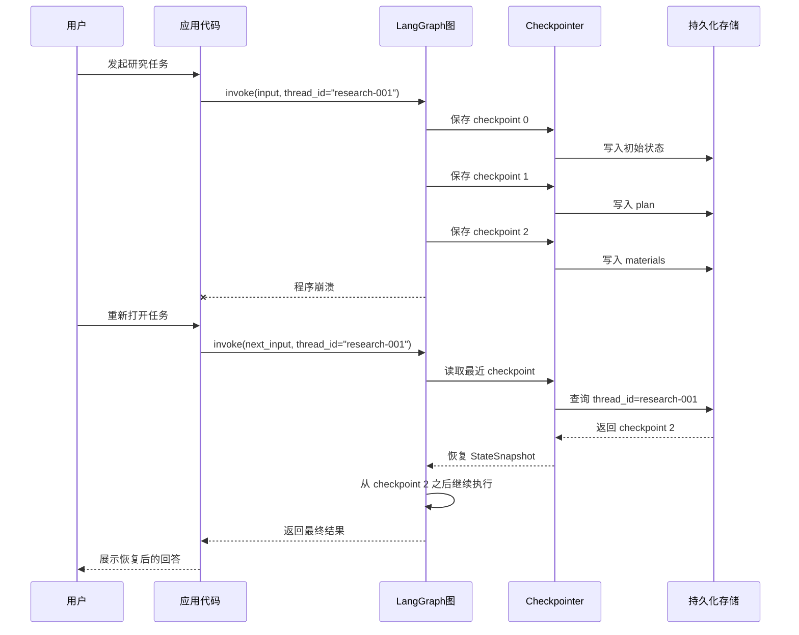
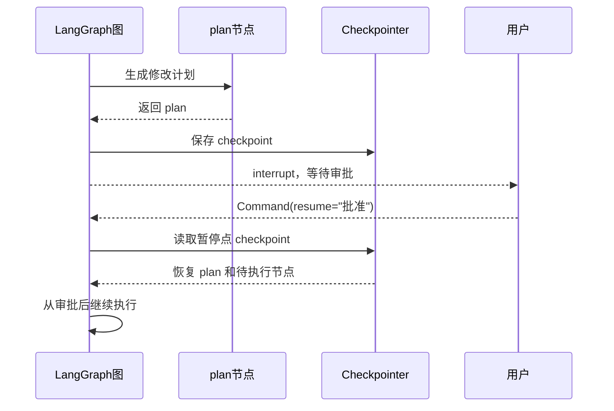
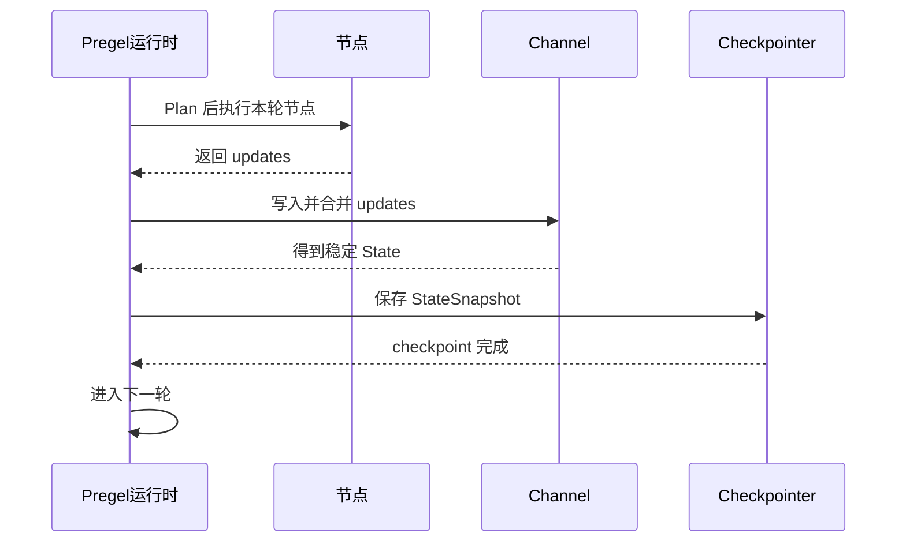

# 第18章-Checkpoint持久化机制

## 18.1 从“程序中断后怎么办”开始

前两章我们已经看到了 LangGraph 运行时的两个底层机制。

第 16 章讲 Pregel：

```text
图如何一轮一轮推进？
```

第 17 章讲 Channel：

```text
状态更新如何被承载、合并和传播？
```

这一章继续看一个更工程化的问题：

```text
如果 Agent 执行到一半失败、暂停或等待人类输入，之前的执行过程如何保存下来？
```

普通 LLM 调用通常很短：

```text
输入 prompt -> 模型返回答案
```

即使失败，大不了重新调用一次。

但 LangGraph Agent 不一样。

一个真实研究助手可能已经完成了这些步骤：

```text
生成计划。
搜索资料。
调用工具。
整理中间结果。
等待人工审批。
准备生成最终报告。
```

如果程序在这时崩溃，不能简单说：

```text
那就从头再跑一遍。
```

因为从头再跑会带来很多问题：

- 已经调用过的工具可能重复执行。
- 已经花掉的模型成本会浪费。
- 用户已经审批过的内容可能丢失。
- 中间资料可能重新生成出不同结果。
- 调试时很难知道上一次到底执行到了哪里。

Checkpoint 要解决的就是这个问题。

> Checkpoint 让 LangGraph 可以把某个 thread 的执行状态保存成快照，并在需要时恢复、回放或继续执行。

## 18.2 本章目标

这一章不把 checkpoint 写成“怎么配置数据库”的教程，而是先讲清楚它在运行时里的位置。

读完本章，读者应该能回答这些问题：

| 问题 | 本章要建立的理解 |
| --- | --- |
| Checkpoint 保存的是什么？ | 某个执行时刻的状态快照和继续执行所需的信息 |
| 它什么时候保存？ | 通常在 superstep 边界，也就是状态完成一次稳定更新后 |
| `thread_id` 是什么？ | 一条可恢复执行线的身份，用来找到对应 checkpoint 历史 |
| checkpoint 和 State 有什么关系？ | checkpoint 保存的是某个时刻的 StateSnapshot，不只是业务字段 |
| checkpoint 能做什么？ | 恢复、人工介入、短期记忆、调试回放、时间旅行和容错 |

本章最重要的心智模型是：

```text
Pregel 负责推进执行。
Channel 负责合并状态更新。
Checkpoint 负责把稳定状态保存成可恢复的执行快照。
```

## 18.3 先看一个会失败的研究助手

继续使用前两章的研究助手。

图结构如下：



一次执行可能是这样：

| Superstep | 节点 | 状态变化 |
| --- | --- | --- |
| 0 | `START` | 写入 `topic` |
| 1 | `planner` | 写入 `plan` |
| 2 | `researcher` | 追加第一批 `materials` |
| 3 | `reviewer` | 写入 `enough = false` |
| 4 | `researcher` | 追加第二批 `materials` |
| 5 | `reviewer` | 写入 `enough = true` |
| 6 | `writer` | 写入 `answer` |

现在假设程序在第 4 轮之后崩溃。

如果没有 checkpoint，系统只知道：

```text
程序失败了。
```

但它不知道：

```text
topic 是什么？
plan 已经生成了吗？
materials 已经收集了哪些？
reviewer 上一次判断是什么？
下一步应该继续 researcher、reviewer，还是 writer？
```

有 checkpoint 后，系统可以保存第 4 轮结束后的稳定状态：

```text
topic = "LangGraph 架构"
plan = "..."
materials = ["资料1", "资料2"]
enough = false
下一步待执行 = reviewer
```

这样恢复时，就不必从 `START` 重新开始。

## 18.4 Checkpoint 在运行时里的位置

第 16 章讲过，每个 superstep 大致分成三段：

```text
Plan -> Execution -> Update
```

第 17 章讲过，Channel 主要在 Update 阶段把节点写入合并成下一轮可见的状态。

Checkpoint 最适合保存的，就是这个稳定状态边界。



这张图的重点是：

```text
checkpoint 不是在节点内部随手保存。
checkpoint 保存的是一次状态更新完成后的稳定快照。
```

如果保存发生得太早，节点结果还没合并。

如果保存发生得太晚，程序崩溃时可能已经丢失了关键状态。

所以 checkpoint 和 Pregel、Channel 是连在一起的：

```text
Pregel 给出轮次边界。
Channel 让状态在边界处稳定。
Checkpoint 把稳定状态保存下来。
```

## 18.5 Checkpoint 内容表

Checkpoint 不是简单保存一个业务 `dict`。

更准确地说，它保存的是一个执行快照。

可以用下面这张表理解。

| 内容 | 示例 | 作用 |
| --- | --- | --- |
| `thread_id` | `"research-001"` | 标识这条可恢复执行线 |
| checkpoint id | `"1f03..."` | 标识某一次具体快照 |
| 当前 State 值 | `topic`、`plan`、`materials` | 恢复时重建节点可读状态 |
| Channel values | 每个 channel 当前值 | 保存运行时状态字段的稳定值 |
| 下一步任务 | `("reviewer",)` | 恢复后知道该继续执行哪个节点 |
| metadata | step、source、writes 等 | 帮助调试这次快照从哪里来 |
| config | `thread_id`、namespace 等 | 找回同一 thread 的 checkpoint 历史 |
| parent checkpoint | 上一个快照 id | 支持历史链、回放和时间旅行 |

读者可以先不用记住所有字段名。

更重要的是理解：

```text
checkpoint 保存的不只是“现在 state 里有什么”，还保存“执行如何继续”。
```

如果只保存业务 State：

```python
{"materials": ["资料1", "资料2"]}
```

恢复时仍然不知道下一步该运行谁。

而真正的 checkpoint 会同时回答：

```text
当前状态是什么？
当前处在哪个 thread？
这个快照从哪个快照演化而来？
下一步有哪些节点要执行？
这次更新是谁写入的？
```

这就是它能支撑恢复和回放的原因。

## 18.6 `thread_id`：一条可恢复的执行线

使用 checkpoint 时，最容易遇到的配置是 `thread_id`。

例如：

```python
config = {
    "configurable": {
        "thread_id": "research-001"
    }
}

result = graph.invoke(
    {"topic": "LangGraph 架构"},
    config=config,
)
```

`thread_id` 可以理解成：

> 一次持续任务或对话的身份。

同一个 `thread_id` 下，LangGraph 可以保存一串 checkpoint。

```text
research-001
  checkpoint 0: 输入 topic
  checkpoint 1: 生成 plan
  checkpoint 2: 收集第一批 materials
  checkpoint 3: reviewer 判断资料不足
  checkpoint 4: 收集第二批 materials
```

如果下一次继续用同一个 `thread_id`，运行时就能找到这条执行线的历史。

这也是为什么第 19 章会专门讲 Thread。

Checkpoint 是快照。

Thread 是把这些快照串起来的执行线。

## 18.7 一次保存和恢复的时序图

现在看一个更完整的失败恢复过程。



这里有两个关键点。

第一，恢复依赖同一个 `thread_id`。

如果 `thread_id` 变了，运行时会把它当成另一条执行线。

第二，恢复依赖 checkpoint 中的执行信息。

不仅要恢复 `state`，还要知道下一步该运行哪些节点。

这就是 checkpoint 和普通缓存的差别。

缓存通常回答：

```text
这个输入以前算过什么结果？
```

Checkpoint 回答的是：

```text
这个图执行到哪里了？现在状态是什么？下一步怎么继续？
```

## 18.8 Checkpoint 和普通数据库保存有什么不同

很多读者会问：

```text
我自己把 state 存进数据库，不也可以吗？
```

可以存，但那不等于完整 checkpoint。

自己保存业务 state 通常只能做到：

```text
保存 topic、plan、materials、answer。
```

而 LangGraph checkpoint 还关心运行时信息：

```text
这个状态属于哪个 thread？
它来自哪个 superstep？
上一次写入来自哪个节点？
下一轮应该执行什么？
是否还有 pending task？
是否可以从历史某一点回放？
```

对比一下：

| 能力 | 自己保存业务 state | LangGraph checkpoint |
| --- | --- | --- |
| 保存业务字段 | 可以 | 可以 |
| 知道下一步节点 | 通常不行 | 可以 |
| 支持中断后继续 | 要自己实现 | 内置支持 |
| 支持 human-in-the-loop | 要自己设计暂停点 | 可以和 interrupt 配合 |
| 支持历史回放 | 要自己维护版本链 | checkpoint 历史天然适合 |
| 支持调试写入来源 | 通常缺失 | metadata 可帮助定位 |
| 和 Pregel 轮次对齐 | 很难保证 | 运行时统一处理 |

所以 checkpoint 不是“帮你存一份 JSON”。

它是 LangGraph 执行系统的一部分。

## 18.9 Checkpoint 和短期记忆

Checkpoint 还有一个容易被忽略的作用：短期记忆。

如果你构建的是聊天 Agent，同一个 `thread_id` 可以保存多轮对话状态。

例如状态里有：

```python
class ChatState(TypedDict):
    messages: list
```

第一轮用户问：

```text
什么是 LangGraph？
```

图执行后 checkpoint 保存了：

```text
messages = [
  HumanMessage("什么是 LangGraph？"),
  AIMessage("LangGraph 是...")
]
```

第二轮用户继续问：

```text
那它和普通链式调用有什么区别？
```

只要使用同一个 `thread_id`，运行时就能从之前 checkpoint 中恢复 `messages`，让下一轮节点看到对话历史。

所以 checkpoint 可以支撑 thread 内短期记忆。

但要注意：

```text
Checkpoint 不是长期知识库。
```

它保存的是某条执行线里的状态。

如果你要跨 thread 保存用户偏好、长期事实、知识条目，那更适合放到 Store 或外部数据库里。

这个区别后面还会继续展开。

## 18.10 Checkpoint 和 Human-in-the-loop

Checkpoint 对人工介入尤其重要。

设想一个代码修改 Agent：

```text
分析问题 -> 生成修改计划 -> 暂停等待用户审批 -> 用户批准 -> 执行修改
```

如果在暂停时没有 checkpoint，系统就会遇到尴尬问题：

```text
用户审批时，Agent 的上下文保存在哪里？
用户批准后，图从哪里继续？
如果浏览器刷新，审批状态还在吗？
```

有 checkpoint 后，暂停点可以保存成稳定快照。



这里 checkpoint 的价值是：

```text
暂停不是丢失执行现场。
暂停是把执行现场保存下来，等外部输入回来后继续。
```

这就是第 20 章 Interrupt 的基础。

没有 checkpoint，Human-in-the-loop 很难做得可靠。

## 18.11 Durability：什么时候确认保存

官方文档里还有一个很实用的概念：durability。

它回答的是：

```text
运行时在继续执行前，要不要等 checkpoint 确认保存完成？
```

可以直观理解成三种模式：

| 模式 | 含义 | 适合场景 |
| --- | --- | --- |
| `sync` | 每个 step 继续前等待 checkpoint 保存完成 | 高可靠任务，不能丢状态 |
| `async` | 异步保存 checkpoint，不阻塞下一步执行 | 需要性能，同时能接受小窗口风险 |
| `exit` | 图执行结束时才保存 | 短任务或只关心最终状态 |

这不是初学时最先要掌握的 API，但它体现了一个工程取舍：

```text
越同步，越可靠，但可能更慢。
越异步，越快，但崩溃时可能丢掉最近一步。
```

真实项目里要根据任务性质选择。

例如：

- 财务审批、代码修改、用户确认：更偏向 `sync`。
- 普通聊天、低风险分析：可以考虑 `async`。
- 一次性短任务：有时 `exit` 就够了。

持久化不是只有“开”和“关”，还有可靠性与性能之间的取舍。

## 18.12 Checkpointer：保存到哪里

Checkpoint 机制需要一个 checkpointer。

可以把 checkpointer 理解成：

> 负责读写 checkpoint 的存储适配器。

常见选择包括：

| Checkpointer | 直观理解 | 适合场景 |
| --- | --- | --- |
| `InMemorySaver` | 存在内存里 | 教学、测试、临时运行 |
| SQLite checkpointer | 存到本地 SQLite | 本地开发、小型应用 |
| Postgres checkpointer | 存到 Postgres | 服务端、生产环境、多实例 |
| 自定义 checkpointer | 接入自己的存储系统 | 特殊合规、已有基础设施 |

教学示例里经常使用内存版本：

```python
from langgraph.checkpoint.memory import InMemorySaver

checkpointer = InMemorySaver()
graph = builder.compile(checkpointer=checkpointer)
```

这能帮助读者快速理解机制。

但它有一个明显限制：

```text
程序退出后，内存里的 checkpoint 就没了。
```

所以生产环境通常需要持久化存储。

本书可以先用内存 checkpointer 讲清概念，再在工程化章节里讨论 SQLite、Postgres 和部署取舍。

## 18.13 Checkpoint、Thread、Store 的边界

这三个概念容易混在一起。

可以用一张表区分：

| 概念 | 解决的问题 | 保存什么 |
| --- | --- | --- |
| Checkpoint | 这次执行到哪里了？ | 某个 thread 内的执行快照 |
| Thread | 这是谁的哪条执行线？ | 一串 checkpoint 的身份和历史 |
| Store | 跨任务要记住什么？ | 用户偏好、长期事实、知识条目 |

举个例子。

用户让研究助手写一份报告：

```text
研究 LangGraph 的 checkpoint 机制。
```

这次任务的中间状态属于 checkpoint：

```text
plan、materials、review_result、answer
```

这次任务的身份属于 thread：

```text
thread_id = "research-checkpoint-001"
```

用户长期偏好属于 Store：

```text
用户喜欢技术书风格，要求多用图表。
```

如果把所有东西都塞进 checkpoint，长期记忆会和单次执行状态混在一起。

如果只用 Store，不用 checkpoint，单次任务中断后又不知道执行到哪里。

所以三者是互补关系。

## 18.14 Time travel：为什么 checkpoint 能用于回放

Checkpoint 保存的是一串历史快照。

这意味着它不只能恢复到最新状态，也能帮助我们观察历史过程。

例如：

```text
checkpoint 1: 生成计划
checkpoint 2: 收集网页资料
checkpoint 3: 收集文档资料
checkpoint 4: reviewer 判断资料不足
checkpoint 5: 再次收集资料
checkpoint 6: writer 生成答案
```

调试时，我们可能会问：

```text
为什么最终报告里没有引用文档资料？
```

如果只有最终答案，很难判断问题出在哪里。

有 checkpoint 历史后，可以沿着执行线看：

| 快照 | 要检查的问题 |
| --- | --- |
| checkpoint 2 | 网页资料是否写入成功？ |
| checkpoint 3 | 文档资料是否被 reducer 合并？ |
| checkpoint 4 | reviewer 是否看到了完整 materials？ |
| checkpoint 6 | writer 是否拿到了 materials？ |

这就是 time travel 的直观价值。

它不是科幻功能，而是调试复杂 Agent 的能力：

```text
回到某个执行时刻，看当时状态是什么。
必要时从某个历史点继续运行。
```

## 18.15 常见错误与排查

### 错误一：忘记传 `thread_id`

现象：

```text
第二次调用时，Agent 没有记住上一次状态。
```

可能原因：

```text
没有在 config 里传入稳定的 thread_id。
```

排查方式：

```text
检查每次 invoke / stream 是否使用同一个 thread_id。
```

### 错误二：用了内存 checkpointer，却以为程序重启后还能恢复

现象：

```text
程序运行期间可以恢复，重启后历史全没了。
```

可能原因：

```text
使用的是 InMemorySaver。
```

解决方式：

```text
开发环境可以继续用内存；需要跨进程恢复时，换成 SQLite、Postgres 或其他持久化 checkpointer。
```

### 错误三：把长期记忆塞进 checkpoint

现象：

```text
checkpoint 越来越大，跨任务复用也很混乱。
```

可能原因：

```text
把用户长期偏好、知识库内容、大量历史资料都放进单个 thread state。
```

解决方式：

```text
单次执行状态放 checkpoint，跨任务记忆放 Store 或外部数据库。
```

### 错误四：状态字段不可序列化

现象：

```text
保存 checkpoint 时报序列化错误。
```

可能原因：

```text
State 里放了文件句柄、数据库连接、复杂对象或不可序列化实例。
```

解决方式：

```text
State 里保存可序列化数据；连接、客户端、模型对象放在节点外部依赖或运行环境里。
```

### 错误五：恢复后重复执行副作用

现象：

```text
恢复后重复发邮件、重复扣费、重复写数据库。
```

可能原因：

```text
节点包含外部副作用，但没有设计幂等性或执行记录。
```

解决方式：

```text
对有副作用的节点设计幂等 key、操作记录或人工确认；不要假设恢复一定不会重复触发某些边界操作。
```

## 18.16 设计 checkpoint 时的检查清单

给一个 LangGraph 项目打开 checkpoint 前，可以先问这些问题：

| 检查问题 | 判断目的 |
| --- | --- |
| 哪些任务需要恢复？ | 决定是否必须启用 checkpoint |
| `thread_id` 如何生成？ | 保证同一任务能找到同一执行线 |
| 状态字段是否可序列化？ | 避免保存失败 |
| 使用内存、SQLite 还是 Postgres？ | 区分教学、开发和生产需求 |
| 是否有人工审批点？ | 需要和 interrupt 配合 |
| 是否有外部副作用？ | 需要幂等和重复执行保护 |
| checkpoint 会不会过大？ | 控制 messages、materials、文件内容等字段体积 |
| 是否需要历史回放？ | 决定保留多少 checkpoint 历史 |
| durability 选什么？ | 在可靠性和性能之间取舍 |

这张表能防止一个常见误区：

```text
以为加了 checkpointer，Agent 就天然可靠。
```

不是这样。

Checkpoint 给了恢复能力，但状态设计、thread_id 策略、存储选择、副作用控制仍然需要工程判断。

## 18.17 和第 16、17 章的关系

现在可以把三章放在一起看。



这张图就是第五部分前半段的主线：

```text
Pregel 决定执行节奏。
Channel 决定状态如何更新。
Checkpoint 决定稳定状态如何保存和恢复。
```

如果没有 Pregel，checkpoint 不知道应该在哪个执行边界保存。

如果没有 Channel，checkpoint 很难得到稳定、可解释的状态。

如果没有 checkpoint，长任务和人工介入就很难可靠继续。

三者不是孤立功能，而是一套运行系统。

## 18.18 小结：Checkpoint 让 Agent 可以持续运行

本章讲了 LangGraph 的 Checkpoint 持久化机制。

可以用一句话总结：

> Checkpoint 是某个 thread 在某个执行时刻的状态快照，它让 LangGraph 可以恢复、回放、暂停后继续，并支撑短期记忆和人工介入。

它的核心位置在 superstep 的稳定边界：

```text
节点执行完成。
Channel 合并状态。
运行时形成 StateSnapshot。
Checkpointer 保存 checkpoint。
下一轮执行继续。
```

读者应该记住三件事：

- checkpoint 不只是保存业务 state，还保存继续执行所需的信息。
- `thread_id` 是找到同一条执行线的关键。
- 可靠持久化还需要考虑存储选择、durability、状态大小和副作用幂等。

下一章会继续讲 Thread 与长期对话。

如果说 checkpoint 是一个个快照，那么 thread 就是把这些快照串起来的执行线。

第 19 章要回答的问题是：

```text
一个 Agent 如何在多轮对话和长任务里，沿着同一条执行线持续运行？
```

