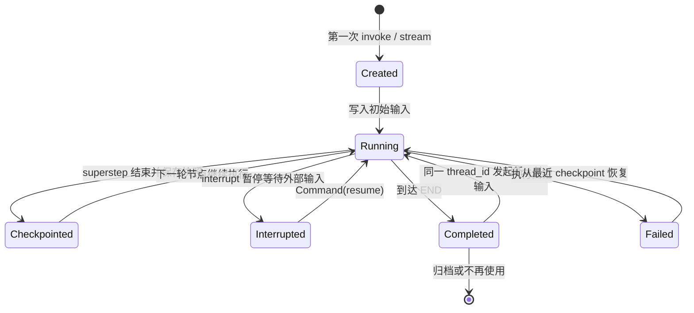
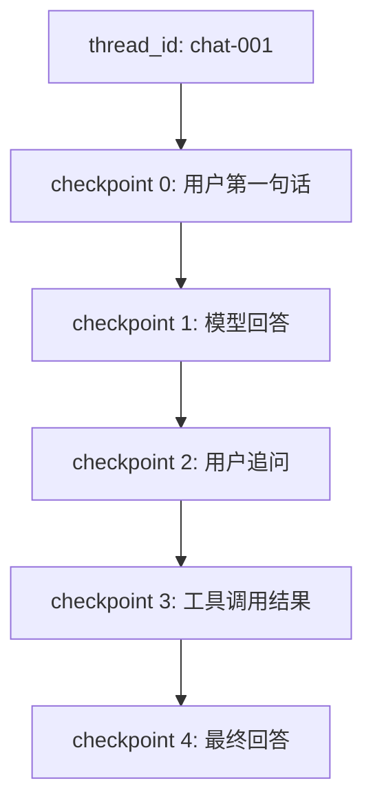
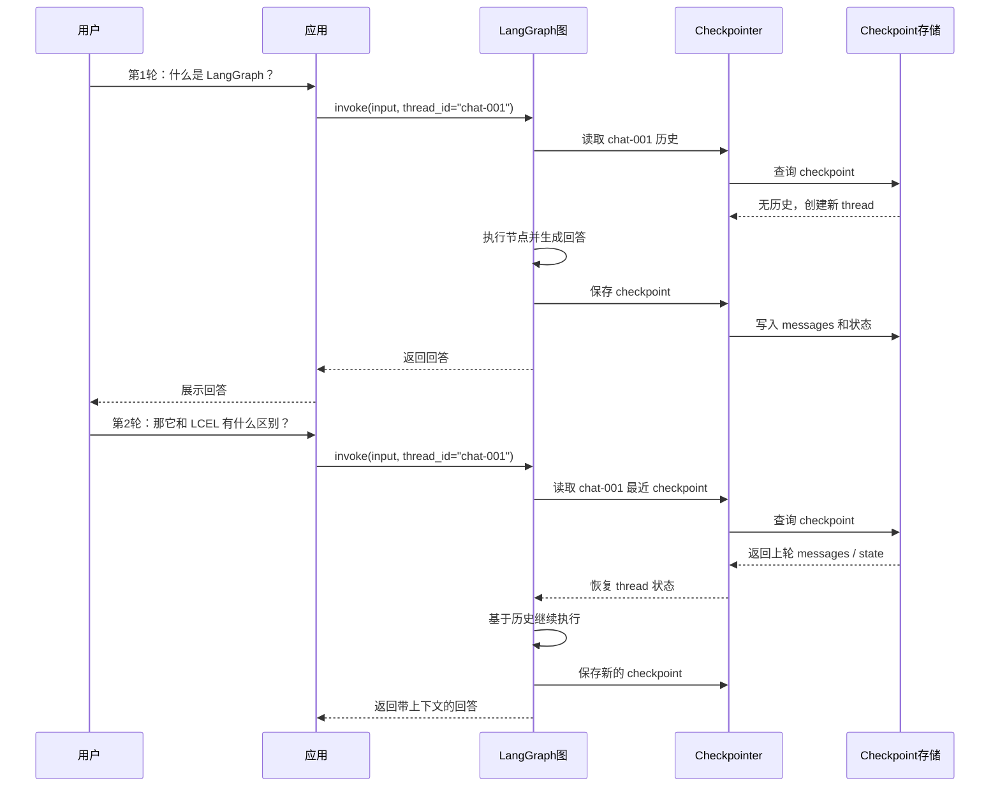
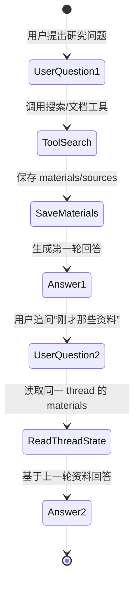
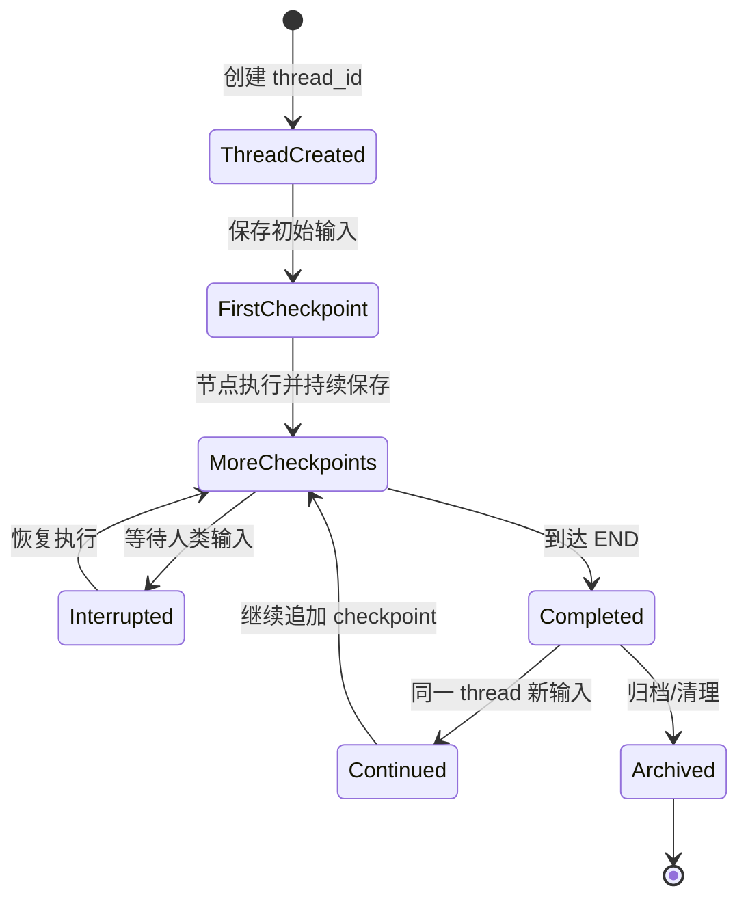

# 第19章-Thread与长期对话

## 19.1 从“同一个用户又问了一句”开始

前面三章已经把 LangGraph 运行时的关键底座拆开了。

第 16 章讲 Pregel：

```text
图如何一轮一轮推进？
```

第 17 章讲 Channel：

```text
状态如何被更新和合并？
```

第 18 章讲 Checkpoint：

```text
稳定状态如何保存成可恢复快照？
```

这一章继续回答一个更贴近聊天 Agent 的问题：

```text
用户下一次再发消息时，LangGraph 怎么知道这是同一段对话？
```

普通 LLM 调用通常是无状态的。

你第一次问：

```text
什么是 LangGraph？
```

模型回答完，这次调用就结束了。

你第二次问：

```text
那它和普通链式调用有什么区别？
```

如果没有上下文，模型并不知道“它”指的是 LangGraph。

所以聊天系统必须保存对话状态。

在 LangGraph 里，保存对话状态的关键不是简单地把 `messages` 放进某个全局变量，而是：

> 用同一个 `thread_id` 把多次图执行串到同一条 thread 上。

Thread 是第 18 章 checkpoint 的自然延伸。

Checkpoint 是一次快照。

Thread 是一串快照构成的可持续执行线。

## 19.2 本章目标

本章不把 Thread 写成抽象概念，而是从长期对话的生命周期讲起。

读完本章，读者应该能回答这些问题：

| 问题 | 本章要建立的理解 |
| --- | --- |
| Thread 是什么？ | 一条可持续任务或对话的执行线 |
| `thread_id` 有什么作用？ | 用来把多次调用绑定到同一条执行线 |
| Thread 和 Checkpoint 有什么关系？ | Thread 下面保存一串 checkpoint 历史 |
| Thread 和长期记忆有什么区别？ | Thread 保存一次对话/任务内的短期状态，Store 保存跨 thread 的长期信息 |
| 长期对话如何实现？ | 每轮对话都使用同一个 `thread_id`，让图从历史状态继续 |

本章最重要的心智模型是：

```text
Thread 不是一条消息。
Thread 是一条会持续增长的执行线。
```

一次聊天、一项研究任务、一轮人工审批流程，都可以是一条 thread。

## 19.3 Thread 的生命周期图

先用生命周期图看一条 thread 如何从创建到结束。



这张图里有几个细节。

第一，thread 不是只能运行一次。

一次图执行到 `END` 后，如果下一轮用户继续用同一个 `thread_id` 发消息，LangGraph 仍然可以沿着这条 thread 的历史继续。

第二，thread 可以暂停。

当图遇到 interrupt 时，thread 进入等待外部输入的状态。用户或系统恢复后，它又可以继续运行。

第三，thread 可以失败后恢复。

只要 checkpoint 还在，系统就可以从最近的稳定快照恢复。

所以 Thread 不是“聊天记录列表”的另一个名字。

它是对话、任务、状态快照和执行进度共同组成的一条生命周期。

## 19.4 为什么只保存 messages 还不够

很多聊天系统会这样保存历史：

```python
history = [
    {"role": "user", "content": "什么是 LangGraph？"},
    {"role": "assistant", "content": "LangGraph 是..."},
]
```

这对简单聊天够用。

但 LangGraph 的 thread 不只是消息历史。

一个复杂 Agent 的状态可能包括：

```text
messages：对话消息。
plan：当前计划。
materials：收集到的资料。
tool_results：工具结果。
approval_status：人工审批状态。
route：当前路由。
answer：最终回答。
```

如果只保存 messages，恢复后会丢掉很多执行现场。

例如研究助手执行到一半时，用户问：

```text
刚才你查到了哪些资料？
```

如果 thread 里只保存对话消息，Agent 可能只能根据聊天文本猜。

如果 thread 保存了完整 State，它就能直接看到：

```text
materials = [...]
tool_results = [...]
review_result = ...
```

所以 LangGraph 的 thread 更像：

```text
一条带状态的执行线。
```

而不只是：

```text
一串聊天消息。
```

## 19.5 Thread 和 Checkpoint 的关系

第 18 章说过，checkpoint 是执行快照。

现在把它放到 thread 里看。



这张图说明：

```text
Thread 是容器。
Checkpoint 是历史节点。
```

同一个 thread 下可以有多个 checkpoint。

每个 checkpoint 记录某个执行时刻。

Thread 把这些时刻串起来，让 LangGraph 知道：

```text
这是同一个任务的连续过程。
```

如果 `thread_id` 换了，历史也就断了。

例如：

| 第几轮 | `thread_id` | 结果 |
| --- | --- | --- |
| 第一轮 | `chat-001` | 保存 LangGraph 解释 |
| 第二轮 | `chat-001` | 能理解“它”指 LangGraph |
| 第二轮 | `chat-999` | 被当成新对话，历史不可见 |

这就是为什么稳定的 `thread_id` 是长期对话的基础。

## 19.6 一次长期对话的时序图

现在看一段两轮对话。



这张图里最关键的是第二轮。

第二轮输入本身只有：

```text
那它和 LCEL 有什么区别？
```

但因为 `thread_id="chat-001"`，图可以恢复上一轮 checkpoint 中的状态。

于是模型看到的不只是当前句子，还包括历史消息和必要的状态字段。

这就是长期对话的基础。

## 19.7 Thread 是短期记忆，不等于长期记忆库

这里有一个非常容易误解的点：

```text
Thread 可以支撑长期对话，但它不等于长期记忆库。
```

这句话听起来绕，但很重要。

Thread 的“长期”是相对于单次调用而言。

它让一次对话或任务可以跨多轮持续。

例如：

```text
用户今天在 chat-001 里连续问了 20 个问题。
```

这些问题属于同一条 thread。

但如果用户明天开启另一个任务：

```text
chat-002
```

`chat-001` 里的所有中间状态不一定应该自动进入 `chat-002`。

跨 thread 的长期记忆应该放到 Store 或外部数据库。

对比一下：

| 概念 | 作用范围 | 适合保存 |
| --- | --- | --- |
| Thread | 某一次对话或任务 | messages、当前计划、工具结果、中间状态 |
| Checkpoint | Thread 内某个时刻 | 某一步执行快照 |
| Store | 跨 thread、跨任务 | 用户偏好、长期事实、个人资料、可复用知识 |

例如：

```text
用户在 chat-001 里说：这篇报告请用技术书风格。
```

如果这个偏好只对当前报告有效，可以留在 thread state。

如果用户希望以后所有报告都这样写，就应该写入 Store。

这就是 Thread 和长期记忆的边界。

## 19.8 Thread 中应该保存什么

设计 thread state 时，不要把所有东西都塞进去。

可以分成三类。

第一类，当前对话必须恢复的内容。

```text
messages
current_question
answer
```

第二类，当前任务必须继续的中间状态。

```text
plan
materials
tool_results
approval_status
draft
review_result
```

第三类，运行时或调试需要的轻量信息。

```text
route
step_count
last_error
sources
```

不适合放进 thread state 的内容包括：

- 大文件全文。
- 数据库连接。
- 模型客户端。
- 无法序列化的对象。
- 可从外部系统重新读取的大型资料。
- 跨所有任务都需要记住的长期偏好。

可以用一句话判断：

> 如果没有这个字段，当前 thread 无法正确继续，就适合放进 thread state；如果它是跨任务复用的长期信息，更适合放到 Store。

## 19.9 Thread 生命周期内容表

下面用一张表把 thread 生命周期和保存内容放在一起。

| 阶段 | 触发事件 | 典型状态 | 需要保存什么 |
| --- | --- | --- | --- |
| 创建 | 第一次使用 `thread_id` | 初始输入 | 用户问题、初始 messages |
| 运行中 | 节点执行 | 中间状态变化 | plan、materials、tool_results |
| 快照保存 | superstep 结束 | 稳定状态 | StateSnapshot、下一步任务、metadata |
| 暂停 | interrupt | 等待外部输入 | 暂停点、审批内容、待恢复节点 |
| 恢复 | `Command(resume)` 或再次调用 | 历史状态被加载 | 上一次 checkpoint、用户新输入 |
| 完成 | 到达 `END` | 有最终回答 | answer、messages、必要结果 |
| 继续对话 | 同一 `thread_id` 新输入 | 旧状态 + 新输入 | 新消息、更新后的状态 |
| 归档 | 任务结束或过期 | 不再活跃 | 保留摘要或清理历史 |

这张表提醒我们：

```text
Thread 不是静态存储。
Thread 会随着一次次执行不断变化。
```

它的状态变化不是随意发生的，而是和 Pregel superstep、Channel 更新、Checkpoint 保存绑定在一起。

## 19.10 Thread 如何支撑多轮工具调用

长期对话不只是“记住用户说过什么”。

它还可以记住工具调用和中间结果。

例如用户第一轮问：

```text
帮我研究 LangGraph 的 checkpoint 机制。
```

Agent 做了三件事：

```text
生成计划。
搜索官方文档。
记录资料来源。
```

第二轮用户问：

```text
刚才那些资料里，哪一条最能说明 thread_id 的作用？
```

如果 thread state 保存了 `materials` 和 `sources`，第二轮就能直接引用上一轮工具结果。



这里的关键是：

```text
第二轮不是重新搜索一遍。
第二轮先读取同一 thread 里已经保存的中间状态。
```

这会让 Agent 更像一个持续工作的助手，而不是每次都失忆的问答接口。

## 19.11 Thread 和 UI 会话的关系

在应用层，用户看到的通常是一个聊天窗口、任务页面或研究报告页面。

在运行时层，它们往往对应一个 `thread_id`。

可以这样映射：

| 产品概念 | LangGraph 概念 | 示例 |
| --- | --- | --- |
| 一个聊天窗口 | 一个 thread | `chat-2026-07-001` |
| 一个研究任务 | 一个 thread | `research-langgraph-checkpoint` |
| 一个审批流程 | 一个 thread | `approval-pr-123` |
| 一次代码修复任务 | 一个 thread | `fix-bug-456` |

前端或后端要做的一件重要事情是：

```text
为同一个用户可见任务稳定保存 thread_id。
```

如果用户刷新页面，应用仍然要知道：

```text
这个页面对应哪个 thread_id？
```

否则就会出现：

```text
刷新后对话丢失。
审批后无法继续。
任务页面看到的是新 thread。
```

所以 thread_id 不只是 LangGraph 参数，也是应用状态设计的一部分。

## 19.12 Thread id 设计

`thread_id` 看起来只是一个字符串，但设计不好会带来很多问题。

常见做法有几类：

| 生成方式 | 示例 | 适合场景 |
| --- | --- | --- |
| UUID | `8f3a...` | 通用、安全、不暴露业务信息 |
| 业务 id | `research-123` | 任务和业务表强绑定 |
| 用户 id + 会话 id | `user-42/chat-7` | 多用户聊天系统 |
| 工单 id | `ticket-889` | 客服、审批、工单 Agent |

设计时要注意：

- 同一任务必须稳定使用同一个 `thread_id`。
- 不同任务不能误用同一个 `thread_id`。
- 多用户系统里不能让用户猜到别人的 thread。
- 如果 thread_id 包含业务 id，要考虑权限校验。
- 不要把敏感信息直接放进 thread_id。

一个比较稳的原则是：

```text
thread_id 应该能稳定定位任务，但不应该泄露敏感内容。
```

## 19.13 Thread 的结束、归档和清理

Thread 可以持续，但不代表它应该永远无限增长。

长期对话会带来几个问题：

- messages 越来越长。
- checkpoint 数量越来越多。
- materials 可能越来越大。
- 恢复和调试成本越来越高。
- 存储成本不断增加。

所以真实系统需要设计 thread 生命周期的后半段。

常见策略包括：

| 策略 | 含义 | 适合场景 |
| --- | --- | --- |
| 保留全部 checkpoint | 完整可回放 | 高审计要求任务 |
| 保留最近 N 个 checkpoint | 控制体积 | 普通聊天 |
| 生成摘要后归档 | 保留语义，减少细节 | 长对话助手 |
| 提取长期记忆到 Store | 让跨任务信息继续可用 | 用户偏好、稳定事实 |
| 删除过期 thread | 释放存储 | 临时任务、测试环境 |

归档时要分清两件事：

```text
Thread 历史是否还要回放？
其中有没有信息应该沉淀到长期记忆？
```

例如一条研究 thread 结束后，可以把最终报告和用户偏好保存到 Store，把大量中间工具结果清理或归档。

这样既不会无限膨胀，也不会丢掉真正有长期价值的信息。

## 19.14 Thread 和隐私边界

Thread 保存的是对话和任务状态，所以它天然可能包含敏感信息。

例如：

```text
用户问题。
上传资料摘要。
工具查询结果。
人工审批意见。
模型生成的中间计划。
```

因此，thread 设计要考虑隐私和权限。

至少要问：

| 问题 | 为什么重要 |
| --- | --- |
| 谁可以读取这个 thread？ | 防止用户访问别人的对话 |
| thread 保存多久？ | 避免长期保留不必要数据 |
| 是否包含敏感字段？ | 决定是否需要脱敏或加密 |
| 是否用于训练或分析？ | 需要用户授权和合规边界 |
| 是否能删除？ | 满足用户数据删除需求 |

技术上，`thread_id` 只是找到历史的 key。

但产品上，thread 是用户数据的一部分。

这意味着长期对话不只是运行时问题，也是数据治理问题。

## 19.15 常见错误与排查

### 错误一：每次请求都生成新的 `thread_id`

现象：

```text
Agent 每一轮都像第一次见到用户。
```

可能原因：

```text
前端或后端每次调用都创建新 thread_id。
```

解决方式：

```text
把 thread_id 和聊天窗口、任务记录或用户会话绑定，并在后续请求中复用。
```

### 错误二：多个任务误用同一个 `thread_id`

现象：

```text
两个不相关任务的 messages、materials 或 tool_results 混在一起。
```

可能原因：

```text
thread_id 只用了 user_id，没有区分具体任务。
```

解决方式：

```text
thread_id 应该对应具体对话或任务，而不是只对应用户。
```

### 错误三：把所有长期记忆都塞进 thread

现象：

```text
thread state 越来越大，不同任务之间难以复用偏好。
```

可能原因：

```text
没有区分 thread 短期状态和 Store 长期记忆。
```

解决方式：

```text
当前任务状态留在线程里，跨任务长期信息写入 Store。
```

### 错误四：用户刷新后丢失 thread

现象：

```text
页面刷新后，Agent 不记得之前的对话。
```

可能原因：

```text
thread_id 只存在前端内存里，没有保存到 URL、数据库或会话记录。
```

解决方式：

```text
在应用层持久化 thread_id，让页面重新加载时能找回对应 thread。
```

### 错误五：thread 无限增长

现象：

```text
对话越来越慢，checkpoint 存储越来越大。
```

可能原因：

```text
没有归档、摘要、清理或长期记忆提取策略。
```

解决方式：

```text
为 thread 设计生命周期：活跃、完成、归档、清理。
```

## 19.16 设计 Thread 时的检查清单

设计一个支持长期对话的 LangGraph 应用时，可以用这张表检查。

| 检查问题 | 判断目的 |
| --- | --- |
| 一个 thread 对应什么产品对象？ | 聊天窗口、研究任务、审批流程还是工单 |
| `thread_id` 在哪里生成？ | 前端、后端、数据库还是任务系统 |
| `thread_id` 如何持久化？ | 页面刷新或服务重启后是否还能找回 |
| 多用户如何隔离？ | 防止 thread 泄露或串线 |
| thread state 保存哪些字段？ | 控制可恢复性和状态体积 |
| 哪些信息应该进入 Store？ | 区分短期状态和长期记忆 |
| checkpoint 保留多久？ | 控制存储成本和审计能力 |
| 是否需要摘要归档？ | 处理长对话和大状态 |
| 是否支持删除 thread？ | 满足隐私和数据治理需求 |

这张表的核心不是技术参数，而是边界设计。

一个 thread 设计清楚的系统，用户会感觉：

```text
这个 Agent 真的在持续处理我的任务。
```

一个 thread 设计混乱的系统，用户会感觉：

```text
它有时记得，有时失忆，有时还把别的任务混进来。
```

## 19.17 和第 18 章的关系

第 18 章讲 checkpoint 时，我们重点看的是“一个快照”。

这一章讲 thread，重点看的是“快照如何组成一条线”。

可以用下面这张生命周期图总结：



这张图把第 18 章和第 19 章接起来：

```text
Checkpoint 是点。
Thread 是线。
Store 是跨线的长期记忆空间。
```

如果只理解 checkpoint，不理解 thread，就会知道怎么保存状态，但不知道怎么组织多轮对话。

如果只理解 thread，不理解 checkpoint，就会知道有一条执行线，但不知道这条线如何恢复和回放。

二者必须放在一起看。

## 19.18 小结：Thread 让 Agent 不再每轮失忆

本章讲了 Thread 与长期对话。

可以用一句话总结：

> Thread 是 LangGraph 中一条可持续的对话或任务执行线，它通过稳定的 `thread_id` 把多次调用和一串 checkpoint 连接起来。

它解决的问题是：

- 多轮对话如何保持上下文。
- 长任务如何沿着同一条线继续。
- interrupt 后如何回到原来的执行现场。
- 工具结果和中间状态如何在同一任务内复用。
- checkpoint 历史如何组织成可恢复、可回放的过程。

读者应该记住三个边界：

```text
Checkpoint：某个时刻的快照。
Thread：一串快照组成的执行线。
Store：跨 thread 的长期记忆空间。
```

下一章会讲 Interrupt 与 Human-in-the-loop。

如果说 Thread 让一条执行线可以持续，那么 Interrupt 解决的就是：

```text
这条执行线如何在中途暂停，等待人类输入后再继续？
```

