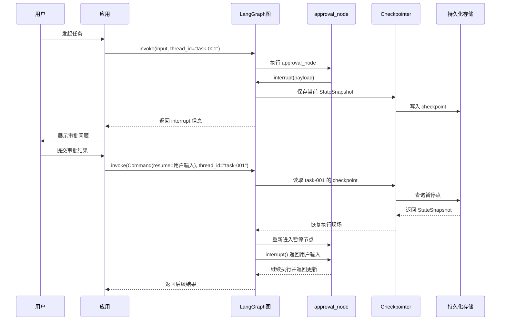
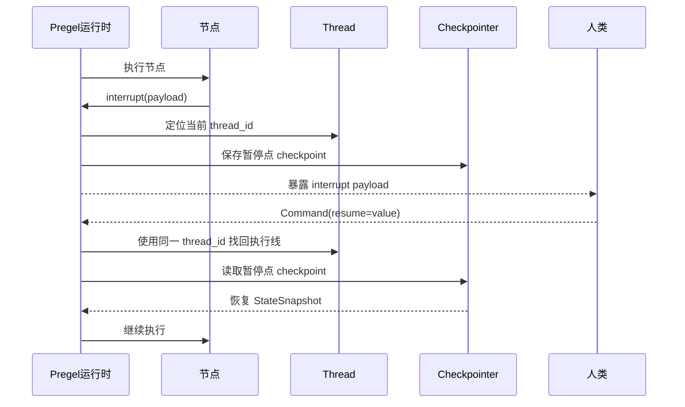
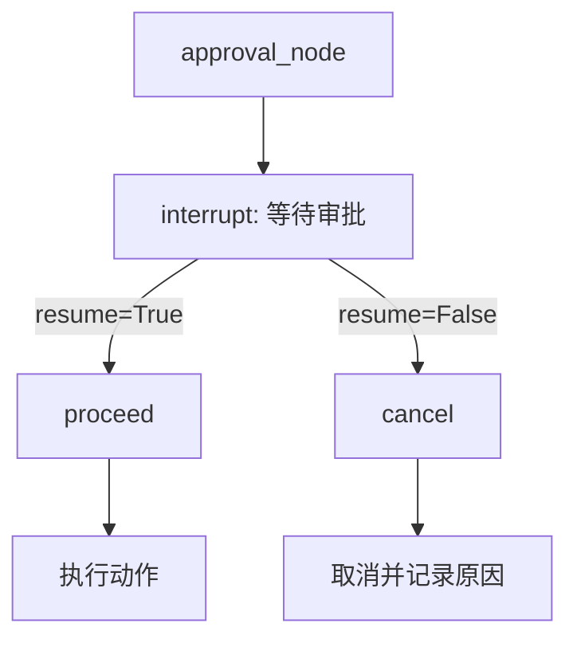
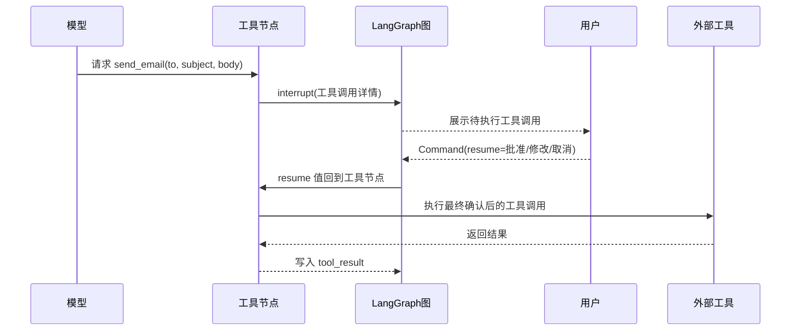
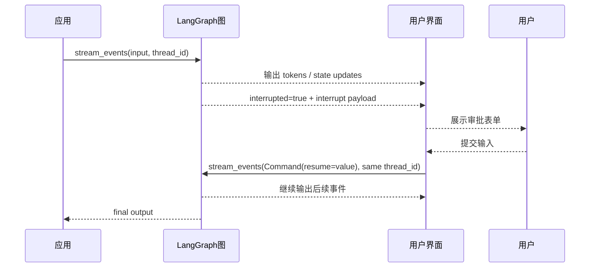
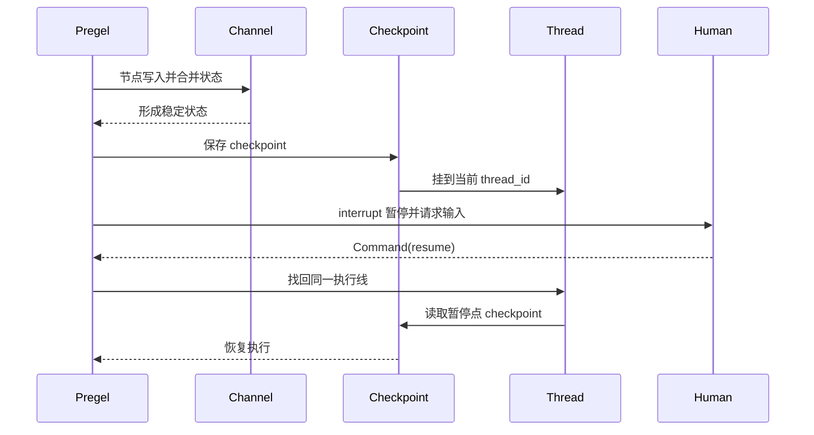

# 第20章-Interrupt与Human-in-the-loop

## 20.1 从“这一步必须让人确认”开始

前面几章已经把 LangGraph 的运行线索串起来了。

第 16 章讲 Pregel：

```text
图如何一轮一轮推进？
```

第 17 章讲 Channel：

```text
状态如何更新和合并？
```

第 18 章讲 Checkpoint：

```text
执行现场如何保存和恢复？
```

第 19 章讲 Thread：

```text
多轮对话和长任务如何沿着同一条执行线继续？
```

这一章讲 Interrupt。

它解决的是一个真实 Agent 必然会遇到的问题：

```text
当某一步不能由模型自己决定时，图如何暂停，等待人类输入后再继续？
```

例如：

- Agent 生成了一份研究计划，需要用户确认。
- Agent 准备发邮件，需要人工批准。
- Agent 想修改数据库，需要管理员确认。
- Agent 生成了代码补丁，需要开发者审查。
- Agent 调用高风险工具前，需要用户编辑参数。

这些场景不能简单写成：

```text
模型决定 -> 直接执行
```

因为模型可能判断错，工具可能有副作用，用户可能想修改计划。

所以真实 Agent 需要 Human-in-the-loop。

在 LangGraph 里，Interrupt 就是把“人类输入”放进图执行过程的机制。

## 20.2 本章目标

本章不把 Interrupt 写成一个暂停函数的 API 说明，而是解释它如何和 Thread、Checkpoint、Command 一起工作。

读完本章，读者应该能回答这些问题：

| 问题 | 本章要建立的理解 |
| --- | --- |
| Interrupt 是什么？ | 图执行到某个节点内部时，主动暂停并等待外部输入 |
| 它为什么依赖 checkpoint？ | 因为暂停时必须保存执行现场，恢复时才能继续 |
| 它为什么依赖 `thread_id`？ | 因为恢复时要找到同一条执行线 |
| `Command(resume=...)` 做什么？ | 把外部输入送回暂停点，成为 `interrupt()` 的返回值 |
| Human-in-the-loop 适合什么？ | 审批、编辑、确认、补充信息、工具调用前审查 |

本章最重要的心智模型是：

```text
Interrupt 不是异常。
Interrupt 是图执行过程中的正式暂停点。
```

人类不是 Agent 外面的临时干预者，而是 LangGraph 执行线里的一个参与者。

## 20.3 没有 Interrupt 时会怎样

假设我们做一个报告生成 Agent。

流程是：

```text
用户输入主题
-> Agent 生成研究计划
-> Agent 搜索资料
-> Agent 生成报告
```

这看起来没问题。

但如果研究计划不符合用户意图呢？

例如用户输入：

```text
研究 LangGraph 的 checkpoint 机制。
```

Agent 生成计划：

```text
1. 介绍 LangGraph 基本概念
2. 对比 LCEL
3. 简单说明 checkpoint
```

用户可能会说：

```text
不对，我重点想看 checkpoint、thread_id、恢复和 human-in-the-loop。
```

如果没有 Interrupt，Agent 可能已经继续搜索和写报告了。

这就产生几个问题：

- 用户没有机会审查计划。
- Agent 可能沿着错误方向浪费模型和工具成本。
- 错误越早发生，后面偏差越大。
- 如果工具有副作用，错误可能无法轻易撤回。

所以更好的流程是：

```text
生成计划
-> 暂停
-> 让用户确认或修改
-> 根据用户输入继续执行
```

这就是 Interrupt 的位置。

## 20.4 暂停 / 恢复时序图

先看 Interrupt 的完整过程。



这张图里有四个关键动作。

第一，节点调用 `interrupt(payload)`。

payload 会暴露给调用方，例如一个审批问题、待编辑内容或工具参数。

第二，运行时保存 checkpoint。

暂停不是把程序卡在内存里等人。它要保存现场，这样用户晚一点回来也能继续。

第三，应用把 interrupt 信息展示给用户。

这一步通常由前端、CLI、任务系统或审批系统完成。

第四，恢复时使用同一个 `thread_id` 和 `Command(resume=...)`。

resume 值会回到节点内部，成为 `interrupt()` 的返回值。

## 20.5 `interrupt()` 在节点里长什么样

一个最小审批节点可以这样写：

```python
from typing import TypedDict

from langgraph.types import interrupt


class ApprovalState(TypedDict):
    plan: str
    approved: bool


def approval_node(state: ApprovalState) -> dict:
    approved = interrupt(
        {
            "question": "是否批准这个计划？",
            "plan": state["plan"],
        }
    )

    return {"approved": approved}
```

第一次执行到这里时，`interrupt(...)` 不会马上得到 `approved`。

它会暂停图执行，把 payload 返回给外部。

外部看到的可以理解成：

```python
{
    "question": "是否批准这个计划？",
    "plan": "...",
}
```

当用户选择批准后，应用用 `Command(resume=True)` 恢复。

恢复后，节点内部这行代码：

```python
approved = interrupt(...)
```

会得到：

```python
True
```

然后节点继续执行：

```python
return {"approved": True}
```

这就是 Interrupt 最重要的感觉：

```text
从节点代码看，它像是在等待一个返回值。
从运行时看，它经历了暂停、保存、外部输入、恢复。
```

## 20.6 恢复为什么必须使用同一个 `thread_id`

第 19 章讲过，Thread 是一条持续执行线。

Interrupt 发生时，暂停点保存在这条 thread 的 checkpoint 历史里。

所以恢复时必须使用同一个 `thread_id`。

```python
config = {
    "configurable": {
        "thread_id": "approval-001"
    }
}
```

第一次运行：

```python
graph.invoke(input_data, config=config)
```

暂停后恢复：

```python
from langgraph.types import Command

graph.invoke(Command(resume=True), config=config)
```

如果恢复时换成：

```python
thread_id = "approval-999"
```

LangGraph 会认为这是另一条执行线。

它找不到原来的暂停点，也不知道要把 `resume=True` 交给哪个 `interrupt()`。

可以这样理解：

```text
thread_id 是暂停现场的地址。
Command(resume=...) 是送回现场的外部输入。
```

地址错了，输入就送不到原来的暂停点。

## 20.7 Interrupt、Checkpoint、Thread 的关系

把第 18、19、20 章放在一起看，可以得到这张图：



三者分工很清楚：

| 概念 | 在 Interrupt 中的作用 |
| --- | --- |
| Thread | 标识这是哪条执行线 |
| Checkpoint | 保存暂停时的执行现场 |
| Interrupt | 把暂停点暴露给外部并等待输入 |
| Command(resume) | 把外部输入送回暂停点 |

如果缺少任何一个，Human-in-the-loop 都会变得不可靠。

没有 thread，恢复时不知道找哪条执行线。

没有 checkpoint，恢复时没有执行现场。

没有 interrupt，图不能主动停下来等人。

没有 Command(resume)，外部输入无法回到节点内部。

## 20.8 审批模式：批准或拒绝

最常见的 Interrupt 场景是审批。

例如 Agent 准备执行一个有风险的动作：

```text
发送邮件。
修改数据库。
调用支付接口。
删除文件。
提交 Pull Request。
```

节点可以先暂停：

```python
from typing import Literal, TypedDict

from langgraph.types import Command, interrupt


class ApprovalState(TypedDict):
    action_details: str
    status: str


def approval_node(state: ApprovalState) -> Command[Literal["proceed", "cancel"]]:
    approved = interrupt(
        {
            "question": "是否执行这个动作？",
            "details": state["action_details"],
        }
    )

    if approved:
        return Command(goto="proceed")
    return Command(goto="cancel")
```

用户批准：

```python
graph.invoke(Command(resume=True), config=config)
```

用户拒绝：

```python
graph.invoke(Command(resume=False), config=config)
```

这样人类的选择会变成图上的控制流。



这里的关键是：

```text
审批不是图外面的 if/else。
审批结果进入图状态和控制流。
```

这让审批过程可以被 checkpoint、streaming 和日志系统观察。

## 20.9 编辑模式：让人类修改中间结果

Human-in-the-loop 不只是批准或拒绝。

很多时候，人类需要编辑 Agent 的中间结果。

例如：

```text
Agent 生成报告大纲。
用户修改大纲。
Agent 按修改后的大纲继续写报告。
```

节点可以这样写：

```python
def review_outline_node(state: ReportState) -> dict:
    edited_outline = interrupt(
        {
            "instruction": "请审查并修改报告大纲",
            "outline": state["outline"],
        }
    )

    return {"outline": edited_outline}
```

恢复时传入用户修改后的内容：

```python
graph.invoke(
    Command(resume="修改后的大纲内容"),
    config=config,
)
```

恢复后，`edited_outline` 就是用户修改后的大纲。

这比简单审批更强：

```text
审批模式：人类选择 yes / no。
编辑模式：人类直接改写后续执行所依赖的状态。
```

适合场景包括：

| 场景 | 人类输入 |
| --- | --- |
| 审查报告大纲 | 修改后的大纲 |
| 审查邮件内容 | 修改后的邮件正文 |
| 审查 SQL | 修改后的 SQL 或拒绝原因 |
| 审查工具参数 | 修改后的参数 |
| 审查 Agent 计划 | 新计划或补充要求 |

这种模式的价值在于：

```text
人类不是只按按钮，而是能修正 Agent 的中间状态。
```

## 20.10 工具调用前中断

Interrupt 也很适合放在工具调用前。

例如一个邮件工具：

```text
send_email(to, subject, body)
```

如果 Agent 直接调用，风险很大。

更好的方式是：

```text
模型提出工具调用
-> interrupt 展示工具参数
-> 用户批准或修改
-> 工具真正执行
```

时序图如下：



这个模式很重要。

因为真实 Agent 最危险的地方通常不是“回答错了”，而是：

```text
它真的执行了一个外部动作。
```

例如：

- 发出邮件。
- 写入数据库。
- 删除资源。
- 调用支付。
- 提交代码。
- 改变生产配置。

这些动作应该有明确的人类审批边界。

## 20.11 多个 Interrupt 怎么办

复杂图里可能出现多个暂停点。

一种情况是顺序暂停：

```text
先审批计划。
再审批工具调用。
最后审批报告发布。
```

这种情况比较简单，每次恢复一个暂停点。

另一种情况是并行暂停。

例如图同时分发了三个审批任务：

```text
财务审批。
法务审批。
技术审批。
```

它们可能在同一轮里都触发 interrupt。

这时外部需要知道：

```text
哪个回答对应哪个 interrupt？
```

可以用一张表理解：

| Interrupt | 暴露的问题 | 恢复值 |
| --- | --- | --- |
| `interrupt_a` | 财务是否批准？ | `true` |
| `interrupt_b` | 法务意见是什么？ | `"需要补充条款"` |
| `interrupt_c` | 技术是否可执行？ | `false` |

恢复时要把回答和对应的 interrupt 配对。

这体现了一个设计原则：

```text
只要可能出现多个暂停点，payload 就应该包含足够清楚的上下文。
```

不要只返回：

```text
是否批准？
```

而要返回：

```json
{
  "type": "legal_review",
  "question": "是否批准这份合同条款？",
  "document_id": "contract-123"
}
```

这样 UI 和恢复逻辑都更不容易混乱。

## 20.12 Interrupt payload 应该怎么设计

`interrupt()` 接收的 payload 会暴露给外部调用方。

它应该是 JSON 可序列化的。

更重要的是，它应该让人类知道自己在决定什么。

一个好的 payload 通常包含：

| 字段 | 作用 |
| --- | --- |
| `type` | 说明这是审批、编辑、确认还是补充信息 |
| `question` | 展示给用户的主问题 |
| `details` | 待审批的动作或内容 |
| `options` | 可选操作，如 approve、reject、edit |
| `risk` | 为什么这一步需要人工确认 |
| `state_summary` | 当前上下文摘要 |
| `expected_response` | 期望用户返回什么格式 |

例如：

```python
decision = interrupt(
    {
        "type": "tool_approval",
        "question": "是否发送这封邮件？",
        "details": {
            "to": "team@example.com",
            "subject": "LangGraph 报告",
            "body": "...",
        },
        "options": ["approve", "edit", "cancel"],
        "risk": "该动作会向外部收件人发送真实邮件。",
    }
)
```

这比只写：

```python
interrupt("Approve?")
```

更适合真实产品。

因为人类做判断时需要上下文。

## 20.13 `Command(resume=...)` 的值如何设计

Interrupt payload 是图问人的问题。

`Command(resume=...)` 是人给图的回答。

这个回答同样应该设计清楚。

简单审批可以是布尔值：

```python
Command(resume=True)
```

编辑内容可以是字符串：

```python
Command(resume="修改后的报告大纲")
```

复杂审批更适合对象：

```python
Command(
    resume={
        "action": "edit",
        "edited_body": "...",
        "comment": "请补充风险说明",
    }
)
```

节点里拿到这个值后，可以继续判断：

```python
decision = interrupt(payload)

if decision["action"] == "approve":
    return Command(goto="send")

if decision["action"] == "edit":
    return {
        "email_body": decision["edited_body"],
        "review_comment": decision["comment"],
    }

return Command(goto="cancel")
```

设计 resume 值时要避免两个极端。

不要太随意：

```text
"ok"
```

因为后续节点不知道具体含义。

也不要太复杂：

```text
把整个前端表单、无关 UI 状态、临时组件信息都塞进去。
```

只传图继续执行真正需要的信息。

## 20.14 Interrupt 前后的副作用

官方文档特别强调一个点：

```text
interrupt 前面的副作用必须是幂等的。
```

原因是恢复时，包含 `interrupt()` 的节点可能会从头重新执行。

看这个节点：

```python
def risky_node(state):
    send_email("user@example.com", "通知", "内容")
    approved = interrupt("邮件已准备好，是否继续？")
    return {"approved": approved}
```

这就有问题。

因为恢复时节点可能从头执行，`send_email(...)` 可能再次发送。

更好的写法是：

```python
def approval_node(state):
    approved = interrupt(
        {
            "question": "是否发送邮件？",
            "email": state["draft_email"],
        }
    )
    return {"approved": approved}


def send_email_node(state):
    if state["approved"]:
        send_email_once(state["draft_email"], idempotency_key=state["email_id"])
    return {"email_sent": True}
```

也就是说：

```text
interrupt 前准备信息。
interrupt 后根据审批结果执行副作用。
有副作用的动作要设计幂等 key。
```

这对生产系统非常重要。

否则恢复一次，就可能重复发邮件、重复扣款、重复写数据库。

## 20.15 Interrupt 与 Streaming 的关系

实际产品里，Interrupt 通常要和 Streaming 配合。

因为用户需要看到：

```text
Agent 执行到了哪里？
现在为什么停住了？
需要我做什么？
```

一个交互循环可以这样理解：

```text
开始 stream。
持续展示模型输出、节点进度、状态变化。
如果 stream 显示 interrupted，就读取 interrupt payload。
展示审批 UI。
用户提交结果。
用 Command(resume=...) 再次 stream。
直到没有 interrupt，得到最终输出。
```

时序图如下：



这能让 Human-in-the-loop 不只是后端能力，而是完整用户体验的一部分。

用户不会觉得系统卡住了。

他会看到：

```text
Agent 正在等待我确认。
```

## 20.16 Interrupt 和普通条件路由的区别

Interrupt 很容易和条件路由混淆。

条件路由是图自己根据状态决定下一步。

Interrupt 是图停下来等待外部输入。

对比如下：

| 机制 | 谁做决定 | 是否暂停 | 典型场景 |
| --- | --- | --- | --- |
| Conditional Edge | 图内函数或模型 | 不暂停 | 根据分类结果选择节点 |
| Command(goto=...) | 当前节点 | 不一定暂停 | 节点返回更新并决定跳转 |
| Interrupt | 外部人类或系统 | 暂停 | 审批、编辑、补充信息 |
| Command(resume=...) | 外部调用方 | 用于恢复 | 把人类输入送回暂停点 |

例如：

```text
问题是技术类还是产品类？
```

这适合条件路由。

但：

```text
是否真的向客户发送这封邮件？
```

这适合 Interrupt。

判断标准很简单：

> 如果下一步可以由图内状态和规则决定，用条件路由；如果必须等待外部判断，用 Interrupt。

## 20.17 Human-in-the-loop 的常见模式

Human-in-the-loop 不只有一种形态。

可以先掌握五种常见模式。

| 模式 | 人类做什么 | 适合场景 |
| --- | --- | --- |
| Approve / Reject | 批准或拒绝 | 高风险动作、发布、支付 |
| Review / Edit | 审查并修改 | 报告、邮件、计划、代码 |
| Select Option | 从候选项中选择 | 路线选择、模型选择、资料选择 |
| Provide Missing Info | 补充缺失信息 | 表单不完整、需求不清楚 |
| Validate Tool Call | 审查工具调用 | 数据库写入、外部 API、文件操作 |

这几种模式背后都是同一个机制：

```text
节点提出问题。
interrupt 暂停。
人类输入。
Command(resume) 恢复。
节点根据输入继续。
```

区别只在于 payload 和 resume 值的设计。

## 20.18 常见错误与排查

### 错误一：没有配置 checkpointer

现象：

```text
调用 interrupt 后无法可靠恢复。
```

可能原因：

```text
图没有配置 checkpointer，暂停现场没有持久保存。
```

解决方式：

```text
compile 图时传入 checkpointer；生产环境使用持久化 checkpointer。
```

### 错误二：恢复时换了 `thread_id`

现象：

```text
Command(resume=...) 没有回到原来的暂停点。
```

可能原因：

```text
恢复时使用了新的 thread_id。
```

解决方式：

```text
暂停和恢复必须使用同一个 thread_id。
```

### 错误三：把 `Command(update=...)` 当成恢复输入

现象：

```text
恢复逻辑混乱，interrupt 没有收到预期值。
```

可能原因：

```text
把节点返回用的 Command(update/goto) 和外部恢复用的 Command(resume) 混在一起。
```

解决方式：

```text
恢复 interrupt 时使用 Command(resume=...)。
普通新一轮对话输入使用普通 dict。
节点内部跳转才使用 Command(goto=...)。
```

### 错误四：在 interrupt 前执行不可重复副作用

现象：

```text
恢复后邮件发了两次，数据库写了两次。
```

可能原因：

```text
节点恢复时从头执行，interrupt 前的副作用被重复触发。
```

解决方式：

```text
把副作用放到 interrupt 之后，或给副作用设计幂等 key。
```

### 错误五：payload 太少，人类无法判断

现象：

```text
审批 UI 只显示“是否批准？”，用户不知道批准什么。
```

可能原因：

```text
interrupt payload 没有包含 action、details、risk、expected_response 等上下文。
```

解决方式：

```text
把人类做决定所需的最小上下文放进 payload。
```

### 错误六：payload 或 resume 值不可序列化

现象：

```text
interrupt 或恢复时报序列化相关错误。
```

可能原因：

```text
payload 里放了对象实例、函数、数据库连接或复杂不可序列化内容。
```

解决方式：

```text
payload 和 resume 值使用 JSON 可序列化结构。
```

## 20.19 设计 Interrupt 时的检查清单

设计一个 Interrupt 节点前，可以用这张表检查。

| 检查问题 | 判断目的 |
| --- | --- |
| 为什么必须暂停？ | 确认不是普通条件路由能解决 |
| 人类需要看到什么？ | 设计 payload 内容 |
| 人类需要返回什么？ | 设计 resume 值结构 |
| 是否配置了 checkpointer？ | 保证暂停现场可恢复 |
| `thread_id` 是否稳定？ | 保证恢复到同一执行线 |
| interrupt 前有没有副作用？ | 避免恢复时重复执行 |
| 副作用是否幂等？ | 保护外部系统 |
| 是否可能有多个 interrupt？ | 需要区分每个暂停点 |
| UI 如何展示暂停状态？ | 把 HITL 做成用户体验 |
| 是否需要记录审批日志？ | 满足审计和排查需求 |

这张表的核心是：

```text
Interrupt 不是让程序停住这么简单。
它是在图执行里设计一个可靠的人类决策边界。
```

## 20.20 和第 19 章的关系

第 19 章讲 Thread 时，我们说：

```text
Thread 是一条可持续的执行线。
```

这一章讲 Interrupt，可以补上一句：

```text
Interrupt 让这条执行线可以在关键点暂停，并在外部输入回来后继续。
```

把第五部分前五章放在一起：



这张图说明：

```text
Pregel 提供执行节奏。
Channel 提供状态合并。
Checkpoint 提供现场保存。
Thread 提供执行线身份。
Interrupt 提供人类介入点。
```

它们共同把 Agent 从“自动运行脚本”变成“可暂停、可恢复、可审查的执行系统”。

## 20.21 小结：把人类放进图执行过程

本章讲了 Interrupt 与 Human-in-the-loop。

可以用一句话总结：

> Interrupt 让 LangGraph 可以在节点内部暂停执行，保存现场，把问题交给外部人类或系统，并在收到 `Command(resume=...)` 后沿着同一 thread 继续。

读者应该记住五个关键点：

- `interrupt(payload)` 用来暂停并向外部暴露问题。
- 暂停依赖 checkpoint 保存执行现场。
- 恢复必须使用同一个 `thread_id`。
- `Command(resume=value)` 的 value 会成为 `interrupt()` 的返回值。
- interrupt 前的副作用必须谨慎，最好幂等或放到恢复之后。

Human-in-the-loop 的意义不是“模型不行，所以找人兜底”。

更准确地说：

```text
人类审批、编辑和判断本来就是很多真实流程的一部分。
LangGraph 用 Interrupt 把它们变成图执行过程中的正式节点。
```

下一章会讲 Streaming 与可观测性。

如果说 Interrupt 解决的是“人类如何介入执行过程”，那么 Streaming 解决的就是：

```text
人类和系统如何持续看见图正在发生什么？
```

