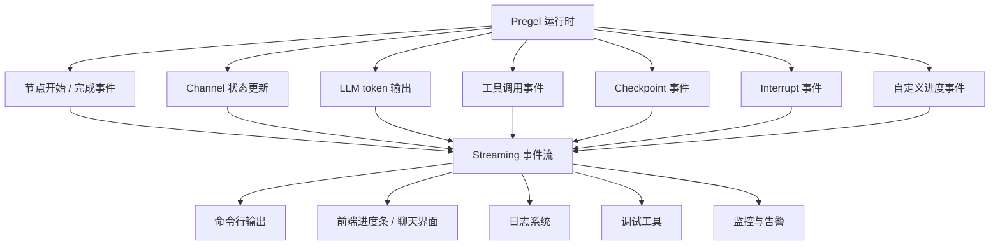
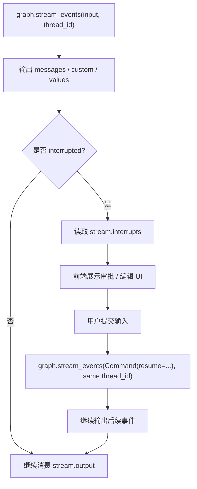
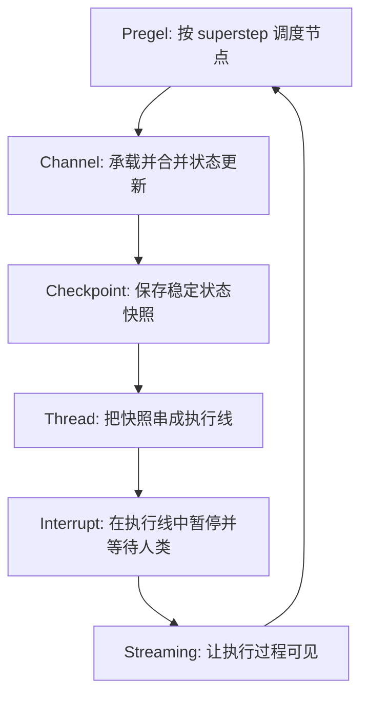

# 第21章-Streaming与可观测性

## 21.1 从“别让我等黑盒结果”开始

前面几章讲了 LangGraph 内部原理的几块关键拼图。

第 16 章讲 Pregel：

```text
图如何一轮一轮推进？
```

第 17 章讲 Channel：

```text
状态如何更新和合并？
```

第 18 章讲 Checkpoint：

```text
执行现场如何保存和恢复？
```

第 19 章讲 Thread：

```text
多轮对话和长任务如何沿着同一条执行线继续？
```

第 20 章讲 Interrupt：

```text
图如何暂停，等待人类输入后再继续？
```

这一章讲 Streaming 与可观测性。

它解决的是另一个真实 Agent 必须面对的问题：

```text
图正在运行时，人和系统如何知道里面发生了什么？
```

普通 LLM 调用可以只等最终结果。

但复杂 Agent 不行。

一个研究助手可能要经历：

```text
生成计划。
搜索资料。
调用工具。
审查结果。
再次搜索。
暂停等待用户确认。
生成报告。
```

如果用户只能看到一个转圈动画，他会很快失去信任。

开发者也很难调试：

```text
到底卡在哪个节点？
工具有没有调用？
状态有没有更新？
模型 token 有没有开始输出？
checkpoint 保存了吗？
是不是进入了 interrupt？
```

Streaming 的价值就是：

> 把图执行过程变成持续可见的事件流。

## 21.2 本章目标

本章不把 Streaming 写成“如何逐字输出模型回答”的小技巧，而是把它放回 LangGraph 运行系统里。

读完本章，读者应该能回答这些问题：

| 问题 | 本章要建立的理解 |
| --- | --- |
| Streaming 是什么？ | 图执行过程中持续输出事件、状态、token、checkpoint、任务信息 |
| 它和可观测性有什么关系？ | Streaming 让运行过程可见，日志、UI、调试和监控可以消费这些事件 |
| 常见 stream mode 有哪些？ | `updates`、`values`、`messages`、`custom`、`checkpoints`、`tasks`、`debug` |
| `updates` 和 `values` 有什么区别？ | 前者只看节点更新，后者看每步完整状态 |
| Streaming 如何配合 Interrupt？ | Stream 暴露暂停信息，UI 展示表单，恢复后继续 stream |

本章最重要的心智模型是：

```text
Streaming 不是最终答案的附属品。
Streaming 是 LangGraph 执行过程的观察窗口。
```

## 21.3 没有 Streaming 的问题

假设一个 Agent 正在执行研究任务。

用户输入：

```text
请研究 LangGraph 的 Streaming 与可观测性。
```

如果没有 Streaming，用户看到的是：

```text
正在生成...
```

等了 40 秒后，才看到最终报告。

这对短回答没问题。

但对长任务，用户会自然产生疑问：

```text
它真的在工作吗？
它有没有查资料？
它是不是卡住了？
它是不是已经调用了某个高风险工具？
它是否需要我确认？
```

开发者也会遇到类似问题：

```text
为什么最终答案没有引用工具结果？
为什么 messages 被覆盖了？
为什么 reviewer 一直判断资料不足？
为什么 interrupt 没有展示在前端？
为什么某个节点耗时很长？
```

如果只有最终结果，这些问题都很难回答。

有了 Streaming，执行过程可以变成：

```text
[planner] 生成研究计划
[researcher] 正在搜索官方文档
[tools] search_docs 开始
[tools] search_docs 完成
[state] materials 更新
[reviewer] 判断资料不足
[researcher] 再次搜索
[writer] 正在生成最终报告 token...
```

这就是可观测性的第一步：

```text
让不可见的执行过程变成可消费的事件流。
```

## 21.4 事件流图：从运行时到用户界面

先看一张整体图。



这张图说明：

```text
Streaming 不是只服务前端。
它同时服务用户体验、开发调试、生产监控和审计。
```

从运行时角度看，事件来自执行过程：

- Pregel 推进节点。
- Channel 合并状态。
- 模型输出 token。
- 工具开始或结束。
- Checkpoint 保存。
- Interrupt 暂停。

从应用角度看，这些事件可以被消费成不同形态：

- 聊天界面的逐字输出。
- 任务页面的进度状态。
- 日志里的节点执行轨迹。
- 调试面板里的状态快照。
- 监控系统里的耗时和错误。

这就是 Streaming 与可观测性的关系。

## 21.5 两层 Streaming：stream mode 与 event streaming

LangGraph 里可以从两个层次理解 Streaming。

第一层是底层 stream mode。

它直接暴露图运行时事件，例如：

```text
updates
values
messages
custom
checkpoints
tasks
debug
```

第二层是更上层的 event streaming。

它把底层事件整理成更适合应用消费的 typed projections，例如：

```text
stream.messages
stream.values
stream.output
stream.subgraphs
stream.interrupts
stream.extensions
```

可以用一张表区分：

| 层次 | 适合谁 | 你拿到什么 |
| --- | --- | --- |
| stream mode | 需要底层运行事件的开发者 | `updates`、`values`、`messages` 等 chunk |
| event streaming | 应用层代码和产品界面 | 消息、状态、子图、最终输出、中断等 typed projections |

本书这一章会以 stream mode 建立基础理解，同时说明 event streaming 更适合应用层使用。

读者可以先记住：

```text
stream mode 更接近运行时。
event streaming 更接近产品代码。
```

## 21.6 Stream 输出样例表

下面这张表是本章最实用的部分。

| Stream 类型 | 输出内容 | 适合用途 | 示例 |
| --- | --- | --- | --- |
| `updates` | 每个节点返回的状态更新 | 看节点写了什么 | `{"planner": {"plan": "..."}}` |
| `values` | 每步之后的完整状态 | 看整体 state 如何演化 | `{"topic": "...", "plan": "...", "materials": [...]}` |
| `messages` | LLM token 或消息片段 | 聊天逐字输出 | `("Lang", metadata)` |
| `custom` | 节点主动写出的自定义事件 | 进度条、业务状态 | `{"status": "正在搜索资料"}` |
| `checkpoints` | checkpoint 相关事件 | 调试恢复和时间旅行 | `{"checkpoint_id": "...", "step": 3}` |
| `tasks` | 任务开始、完成、错误 | 观察节点任务执行 | `{"task": "researcher", "status": "started"}` |
| `debug` | 尽可能多的调试信息 | 深度排查 | 节点、任务、checkpoint、metadata |
| event `messages` | typed message projection | 应用层消费模型输出 | `stream.messages` |
| event `interrupts` | 中断 payload | 展示 HITL 表单 | `stream.interrupts` |
| event `output` | 最终输出 | 任务结束后取结果 | `stream.output` |

不要一开始就全开。

更好的做法是按场景选择：

```text
做聊天界面：messages + updates。
做调试面板：updates + values + tasks。
做恢复排查：checkpoints + debug。
做产品进度：custom + messages + interrupts。
```

Streaming 的关键不是“输出越多越好”，而是：

```text
输出的信息要能回答当前观察问题。
```

## 21.7 `updates`：观察节点写了什么

`updates` 是最适合初学者理解图执行的 stream mode。

它展示每个节点在每一步返回了哪些状态更新。

例如：

```python
for chunk in graph.stream(
    {"topic": "LangGraph Streaming"},
    stream_mode="updates",
    version="v2",
):
    print(chunk)
```

可能输出：

```python
{"type": "updates", "ns": (), "data": {"planner": {"plan": "研究 Streaming 的计划"}}}
{"type": "updates", "ns": (), "data": {"researcher": {"materials": ["官方文档"]}}}
{"type": "updates", "ns": (), "data": {"writer": {"answer": "最终报告..."}}}
```

这和第 17 章 Channel 机制正好对应。

节点返回的是局部 update。

`updates` 让我们看见这些局部 update：

```text
哪个节点写了什么？
写入发生在哪一步？
状态字段有没有按预期更新？
```

如果最终答案没有引用资料，可以先看：

```text
researcher 有没有写 materials？
writer 之前 materials 是否已经存在？
```

这比直接猜模型为什么不引用资料可靠得多。

## 21.8 `values`：观察完整状态如何演化

`values` 和 `updates` 很像，但粒度不同。

`updates` 看的是：

```text
这个节点写了什么增量？
```

`values` 看的是：

```text
这一步之后，完整 state 变成了什么？
```

示例：

```python
for chunk in graph.stream(
    {"topic": "LangGraph Streaming"},
    stream_mode="values",
    version="v2",
):
    print(chunk["data"])
```

可能输出：

```python
{"topic": "LangGraph Streaming", "plan": "", "materials": [], "answer": ""}
{"topic": "LangGraph Streaming", "plan": "研究计划", "materials": [], "answer": ""}
{"topic": "LangGraph Streaming", "plan": "研究计划", "materials": ["资料1"], "answer": ""}
{"topic": "LangGraph Streaming", "plan": "研究计划", "materials": ["资料1"], "answer": "最终回答"}
```

它适合看：

- reducer 合并后状态是否正确。
- 多轮循环里状态是否累积。
- checkpoint 前状态是否稳定。
- 某个字段是否越来越大。

但 `values` 也有代价。

如果 state 很大，每一步都输出完整状态会很重。

所以生产环境里要谨慎使用，尤其是 state 包含大量 messages、materials 或文档片段时。

## 21.9 `messages`：观察模型 token 输出

`messages` 用来流式观察 LLM 输出。

这通常用于聊天界面：

```python
for chunk in graph.stream(
    inputs,
    stream_mode="messages",
    version="v2",
):
    if chunk["type"] == "messages":
        message_chunk, metadata = chunk["data"]
        print(message_chunk.content, end="", flush=True)
```

它的价值是：

```text
用户不必等完整回答生成完，能马上看到模型开始输出。
```

metadata 也很重要。

它可以告诉你 token 来自哪个节点、哪个模型调用、是否有标签等。

例如多模型 Agent 里可能有：

```text
route_model 节点：内部路由，不想展示给用户。
answer_model 节点：最终回答，需要展示。
```

这时可以按节点或标签过滤 token。

否则用户可能看到本不该展示的内部推理、草稿或结构化输出。

所以 `messages` 不只是逐字输出，还关系到：

```text
哪些模型输出应该被用户看见？
哪些模型输出只应该进入内部状态？
```

## 21.10 `custom`：输出业务进度

有些进度不是模型 token，也不是状态更新。

例如：

```text
正在搜索资料...
正在读取本地文件...
正在整理引用...
正在等待人工确认...
```

这些更适合用 `custom`。

节点里可以写出自定义事件：

```python
from langgraph.config import get_stream_writer


def researcher(state):
    writer = get_stream_writer()
    writer({"status": "正在搜索官方文档"})

    materials = search_docs(state["topic"])

    writer({"status": "搜索完成", "count": len(materials)})
    return {"materials": materials}
```

调用时选择 `custom`：

```python
for chunk in graph.stream(
    inputs,
    stream_mode=["updates", "custom"],
    version="v2",
):
    if chunk["type"] == "custom":
        print(chunk["data"]["status"])
```

`custom` 的价值是：

```text
让业务进度变成显式事件，而不是靠前端猜。
```

这对产品体验很重要。

用户看到“正在搜索官方文档”，会比看到一个普通 loading 更安心。

## 21.11 `checkpoints`、`tasks`、`debug`：观察运行系统

前面几个 mode 更偏产品体验。

下面几个更偏调试和运维。

| Mode | 主要用途 | 什么时候用 |
| --- | --- | --- |
| `checkpoints` | 观察 checkpoint 事件 | 排查恢复、时间旅行、分支执行 |
| `tasks` | 观察任务开始、完成、错误 | 排查节点任务、并行分发、失败原因 |
| `debug` | 输出尽可能多的调试信息 | 深度排查复杂图 |

例如一个任务失败了。

只看最终错误可能不够。

你需要知道：

```text
哪个任务启动了？
哪个任务失败了？
失败前有没有保存 checkpoint？
失败时 state 是什么？
是否还有 pending task？
```

这时 `tasks` 和 `debug` 会更有用。

但它们也可能非常吵。

所以不建议在普通用户界面里直接展示 `debug`。

更合理的做法是：

```text
用户界面用 messages / custom / interrupts。
开发调试用 updates / values / tasks / debug。
生产日志按需采样和脱敏。
```

## 21.12 Event streaming：更适合应用层的投影

底层 stream mode 很直接，但应用代码常常不想自己判断每个 chunk 的类型。

Event streaming 提供更上层的投影。

例如：

```python
stream = graph.stream_events(input_data, version="v3")

for message in stream.messages:
    for token in message.text:
        print(token, end="", flush=True)

final_state = stream.output
```

它把底层事件整理成更好消费的对象：

| Projection | 作用 |
| --- | --- |
| `stream.messages` | 模型消息和 token |
| `stream.values` | 状态快照 |
| `stream.output` | 最终输出 |
| `stream.subgraphs` | 子图执行 |
| `stream.interrupts` | Human-in-the-loop 中断信息 |
| `stream.interrupted` | 本次运行是否暂停 |
| `stream.extensions` | 自定义扩展投影 |

这对应用层很友好。

例如你写一个聊天 UI，不一定想处理所有底层事件。

你只想：

```text
把模型 token 放进聊天气泡。
如果 interrupted，就展示审批表单。
最后拿到 final_state。
```

Event streaming 就适合这种场景。

## 21.13 Streaming 如何配合 Interrupt

第 20 章讲过 Interrupt。

现在把它放进 Streaming 里看。



这个流程说明：

```text
Interrupt 负责暂停。
Streaming 负责让暂停状态被应用看见。
Thread 负责让恢复回到同一执行线。
Checkpoint 负责保存暂停现场。
```

如果没有 Streaming，Interrupt 仍然能工作，但用户体验会很差。

因为应用不知道：

```text
图是结束了，还是暂停了？
暂停问题是什么？
需要展示什么表单？
恢复后是否继续输出？
```

所以 Human-in-the-loop 的完整体验通常需要：

```text
Interrupt + Checkpoint + Thread + Streaming
```

## 21.14 Streaming 如何服务可观测性

可观测性不是“多打印几行日志”。

它至少包括三件事：

```text
我知道系统现在在做什么。
我知道系统刚才做过什么。
我能解释系统为什么得到这个结果。
```

Streaming 能提供第一层实时可见性。

结合 checkpoint、日志、trace 和 LangSmith 之类工具，可以进一步形成完整可观测性。

可以用一张表区分：

| 观察问题 | 适合的事件 |
| --- | --- |
| 当前执行到哪个节点？ | `tasks`、`updates`、lifecycle events |
| 当前 state 怎么变了？ | `updates`、`values` |
| 模型是否开始输出？ | `messages` |
| 工具是否调用成功？ | tools events、`custom`、`tasks` |
| 是否保存 checkpoint？ | `checkpoints` |
| 是否暂停等待人类？ | `interrupts`、lifecycle interrupted |
| 哪一步最慢？ | task start/finish、trace |
| 哪个节点写坏了状态？ | `updates`、`debug` |

当 Agent 出错时，不要只看最终回答。

更好的排查路径是：

```text
先看 tasks：节点是否按预期执行。
再看 updates：状态是否按预期写入。
再看 values：合并后 state 是否正确。
再看 messages：模型输出是否来自正确节点。
再看 checkpoints：失败前保存到了哪里。
```

这就是“事件驱动调试”。

## 21.15 Streaming 和日志的区别

Streaming 和日志很像，但不是一回事。

Streaming 面向运行中的消费者。

日志面向事后排查和审计。

| 维度 | Streaming | 日志 |
| --- | --- | --- |
| 时间 | 运行时实时消费 | 通常事后查询 |
| 消费者 | UI、CLI、实时监控、调试面板 | 开发者、运维、审计系统 |
| 内容 | token、状态更新、任务事件、中断 | 结构化记录、错误堆栈、指标 |
| 生命周期 | 一次 run 期间持续输出 | 长期存储 |
| 用户可见性 | 可直接驱动界面 | 通常不直接展示 |

真实系统里，两者应该配合。

例如：

```text
Streaming 驱动前端显示“正在调用搜索工具”。
日志系统记录 search_tool 的输入摘要、耗时、结果数量和错误。
```

不要用 Streaming 替代所有日志。

也不要只写日志却不给用户任何实时反馈。

## 21.16 Streaming 和隐私

Streaming 会把执行过程暴露出来，所以也有隐私风险。

尤其是这些内容：

- 用户原始输入。
- 工具返回结果。
- 内部检索资料。
- 模型中间输出。
- 自定义 progress payload。
- debug 模式中的状态细节。

设计 Streaming 时要问：

| 问题 | 为什么重要 |
| --- | --- |
| 哪些 token 可以展示给用户？ | 避免泄露内部提示或草稿 |
| 哪些状态字段可以进入前端？ | 避免泄露工具结果或隐私字段 |
| debug 是否只给开发环境？ | 避免生产暴露过多内部信息 |
| custom payload 是否脱敏？ | 防止业务进度事件携带敏感数据 |
| 多用户 stream 是否隔离？ | 防止串线 |

一个重要原则是：

```text
不是所有可观察信息都应该给所有人看。
```

开发者需要的信息、用户需要的信息、审计系统需要的信息，应该有不同过滤层。

## 21.17 Streaming 的性能取舍

Streaming 也不是没有代价。

输出越细，系统要处理的事件越多。

例如：

```text
messages：每个 token 都可能产生事件。
values：每一步输出完整 state。
debug：大量内部信息。
```

如果不加选择，可能带来：

- 前端渲染压力。
- 网络传输增加。
- 日志量膨胀。
- 敏感信息暴露面变大。
- 调试噪音掩盖真正问题。

可以按环境选择：

| 环境 | 推荐策略 |
| --- | --- |
| 本地调试 | 可以打开 `debug`、`values` |
| 开发联调 | `updates`、`messages`、`custom` |
| 生产用户界面 | `messages`、必要的 `custom`、interrupt 信息 |
| 生产后台监控 | 结构化 tasks、错误、耗时、checkpoint 摘要 |
| 敏感业务 | 最小化输出并脱敏 |

Streaming 的目标不是把所有东西都倒出来。

而是让正确的人，在正确的时间，看见正确的信息。

## 21.18 常见错误与排查

### 错误一：只 stream 最终 token，看不到图状态

现象：

```text
用户能看到模型逐字输出，但开发者不知道节点和状态发生了什么。
```

可能原因：

```text
只使用了 messages，没有使用 updates 或 values。
```

解决方式：

```text
调试时加入 updates；必要时短期开启 values。
```

### 错误二：生产环境打开 debug

现象：

```text
日志和网络事件暴涨，还可能暴露内部状态。
```

可能原因：

```text
把本地调试配置带到了生产。
```

解决方式：

```text
生产环境按需开启有限 mode，并做脱敏和权限控制。
```

### 错误三：前端不知道如何处理 interrupt

现象：

```text
图暂停了，但界面还在一直 loading。
```

可能原因：

```text
前端只处理 messages，没有处理 interrupts 或 interrupted 状态。
```

解决方式：

```text
把 interrupted 当成正式 UI 状态：展示表单，提交后 Command(resume)。
```

### 错误四：custom 事件格式不稳定

现象：

```text
前端有时收到 status，有时收到 message，有时收到文本字符串。
```

可能原因：

```text
不同节点随意 writer(...)，没有统一 payload schema。
```

解决方式：

```text
为 custom event 设计稳定字段，如 type、status、message、progress、node。
```

### 错误五：values 输出太大

现象：

```text
stream 很慢，前端卡顿，网络传输大。
```

可能原因：

```text
每一步都输出完整 state，而 state 里有大量 messages 或 materials。
```

解决方式：

```text
生产界面优先用 updates/custom；values 主要用于调试。
```

### 错误六：模型内部输出被展示给用户

现象：

```text
用户看到了内部分类、草稿、结构化 JSON 或不该展示的模型输出。
```

可能原因：

```text
messages 没有按 node、tag 或用途过滤。
```

解决方式：

```text
给内部模型调用加标签或配置过滤，只展示面向用户的节点输出。
```

## 21.19 设计 Streaming 时的检查清单

给一个 LangGraph 应用设计 Streaming 前，可以问这些问题：

| 检查问题 | 判断目的 |
| --- | --- |
| 用户需要实时看到什么？ | 决定 messages/custom/interrupts |
| 开发者需要调试什么？ | 决定 updates/values/tasks/debug |
| 哪些事件应该进入日志？ | 支撑事后排查 |
| 哪些字段需要脱敏？ | 避免隐私泄露 |
| 是否有 Human-in-the-loop？ | 处理 interrupted 和 resume |
| 是否有工具调用？ | 展示工具开始、完成、错误 |
| 是否有并行或子图？ | 需要 namespace/subgraphs |
| state 是否很大？ | 避免滥用 values |
| custom payload 是否稳定？ | 方便前端和监控消费 |
| 生产和调试配置是否分离？ | 避免 debug 信息外泄 |

这张表的核心是：

```text
Streaming 是产品体验和工程可观测性的接口设计。
```

不是随手 `print`，也不是把所有事件都扔给前端。

## 21.20 第五部分总览：运行系统如何闭合

到这里，第五部分的六章已经串起来了。



这不是六个孤立功能。

它们是一套运行系统：

| 机制 | 回答的问题 |
| --- | --- |
| Pregel | 图如何推进？ |
| Channel | 状态如何更新？ |
| Checkpoint | 现场如何保存？ |
| Thread | 多轮执行如何串起来？ |
| Interrupt | 人类如何介入？ |
| Streaming | 过程如何被看见？ |

理解这套系统后，LangGraph 就不再只是：

```text
把几个函数连成图。
```

而是：

```text
一个围绕状态、执行、恢复、人类介入和可观测性设计的 Agent 运行时。
```

这也是第五部分想帮助读者真正建立的心智模型。

## 21.21 小结：让 Agent 的运行过程被看见

本章讲了 Streaming 与可观测性。

可以用一句话总结：

> Streaming 让 LangGraph 的执行过程以事件流形式暴露出来，使用户界面、调试工具、日志系统和监控系统能够持续观察图正在发生什么。

读者应该记住四个重点：

- `updates` 看节点写入了什么。
- `values` 看完整 state 如何演化。
- `messages` 看模型 token 输出。
- `custom`、`tasks`、`checkpoints`、`debug` 用于进度、任务、恢复和深度排查。

更上层的 event streaming 则把底层事件整理成适合应用消费的投影：

```text
stream.messages
stream.values
stream.output
stream.interrupts
stream.subgraphs
```

Streaming 的价值不只是“显示得更快”。

它真正解决的是信任和调试问题：

```text
用户知道 Agent 正在做什么。
开发者知道图为什么这样运行。
系统知道哪里慢、哪里错、哪里需要人类介入。
```

到这里，第五部分完成。

下一部分会回到工程化实践：当我们理解了 LangGraph 的运行时、状态更新、持久化、thread、interrupt 和 streaming 之后，就可以进一步讨论如何把这些能力组织成一个真实项目结构。

