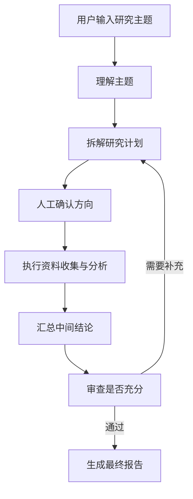
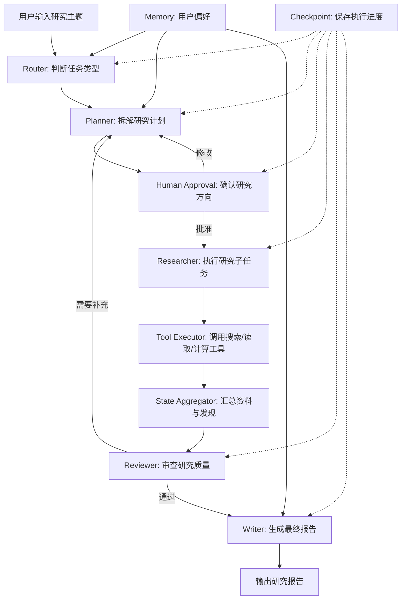

# 第33章-案例需求：智能研究助理 Agent

## 33.1 从一个看起来简单的研究任务开始

前面七个部分，我们已经分别学过 LangGraph 的核心概念、可运行程序、编程模型、模型接入、内部机制、工程化设计和进阶 Agent 架构。

这些内容如果分开看，每一部分都不算太难。

`State` 负责保存状态。

`Node` 负责执行一步逻辑。

`Edge` 负责控制流程。

`Checkpoint` 负责保存执行进度。

`Router` 负责分流。

`Planner` 负责计划。

`RAG` 负责引入资料。

`Reflection` 负责质量反馈。

但真实项目的难点从来不是“知道这些概念分别是什么”，而是：

> 当一个业务需求真的摆在面前时，应该怎样把这些能力组合成一个可维护、可扩展、可恢复的 Agent 系统？

这一部分会用一个完整复杂案例回答这个问题。

我们要构建的最终项目是：

```text
智能研究助理 Agent
```

它的输入很简单。

用户只需要给出一个研究主题：

```text
请研究 LangGraph 在复杂 Agent 应用中的架构价值，并生成一份结构化研究报告。
```

如果只看这句话，任务似乎并不复杂。

普通 LLM 也可以直接回答：

```text
LangGraph 是一个用于构建有状态 Agent 的框架，它支持图结构、状态管理、持久化、工具调用……
```

这样的回答可能看起来还不错。

但它不是一个真正的研究助理。

真正的研究助理不能只“凭感觉写一篇文章”。它至少要做这些事：

```text
理解用户真正想研究什么。
把主题拆成几个可以执行的研究问题。
判断哪些问题需要检索资料。
调用工具收集资料。
整理资料，去掉重复和低价值内容。
把资料汇总成中间结论。
检查结论是否支撑最终报告。
必要时回到前面补充研究。
在关键方向上请求用户确认。
最后生成结构清晰、依据明确的研究报告。
```

这就不再是一次模型调用。

它是一个长任务。

长任务意味着流程会分支、会循环、会失败、会暂停、会恢复，也会产生大量中间状态。

所以第八部分的核心不是“写一个更长的示例”，而是：

> 用一个智能研究助理案例，把前面所有 LangGraph 能力组合成一个真实 Agent 项目的架构训练。

## 33.2 本章要解决的问题

本章采用“需求反推架构法”。

也就是说，我们不会一上来就画完整系统架构图。

因为如果直接看到这些模块：

```text
Router
Planner
Researcher
Tool Executor
Reviewer
Writer
Memory
Checkpoint
Human Approval
```

读者很容易产生一个误解：

```text
复杂 Agent 就是把很多模块堆在一起。
```

但好的架构不是堆出来的。

好的架构是被真实问题逼出来的。

所以本章要先回答：

> 真实研究助理到底复杂在哪里？

我们会从一个普通 Agent 的失败开始，一步步看到为什么需要规划、检索、工具、审查、人工确认、持久化和模块边界。

到本章结束时，读者应该先获得一个判断：

> 智能研究助理不是“一个会写报告的聊天机器人”，而是一个围绕研究任务生命周期组织起来的 Agent 系统。

第 34 章再在这个判断之上，正式进入系统架构设计。

## 33.3 普通 Agent 为什么不够

先想象一个最简单的实现。

我们只写一个节点：

```text
用户主题 -> LLM -> 研究报告
```

用图表示：


这个方案很容易实现。

甚至几行代码就能跑起来。

但只要任务稍微真实一点，它就会暴露问题。

比如用户输入：

```text
研究 LangGraph、CrewAI、AutoGen 在企业级 Agent 应用中的架构差异，
重点比较状态管理、工具调用、可恢复性、人机协作和生产部署能力。
```

直接生成报告会遇到几个问题。

第一，主题太大。

模型可能会写出一篇结构完整但很泛的文章，却没有真正拆开研究问题。

第二，资料不足。

如果没有检索或外部资料，模型只能依赖已有知识，很容易遗漏新版本变化、官方能力边界和真实工程约束。

第三，过程不可见。

用户不知道 Agent 是如何得出结论的，也不知道它有没有查资料、查了哪些资料、哪些资料被采用。

第四，质量不可控。

报告看起来流畅，不代表论证充分。模型可能没有引用依据，也可能比较维度混乱。

第五，失败后无法恢复。

如果任务执行到一半出错，普通调用只能重新开始。

第六，用户无法中途纠偏。

真实研究中，用户可能在看完研究计划后说：

```text
不要比较 CrewAI，改成重点研究 LangGraph 的可恢复执行和人机协作。
```

如果系统没有人工确认和可恢复执行，这种纠偏很难自然表达。

所以，普通 Agent 的问题不是“不够聪明”，而是：

> 它没有把研究过程建模成一个可观察、可控制、可恢复的任务生命周期。

LangGraph 的价值就在这里。

它让我们可以把研究任务拆成多个节点，把中间结果放进 State，把流程分支写成 Edge，把长任务保存到 Checkpoint，把人工确认变成正式流程。

## 33.4 真实研究助理的任务生命周期

一个真正有用的研究助理，至少要经历七个阶段。

```text
理解主题
-> 拆解计划
-> 用户确认
-> 执行研究
-> 汇总资料
-> 审查质量
-> 生成报告
```

用图表示：



这张图里最重要的是两个地方。

第一个是 `人工确认方向`。

研究任务很容易从一开始就走偏。

如果用户想研究“架构能力”，Agent 却把重点写成“API 使用教程”，后面执行得再认真也没有意义。

所以计划完成后应该暂停，让用户确认研究方向。

第二个是 `审查是否充分`。

研究不是线性流程。

有时资料不够，需要补充检索。

有时结论不清楚，需要重新拆解问题。

有时报告结构不合理，需要回到计划阶段调整。

这意味着智能研究助理天然需要循环。

而循环正是 LangGraph 比普通链式调用更适合 Agent 的地方。

## 33.5 从需求反推出模块

现在我们不从技术名词出发，而从需求出发。

### 33.5.1 用户主题可能有不同类型

用户输入的研究主题不一定都是同一种任务。

有些是概念研究：

```text
研究 LangGraph 的核心架构思想。
```

有些是对比研究：

```text
比较 LangGraph、CrewAI 和 AutoGen 的差异。
```

有些是方案设计：

```text
为一个企业知识库 Agent 设计技术架构。
```

有些是资料总结：

```text
总结最近关于 Agentic Workflow 的关键资料。
```

不同任务适合不同路径。

所以我们需要：

```text
Router
```

Router 不负责完成研究。

它只负责判断任务类型，决定后续采用哪种研究策略。

### 33.5.2 研究主题太大，需要拆成计划

用户通常不会直接给出清晰的执行步骤。

他只会说：

```text
研究复杂 Agent 应用的架构设计。
```

这个主题需要拆成更小的问题：

```text
复杂 Agent 的复杂性来自哪里？
状态应该如何设计？
模块应该如何划分？
模型与工具如何分工？
如何支持持久化和恢复？
如何从示例走向生产？
```

所以我们需要：

```text
Planner
```

Planner 负责把一个大主题拆成可执行的研究计划。

它输出的不是最终答案，而是后续 Worker 可以执行的任务清单。

### 33.5.3 计划可能不符合用户真实意图

研究计划生成以后，不能立刻执行。

因为计划一旦错了，后面所有节点都会沿着错误方向前进。

例如用户想研究“架构能力”，Planner 却生成了这样的计划：

```text
1. 介绍 LangGraph 安装方式
2. 编写第一个 Hello World
3. 解释常见 API 参数
```

这个计划不是完全错误，但它偏离了用户目标。

所以我们需要：

```text
Human Approval
```

人工确认不是异常流程。

它应该成为 Agent 图中的正式节点。

在 LangGraph 里，这通常可以通过 `interrupt` 和 checkpoint 实现。

### 33.5.4 研究需要资料，不只是模型记忆

研究助理不能只靠模型内部知识。

它需要读取资料、检索文档、调用搜索工具、整理来源。

所以我们需要：

```text
Researcher
Tool Executor
```

Researcher 负责决定要查什么、如何组织资料。

Tool Executor 负责实际调用工具。

这两个模块应该分开。

因为“决定查什么”和“执行工具调用”是两种职责。

如果混在一个节点里，后面很难做权限控制、超时处理、错误重试和工具替换。

### 33.5.5 多个研究结果需要合并

如果研究计划有多个子任务，每个子任务都会产生资料和结论。

例如：

```text
子任务 A：研究状态管理。
子任务 B：研究工具调用。
子任务 C：研究 checkpoint。
子任务 D：研究 human-in-the-loop。
```

这些结果不能简单拼接。

它们需要去重、归类、提炼和合并。

所以我们需要：

```text
State Aggregator
```

它负责把分散的研究结果整理成中间结论，为后续审查和写作提供稳定输入。

### 33.5.6 研究结果需要质量审查

资料多，不代表结论好。

研究报告常见的问题包括：

```text
结论没有证据支持。
资料和主题关系弱。
比较维度不一致。
遗漏关键限制。
只总结现象，没有架构判断。
```

所以我们需要：

```text
Reviewer
```

Reviewer 不是简单润色。

它是质量闸门。

它要判断当前研究是否足够支撑最终报告。

如果不够，就让流程回到 Planner 或 Researcher 继续补充。

### 33.5.7 最终报告需要稳定结构

研究助理最后要输出报告。

报告不是把所有资料粘在一起。

它应该有结构：

```text
研究问题
核心结论
背景说明
分维度分析
架构判断
实践建议
风险与限制
下一步方向
```

所以我们需要：

```text
Writer
```

Writer 负责把已经审查通过的中间结论组织成最终报告。

它不应该重新发明结论。

它应该基于 State 中已有的计划、资料、审查意见和中间结论写作。

### 33.5.8 长任务需要保存和恢复

研究任务可能运行很久。

中间可能出现这些情况：

```text
工具调用失败。
网络中断。
用户关闭程序。
模型输出格式错误。
用户暂停任务，稍后继续。
人工确认等待很久。
```

所以我们需要：

```text
Checkpoint
Thread
```

Checkpoint 保存执行过程。

Thread 标识一次研究任务。

有了它们，研究助理才能从“临时脚本”变成“可恢复任务系统”。

### 33.5.9 研究偏好需要积累

同一个用户可能有固定偏好。

例如：

```text
喜欢先给结论再展开。
希望报告偏工程实践，不要太学术。
更关注可扩展性和生产部署。
要求所有判断都给出依据。
```

这些偏好不应该每次都重新输入。

所以我们需要：

```text
Memory
```

Memory 保存跨任务的长期信息。

Checkpoint 保存“这一次任务执行到哪里”。

Memory 保存“这个用户长期偏好什么”。

这两个概念不能混在一起。

## 33.6 最终案例的能力边界

为了让第八部分足够完整，又不失控，我们需要明确这个案例做什么、不做什么。

本案例要实现的是一个教学型复杂 Agent。

它会覆盖这些能力：

| 能力 | 本案例中的作用 |
| --- | --- |
| Router | 判断研究任务类型，选择研究策略 |
| Planner | 把研究主题拆成可执行计划 |
| Human Approval | 在计划阶段暂停，等待用户确认 |
| Researcher | 根据计划执行资料收集与分析 |
| Tool Executor | 统一管理工具调用 |
| State Aggregator | 合并多个研究结果 |
| Reviewer | 检查研究质量，决定是否补充 |
| Writer | 生成最终研究报告 |
| Checkpoint | 保存长任务进度，支持恢复 |
| Memory | 保存用户偏好和长期上下文 |

但它暂时不追求这些能力：

| 暂不展开 | 原因 |
| --- | --- |
| 多租户权限系统 | 属于产品级后台系统，不是本书重点 |
| 分布式任务队列 | 第 39 章讨论生产演进，不在案例主体里完整实现 |
| 真正的大规模网页爬取 | 工具调用会保留接口和模拟实现，避免把重点变成爬虫工程 |
| 完整前端界面 | 本书重点是 LangGraph 架构与后端 Agent 流程 |
| 企业级监控平台 | 会讲日志、事件和 tracing 思路，但不搭完整平台 |

这个边界很重要。

复杂案例不是越大越好。

如果把所有生产系统能力都塞进来，读者会被工程细节淹没，反而看不清 LangGraph 架构主线。

本案例的目标是：

> 用尽可能小的项目，展示真实复杂 Agent 应该如何拆模块、设计状态、组织流程、处理长任务和面向未来扩展。

## 33.7 需求对应的状态主线

复杂 Agent 最容易失控的地方是 State。

如果状态字段随手添加，后面每个节点都会越来越难理解。

所以第八部分会围绕一条状态主线展开。

智能研究助理的核心 State 可以先理解为：

```text
用户输入的主题
-> 任务类型
-> 研究计划
-> 人工确认结果
-> 子任务列表
-> 工具调用结果
-> 研究资料
-> 中间结论
-> 审查意见
-> 最终报告
```

用表格表示：

| 状态字段 | 作用 |
| --- | --- |
| `topic` | 用户输入的研究主题 |
| `task_type` | Router 判断出的任务类型 |
| `research_plan` | Planner 生成的研究计划 |
| `approval_status` | 用户是否批准计划 |
| `subtasks` | 可执行研究子任务 |
| `tool_results` | 工具调用返回的原始结果 |
| `sources` | 整理后的资料来源 |
| `findings` | 每个子任务得到的研究发现 |
| `synthesis` | 聚合后的中间结论 |
| `review_feedback` | Reviewer 给出的审查意见 |
| `final_report` | Writer 生成的最终报告 |
| `execution_log` | 节点执行轨迹 |

后面写代码时，这些字段不会一次性全部塞进一个混乱对象里。

我们会继续沿用第六部分的工程化思路，把状态拆成输入状态、运行状态、输出状态和持久化状态。

但在需求阶段，先记住这条主线就够了：

> 研究助理的复杂性，本质上是研究状态不断演化的复杂性。

## 33.8 需求对应的模块关系

从前面的需求推导，我们可以得到第八部分的第一版模块关系。



这张图不是最终架构图。

第 34 章会进一步细化。

但它已经表达了一个关键判断：

> 智能研究助理不是一条直线，而是一个带确认、循环、审查和恢复能力的研究流程。

其中每个模块都来自真实需求。

Router 来自任务类型差异。

Planner 来自主题过大。

Human Approval 来自方向可能跑偏。

Researcher 和 Tool Executor 来自资料需求。

State Aggregator 来自多结果合并。

Reviewer 来自质量控制。

Writer 来自报告结构化输出。

Checkpoint 来自长任务恢复。

Memory 来自用户偏好积累。

这就是需求反推架构法。

## 33.9 一个研究任务的完整执行想象

为了让这个案例更具体，我们先看一次理想执行过程。

用户输入：

```text
研究 LangGraph 如何帮助开发者构建复杂 Agent 应用，
重点关注模块化、可扩展性、持久化、人机协作和生产化。
```

Router 判断：

```text
任务类型：architecture_research
原因：用户关注复杂 Agent 的架构设计与工程实践。
```

Planner 生成计划：

```text
1. 分析复杂 Agent 应用的主要复杂度来源。
2. 研究 LangGraph 的状态图模型如何支持模块化。
3. 研究 checkpoint、thread 和 interrupt 如何支持长任务。
4. 研究 Router、Supervisor、Plan-and-Execute、RAG、Reflection 如何组合。
5. 总结从示例到生产的架构演进建议。
```

Human Approval 暂停：

```text
请确认这个研究计划是否符合你的目标。
```

用户修改：

```text
保留 1、2、3、5，弱化 RAG，重点讲模块化和未来扩展。
```

Planner 更新计划。

Researcher 开始执行子任务。

Tool Executor 调用资料检索、文档读取或本地文件分析工具。

State Aggregator 汇总发现：

```text
复杂 Agent 的核心不是 prompt，而是状态、控制流、工具边界、恢复能力和审查机制。
LangGraph 的 StateGraph 把这些能力放进统一的图模型里。
```

Reviewer 检查：

```text
问题：目前对“未来扩展”的分析不够。
建议：补充模型替换、工具扩展、子图扩展和生产部署演进。
```

流程回到 Planner 或 Researcher 补充研究。

最后 Writer 生成报告：

```text
标题：用 LangGraph 构建可扩展复杂 Agent 应用的架构方法
1. 复杂 Agent 的真实复杂度
2. LangGraph 的状态图抽象
3. 模块化设计方法
4. 长任务与人机协作
5. 从教学示例到生产系统
6. 架构建议与风险边界
```

这个过程比一次 LLM 调用慢。

也比一次 LLM 调用复杂。

但它多出来的复杂度不是浪费。

它换来的是：

```text
方向可确认。
过程可观察。
资料可追踪。
质量可审查。
失败可恢复。
模块可替换。
系统可扩展。
```

这正是复杂 Agent 应用需要的能力。

## 33.10 本案例如何训练架构能力

第八部分不是为了展示一个炫技项目。

它真正要训练的是三种架构能力。

第一，模块化能力。

读者要学会判断：

```text
哪些逻辑应该放在 Router？
哪些逻辑应该放在 Planner？
Researcher 和 Tool Executor 为什么要分开？
Reviewer 和 Writer 为什么不能合并？
```

模块化不是把代码拆成很多文件。

模块化是让每个模块有清楚职责、输入、输出和失败边界。

第二，可扩展能力。

读者要学会判断：

```text
以后要增加新的研究类型，改哪里？
以后要增加新的工具，改哪里？
以后要把 Ollama 换成 DeepSeek，改哪里？
以后要加企业知识库，改哪里？
以后要把单机执行变成后台任务，改哪里？
```

可扩展不是提前做很多抽象。

可扩展是把最可能变化的部分放在清楚边界里。

第三，业务架构能力。

读者要学会从业务需求出发，而不是从框架 API 出发。

面对一个新业务，不要先问：

```text
我要用哪个 LangGraph API？
```

而要先问：

```text
这个任务的生命周期是什么？
哪些步骤需要状态？
哪些步骤可能失败？
哪里需要人类确认？
哪些能力未来会变化？
哪些结果需要审查？
```

当这些问题清楚以后，LangGraph 的 State、Node、Edge、Checkpoint、Interrupt、Subgraph、Command 和 Send 才会自然落到正确位置。

## 33.11 第八部分的章节路线

为了让完整案例不变成一大坨代码，第八部分会按项目演进顺序展开。

| 章节 | 主题 | 解决的问题 |
| --- | --- | --- |
| 第 33 章 | 案例需求 | 真实研究助理到底复杂在哪里 |
| 第 34 章 | 系统架构设计 | 如何把需求转成模块、状态和流程 |
| 第 35 章 | 状态与模块实现 | 如何设计完整 State 和核心模块 |
| 第 36 章 | 接入 Ollama 与 DeepSeek | 如何做模型分工和模型可替换 |
| 第 37 章 | 持久化、恢复与人工审批 | 如何支持长任务暂停、恢复和确认 |
| 第 38 章 | 完整运行与结果分析 | 如何观察一次完整 Agent 执行 |
| 第 39 章 | 从示例到生产 | 如何把教学案例演进为生产系统 |

这一组章节的主线是：

```text
需求
-> 架构
-> 状态
-> 模型
-> 持久化
-> 运行追踪
-> 生产演进
```

读者不要急着在第 33 章就看到所有代码。

本章的任务是先把问题看清楚。

问题看清楚以后，第 34 章的架构图才有意义。

## 33.12 本章小结

本章进入第八部分：完整复杂案例。

我们没有直接开始写智能研究助理 Agent，而是先用“需求反推架构法”分析了真实研究助理为什么复杂。

普通 Agent 的问题在于：

```text
它可以生成答案，但无法稳定组织一个长研究任务。
```

真实研究助理需要处理：

```text
任务分类。
研究计划。
人工确认。
资料收集。
工具调用。
结果聚合。
质量审查。
报告生成。
任务恢复。
长期偏好。
```

这些需求自然推出了后续架构模块：

```text
Router
Planner
Human Approval
Researcher
Tool Executor
State Aggregator
Reviewer
Writer
Checkpoint
Memory
```

本章最重要的结论是：

> 复杂 Agent 架构不是把很多组件拼起来，而是从任务生命周期出发，把复杂度放进清晰的模块、状态和流程边界里。

下一章会正式进入系统架构设计。

我们会把本章推导出的需求，转成完整的 LangGraph 架构图、模块职责表、状态流和执行流程。

