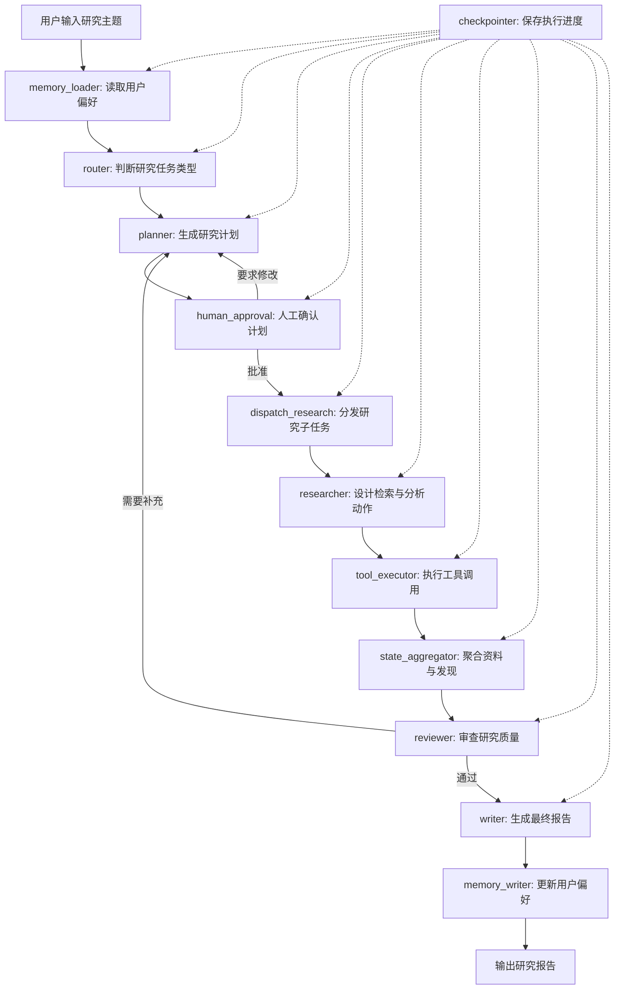
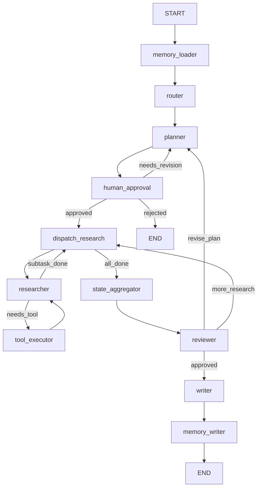

# 第34章-系统架构设计

## 34.1 从需求走向架构

第 33 章我们没有急着写代码。

我们先看清了一个问题：

> 智能研究助理不是“输入主题，输出报告”的一次模型调用，而是一个有计划、有资料、有审查、有恢复、有人工确认的长任务系统。

这句话决定了第 34 章的写法。

本章不会把架构设计写成一张漂亮的大图，然后让读者背下来。

因为复杂 Agent 的架构图如果没有决策过程，很容易变成装饰。

读者看完可能知道系统里有这些模块：

```text
Router
Planner
Researcher
Tool Executor
Reviewer
Writer
Memory
Checkpoint
Human Approval
```

但仍然不知道：

```text
为什么要拆成这些模块？
为什么不能少几个？
为什么 Researcher 和 Tool Executor 要分开？
为什么 Reviewer 不能和 Writer 合并？
为什么 Router 不是 Supervisor？
为什么 Checkpoint 和 Memory 不是一回事？
```

所以本章采用“架构决策记录法”。

也就是每设计一个模块，都回答六个问题：

```text
为什么需要它？
它负责什么？
它不负责什么？
它读哪些 State？
它写哪些 State？
未来怎么扩展？
```

这比直接讲“系统由哪些模块组成”更重要。

因为真实项目里，架构能力不是记住一套固定模块，而是能根据业务复杂度做拆分判断。

本章的核心问题是：

> 为什么智能研究助理要拆成 Router、Planner、Researcher、Reviewer、Writer？

## 34.2 架构设计的目标

在写架构图之前，先明确目标。

这个智能研究助理的架构要满足五个要求。

第一，流程可理解。

读者应该能一眼看懂：

```text
用户主题进入系统以后，先经过什么，再经过什么，哪里会暂停，哪里会循环，哪里输出报告。
```

第二，模块可替换。

以后如果要换模型、换搜索工具、换审查策略，不应该把整个图重写。

第三，状态可追踪。

报告不是凭空生成的。

系统应该能追踪：

```text
计划是什么。
资料来自哪里。
中间结论是什么。
审查意见是什么。
最终报告依据什么写成。
```

第四，任务可恢复。

研究任务可能很长。

系统必须支持：

```text
暂停。
恢复。
人工确认。
失败后从中间继续。
```

第五，未来可扩展。

第八部分是教学案例，但设计不能只适合这个案例。

它应该能自然扩展到：

```text
更多研究类型。
更多工具。
更多模型。
更多审查标准。
更复杂的部署方式。
```

所以本章的架构不是为了炫技。

它要服务一个目标：

> 把研究任务的复杂度放进清晰的模块、状态和控制流边界里。

## 34.3 总体架构图

先给出本案例的总体结构。



这张图可以分成四层。

第一层是入口层：

```text
memory_loader -> router
```

它负责理解用户、读取偏好、判断任务类型。

第二层是计划层：

```text
planner -> human_approval
```

它负责把主题变成可执行计划，并让用户确认方向。

第三层是研究层：

```text
dispatch_research -> researcher -> tool_executor -> state_aggregator
```

它负责执行子任务、调用工具、收集资料、汇总发现。

第四层是质量与输出层：

```text
reviewer -> writer -> memory_writer
```

它负责检查研究是否足够，再生成最终报告，并沉淀用户偏好。

`checkpointer` 不属于某个普通节点。

它是图运行能力。

它横跨整个流程，让任务可以暂停、恢复和继续。

## 34.4 为什么不是一个大 Agent

在进入各模块之前，先看一个错误架构。

很多人会把研究助理写成这样：


这个节点内部做所有事：

```text
理解主题。
生成计划。
查资料。
分析资料。
写报告。
检查质量。
处理错误。
请求用户确认。
```

这种写法在 demo 里很诱人。

因为它简单。

但它会让系统失去几个能力。

第一，过程不可观察。

你只能看到输入和输出，看不到计划、资料、审查意见和中间结论。

第二，职责不可测试。

报告不好时，你不知道是计划错了、资料少了、审查弱了，还是写作节点没有用好资料。

第三，局部不可替换。

如果想换搜索工具，很可能要改大节点里的 prompt 和工具逻辑。

如果想加强审查，也只能往同一个节点继续塞规则。

第四，恢复粒度太粗。

如果一个大节点运行失败，只能重跑整个节点。

而研究任务最需要的是：

```text
计划已确认，就不要重新计划。
资料已收集，就不要重新收集。
只在失败点之后继续。
```

所以智能研究助理不能写成一个大 Agent。

它应该拆成多个有明确边界的节点和子流程。

拆分的目的不是让架构看起来复杂，而是让复杂任务变得可观察、可测试、可恢复、可扩展。

## 34.5 架构决策一：为什么需要 Router

Router 是入口处的分流节点。

它回答的问题是：

> 这个研究主题属于哪种任务？

### 为什么需要它

研究主题不是单一类型。

用户可能输入：

```text
解释 LangGraph 的架构思想。
比较 LangGraph 和 AutoGen。
为企业知识库 Agent 设计架构。
总结一批资料并写报告。
```

这些任务都叫“研究”，但处理策略不同。

概念解释可以轻计划、轻检索。

框架对比需要明确比较维度。

架构设计需要从业务约束反推模块。

资料总结需要更重的来源整理。

如果没有 Router，Planner 就要同时承担分类和计划生成。

一开始还能忍。

但任务类型增加后，Planner 会变成另一个总控大节点。

所以 Router 的存在是为了让入口判断和后续计划分开。

### 它负责什么

Router 负责：

```text
读取用户主题。
读取用户偏好。
判断研究任务类型。
给出路由理由。
选择后续研究策略。
```

例如它可以输出：

```python
{
    "task_type": "architecture_research",
    "route_reason": "用户关注模块化、可扩展性和生产化，属于架构研究任务",
}
```

### 它不负责什么

Router 不负责：

```text
生成完整研究计划。
调用搜索工具。
写最终报告。
审查研究质量。
```

Router 只决定“去哪条研究路径”。

它不负责“到了以后怎么研究”。

这是第 28 章 Router Agent 的原则在完整案例中的应用。

### 它读写哪些 State

Router 主要读取：

| 字段 | 用途 |
| --- | --- |
| `topic` | 用户输入的研究主题 |
| `user_preferences` | 用户长期偏好 |

Router 主要写入：

| 字段 | 用途 |
| --- | --- |
| `task_type` | 研究任务类型 |
| `route_reason` | 路由理由 |
| `execution_log` | 记录路由过程 |

### 未来怎么扩展

以后可以增加新的任务类型：

```text
literature_review
architecture_research
competitive_analysis
implementation_plan
technical_due_diligence
```

也可以把 Router 从规则分类升级成：

```text
规则 + 本地模型。
Ollama 轻量分类。
DeepSeek 复杂意图识别。
路由不确定时进入 human_approval。
```

因为 Router 是独立模块，扩展任务类型时，不需要改 Writer、Reviewer 或 Tool Executor。

## 34.6 架构决策二：为什么需要 Planner

Planner 是计划节点。

它回答的问题是：

> 这个研究任务应该拆成哪些可执行步骤？

### 为什么需要它

研究主题通常很大。

用户不会直接给出完整计划。

例如：

```text
研究复杂 Agent 应用的架构能力。
```

这句话至少可以拆出这些问题：

```text
复杂 Agent 的复杂度来自哪里？
状态如何组织？
模块如何拆分？
模型如何分工？
工具调用如何管理？
长任务如何恢复？
如何从示例走向生产？
```

如果没有 Planner，Researcher 会直接面对一个很大的主题。

它可能查很多资料，但没有主线。

Writer 也可能最后写出一篇看似完整但结构松散的报告。

Planner 的价值是先建立研究骨架。

研究计划一旦清楚，后面的资料收集、审查和写作都有了依据。

### 它负责什么

Planner 负责：

```text
根据 topic、task_type 和 user_preferences 生成研究计划。
把大主题拆成子任务。
为每个子任务指定目标、预期产出和优先级。
根据 Reviewer 反馈修订计划。
```

一个计划可以长这样：

```python
{
    "plan_id": "plan-v1",
    "goal": "研究 LangGraph 如何支持复杂 Agent 架构设计",
    "subtasks": [
        {
            "id": "complexity",
            "question": "复杂 Agent 应用的复杂度来自哪里？",
            "expected_output": "复杂度来源列表和解释",
        },
        {
            "id": "modularity",
            "question": "LangGraph 如何通过 State、Node、Edge 支持模块化？",
            "expected_output": "模块化设计原则",
        },
    ],
}
```

### 它不负责什么

Planner 不负责：

```text
亲自执行资料检索。
直接生成最终报告。
判断报告是否通过。
管理工具调用细节。
```

Planner 只设计路线。

真正执行由 Researcher 和 Tool Executor 完成。

质量判断由 Reviewer 完成。

报告表达由 Writer 完成。

### 它读写哪些 State

Planner 主要读取：

| 字段 | 用途 |
| --- | --- |
| `topic` | 研究主题 |
| `task_type` | 任务类型 |
| `user_preferences` | 用户偏好 |
| `review_feedback` | 审查反馈，修订计划时使用 |

Planner 主要写入：

| 字段 | 用途 |
| --- | --- |
| `research_plan` | 当前研究计划 |
| `subtasks` | 可执行子任务 |
| `plan_version` | 计划版本 |
| `execution_log` | 记录计划生成或修订 |

### 未来怎么扩展

Planner 可以从固定模板扩展成多种策略：

```text
概念研究计划模板。
对比研究计划模板。
架构设计计划模板。
资料综述计划模板。
```

也可以接入更强模型：

```text
Ollama 生成简单计划。
DeepSeek 生成复杂研究计划。
用户审批后锁定计划版本。
Reviewer 反馈触发计划修订。
```

这就是 Planner 独立出来的价值。

以后计划策略再复杂，也不会污染 Researcher、Reviewer 和 Writer。

## 34.7 架构决策三：为什么需要 Human Approval

Human Approval 是人工确认节点。

它回答的问题是：

> 当前研究计划是否符合用户真实意图？

### 为什么需要它

研究任务最容易在一开始走偏。

如果计划错了，后面所有节点都会认真地做错事。

例如用户真正想要的是：

```text
用 LangGraph 训练复杂 Agent 架构设计能力。
```

Planner 却生成：

```text
1. 安装 LangGraph
2. 编写 Hello World
3. 解释 API 参数
```

这个计划不是完全没用。

但它偏离了目标。

如果没有人工确认，系统会继续执行错误计划。

所以计划生成后应该暂停。

让用户确认：

```text
这个研究方向对不对？
哪些子任务需要删掉？
哪些重点需要加强？
```

### 它负责什么

Human Approval 负责：

```text
把研究计划展示给用户。
暂停图执行。
接收用户批准、拒绝或修改意见。
把确认结果写回 State。
```

在 LangGraph 中，这类节点通常可以用 `interrupt` 实现。

### 它不负责什么

Human Approval 不负责：

```text
自己修改计划。
判断资料质量。
生成报告。
```

如果用户要求修改计划，控制流应该回到 Planner。

人工节点只收集人的决策，不替代 Planner。

### 它读写哪些 State

Human Approval 主要读取：

| 字段 | 用途 |
| --- | --- |
| `research_plan` | 展示给用户确认 |
| `topic` | 辅助用户判断计划是否偏题 |

Human Approval 主要写入：

| 字段 | 用途 |
| --- | --- |
| `approval_status` | `approved`、`needs_revision` 或 `rejected` |
| `approval_feedback` | 用户修改意见 |
| `execution_log` | 记录暂停和恢复 |

### 未来怎么扩展

人工确认可以扩展成：

```text
计划审批。
高风险工具调用审批。
最终报告发布审批。
预算超限审批。
敏感内容审批。
```

这说明 Human Approval 不是一个临时交互点。

它是复杂 Agent 的正式控制节点。

## 34.8 架构决策四：为什么需要 Researcher

Researcher 是研究执行节点。

它回答的问题是：

> 对于一个子任务，应该查什么、分析什么、产出什么？

### 为什么需要它

Planner 给出的是研究计划。

但计划不是资料。

例如一个子任务是：

```text
研究 LangGraph 的 checkpoint 如何支持长任务恢复。
```

Researcher 要把它转成可执行动作：

```text
构造检索关键词。
确定需要读取哪些资料。
决定是否需要对比代码和文档。
提取与“长任务恢复”相关的信息。
输出结构化发现。
```

如果没有 Researcher，Tool Executor 就会直接面对抽象子任务。

工具只会执行命令。

它不应该负责理解研究意图。

所以 Researcher 和 Tool Executor 必须分开。

### 它负责什么

Researcher 负责：

```text
读取当前子任务。
决定需要哪些工具动作。
生成工具请求。
把工具结果转成研究发现。
标记子任务完成情况。
```

Researcher 可以产生这样的工具请求：

```python
{
    "tool_name": "search_docs",
    "query": "LangGraph checkpoint thread interrupt durable execution",
    "purpose": "查找长任务恢复相关资料",
}
```

也可以在工具结果回来后产生发现：

```python
{
    "subtask_id": "persistence",
    "finding": "Checkpoint 保存图执行状态，使任务可以按 thread_id 恢复。",
    "evidence_ids": ["source-1", "source-3"],
}
```

### 它不负责什么

Researcher 不负责：

```text
直接访问外部 API。
处理工具超时和权限。
决定最终报告结构。
做最终质量审查。
```

它提出研究动作。

Tool Executor 执行动作。

State Aggregator 汇总发现。

Reviewer 判断质量。

### 它读写哪些 State

Researcher 主要读取：

| 字段 | 用途 |
| --- | --- |
| `subtasks` | 当前研究子任务 |
| `research_plan` | 保持研究方向一致 |
| `sources` | 避免重复检索 |
| `tool_results` | 从工具结果中提取发现 |

Researcher 主要写入：

| 字段 | 用途 |
| --- | --- |
| `tool_requests` | 待执行工具请求 |
| `findings` | 子任务研究发现 |
| `completed_subtasks` | 已完成子任务 |
| `execution_log` | 记录研究过程 |

### 未来怎么扩展

Researcher 可以扩展成多个 Worker：

```text
web_researcher
docs_researcher
code_researcher
market_researcher
```

也可以升级为 Supervisor 模式：

```text
research_supervisor -> 多个 research worker -> aggregator
```

第八部分先使用一个简化 Researcher。

但模块边界会为未来扩展保留空间。

## 34.9 架构决策五：为什么需要 Tool Executor

Tool Executor 是工具执行节点。

它回答的问题是：

> 如何安全、稳定、可控地调用外部工具？

### 为什么需要它

工具调用是 Agent 接触外部世界的边界。

它可能涉及：

```text
搜索网页。
读取文件。
查询数据库。
调用内部 API。
执行计算。
访问知识库。
```

这些动作都有风险：

```text
超时。
失败。
权限不足。
结果为空。
返回格式异常。
重复调用。
成本过高。
```

如果把工具调用写进 Researcher，Researcher 就会同时承担两种职责：

```text
理解研究意图。
处理外部工具风险。
```

这会让节点越来越重，也很难测试。

所以工具执行应该集中到 Tool Executor。

### 它负责什么

Tool Executor 负责：

```text
读取 tool_requests。
根据 tool_name 选择工具。
执行输入校验。
处理超时、错误和重试。
把结果写成统一格式。
记录工具调用日志。
```

工具结果应该是结构化的：

```python
{
    "request_id": "tool-001",
    "tool_name": "search_docs",
    "status": "success",
    "result": [...],
    "error": None,
}
```

### 它不负责什么

Tool Executor 不负责：

```text
决定为什么要调用工具。
解释研究意义。
写最终报告。
判断研究是否充分。
```

它只负责把工具调用这件事做稳定。

### 它读写哪些 State

Tool Executor 主要读取：

| 字段 | 用途 |
| --- | --- |
| `tool_requests` | 待执行工具请求 |
| `tool_config` | 工具配置、超时、重试次数 |

Tool Executor 主要写入：

| 字段 | 用途 |
| --- | --- |
| `tool_results` | 工具调用结果 |
| `tool_errors` | 工具错误信息 |
| `execution_log` | 工具调用轨迹 |

### 未来怎么扩展

未来可以增加：

```text
工具权限控制。
工具调用预算。
工具结果缓存。
工具调用审计。
并行工具调用。
失败 fallback。
```

只要 Tool Executor 边界稳定，Researcher 不需要知道每种工具的底层细节。

## 34.10 架构决策六：为什么需要 State Aggregator

State Aggregator 是资料与发现聚合节点。

它回答的问题是：

> 多个子任务和工具结果如何变成可审查的中间结论？

### 为什么需要它

研究任务会产生很多碎片：

```text
搜索结果。
文档摘录。
工具返回值。
子任务发现。
临时摘要。
引用来源。
```

这些碎片不能直接交给 Writer。

否则 Writer 会面对一堆杂乱材料，只能靠模型自己整理。

这会导致：

```text
重复资料没有去掉。
来源和结论没有对应。
不同子任务的发现混在一起。
最终报告无法追溯依据。
```

所以需要一个 Aggregator。

它把分散结果整理成稳定的中间层。

### 它负责什么

State Aggregator 负责：

```text
合并 tool_results 和 findings。
按子任务归类资料。
去重和压缩资料。
建立 evidence 与 finding 的关系。
生成 synthesis 中间结论。
```

它输出的不是最终报告，而是：

```text
可被 Reviewer 审查、可被 Writer 使用的中间结论。
```

### 它不负责什么

State Aggregator 不负责：

```text
决定是否补充研究。
写最终文章。
调用外部工具。
改变研究计划。
```

它是整理者，不是审查者，也不是作者。

### 它读写哪些 State

State Aggregator 主要读取：

| 字段 | 用途 |
| --- | --- |
| `tool_results` | 原始工具结果 |
| `findings` | 子任务发现 |
| `sources` | 资料来源 |
| `subtasks` | 按任务归类 |

State Aggregator 主要写入：

| 字段 | 用途 |
| --- | --- |
| `synthesis` | 聚合后的中间结论 |
| `source_index` | 来源索引 |
| `evidence_map` | 结论与证据的对应关系 |
| `execution_log` | 聚合过程日志 |

### 未来怎么扩展

Aggregator 可以逐步增加：

```text
来源去重。
证据评分。
引用格式化。
冲突观点标记。
长资料压缩。
结构化知识卡片。
```

这些能力都适合放在 Aggregator，而不是塞进 Writer。

## 34.11 架构决策七：为什么需要 Reviewer

Reviewer 是质量审查节点。

它回答的问题是：

> 当前研究结果是否足够支撑最终报告？

### 为什么需要它

研究任务不能只看“有没有输出”。

它要看输出是否可信、完整、符合目标。

常见问题包括：

```text
研究计划执行不完整。
资料和结论没有对应。
只总结现象，没有架构判断。
遗漏用户强调的重点。
引用来源太弱。
不同子任务结论互相冲突。
```

如果没有 Reviewer，Writer 会把现有材料写成报告。

材料不够，它也会写。

方向偏了，它也会写。

这就是很多 Agent 输出“看起来完整但其实不可靠”的原因。

Reviewer 的价值是把质量判断前置到报告生成之前。

### 它负责什么

Reviewer 负责：

```text
检查研究计划是否完成。
检查每个关键结论是否有资料支撑。
检查是否覆盖用户重点。
判断是否需要补充研究。
生成结构化审查反馈。
决定下一步是回到 Planner/Researcher，还是进入 Writer。
```

它可以输出：

```python
{
    "passed": False,
    "issues": [
        "缺少对未来扩展能力的分析",
        "checkpoint 与 memory 的区别没有解释清楚",
    ],
    "suggestions": [
        "补充模型替换、工具扩展和子图扩展",
        "单独比较 Checkpoint 和 Memory",
    ],
    "next_action": "revise_plan",
}
```

### 它不负责什么

Reviewer 不负责：

```text
亲自补充资料。
直接重写报告。
替代 Writer 做表达优化。
```

Reviewer 只提出问题和下一步建议。

如果要补充研究，流程回到 Planner 或 Researcher。

如果通过，流程进入 Writer。

### 它读写哪些 State

Reviewer 主要读取：

| 字段 | 用途 |
| --- | --- |
| `topic` | 检查是否跑题 |
| `research_plan` | 检查计划是否完成 |
| `synthesis` | 审查中间结论 |
| `evidence_map` | 检查结论依据 |
| `user_preferences` | 检查是否符合偏好 |

Reviewer 主要写入：

| 字段 | 用途 |
| --- | --- |
| `review_feedback` | 审查意见 |
| `quality_status` | `needs_revision` 或 `approved` |
| `next_action` | 下一步建议 |
| `execution_log` | 审查过程 |

### 未来怎么扩展

Reviewer 可以拆成多个审查器：

```text
coverage_reviewer: 检查覆盖度。
evidence_reviewer: 检查证据。
structure_reviewer: 检查结构。
safety_reviewer: 检查风险。
style_reviewer: 检查用户偏好。
```

也可以做成 Reflection 循环：

```text
draft -> critique -> revise -> critique -> finish
```

但在本案例里，Reviewer 先作为最终报告前的质量闸门。

## 34.12 架构决策八：为什么需要 Writer

Writer 是最终报告生成节点。

它回答的问题是：

> 如何把已经审查通过的研究结果写成读者能读懂的报告？

### 为什么需要它

研究和写作是两件事。

Researcher 关注资料和发现。

Aggregator 关注整理和归类。

Reviewer 关注质量判断。

Writer 关注表达结构。

如果让 Researcher 直接写报告，它容易边查边写，结构不稳定。

如果让 Reviewer 直接写报告，它会把审查和表达混在一起。

所以最终报告应该由 Writer 生成。

### 它负责什么

Writer 负责：

```text
读取审查通过的 synthesis。
读取 evidence_map 和 review_feedback。
按照报告结构生成最终内容。
遵守用户偏好。
输出 final_report。
```

报告结构可以是：

```text
标题。
核心结论。
研究背景。
关键发现。
架构分析。
实践建议。
风险与限制。
下一步方向。
```

### 它不负责什么

Writer 不负责：

```text
发明新的研究结论。
补充工具检索。
偷偷忽略 Reviewer 的问题。
改变研究计划。
```

Writer 应该基于已有状态写作。

如果资料不够，应该由 Reviewer 把流程退回前面，而不是让 Writer 自己补。

### 它读写哪些 State

Writer 主要读取：

| 字段 | 用途 |
| --- | --- |
| `topic` | 报告主题 |
| `research_plan` | 报告结构依据 |
| `synthesis` | 中间结论 |
| `evidence_map` | 结论依据 |
| `review_feedback` | 审查意见 |
| `user_preferences` | 写作风格偏好 |

Writer 主要写入：

| 字段 | 用途 |
| --- | --- |
| `final_report` | 最终研究报告 |
| `report_metadata` | 报告版本、生成时间、引用统计 |
| `execution_log` | 写作过程 |

### 未来怎么扩展

Writer 可以扩展出多种输出格式：

```text
Markdown 报告。
PPT 大纲。
执行摘要。
技术方案文档。
决策备忘录。
```

也可以分成：

```text
outline_writer
section_writer
final_editor
```

但无论怎么扩展，Writer 的核心边界不变：

> 它负责表达，不负责重新研究。

## 34.13 架构决策九：为什么需要 Memory

Memory 是长期记忆模块。

它回答的问题是：

> 用户跨任务的偏好和背景如何被系统记住？

### 为什么需要它

同一个用户可能多次使用研究助理。

他可能一直偏好：

```text
先给结论。
少写背景，多写实践。
强调架构取舍。
给出未来扩展建议。
避免写成 API 手册。
```

这些偏好如果每次都重新输入，会很累。

所以系统需要 Memory。

### 它负责什么

Memory 负责：

```text
读取用户偏好。
在计划和写作时提供上下文。
根据用户反馈更新长期偏好。
```

本案例可以先用简单结构模拟：

```python
{
    "preferred_style": "先讲问题，再讲架构决策，最后讲扩展",
    "focus": ["模块化", "可扩展性", "生产化"],
}
```

### 它不负责什么

Memory 不负责保存当前任务执行到哪里。

这是 Checkpoint 的职责。

Memory 也不应该保存所有临时中间状态。

它保存的是跨任务仍然有价值的信息。

### 它读写哪些 State

Memory Loader 主要写入：

| 字段 | 用途 |
| --- | --- |
| `user_preferences` | 用户长期偏好 |

Memory Writer 主要读取：

| 字段 | 用途 |
| --- | --- |
| `approval_feedback` | 用户对计划的修改 |
| `final_report` | 可用于提取偏好 |
| `review_feedback` | 质量偏好线索 |

Memory Writer 主要写入外部 store，必要时也更新：

| 字段 | 用途 |
| --- | --- |
| `memory_updates` | 本次任务沉淀出的偏好变化 |

### 未来怎么扩展

Memory 可以扩展为：

```text
用户偏好记忆。
项目背景记忆。
团队术语记忆。
历史报告索引。
跨 thread 的长期知识。
```

但它要始终和 Checkpoint 分开。

Checkpoint 解决“这次任务进行到哪里”。

Memory 解决“长期用户和业务上下文是什么”。

## 34.14 架构决策十：为什么需要 Checkpoint

Checkpoint 是持久化执行现场的能力。

它回答的问题是：

> 这次研究任务中断后，如何从中间继续？

### 为什么需要它

智能研究助理是长任务。

它可能暂停在：

```text
计划确认前。
工具调用后。
审查不通过后。
报告生成前。
```

如果没有 Checkpoint，中断后只能重跑。

这会带来几个问题：

```text
用户已经确认的计划丢失。
已经收集的资料丢失。
工具调用成本浪费。
审查意见丢失。
用户等待体验差。
```

有了 Checkpoint，系统可以按 `thread_id` 恢复同一次研究任务。

### 它负责什么

Checkpoint 负责：

```text
保存图执行状态。
保存各 channel 的值和版本。
支持 interrupt 后恢复。
支持同一个 thread 继续执行。
```

在本案例中，它尤其服务两个场景：

```text
Human Approval 暂停。
执行失败后恢复。
```

### 它不负责什么

Checkpoint 不负责长期偏好。

也不负责业务级资料库。

它不是 Memory。

它保存的是某一次图执行过程。

### 它影响哪些 State

Checkpoint 不像普通节点那样“读写某个字段”。

它保存整个图运行过程中的状态快照。

所以它影响的是：

```text
所有需要恢复的 State。
所有 interrupt 前后的执行现场。
同一个 thread_id 下的任务连续性。
```

### 未来怎么扩展

本案例可以先使用内存 checkpointer 或 SQLite。

生产环境可以扩展到：

```text
Postgres checkpointer。
任务队列 worker。
多实例恢复。
执行历史查看。
time travel 调试。
```

这部分会在第 37 章重点展开。

## 34.15 主状态设计预览

第 35 章会详细实现 State。

本章先给出架构层面的状态分组。

智能研究助理的 State 可以分为五类。

第一类是输入状态：

```python
topic: str
user_id: str
thread_id: str
```

第二类是路由与计划状态：

```python
task_type: str
route_reason: str
research_plan: dict
plan_version: int
subtasks: list[dict]
approval_status: str
approval_feedback: str
```

第三类是研究执行状态：

```python
active_subtask: dict
tool_requests: list[dict]
tool_results: list[dict]
sources: list[dict]
findings: list[dict]
completed_subtasks: list[str]
```

第四类是质量与输出状态：

```python
synthesis: dict
evidence_map: dict
review_feedback: dict
quality_status: str
final_report: str
report_metadata: dict
```

第五类是运行与记忆状态：

```python
user_preferences: dict
memory_updates: dict
execution_log: list[str]
errors: list[dict]
```

这不是为了让 State 看起来丰富。

而是为了让每类状态都有明确归属。

可以用下面这张表理解：

| 状态类别 | 主要写入模块 |
| --- | --- |
| 输入状态 | 应用入口 |
| 路由状态 | Router |
| 计划状态 | Planner / Human Approval |
| 研究执行状态 | Researcher / Tool Executor |
| 聚合状态 | State Aggregator |
| 质量状态 | Reviewer |
| 输出状态 | Writer |
| 长期偏好 | Memory |
| 运行日志 | 所有节点追加 |

第 35 章会把这些字段落成具体的 `TypedDict`、辅助类型和模块实现。

## 34.16 控制流设计

有了模块和 State，还需要确定控制流。

本案例主流程可以写成：

```text
START
-> memory_loader
-> router
-> planner
-> human_approval
-> dispatch_research
-> researcher
-> tool_executor
-> state_aggregator
-> reviewer
-> writer
-> memory_writer
-> END
```

但真实控制流不是一条直线。

它至少有三个分支。

第一个分支在 Human Approval：

```text
批准 -> dispatch_research
要求修改 -> planner
拒绝 -> END 或返回用户
```

第二个分支在 Researcher / Tool Executor：

```text
还有工具请求 -> tool_executor
工具结果已足够 -> state_aggregator
工具失败可重试 -> tool_executor
工具失败不可恢复 -> reviewer 或 error_handler
```

第三个分支在 Reviewer：

```text
通过 -> writer
需要补充计划 -> planner
需要补充资料 -> researcher
达到最大修订次数 -> writer 或人工确认
```

用图表示：



这张图比第 33 章的图更接近实现。

它说明：

```text
Human Approval 控制计划是否进入执行。
Researcher 和 Tool Executor 可以形成小循环。
Reviewer 可以把流程退回 Planner 或研究阶段。
Writer 只在审查通过后执行。
```

## 34.17 为什么 Reviewer 和 Writer 不能合并

这里单独强调一个常见架构问题。

很多人会问：

```text
Reviewer 和 Writer 都是模型节点，为什么不合并？
```

因为它们的职责相反。

Reviewer 负责挑问题。

Writer 负责表达结果。

Reviewer 的输出应该像这样：

```text
当前资料不足。
缺少证据。
结构不完整。
需要补充未来扩展分析。
```

Writer 的输出应该像这样：

```text
根据已确认资料，生成一份结构化报告。
```

如果合并，节点会同时承担：

```text
判断资料够不够。
如果不够，决定补什么。
如果够，生成报告。
如果写得不好，再自我修正。
```

这会让控制流变得模糊。

更严重的是，Writer 很容易“掩盖问题”。

资料不够时，它仍然可以写出一篇顺滑的报告。

而 Reviewer 的存在，就是为了在报告生成之前阻止这种情况。

所以本案例坚持：

> Reviewer 是质量闸门，Writer 是表达节点。两者不能合并。

## 34.18 为什么 Researcher 和 Tool Executor 不能合并

另一个常见问题是：

```text
Researcher 既然知道要查什么，为什么不直接调用工具？
```

小 demo 可以这样写。

复杂项目不建议。

因为 Researcher 和 Tool Executor 面对的是两类复杂度。

Researcher 面对的是认知复杂度：

```text
这个子任务应该查什么？
哪些资料有价值？
工具结果说明了什么？
应该产生什么发现？
```

Tool Executor 面对的是外部系统复杂度：

```text
工具是否可用？
输入是否合法？
调用是否超时？
失败是否重试？
结果格式是否正确？
是否超过预算？
是否有权限风险？
```

这两类复杂度如果混在一起，节点很快会变得难测。

把它们分开以后：

```text
Researcher 可以用 fake tool_results 测试研究逻辑。
Tool Executor 可以用 fake tool_requests 测试工具调用协议。
```

这就是工程化设计的意义。

> Researcher 决定做什么研究动作，Tool Executor 负责安全执行动作。

## 34.19 为什么 Planner 不是 Supervisor

Planner 和 Supervisor 容易混淆。

Planner 负责生成研究计划。

Supervisor 负责持续调度多个 Worker。

本案例没有一开始引入完整 Supervisor，是有意的。

因为第八部分的主线已经很复杂。

如果一开始就加入完整多 Agent Supervisor，读者会同时面对：

```text
计划生成。
任务调度。
工具调用。
人工确认。
质量审查。
持久化恢复。
```

这会让主线过重。

所以本案例采用一个折中设计：

```text
Planner 生成计划。
dispatch_research 按 subtasks 分发。
Researcher 执行子任务。
Reviewer 决定是否回到 Planner 或研究阶段。
```

它具备 Supervisor 的一部分调度思想，但不把 Supervisor 作为独立复杂模块展开。

未来如果研究任务更复杂，可以把 `dispatch_research` 升级成真正的 Supervisor：

```text
research_supervisor
-> web_researcher
-> docs_researcher
-> code_researcher
-> synthesis_worker
```

这就是渐进式架构。

先让当前复杂度可控，再为未来扩展留下边界。

## 34.20 模块职责总表

把前面的决策汇总成一张表。

| 模块 | 核心问题 | 主要输入 | 主要输出 | 不负责 |
| --- | --- | --- | --- | --- |
| `memory_loader` | 用户有什么长期偏好？ | `user_id` | `user_preferences` | 当前任务恢复 |
| `router` | 这是哪类研究任务？ | `topic`, `user_preferences` | `task_type`, `route_reason` | 生成研究计划 |
| `planner` | 任务如何拆解？ | `topic`, `task_type`, `review_feedback` | `research_plan`, `subtasks` | 执行研究 |
| `human_approval` | 用户是否认可计划？ | `research_plan` | `approval_status`, `approval_feedback` | 修改计划 |
| `dispatch_research` | 下一个子任务是谁？ | `subtasks`, `completed_subtasks` | `active_subtask` | 分析资料 |
| `researcher` | 子任务要查什么、得出什么？ | `active_subtask`, `tool_results` | `tool_requests`, `findings` | 直接访问外部工具 |
| `tool_executor` | 工具如何安全执行？ | `tool_requests` | `tool_results`, `tool_errors` | 判断研究意义 |
| `state_aggregator` | 发现如何聚合成结论？ | `findings`, `sources` | `synthesis`, `evidence_map` | 判断质量是否通过 |
| `reviewer` | 研究是否足够？ | `research_plan`, `synthesis` | `review_feedback`, `quality_status` | 写最终报告 |
| `writer` | 如何生成报告？ | `synthesis`, `evidence_map` | `final_report` | 补充研究 |
| `memory_writer` | 本次任务沉淀了什么偏好？ | `approval_feedback`, `final_report` | `memory_updates` | 图执行恢复 |

这张表是第 34 章最重要的产物之一。

它把架构图中的节点变成了可执行的模块契约。

后面第 35 章写状态和模块时，要尽量遵守这张表。

如果一个模块开始做“不负责”的事情，就是架构开始变形的信号。

## 34.21 本章小结

本章把第 33 章的需求分析推进到了系统架构设计。

我们没有把架构写成模块堆叠，而是用“架构决策记录法”逐个回答：

```text
为什么需要这个模块？
它负责什么？
它不负责什么？
它读写哪些 State？
未来如何扩展？
```

本章最重要的几个结论是：

```text
Router 负责入口分流，不负责计划和执行。
Planner 负责研究计划，不负责查资料和写报告。
Human Approval 让计划确认成为正式流程。
Researcher 负责研究动作设计，不直接处理工具风险。
Tool Executor 负责安全执行工具调用。
State Aggregator 把碎片资料整理成可审查结论。
Reviewer 是质量闸门，不能和 Writer 合并。
Writer 只负责基于已审查结论生成报告。
Memory 保存长期偏好，Checkpoint 保存当前任务现场。
```

复杂 Agent 架构的关键不是节点数量，而是边界清楚。

当每个模块都知道自己负责什么、不负责什么，系统才有可测试性、可替换性和可扩展性。

下一章会进入第 35 章：状态与模块实现。

我们会把本章的架构设计落到具体代码层面：

```text
如何定义 ResearchState。
如何设计子任务、工具请求、工具结果、审查反馈等结构。
如何把 Router、Planner、Researcher、Reviewer、Writer 写成可测试模块。
```

