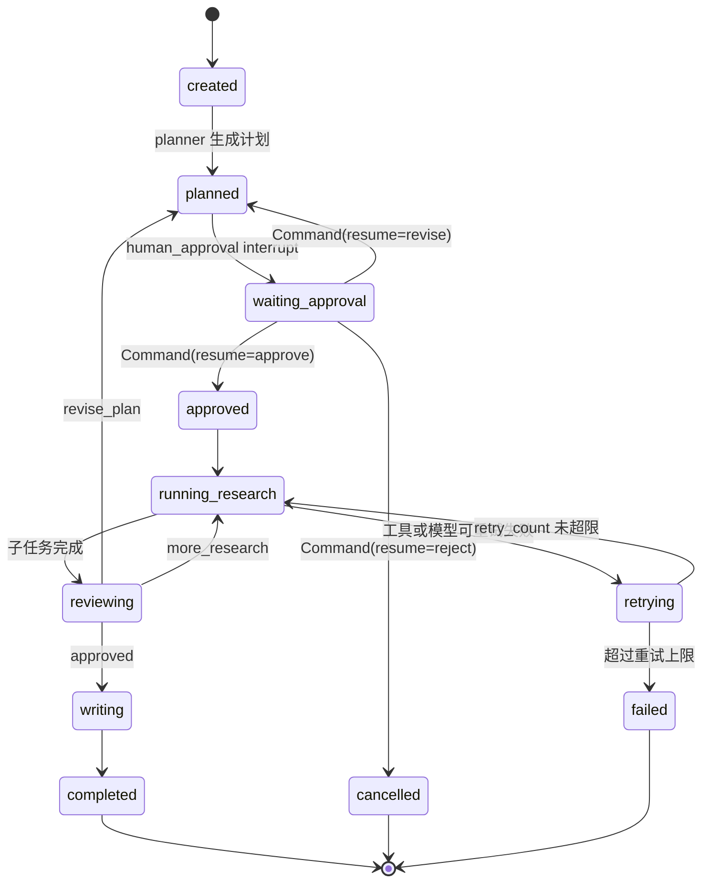
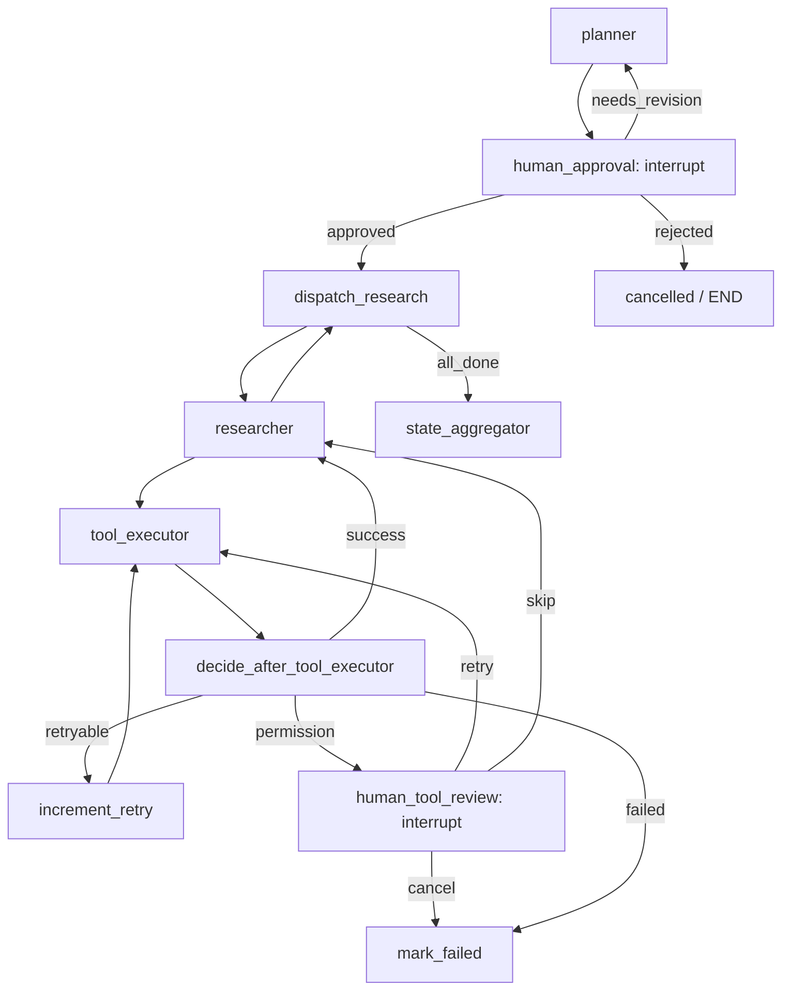

# 第37章-加入持久化、恢复与人工审批

## 37.1 复杂案例真正变成“长任务”

第 33 章到第 36 章，我们已经把智能研究助理的核心部分搭起来了。

第 33 章定义了真实研究助理为什么复杂。

第 34 章设计了系统架构。

第 35 章定义了 State 和模块边界。

第 36 章把模型能力接入到 Router、Planner、Researcher、Reviewer 和 Writer。

到这里，智能研究助理已经不再是一个简单 demo。

它的执行过程可能是这样的：

```text
用户输入主题
-> 读取用户偏好
-> 判断研究类型
-> 生成研究计划
-> 等待用户确认
-> 执行多个研究子任务
-> 调用工具收集资料
-> 聚合研究发现
-> 审查质量
-> 必要时回到计划或研究阶段
-> 生成最终报告
```

这已经是一个长任务。

长任务和短任务的区别不只是“步骤更多”。

长任务会遇到四个现实问题：

```text
执行到一半需要暂停。
用户过一会儿才回来审批。
工具或模型可能失败。
失败后不能总是从头开始。
```

如果没有持久化和恢复能力，前面设计得再漂亮，系统仍然像一次性脚本。

用户刷新页面，任务丢了。

程序重启，计划丢了。

工具失败，前面收集的资料也要重来。

用户审批后，系统不知道从哪里继续。

所以第 37 章要把智能研究助理从“能执行的图”推进成“可持续运行的任务”。

本章采用“长任务生命周期法”。

核心问题是：

> 一个长任务如何暂停、恢复、审批、失败重试？

## 37.2 长任务生命周期图

先用生命周期而不是 API 来看问题。

一次研究任务从开始到结束，会经历这些状态：

```text
created
-> planned
-> waiting_approval
-> approved
-> running_research
-> retrying 或 recovering
-> reviewing
-> writing
-> completed
```

如果用户拒绝或系统无法恢复，也可能进入：

```text
cancelled
failed
```

用图表示：



这张图说明：

```text
长任务不是一条直线。
它会暂停、恢复、回退、重试、取消和完成。
```

第 37 章要做的，就是把这些状态变成 LangGraph 中可表达的执行流程。

其中有三个关键能力：

```text
Checkpoint：保存执行现场。
Thread：标识同一条任务执行线。
Interrupt：在关键节点暂停，等待人类输入。
```

再加上一个工程能力：

```text
错误状态 + retry_count：让失败可重试、可降级、可结束。
```

## 37.3 为什么普通数据库保存不够

很多读者会想：

```text
我把 research_plan、tool_results、final_report 存到数据库，不也能恢复吗？
```

只能恢复一部分。

普通数据库保存通常能回答：

```text
这个任务有哪些业务数据？
```

但 LangGraph 长任务恢复还需要回答：

```text
图执行到哪个节点了？
下一步应该运行谁？
当前 thread 的最近一次稳定状态是什么？
interrupt 暂停点在哪里？
Command(resume=...) 应该回到哪个 interrupt？
```

这些不是业务字段能单独解决的。

例如研究助理暂停在计划审批处。

数据库里保存了：

```text
research_plan = ...
approval_status = pending
```

但如果没有 checkpoint，恢复时你仍然要自己判断：

```text
是重新执行 planner？
还是直接进入 human_approval？
还是进入 dispatch_research？
```

LangGraph checkpoint 保存的是执行快照。

它不仅保存 State，还保存继续执行所需的运行时信息。

所以本章的设计原则是：

> 业务数据可以进数据库，图执行现场交给 checkpoint。

这两者不是互相替代。

## 37.4 为研究任务增加运行状态字段

第 35 章已经设计了 `ResearchState`。

为了支持持久化、审批和重试，可以补充几个字段。

```python
from typing import Literal, TypedDict
from operator import add
from typing import Annotated


TaskLifecycleStatus = Literal[
    "created",
    "planned",
    "waiting_approval",
    "approved",
    "running_research",
    "retrying",
    "reviewing",
    "writing",
    "completed",
    "cancelled",
    "failed",
]


ErrorType = Literal[
    "model_timeout",
    "model_invalid_output",
    "tool_timeout",
    "tool_permission_denied",
    "parse_error",
    "human_rejected",
    "unknown_error",
]


class ErrorRecord(TypedDict):
    node: str
    error_type: ErrorType
    message: str
    retryable: bool
```

然后在 `ResearchState` 中加入：

```python
class ResearchState(..., total=False):
    lifecycle_status: TaskLifecycleStatus
    retry_count: int
    max_retries: int
    errors: Annotated[list[ErrorRecord], add]
    warnings: Annotated[list[str], add]
```

这些字段各自有明确作用：

| 字段 | 作用 |
| --- | --- |
| `lifecycle_status` | 让任务处于哪个生命周期阶段可观察 |
| `retry_count` | 当前连续重试次数 |
| `max_retries` | 最大自动重试次数 |
| `errors` | 结构化错误历史 |
| `warnings` | 最终输出或 UI 可以展示的风险提示 |

注意，`lifecycle_status` 不是必须驱动所有条件边。

很多条件边仍然可以读取：

```text
approval_status
research_status
next_action
```

但 `lifecycle_status` 对任务展示、排查和恢复很有用。

它让外部系统知道：

```text
这个任务是在等审批，还是正在研究，还是失败了。
```

## 37.5 选择 checkpointer

教学阶段最简单的是内存 checkpointer。

```python
from langgraph.checkpoint.memory import InMemorySaver


checkpointer = InMemorySaver()
graph = builder.compile(checkpointer=checkpointer)
```

它适合：

```text
本地演示。
单进程调试。
理解 interrupt 和 resume。
```

但它有一个限制：

```text
程序退出后，checkpoint 会丢失。
```

所以如果你希望关闭程序后还能恢复，需要 SQLite、Postgres 或其他持久化 checkpointer。

本章先用 `InMemorySaver` 讲清机制。

第 39 章再讨论从示例走向生产时如何选择 Postgres、任务队列和部署方式。

一个构建函数可以这样写：

```python
from langgraph.checkpoint.memory import InMemorySaver


def build_research_graph_with_checkpoint():
    builder = StateGraph(ResearchState)

    # add_node / add_edge 与第 35、36 章一致
    ...

    checkpointer = InMemorySaver()
    return builder.compile(checkpointer=checkpointer)
```

有了 checkpointer，后面 `interrupt()` 才能可靠暂停和恢复。

## 37.6 thread_id：一次研究任务的身份

每一次研究任务都应该有稳定的 `thread_id`。

例如：

```python
config = {
    "configurable": {
        "thread_id": "research-langgraph-architecture-001"
    }
}
```

第一次启动任务：

```python
graph.invoke(
    {
        "topic": "研究 LangGraph 如何支持复杂 Agent 架构设计",
        "user_id": "user-001",
        "thread_id": "research-langgraph-architecture-001",
        "max_retries": 2,
    },
    config=config,
)
```

恢复审批时仍然使用同一个 `thread_id`：

```python
graph.invoke(
    Command(resume={"action": "approve"}),
    config=config,
)
```

这里有一个很重要的边界：

> State 里的 `thread_id` 是业务可见字段，config 里的 `thread_id` 是 LangGraph 找 checkpoint 的执行线身份。

它们通常应该一致。

但真正让 LangGraph 恢复的是：

```python
config["configurable"]["thread_id"]
```

如果恢复时换了新的 thread_id，`Command(resume=...)` 找不到原来的暂停点。

## 37.7 人工审批节点：计划确认不是普通函数

第 35 章里，`human_approval` 用了简化版本：

```python
def human_approval(state):
    return {
        "approval_status": "approved",
        "approval_feedback": "计划方向符合需求，可以开始研究。",
    }
```

这适合讲 State，但不是真实长任务。

真实计划审批应该暂停。

```python
from langgraph.types import interrupt


def human_approval(state: ResearchState) -> dict:
    decision = interrupt(
        {
            "type": "plan_approval",
            "question": "请确认这个研究计划是否可以执行。",
            "topic": state["topic"],
            "plan": state["research_plan"],
            "options": ["approve", "revise", "reject"],
            "expected_response": {
                "action": "approve | revise | reject",
                "feedback": "修改意见，可选",
            },
        }
    )

    action = decision.get("action")

    if action == "approve":
        return {
            "approval_status": "approved",
            "approval_feedback": decision.get("feedback", ""),
            "lifecycle_status": "approved",
            "execution_log": ["human_approval 用户批准研究计划"],
        }

    if action == "revise":
        return {
            "approval_status": "needs_revision",
            "approval_feedback": decision.get("feedback", "请修订研究计划"),
            "lifecycle_status": "planned",
            "execution_log": ["human_approval 用户要求修订计划"],
        }

    return {
        "approval_status": "rejected",
        "approval_feedback": decision.get("feedback", "用户拒绝执行计划"),
        "lifecycle_status": "cancelled",
        "errors": [
            {
                "node": "human_approval",
                "error_type": "human_rejected",
                "message": decision.get("feedback", "用户拒绝执行计划"),
                "retryable": False,
            }
        ],
        "execution_log": ["human_approval 用户拒绝研究计划"],
    }
```

这个节点有几个关键点。

第一，payload 要包含足够上下文。

用户要看到主题和计划，才能判断是否批准。

第二，resume 值应该结构化。

不要只传：

```text
ok
```

更好的形式是：

```python
{"action": "revise", "feedback": "弱化 RAG，重点讲模块化和未来扩展"}
```

第三，人工拒绝也是状态。

它写入 `approval_status`、`lifecycle_status` 和 `errors`。

拒绝不是异常崩溃，而是流程的一种结果。

## 37.8 计划审批的暂停与恢复流程

现在看完整交互。

第一次运行：

```python
result = graph.invoke(
    {
        "topic": "研究 LangGraph 如何支持复杂 Agent 架构设计",
        "user_id": "user-001",
        "thread_id": "research-001",
        "max_retries": 2,
    },
    config={"configurable": {"thread_id": "research-001"}},
)
```

图会执行到：

```text
memory_loader
-> router
-> planner
-> human_approval
```

然后在 `human_approval` 内部 interrupt。

应用层会收到一个暂停结果。

可以理解成：

```text
当前任务正在 waiting_approval。
需要用户确认 research_plan。
```

用户批准后恢复：

```python
from langgraph.types import Command


graph.invoke(
    Command(resume={"action": "approve", "feedback": "计划可以执行"}),
    config={"configurable": {"thread_id": "research-001"}},
)
```

图会从暂停点继续。

`interrupt()` 返回：

```python
{"action": "approve", "feedback": "计划可以执行"}
```

然后 `human_approval` 写入：

```text
approval_status = approved
lifecycle_status = approved
```

条件边进入：

```text
dispatch_research
```

如果用户要求修改：

```python
graph.invoke(
    Command(
        resume={
            "action": "revise",
            "feedback": "删掉框架对比，重点分析 checkpoint 和 human-in-the-loop",
        }
    ),
    config={"configurable": {"thread_id": "research-001"}},
)
```

条件边会把流程送回 Planner。

这就是人类输入进入图控制流。

## 37.9 审批条件边

审批节点之后的条件边应该只读 `approval_status`。

```python
def decide_after_approval(state: ResearchState) -> str:
    return state["approval_status"]
```

图连接：

```python
builder.add_conditional_edges(
    "human_approval",
    decide_after_approval,
    {
        "approved": "dispatch_research",
        "needs_revision": "planner",
        "rejected": END,
    },
)
```

这里不要让条件边解析用户反馈文本。

解析和归一化应该在 `human_approval` 节点里完成。

条件边只读取稳定状态值：

```text
approved
needs_revision
rejected
```

这会让测试更简单。

## 37.10 工具失败如何进入 State

长任务执行过程中，最常见的失败来自工具。

例如 `tool_executor` 调用搜索工具超时。

不要直接抛出异常让整个图崩溃。

也不要吞掉异常返回空资料。

应该把失败写入结构化 State。

```python
def tool_executor(state: ResearchState, search_tool) -> dict:
    pending_requests = get_pending_tool_requests(state)
    results = []
    errors = []

    for request in pending_requests:
        try:
            content = search_tool(request["query"])
            results.append(
                {
                    "request_id": request["id"],
                    "subtask_id": request["subtask_id"],
                    "tool_name": request["tool_name"],
                    "status": "success",
                    "content": content,
                    "source_id": f"source-{request['subtask_id']}",
                }
            )
        except TimeoutError as exc:
            errors.append(
                {
                    "node": "tool_executor",
                    "error_type": "tool_timeout",
                    "message": str(exc),
                    "retryable": True,
                }
            )
        except PermissionError as exc:
            errors.append(
                {
                    "node": "tool_executor",
                    "error_type": "tool_permission_denied",
                    "message": str(exc),
                    "retryable": False,
                }
            )

    update = {
        "tool_results": results,
        "execution_log": [f"tool_executor 完成 {len(results)} 个工具调用"],
    }

    if errors:
        update["errors"] = errors

    return update
```

工具失败进入 State 后，图才有机会判断：

```text
自动重试。
换工具。
请求人工处理。
降级继续。
结束任务。
```

## 37.11 重试状态设计

自动重试需要两个字段：

```text
retry_count
max_retries
```

`retry_count` 记录当前连续重试次数。

`max_retries` 限制自动重试上限。

可以定义一个重试节点：

```python
def increment_retry(state: ResearchState) -> dict:
    retry_count = state.get("retry_count", 0) + 1

    return {
        "retry_count": retry_count,
        "lifecycle_status": "retrying",
        "execution_log": [f"increment_retry 第 {retry_count} 次重试"],
    }
```

还可以定义一个重置节点。

当某个失败恢复成功后，把 retry_count 清零：

```python
def reset_retry(state: ResearchState) -> dict:
    return {
        "retry_count": 0,
        "execution_log": ["reset_retry 重置重试计数"],
    }
```

是否一定需要单独 `reset_retry` 节点，要看图复杂度。

小项目可以在成功节点里顺手返回：

```python
{"retry_count": 0}
```

复杂项目最好显式一点，让重试状态更可观察。

## 37.12 工具失败后的路由

工具执行后，可以设计一个错误处理路由。

```python
def decide_after_tool_executor(state: ResearchState) -> str:
    errors = state.get("errors", [])

    if not errors:
        return "researcher"

    last_error = errors[-1]
    retry_count = state.get("retry_count", 0)
    max_retries = state.get("max_retries", 2)

    if last_error["retryable"] and retry_count < max_retries:
        return "increment_retry"

    if last_error["error_type"] == "tool_permission_denied":
        return "human_tool_review"

    return "mark_failed"
```

图结构：

```python
builder.add_conditional_edges(
    "tool_executor",
    decide_after_tool_executor,
    {
        "researcher": "researcher",
        "increment_retry": "increment_retry",
        "human_tool_review": "human_tool_review",
        "mark_failed": "mark_failed",
    },
)

builder.add_edge("increment_retry", "tool_executor")
```

这样工具超时不会直接杀死任务。

它会进入：

```text
tool_executor
-> increment_retry
-> tool_executor
```

如果超过上限，进入失败处理。

如果是权限问题，进入人工审查。

这就是“失败成为流程的一部分”。

## 37.13 人工工具审查

有些工具失败不适合自动重试。

例如权限拒绝、路径越界、高风险工具调用。

可以加入一个 `human_tool_review` 节点。

```python
def human_tool_review(state: ResearchState) -> dict:
    last_error = state.get("errors", [])[-1]

    decision = interrupt(
        {
            "type": "tool_failure_review",
            "question": "工具调用失败，是否继续、修改请求或取消任务？",
            "error": last_error,
            "active_subtask": state.get("active_subtask"),
            "options": ["retry", "skip", "cancel"],
            "expected_response": {
                "action": "retry | skip | cancel",
                "feedback": "可选说明",
            },
        }
    )

    action = decision.get("action")

    if action == "retry":
        return {
            "retry_count": 0,
            "lifecycle_status": "retrying",
            "execution_log": ["human_tool_review 用户要求重试工具"],
        }

    if action == "skip":
        return {
            "warnings": [f"用户选择跳过工具失败：{last_error['message']}"],
            "execution_log": ["human_tool_review 用户选择跳过失败工具"],
        }

    return {
        "lifecycle_status": "cancelled",
        "errors": [
            {
                "node": "human_tool_review",
                "error_type": "human_rejected",
                "message": decision.get("feedback", "用户取消任务"),
                "retryable": False,
            }
        ],
        "execution_log": ["human_tool_review 用户取消任务"],
    }
```

这个节点说明一件事：

> Human-in-the-loop 不只用于计划审批，也可以用于失败恢复。

当自动策略不确定时，让人类决定下一步。

## 37.14 标记失败和稳定失败输出

如果任务最终失败，不要让图只抛异常或返回空报告。

应该有一个稳定失败节点。

```python
def mark_failed(state: ResearchState) -> dict:
    last_error = state.get("errors", [])[-1]

    return {
        "lifecycle_status": "failed",
        "warnings": [
            f"任务未能完成，最后错误来自 {last_error['node']}：{last_error['message']}"
        ],
        "final_report": (
            "本次研究任务没有成功完成。\n\n"
            f"失败原因：{last_error['error_type']}。\n"
            "你可以稍后重试，或调整研究范围后重新发起任务。"
        ),
        "execution_log": ["mark_failed 生成失败输出"],
    }
```

这样调用方至少能拿到：

```text
任务状态。
失败原因。
用户可读说明。
```

失败输出不是成功报告。

但它是稳定结果。

这比空白、异常堆栈或沉默失败好得多。

## 37.15 恢复后避免重复副作用

Checkpoint 和 interrupt 让恢复成为可能。

但恢复也带来一个风险：

```text
某些节点可能重新执行。
```

如果节点里有外部副作用，就要小心。

例如：

```python
def bad_node(state):
    send_email(...)
    decision = interrupt(...)
    return {"approved": True}
```

恢复时，`send_email(...)` 可能重复执行。

智能研究助理当前案例主要是读资料和写报告，副作用不算强。

但以后可能会扩展：

```text
发送报告邮件。
写入知识库。
创建任务工单。
发布文章。
```

这些动作必须放在人工审批之后，并设计幂等。

例如：

```python
def publish_report(state: ResearchState) -> dict:
    report_id = f"{state['thread_id']}-final-report"
    publish_once(report_id=report_id, content=state["final_report"])
    return {"execution_log": ["publish_report 已发布报告"]}
```

这里 `report_id` 就是幂等键。

即使恢复后再次调用，外部系统也能识别这是同一次发布。

长任务恢复的原则是：

> checkpoint 让任务可以继续，幂等让继续不会制造重复副作用。

## 37.16 完整图的恢复相关连接

把本章加入的节点放回图里，可以得到这样的结构。



这张图把长任务的四种能力放在一起：

```text
human_approval：计划审批暂停。
checkpointer：保存暂停现场和执行状态。
increment_retry：自动重试。
human_tool_review：失败后人工处理。
mark_failed：稳定失败输出。
```

图看起来比前面复杂。

但它的复杂度来自真实需求。

研究任务本来就可能暂停、失败、恢复和重试。

把这些路径画出来，比把它们藏在 try/except 里可靠得多。

## 37.17 一次完整运行会发生什么

现在把一次任务跑完。

第一步，用户启动任务：

```text
thread_id = research-001
topic = 研究 LangGraph 如何支持复杂 Agent 架构设计
```

图执行：

```text
memory_loader
-> router
-> planner
-> human_approval
```

第二步，图在审批处暂停。

checkpoint 保存：

```text
topic
task_type
research_plan
approval_status = pending
下一步等待 human_approval resume
```

第三步，用户批准计划。

应用使用同一个 `thread_id` 恢复：

```text
Command(resume={"action": "approve"})
```

图继续：

```text
dispatch_research
-> researcher
-> tool_executor
```

第四步，工具调用失败。

`tool_executor` 写入：

```text
errors += [{ error_type: tool_timeout, retryable: true }]
```

第五步，条件边进入重试。

```text
increment_retry
-> tool_executor
```

第六步，第二次工具调用成功。

图继续：

```text
researcher
-> dispatch_research
-> 下一个子任务
```

第七步，所有子任务完成后进入：

```text
state_aggregator
-> reviewer
```

第八步，Reviewer 判断通过。

```text
writer
-> memory_writer
-> END
```

这条流程里，最重要的不是最后报告。

而是每一步都有可恢复状态：

```text
计划已保存。
审批可恢复。
错误进入 State。
重试次数可观察。
失败有稳定输出。
```

这就是长任务系统和一次性脚本的差别。

## 37.18 如何测试暂停、恢复和重试

第 37 章的测试重点不是报告文笔。

而是生命周期路径。

### 测试审批 payload

```python
def test_human_approval_payload_contains_plan():
    state = {
        "topic": "研究 LangGraph checkpoint",
        "research_plan": {"plan_id": "plan-v1", "goal": "研究 checkpoint", "version": 1, "subtasks": []},
    }

    # 实际 interrupt 需要集成测试；单测可以把 payload 构造逻辑拆成纯函数测试。
    payload = build_plan_approval_payload(state)

    assert payload["type"] == "plan_approval"
    assert payload["plan"]["plan_id"] == "plan-v1"
```

### 测试审批路由

```python
def test_decide_after_approval_routes_to_planner():
    assert decide_after_approval({"approval_status": "needs_revision"}) == "needs_revision"
```

### 测试工具超时进入重试

```python
def test_tool_timeout_routes_to_retry():
    state = {
        "retry_count": 0,
        "max_retries": 2,
        "errors": [
            {
                "node": "tool_executor",
                "error_type": "tool_timeout",
                "message": "timeout",
                "retryable": True,
            }
        ],
    }

    assert decide_after_tool_executor(state) == "increment_retry"
```

### 测试超过重试上限进入失败

```python
def test_retry_limit_routes_to_failed():
    state = {
        "retry_count": 2,
        "max_retries": 2,
        "errors": [
            {
                "node": "tool_executor",
                "error_type": "tool_timeout",
                "message": "timeout",
                "retryable": True,
            }
        ],
    }

    assert decide_after_tool_executor(state) == "mark_failed"
```

### 测试稳定失败输出

```python
def test_mark_failed_returns_final_report():
    result = mark_failed(
        {
            "errors": [
                {
                    "node": "tool_executor",
                    "error_type": "tool_timeout",
                    "message": "timeout",
                    "retryable": True,
                }
            ]
        }
    )

    assert result["lifecycle_status"] == "failed"
    assert result["final_report"]
    assert result["warnings"]
```

真正的 checkpoint + interrupt 恢复需要集成测试。

但大部分生命周期判断都可以拆成纯函数测试。

这能让长任务逻辑更可靠。

## 37.19 常见错误与排查

### 错误一：没有配置 checkpointer

现象：

```text
human_approval interrupt 后无法恢复。
```

问题：

```text
暂停现场没有保存。
```

建议：

```text
compile 图时传入 checkpointer。教学用 InMemorySaver，长期恢复用 SQLite 或 Postgres。
```

### 错误二：恢复时 thread_id 不一致

现象：

```text
Command(resume=...) 没有回到原暂停点。
```

问题：

```text
恢复使用了新的 thread_id。
```

建议：

```text
启动、暂停、恢复必须使用同一个 config.configurable.thread_id。
```

### 错误三：interrupt payload 太少

现象：

```text
用户只看到“是否批准？”，不知道批准什么。
```

问题：

```text
payload 没有包含 plan、risk、options、expected_response。
```

建议：

```text
把人类做判断需要的最小上下文放进 payload。
```

### 错误四：工具失败被吞掉

现象：

```text
工具失败后返回空 tool_results，Writer 仍然生成报告。
```

问题：

```text
失败没有进入 State，Reviewer 也看不到风险。
```

建议：

```text
把工具失败写入 errors，并让路由决定重试、人工处理或失败输出。
```

### 错误五：无限重试

现象：

```text
tool_executor 和 increment_retry 之间一直循环。
```

问题：

```text
没有 max_retries，或路由没有检查 retry_count。
```

建议：

```text
所有自动重试都必须有上限。
```

### 错误六：恢复后重复执行副作用

现象：

```text
恢复后重复发布报告、重复发送邮件或重复写库。
```

问题：

```text
副作用放在 interrupt 前，或没有幂等 key。
```

建议：

```text
副作用放在审批之后，并使用 thread_id 或业务 id 做幂等键。
```

## 37.20 本章小结

本章把智能研究助理从“可执行图”推进成了“长任务系统”。

我们用“长任务生命周期法”重新组织了这些能力：

```text
Checkpoint 保存执行现场。
thread_id 标识同一条研究任务执行线。
Interrupt 让计划审批和失败处理可以暂停等待人类输入。
Command(resume=...) 把人类输入送回暂停点。
errors、retry_count、max_retries 让失败变成可路由状态。
mark_failed 让最终失败也有稳定输出。
```

本章最重要的结论是：

> 一个可靠的复杂 Agent，不是永远不失败，而是能在关键点暂停，能在同一条执行线恢复，能把失败写进状态，并知道什么时候重试、什么时候找人、什么时候停止。

到这里，第八部分的完整案例已经具备了真实系统最关键的执行能力：

```text
状态主线。
模块边界。
模型分工。
持久化。
人工审批。
失败恢复。
```

下一章会进入第 38 章：完整运行与结果分析。

我们会把前面几章组合起来，看一次完整任务从输入到报告的执行轨迹：

```text
每个节点执行了什么。
State 如何变化。
哪些地方发生了模型调用。
哪些地方发生了工具调用。
checkpoint 和 interrupt 如何参与。
最终报告如何由前面的状态一步步生成。
```

