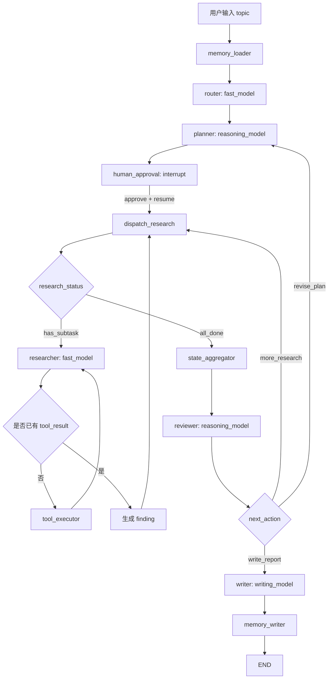

# 第38章-完整运行与结果分析

## 38.1 为什么完整案例不能只看最终报告

第 33 章到第 37 章，我们已经把智能研究助理 Agent 的主要结构搭出来了。

第 33 章从需求反推架构。

第 34 章解释为什么要拆成 Router、Planner、Researcher、Reviewer、Writer。

第 35 章定义 State 和模块边界。

第 36 章把 DeepSeek 接入不同模型角色。

第 37 章加入 checkpoint、thread、interrupt、恢复和重试。

现在看起来，完整案例已经可以运行。

但对复杂 Agent 来说，真正重要的不是最后得到一份报告。

真正重要的是：

```text
这份报告是怎么一步步生成的？
每个节点到底读了什么、写了什么？
模型在哪些地方参与了判断？
工具在哪些地方提供了资料？
checkpoint 和 interrupt 如何影响执行？
Reviewer 为什么允许进入 Writer？
```

如果只看最终报告，读者很容易把复杂 Agent 误解成：

```text
一个更长的 prompt。
一个更复杂的 chain。
一个会自动调用工具的黑盒。
```

但第八部分想训练的不是“怎么得到一段漂亮输出”。

而是训练一种架构能力：

> 能把复杂 Agent 的一次运行拆成可观察、可解释、可恢复、可扩展的执行轨迹。

所以本章采用“执行追踪复盘法”。

我们不从代码 API 开始，也不从最终报告开始。

我们从一次真实运行开始，一步步复盘：

```text
输入是什么？
状态如何变化？
节点为什么这样走？
模型和工具分别做了什么？
哪些字段决定了控制流？
最终报告如何从中间状态生成？
```

读完本章，读者应该能做到一件事：

> 面对一个复杂 Agent，不只会问“它答得好不好”，还会问“它的执行轨迹是否清楚，状态证据是否足够，模块协作是否稳定”。

## 38.2 本章要解决的问题

本章的核心问题是：

> 从输入到报告生成，状态、节点、模型、工具如何协作？

这个问题可以拆成六个更具体的问题。

第一，一次研究任务从用户输入到最终报告，会经过哪些节点？

第二，每个节点读取哪些 State 字段，写入哪些 State 字段？

第三，`fast_model`、`reasoning_model`、`writing_model` 分别在哪些地方参与？

第四，工具请求和工具结果如何进入 State，并进一步变成 `findings`？

第五，checkpoint、interrupt、retry 在完整运行中分别解决什么问题？

第六，如何用 streaming 观察这次运行，而不是等一个最终黑盒结果？

本章不会再设计新的模块。

它要做的是把已有模块“跑起来”，然后像复盘一次真实系统调用一样，把每一步摊开。

## 38.3 本次运行的输入

先设定一次具体运行。

用户输入：

```text
请研究 LangGraph 如何帮助复杂 Agent 应用做模块化架构设计。
重点关注：
1. 怎么拆分 Router、Planner、Researcher、Reviewer、Writer。
2. 共享 State 应该怎么设计。
3. 如何支持长任务恢复和人工审批。
4. 如何让未来业务扩展时不用推翻架构。
```

应用层给图传入初始 State：

```python
initial_state = {
    "topic": (
        "研究 LangGraph 如何帮助复杂 Agent 应用做模块化架构设计，"
        "重点关注 Router、Planner、Researcher、Reviewer、Writer 的拆分，"
        "共享 State 设计，长任务恢复和未来扩展能力。"
    ),
    "user_id": "user-001",
    "thread_id": "research-langgraph-agent-architecture-001",
    "max_retries": 2,
}
```

同时传入 LangGraph 配置：

```python
config = {
    "configurable": {
        "thread_id": "research-langgraph-agent-architecture-001"
    }
}
```

这里有两个 `thread_id`。

State 里的 `thread_id` 是业务可见字段。

`config.configurable.thread_id` 是 LangGraph 用来找到 checkpoint 执行线的标识。

这两个值最好保持一致。

否则业务系统看起来是同一个任务，但 LangGraph 恢复时可能找不到原来的暂停点。

## 38.4 执行总览图

这次完整运行可以用一张图表示。



这张图里有四类节点。

第一类是模型节点：

```text
router
planner
researcher
reviewer
writer
```

第二类是确定性控制节点：

```text
memory_loader
dispatch_research
state_aggregator
memory_writer
```

第三类是工具节点：

```text
tool_executor
```

第四类是人工介入节点：

```text
human_approval
```

复杂 Agent 的协作不是所有节点都调用模型。

相反，好的结构会让不同能力各就各位：

```text
模型负责理解、规划、提炼、审查和表达。
程序负责状态控制、子任务分发、工具执行和合并。
人类负责关键审批和高风险判断。
checkpoint 负责保存执行现场。
streaming 负责把过程变得可见。
```

## 38.5 运行追踪表：节点、模型、工具、状态更新

先看完整追踪表。

这张表是本章最重要的读法。

| 步骤 | 节点 | 使用能力 | 读取 State | 写入 State | 观察重点 |
| --- | --- | --- | --- | --- | --- |
| 1 | `memory_loader` | 记忆读取或固定偏好 | `user_id` | `user_preferences` | 用户偏好是否进入后续规划 |
| 2 | `router` | `fast_model` | `topic`, `user_preferences` | `task_type`, `route_reason` | 是否识别为架构研究 |
| 3 | `planner` | `reasoning_model` | `topic`, `task_type`, `user_preferences` | `research_plan`, `subtasks`, `approval_status` | 计划是否结构化、可执行 |
| 4 | `human_approval` | `interrupt` | `research_plan` | 暂停，等待 resume | 用户是否看到足够审批上下文 |
| 5 | `human_approval` 恢复 | 人类输入 | `Command(resume=...)` | `approval_status`, `approval_feedback`, `lifecycle_status` | 是否使用同一 `thread_id` |
| 6 | `dispatch_research` | 确定性规则 | `subtasks`, `completed_subtasks` | `active_subtask`, `research_status` | 是否选中下一个未完成子任务 |
| 7 | `researcher` | `fast_model` | `active_subtask`, `tool_results` | `tool_requests` 或 `findings` | 是生成工具请求，还是提炼发现 |
| 8 | `tool_executor` | 工具或模拟工具 | `tool_requests` | `tool_results`, `errors` | 工具结果是否可追溯到子任务 |
| 9 | `dispatch_research` 循环 | 确定性规则 | `completed_subtasks` | 下一个 `active_subtask` | 多个子任务是否按优先级完成 |
| 10 | `state_aggregator` | 规则或模型 | `findings`, `tool_results` | `synthesis`, `evidence_map` | 原始发现是否变成可审查结论 |
| 11 | `reviewer` | `reasoning_model` | `research_plan`, `synthesis`, `evidence_map` | `review_feedback`, `quality_status`, `next_action` | 是否通过质量闸门 |
| 12 | `writer` | `writing_model` | `synthesis`, `evidence_map`, `review_feedback` | `final_report`, `report_metadata` | 报告是否只基于已审查材料 |
| 13 | `memory_writer` | 记忆更新 | `final_report`, `review_feedback` | `memory_updates` | 哪些偏好沉淀到长期记忆 |

读这张表时，不要把重点放在“节点名字多不多”。

重点是看：

```text
每一步是否只写自己负责的字段。
每一次路由是否有明确状态字段支撑。
每个模型调用是否有清楚的角色。
每个工具结果是否能追溯来源。
```

这就是复杂 Agent 的可维护性。

## 38.6 初始 State：任务还没有开始

运行刚开始时，State 很短。

```python
{
    "topic": "研究 LangGraph 如何帮助复杂 Agent 应用做模块化架构设计...",
    "user_id": "user-001",
    "thread_id": "research-langgraph-agent-architecture-001",
    "max_retries": 2,
}
```

此时还没有：

```text
task_type
research_plan
tool_requests
tool_results
findings
synthesis
final_report
```

这很正常。

State 不是一开始就装满所有东西。

它会随着节点执行逐步生长。

复杂 Agent 的运行过程，本质上就是：

> 节点不断读取已有 State，写入新的结构化字段，让任务从模糊输入推进到可审查报告。

## 38.7 memory_loader 到 router：从用户偏好到任务类型

第一个节点是 `memory_loader`。

它读取：

```text
user_id
```

写入：

```python
{
    "user_preferences": {
        "preferred_style": "先讲问题，再讲架构决策，最后讲扩展",
        "focus": ["模块化", "可扩展性", "生产化"]
    },
    "execution_log": ["memory_loader 读取用户偏好"]
}
```

这一步看起来很小，但它会影响后面的 Planner 和 Writer。

同一个主题，如果用户偏好不同，计划和报告结构也应该不同。

然后进入 `router`。

Router 使用 `fast_model`。

它不需要写长文，也不需要复杂推理。

它只判断任务类型。

运行后 State 增加：

```python
{
    "task_type": "architecture_research",
    "route_reason": "用户关注复杂 Agent 的模块拆分、共享 State、恢复和未来扩展能力。",
    "execution_log": ["router 使用 fast_model 判断任务类型"]
}
```

这里最值得观察的是 `task_type`。

因为它会影响 Planner 的计划风格。

如果 Router 判断成 `concept_research`，Planner 可能会生成概念解释型计划。

如果判断成 `implementation_plan`，Planner 可能会偏向落地路线。

本次任务被判断为：

```text
architecture_research
```

这是合理的。

因为用户关心的是模块化、可扩展、长任务和未来业务架构。

## 38.8 planner 到 human_approval：计划生成、暂停、恢复

接下来进入 `planner`。

Planner 使用 `reasoning_model`。

它读取：

```text
topic
task_type
user_preferences
approval_feedback
review_feedback
```

第一次运行时，`approval_feedback` 和 `review_feedback` 通常为空。

Planner 写入一个结构化计划：

```python
{
    "research_plan": {
        "plan_id": "plan-v1",
        "goal": "研究 LangGraph 支持复杂 Agent 模块化架构设计的关键机制",
        "version": 1,
        "subtasks": [
            {
                "id": "module-boundary",
                "question": "为什么要拆分 Router、Planner、Researcher、Reviewer、Writer？",
                "expected_output": "模块职责与边界说明",
                "priority": 1
            },
            {
                "id": "state-design",
                "question": "共享 State 如何连接各模块并避免边界混乱？",
                "expected_output": "核心 State 字段与读写关系",
                "priority": 2
            },
            {
                "id": "long-task",
                "question": "checkpoint、thread、interrupt 如何支持长任务恢复和人工审批？",
                "expected_output": "长任务生命周期说明",
                "priority": 3
            },
            {
                "id": "future-extension",
                "question": "未来业务扩展时如何替换模型、工具和模块？",
                "expected_output": "可扩展架构建议",
                "priority": 4
            }
        ]
    },
    "plan_version": 1,
    "subtasks": [...],
    "approval_status": "pending",
    "lifecycle_status": "planned",
    "execution_log": ["planner 使用 reasoning_model 生成第 1 版计划"]
}
```

注意 Planner 不执行研究。

它也不生成最终报告。

它只把一个大主题拆成可执行子任务。

然后进入 `human_approval`。

这是本次运行第一次重要暂停。

`human_approval` 会调用 `interrupt()`，把审批 payload 交给应用层。

可以理解成：

```python
{
    "type": "plan_approval",
    "question": "请确认这个研究计划是否可以执行。",
    "topic": "...",
    "plan": {...},
    "options": ["approve", "revise", "reject"]
}
```

此时图不是失败，也不是完成。

它是暂停。

checkpoint 保存了执行现场。

用户批准后，应用层使用同一个 `thread_id` 恢复：

```python
graph.invoke(
    Command(
        resume={
            "action": "approve",
            "feedback": "计划可以执行，重点保留未来扩展分析。"
        }
    ),
    config=config,
)
```

恢复后，`human_approval` 写入：

```python
{
    "approval_status": "approved",
    "approval_feedback": "计划可以执行，重点保留未来扩展分析。",
    "lifecycle_status": "approved",
    "execution_log": ["human_approval 用户批准研究计划"]
}
```

这一步说明：

> 人类输入不是图外面的备注，而是通过 State 正式进入控制流。

后续条件边读取 `approval_status`。

因为它是 `approved`，图进入：

```text
dispatch_research
```

## 38.9 dispatch_research 到 tool_executor：子任务如何变成资料

`dispatch_research` 是一个很容易被低估的节点。

它不调用模型。

但它控制研究任务的节奏。

它读取：

```text
subtasks
completed_subtasks
```

第一次执行时，`completed_subtasks` 为空。

所以它选择优先级最高的子任务：

```python
{
    "active_subtask": {
        "id": "module-boundary",
        "question": "为什么要拆分 Router、Planner、Researcher、Reviewer、Writer？",
        "expected_output": "模块职责与边界说明",
        "priority": 1
    },
    "research_status": "has_subtask",
    "lifecycle_status": "running_research",
    "execution_log": ["dispatch_research 分发子任务：module-boundary"]
}
```

条件边读取 `research_status`。

如果是：

```text
has_subtask
```

就进入 `researcher`。

Researcher 读取：

```text
active_subtask
tool_results
```

此时还没有该子任务的工具结果。

所以 Researcher 使用 `fast_model` 把子任务改写成工具请求：

```python
{
    "tool_requests": [
        {
            "id": "tool-module-boundary",
            "subtask_id": "module-boundary",
            "tool_name": "search_docs",
            "query": "LangGraph complex agent architecture router planner researcher reviewer writer module boundaries",
            "purpose": "模块职责与边界说明"
        }
    ],
    "execution_log": ["researcher 为 module-boundary 生成工具请求"]
}
```

这里的边界非常重要。

Researcher 不直接搜索。

它只生成工具请求。

Tool Executor 读取 `tool_requests`，执行还没有执行过的请求。

教学案例里可以使用模拟工具：

```python
{
    "tool_results": [
        {
            "request_id": "tool-module-boundary",
            "subtask_id": "module-boundary",
            "tool_name": "search_docs",
            "status": "success",
            "content": "模拟资料：复杂 Agent 应通过 Router 分流、Planner 拆解任务、Researcher 执行资料收集、Reviewer 审查质量、Writer 生成最终表达。",
            "source_id": "source-module-boundary"
        }
    ],
    "execution_log": ["tool_executor 执行 1 个工具请求"]
}
```

真实项目里，这里可以替换成：

```text
搜索引擎。
文档检索。
知识库查询。
数据库查询。
内部 API。
```

只要输出仍然是 `tool_results`，Researcher 后续逻辑不用变。

这就是模块边界带来的可替换性。

## 38.10 researcher 到 state_aggregator：资料如何变成发现

Tool Executor 完成后，流程回到 `researcher`。

这一次 Researcher 发现：

```text
当前 active_subtask 已经有 tool_result。
```

所以它不再生成新的工具请求，而是把工具结果提炼成 `finding`。

```python
{
    "findings": [
        {
            "subtask_id": "module-boundary",
            "summary": (
                "复杂 Agent 不应该把路由、规划、研究、审查和写作混在一个大节点里。"
                "Router 负责判断任务类型，Planner 负责生成结构化计划，"
                "Researcher 负责把子任务转成工具请求和研究发现，"
                "Reviewer 负责质量闸门，Writer 只基于审查通过的结论生成报告。"
            ),
            "evidence_ids": ["source-module-boundary"]
        }
    ],
    "completed_subtasks": ["module-boundary"],
    "execution_log": ["researcher 完成子任务发现：module-boundary"]
}
```

这里发生了一个关键转换：

```text
tool_result -> finding
```

`tool_result` 是资料。

`finding` 是研究发现。

资料可以很碎。

发现必须回答子任务的问题。

如果跳过这一步，让 Writer 直接读 `tool_results`，最终报告会过度依赖 Writer 的临场整理能力。

Researcher 完成后回到 `dispatch_research`。

`dispatch_research` 继续选择下一个未完成子任务。

整个循环会重复多次：

```text
dispatch_research
-> researcher
-> tool_executor
-> researcher
-> dispatch_research
```

直到四个子任务都完成。

此时 State 里会有：

```python
{
    "completed_subtasks": [
        "module-boundary",
        "state-design",
        "long-task",
        "future-extension"
    ],
    "findings": [
        {"subtask_id": "module-boundary", "summary": "...", "evidence_ids": [...]},
        {"subtask_id": "state-design", "summary": "...", "evidence_ids": [...]},
        {"subtask_id": "long-task", "summary": "...", "evidence_ids": [...]},
        {"subtask_id": "future-extension", "summary": "...", "evidence_ids": [...]}
    ]
}
```

下一次 `dispatch_research` 找不到未完成子任务，就写入：

```python
{
    "research_status": "all_done",
    "execution_log": ["dispatch_research 所有子任务已完成"]
}
```

条件边读取 `research_status`，进入：

```text
state_aggregator
```

## 38.11 state_aggregator：把多条发现变成可审查结论

`state_aggregator` 是 Writer 之前最重要的准备节点。

它读取：

```text
subtasks
tool_results
findings
```

写入：

```text
synthesis
evidence_map
```

示例输出：

```python
{
    "synthesis": {
        "thesis": (
            "复杂 Agent 架构的核心不是把所有能力塞进一个大模型调用，"
            "而是用清晰 State 契约把路由、规划、研究、工具、审查、写作、恢复连接起来。"
        ),
        "key_points": [
            "模块拆分让每个节点只承担一种职责，降低未来替换成本。",
            "共享 State 是模块之间的合同，字段读写边界决定系统是否可维护。",
            "checkpoint、thread、interrupt 让研究任务能够暂停、审批和恢复。",
            "模型角色和工具执行解耦后，未来可以替换模型供应商或工具实现。"
        ],
        "gaps": []
    },
    "evidence_map": {
        "module-boundary": ["source-module-boundary"],
        "state-design": ["source-state-design"],
        "long-task": ["source-long-task"],
        "future-extension": ["source-future-extension"]
    },
    "execution_log": ["state_aggregator 聚合研究发现"]
}
```

这一步像是把研究材料整理成“报告骨架”。

它还不是最终报告。

但它已经具备三个条件：

```text
有中心论点。
有关键支撑点。
有证据映射。
```

Reviewer 可以审查这种结构。

Writer 也可以基于这种结构写作。

如果没有 Aggregator，Reviewer 只能面对一堆零散 findings。

审查会更困难，Writer 也更容易发散。

## 38.12 reviewer：质量闸门如何决定下一步

Reviewer 使用 `reasoning_model`。

它读取：

```text
topic
research_plan
synthesis
evidence_map
user_preferences
```

它要回答的问题不是：

```text
写得好不好？
```

而是：

```text
当前研究是否足够进入最终报告？
```

示例输出：

```python
{
    "review_feedback": {
        "passed": True,
        "issues": [],
        "suggestions": [
            "最终报告中需要明确说明 State 字段如何支撑模块边界。",
            "最终报告中需要单独说明未来扩展时哪些层可以替换。"
        ],
        "next_action": "write_report"
    },
    "quality_status": "approved",
    "next_action": "write_report",
    "execution_log": ["reviewer 使用 reasoning_model 完成质量审查"]
}
```

这里有一个重要设计：

```text
Reviewer 可以提出 suggestions，但仍然允许进入 Writer。
```

并不是有建议就一定要回退。

如果 `issues` 为空，说明资料足够。

`suggestions` 可以作为 Writer 的写作要求。

如果 Reviewer 发现问题，输出可能是：

```python
{
    "review_feedback": {
        "passed": False,
        "issues": ["缺少 future-extension 子任务的证据"],
        "suggestions": ["补充未来扩展方向的资料"],
        "next_action": "more_research"
    },
    "quality_status": "needs_revision",
    "next_action": "more_research"
}
```

这时条件边会把流程送回：

```text
dispatch_research
```

如果 Reviewer 认为计划本身有问题，则可以返回：

```text
next_action = revise_plan
```

流程回到 Planner。

这就是质量闸门的意义：

> Writer 不是天然有资格写报告，Writer 只有在 Reviewer 判断材料足够后才进入。

## 38.13 writer：最终报告如何由 State 生成

当 `next_action` 是 `write_report`，图进入 `writer`。

Writer 使用 `writing_model`。

它读取：

```text
topic
research_plan
synthesis
evidence_map
review_feedback
user_preferences
```

它不读取未整理的原始网页。

它也不生成新的 findings。

它只把已经审查过的状态组织成报告。

示例最终报告可以是：

```markdown
# LangGraph 如何支持复杂 Agent 的模块化架构设计

## 核心结论

复杂 Agent 的架构能力不来自单个强模型，而来自稳定的执行结构：
用 Router 分流任务，用 Planner 生成计划，用 Researcher 执行研究，
用 Tool Executor 隔离工具，用 Reviewer 做质量闸门，
用 Writer 生成最终表达，并用 State 把这些模块连接起来。

## 关键发现

1. Router、Planner、Researcher、Reviewer、Writer 的拆分，让系统从“一次性大 prompt”变成可替换模块。
2. 共享 State 是模块之间的合同，字段读写边界决定系统能否长期维护。
3. checkpoint、thread、interrupt 让长任务可以暂停、审批、恢复，而不是失败后从头再来。
4. 模型角色与工具执行解耦后，未来可以替换 DeepSeek、Ollama、搜索工具或知识库，而不推翻整体图结构。

## 架构建议

第一，把确定性控制和模型推理分开。

第二，把工具执行和研究解释分开。

第三，让 Reviewer 位于 Writer 之前，防止资料不足时直接生成顺滑但不可靠的报告。

第四，所有长期演进能力都围绕稳定 State 契约设计。

## 风险与限制

本次案例中的工具结果可以使用模拟数据帮助理解流程。
真实项目必须替换为可追溯的搜索、文档库或内部知识库，
并为工具失败、权限限制和资料缺口设计重试与人工处理路径。
```

Writer 同时写入报告元数据：

```python
{
    "report_metadata": {
        "plan_version": 1,
        "source_count": 4,
        "finding_count": 4
    },
    "lifecycle_status": "completed",
    "execution_log": ["writer 使用 writing_model 生成最终报告"]
}
```

报告元数据很有用。

它告诉我们：

```text
报告基于第几版计划。
用了多少工具来源。
汇总了多少研究发现。
```

这让最终报告不再是孤立文本，而是能回溯到执行过程。

## 38.14 checkpoint、interrupt、retry 在这次运行中分别出现在哪里

现在把第 37 章的长任务能力放回这次运行。

### checkpoint

checkpoint 在运行过程中保存执行现场。

最重要的保存点通常包括：

```text
planner 生成计划后。
human_approval interrupt 前后。
每轮工具执行和子任务完成后。
reviewer 产生 next_action 后。
writer 生成最终报告后。
```

checkpoint 的价值是：

```text
程序重启后可以恢复。
用户审批后可以继续。
失败后不必从头开始。
```

### interrupt

本次运行中最明确的 interrupt 是：

```text
human_approval
```

它把研究计划交给用户确认。

用户批准后，通过：

```python
Command(resume={"action": "approve", "feedback": "..."})
```

恢复同一条执行线。

以后也可以在工具权限失败处加入：

```text
human_tool_review
```

这说明 interrupt 不只适合审批计划，也适合处理高风险工具调用。

### retry

本次正常运行没有触发 retry。

但如果 `tool_executor` 超时，它会写入：

```python
{
    "errors": [
        {
            "node": "tool_executor",
            "error_type": "tool_timeout",
            "message": "search_docs timeout",
            "retryable": True
        }
    ]
}
```

然后条件边可能进入：

```text
increment_retry -> tool_executor
```

如果超过 `max_retries`，进入：

```text
mark_failed
```

这说明：

> retry 不是隐藏在工具函数内部的 while 循环，而是图里可观察的生命周期路径。

## 38.15 如何用 updates / values / custom / messages 观察这次运行

完整运行不能只靠 `print(result["final_report"])`。

更好的方式是用 streaming 观察执行过程。

### 用 updates 看每个节点写了什么

```python
for chunk in graph.stream(
    initial_state,
    config=config,
    stream_mode="updates",
):
    print(chunk)
```

你会看到类似：

```python
{"memory_loader": {"user_preferences": {...}}}
{"router": {"task_type": "architecture_research", "route_reason": "..."}}
{"planner": {"research_plan": {...}, "approval_status": "pending"}}
{"__interrupt__": (...)}
```

`updates` 最适合回答：

```text
哪个节点写了哪个字段？
字段是否按预期出现？
某个节点有没有越界写状态？
```

### 用 values 看完整 State 演化

```python
for state in graph.stream(
    initial_state,
    config=config,
    stream_mode="values",
):
    print(state)
```

`values` 适合调试：

```text
completed_subtasks 是否逐步增加？
tool_results 是否和 tool_requests 对应？
findings 是否被 reducer 追加？
final_report 出现前 synthesis 是否已经存在？
```

但 `values` 会输出完整 State。

如果 State 很大，生产环境不要一直开。

### 用 custom 给用户展示业务进度

节点内部可以发出自定义进度：

```python
from langgraph.config import get_stream_writer


def tool_executor(state: ResearchState) -> dict:
    writer = get_stream_writer()
    writer({
        "type": "progress",
        "node": "tool_executor",
        "message": "正在执行资料检索",
    })
    ...
```

用户界面可以显示：

```text
正在生成研究计划
等待你确认计划
正在研究：模块边界
正在整理研究发现
正在审查报告质量
正在生成最终报告
```

这比一个转圈动画更可信。

### 用 messages 只展示面向用户的模型输出

`messages` 可以流式展示模型 token。

但要注意：

```text
Router 的 JSON 输出不应该展示给用户。
Planner 的内部计划可以展示给审批界面，但不一定进入聊天气泡。
Writer 的最终报告适合流式展示。
```

所以真实项目里通常要按节点过滤。

例如只展示 `writer` 的输出 token。

这就是可观测性和产品体验的区别：

```text
开发者需要看得更多。
用户只需要看见对他有意义的过程。
```

## 38.16 最终报告逐段来源分析

现在反过来看最终报告。

一份可靠的报告，应该能追溯来源。

| 报告段落 | 主要来源 State | 说明 |
| --- | --- | --- |
| 标题 | `topic` | 来自用户输入 |
| 核心结论 | `synthesis.thesis` | 来自聚合后的中心论点 |
| 关键发现 | `synthesis.key_points` | 来自多个 `findings` 的合成 |
| 模块拆分建议 | `findings[module-boundary]` | 来自模块边界子任务 |
| State 设计建议 | `findings[state-design]` | 来自共享状态子任务 |
| 长任务恢复建议 | `findings[long-task]` | 来自 checkpoint / interrupt 子任务 |
| 未来扩展建议 | `findings[future-extension]` | 来自可扩展性子任务 |
| 风险与限制 | `review_feedback`, `synthesis.gaps`, `errors` | 来自审查反馈和运行风险 |
| 元数据 | `report_metadata` | 说明计划版本、来源数量、发现数量 |

这张表的意义很大。

它让 Writer 不再像一个凭空发挥的写手。

Writer 更像一个报告编辑器：

```text
根据已审查的 State，把已有结论组织成清楚表达。
```

如果某段报告找不到对应 State 来源，就要警惕。

它可能是模型发明出来的。

在复杂 Agent 应用里，这种“来源不明的顺滑表达”很危险。

所以报告生成后，至少要能回答：

```text
这段结论来自哪个 finding？
这个 finding 来自哪个 tool_result？
这个 tool_result 来自哪个 tool_request？
这个 tool_request 对应哪个 subtask？
这个 subtask 属于哪一版 plan？
```

这条链越清楚，系统越可信。

## 38.17 常见错误与排查

### 错误一：最终报告很好看，但不知道怎么来的

现象：

```text
final_report 很完整，但 State 里没有 synthesis、evidence_map 或 report_metadata。
```

问题：

```text
Writer 可能绕过了研究过程，直接根据 topic 生成了报告。
```

建议：

```text
检查 Writer prompt 和输入，只允许它基于 synthesis、evidence_map、review_feedback 写作。
```

### 错误二：Reviewer 通过了，但 findings 不完整

现象：

```text
completed_subtasks 少于 subtasks，Reviewer 仍然 next_action=write_report。
```

问题：

```text
Reviewer 没检查计划覆盖率，或 Aggregator 没把 gaps 写入 synthesis。
```

建议：

```text
让 state_aggregator 根据 subtasks 和 completed_subtasks 生成 gaps，Reviewer 必须读取 gaps。
```

### 错误三：工具结果和子任务对不上

现象：

```text
tool_results 有内容，但 Researcher 找不到当前子任务的结果。
```

问题：

```text
ToolResult 缺少 subtask_id，或 request_id 不一致。
```

建议：

```text
ToolRequest 和 ToolResult 都必须携带 subtask_id 和 request_id。
```

### 错误四：人工审批后从头执行

现象：

```text
用户批准后，Planner 又重新生成计划，或者图无法继续。
```

问题：

```text
恢复时 thread_id 不一致，或没有配置 checkpointer。
```

建议：

```text
启动和恢复使用同一个 config.configurable.thread_id，并确保 compile 时传入 checkpointer。
```

### 错误五：streaming 输出太吵

现象：

```text
前端看到大量内部 JSON、Router 输出和调试信息。
```

问题：

```text
把开发者观察事件直接展示给用户。
```

建议：

```text
用户界面用 custom 进度和 writer messages；开发调试再看 updates、values、debug。
```

### 错误六：循环卡在 researcher 和 tool_executor

现象：

```text
researcher 一直生成工具请求，tool_executor 一直执行。
```

问题：

```text
Researcher 判断“是否已有结果”的逻辑不稳定，或 Tool Executor 没记录已执行 request_id。
```

建议：

```text
用 request_id 去重，Researcher 按 active_subtask.subtask_id 查找相关 tool_results。
```

## 38.18 运行复盘清单

完成一次复杂 Agent 运行后，可以按这张清单复盘。

| 检查问题 | 应该查看 |
| --- | --- |
| 任务类型是否正确？ | `task_type`, `route_reason` |
| 计划是否可执行？ | `research_plan`, `subtasks`, `plan_version` |
| 用户是否批准了正确计划？ | interrupt payload, `approval_status`, `approval_feedback` |
| 子任务是否全部完成？ | `subtasks`, `completed_subtasks`, `research_status` |
| 工具调用是否可追溯？ | `tool_requests`, `tool_results`, `request_id`, `subtask_id` |
| 研究发现是否覆盖计划？ | `findings`, `synthesis.gaps` |
| 审查是否真正生效？ | `review_feedback`, `quality_status`, `next_action` |
| 报告是否基于已审查状态？ | `final_report`, `report_metadata`, `evidence_map` |
| 过程是否可恢复？ | `thread_id`, checkpoint, interrupt/resume |
| 过程是否可观察？ | `updates`, `values`, `custom`, `messages` |

这张清单可以用于本书案例。

也可以用于真实项目的 Agent 评审。

当一个团队说“我们的 Agent 已经跑通了”，不要只看 demo 输出。

应该继续问：

```text
能不能看执行轨迹？
能不能解释每个状态字段怎么来的？
能不能恢复中断任务？
能不能定位哪一步质量不足？
能不能替换模型或工具？
```

这些问题才真正考验复杂 Agent 架构。

## 38.19 本章小结

本章用“执行追踪复盘法”跑完了智能研究助理 Agent 的一次完整任务。

我们没有只展示最终报告。

而是按运行轨迹观察：

```text
memory_loader 读取用户偏好。
router 使用 fast_model 判断任务类型。
planner 使用 reasoning_model 生成结构化计划。
human_approval 通过 interrupt 暂停并等待用户批准。
dispatch_research 逐个分发子任务。
researcher 生成工具请求并提炼 findings。
tool_executor 执行工具请求并写入 tool_results。
state_aggregator 把 findings 合成 synthesis 和 evidence_map。
reviewer 使用 reasoning_model 判断是否可以写报告。
writer 使用 writing_model 生成最终报告。
memory_writer 沉淀长期偏好更新。
```

这一章最重要的结论是：

> 复杂 Agent 的可信度不只来自最终回答，而来自完整执行过程是否可观察、可解释、可恢复、可追溯。

如果读者能从一次运行中看清：

```text
状态如何演化。
节点如何协作。
模型何时参与。
工具如何提供证据。
人类如何审批。
checkpoint 如何恢复。
Reviewer 如何控制质量。
Writer 如何基于证据写作。
```

那么第八部分的案例就不只是一个 LangGraph 示例。

它会变成一种架构训练：

```text
面对真实业务需求时，如何把复杂 Agent 拆成稳定模块。
如何用 State 连接模块。
如何用执行轨迹检查系统。
如何为未来模型、工具、业务流程变化留下扩展空间。
```

下一章会进入第 39 章：从案例到生产化。

我们会讨论当这个智能研究助理从教学示例走向真实项目时，还需要补齐哪些能力：

```text
项目目录如何组织。
配置和密钥如何管理。
持久化 checkpointer 如何选择。
工具权限如何控制。
任务队列和并发如何设计。
监控、评测和部署如何落地。
```

