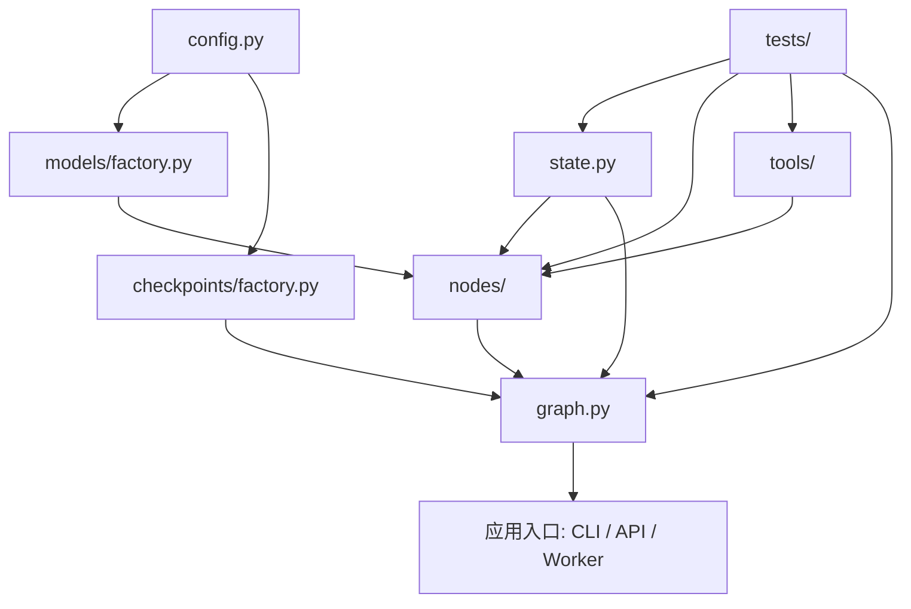

# 第22章-如何设计一个 LangGraph 项目结构

## 22.1 从一个能跑但越来越乱的 demo 开始

前面五个部分，我们已经学过 LangGraph 的核心概念和运行机制。

读者现在已经知道：

```text
State 保存工作记忆。
Node 完成一步工作。
Edge 决定下一步去哪里。
Reducer 合并状态更新。
Checkpoint 保存执行现场。
Thread 串起长期对话。
Interrupt 让人类介入。
Streaming 让运行过程可见。
```

这些概念放在小例子里都很清楚。

但真实项目一开始往往不是这样长出来的。

真实项目常常是从一个单文件 demo 开始的：

```text
先让它跑起来。
先把模型接上。
先把工具调通。
先把图编译出来。
先把输出打出来。
```

这没有错。

很多 LangGraph 项目的第一版都会像这样：

```text
demo.py
```

里面什么都有：

```python
import os
from typing import TypedDict

from langchain_ollama import ChatOllama
from langgraph.graph import END, START, StateGraph


llm = ChatOllama(model="qwen3:4b", temperature=0)


class ResearchState(TypedDict, total=False):
    question: str
    route: str
    plan: str
    search_query: str
    materials: list[str]
    draft: str
    answer: str
    error: str


def route_question(state: ResearchState) -> dict:
    prompt = (
        "请判断下面问题是否需要搜索资料。"
        "只回答 need_search 或 direct。\n\n"
        f"问题：{state['question']}"
    )
    route = llm.invoke(prompt).content.strip()
    return {"route": route}


def decide_next(state: ResearchState) -> str:
    if state.get("route") == "need_search":
        return "plan_search"
    return "answer_directly"


def plan_search(state: ResearchState) -> dict:
    prompt = f"请为下面的问题生成一个搜索关键词：{state['question']}"
    query = llm.invoke(prompt).content.strip()
    return {"search_query": query}


def search_web(state: ResearchState) -> dict:
    # 这里先用假数据模拟搜索结果。
    materials = [
        f"搜索关键词：{state['search_query']}",
        "资料1：LangGraph 使用 StateGraph 构建状态图。",
        "资料2：LangGraph 支持 checkpoint、interrupt 和 streaming。",
    ]
    return {"materials": materials}


def write_answer(state: ResearchState) -> dict:
    prompt = (
        "请根据资料回答问题。\n"
        f"问题：{state['question']}\n"
        f"资料：{state.get('materials', [])}"
    )
    answer = llm.invoke(prompt).content.strip()
    return {"answer": answer}


def answer_directly(state: ResearchState) -> dict:
    prompt = f"请直接回答这个问题：{state['question']}"
    answer = llm.invoke(prompt).content.strip()
    return {"answer": answer}


builder = StateGraph(ResearchState)
builder.add_node("route_question", route_question)
builder.add_node("plan_search", plan_search)
builder.add_node("search_web", search_web)
builder.add_node("write_answer", write_answer)
builder.add_node("answer_directly", answer_directly)

builder.add_edge(START, "route_question")
builder.add_conditional_edges(
    "route_question",
    decide_next,
    {
        "plan_search": "plan_search",
        "answer_directly": "answer_directly",
    },
)
builder.add_edge("plan_search", "search_web")
builder.add_edge("search_web", "write_answer")
builder.add_edge("write_answer", END)
builder.add_edge("answer_directly", END)

graph = builder.compile()


if __name__ == "__main__":
    result = graph.invoke({"question": "LangGraph 为什么适合构建 Agent？"})
    print(result["answer"])
```

这段代码能跑。

对学习 LangGraph 来说，它甚至很好：

- 一个文件就能看完整流程。
- State、Node、Edge 都在眼前。
- 不需要理解复杂目录结构。
- 修改起来很快。

但是，一旦这个 demo 继续长大，它就会开始变得危险。

## 22.2 单文件 demo 为什么会失控

假设这个 demo 要继续扩展。

产品提出几个新需求：

```text
搜索工具要换成真实网页搜索。
模型要支持 Ollama 和 DeepSeek 切换。
搜索失败要重试。
敏感问题要先走安全审查。
长任务要支持 checkpoint。
运行过程要 stream 给前端。
节点逻辑要写测试。
工具调用要限制权限和超时。
```

如果还把所有东西塞在 `demo.py` 里，文件很快会膨胀成这样：

```text
demo.py
  - State 定义
  - 模型初始化
  - prompt 模板
  - 节点函数
  - 工具函数
  - 路由函数
  - 错误处理
  - checkpoint 配置
  - streaming 配置
  - graph 编译
  - 命令行入口
  - 临时测试代码
```

这时问题不是“文件太长”这么简单。

真正的问题是边界消失了。

### 1. 状态字段会越来越混乱

一开始只有：

```python
question: str
answer: str
```

后来慢慢加：

```python
route: str
plan: str
materials: list[str]
tool_result: str
review_notes: str
retry_count: int
error: str
thread_summary: str
```

如果所有字段都写在同一个文件里，开发者很容易分不清：

```text
哪些字段是用户输入？
哪些字段是内部中间状态？
哪些字段会出现在最终输出？
哪些字段需要 checkpoint？
哪些字段只是某个节点的临时产物？
```

状态一乱，节点也会跟着乱。

### 2. 节点会偷偷依赖全局变量

单文件 demo 里经常这样写：

```python
llm = ChatOllama(model="qwen3:4b")


def write_answer(state):
    return {"answer": llm.invoke(...).content}
```

这在 demo 里很方便。

但测试时就麻烦了：

```text
我只想测试 write_answer 的 prompt 组织逻辑，
却被迫启动真实模型。
```

如果以后要切换 DeepSeek，也会发现节点内部已经和某个具体模型绑死。

### 3. 工具和节点边界会混在一起

工具调用通常有外部风险：

```text
网络请求可能失败。
文件读取可能越权。
数据库查询可能超时。
网页搜索可能返回脏数据。
命令执行可能有安全问题。
```

如果工具逻辑直接写在节点里，后面很难统一处理：

- 输入校验。
- 输出格式。
- 超时。
- 重试。
- 权限。
- 错误转换。
- 日志记录。

第 25 章会专门讲工具模块设计。本章先记住一点：

> 工具不是普通辅助函数。工具是 Agent 接触外部世界的边界。

### 4. 图结构会变得不可读

小图只有几个节点时，`builder.add_node` 和 `builder.add_edge` 写在底部还很清楚。

但真实 Agent 很容易长成这样：

```text
router
planner
researcher
tool_executor
reviewer
writer
memory_loader
memory_writer
human_approval
error_handler
fallback_answer
```

这时如果节点定义、路由函数、工具函数、图编译全部混在一起，你很难一眼看出：

```text
这个图的主流程是什么？
哪些是正常路径？
哪些是错误路径？
哪些节点会循环？
哪些节点是人工介入点？
```

### 5. 测试会被真实模型和真实工具拖住

如果项目结构没有拆开，测试往往只能这样写：

```python
result = graph.invoke({"question": "..."})
assert result["answer"]
```

这类测试当然有价值。

但它太重了。

它依赖真实模型、真实工具、真实网络和真实配置。

更好的测试应该能分层：

```text
单独测试 state schema。
单独测试路由函数。
单独测试节点读写字段。
用 fake model 测试节点。
用 fake tool 测试工具节点。
最后再测试完整 graph。
```

要做到这一点，项目结构必须先拆开。

## 22.3 本章目标

本章不追求给出唯一正确目录结构。

不同团队、不同项目规模、不同部署方式，目录都会有差异。

本章要建立的是一个工程化判断：

> LangGraph 项目结构的目的，不是让文件看起来整齐，而是让状态、节点、工具、模型、图编译、配置和测试各自有清晰边界。

读完本章，读者应该能回答这些问题：

| 问题 | 本章要建立的理解 |
| --- | --- |
| 单文件 demo 什么时候该拆？ | 当状态、节点、工具、配置、测试开始互相缠绕时 |
| LangGraph 项目通常拆成哪些模块？ | `state`、`nodes`、`tools`、`models`、`graphs`、`config`、`checkpoints`、`tests` |
| 图结构应该放在哪里？ | 放在专门的 graph builder / factory 模块里 |
| 节点是否应该直接初始化模型？ | 通常不应该，模型依赖最好从外部注入 |
| 工具为什么要单独成模块？ | 因为工具是外部世界边界，需要 schema、权限、超时和错误处理 |
| 测试目录如何对应项目结构？ | state、route、node、tool、graph 都可以分层测试 |

本章最重要的一句话是：

```text
项目结构要服务可理解性、可替换性和可测试性。
```

## 22.4 从单文件拆成第一版项目结构

先给出一个适合本书后续章节使用的基础结构。

假设我们要构建一个研究助手 Agent，可以这样组织：

```text
research_agent/
  __init__.py
  config.py
  state.py
  graph.py

  models/
    __init__.py
    factory.py

  nodes/
    __init__.py
    routing.py
    planning.py
    research.py
    writing.py

  tools/
    __init__.py
    search.py

  checkpoints/
    __init__.py
    factory.py

tests/
  test_routes.py
  test_nodes.py
  test_tools.py
  test_graph.py
```

这不是唯一答案，但它足够清楚。

每一层负责一类事情：

| 模块 | 职责 |
| --- | --- |
| `state.py` | 定义 State schema、输入输出类型、reducer |
| `nodes/` | 定义 LangGraph 节点函数 |
| `tools/` | 定义外部工具及其输入输出边界 |
| `models/` | 创建 Ollama、DeepSeek 等模型实例 |
| `graph.py` | 组装节点、边、条件路由并编译图 |
| `config.py` | 读取环境变量、模型名、超时、开关 |
| `checkpoints/` | 创建 Memory、SQLite、Postgres 等 checkpointer |
| `tests/` | 按模块测试 state、route、node、tool、graph |

用图表示：



这张图的重点是：

```text
graph.py 负责组装，不负责把所有实现细节都写进去。
nodes/ 负责节点逻辑，但不应该偷偷初始化所有外部依赖。
tools/ 负责外部能力边界。
tests/ 可以绕开完整图，直接测试每一层。
```

## 22.5 `state.py`：把 Agent 的工作记忆放在一个地方

单文件 demo 里，State 通常写在文件顶部。

工程化以后，State 应该独立出来。

例如：

```python
# research_agent/state.py

from typing import Annotated, TypedDict

from operator import add


class ResearchState(TypedDict, total=False):
    question: str
    route: str
    search_query: str
    materials: Annotated[list[str], add]
    draft: str
    answer: str
    error: str
```

这样做有三个好处。

第一，所有人都知道 Agent 状态在哪里看。

当一个新节点想写入 `materials`，它不用在整个项目里搜索字段定义。

第二，状态字段可以被审查。

你可以在 code review 时直接问：

```text
这个字段应该是输入、内部状态，还是输出？
它是否需要持久化？
它是否会被多个节点写入？
它是否需要 reducer？
```

第三，测试可以围绕 State 建立。

例如你可以单独测试 reducer 行为，确认多个节点写入 `materials` 时是追加而不是覆盖。

第 23 章会专门展开状态模块设计。本章先把原则立住：

> State 是 LangGraph 项目的数据契约，不应该散落在各个节点文件里。

## 22.6 `nodes/`：让每个节点成为可测试的步骤

节点模块可以按职责拆分。

例如：

```text
nodes/
  routing.py
  planning.py
  research.py
  writing.py
```

`routing.py` 里放路由节点和路由函数：

```python
# research_agent/nodes/routing.py

from research_agent.state import ResearchState


def route_question(state: ResearchState, model) -> dict:
    prompt = (
        "请判断下面问题是否需要搜索资料。"
        "只回答 need_search 或 direct。\n\n"
        f"问题：{state['question']}"
    )
    route = model.invoke(prompt).content.strip()
    return {"route": route}


def decide_after_route(state: ResearchState) -> str:
    if state.get("route") == "need_search":
        return "plan_search"
    return "answer_directly"
```

注意这里的 `route_question` 接收了 `model` 参数，而不是直接使用全局 `llm`。

真实接入 LangGraph 时，可以在 `graph.py` 里包一层：

```python
builder.add_node(
    "route_question",
    lambda state: route_question(state, model),
)
```

这样做的价值是测试更轻：

```python
class FakeModel:
    def invoke(self, prompt):
        return type("Response", (), {"content": "need_search"})()


def test_route_question():
    result = route_question(
        {"question": "LangGraph checkpoint 是什么？"},
        FakeModel(),
    )

    assert result == {"route": "need_search"}
```

这就是第六部分反复要强调的工程化收益：

```text
拆模块不是为了好看。
拆模块是为了不启动真实模型也能测试节点逻辑。
```

## 22.7 `tools/`：把外部世界隔离出来

工具模块可以从最简单的函数开始。

例如：

```python
# research_agent/tools/search.py


def search_docs(query: str) -> list[str]:
    return [
        f"搜索关键词：{query}",
        "资料1：LangGraph 使用 StateGraph 构建状态图。",
        "资料2：LangGraph 支持 checkpoint、interrupt 和 streaming。",
    ]
```

然后节点使用它：

```python
# research_agent/nodes/research.py

from research_agent.state import ResearchState
from research_agent.tools.search import search_docs


def search_web(state: ResearchState) -> dict:
    materials = search_docs(state["search_query"])
    return {"materials": materials}
```

这看起来只是把函数挪了个地方。

但它改变了项目边界。

以后真实搜索工具要加入这些能力时：

- 超时控制。
- API key。
- 输入清洗。
- 结果去重。
- 错误转换。
- 权限检查。
- 日志记录。

你可以优先在 `tools/search.py` 里处理，而不是污染节点。

节点只关心一件事：

```text
把 State 里的 search_query 交给工具，再把工具结果写回 State。
```

工具模块关心另一件事：

```text
如何安全、稳定、可控地访问外部能力。
```

这两个问题不应该混在一起。

## 22.8 `models/`：模型创建和节点逻辑分开

前面的章节里，为了让示例短小，我们常常这样写：

```python
llm = ChatOllama(model="qwen3:4b", temperature=0)
```

工程项目里，模型创建最好单独放到 `models/factory.py`。

例如：

```python
# research_agent/models/factory.py

from langchain_ollama import ChatOllama


def create_chat_model(model_name: str = "qwen3:4b"):
    return ChatOllama(
        model=model_name,
        temperature=0,
    )
```

如果后面要接 DeepSeek，可以继续扩展：

```python
def create_reasoning_model(provider: str):
    if provider == "ollama":
        return create_chat_model("qwen3:4b")
    if provider == "deepseek":
        return create_deepseek_model()
    raise ValueError(f"Unknown model provider: {provider}")
```

这样节点不需要知道：

```text
模型来自 Ollama 还是 DeepSeek。
API key 从哪里读。
temperature 怎么配置。
fallback 模型是谁。
```

节点只需要依赖一个“能 invoke 的模型对象”。

这会让第 26 章的 fallback、重试、错误处理更容易落地。

## 22.9 `graph.py`：图结构集中组装

现在看最关键的模块：`graph.py`。

它负责把 State、Node、Tool、Model、Checkpoint 组装成图。

一个简化版本可以这样写：

```python
# research_agent/graph.py

from langgraph.graph import END, START, StateGraph

from research_agent.models.factory import create_chat_model
from research_agent.nodes.planning import plan_search
from research_agent.nodes.research import search_web
from research_agent.nodes.routing import decide_after_route, route_question
from research_agent.nodes.writing import answer_directly, write_answer
from research_agent.state import ResearchState


def build_graph():
    model = create_chat_model()

    builder = StateGraph(ResearchState)

    builder.add_node(
        "route_question",
        lambda state: route_question(state, model),
    )
    builder.add_node(
        "plan_search",
        lambda state: plan_search(state, model),
    )
    builder.add_node("search_web", search_web)
    builder.add_node(
        "write_answer",
        lambda state: write_answer(state, model),
    )
    builder.add_node(
        "answer_directly",
        lambda state: answer_directly(state, model),
    )

    builder.add_edge(START, "route_question")
    builder.add_conditional_edges(
        "route_question",
        decide_after_route,
        {
            "plan_search": "plan_search",
            "answer_directly": "answer_directly",
        },
    )
    builder.add_edge("plan_search", "search_web")
    builder.add_edge("search_web", "write_answer")
    builder.add_edge("write_answer", END)
    builder.add_edge("answer_directly", END)

    return builder.compile()
```

`graph.py` 的理想状态是：

```text
读它能看懂整体流程。
但它不包含每个节点的全部业务细节。
```

它像装配车间。

State 在 `state.py`。

节点在 `nodes/`。

工具在 `tools/`。

模型在 `models/`。

`graph.py` 把它们接起来。

这让图结构本身变得可读：

```text
START
-> route_question
-> plan_search 或 answer_directly
-> search_web
-> write_answer
-> END
```

如果以后要看 Agent 主流程，不需要钻进每个节点实现里。

## 22.10 `config.py`：不要让环境变量散落各处

工程项目里，配置也容易失控。

一开始可能只是：

```python
model="qwen3:4b"
```

后来会出现：

```text
OLLAMA_MODEL
DEEPSEEK_API_KEY
SEARCH_API_KEY
DATABASE_URL
CHECKPOINT_BACKEND
STREAM_DEBUG
TOOL_TIMEOUT_SECONDS
MAX_RETRY_COUNT
```

如果每个文件都自己读环境变量，排查会很痛苦。

更好的方式是集中到 `config.py`：

```python
# research_agent/config.py

import os
from dataclasses import dataclass


@dataclass(frozen=True)
class Settings:
    ollama_model: str = "qwen3:4b"
    checkpoint_backend: str = "memory"
    tool_timeout_seconds: int = 10
    max_retry_count: int = 2


def load_settings() -> Settings:
    return Settings(
        ollama_model=os.getenv("OLLAMA_MODEL", "qwen3:4b"),
        checkpoint_backend=os.getenv("CHECKPOINT_BACKEND", "memory"),
        tool_timeout_seconds=int(os.getenv("TOOL_TIMEOUT_SECONDS", "10")),
        max_retry_count=int(os.getenv("MAX_RETRY_COUNT", "2")),
    )
```

然后模型工厂、工具模块、checkpoint 工厂都可以接收 `settings`。

这样项目会有一个清晰入口：

```text
配置从 config.py 进入系统。
不是在每个节点里随手 os.getenv。
```

## 22.11 `checkpoints/`：把持久化作为可替换能力

前面第 18 章和第 19 章讲过 checkpoint 与 thread。

在 demo 里，你可能直接这样写：

```python
from langgraph.checkpoint.memory import InMemorySaver

checkpointer = InMemorySaver()
graph = builder.compile(checkpointer=checkpointer)
```

工程化以后，可以把 checkpointer 创建放到工厂里：

```python
# research_agent/checkpoints/factory.py

from langgraph.checkpoint.memory import InMemorySaver


def create_checkpointer(backend: str = "memory"):
    if backend == "memory":
        return InMemorySaver()
    if backend == "none":
        return None
    raise ValueError(f"Unsupported checkpoint backend: {backend}")
```

然后在 `graph.py` 里：

```python
def build_graph(settings):
    checkpointer = create_checkpointer(settings.checkpoint_backend)
    ...
    return builder.compile(checkpointer=checkpointer)
```

这样以后从 Memory 换成 SQLite 或 Postgres 时，图结构不用大改。

更重要的是，测试时可以很容易选择：

```text
不使用 checkpointer。
使用 InMemorySaver。
使用临时 SQLite。
```

持久化不应该散落在节点里。

它属于图运行能力的一部分。

## 22.12 应用入口：CLI、API、Worker 不要和图定义混在一起

很多 demo 会把入口写在文件底部：

```python
if __name__ == "__main__":
    result = graph.invoke(...)
    print(result)
```

学习阶段没问题。

工程项目里，建议把应用入口和图定义分开。

例如 CLI 可以放在：

```text
scripts/run_research_agent.py
```

内容类似：

```python
from research_agent.config import load_settings
from research_agent.graph import build_graph


def main():
    settings = load_settings()
    graph = build_graph(settings)

    result = graph.invoke(
        {"question": "LangGraph 为什么适合构建 Agent？"},
        config={"configurable": {"thread_id": "demo-thread"}},
    )

    print(result["answer"])


if __name__ == "__main__":
    main()
```

如果以后要接 FastAPI、任务队列、命令行工具或定时任务，都可以复用同一个 `build_graph()`。

这条边界很重要：

```text
graph.py 定义图。
应用入口负责接收外部请求、调用图、返回结果。
```

不要让 `graph.py` 同时承担命令行交互、HTTP 请求处理、日志格式化和业务运行。

## 22.13 测试目录如何对应项目结构

一个好的项目结构，应该自然长出好的测试结构。

前面我们拆出了：

```text
state.py
nodes/
tools/
models/
graph.py
```

测试就可以对应拆：

```text
tests/
  test_routes.py
  test_nodes.py
  test_tools.py
  test_graph.py
```

例如路由函数测试：

```python
from research_agent.nodes.routing import decide_after_route


def test_decide_after_route_need_search():
    next_node = decide_after_route({"route": "need_search"})

    assert next_node == "plan_search"
```

节点测试：

```python
from research_agent.nodes.routing import route_question


class FakeModel:
    def invoke(self, prompt):
        return type("Response", (), {"content": "direct"})()


def test_route_question_with_fake_model():
    result = route_question(
        {"question": "什么是 LangGraph？"},
        FakeModel(),
    )

    assert result == {"route": "direct"}
```

工具测试：

```python
from research_agent.tools.search import search_docs


def test_search_docs_returns_materials():
    materials = search_docs("LangGraph checkpoint")

    assert len(materials) > 0
```

完整图测试可以少一些，但要保留：

```python
from research_agent.config import Settings
from research_agent.graph import build_graph


def test_graph_runs_with_minimal_input():
    graph = build_graph(Settings())

    result = graph.invoke({"question": "什么是 LangGraph？"})

    assert "answer" in result
```

第 27 章会系统讲测试。本章先强调一个原则：

> 如果一个 LangGraph 项目拆得好，测试就不会只能从完整 graph.invoke 开始。

## 22.14 目录结构不是越细越好

讲到这里，可能有人会误以为：

```text
工程化 = 文件越多越专业
```

不是。

过度拆分也会制造麻烦。

比如一个只有三个节点的小工具，如果一开始就拆成：

```text
interfaces/
services/
repositories/
adapters/
use_cases/
domain/
infrastructure/
```

读者会先被目录吓住。

LangGraph 项目结构应该跟复杂度一起长。

可以用下面的判断方式：

| 项目阶段 | 推荐结构 |
| --- | --- |
| 学习示例 | 单文件即可 |
| 3-5 个节点的小 demo | `state.py` + `graph.py` + `nodes.py` |
| 有模型、工具、测试 | 拆出 `nodes/`、`tools/`、`models/`、`tests/` |
| 有持久化和多入口 | 增加 `checkpoints/`、`config.py`、应用入口 |
| 多 Agent 或多子图 | 增加 `graphs/`、`subgraphs/`、按能力拆包 |

不要为了目录结构而目录结构。

更好的问题是：

```text
现在有什么东西已经变化太快？
什么东西需要被替换？
什么东西需要单独测试？
什么东西有外部风险？
什么东西一眼看不清了？
```

这些问题的答案，才决定该不该拆。

## 22.15 一个更完整的项目骨架

如果项目继续变复杂，可以升级成这样：

```text
research_agent/
  __init__.py

  config.py
  state.py
  graph.py

  graphs/
    __init__.py
    research_graph.py
    review_graph.py

  nodes/
    __init__.py
    routing.py
    planning.py
    research.py
    review.py
    writing.py
    memory.py

  tools/
    __init__.py
    search.py
    file_reader.py
    calculator.py

  models/
    __init__.py
    factory.py
    ollama.py
    deepseek.py

  checkpoints/
    __init__.py
    factory.py

  prompts/
    routing.md
    planning.md
    writing.md

  streaming/
    __init__.py
    events.py

scripts/
  run_research_agent.py

tests/
  test_state.py
  test_routes.py
  test_nodes.py
  test_tools.py
  test_graph.py
```

这里比前面的结构多了几个目录。

| 目录 | 什么时候需要 |
| --- | --- |
| `graphs/` | 项目里有多个图或子图 |
| `prompts/` | prompt 很长，需要独立管理和审查 |
| `streaming/` | 前端或监控需要稳定事件格式 |
| `memory.py` | 有长期记忆、用户偏好或 store 操作 |
| `review.py` | 有审查、评分、人工审批等独立流程 |

但不要一开始就全部创建。

本书后面的章节会沿着第六部分继续展开：

```text
第 23 章：状态模块怎么设计。
第 24 章：节点模块怎么设计。
第 25 章：工具模块怎么设计。
第 26 章：错误处理与重试怎么放进项目。
第 27 章：如何测试 LangGraph 应用。
```

第 22 章只是先把骨架立起来。

## 22.16 常见错误与排查

### 错误一：一开始就设计过重目录

现象：

```text
项目还只有一个简单图，却已经有十几个目录。
```

问题：

```text
读者和开发者需要在目录之间来回跳转，反而看不清主流程。
```

建议：

```text
先从 state.py、nodes.py、graph.py 开始。
等工具、模型、测试复杂起来，再拆出子目录。
```

### 错误二：graph.py 变成新的大杂烩

现象：

```text
虽然拆了目录，但所有节点实现还是写在 graph.py 里。
```

问题：

```text
graph.py 失去了“组装图结构”的作用，又变回 demo.py。
```

建议：

```text
graph.py 只保留 build_graph、节点注册和边定义。
节点实现放到 nodes/。
工具实现放到 tools/。
```

### 错误三：节点直接读环境变量

现象：

```python
def write_answer(state):
    model = os.getenv("MODEL")
    ...
```

问题：

```text
节点测试困难，配置来源混乱。
```

建议：

```text
把配置放到 config.py。
把模型创建放到 models/factory.py。
节点通过参数或运行时上下文拿依赖。
```

### 错误四：工具逻辑藏在节点内部

现象：

```text
search_web 节点里直接写网络请求、解析、重试、错误处理。
```

问题：

```text
工具无法单独测试，也无法统一限制权限和超时。
```

建议：

```text
把外部访问放到 tools/。
节点只负责 State 和工具之间的转换。
```

### 错误五：测试只能跑完整图

现象：

```text
所有测试都是 graph.invoke(...)。
```

问题：

```text
测试慢、不稳定、定位困难。
```

建议：

```text
把路由函数、节点函数、工具函数拆出来单测。
完整图测试只覆盖关键主路径。
```

## 22.17 设计项目结构时的检查清单

设计一个 LangGraph 项目结构时，可以用这张表检查：

| 检查问题 | 判断目的 |
| --- | --- |
| State 是否集中定义？ | 避免字段散落和状态契约不清 |
| 节点是否按职责拆分？ | 保持每一步可理解、可替换、可测试 |
| 工具是否独立成模块？ | 管理外部风险、超时、权限和错误 |
| 模型创建是否和节点分离？ | 支持 Ollama / DeepSeek 切换和 fake model 测试 |
| graph.py 是否只负责组装？ | 让主流程清晰可读 |
| 配置是否集中读取？ | 避免环境变量散落 |
| checkpoint 是否可替换？ | 支持测试、开发、生产不同后端 |
| 应用入口是否和图定义分开？ | 支持 CLI、API、Worker 复用同一图 |
| 测试是否能绕开真实模型？ | 提高速度和稳定性 |
| 目录是否匹配当前复杂度？ | 避免过度设计或继续混乱 |

这张表背后的核心判断是：

```text
每个模块都应该有一个明确理由。
```

如果一个目录说不清楚它保护了什么边界，可能暂时不需要。

如果一类代码已经让测试、替换、调试变难，就应该考虑拆出来。

## 22.18 小结：项目结构是复杂度的容器

本章从一个单文件 demo 开始。

它能跑，但随着需求增加，会逐渐暴露问题：

- State 字段混乱。
- 节点依赖全局变量。
- 工具和节点边界不清。
- 图结构不可读。
- 配置散落。
- 测试只能跑完整图。

然后我们把它拆成了一个更适合真实项目的结构：

```text
state.py
nodes/
tools/
models/
graph.py
config.py
checkpoints/
tests/
```

这套结构的目的不是显得专业，而是让 LangGraph 项目具备三种能力：

```text
可理解：读 graph.py 能看懂主流程，读 state.py 能看懂数据契约。
可替换：模型、工具、checkpoint 可以被替换。
可测试：节点、路由、工具和完整图可以分层测试。
```

读者应该记住这一句话：

> LangGraph 项目结构不是文件分类游戏，而是把 Agent 的状态、行为、外部能力和运行配置放进清晰边界里。

第六部分后面的章节会继续深入这些边界。

下一章先看最基础也最容易失控的一层：

```text
状态模块设计。
```

它要回答的问题是：

> 一个真实 LangGraph 项目里，State 应该如何分层，才能既表达 Agent 的工作记忆，又不让字段变成一团乱麻？
