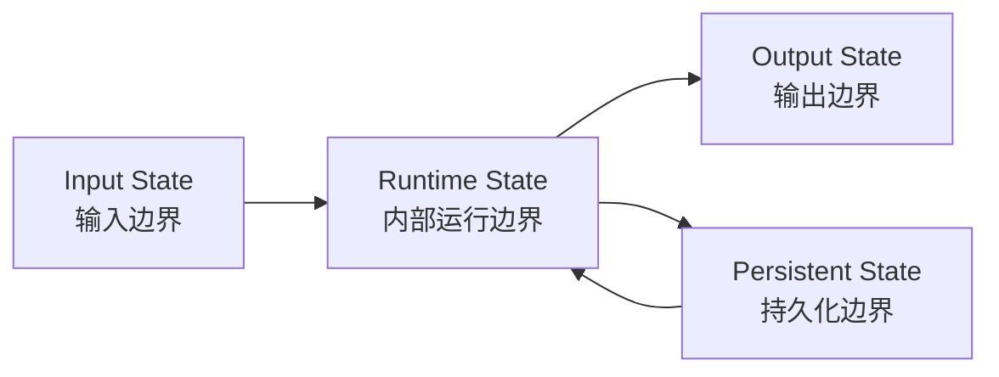

# 第23章-状态模块设计

## 23.1 从一个越来越臃肿的 State 开始

上一章我们把单文件 demo 拆成了一个更像真实项目的结构：

```text
state.py
nodes/
tools/
models/
graph.py
config.py
checkpoints/
tests/
```

这一章先看其中最核心的一层：

```text
state.py
```

在 LangGraph 项目里，State 很容易被低估。

初学时，State 看起来只是一个 `TypedDict`：

```python
class ResearchState(TypedDict, total=False):
    question: str
    answer: str
```

这很简单。

但只要 Agent 稍微复杂一点，State 就会开始膨胀：

```python
class ResearchState(TypedDict, total=False):
    question: str
    user_id: str
    thread_id: str

    route: str
    plan: str
    tasks: list[str]
    current_task: str
    search_query: str
    materials: list[str]
    tool_result: str
    draft: str
    review_notes: str
    answer: str

    error: str
    retry_count: int
    interrupted: bool
    approved: bool

    messages: list
    summary: str
    memory_items: list[str]
```

这段 State 不是不能用。

它甚至很真实。

真实 Agent 的状态就是会长出很多字段。

问题在于，如果我们只是不断往里面加字段，很快就会分不清：

```text
哪些字段来自用户输入？
哪些字段只是运行中间产物？
哪些字段应该作为最终输出返回？
哪些字段需要被 checkpoint 保存？
哪些字段可以丢弃？
哪些字段是给 UI 看？
哪些字段是给节点内部使用？
```

当这些边界不清楚时，State 就会从“Agent 的工作记忆”变成“所有东西的杂物箱”。

本章要解决的就是这个问题。

> 一个真实 LangGraph 项目里，State 字段应该如何分层，才能既表达 Agent 的工作记忆，又不让字段变成一团乱麻？

## 23.2 本章目标

本章不把状态模块写成 `TypedDict` 语法教程。

`TypedDict`、Pydantic、`MessagesState` 这些写法前面已经接触过。

这一章更关心工程边界：

```text
一个字段为什么应该进入 State？
它属于输入、内部运行、输出，还是持久化？
它应该被谁读取？
它应该被谁写入？
它应该覆盖、追加，还是聚合？
```

读完本章，读者应该能回答这些问题：

| 问题 | 本章要建立的理解 |
| --- | --- |
| State 是什么？ | Agent 运行过程里的共享数据契约 |
| 输入状态是什么？ | 用户或外部系统启动图时提供的字段 |
| 内部运行状态是什么？ | 节点之间协作需要的中间字段 |
| 输出状态是什么？ | 图运行结束后对调用方有意义的结果字段 |
| 持久化状态是什么？ | 需要 checkpoint、恢复、长期对话保留的字段 |
| 字段为什么不能随便加？ | 字段会形成模块契约，影响节点、测试、checkpoint 和 UI |
| reducer 和状态边界有什么关系？ | 多节点写同一字段时必须明确合并语义 |

本章最重要的心智模型是：

```text
State 不是一个大字典。
State 是 Agent 的数据边界图。
```

## 23.3 状态边界法：先问字段属于哪里

设计 State 时，不要一上来就写字段。

先把字段放到四个边界里：

```text
输入状态：外部传进来的任务信息。
内部运行状态：图执行中节点协作的中间产物。
输出状态：图最终要交给调用方的结果。
持久化状态：中断、恢复、多轮对话需要保留的执行现场。
```

可以画成这样：



这张图的意思是：

- 输入状态启动一次图执行。
- 内部运行状态支撑节点之间协作。
- 输出状态把结果交还给外部调用方。
- 持久化状态让图可以恢复、继续、回放或跨轮对话。

这四类状态会有重叠。

例如 `question` 既是输入字段，也可能需要被持久化。

`answer` 既是内部最后一个节点写入的字段，也是输出字段。

所以状态边界法不是让你创建四个完全隔离的 dict。

它是让你在设计每个字段时先问：

```text
这个字段从哪里来？
执行中谁会改它？
结束后谁需要它？
恢复时是否还需要它？
```

这四个问题，比字段名字本身更重要。

## 23.4 反例：把所有字段都塞进一个 State

先看一个不太好的状态设计。

```python
from typing import TypedDict


class ResearchState(TypedDict, total=False):
    question: str
    user_id: str
    route: str
    route_reason: str
    plan: str
    tasks: list[str]
    current_task: str
    search_query: str
    raw_search_results: list[str]
    materials: list[str]
    draft: str
    review_notes: str
    answer: str
    error: str
    retry_count: int
    approved: bool
    ui_message: str
    debug_info: dict
```

这段代码最大的问题不是字段多。

字段多在复杂 Agent 里很正常。

真正的问题是没有分层。

你很难从这段定义里看出：

| 字段 | 问题 |
| --- | --- |
| `question` | 是输入，是否也要持久化？ |
| `route` | 是内部路由字段，最终输出要不要暴露？ |
| `route_reason` | 是调试信息、审计信息，还是给用户看的解释？ |
| `raw_search_results` | 是否应该 checkpoint？会不会太大？ |
| `materials` | 多个搜索节点写入时是覆盖还是追加？ |
| `error` | 是当前错误、错误历史，还是最终失败原因？ |
| `ui_message` | UI 进度是否应该进入 State，还是用 streaming custom event？ |
| `debug_info` | 是否可能泄露敏感信息？ |

如果这些问题不回答清楚，后面节点就会随意读写字段。

最后项目里会出现这种情况：

```text
writer 节点读取 raw_search_results。
reviewer 节点修改 route。
tool 节点写 ui_message。
graph 输出完整 state 给前端。
checkpoint 里塞满 debug_info。
```

这时 bug 很难查。

不是因为 LangGraph 难，而是因为 State 失去了边界。

## 23.5 第一步：定义输入状态

输入状态是外部系统启动图时必须提供的字段。

例如研究助手 Agent 的输入可能只有：

```python
from typing import TypedDict


class ResearchInput(TypedDict):
    question: str
```

如果有用户身份和选项，可以加上：

```python
class ResearchInput(TypedDict, total=False):
    question: str
    user_id: str
    language: str
    max_results: int
```

输入状态设计要克制。

它应该只包含“调用方天然知道”的信息。

适合放在输入状态里的字段：

| 字段 | 原因 |
| --- | --- |
| `question` | 用户明确提出的问题 |
| `user_id` | 外部系统知道的用户身份 |
| `thread_id` | 恢复或多轮对话所需的执行线标识 |
| `language` | 用户选择或请求中给出的语言 |
| `max_results` | 调用方希望限制搜索结果数量 |

不适合放在输入状态里的字段：

| 字段 | 原因 |
| --- | --- |
| `route` | 应该由路由节点判断 |
| `plan` | 应该由 planner 节点生成 |
| `materials` | 应该由研究或工具节点产生 |
| `review_notes` | 应该由 reviewer 节点产生 |
| `retry_count` | 属于运行控制，不该由用户随意传入 |

一个简单判断是：

> 如果字段是 Agent 运行后才能知道的，就不要放进输入状态。

当然，外部系统可以传入配置项。

但配置项和运行中间产物要分清。

例如 `max_results` 是输入约束，`materials` 是运行产物。

这两个字段不能混为一谈。

## 23.6 第二步：定义内部运行状态

内部运行状态是节点之间协作需要的中间字段。

例如：

```python
from typing import Annotated, TypedDict
from operator import add


class ResearchRuntime(TypedDict, total=False):
    route: str
    plan: str
    search_query: str
    materials: Annotated[list[str], add]
    draft: str
    review_notes: str
    retry_count: int
    error: str
```

这些字段不是用户一开始提供的。

它们是在图执行过程中逐步产生的：

| 字段 | 产生节点 | 消费节点 |
| --- | --- | --- |
| `route` | `route_question` | 条件边、后续节点 |
| `plan` | `create_plan` | `plan_search`、`review_plan` |
| `search_query` | `plan_search` | `search_web` |
| `materials` | `search_web`、`read_file` | `write_draft`、`review_answer` |
| `draft` | `write_draft` | `review_draft` |
| `review_notes` | `review_draft` | `revise_answer` |
| `retry_count` | 错误处理节点 | 路由函数 |
| `error` | 任意失败节点 | 错误处理节点 |

这张表很重要。

每个内部字段都应该能说清：

```text
谁写它？
谁读它？
它的生命周期到哪里结束？
```

如果一个字段没人读，说明它可能不该进 State。

如果一个字段被很多节点读写，说明它可能需要重新拆分，或者需要明确 reducer。

内部运行状态是最容易膨胀的部分。

所以设计时要坚持一个原则：

> 只有跨节点共享的中间产物，才应该进入 State。

如果一个变量只在单个节点内部使用，就让它留在节点内部。

不要因为“以后可能有用”就把它写进 State。

## 23.7 第三步：定义输出状态

输出状态是图执行结束后，调用方真正关心的结果。

很多初学者会直接把完整 State 返回给前端。

这很方便，但不一定好。

完整 State 里可能包含：

- 内部路由结果。
- 工具原始返回。
- 审查意见。
- 错误重试次数。
- debug 信息。
- 中间草稿。
- 用户不该看到的材料。

所以最好明确输出边界。

例如：

```python
class ResearchOutput(TypedDict, total=False):
    answer: str
    sources: list[str]
    warnings: list[str]
```

输出状态设计要站在调用方角度。

调用方通常需要：

| 字段 | 说明 |
| --- | --- |
| `answer` | 最终回答 |
| `sources` | 引用来源或资料摘要 |
| `warnings` | 不完整、失败、低置信度等提示 |
| `metadata` | 可选的耗时、模型、token 等统计 |

调用方通常不需要：

| 字段 | 原因 |
| --- | --- |
| `route` | 这是内部控制流细节 |
| `draft` | 草稿不等于最终结果 |
| `raw_search_results` | 可能太大，也可能含有噪音 |
| `retry_count` | 不是用户关心的主结果 |
| `debug_info` | 可能泄露内部实现 |

可以在最后一个节点里生成输出字段：

```python
def finalize_output(state: ResearchState) -> dict:
    return {
        "answer": state["answer"],
        "sources": state.get("materials", []),
    }
```

也可以在 API 层从最终 State 里挑选字段返回。

关键是不要默认把完整 State 暴露给外部调用方。

> State 可以比输出丰富，但输出应该比 State 克制。

## 23.8 第四步：定义持久化状态

持久化状态是为了让图可以恢复、继续或长期对话。

前面第 18 章讲过 checkpoint。

如果图编译时配置了 checkpointer，LangGraph 会保存图执行过程中的状态快照。

这时就要问：

```text
哪些字段值得被保存？
哪些字段保存后有风险？
哪些字段太大，不适合长期保存？
哪些字段恢复时必须存在？
```

适合持久化的字段：

| 字段 | 原因 |
| --- | --- |
| `question` | 恢复时需要知道任务来源 |
| `plan` | 长任务恢复时不必重新规划 |
| `materials` | 已收集资料应该保留 |
| `answer` | 已生成结果可继续使用或审查 |
| `messages` | 多轮对话需要历史上下文 |
| `approved` | 人工审批状态影响恢复路径 |

需要谨慎持久化的字段：

| 字段 | 风险 |
| --- | --- |
| `raw_search_results` | 体积大、噪音多、可能含敏感内容 |
| `debug_info` | 可能泄露内部提示或工具细节 |
| `temporary_token` | 安全风险 |
| `ui_message` | 只是瞬时进度，不一定需要恢复 |
| `large_documents` | 可能让 checkpoint 过大 |

有些信息不适合放 State。

例如 UI 进度：

```text
正在搜索资料...
正在生成草稿...
正在等待人工确认...
```

这类信息更适合用 Streaming 的 `custom` event 输出，而不是写入 State。

原因很简单：

```text
它是瞬时事件，不是执行恢复所需的状态。
```

持久化状态设计的关键不是“全部保存”，而是：

> 保存恢复所需的事实，不保存一闪而过的过程噪音。

## 23.9 合并成一个完整 State

LangGraph 的 `StateGraph` 通常接收一个整体 State。

所以工程上常见做法是：

```python
from typing import Annotated, TypedDict
from operator import add


class ResearchState(TypedDict, total=False):
    # 输入边界
    question: str
    user_id: str
    language: str
    max_results: int

    # 内部运行边界
    route: str
    plan: str
    search_query: str
    materials: Annotated[list[str], add]
    draft: str
    review_notes: str
    retry_count: int
    error: str

    # 输出边界
    answer: str
    sources: list[str]
    warnings: list[str]

    # 持久化 / 恢复边界
    approved: bool
    messages: Annotated[list, add]
```

这里用注释把四类边界标出来。

对于中小项目，这已经足够。

如果项目更大，可以进一步拆成多个类型，再组合使用。

例如：

```python
class ResearchInput(TypedDict, total=False):
    question: str
    user_id: str
    language: str
    max_results: int


class ResearchOutput(TypedDict, total=False):
    answer: str
    sources: list[str]
    warnings: list[str]


class ResearchState(ResearchInput, ResearchOutput, total=False):
    route: str
    plan: str
    search_query: str
    materials: Annotated[list[str], add]
    draft: str
    review_notes: str
    retry_count: int
    error: str
    approved: bool
    messages: Annotated[list, add]
```

这种拆法的好处是：

```text
输入和输出边界更清楚。
完整 State 仍然可以给 StateGraph 使用。
```

不要为了类型漂亮而过度拆分。

但当字段变多时，把输入、输出、运行状态分开命名，会让项目更容易读。

## 23.10 字段命名：名字要暴露生命周期

State 字段命名不要太随意。

不好的名字：

```text
data
result
info
temp
content
output
```

这些名字太宽泛。

读者不知道它来自哪里，也不知道谁会用它。

更好的名字应该暴露产物和生命周期：

| 不清楚的名字 | 更清楚的名字 |
| --- | --- |
| `data` | `raw_search_results` |
| `result` | `tool_result` 或 `final_answer` |
| `info` | `user_profile` 或 `source_metadata` |
| `temp` | 不进入 State，留在节点局部变量 |
| `content` | `draft_answer` 或 `retrieved_content` |
| `output` | `answer` 或 `sources` |

命名时可以问：

```text
这是哪个阶段产生的？
它是原始数据，还是整理后的数据？
它是草稿，还是最终结果？
它是单个工具结果，还是聚合材料？
```

例如：

```text
raw_search_results
```

说明这是工具返回的原始结果。

```text
materials
```

说明这是清洗后可供写作使用的资料。

```text
draft_answer
```

说明它还不是最终回答。

```text
final_answer
```

说明它可以作为输出候选。

好的字段名会减少注释。

因为名字本身就在告诉读者：

```text
这个字段处在状态生命周期的哪个位置。
```

## 23.11 字段读写表：让 State 变得可审查

状态设计不能只看类型定义。

还要看字段读写关系。

对于一个真实项目，建议为关键 State 维护一张读写表。

例如：

| 字段 | 类型 | 写入者 | 读取者 | 边界 | 合并方式 |
| --- | --- | --- | --- | --- | --- |
| `question` | `str` | 外部输入 | 多数节点 | 输入 / 持久化 | 覆盖 |
| `route` | `str` | `route_question` | 条件边 | 内部运行 | 覆盖 |
| `plan` | `str` | `create_plan` | `plan_search` | 内部 / 持久化 | 覆盖 |
| `search_query` | `str` | `plan_search` | `search_web` | 内部运行 | 覆盖 |
| `materials` | `list[str]` | `search_web`、`read_file` | `write_draft` | 内部 / 持久化 | 追加 |
| `draft_answer` | `str` | `write_draft` | `review_draft` | 内部运行 | 覆盖 |
| `review_notes` | `str` | `review_draft` | `revise_answer` | 内部运行 | 覆盖 |
| `final_answer` | `str` | `revise_answer` | API 输出层 | 输出 | 覆盖 |
| `error` | `str` | 失败节点 | 错误处理节点 | 内部运行 | 覆盖 |

这张表的价值很大。

它能帮助你发现三类问题。

第一，没人读的字段。

```text
写入了，但没有节点读取。
```

这种字段要么是未来功能残留，要么应该移出 State。

第二，多人写但没有 reducer 的字段。

```text
多个节点都写 materials，但类型只是 list[str]。
```

这可能导致后写覆盖前写。

第三，输出边界不清的字段。

```text
final_answer 和 answer 同时存在，但不知道哪个应该返回给用户。
```

这会让 API 层和前端产生混乱。

字段读写表不一定要出现在最终代码里。

但在设计复杂 Agent 时，它非常值得写进文档或章节说明。

## 23.12 Reducer：字段合并语义也是状态设计的一部分

State 字段不只是类型。

还包括合并语义。

例如：

```python
materials: list[str]
```

这只能说明 `materials` 是字符串列表。

但它没有说明：

```text
多个节点写 materials 时，是覆盖还是追加？
```

如果两个节点都返回：

```python
{"materials": ["资料 A"]}
{"materials": ["资料 B"]}
```

你希望最终是：

```python
["资料 B"]
```

还是：

```python
["资料 A", "资料 B"]
```

如果希望追加，就应该明确 reducer：

```python
from typing import Annotated
from operator import add


class ResearchState(TypedDict, total=False):
    materials: Annotated[list[str], add]
```

对不同字段，合并语义可能不同：

| 字段 | 推荐合并方式 | 原因 |
| --- | --- | --- |
| `route` | 覆盖 | 每次路由只需要当前判断 |
| `plan` | 覆盖 | 最新计划代表当前计划 |
| `materials` | 追加或去重追加 | 多个工具可能产生多份资料 |
| `messages` | 追加 | 对话历史需要累积 |
| `error` | 覆盖或追加 | 当前错误覆盖，错误历史追加 |
| `retry_count` | 累加 | 记录重试次数 |
| `warnings` | 追加 | 多个节点可能产生多个警告 |

Reducer 不是第 10 章的旧知识。

到了工程化阶段，它变成状态模块设计的一部分。

因为它回答的是：

> 当多个模块共同写入同一个字段时，这个字段如何保持意义稳定？

## 23.13 错误状态：不要只放一个 `error`

很多项目一开始会这样设计：

```python
class ResearchState(TypedDict, total=False):
    error: str
```

这能用，但很快会不够。

真实 Agent 里，错误可能来自：

```text
模型调用失败。
工具超时。
JSON 解析失败。
用户拒绝审批。
达到最大重试次数。
外部 API 返回权限错误。
```

如果只有一个 `error` 字段，你很难判断下一步该怎么处理。

更好的做法是至少区分：

```python
class ResearchState(TypedDict, total=False):
    error_type: str
    error_message: str
    retry_count: int
    warnings: list[str]
```

或者保留错误历史：

```python
class ErrorRecord(TypedDict):
    node: str
    error_type: str
    message: str


class ResearchState(TypedDict, total=False):
    errors: Annotated[list[ErrorRecord], add]
    retry_count: int
```

这样错误处理节点才能判断：

```text
这是工具超时，可以重试。
这是权限错误，不该重试。
这是用户拒绝，应该结束。
这是模型格式错误，可以换 prompt 或 fallback 模型。
```

第 26 章会专门讲错误处理与重试。

本章先建立状态设计原则：

> 如果错误会影响路由，就不要只把它写成一段字符串。

错误也是状态。

而且是会驱动控制流的状态。

## 23.14 UI 状态、调试状态和业务状态要分开

有些字段看起来很方便，但不一定适合进入 State。

例如：

```python
ui_message: str
progress: int
debug_info: dict
```

这些字段要谨慎。

### UI 进度更适合 Streaming

如果你只是想告诉前端：

```text
正在搜索资料...
正在生成回答...
正在等待人工确认...
```

优先考虑 Streaming 的 `custom` event。

因为这些是事件，不是长期状态。

它们通常不需要 checkpoint。

### 调试信息不一定适合持久化

`debug_info` 很容易变成垃圾场。

里面可能塞：

```text
prompt 原文。
模型返回原文。
工具请求参数。
中间解析结果。
异常堆栈。
```

这些内容对开发调试有用，但不一定应该进入 State。

原因有三个：

- 可能很大。
- 可能泄露敏感信息。
- 可能让 checkpoint 变脏。

更好的做法是：

```text
运行时观察用 Streaming。
事后排查用日志和 trace。
恢复执行用 State。
```

这三者不要混在一起。

### 业务状态应该留在 State

真正应该进入 State 的，是会影响后续节点行为的事实。

例如：

```text
用户是否批准。
资料是否足够。
是否达到最大重试次数。
当前计划是什么。
最终回答是什么。
```

这些字段会影响图执行，所以它们应该进入 State。

判断标准可以很简单：

> 如果图恢复后还需要它来继续做决策，它就可能属于 State；如果只是展示一下过程，它更可能属于 Streaming 或日志。

## 23.15 状态模块的推荐写法

综合前面内容，一个中等规模项目的 `state.py` 可以这样写：

```python
# research_agent/state.py

from operator import add
from typing import Annotated, Literal, TypedDict


Route = Literal["direct", "need_search", "need_human_review", "failed"]


class ErrorRecord(TypedDict):
    node: str
    error_type: str
    message: str


class ResearchInput(TypedDict, total=False):
    question: str
    user_id: str
    language: str
    max_results: int


class ResearchOutput(TypedDict, total=False):
    final_answer: str
    sources: list[str]
    warnings: Annotated[list[str], add]


class ResearchState(ResearchInput, ResearchOutput, total=False):
    # 内部运行状态
    route: Route
    plan: str
    search_query: str
    materials: Annotated[list[str], add]
    draft_answer: str
    review_notes: str

    # 错误与恢复状态
    retry_count: int
    errors: Annotated[list[ErrorRecord], add]
    approved: bool
```

这段代码有几个特点。

第一，输入和输出有名字。

```text
ResearchInput
ResearchOutput
```

读者能立刻看出外部调用方需要提供什么、最终可能拿到什么。

第二，完整状态继承输入和输出。

```python
class ResearchState(ResearchInput, ResearchOutput, total=False):
    ...
```

这样 `StateGraph(ResearchState)` 仍然可以使用一个整体 State。

第三，关键字段有明确 Literal。

```python
Route = Literal["direct", "need_search", "need_human_review", "failed"]
```

这比任意字符串更容易测试和维护。

第四，多写入字段有 reducer。

```python
materials: Annotated[list[str], add]
errors: Annotated[list[ErrorRecord], add]
warnings: Annotated[list[str], add]
```

这让合并语义显式化。

## 23.16 State 和节点设计如何配合

State 不是孤立模块。

它会反过来影响节点设计。

一个节点应该能清楚说出：

```text
我读取哪些字段？
我写入哪些字段？
这些字段属于哪个状态边界？
```

例如：

```python
def plan_search(state: ResearchState, model) -> dict:
    prompt = f"请为下面的问题生成搜索关键词：{state['question']}"
    query = model.invoke(prompt).content.strip()

    return {"search_query": query}
```

它的读写关系是：

| 节点 | 读取 | 写入 |
| --- | --- | --- |
| `plan_search` | `question` | `search_query` |

这很清楚。

如果一个节点变成这样：

```python
def plan_search(state: ResearchState, model) -> dict:
    ...
    return {
        "search_query": query,
        "materials": [],
        "route": "need_search",
        "ui_message": "正在搜索",
        "debug_info": {...},
    }
```

就要警惕了。

它可能做了太多事情：

- 生成搜索词。
- 清空材料。
- 修改路由。
- 写 UI 进度。
- 写调试信息。

这时候问题可能不在节点，而在状态边界没有守住。

State 设计和 Node 设计是一对互相约束的东西。

好的 State 会让节点职责自然变清楚。

混乱的 State 会诱导节点随便读写。

## 23.17 State 和图输出如何配合

很多 LangGraph 示例会直接：

```python
result = graph.invoke(input_state)
print(result)
```

这对学习很好。

但真实应用里，通常要在 API 层或最后节点做输出过滤。

例如：

```python
def to_response(state: ResearchState) -> ResearchOutput:
    return {
        "final_answer": state["final_answer"],
        "sources": state.get("sources", []),
        "warnings": state.get("warnings", []),
    }
```

调用方看到的是：

```python
{
    "final_answer": "...",
    "sources": [...],
    "warnings": [],
}
```

而不是完整内部状态：

```python
{
    "question": "...",
    "route": "...",
    "plan": "...",
    "search_query": "...",
    "materials": [...],
    "draft_answer": "...",
    "review_notes": "...",
    "errors": [...],
    "final_answer": "...",
}
```

这条边界很重要。

因为 State 是 Agent 自己工作的桌面。

输出是给外部世界看的结果。

桌面上可以有草稿、资料、便签和工具。

交给用户的应该是整理后的答案。

## 23.18 常见错误与排查

### 错误一：所有字段都放在一个大 State 里但没有分区

现象：

```text
State 有几十个字段，但看不出哪些是输入、输出、内部状态。
```

问题：

```text
节点会随意读写字段，API 也可能误把内部状态返回给用户。
```

建议：

```text
至少用注释或类型拆出输入、内部运行、输出、持久化几类字段。
```

### 错误二：把节点局部变量写进 State

现象：

```text
State 里出现 temp、prompt、intermediate_text 等字段。
```

问题：

```text
这些字段只在一个节点内部使用，却污染了全局状态。
```

建议：

```text
只有跨节点共享、影响恢复或输出的字段才进入 State。
```

### 错误三：输出完整 State 给前端

现象：

```text
前端拿到 route、draft_answer、debug_info、raw_search_results 等内部字段。
```

问题：

```text
暴露内部实现，可能泄露敏感信息，也让前端依赖不稳定字段。
```

建议：

```text
定义 ResearchOutput，只返回 final_answer、sources、warnings 等稳定字段。
```

### 错误四：多节点写同一字段但没有 reducer

现象：

```text
多个工具都写 materials，但最终只保留了最后一个工具结果。
```

问题：

```text
字段合并语义不明确，后写覆盖前写。
```

建议：

```text
用 Annotated[list[str], add] 或自定义 reducer 明确追加、去重、聚合规则。
```

### 错误五：把 UI 进度写进 State

现象：

```text
State 里有 ui_message、progress_text，每一步都被覆盖。
```

问题：

```text
这些字段通常是瞬时事件，不是恢复所需状态。
```

建议：

```text
用 Streaming custom event 输出进度，把 State 留给业务事实和恢复现场。
```

### 错误六：错误字段太粗

现象：

```text
只有 error: str，路由函数不知道该重试、fallback 还是结束。
```

问题：

```text
错误信息无法驱动控制流。
```

建议：

```text
至少拆成 error_type、error_message、retry_count，复杂项目可用 errors 列表。
```

## 23.19 状态模块设计检查清单

设计或审查 `state.py` 时，可以用这张表：

| 检查问题 | 判断目的 |
| --- | --- |
| 哪些字段属于输入？ | 明确外部调用方必须提供什么 |
| 哪些字段属于内部运行？ | 明确节点之间共享哪些中间产物 |
| 哪些字段属于输出？ | 明确最终返回给调用方什么 |
| 哪些字段需要持久化？ | 支持 checkpoint、interrupt、恢复和长期对话 |
| 哪些字段不该进入 State？ | 避免局部变量、UI 事件、调试噪音污染状态 |
| 每个字段谁写入？ | 防止字段来源不明 |
| 每个字段谁读取？ | 找出无用字段或过度耦合 |
| 多写入字段是否有 reducer？ | 避免覆盖和合并错误 |
| 输出是否过滤内部字段？ | 防止泄露内部状态 |
| 错误字段是否能驱动路由？ | 支持重试、fallback、人工介入 |
| 字段名是否表达生命周期？ | 让读者能看出原始、草稿、最终、历史等区别 |

这张表可以直接用于 code review。

如果一个字段无法回答：

```text
它属于哪个边界？
谁写它？
谁读它？
是否需要持久化？
```

那它就不应该轻易进入 State。

## 23.20 小结：State 是 Agent 的数据契约

本章用“状态边界法”重新设计了 LangGraph 项目里的 State。

我们没有把 State 当成一个随手加字段的大字典，而是把字段分成四类：

```text
输入状态：外部启动图时提供的字段。
内部运行状态：节点之间协作的中间产物。
输出状态：图结束后返回给调用方的稳定结果。
持久化状态：checkpoint、恢复、中断和长期对话需要保留的现场。
```

然后我们进一步讨论了：

- 字段命名要表达生命周期。
- 字段读写表能让 State 可审查。
- reducer 是状态合并语义的一部分。
- 错误状态应该能驱动控制流。
- UI 进度和调试信息不应该随便进入 State。
- 输出应该过滤内部字段。

读者应该记住这一句话：

> State 不是 LangGraph 程序里的临时变量集合，而是 Agent 在节点、工具、模型、持久化和输出之间共享的数据契约。

第 22 章解决了项目结构边界。

本章解决了状态字段边界。

下一章会继续进入节点模块设计。

它要回答的问题是：

> 当 State 边界清楚以后，Node 应该如何组织，才能既读写状态清晰，又能脱离真实模型和工具单独测试？
