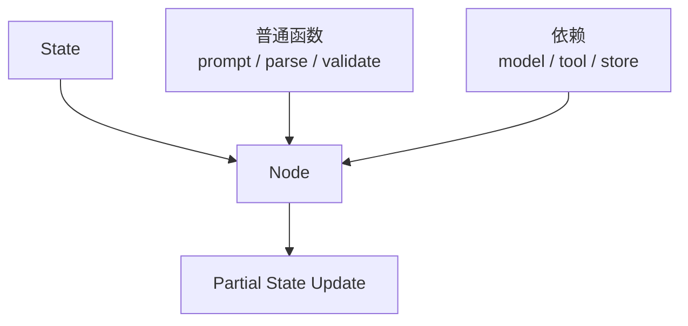

# 第24章-节点模块设计

## 24.1 从一个测不了的节点开始

上一章我们把 State 从“大字典”整理成了清晰的数据契约。

现在问题来到 Node。

State 回答的是：

```text
Agent 运行过程中共享什么数据？
```

Node 回答的是：

```text
谁读取这些数据，谁产生新的状态更新？
```

第 8 章已经讲过 Node 的基本设计：

> Node 读取 State，完成一步清晰的工作，返回 partial update。

这一章不重复讲“Node 是函数”。

第六部分更关心工程化问题：

> 节点怎么写，才能不依赖全局变量，并且可以脱离真实模型、真实工具、真实网络单独测试？

先看一个能跑但很难测试的节点。

```python
# research_agent/nodes/writing.py

from langchain_ollama import ChatOllama

from research_agent.state import ResearchState
from research_agent.tools.search import search_docs


llm = ChatOllama(model="qwen3:4b", temperature=0)


def write_answer(state: ResearchState) -> dict:
    query = state["search_query"]
    materials = search_docs(query)

    prompt = (
        "请根据资料回答问题。\n"
        f"问题：{state['question']}\n"
        f"资料：{materials}"
    )

    response = llm.invoke(prompt)

    return {
        "materials": materials,
        "final_answer": response.content.strip(),
    }
```

这段代码可以运行。

但如果你想给它写测试，会立刻遇到几个问题：

```text
测试会启动真实 Ollama 模型。
测试会调用真实 search_docs。
测试结果依赖模型输出，难以稳定断言。
节点同时做了搜索、拼 prompt、调用模型、写 State。
失败时很难判断是搜索错了、prompt 错了，还是模型返回错了。
```

这就是本章要处理的困境。

节点不是只要“能跑”就够。

真实项目里的节点还要：

- 可单独测试。
- 可替换模型。
- 可替换工具。
- 可观察读写字段。
- 可定位失败原因。
- 可在图里组装，也可在测试里直接调用。

## 24.2 本章目标

本章采用“可测试性倒推法”。

也就是先问：

```text
我希望怎样测试这个节点？
```

再倒推：

```text
节点应该如何接收依赖？
内部逻辑应该如何拆分？
哪些东西应该留在节点里？
哪些东西应该变成普通函数？
哪些东西应该放到 tools 或 models 模块？
```

读完本章，读者应该能回答这些问题：

| 问题 | 本章要建立的理解 |
| --- | --- |
| 为什么节点不要直接依赖全局模型？ | 全局依赖让测试慢、不稳定，也让模型切换困难 |
| 节点应该如何接收模型和工具？ | 通过参数、闭包、工厂函数或运行时上下文注入 |
| 什么是薄 Node？ | Node 负责连接 State 和依赖，核心逻辑尽量可单独测试 |
| 普通函数和 Node 如何配合？ | 普通函数处理纯逻辑，Node 负责读取 State、调用依赖、返回 update |
| 节点测试应该断言什么？ | 断言读写字段、路由结果、prompt 输入、状态更新，而不是依赖真实 LLM 内容 |
| 节点模块应该怎么组织？ | 按职责拆成 routing、planning、research、writing、review 等模块 |

本章最重要的一句话是：

```text
一个好节点，不是只能被 graph.invoke 间接执行，而是可以被测试直接调用。
```

## 24.3 可测试性倒推：先写想要的测试

不要急着改节点。

先想象我们希望怎样测试 `write_answer`。

理想测试应该像这样：

```python
def test_write_answer_uses_materials_and_returns_final_answer():
    model = FakeModel("这是最终回答")

    result = write_answer(
        {
            "question": "LangGraph 为什么适合 Agent？",
            "materials": ["资料1", "资料2"],
        },
        model=model,
    )

    assert result == {"final_answer": "这是最终回答"}
    assert "资料1" in model.last_prompt
    assert "LangGraph 为什么适合 Agent？" in model.last_prompt
```

这段测试没有启动 Ollama。

没有调用真实网络。

没有依赖模型“刚好生成某句话”。

它只验证几件事：

```text
节点读取了 question 和 materials。
节点把这些字段放进 prompt。
节点调用了传入的 model。
节点返回 final_answer。
```

为了让这个测试成立，节点就必须改成这样：

```python
def write_answer(state: ResearchState, model) -> dict:
    prompt = build_answer_prompt(
        question=state["question"],
        materials=state.get("materials", []),
    )
    response = model.invoke(prompt)

    return {"final_answer": response.content.strip()}
```

再把 prompt 组织拆成普通函数：

```python
def build_answer_prompt(question: str, materials: list[str]) -> str:
    return (
        "请根据资料回答问题。\n"
        f"问题：{question}\n"
        f"资料：{materials}"
    )
```

这就是可测试性倒推法。

不是先争论“要不要依赖注入”，而是先问：

```text
如果我想不启动真实模型就测试这个节点，它必须长什么样？
```

答案自然会把我们推向更好的节点设计。

## 24.4 反例：全局依赖节点

再看一个典型反例。

```python
from langchain_ollama import ChatOllama

from research_agent.tools.search import search_docs


llm = ChatOllama(model="qwen3:4b", temperature=0)


def plan_and_search(state):
    prompt = f"请为问题生成搜索关键词：{state['question']}"
    query = llm.invoke(prompt).content.strip()

    materials = search_docs(query)

    return {
        "search_query": query,
        "materials": materials,
    }
```

这个节点混在一起做了三件事：

```text
调用模型生成搜索词。
调用工具搜索资料。
把两个结果写回 State。
```

它的问题有四个。

第一，依赖被藏起来了。

测试代码看不到 `llm` 和 `search_docs` 是从哪里来的，除非去 patch 模块全局变量。

第二，节点职责太大。

如果搜索失败，`search_query` 是否还应该写入 State？

如果模型生成了空关键词，是模型节点的问题，还是工具节点的问题？

第三，测试会变慢。

每个测试都可能启动模型和工具。

第四，复用困难。

如果另一个图也想复用“生成搜索关键词”这一步，就必须连搜索工具一起带走。

这类节点在 demo 里很自然。

但在工程项目里，它会让测试和维护慢慢变重。

## 24.5 第一步：把一个大节点拆成两个节点

上面的 `plan_and_search` 更适合拆成两个节点：

```text
plan_search
-> search_materials
```

`plan_search` 只负责生成搜索词：

```python
def plan_search(state: ResearchState, model) -> dict:
    prompt = build_search_query_prompt(state["question"])
    response = model.invoke(prompt)

    return {"search_query": response.content.strip()}
```

`search_materials` 只负责调用搜索工具：

```python
def search_materials(state: ResearchState, search_tool) -> dict:
    materials = search_tool(state["search_query"])

    return {"materials": materials}
```

图结构里再连接它们：

```python
builder.add_node(
    "plan_search",
    lambda state: plan_search(state, model),
)
builder.add_node(
    "search_materials",
    lambda state: search_materials(state, search_tool),
)

builder.add_edge("plan_search", "search_materials")
```

这次拆分的依据不是“代码行数”。

而是测试边界：

| 节点 | 依赖 | 可以怎么测 |
| --- | --- | --- |
| `plan_search` | model | 用 FakeModel 测 prompt 和 `search_query` |
| `search_materials` | search_tool | 用 fake search function 测 `materials` |

拆完以后，如果搜索失败，不会影响我们测试“搜索关键词生成”。

如果模型输出异常，也不会影响我们测试搜索工具调用。

这就是可测试性倒推出来的节点粒度。

## 24.6 第二步：把纯逻辑拆成普通函数

不是所有逻辑都应该放进 Node。

例如 prompt 组织：

```python
def build_search_query_prompt(question: str) -> str:
    return (
        "请为下面的问题生成一个适合搜索资料的关键词。"
        "只输出关键词，不要解释。\n\n"
        f"问题：{question}"
    )
```

这个函数不依赖 LangGraph。

不依赖 State。

不依赖模型。

所以它可以直接测试：

```python
def test_build_search_query_prompt_contains_question():
    prompt = build_search_query_prompt("LangGraph checkpoint 是什么？")

    assert "LangGraph checkpoint 是什么？" in prompt
    assert "只输出关键词" in prompt
```

再看解析逻辑：

```python
def normalize_route(text: str) -> str:
    value = text.strip().lower()

    if value in {"direct", "need_search", "need_human_review"}:
        return value

    return "need_human_review"
```

它也不需要成为 Node。

它只是普通业务规则。

Node 可以调用它：

```python
def route_question(state: ResearchState, model) -> dict:
    prompt = build_route_prompt(state["question"])
    response = model.invoke(prompt)

    return {"route": normalize_route(response.content)}
```

这种结构很稳：

```text
普通函数负责纯逻辑。
Node 负责连接 State、依赖和状态更新。
Graph 负责把 Node 接成流程。
```

用图表示：



这样 Node 不会变成厚重的大函数。

## 24.7 第三步：通过参数注入依赖

节点不要偷偷创建模型。

更好的做法是让依赖从外部传进来。

例如：

```python
def write_answer(state: ResearchState, model) -> dict:
    prompt = build_answer_prompt(
        question=state["question"],
        materials=state.get("materials", []),
    )
    response = model.invoke(prompt)

    return {"final_answer": response.content.strip()}
```

在 `graph.py` 里绑定真实模型：

```python
def build_graph(settings):
    model = create_chat_model(settings)

    builder = StateGraph(ResearchState)
    builder.add_node(
        "write_answer",
        lambda state: write_answer(state, model),
    )

    return builder.compile()
```

在测试里绑定假模型：

```python
class FakeModel:
    def __init__(self, content: str):
        self.content = content
        self.last_prompt = ""

    def invoke(self, prompt: str):
        self.last_prompt = prompt
        return type("Response", (), {"content": self.content})()
```

然后测试：

```python
def test_write_answer_with_fake_model():
    model = FakeModel("最终回答")

    result = write_answer(
        {
            "question": "LangGraph 是什么？",
            "materials": ["资料 A"],
        },
        model,
    )

    assert result == {"final_answer": "最终回答"}
    assert "资料 A" in model.last_prompt
```

这就是最简单的依赖注入。

不需要复杂框架。

只要节点不要自己创建依赖，测试就轻很多。

## 24.8 第四步：用节点工厂减少 lambda 噪音

上一节的写法会在 `graph.py` 里出现很多 lambda：

```python
builder.add_node(
    "route_question",
    lambda state: route_question(state, model),
)
builder.add_node(
    "write_answer",
    lambda state: write_answer(state, model),
)
builder.add_node(
    "search_materials",
    lambda state: search_materials(state, search_tool),
)
```

项目小的时候没问题。

节点多了以后，可以用节点工厂。

```python
def make_write_answer_node(model):
    def write_answer_node(state: ResearchState) -> dict:
        return write_answer(state, model)

    return write_answer_node
```

`graph.py` 里就变成：

```python
builder.add_node("write_answer", make_write_answer_node(model))
```

搜索节点也可以这样写：

```python
def make_search_materials_node(search_tool):
    def search_materials_node(state: ResearchState) -> dict:
        return search_materials(state, search_tool)

    return search_materials_node
```

这种写法的好处是：

```text
graph.py 更像装配图。
nodes/ 模块自己负责把依赖包装成 LangGraph 可调用节点。
测试仍然可以直接测核心函数。
```

要注意：节点工厂不是必须的。

如果 lambda 足够清楚，就不需要急着抽象。

但当多个节点都需要绑定 model、tool、store、settings 时，节点工厂会让代码更干净。

## 24.9 第五步：把节点按职责放进模块

第 22 章给过一个基础目录：

```text
nodes/
  routing.py
  planning.py
  research.py
  writing.py
```

现在可以更具体地看每个模块放什么。

### `routing.py`

负责分类、路由和分支决策。

```text
build_route_prompt
normalize_route
route_question
decide_after_route
make_route_question_node
```

路由模块通常既有 Node，也有普通路由函数。

例如：

```python
def decide_after_route(state: ResearchState) -> str:
    if state.get("route") == "direct":
        return "write_direct_answer"
    if state.get("route") == "need_search":
        return "plan_search"
    return "human_review"
```

这个函数不调用模型，也不调用工具。

它应该非常容易测试。

### `planning.py`

负责计划、拆任务、生成搜索词。

```text
build_search_query_prompt
plan_search
make_plan_search_node
```

### `research.py`

负责检索、读取资料、整理材料。

```text
search_materials
clean_materials
make_search_materials_node
```

### `writing.py`

负责生成草稿、修改回答、产出最终答案。

```text
build_answer_prompt
write_answer
revise_answer
finalize_output
```

### `review.py`

负责审查质量、判断是否需要重试或人工介入。

```text
review_answer
parse_review_result
decide_after_review
```

这种拆法的依据不是“技术类型”，而是 Agent 工作阶段。

读者打开 `nodes/writing.py`，应该能预期里面都是写作相关节点。

打开 `nodes/routing.py`，应该能找到路由判断。

## 24.10 节点文件内部的推荐结构

一个节点文件可以按这个顺序组织：

```text
1. 普通纯函数
2. 解析和校验函数
3. 核心节点函数
4. 节点工厂函数
```

例如 `nodes/routing.py`：

```python
from typing import Literal

from research_agent.state import ResearchState


Route = Literal["direct", "need_search", "need_human_review"]


def build_route_prompt(question: str) -> str:
    return (
        "请判断下面问题应该如何处理。"
        "只回答 direct、need_search 或 need_human_review。\n\n"
        f"问题：{question}"
    )


def normalize_route(text: str) -> Route:
    route = text.strip().lower()

    if route in {"direct", "need_search", "need_human_review"}:
        return route

    return "need_human_review"


def route_question(state: ResearchState, model) -> dict:
    prompt = build_route_prompt(state["question"])
    response = model.invoke(prompt)

    return {"route": normalize_route(response.content)}


def decide_after_route(state: ResearchState) -> str:
    if state.get("route") == "direct":
        return "write_direct_answer"
    if state.get("route") == "need_search":
        return "plan_search"
    return "human_review"


def make_route_question_node(model):
    def route_question_node(state: ResearchState) -> dict:
        return route_question(state, model)

    return route_question_node
```

这个文件有一个明显优点：

```text
每一层都可以单独测试。
```

测试 prompt：

```python
def test_build_route_prompt_contains_question():
    prompt = build_route_prompt("什么是 LangGraph？")

    assert "什么是 LangGraph？" in prompt
```

测试解析：

```python
def test_normalize_route_fallbacks_to_human_review():
    assert normalize_route("???") == "need_human_review"
```

测试节点：

```python
def test_route_question_returns_normalized_route():
    model = FakeModel(" NEED_SEARCH ")

    result = route_question({"question": "LangGraph checkpoint 是什么？"}, model)

    assert result == {"route": "need_search"}
```

测试路由函数：

```python
def test_decide_after_route():
    assert decide_after_route({"route": "direct"}) == "write_direct_answer"
```

这就是节点模块设计的理想状态。

不是所有代码都必须这么细。

但关键节点、路由节点、工具节点，值得这样写。

## 24.11 节点的输入输出契约

一个节点应该清楚声明自己读什么、写什么。

可以在章节、注释或测试里表达。

例如：

| 节点 | 读取字段 | 写入字段 | 依赖 |
| --- | --- | --- | --- |
| `route_question` | `question` | `route` | model |
| `plan_search` | `question` | `search_query` | model |
| `search_materials` | `search_query` | `materials` | search_tool |
| `write_answer` | `question`、`materials` | `final_answer` | model |
| `review_answer` | `final_answer`、`materials` | `review_notes`、`warnings` | model |

这张表能直接变成测试计划。

例如 `search_materials` 的测试不需要关心 `question`：

```python
def test_search_materials_reads_search_query():
    called_with = []

    def fake_search_tool(query):
        called_with.append(query)
        return ["资料 A"]

    result = search_materials(
        {"search_query": "LangGraph checkpoint"},
        fake_search_tool,
    )

    assert called_with == ["LangGraph checkpoint"]
    assert result == {"materials": ["资料 A"]}
```

如果一个节点的读写表变成：

```text
读取 12 个字段，写入 8 个字段，依赖 4 个外部服务。
```

这通常说明它太大了。

要么拆节点。

要么拆普通函数。

要么重新审查 State 边界。

## 24.12 节点不应该做什么

为了保持节点可测试，下面这些事情要谨慎。

### 1. 不要在节点内部创建模型

不推荐：

```python
def write_answer(state):
    model = ChatOllama(model="qwen3:4b")
    ...
```

问题：

```text
测试无法替换模型。
模型配置散落在节点里。
每次调用都可能重复初始化。
```

推荐：

```python
def write_answer(state, model):
    ...
```

### 2. 不要在节点内部读取环境变量

不推荐：

```python
def search_materials(state):
    api_key = os.getenv("SEARCH_API_KEY")
    ...
```

问题：

```text
节点依赖运行环境，测试难以控制。
```

推荐：

```python
def search_materials(state, search_tool):
    ...
```

让工具或配置层处理环境变量。

### 3. 不要把太多流程控制藏进节点内部

不推荐：

```python
def research_until_enough(state):
    while True:
        ...
```

如果这个循环代表 Agent 流程，应该优先放进图结构。

这样 checkpoint、streaming、interrupt 和测试都更清楚。

### 4. 不要返回不属于自己的字段

例如 `plan_search` 不应该顺手写：

```python
return {
    "search_query": query,
    "final_answer": "",
    "route": "need_search",
}
```

每个节点应该只写自己负责的字段。

否则 State 会变得难以审查。

## 24.13 模型节点：测试 prompt，不测试模型智商

很多节点会调用 LLM。

测试这类节点时，不要试图证明模型“会正确回答”。

这不是单元测试的职责。

单元测试更应该验证：

```text
节点是否读取了正确字段。
prompt 是否包含关键上下文。
是否调用了模型。
是否把模型结果写入正确字段。
异常或非法输出是否被处理。
```

例如：

```python
def test_plan_search_builds_prompt_from_question():
    model = FakeModel("LangGraph checkpoint")

    result = plan_search(
        {"question": "LangGraph 如何保存状态？"},
        model,
    )

    assert result == {"search_query": "LangGraph checkpoint"}
    assert "LangGraph 如何保存状态？" in model.last_prompt
```

这个测试没有断言：

```text
模型一定能生成最好的搜索关键词。
```

它只断言节点组织输入和输出是正确的。

模型质量可以通过集成测试、评测集或人工评审来验证。

不要让单元测试依赖真实模型的不确定性。

## 24.14 工具节点：测试边界和错误

工具节点比模型节点更需要边界。

例如：

```python
def search_materials(state: ResearchState, search_tool) -> dict:
    materials = search_tool(state["search_query"])

    return {"materials": materials}
```

基础测试：

```python
def test_search_materials_returns_tool_results():
    def fake_search(query):
        return [f"result for {query}"]

    result = search_materials(
        {"search_query": "LangGraph"},
        fake_search,
    )

    assert result == {"materials": ["result for LangGraph"]}
```

错误测试：

```python
def test_search_materials_returns_error_when_tool_fails():
    def failing_search(query):
        raise TimeoutError("timeout")

    result = search_materials(
        {"search_query": "LangGraph"},
        failing_search,
    )

    assert result["errors"][0]["error_type"] == "tool_timeout"
```

为了让这个测试成立，节点需要捕获工具异常：

```python
def search_materials(state: ResearchState, search_tool) -> dict:
    try:
        materials = search_tool(state["search_query"])
        return {"materials": materials}
    except TimeoutError as exc:
        return {
            "errors": [
                {
                    "node": "search_materials",
                    "error_type": "tool_timeout",
                    "message": str(exc),
                }
            ]
        }
```

这说明工具节点的测试重点是：

```text
工具被正确调用。
工具结果被写入正确字段。
工具失败被转换成可路由的错误状态。
```

第 25 章会继续展开工具模块设计。

第 26 章会专门讲错误处理与重试。

本章先把节点边界立住。

## 24.15 路由节点和路由函数要分开

LangGraph 里经常有两类和路由有关的代码。

第一类是路由节点。

它读取 State，调用模型或规则，写入路由字段：

```python
def route_question(state: ResearchState, model) -> dict:
    prompt = build_route_prompt(state["question"])
    response = model.invoke(prompt)

    return {"route": normalize_route(response.content)}
```

第二类是路由函数。

它根据 State 返回下一个节点名：

```python
def decide_after_route(state: ResearchState) -> str:
    if state.get("route") == "direct":
        return "write_direct_answer"
    if state.get("route") == "need_search":
        return "plan_search"
    return "human_review"
```

这两类代码不要混在一起。

路由节点可以调用模型，所以它需要 fake model 测试。

路由函数应该是纯函数，所以它可以非常稳定地测试：

```python
def test_decide_after_route_need_search():
    assert decide_after_route({"route": "need_search"}) == "plan_search"
```

如果把它们混成一个大函数，测试和图结构都会不清楚。

好的边界是：

```text
路由节点负责判断并写入 route。
条件边函数负责读取 route 并返回下一节点。
```

## 24.16 节点和运行时上下文

有些依赖不一定适合通过函数参数传入。

例如：

```text
thread_id
user_id
store
stream writer
运行时配置
```

LangGraph 支持从运行时配置或上下文里读取某些信息。

但要谨慎。

不要把运行时上下文当成新的全局变量。

比较稳妥的原则是：

```text
业务输入放 State。
可替换依赖从 graph.py 注入。
运行时元信息从 config/context 获取。
瞬时进度用 stream writer 输出。
```

例如，节点要输出进度，可以使用 streaming writer：

```python
from langgraph.config import get_stream_writer


def search_materials(state: ResearchState, search_tool) -> dict:
    writer = get_stream_writer()
    writer({"type": "progress", "message": "正在搜索资料"})

    materials = search_tool(state["search_query"])

    writer({"type": "progress", "message": "资料搜索完成"})
    return {"materials": materials}
```

但测试时要注意：

```text
如果节点强依赖 runtime writer，单元测试会变复杂。
```

所以可以把进度输出控制在少数需要的节点里，或者封装成可替换的 reporter。

本章的核心原则仍然是：

> 节点越少依赖隐式环境，越容易测试。

## 24.17 `graph.py` 如何装配节点

节点设计好以后，`graph.py` 就应该变得很清楚。

```python
from langgraph.graph import END, START, StateGraph

from research_agent.models.factory import create_chat_model
from research_agent.nodes.planning import make_plan_search_node
from research_agent.nodes.research import make_search_materials_node
from research_agent.nodes.routing import decide_after_route, make_route_question_node
from research_agent.nodes.writing import make_write_answer_node
from research_agent.state import ResearchState
from research_agent.tools.search import search_docs


def build_graph(settings):
    model = create_chat_model(settings)

    builder = StateGraph(ResearchState)

    builder.add_node("route_question", make_route_question_node(model))
    builder.add_node("plan_search", make_plan_search_node(model))
    builder.add_node("search_materials", make_search_materials_node(search_docs))
    builder.add_node("write_answer", make_write_answer_node(model))

    builder.add_edge(START, "route_question")
    builder.add_conditional_edges(
        "route_question",
        decide_after_route,
        {
            "write_direct_answer": "write_answer",
            "plan_search": "plan_search",
            "human_review": END,
        },
    )
    builder.add_edge("plan_search", "search_materials")
    builder.add_edge("search_materials", "write_answer")
    builder.add_edge("write_answer", END)

    return builder.compile()
```

这段 `graph.py` 有两个特点。

第一，它能看出流程。

```text
route_question
-> plan_search / write_answer / human_review
-> search_materials
-> write_answer
```

第二，它能看出依赖从哪里进入。

```text
model 从 models/factory.py 来。
search_docs 从 tools/search.py 来。
节点工厂把依赖绑定成 LangGraph 节点。
```

这就是第 22 章说的：

```text
graph.py 负责装配，不负责实现所有细节。
```

## 24.18 常见错误与排查

### 错误一：节点直接使用全局模型

现象：

```text
测试节点时自动连接 Ollama 或 DeepSeek。
```

问题：

```text
测试慢、不稳定，模型切换困难。
```

建议：

```text
让节点接收 model 参数，graph.py 绑定真实模型，测试绑定 FakeModel。
```

### 错误二：节点同时调用模型和工具

现象：

```text
一个节点既生成搜索词，又调用搜索工具，还写最终答案。
```

问题：

```text
职责过大，失败原因难定位，单元测试很重。
```

建议：

```text
按可测试边界拆成 plan_search、search_materials、write_answer。
```

### 错误三：prompt 逻辑藏在节点深处

现象：

```text
测试只能运行整个节点，才能知道 prompt 怎么拼。
```

问题：

```text
prompt 难以单独审查和测试。
```

建议：

```text
把 build_xxx_prompt 拆成普通函数。
```

### 错误四：路由函数调用模型

现象：

```text
add_conditional_edges 使用的函数内部调用 LLM。
```

问题：

```text
路由条件变慢、不稳定，也很难测试。
```

建议：

```text
先用路由节点写入 route，再用纯路由函数读取 route 决定下一节点。
```

### 错误五：节点返回太多字段

现象：

```text
一个节点返回 search_query、materials、route、final_answer、debug_info。
```

问题：

```text
节点职责不清，State 写入难审查。
```

建议：

```text
让节点只返回自己负责的 partial update。
```

### 错误六：所有测试都从 graph.invoke 开始

现象：

```text
节点逻辑出错时，只能跑完整图定位。
```

问题：

```text
测试慢，失败定位差。
```

建议：

```text
直接测试普通函数、节点函数、路由函数；完整图测试只覆盖关键路径。
```

## 24.19 节点模块设计检查清单

设计或审查节点模块时，可以用这张表：

| 检查问题 | 判断目的 |
| --- | --- |
| 节点是否能被直接调用测试？ | 避免只能通过完整图测试 |
| 节点是否依赖全局模型或工具？ | 保持依赖可替换 |
| 节点是否只做一步有意义的工作？ | 避免大节点 |
| 节点读取哪些 State 字段？ | 明确输入契约 |
| 节点写入哪些 State 字段？ | 明确输出契约 |
| 节点是否返回了不属于自己的字段？ | 防止污染 State |
| prompt 是否能单独测试？ | 提高模型节点可审查性 |
| 解析函数是否能单独测试？ | 处理 LLM 非稳定输出 |
| 路由函数是否是纯函数？ | 保持条件边稳定 |
| 工具失败是否转换成状态更新？ | 支持错误处理和重试 |
| graph.py 是否只负责装配？ | 保持主流程可读 |

如果一个节点无法回答：

```text
我读什么？
我写什么？
我依赖什么？
不用真实外部服务怎么测我？
```

那它还不够工程化。

## 24.20 小结：从测试倒推节点边界

本章用“可测试性倒推法”重新设计了节点模块。

我们从一个测不了的节点开始：

```text
节点内部创建模型。
节点内部调用真实工具。
节点同时做模型、工具、解析和状态写入。
测试只能跑完整 graph.invoke。
```

然后一步步倒推出更好的写法：

```text
把大节点拆成多个职责节点。
把 prompt、解析、校验拆成普通函数。
通过参数或节点工厂注入 model、tool、store。
用 FakeModel 和 fake tool 测节点。
把路由节点和路由函数分开。
让 graph.py 只负责装配。
```

读者应该记住这一句话：

> Node 的工程化标准不是“能不能被图调用”，而是“能不能脱离真实外部依赖被单独测试”。

第 23 章解决了 State 的字段边界。

本章解决了 Node 的依赖和测试边界。

下一章会继续进入工具模块设计。

它要回答的问题是：

> Agent 调用外部工具时，输入输出、权限、超时和错误应该如何设计，才能让工具既有用又可控？
