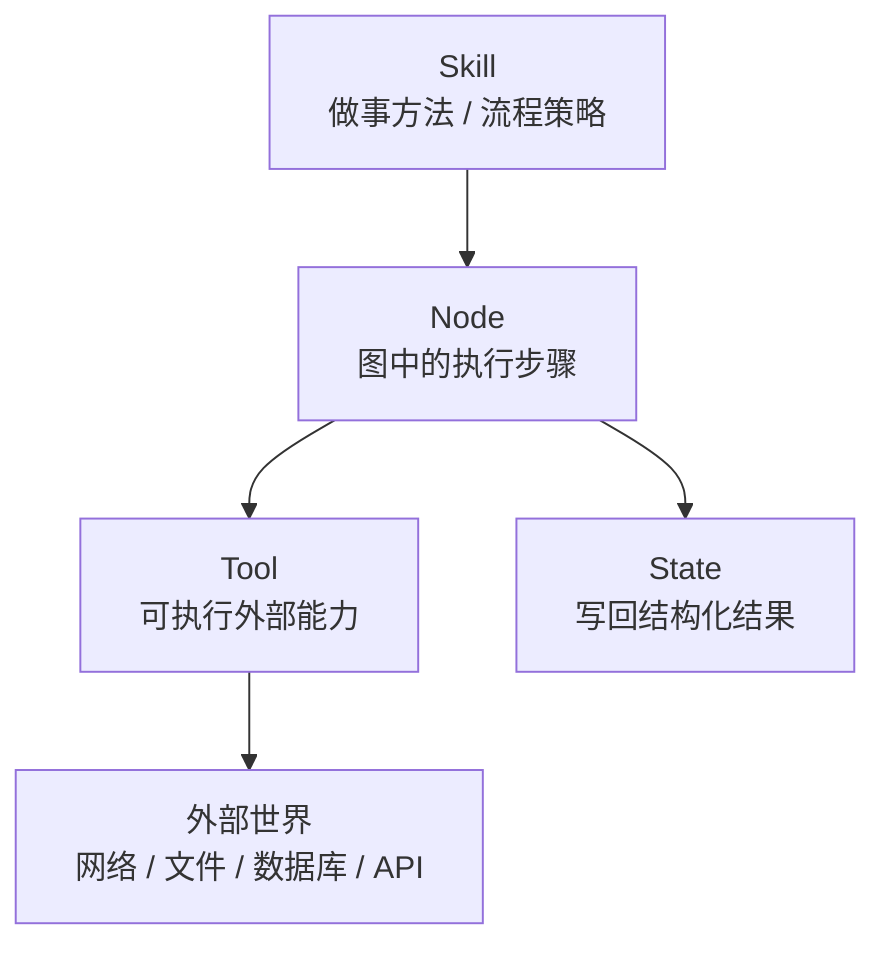
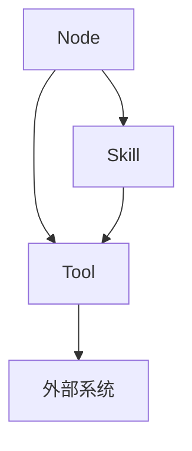

# 第25章-工具模块设计

## 25.1 从一个危险的工具调用开始

上一章讲节点模块设计。

我们强调了一件事：

```text
Node 不应该把模型、工具、配置和业务逻辑全部揉在一起。
```

这一章继续看 `tools/`。

在 Agent 项目里，工具很容易被写成普通函数：

```python
def search_web(query: str) -> list[str]:
    ...
```

或者：

```python
def read_file(path: str) -> str:
    ...
```

这看起来很自然。

但工具和普通辅助函数不一样。

普通辅助函数通常只在程序内部处理数据。

工具会让 Agent 接触外部世界：

```text
访问网络。
读取文件。
查询数据库。
调用 API。
执行命令。
发送邮件。
写入文档。
修改任务状态。
```

一旦 Agent 能调用这些能力，就会出现真实风险。

先看一个危险写法：

```python
import requests


def fetch_url(url: str) -> str:
    response = requests.get(url)
    return response.text
```

这个工具很短。

但它有很多问题：

```text
没有输入校验。
没有域名限制。
没有超时。
没有最大响应大小。
没有错误类型。
没有重试策略。
没有日志。
没有权限边界。
没有结果结构。
```

如果模型生成了一个奇怪的 URL 呢？

如果请求卡住 60 秒呢？

如果返回的是 20MB HTML 呢？

如果访问了内网地址呢？

如果工具异常直接炸掉整个图呢？

这就是本章要解决的问题。

> Agent 调外部工具时，输入、输出、权限、超时和错误应该如何设计，才能让工具既有用又可控？

## 25.2 本章目标

本章采用“风险边界法”。

也就是不把工具模块写成“函数放哪里”的整理问题，而是先问：

```text
这个工具打开了哪个外部边界？
它可能造成什么风险？
我们应该如何限制、观察和恢复？
```

读完本章，读者应该能回答这些问题：

| 问题 | 本章要建立的理解 |
| --- | --- |
| Tool 和普通函数有什么区别？ | Tool 是 Agent 接触外部世界的能力边界 |
| 工具输入怎么设计？ | 用明确 schema、校验、白名单和默认值约束模型输出 |
| 工具输出怎么设计？ | 返回结构化结果，不把原始外部数据直接塞进 State |
| 权限怎么管？ | 按工具能力、资源范围、操作级别做 allowlist |
| 超时怎么管？ | 每个工具必须有 timeout、大小限制和失败结果 |
| 错误怎么处理？ | 把异常转换成可路由、可重试、可展示的错误状态 |
| tools 和 skills 怎么配合？ | tools 负责执行外部动作，skills 负责封装使用方法和流程策略 |

本章最重要的一句话是：

```text
工具模块不是能力越大越好，而是边界越清楚越好。
```

## 25.3 Tool、Node、Skill 的区别

在工程化项目里，容易把三个概念混在一起：

```text
Tool
Node
Skill
```

先把它们分清。

### Tool：可执行能力

Tool 是一个可以被调用的外部能力。

例如：

```text
search_docs(query)
read_file(path)
calculate(expression)
query_database(sql)
send_email(to, subject, body)
```

它关心的是：

```text
输入是什么？
能访问什么资源？
怎么执行？
输出是什么？
失败怎么办？
```

### Node：图里的执行步骤

Node 是 LangGraph 图中的一步。

它读取 State，调用模型或工具，然后返回状态更新。

例如：

```python
def search_materials(state: ResearchState, search_tool) -> dict:
    result = search_tool({"query": state["search_query"]})
    return {"materials": result.items}
```

Node 关心的是：

```text
从 State 读什么？
调用哪个能力？
把结果写回哪个字段？
失败后图怎么继续？
```

### Skill：可复用做事方法

Skill 不是一个单纯工具函数。

它更像一套“做某类任务的方法”。

例如：

```text
网页研究 skill：先搜索，再筛选来源，再摘要，再引用。
代码审查 skill：先看 diff，再找风险，再给出问题列表。
文档写作 skill：先确定读者，再设计结构，再扩写章节。
数据分析 skill：先检查 schema，再清洗，再统计，再解释。
```

Skill 关心的是：

```text
什么时候使用？
按什么步骤使用？
应该调用哪些工具？
如何判断结果是否合格？
失败时怎么降级？
```

可以用一张图表示：



一句话区分：

```text
Tool 负责能做什么。
Skill 负责怎么做得好。
Node 负责把这件事放进 LangGraph 执行流。
```

## 25.4 反例：把工具写成裸函数

先看一个裸工具：

```python
def read_file(path: str) -> str:
    with open(path, "r", encoding="utf-8") as file:
        return file.read()
```

它的问题不是语法。

而是没有边界。

它没有回答：

```text
允许读取哪些目录？
文件最大多大？
如果文件不存在怎么办？
如果路径是 ../secret.env 怎么办？
返回内容要不要截断？
错误结果怎么给节点？
```

再看一个搜索工具：

```python
def search_docs(query: str):
    return search_api(query)
```

同样没有回答：

```text
query 最大长度是多少？
搜索多少条？
请求超时多久？
失败是否重试？
返回结果是否去重？
是否保留 URL、标题、摘要？
是否过滤不可信来源？
```

裸函数在 demo 里很方便。

但真实 Agent 里，工具应该至少有四层边界：

```text
输入边界。
执行边界。
输出边界。
错误边界。
```

后面逐一展开。

## 25.5 工具输入边界：模型输出不能直接执行

很多工具调用来自模型输出。

例如模型决定：

```json
{"query": "LangGraph checkpoint persistence"}
```

或者：

```json
{"path": "../../.env"}
```

模型输出不能直接信任。

工具输入必须有 schema 和校验。

可以先定义输入类型：

```python
from typing import TypedDict


class SearchInput(TypedDict):
    query: str
    max_results: int
```

再做校验：

```python
def validate_search_input(data: SearchInput) -> SearchInput:
    query = data["query"].strip()
    max_results = data.get("max_results", 5)

    if not query:
        raise ValueError("query cannot be empty")

    if len(query) > 200:
        raise ValueError("query is too long")

    if max_results < 1 or max_results > 10:
        raise ValueError("max_results must be between 1 and 10")

    return {
        "query": query,
        "max_results": max_results,
    }
```

这段校验看起来普通，但它很重要。

它把模型生成的开放文本，压进了一个可控边界。

工具输入设计要回答这些问题：

| 问题 | 示例 |
| --- | --- |
| 必填字段有哪些？ | `query` 必填 |
| 字段最大长度是多少？ | query 最多 200 字符 |
| 数量范围是多少？ | `max_results` 只能 1-10 |
| 是否允许路径？ | 只允许工作目录下的相对路径 |
| 是否允许 URL？ | 只允许 http/https，禁止内网地址 |
| 是否有默认值？ | 默认搜索 5 条 |

工具输入边界的原则是：

> 模型可以提出意图，但工具必须决定什么输入可以执行。

## 25.6 工具执行边界：权限、超时和资源限制

工具真正危险的地方在执行。

例如搜索工具会访问网络。

文件工具会访问文件系统。

数据库工具会访问业务数据。

命令工具会影响机器环境。

所以工具必须有执行边界。

### 权限边界

权限边界回答：

```text
这个工具允许访问什么？
不允许访问什么？
```

例如文件读取工具：

```python
from pathlib import Path


def resolve_allowed_path(root: Path, relative_path: str) -> Path:
    target = (root / relative_path).resolve()
    root = root.resolve()

    if root not in target.parents and target != root:
        raise PermissionError("path is outside allowed root")

    return target
```

这个函数确保工具只能读指定目录下的文件。

它不是业务逻辑。

它是权限边界。

### 超时边界

任何访问外部世界的工具都应该有超时。

例如：

```python
def search_docs(input_data: SearchInput, timeout_seconds: int = 10) -> SearchResult:
    ...
```

不要让一个工具无限等待。

否则整个图可能卡住。

### 大小边界

工具返回结果也要限制大小。

例如：

```text
最多返回 10 条搜索结果。
每条摘要最多 500 字。
文件最多读取 100KB。
网页正文最多截断到 5000 字。
```

大小边界很重要。

因为工具结果通常会进入 State，再进入模型上下文。

如果不限制，很容易造成：

```text
State 过大。
checkpoint 过大。
prompt 超长。
stream 输出过多。
```

工具执行边界可以总结为：

| 边界 | 要控制什么 |
| --- | --- |
| 权限 | 能访问哪些资源 |
| 超时 | 最多等待多久 |
| 大小 | 最多读取或返回多少 |
| 频率 | 最多调用多少次 |
| 副作用 | 是否允许写入、发送、删除 |

## 25.7 工具输出边界：不要把原始结果直接塞进 State

工具输出也需要结构化。

不推荐：

```python
def search_docs(query: str) -> str:
    return raw_html_or_json
```

更好的做法是定义输出结构：

```python
from typing import TypedDict


class SearchItem(TypedDict):
    title: str
    url: str
    snippet: str


class SearchResult(TypedDict):
    query: str
    items: list[SearchItem]
```

工具返回：

```python
{
    "query": "LangGraph checkpoint",
    "items": [
        {
            "title": "LangGraph Persistence",
            "url": "https://...",
            "snippet": "LangGraph supports durable execution...",
        }
    ],
}
```

节点再决定写入 State 的哪些字段：

```python
def search_materials(state: ResearchState, search_tool) -> dict:
    result = search_tool(
        {
            "query": state["search_query"],
            "max_results": state.get("max_results", 5),
        }
    )

    materials = [
        f"{item['title']}: {item['snippet']}"
        for item in result["items"]
    ]
    sources = [item["url"] for item in result["items"]]

    return {
        "materials": materials,
        "sources": sources,
    }
```

这里有一个关键分工：

```text
Tool 返回结构化原始能力结果。
Node 把工具结果转换成 State 字段。
```

不要让工具直接写 State。

也不要让 State 保存过多工具原始噪音。

工具输出设计要回答：

| 问题 | 示例 |
| --- | --- |
| 返回结构是否稳定？ | `items: list[SearchItem]` |
| 是否包含来源？ | `url`、`title` |
| 是否包含错误？ | 成功结果和错误结果分开 |
| 是否需要截断？ | snippet 限制长度 |
| 是否适合进入 State？ | 原始 HTML 不适合，摘要适合 |

## 25.8 工具错误边界：异常要变成可路由状态

工具一定会失败。

搜索 API 会超时。

文件不存在。

权限不足。

数据库连接失败。

网页返回 403。

模型生成了非法参数。

错误不能只是抛出异常。

在 LangGraph 里，更好的做法是把工具错误转换成可路由的状态更新。

先定义错误结构：

```python
from typing import Literal, TypedDict


ToolErrorType = Literal[
    "validation_error",
    "permission_denied",
    "timeout",
    "not_found",
    "rate_limited",
    "unknown_error",
]


class ToolError(TypedDict):
    tool: str
    error_type: ToolErrorType
    message: str
    retryable: bool
```

工具节点捕获异常：

```python
def search_materials(state: ResearchState, search_tool) -> dict:
    try:
        result = search_tool(
            {
                "query": state["search_query"],
                "max_results": state.get("max_results", 5),
            }
        )
    except TimeoutError as exc:
        return {
            "errors": [
                {
                    "tool": "search_docs",
                    "error_type": "timeout",
                    "message": str(exc),
                    "retryable": True,
                }
            ]
        }
    except PermissionError as exc:
        return {
            "errors": [
                {
                    "tool": "search_docs",
                    "error_type": "permission_denied",
                    "message": str(exc),
                    "retryable": False,
                }
            ]
        }

    materials = [item["snippet"] for item in result["items"]]
    return {"materials": materials}
```

这样后续路由函数可以判断：

```python
def decide_after_tool(state: ResearchState) -> str:
    errors = state.get("errors", [])

    if not errors:
        return "write_answer"

    last_error = errors[-1]

    if last_error["retryable"] and state.get("retry_count", 0) < 2:
        return "retry_tool"

    return "fallback_answer"
```

这就是工具错误边界的核心：

> 工具失败不是程序崩溃，而是图可以理解和处理的状态。

## 25.9 一个更完整的搜索工具模块

现在把前面的原则合成一个 `tools/search.py`。

```python
# research_agent/tools/search.py

from typing import TypedDict


class SearchInput(TypedDict, total=False):
    query: str
    max_results: int


class SearchItem(TypedDict):
    title: str
    url: str
    snippet: str


class SearchResult(TypedDict):
    query: str
    items: list[SearchItem]


def validate_search_input(data: SearchInput) -> SearchInput:
    query = data["query"].strip()
    max_results = data.get("max_results", 5)

    if not query:
        raise ValueError("query cannot be empty")

    if len(query) > 200:
        raise ValueError("query is too long")

    if max_results < 1 or max_results > 10:
        raise ValueError("max_results must be between 1 and 10")

    return {
        "query": query,
        "max_results": max_results,
    }


def search_docs(data: SearchInput, timeout_seconds: int = 10) -> SearchResult:
    safe_input = validate_search_input(data)

    # 这里用假数据表示真实搜索服务。
    items = [
        {
            "title": "LangGraph Persistence",
            "url": "https://docs.langchain.com/...",
            "snippet": "LangGraph supports checkpointing and durable execution.",
        }
    ][: safe_input["max_results"]]

    return {
        "query": safe_input["query"],
        "items": items,
    }
```

这个工具模块虽然仍然很短，但已经比裸函数强很多。

它有：

```text
输入 schema。
输入校验。
输出 schema。
结果数量限制。
timeout 参数位置。
稳定返回结构。
```

以后接真实搜索 API 时，可以替换内部实现。

但调用方仍然使用同一个接口。

这就是工具模块的价值。

## 25.10 文件工具：权限边界比功能更重要

再看文件读取工具。

文件工具比搜索工具更敏感。

因为它可能访问本地隐私文件。

不推荐：

```python
def read_file(path: str) -> str:
    return open(path, encoding="utf-8").read()
```

推荐先明确输入输出：

```python
from pathlib import Path
from typing import TypedDict


class ReadFileInput(TypedDict):
    path: str


class ReadFileResult(TypedDict):
    path: str
    content: str
    truncated: bool
```

再加权限和大小限制：

```python
def read_text_file(
    data: ReadFileInput,
    root: Path,
    max_bytes: int = 100_000,
) -> ReadFileResult:
    target = (root / data["path"]).resolve()
    allowed_root = root.resolve()

    if allowed_root not in target.parents and target != allowed_root:
        raise PermissionError("path is outside allowed root")

    if not target.exists():
        raise FileNotFoundError(data["path"])

    raw = target.read_bytes()
    truncated = len(raw) > max_bytes
    content = raw[:max_bytes].decode("utf-8", errors="replace")

    return {
        "path": str(target),
        "content": content,
        "truncated": truncated,
    }
```

这里的核心不是读取文件。

核心是：

```text
只能读 root 下面的文件。
最多读 max_bytes。
返回是否被截断。
错误由节点转换成状态。
```

文件工具的原则是：

> 权限边界比功能本身更重要。

## 25.11 写入型工具要更谨慎

搜索和读取文件通常是只读工具。

写入型工具风险更高。

例如：

```text
send_email
write_file
update_database
create_ticket
execute_command
publish_report
```

这些工具会改变外部世界。

所以要额外设计：

```text
是否需要人工确认？
是否需要 dry_run？
是否记录审计日志？
是否限制目标对象？
是否支持撤销？
```

例如发送邮件工具可以先返回草稿：

```python
class EmailDraft(TypedDict):
    to: str
    subject: str
    body: str


def create_email_draft(data: EmailDraft) -> EmailDraft:
    validate_email_input(data)
    return data
```

真正发送前，图进入人工审批：

```text
create_email_draft
-> human_approval
-> send_email
```

这就是第 20 章 Interrupt 的应用。

写入型工具的原则是：

> 能先生成草稿，就不要直接执行副作用；能人工确认，就不要让模型静默提交。

## 25.12 tools 和 skills 如何配合

现在回到用户特别关心的问题：

```text
tools 和 skills 怎么设计和配合使用？
```

在真实 Agent 系统里，可以把它们分成两层。

### tools：能力层

`tools/` 目录放可执行能力。

例如：

```text
tools/
  search.py
  file_reader.py
  calculator.py
  browser.py
  database.py
```

每个 tool 都应该有：

```text
输入 schema。
输出 schema。
权限边界。
超时限制。
错误类型。
测试。
```

### skills：方法层

`skills/` 目录可以放可复用的做事方法。

例如：

```text
skills/
  web_research.py
  document_summary.py
  code_review.py
  report_writing.py
```

Skill 不一定直接等于 LangGraph Node。

它可以是一组普通函数、一个子图、一个策略对象，或者一份 prompt / workflow 定义。

例如一个网页研究 skill：

```python
class WebResearchSkill:
    def __init__(self, search_tool, model):
        self.search_tool = search_tool
        self.model = model

    def run(self, question: str) -> dict:
        query = self._make_query(question)
        result = self.search_tool({"query": query, "max_results": 5})
        summary = self._summarize(question, result)

        return {
            "query": query,
            "materials": summary["materials"],
            "sources": summary["sources"],
        }
```

它内部可能使用搜索工具和模型。

但它表达的是一个更高层的方法：

```text
给一个问题，如何完成网页研究？
```

### Node 调用 skill

LangGraph 节点可以调用 skill：

```python
def research_with_skill(state: ResearchState, web_research_skill) -> dict:
    result = web_research_skill.run(state["question"])

    return {
        "search_query": result["query"],
        "materials": result["materials"],
        "sources": result["sources"],
    }
```

这时分工是：

```text
Tool 负责安全执行搜索。
Skill 负责组织搜索、筛选、摘要的策略。
Node 负责把 skill 结果写回 State。
```

## 25.13 什么时候只需要 tool，什么时候需要 skill

不是每个工具都要包一层 skill。

可以用下面的判断。

| 场景 | 用 tool 即可 | 需要 skill |
| --- | --- | --- |
| 简单计算 | `calculate(expression)` | 通常不需要 |
| 读取单个文件 | `read_text_file(path)` | 通常不需要 |
| 搜索一次资料 | `search_docs(query)` | 可能不需要 |
| 搜索、筛选、摘要、引用 | 不够 | 需要 `web_research_skill` |
| 代码审查 | 单个 grep 工具不够 | 需要 code review skill |
| 写研究报告 | 单个 LLM 工具不够 | 需要 report writing skill |
| 多步骤数据分析 | 单个 SQL 工具不够 | 需要 analysis skill |

判断标准是：

```text
如果只是执行一个明确动作，用 tool。
如果需要一套可复用流程和判断标准，用 skill。
```

Skill 可以调用多个 tools。

Tool 不应该反过来知道 skill。

也就是说依赖方向应该是：

```text
Skill -> Tool
Node -> Skill 或 Tool
Tool 不依赖 Node，不依赖 Skill。
```

用图表示：



## 25.14 Skill 也要有边界

Skill 虽然比 tool 高层，但也不能写成黑盒。

一个好的 skill 应该说明：

```text
适用场景。
输入。
输出。
会调用哪些 tools。
失败时怎么处理。
质量标准是什么。
```

例如 `WebResearchSkill` 可以设计成：

| 项目 | 说明 |
| --- | --- |
| 适用场景 | 用户问题需要外部资料 |
| 输入 | `question`、`max_results` |
| 使用工具 | `search_docs` |
| 使用模型 | `summary_model` |
| 输出 | `materials`、`sources`、`warnings` |
| 失败策略 | 搜索失败时返回 warnings，图进入 fallback |
| 质量标准 | 至少一条来源，材料需要摘要，不返回原始 HTML |

Skill 的测试也可以分层。

```python
def test_web_research_skill_uses_search_tool():
    search_tool = FakeSearchTool()
    model = FakeModel("摘要")
    skill = WebResearchSkill(search_tool, model)

    result = skill.run("LangGraph checkpoint 是什么？")

    assert search_tool.called
    assert result["materials"]
```

这和节点测试很像。

区别在于：

```text
Node 测 State 读写。
Skill 测流程策略。
Tool 测执行边界。
```

## 25.15 ToolNode 和自定义工具模块

LangGraph / LangChain 生态里有预构建的工具节点，例如 `ToolNode`。

它适合处理模型发出的 tool calls：

```text
LLM 生成 tool_call
-> ToolNode 执行对应工具
-> ToolMessage 写回 messages
-> LLM 继续推理
```

这种模式适合 ReAct 风格 Agent。

但工程项目里，仍然建议把工具实现放在自己的 `tools/` 模块中。

可以理解成：

```text
ToolNode 是执行工具调用的节点。
tools/ 是你定义工具能力和边界的地方。
```

不要因为用了 `ToolNode`，就忽略工具输入、权限、超时和错误设计。

预构建节点解决的是“如何接入图执行”。

工具模块解决的是“这个能力是否安全可控”。

两者不是替代关系。

## 25.16 工具结果如何进入 State

工具结果进入 State 有两种常见方式。

第一种是消息型 Agent。

工具结果作为 `ToolMessage` 进入 `messages`：

```text
messages += [ToolMessage(...)]
```

这种方式适合 ReAct 循环。

模型能继续阅读工具结果，并决定下一步。

第二种是结构化 Agent。

节点把工具结果整理成业务字段：

```python
return {
    "materials": materials,
    "sources": sources,
}
```

这种方式适合工程应用。

后续节点不需要从 messages 里解析工具结果，而是直接读取结构化字段。

可以这样选择：

| 场景 | 推荐方式 |
| --- | --- |
| 通用 ReAct 聊天 Agent | 工具结果进入 `messages` |
| 研究报告、RAG、审批流程 | 工具结果进入结构化 State |
| 需要 UI 展示来源 | 结构化 `sources` 字段 |
| 需要模型继续观察工具输出 | `messages` 或两者同时保留摘要 |

本书第六部分更偏工程化实践，所以更推荐：

```text
关键工具结果进入结构化 State。
必要时再把摘要放进 messages。
```

## 25.17 工具测试应该测什么

工具测试不要只测“能不能返回东西”。

应该重点测边界。

以搜索工具为例：

```text
空 query 是否拒绝？
超长 query 是否拒绝？
max_results 是否限制？
API 超时是否变成 timeout 错误？
返回结果是否结构稳定？
```

以文件工具为例：

```text
是否禁止读取 root 外的文件？
文件不存在时是否返回 not_found？
大文件是否截断？
编码错误是否可处理？
```

以写入工具为例：

```text
是否支持 dry_run？
是否需要人工确认？
是否记录目标对象？
是否禁止危险操作？
```

工具测试可以按这张表设计：

| 测试类型 | 目的 |
| --- | --- |
| 输入校验测试 | 防止模型传入非法参数 |
| 权限测试 | 防止越权访问 |
| 超时测试 | 防止外部系统卡住图 |
| 输出结构测试 | 保持节点和 State 稳定 |
| 错误转换测试 | 让图能路由失败 |
| 副作用测试 | 确认写入型工具不会静默执行危险操作 |

工具模块的测试，是 Agent 安全性的第一道闸门。

## 25.18 常见错误与排查

### 错误一：工具没有输入 schema

现象：

```text
模型生成什么参数，工具就直接执行什么。
```

问题：

```text
容易出现空参数、超长参数、非法路径、危险 URL。
```

建议：

```text
为每个工具定义输入类型和 validate_xxx_input。
```

### 错误二：工具没有超时

现象：

```text
图运行时卡在某个外部请求上。
```

问题：

```text
工具阻塞导致整个 Agent 不可控。
```

建议：

```text
每个访问网络、文件、数据库、浏览器的工具都设置 timeout。
```

### 错误三：工具返回原始大对象

现象：

```text
State 里塞入完整网页 HTML、巨大 JSON、整本文档。
```

问题：

```text
checkpoint 变大，prompt 超长，调试困难。
```

建议：

```text
工具输出先结构化、截断、摘要，再由节点写入 State。
```

### 错误四：工具异常直接打断图

现象：

```text
一次搜索超时导致整个 graph.invoke 抛异常结束。
```

问题：

```text
图没有机会重试、fallback 或提示用户。
```

建议：

```text
节点捕获工具异常，转换成 errors 状态，再由路由函数决定下一步。
```

### 错误五：写入型工具没有人工确认

现象：

```text
模型生成邮件后直接发送，或生成文件后直接覆盖。
```

问题：

```text
副作用不可控。
```

建议：

```text
写入型工具先生成草稿或 dry_run，关键操作经过 interrupt 人工确认。
```

### 错误六：Skill 和 Tool 混在一起

现象：

```text
search_docs 工具内部又负责规划、摘要、判断质量。
```

问题：

```text
工具变成黑盒，难以复用和测试。
```

建议：

```text
Tool 只做受控执行；Skill 负责多步策略和质量判断。
```

## 25.19 工具模块设计检查清单

设计或审查一个工具模块时，可以用这张表：

| 检查问题 | 判断目的 |
| --- | --- |
| 工具打开了哪个外部边界？ | 网络、文件、数据库、API、命令、写入 |
| 输入 schema 是否明确？ | 防止模型任意传参 |
| 输入是否校验和规范化？ | 控制长度、范围、路径、URL |
| 是否有权限边界？ | 限制可访问资源 |
| 是否有 timeout？ | 防止卡住图执行 |
| 是否有限制返回大小？ | 防止 State 和 checkpoint 膨胀 |
| 输出是否结构化？ | 保持节点和 State 稳定 |
| 错误是否可分类？ | 支持重试、fallback、人工介入 |
| 写入型工具是否有确认机制？ | 控制副作用 |
| 工具是否能单独测试？ | 不依赖完整 graph |
| Skill 是否只负责流程策略？ | 避免工具变成黑盒 |
| Node 是否只负责 State 转换？ | 保持图步骤清晰 |

如果一个工具无法回答：

```text
我允许什么输入？
我能访问什么资源？
我最多执行多久？
我最多返回多少？
我失败后图怎么处理？
```

那它还不应该交给 Agent 调用。

## 25.20 小结：工具是 Agent 的风险边界

本章用“风险边界法”重新设计了工具模块。

我们从一个裸工具函数开始，看到它虽然能跑，但缺少：

```text
输入校验。
权限控制。
超时限制。
输出结构。
错误分类。
副作用确认。
测试边界。
```

然后我们把工具拆成四类边界：

```text
输入边界：schema、校验、默认值、白名单。
执行边界：权限、超时、大小、频率、副作用。
输出边界：结构化、截断、来源、摘要。
错误边界：错误类型、retryable、状态更新、路由处理。
```

最后我们区分了 tools 和 skills：

```text
Tool 负责安全执行一个外部能力。
Skill 负责组织一套可复用的做事方法。
Node 负责把 tool 或 skill 的结果写回 LangGraph State。
```

读者应该记住这一句话：

> Agent 的能力来自工具，但 Agent 的可靠性来自工具边界。

第 23 章解决了 State 的字段边界。

第 24 章解决了 Node 的依赖和测试边界。

本章解决了 Tool 的外部风险边界。

下一章会继续讨论错误处理与重试。

它要回答的问题是：

> 当模型、工具、网络、解析、人工审批任何一步失败时，LangGraph 应用应该如何把失败变成可恢复、可路由、可观测的执行状态？
