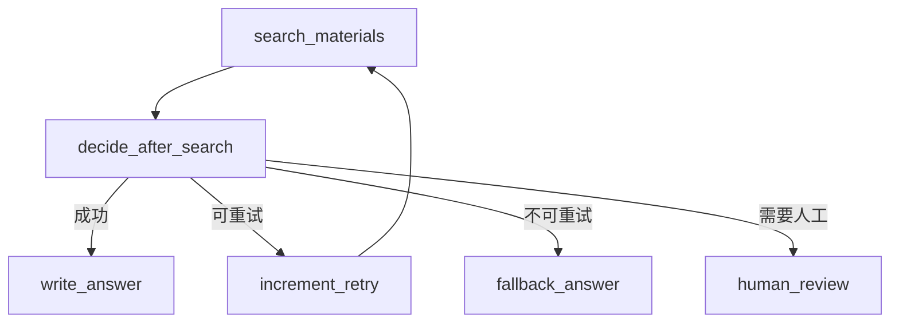
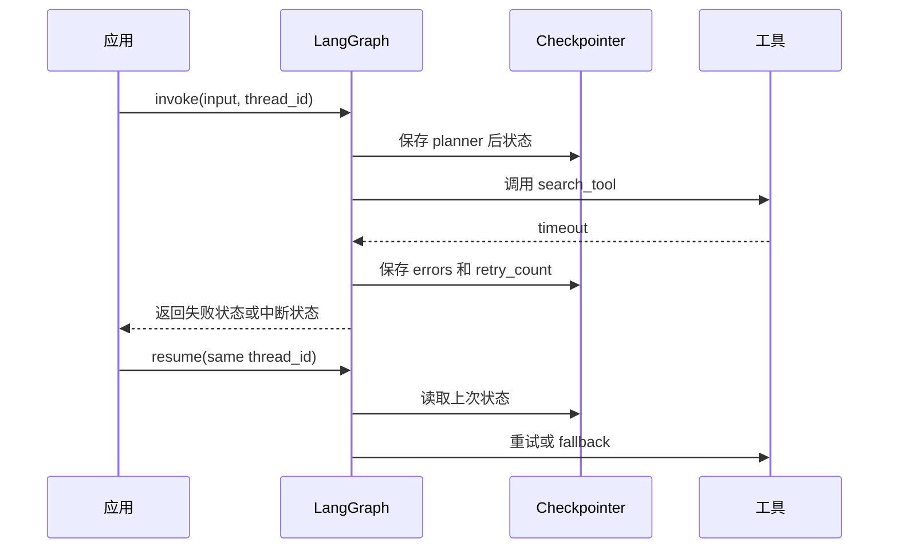

# 第26章-错误处理与重试

## 26.1 从一次失败的 Agent 执行开始

前面三章，我们已经把工程化项目的几个边界拆开了。

第 23 章讲 State：

```text
哪些字段属于输入、内部运行、输出和持久化？
```

第 24 章讲 Node：

```text
节点怎么写，才能脱离真实模型和工具单独测试？
```

第 25 章讲 Tool：

```text
Agent 调外部工具时，输入、输出、权限、超时和错误怎么管？
```

这一章讲错误处理与重试。

真实 Agent 一定会失败。

不是偶尔失败，而是经常失败：

```text
本地 Ollama 没启动。
DeepSeek API 超时。
模型返回了不是 JSON 的文本。
搜索工具请求失败。
文件路径没有权限。
网页内容太长。
数据库连接断开。
人工审批被拒绝。
checkpoint 恢复时 thread_id 错了。
```

如果这些失败只是变成一串异常堆栈，LangGraph 应用就很难进入真实生产。

先看一个简单但脆弱的节点：

```python
def write_answer(state: ResearchState, model) -> dict:
    response = model.invoke(
        f"请根据资料回答问题：{state['question']}\n{state['materials']}"
    )

    return {"final_answer": response.content.strip()}
```

它能跑。

但它没有回答：

```text
模型超时怎么办？
模型返回空内容怎么办？
模型输出格式错了怎么办？
失败后是否重试？
重试几次？
换不换 fallback 模型？
失败信息写入哪里？
用户能不能看到当前卡在哪里？
checkpoint 能否从失败前恢复？
```

本章要解决的问题是：

> 模型、工具、解析、网络失败时，图应该如何恢复？

## 26.2 本章目标

本章采用“失败场景驱动法”。

不先列一堆异常类型。

而是从真实失败场景出发，倒推出 LangGraph 应用应该如何设计：

```text
失败如何进入 State？
哪些失败可以重试？
哪些失败应该 fallback？
哪些失败应该请求人工介入？
哪些失败应该直接结束？
恢复时如何借助 checkpoint 和 thread？
Streaming 如何让失败过程可见？
```

读完本章，读者应该能回答这些问题：

| 问题 | 本章要建立的理解 |
| --- | --- |
| 错误是否应该只是异常？ | 不应该，很多错误应该进入 State，成为可路由状态 |
| 哪些失败可以重试？ | 超时、限流、临时网络错误、部分格式错误 |
| 哪些失败不该重试？ | 权限拒绝、输入非法、用户拒绝、资源不存在 |
| 重试应该放在哪里？ | 可以放节点内部，也可以放图结构里，取决于是否需要可观察和可恢复 |
| fallback 模型怎么设计？ | 主模型失败后切换备用模型，并记录失败原因 |
| 工具失败怎么恢复？ | 工具错误转成结构化状态，由路由函数决定重试、降级或结束 |
| checkpoint 如何参与恢复？ | 保存失败前的稳定状态，让图能从同一 thread 继续 |

本章最重要的一句话是：

```text
失败不是图执行的例外情况，失败本身就是 Agent 流程的一部分。
```

## 26.3 失败场景总览

先把常见失败分成几类。

| 失败类型 | 示例 | 通常策略 |
| --- | --- | --- |
| 模型调用失败 | 超时、限流、服务不可用 | 重试、fallback 模型 |
| 模型输出失败 | 空内容、格式错误、JSON 解析失败 | 重新提示、修复解析、人工介入 |
| 工具调用失败 | 搜索超时、文件不存在、权限拒绝 | 重试、换工具、降级 |
| 网络失败 | DNS、连接超时、HTTP 5xx | 重试、退避、fallback |
| 权限失败 | 文件越权、API 无权限 | 不重试，进入拒绝或人工处理 |
| 人工流程失败 | 用户拒绝、超时未审批 | 结束、修改计划、重新提交 |
| 状态失败 | 缺字段、类型错误、reducer 不符合预期 | 测试修复、错误节点处理 |
| 持久化失败 | checkpoint 写入失败、thread_id 错误 | 报警、降级、重新创建 thread |

这张表说明一件事：

```text
不是所有失败都应该用同一种方式处理。
```

有些失败适合重试：

```text
网络抖动。
模型限流。
临时超时。
```

有些失败不该重试：

```text
权限拒绝。
路径越界。
用户明确拒绝。
输入 schema 不合法。
```

有些失败需要换策略：

```text
本地模型能力不足，切换 DeepSeek。
搜索工具不可用，改用已有资料生成低置信度回答。
JSON 解析失败，进入格式修复节点。
```

错误处理的第一步不是写 `try/except`。

而是判断：

> 这个失败应该重试、降级、人工介入，还是结束？

## 26.4 错误要进入 State

如果错误只存在于异常堆栈里，图就很难处理它。

更好的做法是把可处理错误写入 State。

例如在 `state.py` 里定义：

```python
from operator import add
from typing import Annotated, Literal, TypedDict


ErrorType = Literal[
    "model_timeout",
    "model_rate_limited",
    "model_invalid_output",
    "tool_timeout",
    "tool_permission_denied",
    "tool_not_found",
    "parse_error",
    "human_rejected",
    "unknown_error",
]


class ErrorRecord(TypedDict):
    node: str
    error_type: ErrorType
    message: str
    retryable: bool


class ResearchState(TypedDict, total=False):
    question: str
    materials: Annotated[list[str], add]
    final_answer: str

    retry_count: int
    errors: Annotated[list[ErrorRecord], add]
    fallback_used: bool
```

错误记录至少要包含：

| 字段 | 作用 |
| --- | --- |
| `node` | 失败发生在哪个节点 |
| `error_type` | 失败类型，便于路由 |
| `message` | 人能读懂的错误说明 |
| `retryable` | 是否值得自动重试 |

这让错误变成图可以理解的数据。

例如：

```python
{
    "errors": [
        {
            "node": "search_materials",
            "error_type": "tool_timeout",
            "message": "search API timeout",
            "retryable": True,
        }
    ]
}
```

后续路由函数就可以读这个错误，决定下一步。

## 26.5 反例：在节点里吞掉所有异常

很多人会这样写：

```python
def search_materials(state, search_tool) -> dict:
    try:
        materials = search_tool(state["search_query"])
        return {"materials": materials}
    except Exception:
        return {"materials": []}
```

这比直接崩溃好一点，但仍然不好。

它把所有失败都压成了空列表。

后续节点不知道：

```text
是没有搜索结果？
还是工具超时？
还是没有权限？
还是搜索词非法？
```

于是 writer 节点可能会拿着空资料继续写回答。

最终用户看到一个看似正常但缺少资料的回答。

这比直接失败更危险。

更好的写法是：

```python
def search_materials(state, search_tool) -> dict:
    try:
        materials = search_tool(state["search_query"])
        return {"materials": materials}
    except TimeoutError as exc:
        return {
            "errors": [
                {
                    "node": "search_materials",
                    "error_type": "tool_timeout",
                    "message": str(exc),
                    "retryable": True,
                }
            ]
        }
    except PermissionError as exc:
        return {
            "errors": [
                {
                    "node": "search_materials",
                    "error_type": "tool_permission_denied",
                    "message": str(exc),
                    "retryable": False,
                }
            ]
        }
```

不要吞掉错误。

要把错误转换成结构化状态。

## 26.6 重试放节点内部，还是放图结构里

重试有两种常见位置。

第一种：节点内部重试。

```python
def call_model_with_retry(model, prompt: str, max_attempts: int = 3):
    last_error = None

    for _ in range(max_attempts):
        try:
            return model.invoke(prompt)
        except TimeoutError as exc:
            last_error = exc

    raise last_error
```

第二种：图结构重试。

```text
call_model
-> failed?
-> retry_or_fallback
-> call_model
```

两种方式都可以。

关键看这个重试是否需要被图观察。

| 场景 | 推荐方式 |
| --- | --- |
| 一次很轻的内部网络抖动 | 节点内部重试 |
| 需要记录每次失败 | 图结构重试 |
| 重试之间要 checkpoint | 图结构重试 |
| 重试后可能换模型 | 图结构重试 |
| 重试需要人工确认 | 图结构重试 |
| 第三方 SDK 自带幂等重试 | 节点内部或工具内部 |

简单原则是：

> 如果重试只是实现细节，放节点内部；如果重试会影响流程、状态、观察和恢复，放图结构里。

本章更关注工程化 Agent，所以主要讲图结构重试。

## 26.7 图结构重试：让失败可见

假设搜索工具失败后可以重试两次。

可以这样设计图：



`search_materials` 不直接决定下一步。

它只写状态：

```text
成功：写 materials。
失败：写 errors。
```

路由函数读取 State：

```python
def decide_after_search(state: ResearchState) -> str:
    errors = state.get("errors", [])

    if not errors:
        return "write_answer"

    last_error = errors[-1]

    if last_error["retryable"] and state.get("retry_count", 0) < 2:
        return "increment_retry"

    if last_error["error_type"] == "tool_permission_denied":
        return "human_review"

    return "fallback_answer"
```

重试节点只负责增加计数：

```python
def increment_retry(state: ResearchState) -> dict:
    return {"retry_count": state.get("retry_count", 0) + 1}
```

这样设计的好处是：

```text
失败进入 State。
路由规则可测试。
重试次数可观察。
checkpoint 可以保存每次尝试后的状态。
fallback 和人工介入都有明确路径。
```

## 26.8 模型失败：重试、fallback 和降级

模型失败通常有两类。

第一类是调用失败：

```text
超时。
限流。
服务不可用。
连接失败。
```

第二类是输出失败：

```text
空内容。
格式不符合要求。
JSON 解析失败。
回答不满足约束。
```

对调用失败，可以用重试和 fallback。

例如：

```python
def call_primary_model(state: ResearchState, model) -> dict:
    prompt = build_answer_prompt(state)

    try:
        response = model.invoke(prompt)
        return {"draft_answer": response.content.strip()}
    except TimeoutError as exc:
        return {
            "errors": [
                {
                    "node": "call_primary_model",
                    "error_type": "model_timeout",
                    "message": str(exc),
                    "retryable": True,
                }
            ]
        }
```

路由函数决定：

```python
def decide_after_primary_model(state: ResearchState) -> str:
    errors = state.get("errors", [])

    if not errors:
        return "review_answer"

    last_error = errors[-1]

    if last_error["retryable"] and state.get("retry_count", 0) < 2:
        return "retry_primary_model"

    return "call_fallback_model"
```

fallback 模型节点：

```python
def call_fallback_model(state: ResearchState, fallback_model) -> dict:
    prompt = build_answer_prompt(state)
    response = fallback_model.invoke(prompt)

    return {
        "draft_answer": response.content.strip(),
        "fallback_used": True,
    }
```

在本书场景里，可以这样理解：

```text
Ollama 本地模型失败或能力不足时，切换 DeepSeek。
DeepSeek API 不可用时，改用本地模型生成低置信度回答。
```

fallback 不是“偷偷换模型”。

它应该写入 State：

```text
fallback_used = True
warnings += ["已使用备用模型生成回答"]
```

这样输出层可以提醒用户。

## 26.9 模型输出解析失败：不要让 JSON 成为单点失败

很多 Agent 会要求模型输出 JSON。

例如：

```json
{"route": "need_search", "reason": "需要外部资料"}
```

但模型可能输出：

```text
我认为这个问题需要搜索资料，所以 route 是 need_search。
```

如果代码直接：

```python
json.loads(response.content)
```

就会失败。

更稳的做法是把解析设计成独立步骤。

```python
def parse_route_response(text: str) -> dict:
    try:
        data = json.loads(text)
    except json.JSONDecodeError as exc:
        raise ValueError(f"invalid route json: {exc}") from exc

    route = data.get("route")
    if route not in {"direct", "need_search", "human_review"}:
        raise ValueError(f"invalid route: {route}")

    return data
```

节点捕获解析错误：

```python
def route_question(state: ResearchState, model) -> dict:
    response = model.invoke(build_route_prompt(state["question"]))

    try:
        route_data = parse_route_response(response.content)
    except ValueError as exc:
        return {
            "errors": [
                {
                    "node": "route_question",
                    "error_type": "parse_error",
                    "message": str(exc),
                    "retryable": True,
                }
            ]
        }

    return {
        "route": route_data["route"],
        "route_reason": route_data.get("reason", ""),
    }
```

解析失败后的策略可以有三种：

| 策略 | 适合场景 |
| --- | --- |
| 重新提示模型 | 模型偶尔格式漂移 |
| 进入修复节点 | 输出接近 JSON，只需格式修复 |
| fallback 到规则 | 路由场景可以用简单规则兜底 |

不要让一次 JSON 解析失败直接结束整个图。

也不要假装解析失败不存在。

## 26.10 工具失败：重试、换工具和低置信度回答

工具失败通常比模型失败更具体。

搜索工具可能失败：

```text
timeout。
rate_limited。
permission_denied。
empty_result。
```

文件工具可能失败：

```text
not_found。
path_outside_root。
decode_error。
file_too_large。
```

不同失败对应不同恢复路径。

例如搜索失败：

```python
def decide_after_search(state: ResearchState) -> str:
    last_error = state.get("errors", [])[-1] if state.get("errors") else None

    if last_error is None:
        return "write_answer"

    if last_error["error_type"] in {"tool_timeout", "rate_limited"}:
        if state.get("retry_count", 0) < 2:
            return "retry_search"
        return "use_cached_materials"

    if last_error["error_type"] == "tool_permission_denied":
        return "human_review"

    return "fallback_answer"
```

恢复方式可以有：

| 工具失败 | 恢复方式 |
| --- | --- |
| 超时 | 重试，增加 timeout，或换搜索源 |
| 限流 | 退避等待，换备用工具 |
| 权限拒绝 | 人工确认或结束 |
| 没有结果 | 改写 query 后重试 |
| 文件太大 | 截断、摘要、请求用户缩小范围 |
| 路径越界 | 拒绝执行，不重试 |

关键是：

> 工具失败要分类，不要全部归为 tool_error。

分类越清楚，图越容易恢复。

## 26.11 网络失败：退避和幂等

网络失败适合重试，但不能无脑重试。

需要考虑两个问题：

```text
退避：重试之间是否等待？
幂等：重复执行是否安全？
```

只读操作通常比较安全：

```text
搜索。
读取网页。
查询资料。
```

写入操作就不一样：

```text
发送邮件。
创建工单。
写数据库。
发布文章。
```

如果发送邮件超时，不能立刻简单重试。

因为邮件可能已经发送成功，只是响应丢了。

所以写入型工具要设计幂等键：

```python
class SendEmailInput(TypedDict):
    idempotency_key: str
    to: str
    subject: str
    body: str
```

或者更保守：

```text
先生成草稿。
人工确认。
发送后记录发送状态。
失败时人工处理。
```

网络失败的恢复原则是：

| 操作类型 | 重试策略 |
| --- | --- |
| 只读查询 | 可以自动重试 |
| 低风险计算 | 可以自动重试 |
| 写入外部系统 | 需要幂等或人工确认 |
| 金融、邮件、发布 | 默认人工确认 |

## 26.12 人工拒绝也是一种失败状态

第 20 章讲过 Interrupt。

人工介入不只是“批准后继续”。

人类也可能拒绝：

```text
这个计划不对。
不要发送这封邮件。
资料来源不可信。
回答需要重写。
任务应该取消。
```

这也应该进入 State。

例如：

```python
def apply_human_review(state: ResearchState, human_input: dict) -> dict:
    if human_input["decision"] == "approve":
        return {"approved": True}

    if human_input["decision"] == "revise":
        return {
            "approved": False,
            "review_notes": human_input.get("notes", ""),
        }

    return {
        "approved": False,
        "errors": [
            {
                "node": "human_review",
                "error_type": "human_rejected",
                "message": human_input.get("notes", "user rejected"),
                "retryable": False,
            }
        ],
    }
```

路由函数可以决定：

```text
approve -> 继续执行。
revise -> 回到 planner 或 writer。
reject -> 结束或生成取消结果。
```

不要把“用户拒绝”当成异常。

它是人机协作流程中的正式状态。

## 26.13 Checkpoint 如何帮助恢复

错误处理和 checkpoint 是一对。

没有 checkpoint，长任务失败后通常只能从头来。

有 checkpoint，图可以保存执行现场：

```text
已经生成计划。
已经搜索资料。
已经完成部分工具调用。
在 review 节点失败。
```

恢复时使用同一个 `thread_id`：

```python
config = {"configurable": {"thread_id": "research-001"}}
```

如果图在人工审批或错误处理节点暂停，恢复时仍然沿着同一条执行线继续。

可以用图表示：



checkpoint 的价值不是“避免所有失败”。

而是：

> 失败后不用丢掉已经完成的稳定状态。

## 26.14 Streaming 如何让失败可见

用户不应该只看到：

```text
出错了。
```

开发者也不应该只看到最终异常。

可以用 Streaming 把失败过程输出出来：

```python
from langgraph.config import get_stream_writer


def search_materials(state: ResearchState, search_tool) -> dict:
    writer = get_stream_writer()
    writer({"type": "progress", "message": "正在搜索资料"})

    try:
        materials = search_tool(state["search_query"])
    except TimeoutError as exc:
        writer({"type": "error", "message": "搜索超时，准备重试"})
        return {
            "errors": [
                {
                    "node": "search_materials",
                    "error_type": "tool_timeout",
                    "message": str(exc),
                    "retryable": True,
                }
            ]
        }

    writer({"type": "progress", "message": "资料搜索完成"})
    return {"materials": materials}
```

这样前端可以显示：

```text
正在搜索资料...
搜索超时，准备重试...
正在使用备用搜索策略...
```

Streaming 和 State 的分工是：

```text
State 保存恢复和路由所需事实。
Streaming 输出运行时可见事件。
```

不要把所有进度都写入 State。

也不要只 stream 错误而不写 State。

两者要配合。

## 26.15 错误处理节点：把恢复策略集中起来

当错误处理逻辑变多时，可以设计专门的错误处理节点。

例如：

```python
def classify_error(state: ResearchState) -> dict:
    errors = state.get("errors", [])

    if not errors:
        return {"error_action": "continue"}

    last_error = errors[-1]

    if last_error["retryable"] and state.get("retry_count", 0) < 2:
        return {"error_action": "retry"}

    if last_error["error_type"] in {"tool_permission_denied", "human_rejected"}:
        return {"error_action": "stop"}

    if last_error["error_type"] in {"model_timeout", "model_rate_limited"}:
        return {"error_action": "fallback_model"}

    return {"error_action": "fallback_answer"}
```

路由函数：

```python
def decide_after_error(state: ResearchState) -> str:
    action = state.get("error_action")

    if action == "continue":
        return "write_answer"
    if action == "retry":
        return "increment_retry"
    if action == "fallback_model":
        return "call_fallback_model"
    if action == "fallback_answer":
        return "fallback_answer"
    return "end_with_error"
```

这适合错误策略复杂的项目。

小项目可以直接在条件边函数里判断。

大项目可以把错误分类、重试策略、fallback 策略集中管理。

## 26.16 失败后的输出：不要只返回空答案

当图最终失败时，也应该有稳定输出。

不推荐：

```python
return {"final_answer": ""}
```

更好的输出是：

```python
def end_with_error(state: ResearchState) -> dict:
    last_error = state.get("errors", [])[-1]

    return {
        "final_answer": "这次任务没有成功完成。",
        "warnings": [
            f"{last_error['node']} failed: {last_error['error_type']}"
        ],
    }
```

或者更面向用户：

```text
这次资料搜索失败，因此无法生成可靠回答。你可以稍后重试，或减少检索范围。
```

失败输出应该包含：

| 字段 | 作用 |
| --- | --- |
| `final_answer` | 给用户一个明确结果 |
| `warnings` | 告诉用户哪些能力失败了 |
| `retryable` | 前端可决定是否显示重试按钮 |
| `support_info` | 可选，给开发者定位 |

失败也要有用户体验。

不要让用户只看到空白。

## 26.17 测试失败路径

错误处理必须测试。

否则它只会在生产里第一次运行。

应该至少测试这些路径：

```text
模型超时 -> 进入重试。
重试超过上限 -> 进入 fallback。
工具权限失败 -> 不重试，进入人工处理或失败结束。
解析失败 -> 重新提示或修复。
用户拒绝 -> 结束或回到修改节点。
checkpoint 恢复 -> 使用同一 thread_id 继续。
```

例如测试路由：

```python
def test_decide_after_search_retries_retryable_error():
    state = {
        "retry_count": 0,
        "errors": [
            {
                "node": "search_materials",
                "error_type": "tool_timeout",
                "message": "timeout",
                "retryable": True,
            }
        ],
    }

    assert decide_after_search(state) == "increment_retry"
```

测试不可重试错误：

```python
def test_decide_after_search_does_not_retry_permission_error():
    state = {
        "retry_count": 0,
        "errors": [
            {
                "node": "search_materials",
                "error_type": "tool_permission_denied",
                "message": "denied",
                "retryable": False,
            }
        ],
    }

    assert decide_after_search(state) == "human_review"
```

测试节点错误转换：

```python
def test_search_materials_converts_timeout_to_error_state():
    def failing_search(query):
        raise TimeoutError("timeout")

    result = search_materials(
        {"search_query": "LangGraph"},
        failing_search,
    )

    assert result["errors"][0]["error_type"] == "tool_timeout"
    assert result["errors"][0]["retryable"] is True
```

不要只测成功路径。

Agent 的工程质量，很多时候取决于失败路径是否清楚。

## 26.18 常见错误与排查

### 错误一：所有异常都直接抛出

现象：

```text
一次工具超时导致整个 graph.invoke 失败。
```

问题：

```text
图没有机会重试、fallback 或生成可理解输出。
```

建议：

```text
把可处理错误转换成 errors 状态，由路由函数决定下一步。
```

### 错误二：所有异常都吞掉

现象：

```text
工具失败后返回空 materials，最终回答看起来正常但不可靠。
```

问题：

```text
失败被隐藏，用户和开发者都不知道发生了什么。
```

建议：

```text
记录 error_type、message、retryable，并在输出里给 warnings。
```

### 错误三：无上限重试

现象：

```text
图在同一个失败节点反复循环。
```

问题：

```text
浪费成本，可能卡住任务。
```

建议：

```text
State 中维护 retry_count，并设置最大重试次数。
```

### 错误四：不区分可重试和不可重试

现象：

```text
权限拒绝也反复重试。
```

问题：

```text
重试无法解决根因。
```

建议：

```text
错误记录里加入 retryable，路由函数按 retryable 判断。
```

### 错误五：fallback 不可见

现象：

```text
系统悄悄换了模型，用户不知道回答质量可能变化。
```

问题：

```text
结果不可解释。
```

建议：

```text
写入 fallback_used 和 warnings。
```

### 错误六：只测成功路径

现象：

```text
测试都通过，但生产一失败就无路可走。
```

问题：

```text
失败路径没有被验证。
```

建议：

```text
为模型超时、工具失败、解析失败、人工拒绝分别写测试。
```

## 26.19 错误处理与重试检查清单

设计错误处理时，可以用这张表：

| 检查问题 | 判断目的 |
| --- | --- |
| 常见失败场景是否列出来？ | 不遗漏模型、工具、解析、网络、权限、人工 |
| 错误是否进入 State？ | 让图能路由和恢复 |
| 错误是否有类型？ | 避免所有失败都是 unknown |
| 是否标记 retryable？ | 区分可重试和不可重试 |
| 是否有 retry_count？ | 防止无限循环 |
| 重试放节点内部还是图结构？ | 平衡简单性和可观察性 |
| fallback 是否写入 State？ | 让结果可解释 |
| 工具错误是否结构化？ | 支持重试、降级、人工介入 |
| 解析失败是否有恢复路径？ | 避免 JSON 单点失败 |
| checkpoint 是否保存失败状态？ | 支持恢复和排查 |
| Streaming 是否输出错误事件？ | 让用户和开发者看见失败过程 |
| 失败最终是否有稳定输出？ | 避免空白或崩溃 |
| 失败路径是否有测试？ | 防止只在生产里验证 |

如果一个失败场景无法回答：

```text
它会写入什么错误状态？
是否可重试？
重试几次？
失败后去哪一个节点？
用户最终看到什么？
```

那这个失败场景还没有设计完成。

## 26.20 小结：让失败成为可恢复流程

本章用“失败场景驱动法”设计了错误处理与重试。

我们没有把错误处理写成简单的 `try/except`，而是把失败纳入 LangGraph 的执行流：

```text
模型失败 -> errors 状态 -> 重试或 fallback 模型。
解析失败 -> parse_error -> 重新提示或修复。
工具失败 -> tool_error -> 重试、换工具、人工介入或降级。
网络失败 -> 退避、幂等、重试上限。
人工拒绝 -> human_rejected -> 修改、取消或结束。
```

关键设计包括：

- 错误进入 State。
- 错误有类型和 retryable。
- 重试有上限。
- fallback 要可见。
- checkpoint 保存失败现场。
- streaming 暴露失败过程。
- 失败路径必须测试。

读者应该记住这一句话：

> 一个可靠的 LangGraph 应用，不是不会失败，而是失败后知道自己在哪里、为什么失败、还能往哪里走。

第 23 章解决了 State 的字段边界。

第 24 章解决了 Node 的依赖和测试边界。

第 25 章解决了 Tool 的外部风险边界。

本章解决了失败恢复边界。

下一章会进入第六部分最后一章：测试 LangGraph 应用。

它要回答的问题是：

> 如何不用真实大模型，也能测试大部分 Agent 逻辑，并且把节点、路由、工具、错误路径和完整图都纳入测试？
