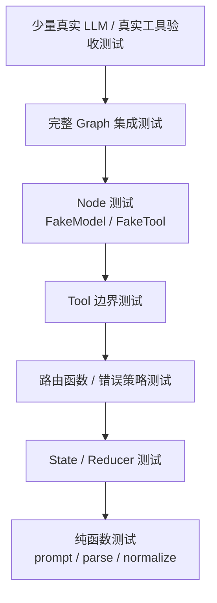
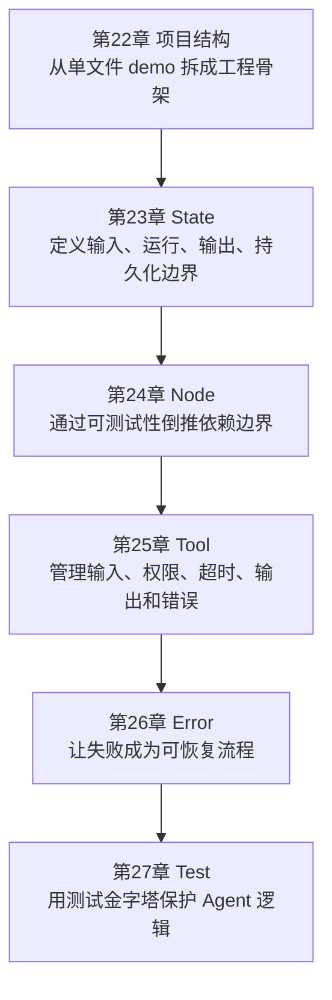

# 第27章-测试 LangGraph 应用

## 27.1 从一个又慢又不稳定的测试开始

第六部分前面几章一直在做一件事：

```text
把 LangGraph 应用从能跑的 demo，整理成可维护的工程项目。
```

第 22 章讲项目结构。

第 23 章讲 State 边界。

第 24 章讲 Node 边界。

第 25 章讲 Tool 风险边界。

第 26 章讲错误处理与重试。

现在进入第六部分最后一章：测试 LangGraph 应用。

很多人第一次测试 Agent，会写出这样的测试：

```python
def test_research_agent():
    graph = build_graph()

    result = graph.invoke({
        "question": "LangGraph 为什么适合构建 Agent？"
    })

    assert "LangGraph" in result["final_answer"]
```

这看起来没问题。

它确实验证了完整图能跑。

但它也有很多问题：

```text
它依赖真实 LLM。
它依赖真实工具。
它可能需要 Ollama 正在运行。
它可能需要 DeepSeek API key。
它可能因为网络波动失败。
它可能因为模型换了一种说法而失败。
它运行很慢。
它失败时很难定位是哪个节点错了。
```

于是开发者很容易得出一个错误结论：

```text
Agent 很难测试。
```

其实更准确的说法是：

```text
如果所有测试都从 graph.invoke + 真实 LLM 开始，Agent 就很难测试。
```

本章要解决的问题是：

> 如何不用真实 LLM，也能测试大部分 Agent 逻辑？

## 27.2 本章目标

本章采用“测试金字塔法”。

我们不会把 LangGraph 测试理解成一种测试。

而是分成多层：

```text
纯函数测试。
State / reducer 测试。
路由函数测试。
Node 测试。
Tool 测试。
错误路径测试。
完整图测试。
少量真实模型验收测试。
```

越底层，测试越多、越快、越稳定。

越顶层，测试越少、越接近真实运行。

读完本章，读者应该能回答这些问题：

| 问题 | 本章要建立的理解 |
| --- | --- |
| 为什么不要只测完整 graph？ | 完整图测试慢，失败定位差，容易依赖真实外部服务 |
| 哪些逻辑不需要真实 LLM？ | prompt 构造、解析、路由、State 合并、错误处理、工具边界 |
| FakeModel 有什么用？ | 用稳定输出替代真实模型，测试节点读写和 prompt |
| FakeTool 有什么用？ | 用可控结果和错误测试工具节点 |
| Graph 测试应该测什么？ | 关键路径、分支路径、失败路径、checkpoint/interrupt 基本行为 |
| 真实 LLM 测试应该放在哪里？ | 少量验收测试或评测集，不作为大部分单元测试 |

本章最重要的一句话是：

```text
LangGraph 应用的大部分逻辑，都可以在不调用真实 LLM 的情况下测试。
```

## 27.3 LangGraph 测试金字塔

先看整体结构。



这张图不是说下面的测试更低级。

它是在说：

```text
越靠下，越应该多写。
越靠上，越应该少写但更接近真实环境。
```

可以用一张表理解：

| 测试层级 | 是否需要真实 LLM | 速度 | 主要验证 |
| --- | --- | --- | --- |
| 纯函数测试 | 不需要 | 很快 | prompt、解析、规范化 |
| State / reducer 测试 | 不需要 | 很快 | 状态合并语义 |
| 路由函数测试 | 不需要 | 很快 | 分支选择 |
| Node 测试 | 不需要 | 快 | 读写字段、调用依赖 |
| Tool 测试 | 通常不需要真实外部服务 | 中等 | 输入、权限、超时、错误 |
| Graph 测试 | 不需要真实 LLM | 中等 | 节点连接、路径、循环 |
| 真实验收测试 | 需要 | 慢 | 端到端效果和模型质量 |

如果项目里 80% 测试都在真实 LLM 上跑，测试会又慢又脆。

更好的比例是：

```text
大多数测试用 fake model / fake tool。
少数测试运行完整 graph。
极少数测试调用真实模型和真实工具。
```

## 27.4 第一层：纯函数测试

第 24 章说过，节点里很多逻辑应该拆成普通函数。

例如 prompt 构造：

```python
def build_route_prompt(question: str) -> str:
    return (
        "请判断下面问题应该如何处理。"
        "只回答 direct、need_search 或 need_human_review。\n\n"
        f"问题：{question}"
    )
```

它不需要 LangGraph。

不需要模型。

直接测试：

```python
def test_build_route_prompt_contains_question():
    prompt = build_route_prompt("什么是 LangGraph？")

    assert "什么是 LangGraph？" in prompt
    assert "direct" in prompt
    assert "need_search" in prompt
```

再比如解析函数：

```python
def normalize_route(text: str) -> str:
    value = text.strip().lower()

    if value in {"direct", "need_search", "need_human_review"}:
        return value

    return "need_human_review"
```

测试：

```python
def test_normalize_route_accepts_valid_value():
    assert normalize_route(" NEED_SEARCH ") == "need_search"


def test_normalize_route_fallbacks_to_human_review():
    assert normalize_route("unknown") == "need_human_review"
```

这些测试很小。

但它们价值很大。

因为很多 Agent bug 都不是模型不会回答，而是：

```text
prompt 少了关键字段。
解析逻辑没处理空格。
模型输出大小写变化后路由失败。
非法输出没有 fallback。
```

纯函数测试就是把这些小问题提前按住。

## 27.5 第二层：State 和 reducer 测试

State 是 LangGraph 应用的数据契约。

第 23 章讲过，如果多个节点写同一个字段，必须明确 reducer。

例如：

```python
from operator import add
from typing import Annotated, TypedDict


class ResearchState(TypedDict, total=False):
    materials: Annotated[list[str], add]
    warnings: Annotated[list[str], add]
```

我们可以测试 reducer 的预期行为。

不一定要启动完整图，也可以测试 reducer 函数本身。

例如如果你用的是自定义去重 reducer：

```python
def merge_unique(left: list[str], right: list[str]) -> list[str]:
    result = list(left)

    for item in right:
        if item not in result:
            result.append(item)

    return result
```

测试：

```python
def test_merge_unique_appends_without_duplicates():
    result = merge_unique(["A", "B"], ["B", "C"])

    assert result == ["A", "B", "C"]
```

如果你只用 `operator.add`，也至少要在节点测试或图测试里确认：

```text
多个工具写入 materials 时不是后写覆盖前写。
```

State 测试重点包括：

| 测试内容 | 目的 |
| --- | --- |
| reducer 行为 | 确认追加、去重、累加符合预期 |
| 错误记录结构 | 确认 errors 字段可被路由读取 |
| 输出过滤 | 确认不会把内部字段返回给外部 |
| 默认值处理 | 确认缺字段时节点不会随意崩溃 |

State 测试不是为了测试 `TypedDict` 本身。

而是为了测试：

```text
状态合并和状态边界是否符合工程预期。
```

## 27.6 第三层：路由函数测试

路由函数是最值得单独测试的部分之一。

因为 LangGraph 的流程控制经常由它决定。

例如：

```python
def decide_after_route(state: ResearchState) -> str:
    if state.get("route") == "direct":
        return "write_direct_answer"
    if state.get("route") == "need_search":
        return "plan_search"
    return "human_review"
```

测试：

```python
def test_decide_after_route_direct():
    assert decide_after_route({"route": "direct"}) == "write_direct_answer"


def test_decide_after_route_need_search():
    assert decide_after_route({"route": "need_search"}) == "plan_search"


def test_decide_after_route_unknown_goes_to_human_review():
    assert decide_after_route({"route": "strange"}) == "human_review"
```

错误路由也要测。

例如第 26 章的失败处理：

```python
def decide_after_search(state: ResearchState) -> str:
    errors = state.get("errors", [])

    if not errors:
        return "write_answer"

    last_error = errors[-1]

    if last_error["retryable"] and state.get("retry_count", 0) < 2:
        return "increment_retry"

    if last_error["error_type"] == "tool_permission_denied":
        return "human_review"

    return "fallback_answer"
```

测试：

```python
def test_decide_after_search_success():
    assert decide_after_search({}) == "write_answer"


def test_decide_after_search_retryable_error():
    state = {
        "retry_count": 0,
        "errors": [
            {
                "node": "search_materials",
                "error_type": "tool_timeout",
                "message": "timeout",
                "retryable": True,
            }
        ],
    }

    assert decide_after_search(state) == "increment_retry"


def test_decide_after_search_permission_error():
    state = {
        "errors": [
            {
                "node": "search_materials",
                "error_type": "tool_permission_denied",
                "message": "denied",
                "retryable": False,
            }
        ],
    }

    assert decide_after_search(state) == "human_review"
```

这些测试完全不需要 LLM。

但它们能保护 Agent 最关键的控制流。

## 27.7 第四层：Node 测试

Node 测试的目标不是测试模型聪不聪明。

而是测试：

```text
节点读取了哪些 State 字段？
节点如何构造 prompt 或工具输入？
节点是否调用了传入依赖？
节点返回了哪些状态更新？
节点如何处理依赖失败？
```

先准备一个 FakeModel：

```python
class FakeModel:
    def __init__(self, content: str):
        self.content = content
        self.last_prompt = ""

    def invoke(self, prompt: str):
        self.last_prompt = prompt
        return type("Response", (), {"content": self.content})()
```

测试写作节点：

```python
def test_write_answer_uses_question_and_materials():
    model = FakeModel("最终回答")

    result = write_answer(
        {
            "question": "LangGraph 是什么？",
            "materials": ["资料 A"],
        },
        model,
    )

    assert result == {"final_answer": "最终回答"}
    assert "LangGraph 是什么？" in model.last_prompt
    assert "资料 A" in model.last_prompt
```

这个测试没有要求真实模型生成好答案。

它只验证节点的工程行为。

再测试路由节点：

```python
def test_route_question_normalizes_model_output():
    model = FakeModel(" NEED_SEARCH ")

    result = route_question(
        {"question": "LangGraph checkpoint 是什么？"},
        model,
    )

    assert result == {"route": "need_search"}
```

Node 测试应该尽量使用：

```text
FakeModel。
FakeTool。
FakeStore。
FakeReporter。
```

真实依赖留给更高层测试。

## 27.8 第五层：Tool 测试

工具测试关注边界。

第 25 章讲过，工具是 Agent 接触外部世界的风险边界。

以搜索工具为例：

```python
def validate_search_input(data: SearchInput) -> SearchInput:
    ...
```

测试输入校验：

```python
def test_validate_search_input_rejects_empty_query():
    with pytest.raises(ValueError):
        validate_search_input({"query": "", "max_results": 5})


def test_validate_search_input_limits_max_results():
    with pytest.raises(ValueError):
        validate_search_input({"query": "LangGraph", "max_results": 100})
```

以文件工具为例：

```python
def test_read_text_file_rejects_path_outside_root(tmp_path):
    root = tmp_path / "workspace"
    root.mkdir()

    with pytest.raises(PermissionError):
        read_text_file({"path": "../secret.txt"}, root=root)
```

工具测试通常不需要真实外部服务。

如果工具内部调用第三方 API，可以把 API client 注入进去：

```python
def search_docs(data: SearchInput, client) -> SearchResult:
    safe_input = validate_search_input(data)
    return client.search(safe_input)
```

测试时传 fake client：

```python
class FakeSearchClient:
    def search(self, data):
        return {
            "query": data["query"],
            "items": [
                {
                    "title": "LangGraph",
                    "url": "https://example.com",
                    "snippet": "test result",
                }
            ],
        }
```

这样就能测试工具边界，而不依赖真实网络。

## 27.9 第六层：错误路径测试

第 26 章强调：

```text
失败本身就是 Agent 流程的一部分。
```

所以测试不能只测成功路径。

例如工具节点：

```python
def search_materials(state: ResearchState, search_tool) -> dict:
    try:
        materials = search_tool(state["search_query"])
        return {"materials": materials}
    except TimeoutError as exc:
        return {
            "errors": [
                {
                    "node": "search_materials",
                    "error_type": "tool_timeout",
                    "message": str(exc),
                    "retryable": True,
                }
            ]
        }
```

测试失败转换：

```python
def test_search_materials_converts_timeout_to_error_state():
    def failing_search(query):
        raise TimeoutError("timeout")

    result = search_materials(
        {"search_query": "LangGraph"},
        failing_search,
    )

    assert result["errors"][0]["error_type"] == "tool_timeout"
    assert result["errors"][0]["retryable"] is True
```

测试 fallback：

```python
def test_decide_after_model_failure_uses_fallback():
    state = {
        "retry_count": 2,
        "errors": [
            {
                "node": "call_primary_model",
                "error_type": "model_timeout",
                "message": "timeout",
                "retryable": True,
            }
        ],
    }

    assert decide_after_primary_model(state) == "call_fallback_model"
```

错误路径测试重点包括：

| 场景 | 应测内容 |
| --- | --- |
| 模型超时 | 是否写入 `model_timeout`，是否可重试 |
| JSON 解析失败 | 是否写入 `parse_error`，是否进入修复路径 |
| 工具超时 | 是否重试或 fallback |
| 权限拒绝 | 是否不重试，进入人工处理或失败结束 |
| 用户拒绝 | 是否记录 `human_rejected` |
| 达到重试上限 | 是否停止循环，进入 fallback |

这些测试是 Agent 稳定性的底座。

## 27.10 第七层：Graph 集成测试

Graph 测试验证节点是否正确连接。

但它不一定要调用真实 LLM。

我们可以用 fake model 和 fake tool 构建测试图。

例如把 `build_graph` 写成可注入依赖：

```python
def build_graph(model, search_tool):
    builder = StateGraph(ResearchState)

    builder.add_node("route_question", make_route_question_node(model))
    builder.add_node("plan_search", make_plan_search_node(model))
    builder.add_node("search_materials", make_search_materials_node(search_tool))
    builder.add_node("write_answer", make_write_answer_node(model))

    ...

    return builder.compile()
```

测试时：

```python
def test_graph_direct_answer_path():
    model = FakeModelSequence([
        "direct",
        "这是直接回答",
    ])

    graph = build_graph(
        model=model,
        search_tool=lambda query: ["不应该被调用"],
    )

    result = graph.invoke({"question": "什么是 LangGraph？"})

    assert result["final_answer"] == "这是直接回答"
```

FakeModelSequence 可以这样写：

```python
class FakeModelSequence:
    def __init__(self, outputs: list[str]):
        self.outputs = list(outputs)
        self.prompts = []

    def invoke(self, prompt: str):
        self.prompts.append(prompt)
        content = self.outputs.pop(0)
        return type("Response", (), {"content": content})()
```

搜索路径测试：

```python
def test_graph_search_path():
    model = FakeModelSequence([
        "need_search",
        "LangGraph checkpoint",
        "最终回答",
    ])

    def fake_search(query):
        return ["资料 A"]

    graph = build_graph(model=model, search_tool=fake_search)

    result = graph.invoke({"question": "LangGraph 如何恢复？"})

    assert result["materials"] == ["资料 A"]
    assert result["final_answer"] == "最终回答"
```

Graph 测试应该覆盖：

```text
主成功路径。
关键条件分支。
循环和重试路径。
fallback 路径。
人工中断路径。
```

但不要把所有细节都放到 Graph 测试里。

细节已经由下层测试保护。

## 27.11 测试 checkpoint 和 thread

如果应用使用 checkpoint，就要测试恢复行为。

目标不是测试 LangGraph 自己的 checkpoint 实现。

而是测试你的图是否正确使用 thread、interrupt 和状态恢复。

例如：

```python
def test_graph_resume_with_same_thread_id():
    checkpointer = InMemorySaver()
    graph = build_graph(
        model=FakeModelSequence(["need_search", "query", "answer"]),
        search_tool=lambda query: ["资料 A"],
        checkpointer=checkpointer,
    )

    config = {"configurable": {"thread_id": "test-thread"}}

    first = graph.invoke(
        {"question": "LangGraph checkpoint 是什么？"},
        config=config,
    )

    second = graph.invoke(
        {"question": "继续"},
        config=config,
    )

    assert second is not None
```

如果有 interrupt，可以测试：

```text
第一次运行是否暂停。
interrupt payload 是否包含需要人类输入的信息。
resume 后是否继续同一 thread。
```

这类测试不用很多。

但只要应用依赖恢复能力，就应该有至少一两条覆盖关键路径。

## 27.12 测试 Streaming 输出

Streaming 测试不应该关注每一个 token。

更重要的是测试事件类型和关键状态是否出现。

例如：

```python
def test_graph_streams_progress_events():
    graph = build_graph(
        model=FakeModelSequence(["need_search", "query", "answer"]),
        search_tool=lambda query: ["资料 A"],
    )

    chunks = list(
        graph.stream(
            {"question": "LangGraph Streaming 是什么？"},
            stream_mode=["updates", "custom"],
        )
    )

    assert chunks
```

如果你的节点用了 `custom` event，可以测试：

```text
是否输出了 progress。
错误时是否输出了 error。
interrupt 时是否暴露了暂停信息。
```

不要让 Streaming 测试过度脆弱。

它应该验证：

```text
关键事件存在。
事件格式稳定。
敏感信息没有进入面向用户的 stream。
```

## 27.13 少量真实 LLM 验收测试

真实 LLM 不是不能测。

而是不要把它放在测试金字塔底部。

真实模型测试适合做验收测试：

```text
本地 Ollama 是否能跑通最小图。
DeepSeek 配置是否可用。
完整 Agent 是否能生成非空回答。
工具调用循环是否能完成一次真实任务。
```

这类测试可以少量存在。

例如：

```python
@pytest.mark.integration
def test_graph_with_real_ollama():
    graph = build_graph_with_real_ollama()

    result = graph.invoke({
        "question": "用一句话解释 LangGraph 的 State。"
    })

    assert result["final_answer"]
```

注意断言要宽松。

不要写：

```python
assert result["final_answer"] == "LangGraph 的 State 是..."
```

真实模型输出天然不稳定。

更适合断言：

```text
结果非空。
包含关键字段。
没有进入错误状态。
工具结果被使用。
输出结构正确。
```

真实 LLM 测试可以放到：

```text
手动验收。
夜间任务。
CI 的可选 integration 阶段。
发布前 smoke test。
```

不要让每次单元测试都依赖它。

## 27.14 测试目录建议

结合第 22 章的项目结构，测试目录可以这样组织：

```text
tests/
  unit/
    test_prompts.py
    test_parsers.py
    test_state.py
    test_routes.py
    test_nodes.py
    test_tools.py
    test_errors.py

  integration/
    test_graph_paths.py
    test_checkpoint_resume.py
    test_streaming.py

  e2e/
    test_real_ollama.py
    test_real_deepseek.py
```

也可以简单一点：

```text
tests/
  test_prompts.py
  test_routes.py
  test_nodes.py
  test_tools.py
  test_graph.py
```

目录结构取决于项目规模。

不要为了测试目录而测试目录。

但要保证几类测试能被区分：

```text
快测试：不依赖外部服务，默认每次都跑。
集成测试：依赖图编译和 checkpoint，按需跑。
真实模型测试：慢且不稳定，单独标记。
```

## 27.15 测试替身：Fake、Stub、Mock 怎么选

测试 LangGraph 应用时，经常需要替换真实模型和工具。

可以简单区分三类：

| 类型 | 用途 | 示例 |
| --- | --- | --- |
| Fake | 有简单可用实现 | `FakeModelSequence` |
| Stub | 返回固定结果 | `lambda query: ["资料 A"]` |
| Mock | 验证是否被调用 | 记录 `called_with` |

大部分情况下，Fake 和 Stub 就够了。

例如 fake search：

```python
def fake_search(query):
    return [f"result for {query}"]
```

需要验证工具是否被调用时，可以记录参数：

```python
class RecordingSearchTool:
    def __init__(self):
        self.queries = []

    def __call__(self, query):
        self.queries.append(query)
        return ["资料 A"]
```

测试：

```python
def test_search_node_calls_tool_with_search_query():
    tool = RecordingSearchTool()

    result = search_materials(
        {"search_query": "LangGraph"},
        tool,
    )

    assert tool.queries == ["LangGraph"]
    assert result == {"materials": ["资料 A"]}
```

不要为了 mock 而 mock。

目标是让测试稳定、清楚、容易定位问题。

## 27.16 测试不要断言模型文风

Agent 测试最容易犯的错误之一，是断言自然语言全文。

例如：

```python
assert result["final_answer"] == "LangGraph 是一个用于构建状态图 Agent 的框架。"
```

这很脆。

模型换一种说法，测试就失败。

更好的断言是结构化的：

```python
assert result["final_answer"]
assert "sources" in result
assert not result.get("errors")
```

如果必须判断内容质量，可以用更高层评测：

```text
关键词是否覆盖。
引用是否存在。
是否拒答敏感问题。
是否遵守格式。
人工评审或 LLM-as-judge。
```

但单元测试尽量不要检查文风。

单元测试应该保护工程逻辑。

模型效果应该用评测集和验收测试来判断。

## 27.17 CI 中如何安排测试

一个实用的测试安排可以是：

```text
每次提交：
  跑 unit 测试。
  不调用真实 LLM。

合并前：
  跑 unit + integration。
  使用 fake model / fake tool。

发布前：
  跑少量 real model smoke test。
  检查 Ollama / DeepSeek / 工具配置。

定期任务：
  跑评测集。
  观察质量、成本、延迟和失败率。
```

这样既能保证反馈速度，又不会完全脱离真实环境。

可以把真实模型测试标记为：

```python
@pytest.mark.integration
@pytest.mark.real_llm
```

默认不跑：

```bash
pytest tests/unit
```

需要时再跑：

```bash
pytest -m real_llm
```

核心原则是：

> 快速、稳定、便宜的测试应该频繁运行；昂贵、不稳定的测试应该少量、明确、单独运行。

## 27.18 常见错误与排查

### 错误一：所有测试都调用真实 LLM

现象：

```text
测试慢、贵、不稳定，还要求本地模型或 API key。
```

问题：

```text
工程逻辑被模型不确定性掩盖。
```

建议：

```text
用 FakeModel 测节点和图路径，只保留少量真实 LLM 验收测试。
```

### 错误二：只测最终答案

现象：

```text
assert result["final_answer"] 不为空。
```

问题：

```text
无法定位 route、tool、state、error 哪一层出错。
```

建议：

```text
分层测试 prompt、route、node、tool、graph。
```

### 错误三：没有失败路径测试

现象：

```text
成功路径都通过，但工具超时后图不知道去哪。
```

问题：

```text
错误处理逻辑没有被验证。
```

建议：

```text
为模型超时、解析失败、工具权限拒绝、重试上限分别写测试。
```

### 错误四：Graph 测试太多太细

现象：

```text
每个小函数变化都会导致完整图测试失败。
```

问题：

```text
Graph 测试承担了太多单元测试职责。
```

建议：

```text
Graph 测关键路径和连接关系，细节放到下层测试。
```

### 错误五：真实模型测试断言全文

现象：

```text
模型换个说法测试就失败。
```

问题：

```text
自然语言输出不稳定。
```

建议：

```text
真实模型测试断言结构、非空、关键字段和错误状态，不断言完整文风。
```

### 错误六：FakeModel 太复杂

现象：

```text
测试替身自己像一个小模型，逻辑越来越多。
```

问题：

```text
测试替身变成新的维护负担。
```

建议：

```text
FakeModel 只返回固定序列和记录 prompt，不模拟真实智能。
```

## 27.19 测试 LangGraph 应用检查清单

设计测试时，可以用这张表：

| 检查问题 | 判断目的 |
| --- | --- |
| prompt 构造是否能单独测试？ | 不依赖 LLM 检查输入是否完整 |
| 解析函数是否覆盖非法输出？ | 处理模型格式漂移 |
| reducer 是否有测试？ | 防止状态合并错误 |
| 路由函数是否纯函数测试？ | 保护控制流 |
| 节点是否用 FakeModel 测试？ | 避免真实模型拖慢单元测试 |
| 工具是否测试输入和权限边界？ | 防止危险调用 |
| 错误路径是否覆盖？ | 验证重试、fallback、人工介入 |
| Graph 是否测试关键路径？ | 确认节点和边连接正确 |
| checkpoint / interrupt 是否有最小测试？ | 保护恢复能力 |
| streaming 事件格式是否稳定？ | 支持 UI 和可观测性 |
| 真实 LLM 测试是否单独标记？ | 避免默认测试变慢变脆 |
| 是否避免断言自然语言全文？ | 减少模型不确定性导致的失败 |

如果一个 LangGraph 项目只能通过真实 LLM 端到端测试来验证，那说明模块边界还不够清楚。

测试困难通常不是测试工具的问题。

它往往是设计边界的问题。

## 27.20 第六部分总览：工程化闭环

到这里，第六部分完成了。

六章连起来看，其实是一条工程化路线：



这六章不是孤立的最佳实践。

它们共同回答一个问题：

```text
如何把一个 LangGraph demo 变成真实项目？
```

答案不是简单地加目录。

而是建立清晰边界：

| 章节 | 边界 |
| --- | --- |
| 第 22 章 | 项目结构边界 |
| 第 23 章 | 状态字段边界 |
| 第 24 章 | 节点依赖边界 |
| 第 25 章 | 工具风险边界 |
| 第 26 章 | 失败恢复边界 |
| 第 27 章 | 测试验证边界 |

这些边界建立起来后，LangGraph 项目才会真正可维护。

## 27.21 小结：大部分 Agent 逻辑都能脱离真实 LLM 测试

本章用“测试金字塔法”设计了 LangGraph 应用的测试体系。

我们从一个慢而脆的端到端测试开始，看到问题不在测试本身，而在测试层级没有拆开。

更好的方式是：

```text
用纯函数测试 prompt 和解析。
用 State 测试 reducer 和输出过滤。
用路由函数测试控制流。
用 FakeModel / FakeTool 测节点。
用工具测试保护输入、权限、超时和错误。
用 Graph 测试覆盖关键路径。
用少量真实 LLM 测试做验收。
```

读者应该记住这一句话：

> 真实 LLM 应该验证 Agent 的最终效果，但不应该承担大部分工程逻辑测试。

到这里，第六部分结束。

下一部分会进入进阶 Agent 架构。

当项目结构、状态、节点、工具、错误处理和测试边界都稳定以后，我们就可以开始构建更复杂的 Agent 形态：

```text
Router Agent。
Supervisor 多 Agent。
Plan-and-Execute Agent。
RAG Agent。
Reflection 自我修正。
```

这些架构会比前面的示例更复杂。

但第六部分建立的工程化边界，会让复杂度不至于重新失控。
