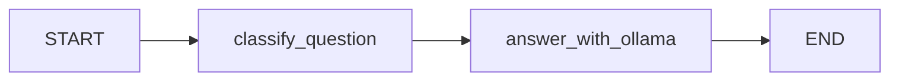
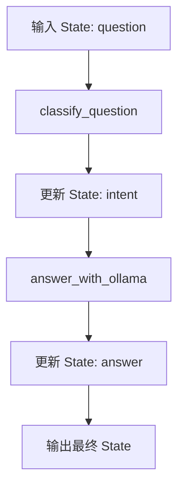

# 第12章-接入Ollama本地模型

## 12.1 先看目标效果

前三部分已经把 LangGraph 的基本编程模型讲清楚了：

- `State` 保存 Agent 的工作记忆。
- `Node` 完成一步具体工作。
- `Edge` 让流程显式流动。
- `Reducer` 处理多个更新的合并。
- `Command` 和 `Send` 处理更动态的控制流。

从这一章开始，我们不再只讨论“图应该怎么写”，而是把图接到真实模型后端上。

本章先接入 Ollama。本地模型的好处很直接：不用每次请求远程 API，不需要把学习阶段的问题发到外部服务，也更适合反复调试 LangGraph 程序。

本章要完成一个最小本地 Agent：

```text
用户问题
-> Ollama 判断问题类型
-> Ollama 根据类型生成回答
-> 输出最终结果
```

运行命令：

```bash
python codes/chapter12/chapter12_ollama_local_agent.py
```

期望看到类似输出：

```text
问题：用三句话解释 LangGraph 中 State 的作用。
分类：concept

回答：
State 是 LangGraph 在图运行过程中携带的数据容器...
```

这个例子仍然很小，但它已经不是第 5 章那种“只有一个模型调用”的程序了。它有两个节点：一个节点负责分类，一个节点负责回答。Ollama 不只是被调用一次，而是成为这个 Agent 的本地模型后端。

本章主线是：

```text
先让本地模型跑起来
-> 再把模型封装进 LangGraph 节点
-> 最后观察本地 Agent 的能力和限制
```

## 12.2 为什么先用 Ollama

学习 LangGraph 时，很容易一上来就把注意力放在最强模型、最长上下文、最复杂工具调用上。但这会让读者同时面对太多变量：

```text
LangGraph 写法是否正确？
模型 API 是否可用？
网络是否稳定？
API Key 是否配置正确？
模型输出是否符合预期？
```

如果这些问题混在一起，程序一旦失败，就很难判断到底是哪一层出了问题。

Ollama 的价值在于先把模型运行环境收回到本地。这样排查路径会短很多：

```text
Ollama 服务是否启动
-> 模型是否已经拉取
-> Python 是否能调用本地模型
-> LangGraph 节点是否正确返回状态更新
```

这符合本书一直采用的写法：先跑通最小闭环，再解释它背后的结构。

本章不是要证明 Ollama 比远程大模型更强，而是要让读者获得一个稳定的本地 Agent 起点。后面第 13 章接入 DeepSeek 时，我们再讨论什么时候需要更强推理模型。

## 12.3 准备 Ollama 模型

如果你已经完成第 4 章，这一步应该已经做过。

先确认 Ollama 能访问：

```bash
ollama list
```

如果命令能列出模型，说明 Ollama 服务可用。

本书默认使用：

```bash
ollama pull qwen3:4b
```

如果你本地使用的是其他模型，比如 `llama3.1`、`gemma3` 或 `deepseek-v4-flash`，后面代码里的模型名也要同步修改：

```python
llm = ChatOllama(
    model="qwen3:4b",
    temperature=0,
)
```

这里先用 `qwen3:4b`，原因不是它一定最强，而是它体积适中，适合学习阶段反复运行。

如果机器配置较弱，可以换成更小的模型。学习 LangGraph 时，模型回答是否完美不是第一目标；先看清图如何驱动模型运行，才是本章重点。

## 12.4 完整代码

新建文件：

```text
codes/chapter12/chapter12_ollama_local_agent.py
```

完整代码如下：

```python
from typing import TypedDict

from langchain_ollama import ChatOllama
from langgraph.graph import END, START, StateGraph


class LocalAgentState(TypedDict):
    question: str
    intent: str
    answer: str


llm = ChatOllama(
    model="qwen3:4b",
    temperature=0,
)


def classify_question(state: LocalAgentState) -> dict:
    prompt = f"""
请判断下面的问题属于哪一类，只输出一个分类词：
- concept：解释概念
- code：询问代码
- other：其他问题

问题：{state["question"]}
"""
    response = llm.invoke(prompt)
    intent = response.content.strip().lower()

    if "concept" in intent:
        return {"intent": "concept"}
    if "code" in intent:
        return {"intent": "code"}
    return {"intent": "other"}


def answer_with_ollama(state: LocalAgentState) -> dict:
    prompt = f"""
你是一个 LangGraph 教学助手。
请根据问题类型回答用户问题。

问题类型：{state["intent"]}
用户问题：{state["question"]}

要求：
1. 回答要简洁。
2. 如果是概念问题，用通俗语言解释。
3. 如果是代码问题，优先说明关键思路，不要生成过长代码。
"""
    response = llm.invoke(prompt)
    return {"answer": response.content}


builder = StateGraph(LocalAgentState)

builder.add_node("classify_question", classify_question)
builder.add_node("answer_with_ollama", answer_with_ollama)

builder.add_edge(START, "classify_question")
builder.add_edge("classify_question", "answer_with_ollama")
builder.add_edge("answer_with_ollama", END)

graph = builder.compile()


if __name__ == "__main__":
    question = "用三句话解释 LangGraph 中 State 的作用。"
    result = graph.invoke({"question": question})

    print(f"问题：{result['question']}")
    print(f"分类：{result['intent']}")
    print()
    print("回答：")
    print(result["answer"])
```

运行：

```bash
python codes/chapter12/chapter12_ollama_local_agent.py
```

这个程序的关键不是代码长度，而是它已经具备真实 Agent 的基本形状：

```text
先理解输入
-> 再选择回答方式
-> 最后生成结果
```

虽然两个节点都调用同一个本地模型，但它们的职责不同。一个负责判断，一个负责生成。这就是从“调用模型”走向“设计 Agent”的第一步。

## 12.5 这张图长什么样

本章的图结构是：



如果把状态变化画出来，会更清楚：



这张图里最重要的是状态推进：

```text
初始状态：
{"question": "..."}

分类节点之后：
{"question": "...", "intent": "concept"}

回答节点之后：
{"question": "...", "intent": "concept", "answer": "..."}
```

LangGraph 并不关心 Ollama 内部如何推理。它关心的是每个节点读取什么状态、返回什么状态更新、下一步流向哪里。

这就是把模型调用放进图结构后的变化：模型不再是程序的全部，而是节点内部完成一步工作的能力。

## 12.6 拆解代码：本地模型后端

模型创建部分只有几行：

```python
llm = ChatOllama(
    model="qwen3:4b",
    temperature=0,
)
```

`ChatOllama` 是 LangChain 提供的 Ollama 聊天模型封装。它让我们可以用统一的 `invoke()` 方法调用本地模型。

这里设置：

```python
temperature=0
```

是为了让输出尽量稳定。学习阶段最怕的不是模型回答不够有创意，而是每次运行差异太大，导致读者很难判断代码是否正确。

如果你想让回答更发散，可以调高 temperature：

```python
temperature=0.7
```

但本书示例默认保持低随机性。原因很简单：我们是在学习 Agent 结构，不是在追求文学创作效果。

注意，`llm` 只是一个普通 Python 对象。LangGraph 并没有要求节点必须使用某一种模型。只要节点能读取 State 并返回状态更新，它内部可以调用 Ollama，也可以调用 DeepSeek，还可以调用工具、数据库或普通函数。

## 12.7 拆解代码：分类节点

第一个节点是：

```python
def classify_question(state: LocalAgentState) -> dict:
    prompt = f"""
请判断下面的问题属于哪一类，只输出一个分类词：
- concept：解释概念
- code：询问代码
- other：其他问题

问题：{state["question"]}
"""
    response = llm.invoke(prompt)
    intent = response.content.strip().lower()

    if "concept" in intent:
        return {"intent": "concept"}
    if "code" in intent:
        return {"intent": "code"}
    return {"intent": "other"}
```

这个节点读取：

```python
state["question"]
```

然后写入：

```python
{"intent": "concept"}
```

它不负责回答问题，只负责判断问题类型。

这点很重要。真实 Agent 的节点不应该都写成“万能函数”。如果一个节点既分类、又生成答案、又决定路由、又调用工具，它很快就会变成一个难以测试的大函数。

本章先把“分类”和“回答”拆开，是为了让读者看到节点职责的边界。

这里还有一个小细节：

```python
if "concept" in intent:
    return {"intent": "concept"}
```

为什么不用严格等于？

因为本地模型有时不会完全按要求只输出一个词。它可能输出：

```text
concept
```

也可能输出：

```text
分类：concept
```

所以这里做了一个很轻量的容错。真实工程里，分类输出最好使用结构化输出或更严格的解析方式。第 14 章讲工具调用时，我们会继续看到“模型输出不稳定”这个问题。

## 12.8 拆解代码：回答节点

第二个节点是：

```python
def answer_with_ollama(state: LocalAgentState) -> dict:
    prompt = f"""
你是一个 LangGraph 教学助手。
请根据问题类型回答用户问题。

问题类型：{state["intent"]}
用户问题：{state["question"]}

要求：
1. 回答要简洁。
2. 如果是概念问题，用通俗语言解释。
3. 如果是代码问题，优先说明关键思路，不要生成过长代码。
"""
    response = llm.invoke(prompt)
    return {"answer": response.content}
```

这个节点读取两个字段：

```python
state["intent"]
state["question"]
```

然后写入：

```python
{"answer": response.content}
```

注意，这个节点并不知道 `intent` 是怎么来的。它只相信上游节点已经把 `intent` 写进了 State。

这就是 State 的连接作用：

```text
classify_question 不直接调用 answer_with_ollama
answer_with_ollama 也不直接依赖 classify_question 的局部变量
它们通过 State 交接数据
```

如果后面想把分类节点换成规则函数，不调用模型，也可以：

```text
rule_based_classifier -> answer_with_ollama
```

如果后面想把回答节点换成 DeepSeek，也可以：

```text
classify_question -> answer_with_deepseek
```

节点之间通过 State 连接，内部实现就可以替换。这是 LangGraph 程序比一串函数调用更容易演化的原因。

## 12.9 Ollama 在这个 Agent 中负责什么

在本章示例里，Ollama 做了两件事：

| 节点 | Ollama 的角色 | 输入 | 输出 |
| --- | --- | --- | --- |
| `classify_question` | 判断器 | 用户问题 | `intent` |
| `answer_with_ollama` | 生成器 | 用户问题 + 问题类型 | `answer` |

同一个模型可以在不同节点里扮演不同角色。

这和普通聊天程序很不一样。普通聊天程序通常是：

```text
用户输入 -> 模型回答
```

而 Agent 程序更像：

```text
用户输入
-> 判断任务类型
-> 选择处理方式
-> 执行处理
-> 形成结果
```

Ollama 本地模型在这里不是“聊天窗口背后的模型”，而是 Agent 图里每个节点可以调用的能力。

这个视角非常重要。后面当我们接入 DeepSeek、工具调用、多模型协作时，不是要推翻这张图，而是替换或增加节点能力：

```text
本地模型分类
-> 远程模型复杂推理
-> 工具节点查资料
-> 本地模型总结结果
```

## 12.10 本地模型的优势和限制

Ollama 很适合作为学习和原型阶段的默认后端。

它的优势是：

| 优势 | 说明 |
| --- | --- |
| 本地运行 | 不依赖远程 API，可离线调试 |
| 成本可控 | 学习阶段可以反复运行，不担心调用费用 |
| 隐私更好 | 输入内容不必发送到外部服务 |
| 启动简单 | 拉取模型后即可通过本地服务调用 |
| 适合小闭环 | 非常适合验证节点、边、状态设计 |

但它也有限制：

| 限制 | 影响 |
| --- | --- |
| 速度依赖本机配置 | 大模型在普通电脑上可能很慢 |
| 推理能力不一定够强 | 复杂规划、严谨推理可能不稳定 |
| 输出格式可能漂移 | 分类、JSON、工具调用需要额外约束 |
| 上下文长度有限 | 长文档任务可能需要切分或换模型 |
| 部署方式不同 | 本地学习方便，生产环境还要考虑服务化 |

所以本章的结论不是“所有 Agent 都应该只用 Ollama”，而是：

> 用 Ollama 建立本地可运行闭环，用更强模型处理复杂推理。

这正好引出下一章 DeepSeek 的位置。

## 12.11 常见错误与排查

接入 Ollama 时，错误通常集中在三层：服务、模型、节点。

| 现象 | 可能原因 | 排查方式 |
| --- | --- | --- |
| `Connection refused` | Ollama 服务没有启动 | 打开 Ollama 或运行 `ollama list` 检查 |
| `model not found` | 本地没有拉取该模型 | 运行 `ollama pull qwen3:4b` |
| 程序一直很慢 | 模型太大或机器资源不足 | 换小模型，或先用更短问题测试 |
| `ModuleNotFoundError: langchain_ollama` | Python 环境缺依赖 | 确认已安装 `langchain-ollama` |
| `KeyError: 'question'` | 初始状态没有传入问题 | 检查 `graph.invoke({"question": question})` |
| `KeyError: 'intent'` | 回答节点运行前没有写入分类 | 检查边是否是 `classify_question -> answer_with_ollama` |
| 分类结果奇怪 | 模型没有严格输出分类词 | 降低 temperature，或增强 prompt 约束 |

可以按这条线排查：

```text
Ollama 命令能不能运行
-> 模型是否已经拉取
-> Python 能不能导入 ChatOllama
-> 单独 llm.invoke 是否可用
-> 节点是否返回 dict
-> State 字段是否按顺序写入
```

如果前四步不通，问题在模型后端。

如果前四步都通，但 LangGraph 运行失败，问题通常在 State、节点返回值或边连接上。

这个排查习惯很重要。真实 Agent 失败时，不要一上来就怀疑整个框架。先分层判断：是模型后端失败，还是图结构失败。

## 12.12 本章小结

本章用 Ollama 构建了第一个本地 Agent。

它的结构很简单：

```text
START
-> classify_question
-> answer_with_ollama
-> END
```

但它已经把第四部分的主线立起来了：

```text
模型不是 Agent 本身
模型是节点可以调用的能力
Agent 是围绕 State、Node、Edge 和模型能力组织起来的运行过程
```

通过本章，读者应该记住三件事：

1. Ollama 适合建立本地可运行闭环。
2. 模型调用应该封装在节点内部。
3. 节点之间最好通过 State 交接数据，而不是互相依赖局部变量。

下一章会在这个基础上接入 DeepSeek。那时我们会看到：只要图结构设计得清楚，模型后端就可以替换。本地模型适合快速分类和轻量处理，远程强模型适合复杂推理和高质量生成。
