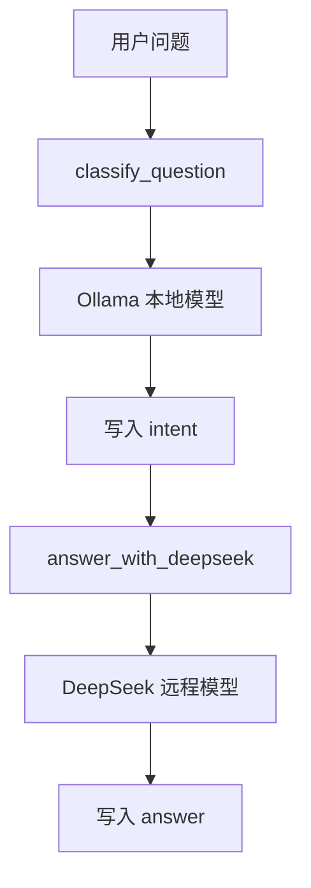

# 第13章-接入DeepSeek

## 13.1 先看一个能跑但不够好的 Agent

上一章我们用 Ollama 写了一个本地 Agent：

```text
用户问题
-> classify_question
-> answer_with_ollama
-> 最终回答
```

这个程序的价值很明确：它能在本地跑起来，适合学习、调试和验证 LangGraph 图结构。

但真实 Agent 很快会遇到一个问题：不是所有任务都适合交给本地小模型。

例如用户问：

```text
如果一个 LangGraph Agent 既要本地隐私，又要复杂推理，应该如何在 Ollama 和 DeepSeek 之间分工？
```

这个问题不是简单概念解释。它要求模型同时考虑：

- 隐私。
- 成本。
- 速度。
- 推理质量。
- 模型分工。
- 图结构设计。

如果继续使用上一章的全 Ollama 版本，程序也许能回答，但答案可能过于笼统：

```text
可以用 Ollama 处理本地任务，用 DeepSeek 处理复杂任务。
```

这句话方向没错，但对开发者还不够。真实设计需要回答：

```text
哪些节点应该用 Ollama？
哪些节点应该用 DeepSeek？
模型切换会不会影响图结构？
如何避免把模型调用写死在节点里？
```

这就是本章要解决的问题。

本章不把 DeepSeek 当成一个孤立 API 来讲，而是把它放进一次重构里：

```text
先看到全 Ollama Agent 的限制
-> 抽出可替换的模型接口
-> 接入 DeepSeek
-> 让图结构保持不变，只替换节点内部能力
```

这就是“问题驱动重构法”。

## 13.2 本章目标

本章最终要写出一个混合模型 Agent：

```text
Ollama：负责快速分类
DeepSeek：负责复杂推理和高质量回答
LangGraph：负责状态、节点和流程
```

运行命令：

```bash
python codes/chapter13/chapter13_deepseek_refactor_agent.py
```

期望看到类似输出：

```text
问题：如果一个 LangGraph Agent 既要本地隐私，又要复杂推理，应该如何在 Ollama 和 DeepSeek 之间分工？
分类：reasoning

回答：
可以把 Ollama 放在靠近输入和隐私数据的位置，把 DeepSeek 放在需要复杂推理的节点...
```

这个示例和第 12 章相比，图结构没有变复杂多少：

```text
START
-> classify_question
-> answer_with_deepseek
-> END
```

真正变化的是模型层：

```text
classify_question 使用 Ollama
answer_with_deepseek 使用 DeepSeek
```

这也是本章最重要的设计口径：

> 不要让图结构绑死某一个模型。模型应该是节点可以替换的能力。

## 13.3 问题：把模型写死在节点里

第 12 章的代码里，我们直接创建了一个全局模型：

```python
llm = ChatOllama(
    model="qwen3:4b",
    temperature=0,
)
```

然后两个节点都使用它：

```python
response = llm.invoke(prompt)
```

这个写法适合最小闭环。它简单，直接，容易跑通。

但当 Agent 变复杂时，它会带来三个问题。

第一，模型职责不清楚。

分类节点和回答节点都叫同一个 `llm`，读者很难看出：

```text
这个模型是在做快速判断？
还是在做复杂推理？
```

第二，模型替换不方便。

如果要把回答节点换成 DeepSeek，就要进入节点内部改代码：

```python
response = deepseek_llm.invoke(prompt)
```

如果以后还要加入第三个模型，节点会越来越混乱。

第三，无法表达模型分工。

真实 Agent 常常不是“全程使用一个模型”，而是：

```text
轻模型做分类、摘要、格式整理。
强模型做规划、推理、审查、最终生成。
```

所以，第 12 章的写法能跑，但不适合继续扩展。

本章的重构目标是：

```text
把模型后端从节点逻辑里稍微抽出来
让节点仍然简单
同时让不同节点可以选择不同模型
```

## 13.4 重构思路：给模型一个共同接口

Ollama 和 DeepSeek 来自不同服务，但在 LangChain 的封装下，它们都有相似的调用方式：

```python
response = model.invoke(prompt)
```

这给了我们一个很自然的抽象：

```python
class ChatModel(Protocol):
    def invoke(self, input: str) -> BaseMessage:
        ...
```

它表示：只要一个对象能接收字符串输入，并返回一条模型消息，就可以被节点使用。

这个接口不复杂，甚至有点朴素。

但它解决了一个重要问题：节点不需要知道自己调用的是 Ollama 还是 DeepSeek。节点只需要知道：

```text
我有一个可调用的聊天模型。
我把 prompt 交给它。
它返回 response.content。
```

这就是模型层解耦的第一步。

不要过早设计很大的模型管理系统。现在只需要两个工厂函数：

```python
def build_ollama_model() -> ChatModel:
    return ChatOllama(
        model="qwen3:4b",
        temperature=0,
    )


def build_deepseek_model() -> ChatModel:
    return ChatDeepSeek(
        model="deepseek-v4-flash",
        temperature=0,
    )
```

它们的作用是把模型创建集中起来。节点不再关心构造参数，只关心拿到哪个模型对象。

## 13.5 完整代码

新建文件：

```text
codes/chapter13/chapter13_deepseek_refactor_agent.py
```

完整代码如下：

```python
from typing import Protocol, TypedDict

from dotenv import load_dotenv
from langchain_deepseek import ChatDeepSeek
from langchain_ollama import ChatOllama
from langchain_core.messages import BaseMessage
from langgraph.graph import END, START, StateGraph


class ChatModel(Protocol):
    def invoke(self, input: str) -> BaseMessage:
        ...


class HybridAgentState(TypedDict):
    question: str
    intent: str
    answer: str


def build_ollama_model() -> ChatModel:
    return ChatOllama(
        model="qwen3:4b",
        temperature=0,
    )


def build_deepseek_model() -> ChatModel:
    return ChatDeepSeek(
        model="deepseek-v4-flash",
        temperature=0,
    )


load_dotenv()

fast_model = build_ollama_model()
reasoning_model = build_deepseek_model()


def classify_question(state: HybridAgentState) -> dict:
    prompt = f"""
请判断下面的问题属于哪一类，只输出一个分类词：
- concept：解释概念
- code：询问代码
- reasoning：需要复杂推理
- other：其他问题

问题：{state["question"]}
"""
    response = fast_model.invoke(prompt)
    intent = response.content.strip().lower()

    if "reasoning" in intent:
        return {"intent": "reasoning"}
    if "concept" in intent:
        return {"intent": "concept"}
    if "code" in intent:
        return {"intent": "code"}
    return {"intent": "other"}


def answer_with_deepseek(state: HybridAgentState) -> dict:
    prompt = f"""
你是一个 LangGraph Agent 开发导师。
请回答下面的问题。

问题类型：{state["intent"]}
用户问题：{state["question"]}

要求：
1. 先给出直接答案。
2. 再解释关键原因。
3. 如果问题涉及取舍，请说明适用场景。
4. 回答保持清晰，不要堆 API 名称。
"""
    response = reasoning_model.invoke(prompt)
    return {"answer": response.content}


builder = StateGraph(HybridAgentState)

builder.add_node("classify_question", classify_question)
builder.add_node("answer_with_deepseek", answer_with_deepseek)

builder.add_edge(START, "classify_question")
builder.add_edge("classify_question", "answer_with_deepseek")
builder.add_edge("answer_with_deepseek", END)

graph = builder.compile()


if __name__ == "__main__":
    question = (
        "如果一个 LangGraph Agent 既要本地隐私，又要复杂推理，"
        "应该如何在 Ollama 和 DeepSeek 之间分工？"
    )
    result = graph.invoke({"question": question})

    print(f"问题：{result['question']}")
    print(f"分类：{result['intent']}")
    print()
    print("回答：")
    print(result["answer"])
```

运行前要确认 `.env` 中已经配置：

```text
DEEPSEEK_API_KEY=你的 DeepSeek API Key
```

然后运行：

```bash
python codes/chapter13/chapter13_deepseek_refactor_agent.py
```

如果 Ollama 服务已经启动，DeepSeek API Key 也正确，程序会先用本地模型分类，再用 DeepSeek 生成回答。

## 13.6 图结构没有变，能力变了

这个示例的图结构仍然很简单：


但如果把模型后端画进去，就能看到第 13 章和第 12 章的区别：



图结构没有明显变复杂，但 Agent 能力变了。

第 12 章是：

```text
所有节点都使用 Ollama。
```

第 13 章是：

```text
轻量判断交给 Ollama。
复杂回答交给 DeepSeek。
```

这就是重构的价值：我们没有推翻上一章的图，只是调整了节点内部的模型能力。

真实项目中，这种演化非常常见。不要一开始就设计一个庞大的多模型系统。先写出能跑的版本，再在出现真实问题时重构模型边界。

## 13.7 拆解代码：两个模型对象

本章创建了两个模型对象：

```python
fast_model = build_ollama_model()
reasoning_model = build_deepseek_model()
```

名字比 `llm` 更重要。

`fast_model` 表达的是用途：

```text
速度优先，适合本地轻量任务。
```

`reasoning_model` 表达的是用途：

```text
推理质量优先，适合复杂回答。
```

这比直接写：

```python
ollama = ChatOllama(...)
deepseek = ChatDeepSeek(...)
```

更接近 Agent 设计思维。

因为在真实系统里，模型可能会变化：

```text
今天 fast_model 是 qwen3:4b。
明天 fast_model 可能换成另一个本地模型。
今天 reasoning_model 是 deepseek-v4-flash。
明天 reasoning_model 可能换成另一个强推理模型。
```

节点真正依赖的不是模型品牌，而是模型角色。

这也是本章最想让读者形成的习惯：

> 在 Agent 代码里，优先按职责命名模型，而不是按厂商命名模型。

## 13.8 拆解代码：Ollama 继续负责分类

分类节点仍然使用本地模型：

```python
response = fast_model.invoke(prompt)
```

为什么分类还留给 Ollama？

因为分类通常是轻量任务：

```text
判断是概念问题、代码问题、推理问题，还是其他问题。
```

这类任务不一定需要最强模型。用本地模型做分类有几个好处：

| 好处 | 说明 |
| --- | --- |
| 快 | 少一次远程 API 请求 |
| 省 | 分类任务不消耗远程模型额度 |
| 隐私更好 | 原始输入可以先在本地做初步判断 |
| 可替换 | 分类逻辑以后甚至可以换成规则函数 |

这并不意味着本地模型永远适合分类。若分类规则非常严格，或者需要复杂领域判断，也可以换成 DeepSeek。

但本章的重点是模型分工：

```text
不是所有节点都必须使用同一个模型。
```

## 13.9 拆解代码：DeepSeek 负责复杂回答

回答节点改成：

```python
response = reasoning_model.invoke(prompt)
```

这个节点读取：

```python
state["intent"]
state["question"]
```

然后写入：

```python
{"answer": response.content}
```

从 LangGraph 的角度看，它和第 12 章的回答节点没有本质区别。它仍然是：

```text
读取 State
-> 调用模型
-> 返回 State 更新
```

变化只发生在节点内部：

```text
第 12 章：调用 Ollama。
第 13 章：调用 DeepSeek。
```

这说明图结构和模型后端可以分开演化。

如果图结构清楚，替换模型不会影响 `StateGraph` 的主体：

```python
builder.add_node("classify_question", classify_question)
builder.add_node("answer_with_deepseek", answer_with_deepseek)

builder.add_edge(START, "classify_question")
builder.add_edge("classify_question", "answer_with_deepseek")
builder.add_edge("answer_with_deepseek", END)
```

这段图声明不需要知道 DeepSeek 的 API Key，也不需要知道模型名称。

模型配置属于节点能力层，图声明属于流程层。两者越清楚，后面越容易维护。

## 13.10 改造前后对比

第 12 章和第 13 章的差异可以用一张表说明：

| 对比项 | 第 12 章 | 第 13 章 |
| --- | --- | --- |
| 写作方法 | 最小闭环法 | 问题驱动重构法 |
| 主要目标 | 本地 Agent 跑起来 | 让模型后端可替换 |
| 分类节点 | Ollama | Ollama |
| 回答节点 | Ollama | DeepSeek |
| 模型变量 | 一个 `llm` | `fast_model` + `reasoning_model` |
| 适合任务 | 学习、调试、轻量问答 | 复杂推理、高质量生成 |
| 核心收获 | 模型可以放进节点 | 不同节点可以使用不同模型 |

重构前：

```text
所有任务都交给同一个本地模型。
```

重构后：

```text
不同任务交给不同模型角色。
```

这不是为了炫技，而是因为 Agent 的任务天然有分层。

一个真实 Agent 里，常见分工是：

| 任务 | 更适合的模型 |
| --- | --- |
| 简单分类 | 本地小模型或规则 |
| 短文本摘要 | 本地模型 |
| 复杂规划 | DeepSeek |
| 多约束推理 | DeepSeek |
| 最终报告生成 | DeepSeek 或更强生成模型 |
| 隐私敏感预处理 | 本地模型 |

这个分工不是固定答案，而是一种设计思路：

> 先看任务性质，再决定模型，而不是先选模型再硬塞所有任务。

## 13.11 常见错误与排查

接入 DeepSeek 以后，排查路径比 Ollama 多了一层远程 API。

| 现象 | 可能原因 | 排查方式 |
| --- | --- | --- |
| `ModuleNotFoundError: langchain_deepseek` | 缺少 DeepSeek 适配包 | 安装或确认当前虚拟环境 |
| DeepSeek 认证失败 | `.env` 没有配置 API Key | 检查 `DEEPSEEK_API_KEY` |
| `.env` 配了但读不到 | 忘记调用 `load_dotenv()` | 确认代码里有 `load_dotenv()` |
| Ollama 分类失败 | Ollama 服务未启动 | 运行 `ollama list` 检查 |
| 程序在分类阶段就失败 | 本地模型不可用 | 先单独运行第 12 章示例 |
| 程序在回答阶段失败 | DeepSeek API 不可用 | 先单独运行第 4 章 DeepSeek 检查脚本 |
| 分类不准确 | 本地模型输出不稳定 | 加强 prompt，或改用规则分类 |
| 回答质量仍然一般 | prompt 太宽泛 | 明确输出结构和评价标准 |

可以按这条线排查：

```text
第 12 章 Ollama 示例能否运行
-> 第 4 章 DeepSeek 检查脚本能否运行
-> fast_model.invoke 是否可用
-> reasoning_model.invoke 是否可用
-> classify_question 是否写入 intent
-> answer_with_deepseek 是否写入 answer
```

这条排查线体现了本章的重构结果：

```text
先分别确认两个模型后端
再确认 LangGraph 节点
最后确认图流程
```

如果不做模型层拆分，失败时就容易变成一团：不知道是本地模型、远程模型、节点逻辑还是图结构出了问题。

## 13.12 什么时候该用 DeepSeek

DeepSeek 不应该只是“更强，所以全都用”。

在 Agent 设计里，更强模型通常意味着更高成本、更高延迟、更依赖网络和外部服务。所以它更适合放在真正需要推理质量的地方。

适合用 DeepSeek 的场景包括：

| 场景 | 原因 |
| --- | --- |
| 多约束规划 | 需要同时权衡多个条件 |
| 复杂代码解释 | 需要理解上下文和意图 |
| 方案比较 | 需要分析取舍而不是给单点答案 |
| 审查与反思 | 需要发现逻辑漏洞 |
| 最终报告生成 | 需要结构完整、语言稳定 |

不一定需要 DeepSeek 的场景包括：

| 场景 | 替代方式 |
| --- | --- |
| 简单关键词分类 | 规则或本地模型 |
| 固定格式转换 | 普通函数或小模型 |
| 短句改写 | 本地模型 |
| 日志整理 | 本地模型或脚本 |
| 确定性计算 | 工具函数 |

这就是多模型 Agent 的基本经济学：

> 把强模型用在强模型真正有价值的节点上。

第 15 章讲多模型协作时，我们会把这个原则扩展成完整架构。

## 13.13 本章小结

本章没有重新发明一个 Agent，而是对第 12 章的本地 Agent 做了一次问题驱动重构。

重构前：

```text
一个 Ollama 模型负责所有节点。
```

重构后：

```text
Ollama 负责快速分类。
DeepSeek 负责复杂回答。
```

读者应该记住三件事：

1. 能跑的代码不一定适合继续扩展。
2. 模型调用应该按节点职责拆分，而不是所有地方共用一个 `llm`。
3. LangGraph 的图结构可以保持稳定，模型后端可以逐步替换。

这一章也为后面两章铺好了路。

第 14 章会继续暴露一个新问题：即使换成更强模型，Agent 仍然不能自己访问外部世界。它不会真实计算、不会读取文件、不会检索资料。要解决这个问题，就需要把工具调用放进图里。

第 15 章则会把 Ollama 和 DeepSeek 的分工提升为完整架构：轻模型路由，强模型推理，多模型协作完成更复杂的 Agent 任务。
