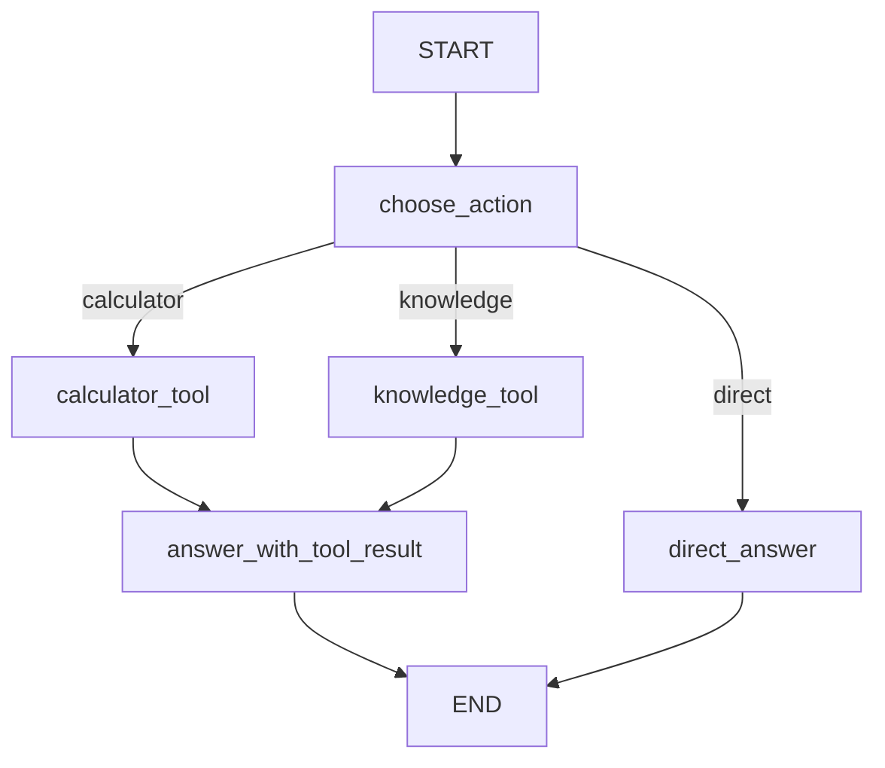

# 第14章-工具调用Agent

## 14.1 先看一个新问题

第 13 章我们已经把 Agent 从“全 Ollama”重构成了混合模型形态：

```text
Ollama 负责快速分类
DeepSeek 负责复杂推理
```

这一步解决了模型能力的问题。复杂问题不再全部交给本地小模型，而是可以交给更强的 DeepSeek。

但它仍然有一个根本限制：模型再强，也不等于真实行动。

例如用户问：

```text
请计算 128 * 32，并说明为什么这个问题不应该只靠大模型心算。
```

如果只让模型回答，它可能直接给出一个数字。大多数时候它会答对，但这不是可靠的工程方法。

原因很简单：

```text
模型是在生成答案，不是在执行计算。
```

再换一个问题：

```text
请读取本地资料，总结 State 和 Node 的区别。
```

如果没有工具，模型并不能真的读取本地资料。它只能凭训练知识和上下文猜测。

这就是本章要解决的问题。

第 13 章解决的是：

```text
哪个模型更适合回答？
```

第 14 章解决的是：

```text
当回答需要真实计算、读取、检索或调用外部能力时，Agent 如何行动？
```

本章继续使用“问题驱动重构法”：

```text
先写一个纯模型 Agent
-> 暴露它不会真实行动的问题
-> 把外部能力拆成工具节点
-> 用 LangGraph 组织 LLM -> Tool -> LLM 的闭环
```

注意，本章 DeepSeek 模型统一使用：

```python
model="deepseek-v4-flash"
```

## 14.2 本章目标

本章要写一个最小工具调用 Agent。

它能做三件事：

1. 判断用户问题是否需要工具。
2. 如果需要工具，就进入对应工具节点。
3. 工具返回结果后，再让模型组织最终回答。

整体流程是：

```text
用户问题
-> DeepSeek 判断动作
-> calculator_tool 或 knowledge_tool
-> DeepSeek 根据工具结果生成回答
```

运行命令：

```bash
python codes/chapter14/chapter14_tool_calling_agent.py
```

期望看到类似输出：

```text
问题：请计算 128 * 32，并说明为什么这个问题不应该只靠大模型心算。
动作：calculator
工具输入：128 * 32
工具结果：计算结果：128 * 32 = 4096

回答：
128 * 32 等于 4096。这个问题适合交给计算器工具，因为工具执行的是确定性计算...
```

这一次，答案中的数字不是模型“猜”出来的，而是工具节点真实算出来的。

这就是工具调用的意义：

> 模型负责理解意图和组织语言，工具负责执行确定性动作。

## 14.3 纯模型回答为什么不够

在没有工具时，我们可能会写出这样的节点：

```python
def answer_with_deepseek(state: State) -> dict:
    response = reasoning_model.invoke(state["question"])
    return {"answer": response.content}
```

这能回答很多问题。

但它有一个隐含假设：

```text
所有问题都可以靠模型生成解决。
```

真实 Agent 不能这么设计。

有些任务需要确定性计算：

```text
128 * 32
```

有些任务需要读取外部资料：

```text
读取本地文档里的第 14 章草稿。
```

有些任务需要调用业务系统：

```text
查询订单状态。
```

有些任务需要访问实时信息：

```text
查询今天的天气。
```

这些任务的共同点是：

```text
答案不应该只来自模型参数，而应该来自某个外部动作的结果。
```

所以本章要把第 13 章的回答节点拆开：

```text
answer_with_deepseek
```

重构成：

```text
choose_action
-> tool_node
-> answer_with_tool_result
```

这个重构让 Agent 从“会回答”走向“会行动”。

## 14.4 工具调用的基本形状

工具调用 Agent 的经典形状是：

```text
LLM -> Tool -> LLM
```

第一次 LLM 调用负责判断：

```text
是否需要工具？
需要哪个工具？
传给工具什么输入？
```

Tool 节点负责执行：

```text
计算、读取、检索、调用 API。
```

第二次 LLM 调用负责整理：

```text
把工具结果转成用户能读懂的回答。
```

用 LangGraph 画出来是：



这张图里有三个关键变化。

第一，模型不再直接回答所有问题。

它先判断是否需要工具。

第二，工具是独立节点。

计算器不是 prompt 的一部分，而是一个真正执行计算的 Python 函数。

第三，工具结果写回 State。

模型的最终回答不是凭空生成，而是读取 `tool_result` 后组织语言。

## 14.5 完整代码

新建文件：

```text
codes/chapter14/chapter14_tool_calling_agent.py
```

先看代码开头部分，完整实现会在后面按节点逐段拆解：

```python
import ast
import json
import operator
import re
from typing import Protocol, TypedDict

from dotenv import load_dotenv
from langchain_core.messages import BaseMessage
from langchain_deepseek import ChatDeepSeek
from langgraph.graph import END, START, StateGraph


class ChatModel(Protocol):
    def invoke(self, input: str) -> BaseMessage:
        ...


class ToolAgentState(TypedDict, total=False):
    question: str
    action: str
    tool_input: str
    tool_result: str
    answer: str


load_dotenv()

reasoning_model: ChatModel = ChatDeepSeek(
    model="deepseek-v4-flash",
    temperature=0,
)
```

先看 State。

```python
class ToolAgentState(TypedDict, total=False):
    question: str
    action: str
    tool_input: str
    tool_result: str
    answer: str
```

这里使用 `total=False`，因为不是每一步都会立刻拥有所有字段。

初始状态只有：

```python
{"question": question}
```

动作选择后才会出现：

```python
{"action": "calculator", "tool_input": "128 * 32"}
```

工具执行后才会出现：

```python
{"tool_result": "计算结果：128 * 32 = 4096"}
```

最终才会出现：

```python
{"answer": "..."}
```

这正好体现了 LangGraph 的状态推进。

## 14.6 工具一：安全计算器

第一个工具是计算器。

不要用 `eval()` 直接执行用户输入。哪怕只是教学示例，也应该从一开始养成边界意识。

本章使用 Python 的 `ast` 解析表达式，只允许数字和基础运算：

```python
def safe_calculate(expression: str) -> str:
    operators = {
        ast.Add: operator.add,
        ast.Sub: operator.sub,
        ast.Mult: operator.mul,
        ast.Div: operator.truediv,
        ast.FloorDiv: operator.floordiv,
        ast.Mod: operator.mod,
        ast.Pow: operator.pow,
        ast.USub: operator.neg,
    }

    def eval_node(node: ast.AST) -> float:
        if isinstance(node, ast.Expression):
            return eval_node(node.body)
        if isinstance(node, ast.Constant) and isinstance(node.value, (int, float)):
            return node.value
        if isinstance(node, ast.BinOp) and type(node.op) in operators:
            return operators[type(node.op)](eval_node(node.left), eval_node(node.right))
        if isinstance(node, ast.UnaryOp) and type(node.op) in operators:
            return operators[type(node.op)](eval_node(node.operand))
        raise ValueError("只支持数字和基础四则运算。")

    tree = ast.parse(expression, mode="eval")
    result = eval_node(tree)
    return str(int(result)) if result == int(result) else str(result)
```

这个工具的职责非常单一：

```text
输入一个数学表达式。
输出一个计算结果。
```

它不负责理解用户问题，也不负责组织自然语言回答。

这就是工具节点的基本原则：

> 工具做确定性动作，不做长篇解释。

## 14.7 工具二：本地知识查询

第二个工具是一个很小的本地知识库：

```python
def search_local_knowledge(query: str) -> str:
    knowledge = {
        "state": "State 是 LangGraph 图运行时携带的共享数据，节点通过读取和更新 State 协作。",
        "node": "Node 是图中的一步工作，通常是一个读取 State 并返回状态更新的函数。",
        "edge": "Edge 描述节点之间的流向，可以是固定边，也可以是条件边。",
        "tool": "Tool 是 Agent 访问外部能力的入口，例如计算器、文件读取、检索或业务 API。",
    }
    lowered_query = query.lower()
    hits = [value for key, value in knowledge.items() if key in lowered_query]
    return "\n".join(hits) if hits else "本地知识库没有找到相关资料。"
```

这个工具很简单，甚至不像真正的 RAG。

但它足够说明一件事：

```text
工具可以把模型连接到外部资料。
```

后面如果要升级，可以把这个函数替换成：

```text
读取 Markdown 文件
-> 查询 SQLite
-> 调用向量数据库
-> 请求公司内部知识库 API
```

LangGraph 图结构可以先不变。

这也是本章的重构思想：先把“查询资料”变成独立工具节点，后面再升级工具内部实现。

## 14.8 动作选择节点

动作选择节点是第一次 LLM 调用：

```python
def choose_action(state: ToolAgentState) -> dict:
    prompt = f"""
你是一个 LangGraph Agent 的动作选择器。
请判断用户问题是否需要工具。

可选动作：
- calculator：需要精确计算
- knowledge：需要查询本地 LangGraph 知识
- direct：不需要工具，可以直接回答

只输出 JSON，不要输出其他文字：
{{"action": "calculator|knowledge|direct", "tool_input": "传给工具的输入"}}

用户问题：{state["question"]}
"""
    response = reasoning_model.invoke(prompt)
    content = response.content.strip()

    try:
        decision = json.loads(content)
        action = decision.get("action", "direct")
        tool_input = decision.get("tool_input", state["question"])
    except json.JSONDecodeError:
        action = "direct"
        tool_input = state["question"]

    if action not in {"calculator", "knowledge", "direct"}:
        action = "direct"

    if action == "calculator":
        match = re.search(r"[-+*/().\d\s]+", tool_input)
        if match:
            tool_input = match.group(0).strip()

    return {"action": action, "tool_input": tool_input}
```

这个节点不执行工具。

它只做决策：

```text
应该直接回答？
还是调用 calculator？
还是调用 knowledge？
```

返回的状态更新类似：

```python
{"action": "calculator", "tool_input": "128 * 32"}
```

这里故意要求模型输出 JSON，是为了让路由函数更容易读取。

但代码仍然保留了兜底逻辑：

```python
except json.JSONDecodeError:
    action = "direct"
```

因为真实模型输出不一定永远听话。教学示例也要让读者看到：只要模型输出参与控制流，就必须考虑解析失败。

## 14.9 条件边：根据动作进入工具

路由函数很短：

```python
def route_after_action(state: ToolAgentState) -> str:
    if state["action"] == "calculator":
        return "calculator_tool"
    if state["action"] == "knowledge":
        return "knowledge_tool"
    return "direct_answer"
```

它读取 `action`，决定下一步去哪。

图里这样注册条件边：

```python
builder.add_conditional_edges(
    "choose_action",
    route_after_action,
    {
        "calculator_tool": "calculator_tool",
        "knowledge_tool": "knowledge_tool",
        "direct_answer": "direct_answer",
    },
)
```

这和第 9 章条件路由的思想完全一致。

区别在于：第 9 章只是根据问题类型走不同回答路径；本章是根据动作选择进入不同工具节点。

可以这样理解：

```text
Edge 让 Agent 决定下一步。
Tool 让 Agent 拥有下一步能做的动作。
```

## 14.10 工具节点：执行动作并写回结果

计算器工具节点：

```python
def calculator_tool(state: ToolAgentState) -> dict:
    try:
        result = safe_calculate(state["tool_input"])
        return {"tool_result": f"计算结果：{state['tool_input']} = {result}"}
    except Exception as exc:
        return {"tool_result": f"计算失败：{exc}"}
```

知识查询工具节点：

```python
def knowledge_tool(state: ToolAgentState) -> dict:
    result = search_local_knowledge(state["tool_input"])
    return {"tool_result": result}
```

这两个节点有一个共同点：

```text
读取 tool_input
-> 执行工具
-> 写入 tool_result
```

它们不直接打印结果，也不直接返回最终答案。

因为工具结果还需要被模型转成面向用户的自然语言回答。

这就是 `LLM -> Tool -> LLM` 中间的 Tool 部分。

工具节点的输出应该尽量清楚、短小、可被下游模型引用：

```python
{"tool_result": "计算结果：128 * 32 = 4096"}
```

不要让工具节点返回一大段混杂格式的内容，否则下游回答节点会更难处理。

## 14.11 最终回答节点

调用工具之后，还需要第二次 LLM 调用：

```python
def answer_with_tool_result(state: ToolAgentState) -> dict:
    prompt = f"""
你是一个 LangGraph 教学助手。
请根据工具结果回答用户问题。

用户问题：{state["question"]}
工具结果：{state["tool_result"]}

要求：
1. 先直接回答。
2. 再用一句话说明工具在这里解决了什么问题。
"""
    response = reasoning_model.invoke(prompt)
    return {"answer": response.content}
```

这个节点读取：

```python
state["question"]
state["tool_result"]
```

然后写入：

```python
{"answer": response.content}
```

注意它不是重新计算，也不是重新查询。

它只是把工具结果组织成用户能理解的回答。

如果问题不需要工具，则直接走：

```python
def direct_answer(state: ToolAgentState) -> dict:
    prompt = f"""
你是一个 LangGraph 教学助手。
请直接回答用户问题，不要声称使用了工具。

用户问题：{state["question"]}
"""
    response = reasoning_model.invoke(prompt)
    return {"answer": response.content}
```

这样，工具路径和直接回答路径就被清楚分开了。

## 14.12 组装完整图

图构建代码如下：

```python
builder = StateGraph(ToolAgentState)

builder.add_node("choose_action", choose_action)
builder.add_node("calculator_tool", calculator_tool)
builder.add_node("knowledge_tool", knowledge_tool)
builder.add_node("answer_with_tool_result", answer_with_tool_result)
builder.add_node("direct_answer", direct_answer)

builder.add_edge(START, "choose_action")
builder.add_conditional_edges(
    "choose_action",
    route_after_action,
    {
        "calculator_tool": "calculator_tool",
        "knowledge_tool": "knowledge_tool",
        "direct_answer": "direct_answer",
    },
)
builder.add_edge("calculator_tool", "answer_with_tool_result")
builder.add_edge("knowledge_tool", "answer_with_tool_result")
builder.add_edge("answer_with_tool_result", END)
builder.add_edge("direct_answer", END)

graph = builder.compile()
```

这张图的主线是：

```text
先决定动作。
如果需要工具，先执行工具，再生成最终回答。
如果不需要工具，直接回答。
```

比第 13 章多出来的不是“更复杂的 prompt”，而是更清晰的职责拆分：

| 节点 | 职责 |
| --- | --- |
| `choose_action` | 判断是否需要工具 |
| `calculator_tool` | 执行确定性计算 |
| `knowledge_tool` | 查询本地知识 |
| `answer_with_tool_result` | 根据工具结果回答 |
| `direct_answer` | 处理不需要工具的问题 |

这就是问题驱动重构的结果。

原来只有一个回答节点：

```text
answer_with_deepseek
```

现在拆成了：

```text
choose_action
-> tool
-> answer_with_tool_result
```

Agent 的能力因此从“会说”扩展成“会做一点事”。

## 14.13 改造前后对比

第 13 章的 Agent 是：

```text
用户问题
-> 分类
-> DeepSeek 回答
```

第 14 章的 Agent 是：

```text
用户问题
-> DeepSeek 判断动作
-> 工具执行
-> DeepSeek 汇总回答
```

两者差异如下：

| 对比项 | 第 13 章 | 第 14 章 |
| --- | --- | --- |
| 核心问题 | 哪个模型负责推理 | Agent 如何使用外部能力 |
| 主要模型 | Ollama + DeepSeek | DeepSeek + 工具节点 |
| DeepSeek 模型名 | `deepseek-v4-flash` | `deepseek-v4-flash` |
| 是否真实执行动作 | 否 | 是 |
| 状态新增字段 | `intent` | `action`、`tool_input`、`tool_result` |
| 控制流 | 固定流程 | 条件边进入不同工具 |
| 典型形状 | LLM 回答 | LLM -> Tool -> LLM |

这个改造带来的关键变化是：

```text
模型不再承担所有责任。
```

模型负责：

```text
理解问题、选择动作、组织回答。
```

工具负责：

```text
计算、查询、读取、调用外部系统。
```

LangGraph 负责：

```text
把模型和工具组织成可观察、可扩展的流程。
```

这才是 Agent 的工程形态。

## 14.14 常见错误与排查

工具调用 Agent 的错误通常出现在四个位置：动作选择、路由、工具执行、最终回答。

| 现象 | 可能原因 | 排查方式 |
| --- | --- | --- |
| 模型没有输出 JSON | prompt 约束不够，或模型输出解释文字 | 保留 JSON 解析兜底，必要时增强 prompt |
| 总是走 `direct_answer` | `action` 解析失败或动作名不合法 | 打印 `response.content` 和 `action` |
| 计算工具报错 | `tool_input` 不是纯表达式 | 检查正则提取后的 `tool_input` |
| 工具结果为空 | 知识库没有命中关键词 | 检查 `search_local_knowledge` 的 key |
| 最终回答忽略工具结果 | prompt 没强调使用 `tool_result` | 在回答节点明确要求基于工具结果 |
| 图编译报错 | 条件边返回值和映射不一致 | 对比 `route_after_action` 和 `add_conditional_edges` |
| DeepSeek 调用失败 | API Key 或模型名错误 | 确认 `.env` 和 `model="deepseek-v4-flash"` |

排查时可以按这条线走：

```text
choose_action 输出了什么
-> action 是否是 calculator / knowledge / direct
-> 条件边进入了哪个节点
-> tool_input 是否符合工具要求
-> tool_result 是否写回 State
-> answer 是否使用了 tool_result
```

这条线对应的正是图的执行路径。

一旦你能沿着 State 追踪这些字段：

```text
question -> action -> tool_input -> tool_result -> answer
```

工具调用 Agent 就不再神秘。

## 14.15 和 ToolNode 的关系

LangGraph 也提供了预构建工具节点，例如 `ToolNode`。在更完整的 Agent 中，模型可以输出标准 `tool_calls`，`ToolNode` 负责执行工具，再把 `ToolMessage` 写回消息列表。

那为什么本章没有一上来就使用 `ToolNode`？

原因是本章的目标不是展示最短写法，而是让读者看清工具调用的骨架：

```text
模型决定动作
-> 图路由到工具
-> 工具执行
-> 结果回到模型
```

如果一开始就使用预构建封装，代码会更短，但读者可能只看到“神奇地调用了工具”，看不清 State、Edge 和 Tool 节点之间的关系。

本章手写工具节点，是为了训练底层理解。

等理解这条主线之后，再使用 `ToolNode` 就很自然：

```text
手写工具节点：适合理解原理和定制流程。
ToolNode：适合标准工具调用和更成熟的 Agent 实现。
```

## 14.16 本章小结

本章继续用问题驱动重构法，把第 13 章的纯回答 Agent 改造成了工具调用 Agent。

重构前：

```text
DeepSeek 直接回答所有问题。
```

重构后：

```text
DeepSeek 先判断动作。
需要工具时，LangGraph 路由到工具节点。
工具结果写回 State。
DeepSeek 再基于工具结果生成回答。
```

读者应该记住三件事：

1. 模型生成不等于真实执行。
2. 工具节点应该做确定性动作，并把结果写回 State。
3. 工具调用 Agent 的基本形状是 `LLM -> Tool -> LLM`。

到这里，我们已经有了三个层次：

```text
第 12 章：Ollama 本地可运行 Agent
第 13 章：Ollama + DeepSeek 的模型后端重构
第 14 章：DeepSeek + 工具节点的行动能力重构
```

下一章会把这些能力合起来，进入多模型协作：Ollama 做轻量路由和本地处理，DeepSeek 做复杂推理，工具节点负责确定性行动。那时 Agent 不再只是“一条工具调用链”，而是一个会分工的系统。
