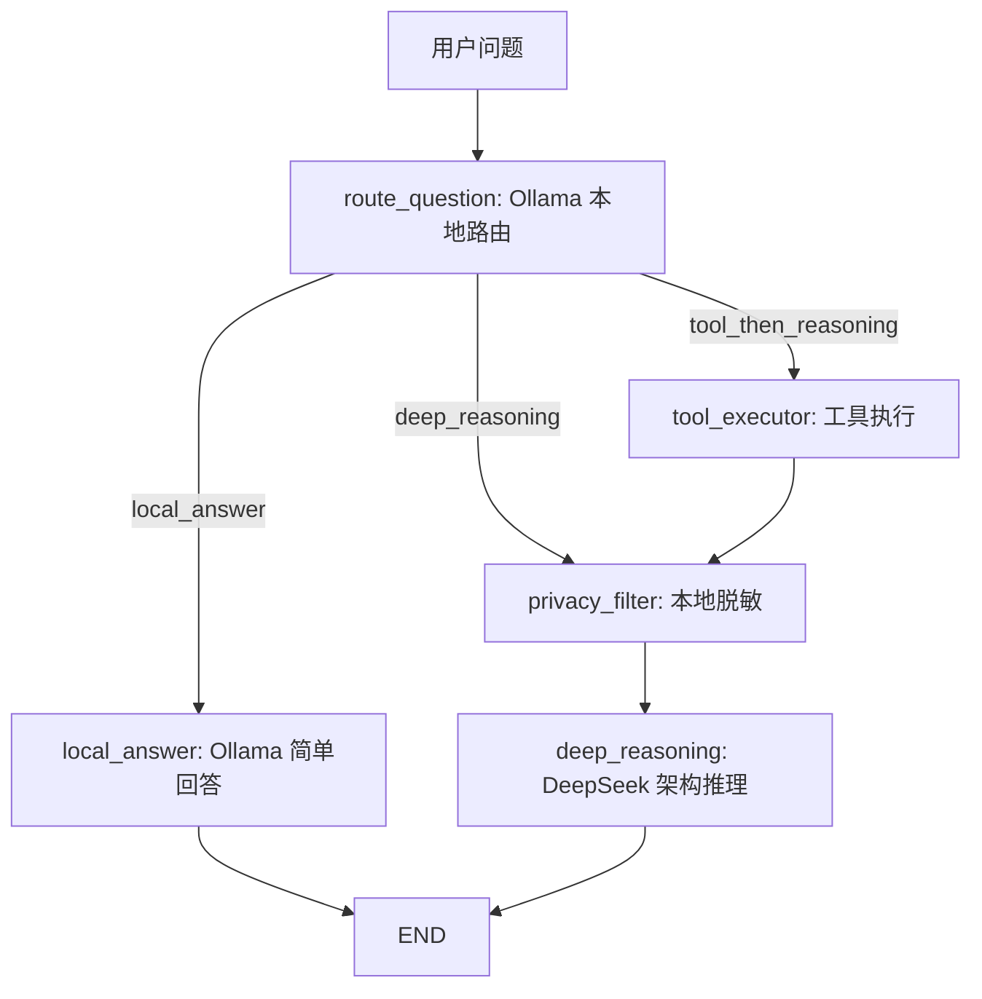

# 第15章-多模型协作

## 15.1 这一章不再只问“怎么接模型”

第 12 章解决了一个基础问题：

```text
如何用 Ollama 构建本地可运行 Agent？
```

第 13 章解决了模型能力问题：

```text
当本地模型推理不够强时，如何接入 DeepSeek？
```

第 14 章解决了行动能力问题：

```text
当模型不能真实计算、读取、检索时，如何接入工具？
```

到这里，我们已经有了三种能力：

```text
Ollama：本地、便宜、适合轻量任务。
DeepSeek：远程、更强、适合复杂推理。
Tool：确定性执行，适合计算、查询、读取和业务动作。
```

但真实 Agent 的难点不只是“有这些能力”，而是：

```text
什么时候用哪个能力？
```

如果所有任务都交给 DeepSeek，质量可能不错，但成本、延迟、隐私都会变成问题。

如果所有任务都交给 Ollama，成本和隐私更好，但复杂规划和严谨推理可能不稳定。

如果所有事情都试图用工具解决，系统会变得笨重，工具边界也会越来越复杂。

所以第 15 章采用“架构权衡法”：

> 先列出真实约束，再比较方案取舍，最后设计一个可解释的多模型协作架构。

这一章的重点不是多接几个模型，而是训练一种 Agent 架构判断：

```text
轻任务本地处理。
复杂任务交给强模型。
确定性动作交给工具。
隐私内容先本地脱敏。
```

## 15.2 本章目标

本章要实现一个小型多模型协作 Agent。

它的流程是：

```text
用户问题
-> Ollama 本地路由
-> 如果简单，Ollama 直接回答
-> 如果需要工具，先执行工具
-> 如果涉及远程推理，先本地脱敏
-> DeepSeek 基于路由信息和工具结果生成最终回答
```

配套代码：

```text
codes/chapter15/chapter15_multi_model_agent.py
```

运行命令：

```bash
python codes/chapter15/chapter15_multi_model_agent.py
```

示例问题是：

```text
我的邮箱是 user@example.com。请计算 128 * 32，并说明这个任务为什么适合 Ollama 路由、工具计算、DeepSeek 总结。
```

期望看到类似输出：

```text
问题：我的邮箱是 user@example.com。请计算 128 * 32...
路由：tool_then_reasoning
路由原因：question contains arithmetic
脱敏问题：我的邮箱是 [EMAIL]。请计算 128 * 32...
工具结果：128 * 32 = 4096

回答：
这个任务适合拆成三步：Ollama 做本地路由，计算器工具给出确定结果，DeepSeek 负责解释架构取舍...
```

注意，本章 DeepSeek 仍然使用：

```python
model="deepseek-v4-flash"
```

## 15.3 先看约束，而不是先选模型

多模型协作最容易写成“模型堆叠”：

```text
先用模型 A。
再用模型 B。
最后用模型 C。
```

这种写法看起来复杂，但不一定合理。

架构设计应该先问约束：

| 约束 | 含义 | 对 Agent 的影响 |
| --- | --- | --- |
| 速度 | 用户是否需要快速反馈 | 简单任务不应都走远程强模型 |
| 成本 | 每次调用是否有费用 | 轻量判断适合本地模型或规则 |
| 隐私 | 输入是否包含敏感信息 | 远程调用前应本地脱敏或过滤 |
| 推理质量 | 是否需要复杂分析 | 复杂规划、审查、权衡适合强模型 |
| 确定性 | 是否需要精确执行 | 计算、查询、写入应交给工具 |
| 可维护性 | 以后是否要替换模型 | 图结构和模型后端要解耦 |

这些约束之间经常互相冲突。

例如：

```text
DeepSeek 推理更强，但远程调用有延迟和隐私成本。
Ollama 本地更可控，但复杂推理可能不稳定。
工具结果更确定，但工具太多会增加工程复杂度。
```

所以本章不是追求“所有任务都用最强模型”，而是追求：

```text
每个节点使用足够合适的能力。
```

这就是架构权衡法的核心。

## 15.4 三种方案对比

在设计多模型 Agent 前，可以先比较三种方案。

**方案一：全 DeepSeek**

```text
用户问题 -> DeepSeek -> 回答
```

优点是简单，推理质量较好。

缺点也明显：

- 简单问题也要远程调用。
- 隐私内容直接发给远程模型。
- 精确计算仍然不是模型的强项。
- 成本和延迟不容易控制。

**方案二：全 Ollama**

```text
用户问题 -> Ollama -> 回答
```

优点是本地可控、成本低、适合学习和原型。

缺点是复杂架构分析、严谨推理、长答案组织可能不稳定。

**方案三：Ollama + Tool + DeepSeek**

```text
用户问题
-> Ollama 路由
-> Tool 执行确定性动作
-> DeepSeek 处理复杂推理
```

这个方案更复杂，但更接近真实 Agent 架构。

| 任务类型 | 推荐能力 |
| --- | --- |
| 简单解释 | Ollama |
| 路由判断 | Ollama |
| 隐私脱敏 | 本地函数或 Ollama |
| 精确计算 | Tool |
| 本地资料查询 | Tool |
| 架构权衡 | DeepSeek |
| 最终复杂回答 | DeepSeek |

本章选择方案三。

不是因为它最炫，而是因为它能把第四部分前三章的能力组织起来。

## 15.5 最终架构图

本章 Agent 的结构如下：



这张图体现了四个分工原则。

第一，Ollama 放在入口处。

它先判断问题应该走哪条路径。这样简单任务不必马上进入远程强模型。

第二，工具放在确定性动作处。

如果问题需要计算，工具先给出确定结果，模型不再靠“心算”生成数字。

第三，隐私过滤放在远程模型之前。

只要后续可能调用 DeepSeek，就先在本地做脱敏。

第四，DeepSeek 放在复杂推理处。

它不负责所有事情，而是负责最需要推理质量的那一段。

## 15.6 完整代码开头

新建文件：

```text
codes/chapter15/chapter15_multi_model_agent.py
```

先看代码开头：

```python
import ast
import json
import operator
import re
from typing import Protocol, TypedDict

from dotenv import load_dotenv
from langchain_core.messages import BaseMessage
from langchain_deepseek import ChatDeepSeek
from langchain_ollama import ChatOllama
from langgraph.graph import END, START, StateGraph
```

这次同时引入了：

```python
from langchain_ollama import ChatOllama
from langchain_deepseek import ChatDeepSeek
```

因为这一章不再是单模型 Agent。

模型对象定义如下：

```python
load_dotenv()

fast_model: ChatModel = ChatOllama(
    model="qwen3:4b",
    temperature=0,
)

reasoning_model: ChatModel = ChatDeepSeek(
    model="deepseek-v4-flash",
    temperature=0,
)
```

这里仍然按职责命名：

```text
fast_model：快，便宜，本地，适合路由和简单回答。
reasoning_model：推理更强，适合复杂分析和最终解释。
```

不要把变量命名成 `model1`、`model2`。多模型系统最怕职责不清。

## 15.7 State 设计

本章 State 如下：

```python
class MultiModelState(TypedDict, total=False):
    question: str
    route: str
    route_reason: str
    sanitized_question: str
    tool_result: str
    answer: str
```

这些字段对应一次多模型协作的中间状态：

| 字段 | 作用 |
| --- | --- |
| `question` | 用户原始问题 |
| `route` | Ollama 选择的执行路径 |
| `route_reason` | 路由原因 |
| `sanitized_question` | 本地脱敏后的问题 |
| `tool_result` | 工具执行结果 |
| `answer` | 最终回答 |

这比第 14 章多了两个架构字段：

```text
route
route_reason
```

为什么要保存路由原因？

因为多模型 Agent 不只要能运行，还要能解释自己为什么选择某条路径。

如果一个问题被错误地送到 DeepSeek，或者一个本该调用工具的问题被本地模型直接回答，`route_reason` 就是排查入口。

## 15.8 本地路由节点

本地路由节点使用 Ollama：

```python
def route_question(state: MultiModelState) -> dict:
    prompt = f"""
You are a router for a LangGraph multi-model agent.
Choose exactly one route:
- local_answer: simple explanation, low risk, no external tool
- tool_then_reasoning: needs exact calculation or local tool result
- deep_reasoning: needs architecture tradeoff, planning, review, or complex reasoning

Return JSON only:
{{"route": "local_answer|tool_then_reasoning|deep_reasoning", "route_reason": "short reason"}}

User question: {state["question"]}
"""
    response = fast_model.invoke(prompt)
    content = response.content.strip()
```

它输出三个可能路线：

| 路线 | 含义 |
| --- | --- |
| `local_answer` | 简单问题，本地模型直接回答 |
| `tool_then_reasoning` | 先用工具，再让强模型总结 |
| `deep_reasoning` | 直接进入远程强模型推理 |

代码还保留了兜底规则：

```python
except json.JSONDecodeError:
    question = state["question"].lower()
    if re.search(r"\d+\s*[-+*/]\s*\d+", question):
        route = "tool_then_reasoning"
        route_reason = "question contains arithmetic"
    elif any(word in question for word in ["tradeoff", "architecture", "架构", "权衡", "推理"]):
        route = "deep_reasoning"
        route_reason = "question asks for architecture reasoning"
    else:
        route = "local_answer"
        route_reason = "question looks simple"
```

这体现了一个工程原则：

> 路由节点可以使用模型，但不能完全依赖模型听话。

路由一旦错了，后面的流程都会错。所以模型路由最好配合规则兜底、日志和可观测性。

## 15.9 条件边：把架构选择落到路径上

路由函数如下：

```python
def route_after_router(state: MultiModelState) -> str:
    if state["route"] == "local_answer":
        return "local_answer"
    if state["route"] == "tool_then_reasoning":
        return "tool_executor"
    return "privacy_filter"
```

图里这样连接：

```python
builder.add_conditional_edges(
    "route_question",
    route_after_router,
    {
        "local_answer": "local_answer",
        "tool_executor": "tool_executor",
        "privacy_filter": "privacy_filter",
    },
)
```

这一步非常关键。

架构权衡不是写在文档里的口号，而是变成了图上的分支：

```text
简单问题 -> 本地回答
需要工具 -> 工具执行
复杂推理 -> 本地脱敏 -> DeepSeek
```

当设计原则进入图结构，它才真正约束程序行为。

## 15.10 本地回答节点

简单问题直接由 Ollama 回答：

```python
def local_answer(state: MultiModelState) -> dict:
    prompt = f"""
Answer briefly as a LangGraph teaching assistant.
Keep the answer simple and practical.

Question: {state["question"]}
"""
    response = fast_model.invoke(prompt)
    return {"answer": response.content}
```

这条路径的价值是：

```text
快。
便宜。
不需要远程调用。
```

例如：

```text
用一句话解释 Node 是什么。
```

这种问题不必每次都交给 DeepSeek。

多模型协作不是“强模型不用”，而是“强模型用在值得的地方”。

## 15.11 工具执行节点

如果路由判断需要工具，就进入：

```python
def tool_executor(state: MultiModelState) -> dict:
    expression_match = re.search(r"[-+*/().\d\s]+", state["question"])
    if not expression_match:
        return {"tool_result": "No arithmetic expression was found."}

    expression = expression_match.group(0).strip()
    try:
        result = safe_calculate(expression)
        return {"tool_result": f"{expression} = {result}"}
    except Exception as exc:
        return {"tool_result": f"Tool execution failed: {exc}"}
```

它只做一件事：

```text
把确定性计算结果写入 tool_result。
```

然后图会继续进入 `privacy_filter`，再进入 `deep_reasoning`。

为什么工具之后还要进入 DeepSeek？

因为工具只给出事实结果：

```text
128 * 32 = 4096
```

但用户还问了：

```text
为什么这个任务适合 Ollama 路由、工具计算、DeepSeek 总结？
```

这需要架构解释。工具不能替代推理模型。

## 15.12 本地隐私过滤

本章加入一个简单脱敏函数：

```python
def mask_private_info(text: str) -> str:
    text = re.sub(r"[\w.+-]+@[\w-]+\.[\w.-]+", "[EMAIL]", text)
    text = re.sub(r"\b1[3-9]\d{9}\b", "[PHONE]", text)
    return text
```

进入 DeepSeek 之前，先经过：

```python
def privacy_filter(state: MultiModelState) -> dict:
    source = state.get("sanitized_question", state["question"])
    return {"sanitized_question": mask_private_info(source)}
```

这只是一个教学级脱敏示例，不是完整隐私系统。

但它表达了关键架构原则：

> 能在本地处理的敏感内容，先在本地处理，再交给远程模型。

如果用户输入：

```text
我的邮箱是 user@example.com。请计算 128 * 32...
```

传给 DeepSeek 的问题会变成：

```text
我的邮箱是 [EMAIL]。请计算 128 * 32...
```

这就是本地模型和本地函数在多模型架构里的另一种价值：不只是省钱，也是在远程调用前建立边界。

## 15.13 DeepSeek 推理节点

最终复杂回答交给 DeepSeek：

```python
def deep_reasoning(state: MultiModelState) -> dict:
    question = state.get("sanitized_question", state["question"])
    tool_result = state.get("tool_result", "No tool was used.")

    prompt = f"""
You are a LangGraph architecture mentor.
Answer the question using clear tradeoffs.

Route selected by local model: {state["route"]}
Route reason: {state["route_reason"]}
Question: {question}
Tool result: {tool_result}

Please include:
1. Direct recommendation.
2. Why this model/tool split is appropriate.
3. What tradeoff remains.
"""
    response = reasoning_model.invoke(prompt)
    return {"answer": response.content}
```

这里传入了四类信息：

| 信息 | 作用 |
| --- | --- |
| `route` | 告诉 DeepSeek 前面选择了哪条路径 |
| `route_reason` | 解释为什么这样路由 |
| `question` | 脱敏后的用户问题 |
| `tool_result` | 工具执行结果 |

这样 DeepSeek 不只是回答问题，还能基于前面的架构决策进行解释。

这就是多模型协作和普通模型调用的差别：

```text
普通调用：模型只看到用户问题。
协作调用：模型看到路由、工具结果、脱敏后的问题和架构上下文。
```

## 15.14 组装完整图

完整图构建如下：

```python
builder = StateGraph(MultiModelState)

builder.add_node("route_question", route_question)
builder.add_node("local_answer", local_answer)
builder.add_node("tool_executor", tool_executor)
builder.add_node("privacy_filter", privacy_filter)
builder.add_node("deep_reasoning", deep_reasoning)

builder.add_edge(START, "route_question")
builder.add_conditional_edges(
    "route_question",
    route_after_router,
    {
        "local_answer": "local_answer",
        "tool_executor": "tool_executor",
        "privacy_filter": "privacy_filter",
    },
)
builder.add_edge("tool_executor", "privacy_filter")
builder.add_edge("privacy_filter", "deep_reasoning")
builder.add_edge("local_answer", END)
builder.add_edge("deep_reasoning", END)

graph = builder.compile()
```

这张图把第四部分的能力合在了一起：

```text
第 12 章：Ollama 本地模型
第 13 章：DeepSeek 强模型
第 14 章：工具节点
第 15 章：按架构权衡组织它们
```

可以说，第 15 章的重点不是新增一个 API，而是改变组织方式。

## 15.15 架构权衡总结

这个多模型 Agent 的取舍可以总结成一张表：

| 节点 | 使用能力 | 选择原因 | 代价 |
| --- | --- | --- | --- |
| `route_question` | Ollama | 本地、快、适合轻量判断 | 路由可能不稳定，需要兜底 |
| `local_answer` | Ollama | 简单问题低成本回答 | 复杂问题质量有限 |
| `tool_executor` | Python 工具 | 计算结果确定 | 工具能力需要手动维护 |
| `privacy_filter` | 本地函数 | 远程调用前降低隐私风险 | 示例级脱敏不完整 |
| `deep_reasoning` | DeepSeek | 适合复杂解释和架构权衡 | 有延迟、成本和远程依赖 |

这张表比“用了两个模型”更重要。

因为架构不是组件堆叠，而是取舍后的安排。

一个成熟 Agent 设计里，每个节点都应该能回答：

```text
为什么是这个模型？
为什么在这个位置？
为什么不交给另一个能力？
失败时怎么兜底？
```

第 15 章只是一个小例子，但它给出了判断框架。

## 15.16 常见错误与排查

多模型 Agent 的错误比单模型更多，因为它多了路由和协作边界。

| 现象 | 可能原因 | 排查方式 |
| --- | --- | --- |
| 简单问题走了 DeepSeek | 路由模型判断过度保守 | 查看 `route` 和 `route_reason` |
| 复杂问题被本地回答 | 路由 prompt 或兜底规则太弱 | 增加复杂任务关键词或评估规则 |
| 工具没有执行 | 路由没有进入 `tool_then_reasoning` | 检查数学表达式或动作分类 |
| DeepSeek 收到敏感信息 | 没有经过 `privacy_filter` | 检查图边是否绕过脱敏节点 |
| 最终回答没引用工具结果 | prompt 没强调 `tool_result` | 检查 `deep_reasoning` 的输入 |
| 本地模型不可用 | Ollama 未启动或模型未拉取 | 先运行第 12 章示例 |
| 远程模型不可用 | API Key 或模型名错误 | 确认 `DEEPSEEK_API_KEY` 和 `deepseek-v4-flash` |

排查时沿着这条线：

```text
question
-> route / route_reason
-> tool_result 或 sanitized_question
-> deep_reasoning 输入
-> answer
```

如果每一步 State 都能解释清楚，多模型协作就不会变成黑盒。

## 15.17 本章小结

本章用“架构权衡法”完成了第四部分的收束。

前几章分别获得能力：

```text
第 12 章：接入 Ollama，本地可运行。
第 13 章：接入 DeepSeek，增强复杂推理。
第 14 章：接入工具，获得行动能力。
```

第 15 章把这些能力组织成一个协作系统：

```text
Ollama 负责入口路由和简单回答。
工具负责确定性执行。
本地函数负责隐私脱敏。
DeepSeek 负责复杂推理和最终解释。
LangGraph 负责把这一切组织成可观察的状态图。
```

读者应该记住的不是某个具体模型名字，而是这条架构原则：

> 多模型 Agent 的核心不是“用更多模型”，而是把每个任务放到最合适的能力边界里。

到这里，第四部分已经完成了从单模型到多模型、从回答到行动、从调用到架构的升级。

下一部分可以进一步深入 LangGraph 内部原理：为什么这些节点、边、状态更新和工具结果能够被稳定组织起来，底层 Pregel 运行时、Channel 和 Checkpoint 又是如何支撑这一切的。
